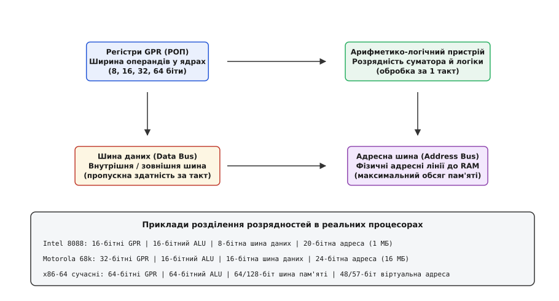
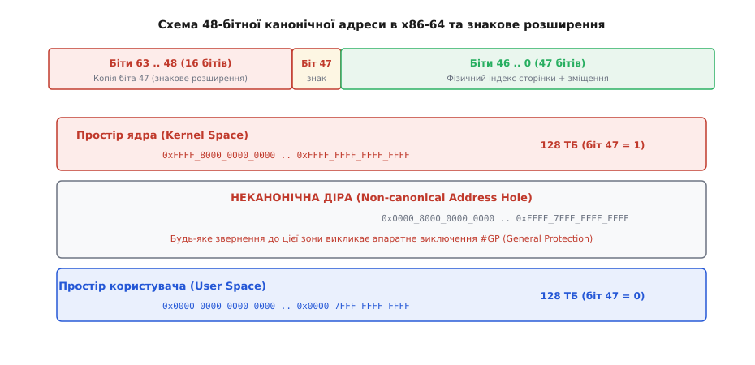
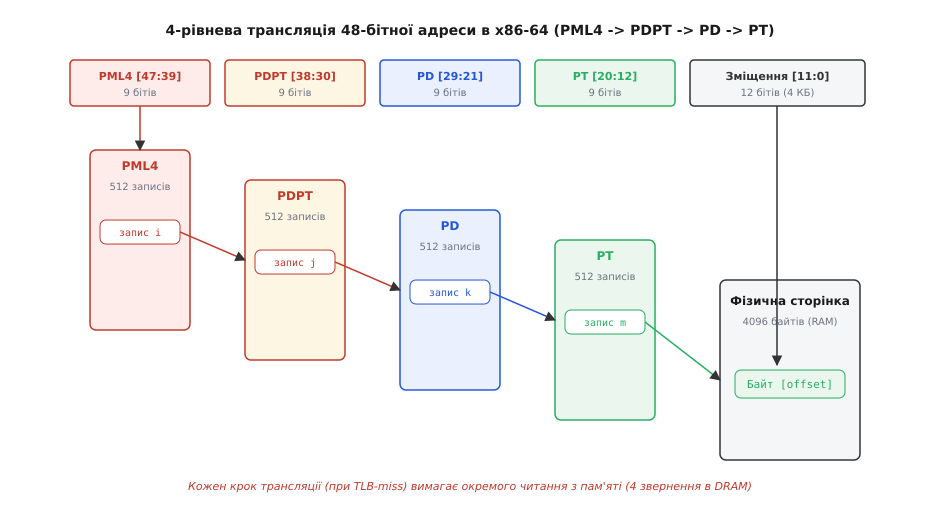
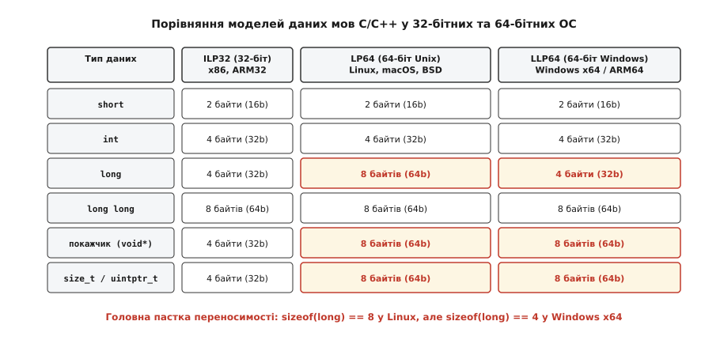
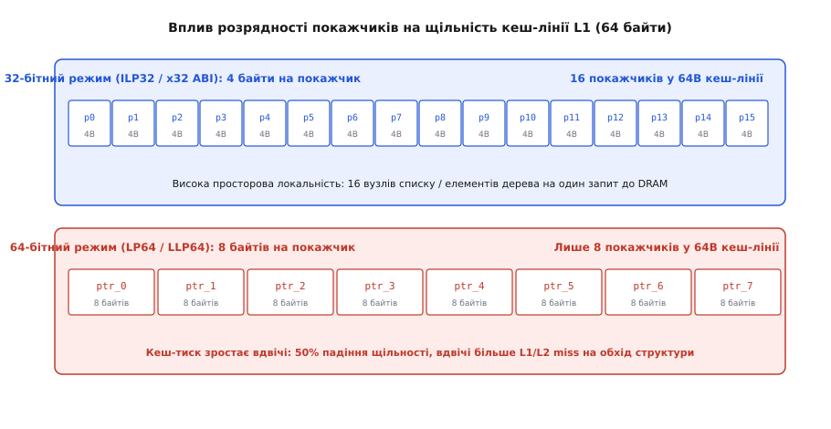

# Розрядність процесора: фізична ширина ліній, адресація та моделі пам'яті

<preknowlist>
- [Що таке процесор](topic:hw-arch/what-is-processor) — базова модель машини, що вибирає та виконує інструкції над даними.
- [Складові процесора](topic:hw-arch/processor-parts) — регістри, АЛП, пристрій керування та внутрішні шини зв'язку.
- [Біти й порядок байтів](topic:sf-algorithms/bits-bytes-endianness) — двійкове кодування чисел, байти та машинне слово.
- [Віртуальна пам'ять](topic:hw-arch/virtual-memory) — ізоляція адресних просторів через сторінкову трансляцію MMU.
</preknowlist>

Коли програміст оголошує покажчик `void* ptr;` або виконує додавання двох чисел, на кристалі кремнію спрацьовують електричні сигнали, що передаються паралельними металевими доріжками. Якщо процесор називають «64-бітним», виникає природне припущення, що кожен вузол, кожна шина і кожен регістр усередині чіпа мають ширину рівно 64 провідники. Проте погляд на фізичну будову мікросхеми одразу спростовує цю ілюзію: адресні лінії сучасного процесора x86-64 рідко перевищують 48 або 52 фізичні виводи, зовнішня шина пам'яті передає дані блоками по 64 або 128 бітів за канал, а внутрішні векторні регістри мають ширину 256 (AVX2) або 512 бітів (AVX-512).

У 1978 році процесор Intel 8088 мав 16-бітні регістри, 8-бітну зовнішню шину даних і 20-бітну шину адреси. Процесор Motorola 68000 у 1979 році поєднував 32-бітні регістри з 16-бітним арифметико-логічним пристроєм та 24-бітною адресною шиною. Термін «розрядність» (англ. *word size*, *bitness*; від праслов'янського *rędъ* «ряд, порядок») описує не єдине число, а архітектурний договір між чотирма незалежними апаратними підсистемами процесора.


*Розрядність процесора визначається чотирма окремими фізичними параметрами, які в реальних мікроархітектурах можуть мати різну ширину.*

## Чотири виміри розрядності на рівні заліза

Щоб зрозуміти поведінку машини, необхідно розділити процесор на чотири апаратні контури, кожен із яких має власну фізичну ширину ліній зв'язку:

1. **Ширина регістрів загального призначення (GPR, РОП — регістри загального призначення):**
   Регістри — це найшвидша пам'ять, розташована безпосередньо всередині ядра процесора. Їхня розрядність визначає розмір одного базового машинного слова (англ. *machine word*), яке ядро здатне зберегти, завантажити чи передати як єдиний неподільний операнд. Коли архітектуру називають 32-бітною чи 64-бітною, найчастіше мають на увазі саме розрядність регістрів `GPR` (`EAX`/`EBX` у 32-бітній x86 або `RAX`/`RBX` у 64-бітній x86-64).

2. **Розрядність арифметико-логічного пристрою (АЛП, англ. *arithmetic logic unit*, ALU):**
   АЛП містить кремнієві схеми суматорів, логічних вентилів та бітових зсувачів (*barrel shifters*). Розрядність АЛП визначає, над числами якої розрядності процесор виконує базову арифметичну операцію за один машинний такт без використання програмних циклів з переносом розрядів. Якщо розрядність АЛП менша за розмір регістрів (як у Motorola 68000, де 32-бітні регістри обслуговувалися 16-бітним суматором), 32-бітна операція додавання розбивається пристроєм керування на два послідовні 16-бітні мікрокроки.

3. **Ширина шини даних (Data Bus):**
   Шина даних — це сукупність фізичних провідників, якими біти передаються між процесорним ядром, внутрішніми кешами та контролером оперативної пам'яті. Ширина шини даних визначає пропускну здатність підсистеми пам'яті за один такт обміну. Наприклад, процесор Intel Pentium (1993 рік) залишався 32-бітним за регістрами та АЛП, проте отримав 64-бітну зовнішню шину даних. Це дозволило йому за один такт шини завантажувати одразу 8 байтів і вдвічі швидше наповнювати 32-байтні лінії кешу першого рівня.

4. **Ширина адресної шини (Address Bus):**
   Шина адреси складається з фізичних ліній, якими процесор виставляє двійковий номер комірки пам'яті, до якої він звертається для читання чи запису. Кількість ліній адресної шини `N` встановлює абсолютну фізичну межу обсягу оперативної пам'яті, яку процесор здатний підключити:
   ```
   максимальний_обсяг_пам'яті = 2ⁿ байтів
   ```

Розділення цих чотирьох понять пояснює, чому створення мікропроцесорів завжди було мистецтвом інженерного компромісу: інженери робили шину даних вужчою заради зменшення кількості ніжок на корпусі мікросхеми та здешевлення материнських плат (як в Intel 8088), або робили шину адреси ширшою за внутрішні регістри для підтримки більшого обсягу пам'яті.

## Еволюція розрядності: гонитва за адресним простором

Головною рушійною силою збільшення розрядності в історії обчислювальної техніки була не потреба оперувати астрономічними числами в арифметиці, а невпинне вичерпання **адресного простору**. Арифметику довільної точності завжди можна реалізувати програмно на процесорі будь-якої розрядності за допомогою прапорця переносу `Carry Flag`. Проте неможливість зберегти адресу потрібної комірки пам'яті в одному цілісному регістрі перетворює програмування на складний лабіринт сегментних перемикань.


*Зростання розрядності адреси забезпечило експоненційне розширення доступного обсягу пам'яті на кожному етапі розвитку мікропроцесорів.*

У 8-бітну епоху (MOS 6502, Zilog Z80) процесори мали 8-бітні регістри даних, здатні зберігати числа від 0 до 255. Проте 256 байтів пам'яті було замало для практичних задач. Інженери вивели назовні 16 адресних ліній, що дозволило адресувати:
```
2¹⁶ = 65 536 байтів = 64 КБ
```
Щоб звернутися до пам'яті, 8-бітному процесору доводилося склеювати два окремі 8-бітні регістри в пару (наприклад, `HL`).

У 16-бітну епоху (Intel 8086) регістри стали 16-бітними, проте пам'ять знову впиралася в межу 64 КБ. Щоб підключити 1 МБ оперативної пам'яті, Intel застосувала схему 20-бітної сегментної адресації (`сегмент × 16 + зміщення`). Це породило поняття «близьких» і «далеких» покажчиків (`near` та `far` pointers), що вимагало від компіляторів генерувати громіздкий код перемикання сегментних регістрів.

Справжня революція відбулася у 1985 році з виходом 32-бітного процесора Intel 80386. Процесор отримав плоску лінійну адресацію: кожен регістр загального призначення мав розрядність 32 біти і міг напряму адресувати будь-який байт у просторі:
```
2³² = 4 294 967 296 байтів = 4 ГБ
```

Протягом майже двадцяти років обсяг 4 ГБ здавався безмежним. Проте наприкінці 1990-х років сервери баз даних, наукові симуляції та комп'ютерна графіка впритул наблизилися до 4-гігабайтного бар'єра. Більше того, операційні системи зазвичай ділили 32-бітний адресний простір між ядром та користувацьким процесом (наприклад, 2 ГБ для ядра і 2 ГБ для програми у 32-бітній Windows NT, або 1 ГБ для ядра і 3 ГБ для процесу в 32-бітному Linux). Це означало, що жодна програма не могла виділити для своїх даних більше 2–3 ГБ пам'яті, навіть якщо на материнській платі було встановлено більше фізичної пам'яті.

Детальний опис історичної боротьби між радикальною концепцією Intel Itanium та еволюційним підходом AMD64 наведено у вставці [історія переходу розрядностей](topic:hw-arch/processor-word-size/hist-evolution-to-64bit.md).

## Спроба порятунку 32-біт: розширення фізичних адрес (PAE)

Перш ніж остаточно перейти до 64-бітних процесорів, інженери спробували подовжити життя 32-бітним серверам за допомогою апаратного механізму **PAE** (*Physical Address Extension*, розширення фізичних адрес, з'явилося в Intel Pentium Pro у 1995 році).

Процесор отримав **36 фізичних адресних ліній**, що дозволило материнській платі підтримувати до:
```
2³⁶ = 68 719 476 736 байтів = 64 ГБ фізичної пам'яті RAM
```

Таблиці сторінок було перебудовано на 3-рівневу структуру, де кожен запис збільшився з 4 до 8 байтів. Проте PAE не змінив головного: **розрядність регістрів і покажчиків процесу залишилася 32-бітною**. Окремий користувацький процес, як і раніше, міг одночасно бачити лише 4 ГБ пам'яті. Щоб задіяти інші гігабайти із 64 ГБ пулу, програма була змушена використовувати спеціальні незручні API віконного відображення пам'яті (наприклад, `AWE` у Windows або виклики `mmap` у Linux), що знову відкидало розробників до проблем сегментації.

PAE став паліативним засобом для серверів, але не врятував 32-бітну архітектуру від неминучого переходу на 64-бітні покажчики.

## 64-бітна реальність: канонічні адреси в x86-64

Теоретичний 64-бітний адресний простір дорівнює:
```
2⁶⁴ = 18 446 744 073 709 551 616 байтів = 16 Ексбібайтів (16 ЕБ ≈ 18.44 мільярда ГБ)
```

Цей обсяг настільки колосальний, що сучасні напівпровідникові технології не потребують його повної реалізації у фізичному кремнії. Якби виробники вивели всі 64 фізичні лінії адреси на корпус процесора, це призвело б до невиправданого розростання розмірів чіпа, ускладнення розведення материнських плат та значного збільшення енергоспоживання.

Крім того, трансляція повної 64-бітної віртуальної адреси через сторінкові таблиці вимагала б 7 або 8 рівнів вкладеності, що катастрофічно сповільнило б доступ до пам'яті при кожному промаху повз буфер трансляції TLB.

Тому архітектура AMD64 (x86-64) запровадила концепцію **канонічної адреси** (англ. *canonical address*; від грец. *kanon* «правило, мірило»).

У стандартній реалізації x86-64 віртуальна адреса використовує лише **молодші 48 бітів**, що забезпечує адресний простір розміром:
```
2⁴⁸ = 281 474 976 710 656 байтів = 256 Терабайтів (256 ТБ)
```


*Канонічна адреса вимагає копіювання біта 47 у старші біти 48..63, що ділить пам'ять на простір користувача, простір ядра та заборонену проміжну діру.*

Правило канонічності формулюється так: **біти з 48 по 63 зобов'язані бути точною копією біта 47 (знакове розширення біта 47)**.

Це правило розбиває весь 64-бітний простір адрес на три чітко розмежовані зони:

1. **Нижній канонічний простір (User Space):**
   Біт 47 дорівнює 0. Відповідно, всі біти з 48 по 63 мають бути нулями. Діапазон адрес:
   ```
   0x0000_0000_0000_0000 .. 0x0000_7FFF_FFFF_FFFF  (128 ТБ)
   ```
   Цей простір віддається під користувацькі процеси (код програми, стек, динамічну купу та завантажені спільні бібліотеки).

2. **Верхній канонічний простір (Kernel Space):**
   Біт 47 дорівнює 1. Відповідно, всі біти з 48 по 63 мають бути одиницями. Діапазон адрес:
   ```
   0xFFFF_8000_0000_0000 .. 0xFFFF_FFFF_FFFF_FFFF  (128 ТБ)
   ```
   Цей простір закріплено за ядром операційної системи (структури ядра, відображення фізичної пам'яті, драйвери пристроїв).

3. **Неканонічна адресна діра (Non-canonical Hole):**
   Величезний діапазон адрес між двома канонічними половинами:
   ```
   0x0000_8000_0000_0000 .. 0xFFFF_7FFF_FFFF_FFFF  (близько 16 ЕБ мінус 256 ТБ)
   ```
   Якщо програма спробує виконати читання, запис або передачу керування за адресою, що потрапляє в цю діру (наприклад, якщо старші 16 бітів не є точним продовженням 47-го біта), блок керування пам'яттю MMU негайно фіксує апаратну помилку і генерує виключення загального захисту **#GP** (*General Protection Fault*, `SIGSEGV` у Linux).

Сучасні серверні процесори (починаючи з Intel Ice Lake та AMD Zen 4) отримали підтримку розширення **5-level Paging** (PML5 / LA57), яке збільшує віртуальну адресу до **57 бітів** (`2⁵⁷ = 128 ПБ`), а знакове розширення виконується з 56-го біта.

> 🔧 **Навіщо це.** Правило канонічності захищає архітектуру від фатальної помилки минулого: в епоху Motorola 68000 та ранніх 32-бітних процесорів програмісти помітили, що старші 8 бітів 32-бітного покажчика не використовуються апаратурою, і почали зберігати там службові прапорці (*pointer tagging*). Коли з'явилися повноцінні 32-бітні шини, старий код масово зламався. Знакове розширення в x86-64 жорстко забороняє використовувати невикористані біти під довільні дані: якщо в майбутньому процесор розширить адресний простір з 48 до 57 чи 64 бітів, старий коректний код продовжить працювати без модифікацій.

## Багаторівнева трансляція: механізм 4-level та 5-level Paging

Як процесор транслює 48-бітну або 57-бітну канонічну віртуальну адресу у фізичну адресу на планці пам'яті RAM?

Стандартний розмір сторінки пам'яті в архітектурі x86 становить **4 КБ (4096 байтів)**. Щоб адресувати будь-який байт усередині однієї 4-кілобайтної сторінки, потрібно:
```
2¹² = 4096 байтів → 12 бітів зміщення (Offset)
```

Решта `48 - 12 = 36` бітів віртуальної адреси визначають номер сторінки. У 32-бітній архітектурі для трансляції вистачало двох рівнів таблиць. У 64-бітній архітектурі 36 бітів діляться порівну на **4 рівні по 9 бітів кожен**:

```
 47      39 38      30 29      21 20      12 11            0
+----------+----------+----------+----------+---------------+
|   PML4   |   PDPT   |    PD    |    PT    |    Offset     |
|  9 бітів |  9 бітів |  9 бітів |  9 бітів |   12 бітів    |
+----------+----------+----------+----------+---------------+
```


*Трансляція 48-бітної віртуальної адреси у фізичну вимагає проходження чотирьох рівнів таблиць сторінок: PML4, PDPT, PD та PT.*

Кожен 9-бітний індекс вибирає один запис із 512 можливих:
```
2⁹ = 512 записів у таблиці
```
Оскільки кожен запис таблиці сторінок (PTE — *Page Table Entry*) має розмір 8 байтів (64 біти), загальний розмір таблиці будь-якого рівня становить:
```
512 записів × 8 байтів = 4096 байтів = 4 КБ
```
Розмір таблиці кожного рівня ідеально збігається з розміром однієї фізичної сторінки.

Покроковий ланцюг трансляції адреси апаратним блоком MMU:
1. Регістр процесора `CR3` зберігає фізичну адресу кореневої таблиці **PML4** (*Page Map Level 4*).
2. Біти `[47:39]` слугують індексом у таблиці PML4. Запис вказує на фізичну адресу таблиці другого рівня — **PDPT** (*Page Directory Pointer Table*).
3. Біти `[38:30]` вибирають запис у PDPT, який посилається на таблицю третього рівня — **PD** (*Page Directory*).
4. Біти `[29:21]` вибирають запис у PD, який вказує на таблицю четвертого рівня — **PT** (*Page Table*).
5. Біти `[20:12]` вибирають фінальний запис у таблиці PT, який містить фізичну базову адресу цільової сторінки в оперативній пам'яті.
6. Молодші біти `[11:0]` додаються до знайденої базової адреси як пряме зміщення до потрібного байта.

У 5-рівневому пейджингу (PML5) зверху додається ще один 9-бітний індекс `[56:48]`, що посилається на таблицю PML5. Це збільшує віртуальний простір до 128 Петабайтів, проте підвищує штраф за промах TLB до **5 послідовних звернень до DRAM**.

## Адресація в архітектурі ARM64 (AArch64)

В архітектурі ARM64 керування адресним простором реалізовано дещо інакше, ніж в x86-64.

Замість одного регістра `CR3` та жорсткого знакового розширення, процесор ARM64 використовує два незалежні базові регістри сторінкових таблиць:
1. **`TTBR0_EL1` (Translation Table Base Register 0):** Відповідає за простір користувача (адреси, що починаються з нулів: `0x0000...`).
2. **`TTBR1_EL1` (Translation Table Base Register 1):** Відповідає за простір ядра операційної системи (адреси, що починаються з одиниць: `0xFFFF...`).

Регістр конфігурації трансляції `TCR_EL1` дозволяє операційній системі динамічно налаштовувати розмір віртуальної адреси через поля `T0SZ` та `T1SZ`. Наприклад, якщо системі потрібно лише 39 бітів адреси (512 ГБ), вона встановлює розмір віртуального простору в 39 бітів і скорочує глибину сторінкових таблиць до 3 рівнів, заощаджуючи оперативну пам'ять та зменшуючи затримку трансляції.

## Як розрядність кодується в інструкціях: префікс REX та обнулення регістрів

Цікавим апаратним питанням є те, як процесор x86-64 розрізняє, коли інструкція має виконати 32-бітну дію, а коли 64-бітну.

В архітектурі AMD64 для збереження компактності коду дефолтний розмір операндів у більшості інструкцій залишився **32-бітним**. Щоб виконати операцію над 64-бітними регістрами (наприклад, `add rax, rbx`), асемблер додає перед кодом операції однобайтний префікс — **REX-префікс** (байти в діапазоні `0x40 .. 0x4F`).
- Біт `REX.W` (Width) перемикає розрядність операнда з 32 на 64 біти.
- Біти `REX.R`, `REX.X`, `REX.B` дозволяють адресувати додаткові 8 регістрів (`R8`..`R15`).

Особливе апаратне правило x86-64 стосується запису в 32-бітні молодші половини регістрів (`EAX`, `EBX` тощо): **будь-яка інструкція, яка записує результат у 32-бітний регістр, автоматично обнуляє старші 32 біти відповідного 64-бітного регістра**.

Наприклад:
```asm
mov eax, 5     ; записує 5 в EAX і АВТОМАТИЧНО записує нулі в біти 63..32 регістра RAX
```

Це апаратне рішення позбавило процесор паразитної залежності за даними (*partial register stall*), яка сповільнювала 16-бітні операції в 32-бітному режимі: коли ядро бачить запис у 32-бітний регістр, воно не чекає на попереднє значення 64-бітного регістра, а миттєво перезаписує весь регістр цілком у конвеєрі перейменування регістрів (Register Renaming).

При роботі зі знаковими та беззнаковими числами процесор застосовує спеціальні інструкції розширення розрядності:
- `movzx` (*Move with Zero-Extend*): копіює 8- або 16-бітне число в 32/64-бітний регістр, заповнюючи старші біти нулями.
- `movsxd` (*Move with Sign-Extend Doubleword*): бере 32-бітне знакове число і копіює його знак (біт 31) в усі старші біти з 32 по 63 регістра `RAX`.

## Моделі даних мов програмування: ILP32, LP64 та LLP64

Перехід на 64-бітну апаратуру поставив авторів операційних систем і компіляторів перед фундаментальним вибором: яких розмірів мають набути базові типи мов C та C++ (`int`, `long`, покажчики)?

Стандарт мови C визначає лише мінімальні співвідношення між типами:
```
sizeof(char) == 1
sizeof(short) ≥ 2
sizeof(int) ≥ 2
sizeof(long) ≥ 4
sizeof(long long) ≥ 8
sizeof(short) ≤ sizeof(int) ≤ sizeof(long) ≤ sizeof(long long)
```

Конкретний розмір кожного типу закріплюється моделлю даних операційної системи.


*Головна відмінність між 64-бітними Unix-системами та Windows полягає в розмірі типу long.*

В індустрії утвердилися три основні моделі:

1. **ILP32 (32-бітний світ):**
   Назва розшифровується за типами, що мають розмір 32 біти: **I**nt, **L**ong, **P**ointer — 32 біти (4 байти). Стандарт для 32-бітних версій Linux, Windows, macOS та мікроконтролерів ARM Cortex-M.

2. **LP64 (64-бітний світ Unix/POSIX):**
   Назва вказує на типи, що стали 64-бітними: **L**ong, **P**ointer — 64 біти (8 байтів), тоді як тип `int` залишився 32-бітним (4 байти). Цю модель обрали всі Unix-подібні операційні системи: Linux, macOS, FreeBSD, Solaris, iOS та Android на архітектурах x86-64 та AArch64.

3. **LLP64 (64-бітний світ Microsoft Windows):**
   Назва вказує на те, що 64-бітними стали лише **L**ong **L**ong та **P**ointer (8 байтів), тоді як тип `long` залишився **32-бітним** (4 байти), як і тип `int`. Цю модель застосовано в усіх 64-бітних версіях Windows (x64 та ARM64).

### Чому Microsoft обрала LLP64: тягар Win32 API

Рішення Microsoft залишити `sizeof(long) == 4` на 64-бітній платформі було продиктоване вимогами сумісності. В епоху розквіту 32-бітної Windows API (Win32) тисячі сторонніх бібліотек і мільйони рядків коду покладалися на те, що системний тип `LONG` та `DWORD` строго дорівнюють 4 байтам. Розробники часто зберігали цілі структури на диск або передавали їх через мережу в бінарному вигляді.

Якби в 64-бітній Windows тип `long` став 8-байтовим (як у Linux LP64), це призвело б до розпаду бінарних форматів файлів, спотворення вирівнювання структур та масового краху наявного програмного забезпечення. Microsoft вирішила зберегти `long` 32-бітним, а для явних 64-бітних цілих чисел використовувати тип `long long` або `__int64`.

### Пастка переносимості: чому не можна кастувати покажчик у long

Розбіжність між LP64 та LLP64 є найпідступнішим джерелом багів під час портування системного коду між Linux та Windows.

Розглянемо практичну перевірку розмірів та розкладки полів у мовах C та C++:

:::tabs
```c
#include <stdio.h>
#include <stdint.h>
#include <stddef.h>

struct MemoryBlock {
    int id;              /* 4 байти */
    long tag;            /* 4 байти в Windows LLP64, але 8 байтів у Linux LP64! */
    void* payload;       /* 8 байтів на обох 64-бітних системах */
};

int main(void) {
    printf("Розмір int:       %zu байтів\n", sizeof(int));
    printf("Розмір long:      %zu байтів\n", sizeof(long));
    printf("Розмір void*:     %zu байтів\n", sizeof(void*));
    printf("Розмір uintptr_t: %zu байтів\n", sizeof(uintptr_t));
    printf("Розмір структури: %zu байтів\n", sizeof(struct MemoryBlock));
    printf("Зміщення payload: %zu байтів\n", offsetof(struct MemoryBlock, payload));

    /* НЕБЕЗПЕЧНО: непереносне перетворення покажчика у long */
    void* ptr = (void*)0x123456789ABCDEF0ULL;
    /* long p_bad = (long)ptr;  -- На Windows x64 зріже старші 32 біти! */
    uintptr_t p_safe = (uintptr_t)ptr; /* Працює всюди */
    printf("Безпечна адреса:  0x%jx\n", (uintmax_t)p_safe);
    return 0;
}
```
```cpp
#include <iostream>
#include <cstdint>
#include <cstddef>

struct MemoryBlock {
    int id;              // 4 байти
    long tag;            // 4 байти в Windows LLP64, але 8 байтів у Linux LP64!
    void* payload;       // 8 байтів на обох 64-бітних системах
};

int main() {
    std::cout << "Розмір int:       " << sizeof(int) << " байтів\n";
    std::cout << "Розмір long:      " << sizeof(long) << " байтів\n";
    std::cout << "Розмір void*:     " << sizeof(void*) << " байтів\n";
    std::cout << "Розмір uintptr_t: " << sizeof(std::uintptr_t) << " байтів\n";
    std::cout << "Розмір структури: " << sizeof(MemoryBlock) << " байтів\n";
    std::cout << "Зміщення payload: " << offsetof(MemoryBlock, payload) << " байтів\n";

    // ПРАВИЛЬНО: статичний контроль розрядності покажчика
    static_assert(sizeof(std::uintptr_t) == sizeof(void*), "uintptr_t must match pointer size");

    void* ptr = reinterpret_cast<void*>(0x123456789ABCDEF0ULL);
    auto p_safe = reinterpret_cast<std::uintptr_t>(ptr);
    std::cout << "Безпечна адреса:  0x" << std::hex << p_safe << '\n';
    return 0;
}
```
:::

На 64-бітному Linux (LP64) вираз `(long)ptr` скомпілюється й працюватиме бездоганно, оскільки `sizeof(long) == 8 == sizeof(void*)`.

Проте той самий код на 64-бітній Windows (LLP64) призведе до катастрофічного дефекту: оскільки `sizeof(long) == 4`, компілятор просто відкине старші 32 біти 64-бітної адреси (відбудеться *pointer truncation*). Під час спроби відновити покажчик назад програма звернеться за пошкодженою адресою і впаде з помилкою `Access Violation`.

Для збереження адрес завжди слід використовувати типи `intptr_t` та `uintptr_t` із заголовного файлу `<stdint.h>` (C) або `<cstdint>` (C++), а для розмірів пам'яті — `size_t` та `ptrdiff_t` із `<stddef.h>` / `<cstddef>`.

## Прихована ціна 64-біт: роздування покажчиків та кеш-тиск

Перехід на 64 біти приніс не лише переваги, але й відчутний спад ефективності використання процесорного кешу для певних класів програм.

Покажчик у 64-бітній системі займає 8 байтів замість 4. Якщо програма оперує складними вузловими структурами (зв'язними списками, деревами, графами чи DOM-деревами веб-сторінок), кожен вузол роздувається через подвоєння посилань та апаратний паддинг:

:::tabs
```c
struct TreeNode {
    int value;               /* 4 байти */
    /* 4 байти невикористаного паддингу для вирівнювання за межею 8 байтів */
    struct TreeNode* left;   /* 8 байтів */
    struct TreeNode* right;  /* 8 байтів */
}; /* Загальний розмір: 24 байти замість 12 байтів у 32-бітній системі (зростання на 100%) */
```
```cpp
struct TreeNode {
    int value{0};                      // 4 байти
    // 4 байти паддингу для вирівнювання за межею 8 байтів
    std::unique_ptr<TreeNode> left;    // 8 байтів
    std::unique_ptr<TreeNode> right;   // 8 байтів
}; // Загальний розмір: 24 байти (sizeof(TreeNode) == 24)
```
:::


*Подвоєння розміру покажчика зменшує кількість вузлів у кеш-лінії вдвічі, що веде до двократного зростання кількості промахів кешу.*

Стандартна лінія кешу процесора має фіксований розмір **64 байти**:
- У 32-бітному режимі в одну кеш-лінію поміщається **16 покажчиків** (по 4 байти кожен).
- У 64-бітному режимі та сама кеш-лінія вміщує лише **8 покажчиків** (по 8 байтів кожен).

Це призводить до зниження просторової локальності даних на 50%. Процесор змушений у два рази частіше звертатися до повільної оперативної пам'яті DRAM, що збільшує кількість простоїв конвеєра ядра.

Крім того, вирівнювання даних безпосередньо впливає на роботу векторних блоків: інструкції завантаження AVX2 `_mm256_load_si256` вимагають вирівнювання за межею 32 байти. Якщо 64-бітні структури роздуваються невдало і перетинають 64-байтну межу лінії кешу, кожне непарне читання призводить до розщеплення лінії кешу (*cache line split*), подвоюючи кількість звернень до L1-кешу.

Практичний аналіз цього явища, виміри апаратних лічильників продуктивності та реалізація оптимізованих індексних арен детально розібрані у вставці [вимір тиску 64-бітних покажчиків та індексні арени](topic:hw-arch/processor-word-size/proj-pointer-overhead.md).

## Гібридні рішення: x32 ABI та стиснені покажчики

Щоб поєднати обчислювальну міць 64-бітних процесорів із високою щільністю 32-бітних покажчиків, системні архітектори розробили спеціальні гібридні режими:

### 1. Linux x32 ABI

У 2011 році для ядра Linux було створено двійковий інтерфейс **x32 ABI**.
Він працює в 64-бітному режимі процесора x86-64, але встановлює розмір покажчиків рівним 32 бітам:
- Програма отримує доступ до всіх 16 регістрів загального призначення (`RAX`..`R15`) замість лише 8 регістрів у звичайному 32-бітному режимі x86.
- Доступні 64-бітні математичні операції та розширені векторні інструкції SSE/AVX.
- Покажчики та тип `size_t` займають лише 4 байти (`sizeof(void*) == 4`).
- Адресний простір процесу обмежено 4 ГБ.

Для задач, які не потребують гігабайтних обсягів оперативної пам'яті (стиснення даних, шифрування, мережева маршрутизація, комп'ютерний рендеринг), режим x32 демонструє приріст швидкодії на **10–30%** порівняно зі звичайним 64-бітним кодом x86-64 виключно за рахунок вищої щільності використання кешу L1/L2.

### 2. Стиснені об'єктні покажчики у JVM (Compressed OOPs)

У віртуальній машині Java (JVM) на 64-бітних платформах застосовується механізм *Compressed OOPs* (*Ordinary Object Pointers*, прапорець `-XX:+UseCompressedOops`).

Оскільки всі об'єкти в купі Java вирівнюються за межею 8 байтів, молодші 3 біти будь-якої адреси об'єкта завжди дорівнюють нулю (`000₂`). Віртуальна машина зберігає посилання як звичайне 32-бітне число, відкидаючи три нульові молодші біти.

Коли процесору потрібно звернутися до об'єкта, він апаратно зсуває 32-бітне посилання ліворуч на 3 біти:
```
фізична_адреса = (стиснений_покажчик << 3) + базова_адреса_купи
```

Цей простий бітовий трюк дозволяє адресувати купу розміром:
```
2³² × 8 байтів = 32 ГБ
```
Використовуючи компактні 32-бітні посилання всередині об'єктів, Java-додатки з розміром купи до 32 ГБ зберігають високу щільність кешу, характерну для 32-бітних систем, уникаючи роздування структур даних.

## Чи потрібні 128-бітні процесори загального призначення?

Часто виникає запитання: чи настане день, коли персональні комп'ютери та сервери перейдуть на 128-бітну розрядність регістрів і адрес?

Для загальної адресації оперативної пам'яті 64 бітів вистачить на багато десятиліть наперед. Обсяг `16 Ексбібайтів` перевищує весь сумарний обсяг цифрових даних, коли-небудь створених людством. Крім того, фізичне розведення 128-бітної адресної шини потребувало б колосальної кількості транзисторів і призвело б до гігантських втрат кеш-пам'яті на зберігання 16-байтних покажчиків.

Проте 128-бітні та 256-бітні обчислення давно присутні у процесорах у вигляді **спеціалізованих векторних блоків (SIMD)**:
- Інструкції SSE/AVX (x86) та NEON/SVE (ARM) оперують 128-, 256- та 512-бітними регістрами (`XMM`, `YMM`, `ZMM`), але використовують їх для паралельної обробки багатьох дрібних чисел (наприклад, чотирьох чисел `float` або двох чисел `double` одночасно), а не для збереження єдиної гігантської адреси.
- Архітектура **RISC-V** вже розробила специфікацію **RV128**, проте її призначено не для звичайної оперативної пам'яті, а для глобальних розподілених систем адресації постійної енергонезалежної пам'яті (Storage-Class Memory), де єдиний адресний простір об'єднує мільйони серверів у планетарну мережу.

---

Розрядність процесора — це не монолітна характеристика, а багаторівневий компроміс між шириною кремнієвих ліній, складністю сторінкової трансляції, моделлю даних компілятора та фізичною щільністю кеш-пам'яті. 64-бітні архітектури зняли бар'єр обсягу пам'яті, проте сучасне високоефективне програмування вимагає свідомого керування розрядністю даних і посилань для досягнення максимальної продуктивності обчислювальних систем.
