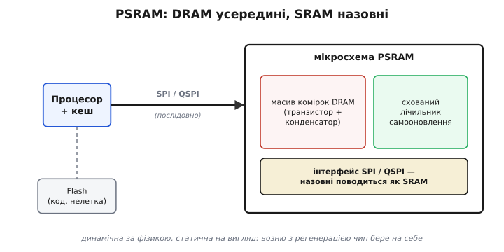
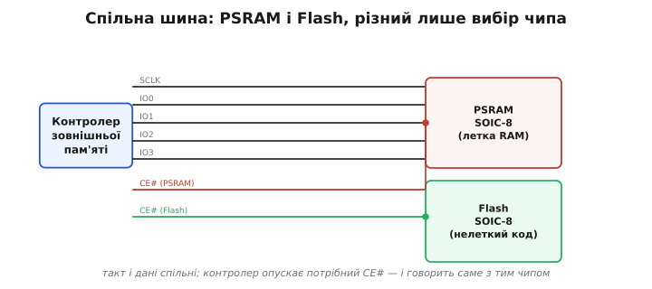
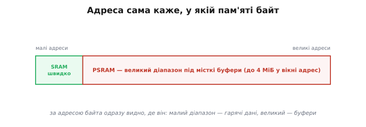
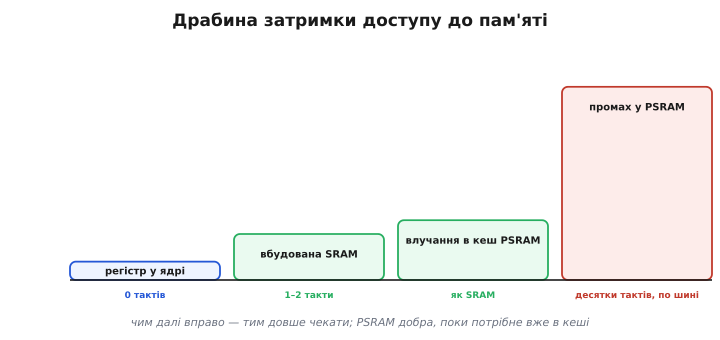
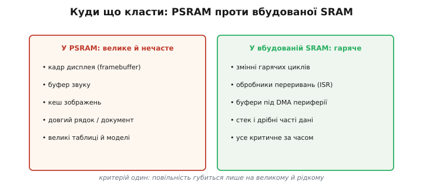

# PSRAM

Вбудованої пам'яті мікроконтролера вистачає рівно на те, заради чого її туди й поклали, — гарячі змінні, стек, дрібні буфери. А потім на стіл лягає задача, де самих лише даних більше, ніж усієї цієї пам'яті: повний кадр кольорового дисплея, секунда звуку у високій якості, кеш десятків іконок, довгий документ цілком у пам'яті. Місця під таке всередині чипа просто немає, і брати його нема звідки — хіба що почепити збоку окрему мікросхему. Саме нею і є **PSRAM** (*pseudo-static RAM*, псевдостатична пам'ять): чип **леткої** пам'яті на кілька мегабайтів, який процесор бачить тією самою тонкою послідовною шиною, що й [флеш](topic:hw-components/spi-flash). Розберімо, що ховається за дивною назвою, як цей чип уплітається у звичайну роботу з пам'яттю майже непомітно для програми, і чому за дешеві мегабайти доводиться платити швидкістю.

### Чому «псевдостатична»: DRAM, що вдає SRAM

Назва описує саму суть хитрості, тож почнімо з неї. Швидка вбудована пам'ять мікроконтролера — це **статична** пам'ять, SRAM (*static RAM*): кожен її біт тримає окремий тригер на кількох транзисторах, який сам, без жодного обслуговування, утримує свій стан, доки є живлення. Тригер надійний і миттєвий, але дорогий за площею — шість транзисторів на один біт, — і саме тому вбудованої SRAM завжди мало.

Щоб мегабайти вийшли дешевими, у PSRAM беруть зовсім іншу комірку — таку саму, як у щільної й дешевої [DRAM](topic:hw-components/dram-cell): один транзистор і крихітний конденсатор, де біт — це наявність чи відсутність заряду. На тій самій площі таких комірок уміщається в рази більше, звідси й копійчана ціна за мегабайт. Але конденсатор **тече** — заряд поволі стікає крізь неідеальну ізоляцію, і вже за десятки мілісекунд біт без підживлення розмиється в ніщо. Тому будь-яку DRAM треба раз у раз **освіжати**: вчасно перечитувати кожну комірку й записувати назад, поновлюючи заряд.

Ось тут і ховається весь фокус PSRAM. У звичайній великій DRAM освіженням керує зовнішній контролер пам'яті — складна окрема логіка, яку у простий мікроконтролер ставити не хочеться. PSRAM же ховає лічильник освіження **всередину себе**: на кристалі поряд із масивом комірок сидить власний таймер і лічильник адрес, який тихо, у фоні, обходить рядок за рядком і поновлює заряд сам. Ззовні цього не видно зовсім — для процесора чип поводиться як проста SRAM, до якої просто пишеш і читаєш за адресою, а всю возню з регенерацією він бере на себе. Звідси й «псевдостатична»: **динамічна за фізикою, статична на вигляд**.


*Усередині — масив комірок DRAM (транзистор плюс конденсатор) і власний лічильник самооновлення, що у фоні поновлює заряд. Назовні чип показує простий інтерфейс по [шині SPI](topic:com-devices/spi-bus): пишеш і читаєш за адресою, наче це SRAM. Поряд на тій самій шині звично живе [флеш](topic:hw-arch/flash-vs-ram), яка тримає **код** і **нелетка**; PSRAM натомість розширює саме **RAM** — летку пам'ять під змінні й буфери.*

> 🔧 **Навіщо це.** Розуміючи, що всередині — звичайна DRAM, ви наперед знаєте її характер: свого вмісту вона **не переживе після вимкнення живлення** (це летка пам'ять, не заміна [флеші](topic:hw-arch/flash-vs-ram)), а доступ до неї повільніший за вбудовану SRAM. PSRAM не для того, щоб зробити пристрій швидшим, — вона для того, щоб у нього просто **вмістилося** те, що інакше не влізе. Це рамка очікувань, з якою варто підходити до будь-якого рішення «а покладімо це в PSRAM».

### Як вона під'єднана: спільна шина з флешшю

Корпус і виводи в PSRAM — ті самі, що в знайомої SPI-флеші: найчастіше вісім ніжок у корпусі **SOIC-8**, з яких частина несе живлення та службові сигнали, а решта — це шина даних. У найпростішому режимі **SPI** дані йдуть однією лінією, по біту за такт. Але PSRAM майже завжди заводять у ширшому режимі **QSPI** (*quad SPI*, «учетверо»): тоді працюють **чотири** лінії даних IO0–IO3 разом, по чотири біти за такт. Це найдешевший спосіб підняти швидкість послідовної шини — учетверо ширша «труба» за ту саму тактову частоту, без жодних додаткових ніжок понад ті, що й так є.

Тонкість, яку легко проґавити, — у тому, як ці чотири лінії розведені на готовому модулі. Зазвичай PSRAM і флеш сидять на **спільних** лініях такту й даних, а розрізняє їх лише окремий сигнал вибору чипа: у кожного свій. Контролер зовнішньої пам'яті опускає потрібний сигнал вибору — і далі говорить саме з тим чипом, поки решта мовчить.


*Такт SCLK і чотири лінії даних IO0–IO3 спільні для PSRAM і флеші. Розрізняє чипи лише окремий сигнал вибору CE# у кожного: контролер опускає потрібний — і говорить саме з тим, поки другий чип від'єднаний. Тому й живлення тут типове 3.3 В, і піни ці зайняті цілодобовою розмовою двох мікросхем.*

Звідси одразу випливає найперша практична засторога. Якщо PSRAM розпаяна на модулі поруч із процесором, її лінії **вже зайняті** цією розмовою — чіпляти на них свою периферію не можна. А якщо PSRAM на модулі немає, припаяти її пізніше зазвичай неможливо: і контролер зовнішньої пам'яті, і самі виводи мусять бути передбачені наперед, у самій мікросхемі. Тому наявність PSRAM — це властивість, яку обирають **заздалегідь**, ще на етапі вибору плати чи модуля, а не додають потім.

### Перший доступ: один рядок налаштувань, далі — звичайні покажчики

Найприємніше в PSRAM те, що «розмовляти» з нею напряму командами SPI вам майже ніколи не доведеться. Контролер зовнішньої пам'яті разом із [кешем](topic:hw-arch/cache) роблять так, що чип **вмонтовується у звичайний адресний простір**: процесор отримує просто ще один великий діапазон адрес під RAM, наче пам'яті всередині раптом побільшало. Тому «перший доступ» тут — не послідовність опкодів, а один рядок налаштувань складання: вмикаєте підтримку PSRAM у конфігурації проєкту, і вся дальша робота — це звичні [покажчики](topic:sf-lang/addresses-pointers), без жодної згадки про SPI в коді.

Системі лишається підказати тільки одне — **звідки** брати велике виділення пам'яті. Тут є дві типові стратегії: або ви окремою функцією просите блок саме із зовнішньої RAM, або дозволяєте, щоб у PSRAM самі собою потрапляли великі виділення зі звичайної [купи](topic:sf-lang/heap-dynamic-memory), коли вони перевищують заданий поріг. За адресою байта тоді одразу видно, де він живе: маленький діапазон вбудованої SRAM — це швидкі дані, великий діапазон PSRAM — місткі буфери.


*Той самий адресний простір вміщає вузьку швидку ділянку вбудованої SRAM і широкий діапазон PSRAM. За адресою байта одразу зрозуміло, з якою пам'яттю маєш справу: малі адреси — гарячі дані впритул до ядра, великі — місткі буфери на повільнішому чипі.*

### Чим вона повільніша — і коли її вмикати

За цю зручність ви платите швидкістю, і розрив тут чималий. Звернення до вбудованої SRAM коштує процесору один-два такти — вона поряд, на тому самому кристалі. Звернення ж до PSRAM мусить проїхати послідовною шиною QSPI, і навіть **найкращий** випадок — коли потрібні байти вже підкачані в [кеш](topic:hw-arch/cache) — лише наближає швидкість до рівня SRAM. А **промах** кеша змушує чекати десятки тактів, поки потрібний блок під'їде шиною. У переведенні на пропускну здатність це одиниці–десятки мегабайтів за секунду проти «миттєвої» вбудованої пам'яті.


*Сходинки затримки доступу: регістр у ядрі — миттєво; вбудована SRAM — один-два такти; влучання в кеш PSRAM — майже як SRAM, бо байти вже поряд; промах — десятки тактів, бо блок треба тягти послідовною шиною. PSRAM добра рівно доти, доки потрібне здебільшого вже в кеші.*

Звідси простий і той самий, що для будь-якої повільної пам'яті, критерій: у PSRAM добре лягає **велике й нечасте**, де повільність губиться на тлі рідких звернень, — кадр дисплея, буфер звуку, кеш зображень, довгий рядок. А **гаряче й критичне за часом** лишають у вбудованій SRAM: змінні гарячих циклів, обробники переривань, буфери, які напряму смикає периферія. Розкидати по PSRAM дрібні часто змінювані змінні — певний спосіб уповільнити програму, нічого не вигравши: кожне таке звернення раз у раз ловитиме промах і чекатиме шину.


*Розподіл за одним критерієм. Ліворуч — те, що велике й до чого звертаєшся рідко: повільність губиться, тож йому місце в PSRAM. Праворуч — гаряче й критичне за часом: воно мусить лишатися у вбудованій SRAM, бо ловити промах у гарячому циклі чи в обробнику переривання неприпустимо.*

> 🔧 **Навіщо це.** Це правило просто застосувати на практиці: перш ніж кудись покласти буфер, спитайте себе — він **великий і рідкий** чи **дрібний і гарячий**? Кадр дисплея, який ви перемальовуєте кілька разів на секунду, чудово живе в PSRAM. Лічильник, який крутиться в циклі мільйон разів, — ні. Та сама задача з одним буфером у правильній пам'яті літає, а з ним же у неправильній — повзе.

### Реальний приклад: великий буфер, що не влазить у внутрішню SRAM

Зберемо все докупи на реальному прикладі. Платформа [ESP32](topic:hw-arch/esp32-architecture) — типовий випадок: вбудованої SRAM у неї сотні кілобайтів, а зовнішню PSRAM (на тих чипах, де вона є — класичний ESP32, S2, S3) фреймворк ESP-IDF підключає в адресний простір через кеш, відводячи під неї **вікно до 4 МіБ** віртуальних адрес. Уявімо повноколірний дисплей 320×240: один кадр у форматі по два байти на піксель — це 320 × 240 × 2 = 153 600 байтів, тобто 150 КіБ суцільним блоком. Просити такий шматок зі звичайної купи ризиковано: стільки безперервної вбудованої SRAM може просто не знайтися. Натомість його кладуть у PSRAM.

**Виділення кадрового буфера 320×240×2 явно із зовнішньої RAM (ESP-IDF, C)**

```c
#include "esp_heap_caps.h"
#include <stdint.h>
#include <stddef.h>

#define FB_W 320
#define FB_H 240
#define FB_BYTES (FB_W * FB_H * 2)   // 2 байти/піксель → 153 600 байтів (150 КіБ)

uint16_t *framebuffer_alloc(void) {
    // MALLOC_CAP_SPIRAM — «дай саме із зовнішньої PSRAM».
    // 8BIT — блок придатний для побайтового доступу (звичайні дані).
    uint16_t *fb = heap_caps_malloc(FB_BYTES, MALLOC_CAP_SPIRAM | MALLOC_CAP_8BIT);
    if (fb == NULL) {
        // PSRAM не ввімкнена в конфігурації або в ній забракло місця —
        // мовчазний відкат у внутрішню SRAM лише замаскує проблему,
        // тож тут чесніше повідомити про брак пам'яті.
        return NULL;
    }
    return fb;                         // далі — звичайний покажчик, ніякого SPI у коді
}
```

Тонкощів тут дві, і обидві типові. По-перше, прапор виділення: `MALLOC_CAP_SPIRAM` каже алокатору взяти блок саме із зовнішньої PSRAM, а не з дефіцитної внутрішньої SRAM. У середовищі Arduino цю саму дію загортають у коротку обгортку `ps_malloc()` — це той самий запит «дай із PSRAM», лише під звичнішою назвою. По-друге, **перевірка на `NULL` обов'язкова**: якщо підтримку PSRAM не ввімкнено в конфігурації або чип її взагалі не має, виділення поверне `NULL` — і кадровий буфер мовчки не з'явиться.

Далі `fb` — звичайнісінький покажчик: пишемо в нього пікселі як у будь-який масив, а контролер пам'яті з кешем самі перетворюють кожне звернення на обмін по QSPI. Жодного `cs_low()` чи опкодів, як було б із прямою [SPI-флешшю](topic:hw-components/spi-flash), у коді немає — у цьому й уся принада вмонтованої в адресний простір пам'яті.

> 🔧 **Навіщо це.** Найковарніша пастка PSRAM на ESP32 ховається саме там, де код виглядає невинно: **поки кеш флеші вимкнено — наприклад, у момент запису у флеш, — зовнішня PSRAM теж стає недосяжною**, і будь-яке звернення до неї вилітає винятком доступу до кеша. Тому буфери, з якими працює обробник переривання чи код, що пише у флеш, тримають у внутрішній SRAM, а не в PSRAM. Це і вся механіка цього класу пасток, і вона детальніше розібрана в [роботі з зовнішньою RAM на ESP32](topic:hw-arch/psram/proj-esp32-psram.md).

### Варіації класу

PSRAM різниться передусім **обсягом** (типово від 2 до 16 МіБ) і **шириною доступу**: проста SPI з однією лінією повільніша, QSPI з чотирма — швидша, а найновіші чипи додають ще ширший восьмилінійний режим заради вищої пропускної здатності. Трапляється PSRAM і прихованою прямо в корпусі мікросхеми процесора, поряд із кристалом ядра, — тоді окремого чипа на платі шукати не треба, він уже всередині, хоч за фізикою та обмеженнями це та сама зовнішня по шині пам'ять.

Як саме така пам'ять влаштована глибше — [інтерфейси SDRAM і DDR](topic:hw-arch/sdram-ddr), контролери, таймінги — це вже окрема велика тема; тут досить розуміти головне. PSRAM — це летка пам'ять «на виріст»: дешева DRAM, що прикидається SRAM, яку тією самою послідовною шиною чіпляють збоку, коли вбудованої пам'яті забракло під щось велике, але не надто гаряче.
