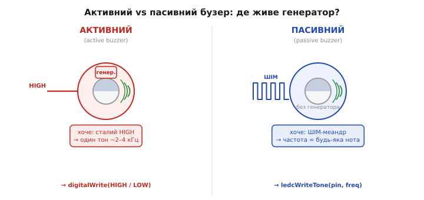
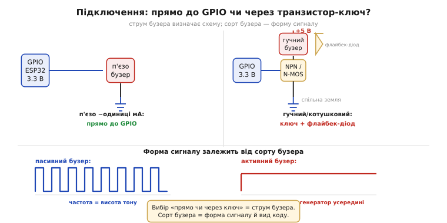

# 🔌 Бузер активний і пасивний: коли ШІМ стає звуком

> Компонентна вставка про звук від [широтно-імпульсної модуляції](root:hw-arch/pwm-on-mcu). Чутний діапазон (20 Гц–20 кГц) для мотора — вада: він «пищить», коли частота ШІМ туди потрапляє. Бузер ставить це з ніг на голову: навмисне беремо чутну частоту — і ніжка **співає**. Тут головне не шпаруватість (як для світла), а **частота = висота тону**. І перша розвилка для новачка — бузер буває двох різновидів, які потребують геть різного сигналу.

## Що це за деталь

**Бузер / зумер** (*buzzer*), він же **п'єзовипромінювач** (*piezo buzzer / sounder*) — найдешевший спосіб дати вбудованому пристрою голос: писк, «біп», тривога, клацання клавіші. Швидке перемикання ніжки в чутному діапазоні 20 Гц–20 кГц створює **звук** — для мотора це небажаний писк котушки. Бузер — той самий ефект, зроблений навмисне й гучно.

Серцевина вставки — **дві родини**, які не можна плутати: **активний** (*active*) і **пасивний** (*passive*) бузер. Активний має власний генератор усередині й потребує лише сталого живлення → видає ОДИН фіксований тон. Пасивний генератора не має й чекає, щоб ШІМ-сигнал «диктував» йому частоту → грає БУДЬ-ЯКУ ноту. Переплутати різновид — означає отримати або тишу, або вічний немелодійний писк замість мелодії. Шпаруватість і частота — дві незалежні ручки [апаратної ШІМ](root:hw-arch/hardware-pwm); тут важлива лише ця розвилка.

## Як він влаштований усередині

Спільна фізична основа обох різновидів — **п'єзопластина** (*piezo element / diaphragm*): металева мембрана з шаром п'єзокераміки. Подаєш напругу — пластина вигинається, знімаєш — повертається; перемикання туди-сюди розгойдує мембрану, вона штовхає повітря — і виникає звук. Той самий [п'єзоефект](root:ph-condensed/piezoelectric-effect-quartz-resonance), що дає кіловольти від удару, тут працює навпаки: напруга → рух мембрани.

**Активний бузер** = п'єзопластина + **вбудований електронний генератор** (мікросхема або мультивібратор). Подав сталу напругу — генератор сам розгойдує пластину на заводській частоті (~2–4 кГц, біля піку чутливості вуха).

**Пасивний бузер** = гола п'єзопластина (або електромагнітна котушка — зосереджуємося на п'єзо) **без** генератора. Сам по собі мовчить; частоту має задати зовнішній сигнал — ШІМ-меандр від ніжки.



*Активний (ліворуч): всередині є генератор — хоче сталий HIGH, видає один тон. Пасивний (праворуч): лише мембрана — хоче ШІМ-меандр, частота якого й стає нотою.*

## Як упізнати й розпіновка

Дві ніжки: **+** і **−/GND**. На модулях — підписи «S» (*signal*) або «I/O». В активних полярність важлива, у пасивних п'єзо — формально ні (але дотримуйтеся маркування).

Як відрізнити активний від пасивного «на дотик»: (1) активний зазвичай із наліпкою, дно заклеєне; у пасивного — отвір і видно зелену підкладку; (2) надійніше — **тест 3 В**: активний пискне від сталого живлення, пасивний лише клацне й замовкне; (3) за опором: п'єзо — фактично конденсатор (DC-опір нескінченний), електромагнітна котушка дзвенить кількома омами.

## Підключення

**Скільки тягне струму — ключове рішення.** П'єзо-бузер — майже конденсатор, одиниці мА: можна підключати **прямо до GPIO** (3.3 В логіки ESP32 вистачає). Гучний або електромагнітний — десятки мА, що перевищує [ліміт ніжки](root:hw-digital/pin-drive-limits): потрібен **транзистор-ключ** + **флайбек-діод** для котушкового навантаження. Спільна земля між МК і бузером — обов'язково. Для п'ятивольтового бузера через ключ рівнева розв'язка вбудована автоматично.



*Зліва: п'єзо з мізерним струмом — прямо до GPIO. Справа: гучний/котушковий через ключ і флайбек-діод. Знизу: форми сигналу — меандр для пасивного (частота = нота) і HIGH-полиця для активного (тон робить внутрішній генератор).*

## Перший байт: як змусити співати

**Активний бузер — це просто `digitalWrite`.** Жодної ШІМ: HIGH — пищить, LOW — тиша. Тон фіксований заводом; ми лише вмикаємо й вимикаємо.

:::tabs
```cpp
const int BUZ = 4;
void setup() { pinMode(BUZ, OUTPUT); }
void loop() {
    digitalWrite(BUZ, HIGH);    // активний бузер: пищить сам
    delay(200);
    digitalWrite(BUZ, LOW);     // тиша
    delay(800);
}
```
```micropython
from machine import Pin
from time import sleep_ms

buz = Pin(4, Pin.OUT)
while True:
    buz.value(1)                # активний бузер: пищить сам
    sleep_ms(200)
    buz.value(0)                # тиша
    sleep_ms(800)
```
:::

**Пасивний бузер — це ШІМ, де керуємо ЧАСТОТОЮ.** Меандр (50% шпаруватості) потрібної частоти змушує мембрану коливатися на цій частоті — і саме ця нота лунає. Контраст із LED: там крутили шпаруватість, тут — **частоту**.

:::tabs
```cpp
const int BUZ = 4;
void setup() {
    ledcAttach(BUZ, 2000, 10);   // ніжка; стартова частота 2000 Гц; 10 біт
}
void loop() {
    ledcWriteTone(BUZ, 440);     // нота «ля» — 440 Гц
    delay(300);
    ledcWriteTone(BUZ, 880);     // на октаву вище
    delay(300);
    ledcWriteTone(BUZ, 0);       // 0 Гц = тиша
    delay(400);
}
```
```micropython
from machine import Pin, PWM
from time import sleep_ms

buz = PWM(Pin(4), freq=2000, duty=512)   # ніжка; стартова частота 2000 Гц; 50% (з 1023)
while True:
    buz.duty(512)
    buz.freq(440)                # нота «ля» — 440 Гц
    sleep_ms(300)
    buz.freq(880)                # на октаву вище
    sleep_ms(300)
    buz.duty(0)                  # тиша (шпаруватість 0)
    sleep_ms(400)
```
:::

Синонім для новачків: `tone(pin, freq)` — робить те саме, зустрінете в прикладах. Шпаруватість лишаємо 50% — для п'єзо вона майже не впливає на гучність.

## Типові граблі

- **Переплутав різновид.** ШІМ-мелодія на активний → чуєш лише заводський писк. Сталий HIGH на пасивний → тиша. Лік: спершу визнач різновид.
- **Пасивний на «ШІМ для світла».** Крутиш шпаруватість, а не частоту → нота не змінюється.
- **Перевантажив ніжку.** Гучний бузер без ключа → просідання напруги, перезавантаження або здохла ніжка.
- **Котушковий без флайбек-діода.** Індуктивний викид б'є по транзистору чи [ніжці](root:hw-digital/pin-drive-limits).
- **0 Гц ≠ тиша скрізь.** На деяких версіях SDK залишається ледь чутний фон; для надійності `ledcWrite(pin, 0)` або знімайте канал.
- **П'єзо тихий на 3.3 В.** Нормально: для більшої гучності — 5 В через ключ або резонансна частота (~2–4 кГц).

## Варіації класу

Головна вісь: **активний vs пасивний**. Один сигнал «біп» → активний, два рядки коду. Мелодії й змінні тони → пасивний, керування частотою. Друга вісь: **п'єзо vs електромагнітний** (*magnetic*) — п'єзо гучний на високих частотах, майже не споживає струму; електромагнітний нижчий і гучніший на низьких частотах, але індуктивний і струмніший. Є SMD та THT варіанти, корпуси під отвір у панелі, «бузери з ROM-мелодією» — крайній випадок активного, де навіть мелодія зашита.

Підсумок: для активного частота зашита (керуємо вмиканням), для пасивного частота — наша ручка через ШІМ. Саме так чутний діапазон, що для мотора був вадою (писк котушки), тут стає інструментом — пристрій дістає голос.
