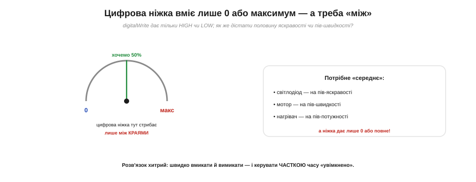
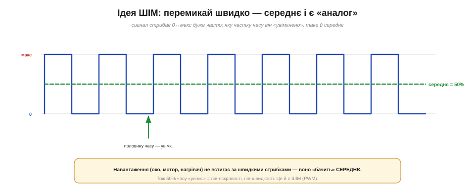
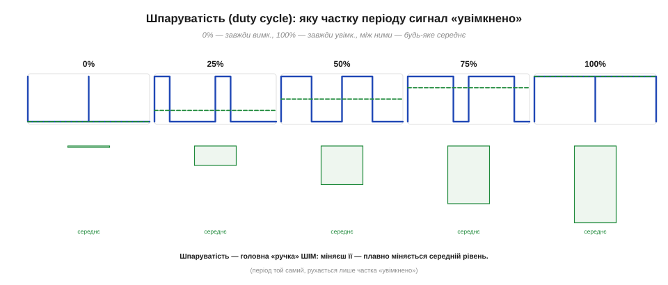
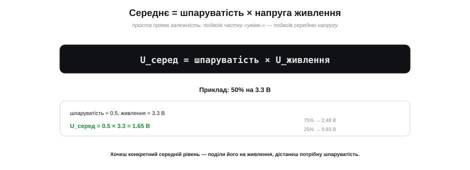
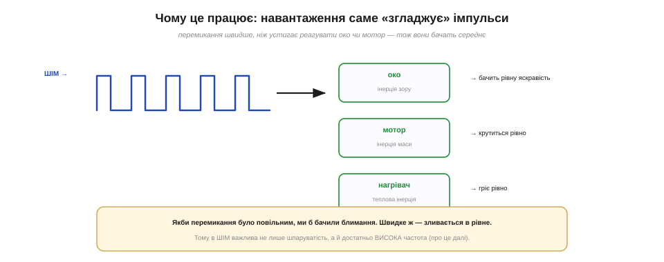
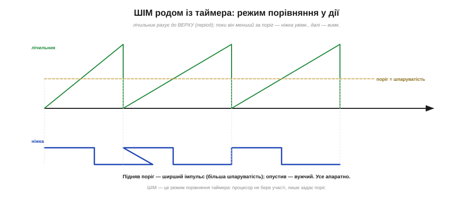

# ШІМ (PWM): «вдавати» аналог цифровою ніжкою (середнє значення)

Почнімо з суті проблеми. Цифрова ніжка — це **вмикач**: вона дає або повну напругу (HIGH, у нас 3.3 В), або нуль (LOW). Жодного «посередині» вона видати не вміє — між цими двома краями для неї нічого нема. А нам раз у раз потрібне саме посередині: світлодіод на половину яскравості, мотор на третину швидкості. Як подолати цю прірву між «лише два рівні» й «будь-який рівень»? Відповідь — **ШІМ** — настільки проста й хитра, що варта окремої теми.

### Ніжка вміє лише 0 або максимум

Уявімо ручку гучності, яку можна крутити лише в два крайні положення — «тиша» й «на повну», нічого між ними. Саме так поводиться цифрова ніжка: запис у її регістр виходу ставить або 0, або максимум — хоч `digitalWrite` в Arduino, хоч `gpio_set_level` в ESP-IDF, хоч `HAL_GPIO_WritePin` на STM32. Та реальні задачі вимагають плавності.

Може, спитаєте, чому не поставити змінний резистор і не знизити напругу механічно? По-перше, його не покрутиш **із коду** — а нам потрібне програмне керування яскравістю. По-друге, дільник із резисторів **марнує** енергію: зайва напруга перетворюється на тепло. Існує й справжній цифровий розв'язок — [ЦАП](root:hw-analog/dac), та він є не всюди й має свої межі. ШІМ же дає програмне, ощадне керування «середнім» на **будь-якій** звичайній цифровій ніжці — тому й переміг.


*Цифрова ніжка — як ручка, що знає лише два крайні положення: 0 або максимум. А нам потрібне «середнє»: світлодіод на пів яскравості, мотор на пів швидкості, нагрівач на пів потужності. Прямо ніжка цього не дає — розв'язок у тому, щоб **швидко перемикати** її й керувати часткою часу «увімкнено».*

Перша наївна думка — «а може, ніжка видасть 1.65 В замість 3.3?». Ні: [вихідний транзистор ніжки](root:hw-digital/push-pull-output) штовхає напругу або до VDD, або до GND — третього стану в нього нема. Тож пряму «половину напруги» цифрова ніжка не видасть **в принципі**. Хитрість зовсім інша — не в напрузі, а в **часі**.

### Ідея ШІМ: перемикай швидко, керуй часткою часу

Ось вона, ключова ідея. Якщо ніжку дуже **швидко** вмикати й вимикати, то важливою стає не миттєва напруга, а **середня** — усереднена за час. А середнє залежить від того, **яку частку** часу ніжка «увімкнено». Тримаємо її увімкненою половину часу — середнє виходить **половина** від максимуму. Чверть часу — чверть. Це й називають **широтно-імпульсною модуляцією**: ми не міняємо висоту імпульсів (вона завжди 0 або максимум), а міняємо їхню **ширину** — частку часу «увімкнено».


*Сигнал ШІМ стрибає 0↔максимум дуже часто. Якщо половину часу він «увімкнено», то **середнє** (зелена пунктирна лінія) дорівнює 50% від максимуму. Навантаження — око, мотор, нагрівач — не встигає за швидкими стрибками й «бачить» саме це середнє. Тож 50% часу «увімк.» = пів яскравості, пів швидкості. Це і є ШІМ.*

Зверніть увагу: ніжка весь час робить лише те, що вміє, — стрибає між 0 і максимумом. Жодної «половинної напруги» вона не видає; «половина» з'являється **в середньому**, бо половину часу ніжка увімкнена, а половину — вимкнена. Це не справжній аналог, а спритна **імітація** його швидким миготінням. Та для більшості задач імітація працює не гірше за справжній аналог — і коштує однієї цифрової ніжки.

> 🔧 **Навіщо це.** ШІМ — чи не найуживаніший прийом у всьому вбудованому світі: ним притлумлюють світлодіоди й підсвітку, керують швидкістю моторів і вентиляторів, потужністю нагрівачів, навіть формують звук і команди сервоприводам. Запам'ятайте суть одним рядком: **не міняй напругу — міняй частку часу «увімкнено»**. Щойно вам треба «щось плавне» від цифрової ніжки, перша думка має бути «ШІМ».

### Шпаруватість: головна ручка ШІМ

Та частка часу «увімкнено» має ім'я — **шпаруватість**, або коефіцієнт заповнення (англ. *duty cycle*). Її задають у відсотках: 0% — ніжка завжди вимкнена (середнє 0), 100% — завжди увімкнена (середнє = максимум), 50% — половина на половину, і так будь-яке значення між ними. Шпаруватість — це і є головна «ручка» ШІМ: крутиш її — плавно повзе середній рівень.


*Шпаруватість — частка періоду, яку сигнал «увімкнено». 0% — завжди вимк., 100% — завжди увімк., між ними — будь-яке середнє. Період той самий, рухається лише ширина «увімкненої» ділянки. Міняючи шпаруватість, плавно міняємо середній рівень — від нуля до максимуму.*

Важлива деталь: коли міняєш шпаруватість, **період лишається той самий** — рухається лише межа між «увімк.» і «вимк.» усередині нього. Тобто частота миготіння стала, змінюється лише **ширина** імпульсу. Звідси й назва — «широтно-імпульсна»: модулюємо саме шириною імпульсів.

Кілька слів про назви — щоб упізнавати їх у документації. Шпаруватість англійською — *duty cycle*; іноді кажуть «співвідношення імпульс/пауза» (*mark-space ratio*) — те саме, лише іншими словами. Шпаруватість 50% дає симетричний сигнал (однакові «увімк.» і «вимк.» — звичайний меандр), а будь-яка інша робить імпульс або вужчим, або ширшим за паузу. Українською «шпаруватість» історично означала частку «пауз», тож у різних джерелах її подають то як частку «увімк.», то «вимк.» — звіряйте за контекстом, а краще просто думайте «яку частку часу ніжка увімкнена».

### Скільки виходить у вольтах: середнє = шпаруватість × живлення

Перевести шпаруватість у конкретну середню напругу дуже просто. Сигнал частку *d* часу тримає повне живлення *U*, а решту часу — нуль, тому середня напруга — це **добуток**: U_серед = шпаруватість × U_живлення.


*Середній рівень прямо пропорційний шпаруватості: U_серед = шпаруватість × U_живлення. Для 50% на 3.3 В виходить 1.65 В; для 75% — 2.48 В; для 25% — 0.83 В. Потрібен конкретний середній рівень — поділи його на живлення, дістанеш шпаруватість.*

Залежність пряма: подвоїв частку «увімкнено» — подвоїв середню напругу. Це робить ШІМ надзвичайно зручним для керування: щоб дістати потрібний середній рівень, ділимо його на напругу живлення й одразу отримуємо шпаруватість. Хочемо середні 1 В на 3.3-вольтовому живленні? Шпаруватість 1/3.3 ≈ 30%. Жодних складних розрахунків.

Ця красива лінійність — наслідок того, що ніжка перемикається **різко**: вона майже миттєво стрибає між 0 і повним рівнем, без «розмазаних» переходів. Тому площа під імпульсами точно пропорційна шпаруватості, а середнє виходить лінійним. Насправді переходи трохи не миттєві, та для практики цим нехтують. Лінійність — велика зручність: подвоїти середню потужність означає просто подвоїти шпаруватість, без таблиць перерахунку.

### Чому це працює: навантаження саме «згладжує»

Лишилося пояснити, **чому** імітація переконлива — чому світло від миготливого світлодіода ми бачимо рівним, а не як стробоскоп. Уся справа в **інерції** навантаження. Око має інерцію зору (короткі спалахи зливаються), мотор — інерцію маси (не встигає здригатися за кожним імпульсом), нагрівач — теплову інерцію. Якщо перемикання **швидше**, ніж навантаження здатне реагувати, воно фізично усереднює імпульси й «відчуває» лише середнє.


*Навантаження саме «згладжує» ШІМ завдяки інерції: око (інерція зору) бачить рівну яскравість, мотор (інерція маси) крутиться рівно, нагрівач (теплова інерція) гріє рівно. Якби перемикання було повільним, ми б помічали блимання; швидке ж — зливається в рівне. Тому в ШІМ важлива не лише шпаруватість, а й достатньо **висока частота**.*

Звідси випливає важлива умова: частота ШІМ має бути **достатньо високою** для конкретного навантаження. Для світлодіода це сотні герц (щоб око не ловило мерехтіння), для мотора — свої значення. Якщо ж частота замала, інерції не вистачить, і замість плавного середнього ми побачимо (чи почуємо) миготіння. [Підбір частоти й роздільності](root:hw-arch/pwm-resolution) — окрема розмова, та принцип уже ясний: ШІМ працює, **поки перемикання швидше за реакцію навантаження**.

Конкретні цифри такі. Людське око «зливає» мерехтіння приблизно від 50–90 герц (так звана критична частота злиття), тож для світлодіода беруть із запасом — зазвичай понад 100–200 Гц, аби позбутися блимання навіть на периферії зору й на відео. У моторів і котушок є своя пастка: якщо частота ШІМ потрапляє в **чутний** діапазон (від 20 Гц до ~20 кГц), вони можуть неприємно **свистіти** — обмотка ледь помітно вібрує в такт імпульсам. Тому для тихої роботи частоту ШІМ моторів іноді навмисне піднімають вище за поріг чутності.

### Звідки береться ШІМ: це таймер у режимі порівняння

А тепер найкраще: генерувати ШІМ не треба — ніжкою вручну смикати в коді нема потреби. Це робить **таймер** у [режимі порівняння](root:hw-arch/capture-compare): лічильник рахує до ВЕРХУ (це задає **період**, тобто частоту), а **поріг порівняння** визначає, доки ніжка тримає високий рівень. Поки лічильник менший за поріг — ніжка увімкнена; досяг чи перевищив — вимкнена. Виходить, що **поріг порівняння — це і є шпаруватість**.


*ШІМ генерує таймер у режимі порівняння: лічильник рахує до ВЕРХУ (період = частота), а поки він менший за **поріг**, ніжка увімкнена. Підняв поріг — ширший імпульс (більша шпаруватість); опустив — вужчий. Усе діється апаратно: процесор лише задає поріг, а імпульси формує залізо.*

Це означає, що ШІМ — **апаратний** і майже безкоштовний для процесора: задавши частоту й поріг один раз, ви отримуєте бездоганно рівні імпульси — таймер формує їх сам, без жодного рядка в головному циклі. У коді все зводиться до двох дій: **налаштувати канал** (ніжка, частота, розрядність шкали) і **записати поріг**. На «класичному» Arduino обидві ховаються за одним `analogWrite(pin, value)`; в ESP-IDF це `ledc_timer_config` + `ledc_channel_config`, а далі `ledc_set_duty`; на STM32 — `HAL_TIM_PWM_Start` і запис у регістр порівняння каналу. Передане значення — це шпаруватість у вибраній шкалі (наприклад, 0…255 для 8 біт), і ніжка одразу починає видавати ШІМ потрібної частки.

> 🔧 **Навіщо це.** Не пишіть ШІМ «руками» — не смикайте ніжку записом і затримкою в циклі. Така програмна ШІМ і вантажить процесор, і «пливе» джитером, і збивається, щойно код займеться чимось іншим. Завжди беріть **апаратну** ШІМ — той самий таймер із порівнянням, хай як він зветься у вашому середовищі (`analogWrite` в Arduino, блок LEDC в ESP-IDF, канал TIM на STM32): задали частоту й шпаруватість — і таймер далі формує бездоганні імпульси сам. Головний цикл лишається вільним, а сигнал — рівним.

Один таймер зазвичай живить **кілька** каналів ШІМ — кілька незалежних ніжок із власною шпаруватістю, але зі **спільною** частотою. Завдяки цьому одним блоком керують, наприклад, трьома каналами RGB-світлодіода чи кількома моторами водночас. Окремий поширений випадок — [сервопривід](root:hw-motion/hobby-servo): він очікує ШІМ особливого вигляду (короткий імпульс, ширина якого задає кут повороту), і та сама апаратна ШІМ для цього ідеально годиться.

**Порахуймо: світлодіод на 30% яскравості.**

```
Ціль: світлодіод на ~30% яскравості, живлення 3.3 В.

  шпаруватість = 0.30  (30%)
  U_серед = 0.30 × 3.3 = 0.99 В  (середня напруга на навантаженні)

У коді (8-бітна шкала ШІМ, 0…255):
  значення = 0.30 × 256 ≈ 77   → це й кладемо в поріг порівняння каналу

→ таймер видає імпульси шпаруватістю 30%, око бачить ~третину яскравості.
```

**Те саме кодом.** Хоч би яке середовище, робота однакова: налаштувати канал таймера й покласти поріг 77.

:::tabs
```arduino
const int LED = 9;              // ніжка з апаратним ШІМ на цій платі

void setup() {
  pinMode(LED, OUTPUT);
  analogWrite(LED, 77);         // 77/255 ≈ 30%; частоту задає плата
}

void loop() {
  // порожньо: імпульси формує залізо, процесор вільний
}

// яскравіше — просто новий поріг:
//   analogWrite(LED, 191);     // ≈75%
```
```esp-idf
#include "driver/ledc.h"

#define LED_GPIO 18

void led_pwm_start(void)
{
    ledc_timer_config_t tim = {
        .speed_mode      = LEDC_LOW_SPEED_MODE,
        .duty_resolution = LEDC_TIMER_8_BIT,   // шкала 0…255
        .timer_num       = LEDC_TIMER_0,
        .freq_hz         = 1000,               // 1 кГц — око не ловить
        .clk_cfg         = LEDC_AUTO_CLK,
    };
    ESP_ERROR_CHECK(ledc_timer_config(&tim));

    ledc_channel_config_t ch = {
        .gpio_num   = LED_GPIO,
        .speed_mode = LEDC_LOW_SPEED_MODE,
        .channel    = LEDC_CHANNEL_0,
        .timer_sel  = LEDC_TIMER_0,
        .duty       = 77,                      // 77/255 ≈ 30%
        .hpoint     = 0,
    };
    ESP_ERROR_CHECK(ledc_channel_config(&ch));
}

// яскравіше — новий поріг і підтвердження:
//   ledc_set_duty(LEDC_LOW_SPEED_MODE, LEDC_CHANNEL_0, 191);
//   ledc_update_duty(LEDC_LOW_SPEED_MODE, LEDC_CHANNEL_0);
```
```stm32
/* CubeMX: TIM3_CH1 у режимі PWM Generation.
   PSC дає такт ≈256 кГц, ARR = 255 → період 256 тактів ≈ 1 кГц, шкала 0…255. */
extern TIM_HandleTypeDef htim3;

void led_pwm_start(void)
{
    HAL_TIM_PWM_Start(&htim3, TIM_CHANNEL_1);           // таймер веде ніжку сам
    __HAL_TIM_SET_COMPARE(&htim3, TIM_CHANNEL_1, 77);   // 77/256 ≈ 30%
}

void led_pwm_set(uint8_t duty)                          // 0…255
{
    __HAL_TIM_SET_COMPARE(&htim3, TIM_CHANNEL_1, duty); // новий поріг — і все
}
```
:::

Зверніть увагу: ми **не** живили світлодіод напругою 0.99 В — ми давали йому повні 3.3 В 30% часу, і око усереднило це в «третину яскравості». Світлодіод і його [струмообмежувальний резистор](root:hw-digital/pin-drive-limits) лишаються ті самі; ШІМ лише керує тим, **яку частку часу** через них тече струм.

Варто окремо сказати про велику перевагу ШІМ — **ощадність**. Транзистор ніжки в кожен момент або повністю **відкритий** (малий опір — мало втрат), або повністю **закритий** (струму нема — втрат нема); у проміжному стані, де він гріється найдужче, він майже не перебуває. Тому ШІМ керує потужністю майже **без втрат на тепло** — на відміну від «лінійних» способів (резистор, лінійний стабілізатор), що гасять надлишок, просто перетворюючи його на жар. Саме ця ефективність і зробила ШІМ стандартом керування моторами, нагрівачами й живленням — від іграшок до електромобілів.

Варто оцінити цей трюк концептуально. ШІМ — місток між **цифровим** світом мікроконтролера (де є лише 0 і 1) і **аналоговим** світом речей (де яскравість і швидкість плавні). Не маючи жодної аналогової деталі, лише швидким перемиканням цифрової ніжки, ми дістаємо плавне керування. Це класичний інженерний прийом — замінити дороге (аналогову схему) дешевим і хитрим (час і лічбу). Недарма ШІМ вважають однією з найгеніальніших простих ідей практичної електроніки.

Отже, ШІМ розв'язує задачу «аналог цифровою ніжкою» хитрим обходом: ніжка, як завжди, стрибає лише між 0 і максимумом, але якщо робити це **швидко** й керувати **часткою часу «увімкнено»** (шпаруватістю), середній рівень виходить будь-який — від нуля до максимуму, за простою формулою «середнє = шпаруватість × живлення». Працює це тому, що інерційне навантаження само **згладжує** швидкі імпульси, а формує їх **таймер** у режимі порівняння, не навантажуючи процесора й майже без теплових втрат — за що ШІМ і люблять усюди.
