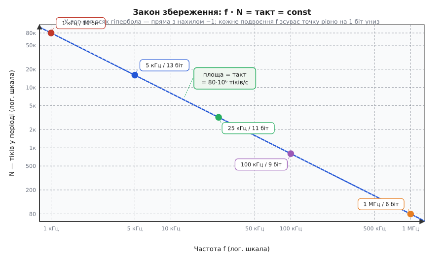

# 🧮 Частота × роздільність = константа: бюджет тіків точно

Базове правило роздільності ШІМ — «`f · 2^біт ≤ такт`», звідки `max біт = log₂(такт/f)`: 5 кГц дають 13 біт, 100 кГц — 9 біт, 1 МГц — лише 6 біт. Ця вставка дивиться на той самий закон глибше: трактує його як **точну рівність добутку** (обернена пропорція, а не лише нерівність) і чесно розбирає, що відбувається в реальному залізі — де числа цілі, дільники дискретні, а замовлена частота й отримана нерідко різняться. Два питання: чому «≤» перетворюється на «=» для самого числа тіків і що відбувається, коли `2^біт` не ділить тактову частоту націло.

---

### 1. Означення: точна рівність добутку

Відправна точка — фізичний факт. Таймер ESP32 рахує тіки тактового генератора. За один повний ШІМ-цикл він нараховує рівно

```
N = такт / f                     (тіків у одному ШІМ-періоді)
```

де `такт` — частота тактового генератора в Гц, `f` — бажана ШІМ-частота. Величину `N` зручно назвати **бюджетом тіків** (*timer clock budget*) або **«верхом лічильника»** (*counter top*): регістр LEDC зберігає значення `ВЕРХ = N − 1`, і коли лічильник його досягає, цикл починається знову.

Якщо `N` — степінь двійки, роздільність у бітах: `біт = log₂ N`. Підставимо `N` і отримаємо **тотожність бюджету**:

```
N = такт / f                     (тіків у періоді)
біт = log₂ N                     (коли N — степінь 2)
─────────────────────────────────
f · N = такт = const             ← закон збереження
f · 2^біт = такт                 (та сама рівність через біти)
```

Ключовий момент: для самого `N` (числа тіків) це **рівність**, а не нерівність. «≤» виникає вже на наступному кроці — коли `log₂ N` округлюють вниз до цілого числа бітів. Спершу розгляньмо інтуїцію, а тоді повернімося до округлення.

---

### 2. Інтуїція: обернена пропорція і правило одного біта

Уявіть прямокутник зі **сталою площею**: ширина — частота `f`, висота — `N` тіків. Площа = такт = 80 000 000 тіків/с. Тягнете ширину вправо (збільшуєте частоту) — висота пропорційно падає. Площу не змінити, бо її задає кварц.

З цього образу випливає **правило великого пальця**:

> Кожен зайвий біт роздільності **рівно вдвічі** знижує стелю частоти.
> Кожне подвоєння частоти **коштує рівно 1 біт** роздільності.

Це прямий наслідок логарифма: `f ∝ 1/N = 1/2^біт`, тому зміна `біт` на `+1` множить `N` на 2 і ділить `f` на 2. Жодних «приблизно» — це точне ціле-кратне відношення.



*Закон збереження добутку f·N = такт: усі робочі пари (частота, кількість тіків у періоді) лежать на одній гіперболі сталого добутку; у лог-лог осях це пряма з нахилом −1. Кожне подвоєння f зсуває точку рівно на 1 біт униз. Реальні значення округлені до цілого N, тому сидять на дискретній сітці поблизу кривої.*

Якщо уявляти ШІМ як пульт із ручками «частота» і «роздільність», то ці дві ручки — і є дві сторони того самого прямокутника сталої площі: покрутили одну — друга йде назустріч.

---

### 3. Формальний апарат: цілі числа псують ідилію

Тут і схований підводний камінь, який просте введення зазвичай обходить заради ясності.

**Проблема.** Рівність `f · N = такт` неперервна — але `N` мусить бути **цілим числом**, а [апаратний дільник таймера](root:hw-arch/timer-counter) дає лише певний набір цілих значень, часто степенів двійки. Довільну частоту з довільним `N` отримати не можна — є дискретна сітка можливих пар `(N, f)`.

З цього прямо випливають **два округлення і два правила**:

**Роздільність при заданій частоті** — завжди округлюємо *вниз*:

```
біт = ⌊log₂(такт / f)⌋          (floor: більше бітів просто не влізе)
```

Саме це «⌊⌋» перетворює точну рівність для `N` на «≤» для `2^біт` — ось внутрішня механіка тієї нерівності, з якої все почалося.

**Реальна частота при заданих бітах.** Якщо ви фіксуєте розрядність `N = 2^біт`, реальна частота:

```
f_реал = такт / (дільник · N)
```

де `дільник` — ціле число (prescaler). Ідеальний дільник = `такт / (f · N)` здебільшого не є цілим, тому LEDC бере найближче ціле, і `f_реал ≠ f_замовл`. Відхилення:

```
Δf / f = (f_замовл − f_реал) / f_замовл
```

На низьких частотах (великий `N`) сітка цілих дільників густа, похибка мала. На високих (малий `N`) — сітка рідка, похибка помітна.

---

**Приклад. Замовили 40 кГц, 11 біт — що вийде насправді?**

```
Замовлення: f = 40 000 Гц, біт = 11 → N = 2^11 = 2048

Перевірка стелі:
  такт / f = 80 000 000 / 40 000 = 2000
  ⌊log₂ 2000⌋ = ⌊10.966⌋ = 10 біт
  → 11 біт НЕ влазить: 2048 тіків × 40 000 Гц = 81 920 000 > 80 000 000 !

Беремо 10 біт: N = 2^10 = 1024.

  ідеальний дільник = 80 000 000 / (40 000 · 1024) = 1.953   (не ціле)

  ⌊дільник⌋ = 1 → f_реал = 80 000 000 / (1 · 1024) = 78 125 Гц  (занадто швидко)
  ⌈дільник⌉ = 2 → f_реал = 80 000 000 / (2 · 1024) = 39 062.5 Гц

  Δf/f = (40 000 − 39 062.5) / 40 000 ≈ 2.3 %

Висновок: точних 40 кГц при 10 бітах немає — найближча досяжна частота 39 062.5 Гц.
```

Ось чому LEDC інколи повертає частоту, дещо відмінну від замовленої. «Гарні» частоти, кратні степеням двійки відносно 80 МГц (наприклад, 78 125 Гц = 80 МГц / 1024), лягають точно. «Круглі» в герцах — майже ніколи.

Компактний зворотний довідник:

```
Стеля частоти при заданих біт:   f_max = такт / 2^біт          (дільник = 1)
Роздільність при заданій частоті: біт   = ⌊log₂(такт / f)⌋     (floor)
Реальна частота при біт і дільнику d:
                                  f_реал = такт / (d · 2^біт)   (d — ціле, ≥1)
```

Якщо `такт` і `2^біт` діляться одне на одне націло, формула точна; інакше `d` округлюється вниз по частоті (вгору по дільнику).

---

> 🔧 **Навіщо це.** Якщо `ledcSetup` або `ledcAttach` повертає частоту, що відрізняється від замовленої, або ваш сигнал критичний за таймінгом — звук, серво, IR, ультразвук — не покладайтесь на номінал. Порахуйте `f_реал = такт / (d · 2^біт)` і `Δf` заздалегідь. Для точної частоти вибирайте `N` — дільник такту (степінь двійки, що ділить 80 МГц націло), а не «кругле» значення в герцах: саме тоді ідеальний дільник буде цілим і похибка нульовою.

---

### 4. Підсумок

Апаратна пара «[передільник + ВЕРХ](root:hw-arch/hardware-pwm)» і формула `f = такт / (prescaler · (ВЕРХ + 1))` — ось джерело похибки через щойно описаний механізм округлення. Звідси й «чому саме ⌊⌋» у формулі роздільності, і реальний діапазон досяжних частот.

Той самий принцип «бюджет = const» працює не лише в ШІМ: у [роздільності АЦП](root:hw-analog/adc-resolution) він постає як «частота вибірок × роздільність» — ідея та сама, скінченний ресурс ділиться між «швидко» і «точно».

Загальний закон незмінний: скінченний ресурс (тіки за секунду) ділиться між «швидко» і «точно». Цілі числа додають округлення й похибку частоти — тому завжди рахуйте реальну частоту, а не лише теоретичну стелю.
