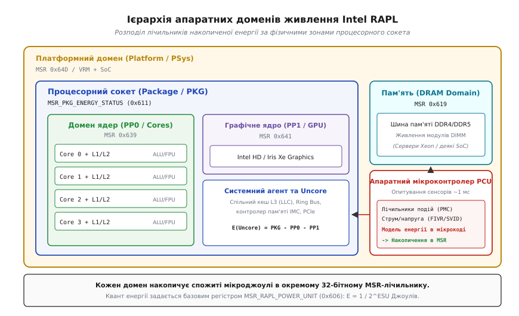
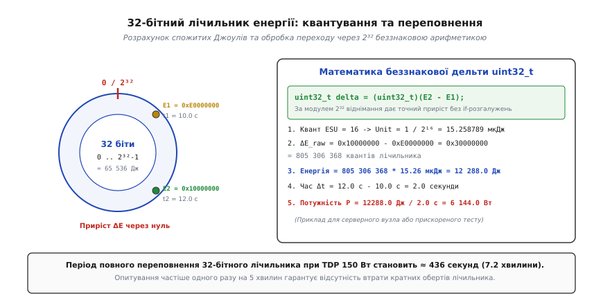
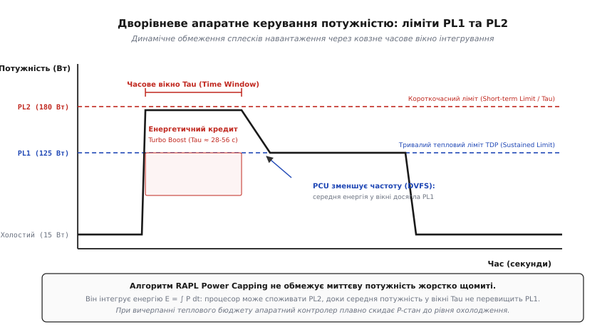
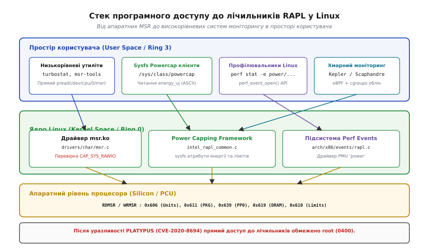

# Вимірювання енергоспоживання через Intel RAPL

<preknowlist>
- [Стіна потужності й темний кремній](topic:hw-arch/power-wall) — тепловий бар'єр кристала, обмеження TDP та закон масштабування Деннарда.
- [Динамічне масштабування напруги й частоти (DVFS)](topic:hw-arch/dvfs) — зміна P-станів, стани енергозбереження C-states і баланс між швидкістю та потужністю.
- [MSR: моделе-залежні регістри конфігурації x86](topic:hw-arch/msr) — 64-бітний адресний простір, інструкції `RDMSR`/`WRMSR` та рівні привілеїв Ring 0.
- [Системний виклик](topic:hw-arch/system-call) — взаємодія простору користувача з ядром Linux та файловими інтерфейсами procfs/sysfs.
</preknowlist>

У сучасній серверній стійці центру обробки даних сорок дводіапазонних обчислювальних вузлів споживають у режимі простою близько чотирьох кіловатів електроенергії. Коли диспетчер завдань одночасно запускає на всіх серверах паралельне навчання нейромережі або факторизацію великих матриць за допомогою векторних інструкцій AVX-512, споживання кожної машини за лічені мілісекунди стрибає зі ста до п'ятисот ватів. Сумарне електричне навантаження стійки миттєво зростає з 4 до 20 кіловатів: автоматичні вимикачі розподільчого щита спрацьовують від перевантаження за струмом, стійка повністю знеструмлюється, а аварійна зупинка тисяч обчислювальних потоків призводить до пошкодження даних розподіленої файлової системи.

Класичні методи моніторингу виявляються безсилими перед цією проблемою. Паспортний тепловий пакет TDP (англ. *Thermal Design Power*) є суто статичним проектним числом на кришці процесора, яке не дає жодного уявлення про реальний миттєвий апетит мікросхеми. Апаратні аналогові термодіоди, вбудовані у кремній, реагують на тепловиділення з затримкою в десятки й сотні мілісекунд через фізичну теплоємність металевого радіатора. Доки датчик зафіксує небезпечне нагрівання до 95 градусів і змусить систему охолодження увімкнути кулери на повну потужність, блок живлення вже вийде в аварійний захист або кристал зазнає локальної деградації напівпровідникових переходів.

Для запобігання подібним колапсам та забезпечення цифрового контролю за енерговитратами мікропроцесори потребували технології, здатної не просто вимірювати накопичену енергію з мікросекундним кроком, а й апаратно утримувати споживану потужність у жорстко заданих межах. Такою технологією стала архітектурна підсистема **RAPL** (англ. *Running Average Power Limit* — «біжуче середнє обмеження потужності»). Вона перетворила процесор із пасивного нагрівача на замкнену цифрову систему регулювання, яка в реальному часі інтегрує витрачену енергію, відстежує стан кожного мікроархітектурного вузла й надає операційній системі точні програмні інтерфейси обліку.

### Фізична природа енергоспоживання мікропроцесора

Електрична енергія, яку кристал споживає від джерела живлення, розсіюється у вигляді тепла за рахунок двох фундаментальних фізичних складових: динамічної та статичної потужності.

Динамічна потужність виникає під час кожного перемикання логічних станів КМОН-транзисторів (англ. *CMOS*), коли паразитні ємності затворів `C` перезаряджаються з напруги живлення `V` на землю з тактовою частотою `f`:

```
P_динамічна = α · C · V² · f
```

де коефіцієнт активності `α` показує частку транзисторів, які змінюють свій стан у поточному такті. Коли процесор виконує інтенсивні векторні операції, де задіяні 512-бітні регістри та паралельні помножувачі, `α` зростає в рази порівняно зі звичайними цілочисельними операціями.

Статична потужність зумовлена струмами витоку `I_виток` через підзатворний діелектрик і зворотні p-n переходи навіть тоді, коли транзистор повністю закритий і не виконує корисних обчислень:

```
P_статична = V · I_виток
```

Повна енергія `E`, витрачена мікросхемою за часовий проміжок від `t1` до `t2`, є інтегралом миттєвої потужності в часі:

```
E = ∫ [P_динамічна(t) + P_статична(t)] dt
```

Одиницею вимірювання енергії в системі SI є Джоуль (Дж), що відповідає потужності в один Ват, яка споживається протягом однієї секунди: `1 Дж = 1 Вт · 1 с`.

### Апаратна телеметрія: як кремній вимірює джоулі без амперметрів

Розміщення фізичних шунтів струму й прецизійних аналогово-цифрових перетворювачів на кожній із тисяч ліній живлення процесорного кристала було б інженерним глухим кутом: такі сенсори займали б дефіцитну площу кремнію, споживали б додаткову енергію та вносили б паразитний опір у ланцюги живлення напругою нижче одного вольта.

Замість цього апаратна підсистема RAPL використовує гібридний обчислювальний підхід. На кристалі процесора розміщено виділений 32-бітний мікроконтролер керування живленням — **PCU** (англ. *Power Control Unit*). Цей мікроконтролер функціонує повністю автономно, виконуючи пропрієтарний мікрокод керування кремнієм.

```
Схема збору телеметрії мікроконтролером PCU:
┌─────────────────────────┐    ┌─────────────────────────┐
│ Лічильники подій (PMC)  │    │ Цифрові сенсори напруги │
│ Інструкції, кеш-промахи,│    │ Телеметрія FIVR / SVID, │
│ активність AVX/FPU      │    │ теплові матриці DTS     │
└────────────┬────────────┘    └────────────┬────────────┘
             │                              │
             └──────────────┬───────────────┘
                            ▼
             ┌─────────────────────────────┐
             │ Мікроконтролер живлення PCU │
             │  Апаратна модель енергії:   │
             │   E = ∫ (V · I_model) dt    │
             └──────────────┬──────────────┘
                            ▼
             ┌─────────────────────────────┐
             │ 32-бітні регістри MSR RAPL  │
             │ PKG, PP0, PP1, DRAM, PSys   │
             └─────────────────────────────┘
```

Мікроконтролер PCU кожні кілька сотень мікросекунд збирає дані з трьох ключових джерел:
1. **Апаратні лічильники продуктивності (PMC)**: фіксують кількість декодованих мікрооперацій, звернень до ліній кеш-пам'яті, активність блоків ALU, FPU та векторних конвеєрів.
2. **Внутрішні перетворювачі напруги (FIVR) та цифрові лінії SVID**: передають точні поточні значення напруги живлення окремих доменів.
3. **Цифрові теплові сенсори (DTS)**: передають матрицю температур у різних фізичних точках кристала для точної корекції струмів витоку, оскільки струм витоку зростає експоненційно з ростом температури.

На основі заводських калібрувальних таблиць мікроконтролер PCU розраховує миттєвий струм кожного функціонального блоку, множить його на напругу, інтегрує отримане значення в часі та додає обчислені кванти енергії до відповідних апаратних 32-бітних акумуляторів MSR.

### Домени живлення RAPL

Сучасний процесор x86 не є монолітним шматком кремнію — він розділений на кілька незалежних електричних та логічних зон, які в термінології RAPL називаються **доменами живлення** (англ. *Power Domains*).


*Ієрархія апаратних доменів живлення Intel RAPL. Процесорний сокет PKG охоплює обчислювальні ядра PP0, графічний процесор PP1 та системний агент Uncore. Оперативна пам'ять DRAM та платформні вузли PSys контролюються через окремі лічильники накопиченої енергії.*

Архітектура визначає п'ять базових доменів:
1. **Package Domain (`PKG`)**: охоплює весь фізичний процесорний сокет, включно з ядрами, усіма рівнями кеш-пам'яті, системним агентом, кільцевою шиною Ring Bus та інтегрованим контролером пам'яті. Це головний домен для моніторингу загального енергоспоживання CPU.
2. **Power Plane 0 (`PP0` / Core)**: охоплює виключно обчислювальні процесорні ядра та їхні індивідуальні кеші L1 і L2. Різниця між енергією `PKG` та `PP0` на серверних системах дозволяє визначити витрати енергії на системний агент і спільний кеш L3 (Uncore).
3. **Power Plane 1 (`PP1` / Uncore / Graphics)**: охоплює вбудоване графічне ядро (на клієнтських процесорах Intel Core). На серверних процесорах цей домен зазвичай відсутній або замінений на розширений моніторинг шини Uncore.
4. **DRAM Domain**: фіксує енергоспоживання підсистеми оперативної пам'яті (модулів DIMM DDR4/DDR5), підключених до контролера процесора. Цей домен життєво необхідний на високонавантажених серверах баз даних.
5. **Platform / PSys Domain**: запроваджений у мобільних та серверних архітектурах для оцінки енергоспоживання всієї системи на кристалі (SoC), включно з втратами на зовнішніх регуляторах напруги VRM та чипсеті.

Повний перелік числових адрес MSR для кожного домену на платформах Intel та AMD наведено у [довіднику регістрів та інтерфейсів RAPL](topic:hw-arch/rapl-energy-metering/api-rapl-registers.md).

### Одиниці вимірювання та конфігураційний регістр MSR_RAPL_POWER_UNIT

Значення, що зберігаються в MSR-лічильниках енергії, не є безпосередньо Джоулями чи Ватами: це сирі цілі числа (кванти відліків). Для переведення цих чисел у фізичні одиниці SI процесор надає глобальний регістр конфігурації — `MSR_RAPL_POWER_UNIT` (індекс `0x00000606` на Intel та `0xC0010299` на AMD Zen).

```
Бітова структура регістра MSR_RAPL_POWER_UNIT (0x606):
 63                               20 19      16 15  13 12       8 7    4 3       0
┌───────────────────────────────────┬──────────┬──────┬──────────┬──────┬──────────┐
│ Зарезервовано                     │    TU    │ Рез  │   ESU    │ Рез  │    PU    │
└───────────────────────────────────┴──────────┴──────┴──────────┴──────┴──────────┘
```

Регістр містить три ключових поля, кожне з яких задає від'ємний двійковий степінь для відповідної фізичної величини:
- **`PU` (Power Units, біти [3:0])**: одиниця потужності в ватах розраховується як:
  ```
  Unit_Power = 1 / (2^PU)   [Вт]
  ```
  При значенні `PU = 3` ціна однієї одиниці потужності становить `1 / 8 = 0.125` Вт.
- **`ESU` (Energy Status Units, біти [12:8])**: одиниця накопиченої енергії в джоулях:
  ```
  Unit_Energy = 1 / (2^ESU)   [Дж]
  ```
  У переважній більшості процесорів `ESU = 16`. Це означає, що кожен крок апаратного лічильника дорівнює:
  ```
  Unit_Energy = 1 / 2¹⁶ = 1 / 65536 ≈ 0.000015258789 Дж  (15.26 мкДж)
  ```
- **`TU` (Time Units, біти [19:16])**: одиниця часу для вікон усереднення:
  ```
  Unit_Time = 1 / (2^TU)   [с]
  ```
  При `TU = 10` часова одиниця становить `1 / 1024 ≈ 0.976` мілісекунди.

### Робота з 32-бітним акумулятором енергії та переповнення лічильника

Лічильник `MSR_PKG_ENERGY_STATUS` (та аналогічні лічильники інших доменів) використовує молодші 32 біти 64-бітного MSR. Це безперервно зростаючий акумулятор (*free-running accumulator*), який нарощується апаратурою за модулем $2^{32}$.


*32-бітний лічильник енергії RAPL. При кванті 15.26 мкДж лічильник вміщує близько 65 536 Джоулів. Використання беззнакової арифметики uint32_t забезпечує точний розрахунок приросту енергії навіть при переході через нульову відмітку.*

Оскільки максимальне значення 32-бітного лічильника дорівнює $2^{32} - 1 = 4\,294\,967\,295$, повна енергетична ємність регістра становить:

```
E_макс = (2³² - 1) · (1 / 65536) ≈ 65 536 Джоулів
```

Якщо сучасний серверний процесор працює під інтенсивним навантаженням із потужністю 150 Вт, лічильник повністю заповнюється і скидається в нуль кожні:

```
T_переповнення = 65 536 Дж / 150 Вт ≈ 436.9 секунд  (близько 7.3 хвилини)
```

При потужності 300 Вт час між переповненнями скорочується до 3.6 хвилин.

#### Математика коректного віднімання без розгалужень

У системному програмуванні на мовах C та C++ немає необхідності писати умовні оператори `if (curr < prev)` для обробки переповнення. Відповідно до стандарту цілочисельної арифметики C/C++, операції над беззнаковими типами `uint32_t` суворо визначені за модулем 2³².

Якщо початкове значення `E1 = 0xE0000000` (3 758 096 384), а кінцеве після переповнення `E2 = 0x10000000` (268 435 456), безпосереднє віднімання дає:

```
ΔE_ticks = (uint32_t)(E2 - E1)
         = (uint32_t)(0x10000000 - 0xE0000000)
         = 0x30000000
         = 805 306 368 відліків
```

Реальна витрачена енергія в джоулях та середня потужність у ватах за інтервал `Δt = t2 - t1` розраховуються так:

```
ΔE_Joules = ΔE_ticks · (1 / 2^ESU)
P_середня = ΔE_Joules / Δt
```

Єдиною обов'язковою умовою для коректності цього розрахунку є те, що інтервал між двома послідовними опитуваннями сенсора не повинен перевищувати повного періоду переповнення `T_переповнення` (тобто знімати показники слід не рідше ніж один раз на 3–4 хвилини).

> 🔧 **Навіщо це.** Завдяки використанню прямого приведення `(uint32_t)(E2 - E1)` компілятор генерує єдину асемблерну інструкцію `SUB`, без жодних інструкцій умовного переходу `JCC`. Це усуває ризик промахів передбачувача переходів конвеєра у високонавантажених циклах телеметрії.

### Дворівневе апаратне керування потужністю: PL1 та PL2

RAPL — це не просто пасивний лічильник енергії, а передусім потужний апаратний регулятор обмеження споживання (англ. *Power Capping*). Операційна система або BIOS можуть записати граничні ліміти потужності в регістр `MSR_PKG_POWER_LIMIT` (індекс `0x00000610`).

Керування здійснюється за дворівневою моделлю:
- **PL1 (Power Limit 1 / Long Term)**: базовий довготривалий ліміт потужності, який зазвичай відповідає паспортному тепловому пакету TDP (наприклад, 125 Вт). Процесор може працювати на цьому рівні необмежено довго без перегріву системи охолодження.
- **PL2 (Power Limit 2 / Short Term)**: короткочасний піковий ліміт потужності (зазвичай на 25–40% вище за PL1, наприклад 180 Вт). Дозволяє процесору різко підвищувати тактову частоту в режимі Turbo Boost для швидкого виконання коротких інтерактивних задач.


*Дворівневий механізм обмеження потужності RAPL. Процесор дозволяє споживання на рівні PL2 протягом ковзного часового вікна Tau. При вичерпанні енергетичного бюджету мікроконтролер PCU знижує P-стан до утримання довготривалого ліміту PL1.*

Апаратний алгоритм працює через математичний апарат ковзного часового вікна інтегрування:

```
(1 / Tau) · ∫ [від t - Tau до t] P(τ) dτ ≤ PL1
```

де `Tau` — часове вікно усереднення (зазвичай від 28 до 56 секунд). 

Поки середня споживана енергія за вікно `Tau` не перевищує ліміту `PL1 · Tau`, процесор має право працювати на максимальній потужності `PL2`. Як тільки енергетичний кредит вичерпується, мікроконтролер PCU починає плавно примусово знижувати робочу частоту та напругу ядер через підсистему DVFS, утримуючи тепловиділення точно на рівні PL1.

Детальний аналіз історії розвитку технологій керування живленням від перших аналогових схем до сучасних цифрових регуляторів наведено в [історичному нарисі про еволюцію систем обмеження потужності](topic:hw-arch/rapl-energy-metering/hist-power-capping.md).

### Програмний стек доступу до RAPL у Linux

В операційній системі Linux взаємодія з лічильниками RAPL організована у вигляді багаторівневого програмного стека.


*Програмний стек доступу до RAPL у Linux. Ядро надає три паралельні інтерфейси: прямий доступ через /dev/cpu/X/msr, абстракцію powercap sysfs та лічильники підсистеми perf_event.*

1. **Пряме читання через драйвер `/dev/cpu/<cpu_id>/msr`**:
   Символьний пристрій, який обслуговується драйвером `msr.ko`. Читання 8 байтів через системний виклик `pread()` зі зміщенням, що дорівнює номеру MSR, повертає сире значення регістра. Має мінімальну затримку (близько 1 мікросекунди), але вимагає прав `CAP_SYS_RAWIO`.

2. **Підсистема Linux Power Capping Framework (`/sys/class/powercap/intel-rapl/`)**:
   Стандартний інтерфейс ядра, який самостійно зчитує `MSR_RAPL_POWER_UNIT`, множить значення лічильника на ціну кванта та експортує готову накопичену енергію у файли `energy_uj` у текстовому вигляді в мікроджоулях.

3. **Підсистема профілювання продуктивності `perf_event`**:
   Ядро містить PMU-драйвер `power`, що дозволяє зчитувати показники RAPL через стандартні інструменти профілювання `perf stat -e power/energy-pkg/`.

4. **Хмарні платформи та контейнери (Kepler, Scaphandre)**:
   Оскільки RAPL вимірює споживання всього сокета разом, хмарні системи обліку використовують програми **eBPF** (англ. *Extended Berkeley Packet Filter*). Вони перехоплюють перемикання контексту процесів ядра, рахують інструкції та цикли кожного контейнера через апаратні лічильники PMC і пропорційно ділять спожиті сокетом джоулі між різними мікросервісами.

Практичний приклад створення системного профілювальника на C та C++ з використанням інтерфейсу `sysfs` наведено у [проєкті практичного енергетичного профілювальника](topic:hw-arch/rapl-energy-metering/proj-energy-profiler.md).

### Питання безпеки: кібератака PLATYPUS та обмеження доступу

До 2020 року файли `/sys/class/powercap/intel-rapl/*/energy_uj` у більшості дистрибутивів Linux мали права `0444` і були доступні для читання будь-якому непривілейованому користувачеві системи.

Проте дослідження вчених під назвою **PLATYPUS** (CVE-2020-8694) виявило фундаментальну вразливість: енергоспоживання процесорного конвеєра змінюється залежно від конкретних значень операндів (кількості встановлених бітів у регістрах даних). Швидкісне опитування сенсора `energy_uj` (до 20 000 разів на секунду) дозволило зловмисникам реконструювати секретні ключі шифрування AES та приватні ключі RSA безпосередньо з коду, що виконувався в ізольованому захищеному анклаві Intel SGX або в просторі ядра.

У відповідь на цю загрозу розробники ядра Linux закрили загальний доступ до всіх інтерфейсів RAPL:
- Права доступу до файлів `energy_uj` у `sysfs` були змінені на `0400` (*тільки читання суперкористувачем root*).
- Драйвер `msr.ko` запровадив сувору перевірку системної маски можливостей `CAP_SYS_RAWIO`.

Тому для роботи будь-яких утиліт вимірювання енергоспоживання у сучасному Linux потрібні привілеї адміністратора (`sudo`) або включення користувача до спеціальної групи безпеки моніторингу.

### Метрологічні характеристики та межі застосування

При використанні RAPL для наукового аналізу та інженерної оптимізації необхідно враховувати його метрологічні особливості:
- **Абсолютна похибка**: численні незалежні дослідження з використанням прецизійних зовнішніх апаратних ватметрів (як-от *Yokogawa WT310*) показують, що похибка моделей RAPL для домену `PKG` зазвичай не перевищує 3–5% при стаціонарних навантаженнях вище 20 Вт.
- **Дискретизація за часом**: мікроконтролер PCU оновлює значення з частотою близько 1 кГц. Будь-які спроби виміряти ділянки коду тривалістю менше 1–5 мілісекунд призводять до значної статистичної похибки дискретизації.
- **Холостий хід (Idle) та глибокі C-стани**: коли більшість ядер перебувають у стані сну C6/C7 зі знятою напругою, похибка моделі струмів витоку може зростати до 10–15%.

Незважаючи на ці обмеження, Intel RAPL залишається головним стандартом де-факто для аналізу енергоефективності програмного забезпечення та автоматизованого керування енергетичною інфраструктурою сучасних серверних комплексів.
