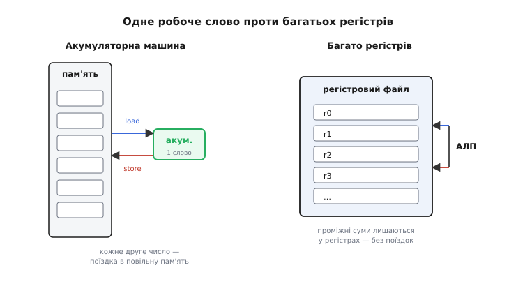
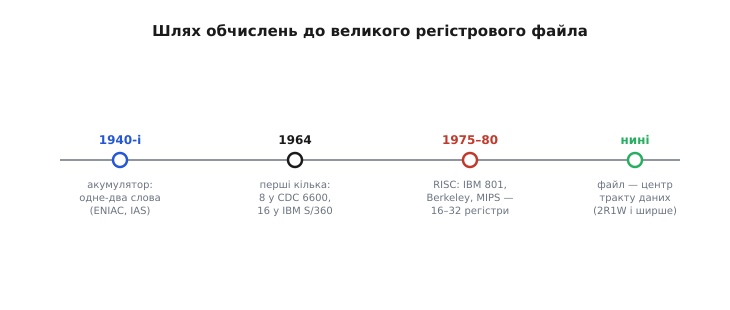
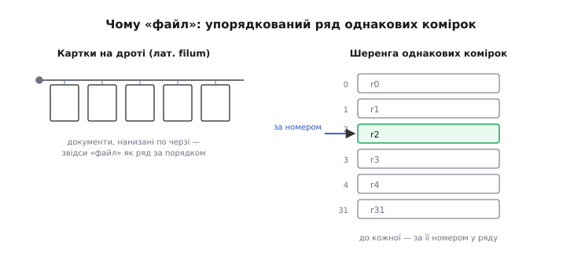

# 📜 Шлях до багатьох регістрів: як народився регістровий файл

> Ця історія веде **одним питанням**: де процесорові тримати числа, з якими він саме працює? Відповідь мінялася сорок років — від машин з **одним-єдиним** робочим словом до архітектур із **тридцятьма двома** рівноправними регістрами, доступними за номером. І десь на цьому шляху набір окремих регістрів перетворився на **регістровий файл** — адресований масив із кількома незалежними портами, що став серцем тракту даних. Розберімо, що змушувало інженерів додавати регістри, чому їх довго боялися й чому саме RISC-революція зробила великий файл центром процесора. Заразом з'ясуємо, до чого тут слово «файл» — воно старіше за диски й файлові системи.

Питання «де тримати робочі числа» звучить дрібно, майже технічно. Та відповідь на нього визначає, **як швидко** машина рахує. Бо арифметика — це нескінченне жонглювання числами: узяти два, скласти, десь покласти результат, узяти наступні. І все залежить від того, **як далеко** ці числа лежать від того місця, де відбувається додавання. Якщо під рукою — швидко. Якщо в пам'яті — щоразу поїздка й повернення. Уся історія, яку ми пройдемо, — це історія скорочення цієї відстані.

---

## Спершу — одне робоче слово

Найперші електронні обчислювачі 1940-х були **скупі** на швидку внутрішню пам'ять. Кожен тригер, кожна лампа коштували дорого й гріли повітря, тож розкіш тримати багато чисел «під рукою» ніхто собі не дозволяв. Народилася найощадливіша можлива схема: **акумулятор** (англ. *accumulator* — від лат. *accumulare*, накопичувати) — **одне** привілейоване робоче слово, у якому й «накопичується» результат.

Логіка акумуляторної машини гранично проста. Майже кожна дія має неявний другий бік — акумулятор. «Додати число з комірки 100» означає: **додати його до акумулятора**, там і лишити суму. «Записати» означає: **вивантажити акумулятор** у комірку пам'яті. Одне робоче слово, повз яке проходить увесь потік обчислень.

*Зліва — акумуляторна машина: єдине робоче слово (зелене), крізь яке проходить усе. Порахувати щось складніше, ніж «A плюс B», означає раз по раз **вивантажувати** проміжний результат у пам'ять і **завантажувати** назад — кожне друге число їде в повільну пам'ять і повертається. Справа — багаторегістрова машина: проміжні суми лишаються **в регістрах**, і АЛП крутить їх між собою без поїздок туди-сюди.*

Цю схему реально втілювали. **ENIAC** (запущений 1945-го) мав аж двадцять десяткових акумуляторів — але то були самостійні лічильні пристрої, а не єдиний регістровий файл; машину до того ж програмували перемиканням дротів. Куди показовіша **IAS-машина** — обчислювач, збудований у Принстонському інституті перспективних досліджень (*Institute for Advanced Study*) під керівництвом Джона фон Ноймана (*John von Neumann*), — почали 1946-го, завершили 1951-го. Її арифметичний вузол мав по суті **два** спеціальні регістри: акумулятор і арифметичний регістр (для множення й ділення). Ця конструкція лягла в основу цілого покоління машин *(усталений факт)*.

Чому так мало? Бо тодішня фізика диктувала: швидка пам'ять поблизу арифметики — найдорожча в машині. Один-два регістри — це вже помітна частина всього заліза. Тримати десять було б марнотратно.

Але за скупість платили **інструкціями**. Порахувати навіть просте `(a + b) · (c + d)` на акумуляторній машині — це низка вивантажень і завантажень: порахувати `a + b`, **вивантажити** проміжок у пам'ять, порахувати `c + d`, **завантажити** перший назад, помножити. Кожен проміжний результат, який не вміщався в єдине робоче слово, їхав у повільну пам'ять і повертався. Що складніше вираз, то більше цих поїздок.

> 🔧 **Навіщо це.** Тут закладено головну напругу всієї теми. Швидка пам'ять під рукою (регістри) — дорога, тож її мало; але коли її мало, машина витрачає час на поїздки в повільну пам'ять. Уся подальша історія — пошук **правильної кількості** робочих слів: досить багато, щоб не бігати щоразу в пам'ять, але не настільки, щоб це вбило машину ціною й розміром. Ця сама напруга живе й сьогодні — саме вона диктує, чому в процесора десятки регістрів, а не тисячі.

---

## Перші кілька регістрів: коли пам'ять подешевшала

До середини 1960-х логіка подешевшала настільки, що тримати **кілька** робочих слів стало по кишені. І майже одночасно з'явилися дві машини, що показали протилежні полюси думки, — обидві 1964 року.

**CDC 6600** — суперкомп'ютер компанії *Control Data*, спроєктований **Сеймуром Креєм** (*Seymour Cray*, американець), перша поставка 1964-го. Крей зробив несподіване: розділив регістри **за призначенням**. Вісім регістрів X (по 60 бітів) для самих даних, вісім регістрів A (18-бітних) для адрес і вісім B — допоміжних. Хитрість була в тому, що завантаження адреси в регістр A **автоматично** тягло слово з пам'яті у відповідний X-регістр. По суті це вже **завантажувально-зберігальна** (*load-store*) логіка: арифметика працює лише з регістрами, а обмін із пам'яттю — окремі команди. Багато хто зараховує CDC 6600 до **предтеч** RISC саме через цю розв'язку арифметики й пам'яті *(усталено; сам термін RISC з'явився пізніше, тож це ретроспективна оцінка, а не самоназва)*.

Того ж 1964-го **IBM** оголосила **System/360** (7 квітня 1964-го, за президента Томаса Вотсона-молодшого, *Thomas Watson Jr.*). Тут — інший підхід: **шістнадцять регістрів загального призначення** (R0–R15, 32-бітних), рівноправних, без крейового поділу на дані й адреси. «Загального призначення» означало: будь-який регістр годиться для будь-чого — операнда, адреси, лічильника. Це вже сучасна ідея — **ряд однакових пронумерованих робочих слів**, до яких звертаєшся за номером *(усталений факт)*.

*Шлях від одного робочого слова до великого файла в центрі процесора. Спершу акумулятор (одне-два слова, 1940-і), тоді перші кілька регістрів (вісім у CDC 6600, шістнадцять у IBM System/360, 1964), далі RISC ставить великий файл із багатьма рівноправними регістрами в осердя тракту даних (1975–1980), і зрештою це стає нормою — файл 2R1W і ширший.*

Контраст із CDC 6600 показовий. Крей ощадив, розкладаючи регістри за роллю; IBM зробила їх **взаємозамінними**. Другий шлях виявився зручнішим для того, хто **пише машинний код автоматично**, — для компілятора. Бо компіляторові простіше роздавати числа по однакових комірках, ніж стежити, який регістр «для адрес», а який «для даних». Ця обставина — що взаємозамінні регістри дружні до компілятора — стане ключем до наступного акту.

Та поки що, у 1960-х, шістнадцять регістрів System/360 ще не були «регістровим файлом» у нашому сенсі — окремим адресованим масивом із багатьма портами в центрі тракту даних. Це були просто регістри процесора. Аби вони стали **файлом-осердям**, мала статися зміна погляду на те, що взагалі має робити процесор.

---

## Слово «файл»: чому ряд комірок назвали картотекою

Перш ніж іти далі, розберімося зі самою назвою — бо вона збиває з пантелику кожного, хто вперше чує «регістровий файл» після епохи файлів на диску.

«Файл» тут — **не** файл із даними на носії й не запис у файловій системі. Це старіше, суто **апаратне** значення слова *file*: **упорядкований ряд однакових комірок, доступних по черзі**.

Корінь — латинське **filum**, «нитка, шнур». У пізньому Середньовіччі документи зберігали, **нанизуючи їх на нитку чи дріт** у порядку надходження: старофранцузьке *filer* якраз і означало «нанизати папери на нитку для збереження й довідки». Ряд паперів, нанизаних по черзі на спільний дріт, і став зватися *file* — саме тому, що це **впорядкована послідовність однакових елементів, до кожного з яких можна дістатися** *(усталена етимологія; етимологічні словники англійської одностайні)*.

*Дві грані старого значення слова. Зліва — картки, нанизані на дріт (лат. filum, «нитка»): документи по черзі на спільному шнурі, звідси «файл» як упорядкований ряд. Справа — те саме в залізі: шеренга однакових комірок, до кожної з яких звертаються за її **номером** у ряду. Регістровий файл — саме такий ряд пронумерованих однакових регістрів.*

Та сама картина живе у військовому «**rank and file**» (шеренга й колона): *rank* — ряд поперек, *file* — ряд углиб, шеренга однакових бійців один за одним *(усталено; звороту вже понад чотириста років)*. І в ранній обчислювальній техніці слово вживали **саме про залізо**: дискові накопичувачі IBM 350 (1956) звалися *disk files* — не через дані на них, а тому, що це були **фізичні пристрої-ряди** *(усталений факт)*.

Тож «регістровий файл» — це прямо й буквально **шеренга регістрів**, пронумерованих і доступних за номером. Ключове слово — «за номером»: до регістра звертаються не окремим іменованим дротом, а **адресою** в ряду. Ось чому в асемблері регістри звуть числами — `r0`, `r5`, `r31`: це не назви, а **позиції у файлі**, адреси того самого впорядкованого ряду однакових комірок. Розуміння цієї етимології прибирає всю таємничість: файл — картотека однакових шухляд, кожна за своїм номером.

Курйоз історії: слово *file* у розумінні «дані на носії» згодом стало настільки панівним, що старе апаратне значення майже вимерло — і **вціліло** чи не лише у звороті «регістровий файл», де тримається донині.

---

## Складна машина: коли інструкцій стало забагато

У 1970-х думка про процесори пішла в бік, що згодом виявився хибним, — і саме відштовхнувшись від нього, народилася RISC-революція, яка й поставила регістровий файл у центр.

Логіка тодішніх архітекторів була така. Пам'ять повільна, а програмісти пишуть в асемблері вручну — отже, зробімо **інструкції потужними**, щоб одна команда робила якнайбільше. Хай буде команда, що множить два числа **прямо з пам'яті** й кладе результат **назад у пам'ять**; хай будуть хитрі режими адресації, цикли однією інструкцією, рядкові операції. Що ближча машинна команда до звороту мови високого рівня, то менше їх треба написати — і то менше рядків тягти з повільної пам'яті. Цей напрям згодом назвуть **CISC** (*complex instruction set computer* — комп'ютер зі складним набором команд) *(термін ретроспективний — його ввели вже як протиставлення до RISC)*. Взірцем була та ж лінія IBM System/370 — спадкоємиця System/360, зі щораз багатшим і хитромудрішим набором команд.

Ціна такої розкоші — **пекельно складне залізо**. Щоб виконати одну потужну команду (скажімо, «додати вміст комірки пам'яті до іншої комірки, з попереднім обчисленням адрес»), процесор мусив усередині розбити її на купу дрібних кроків, тримати мікропрограму, багато тактів витрачати на розшифровку. Керування роздувалося. І — головне — така машина зле лягала на **автоматичну** генерацію коду: компілятори тих часів часто **не вміли** скористатися хитрими командами й генерували простий, «дурний» код, лишаючи потужні інструкції невживаними.

Ось у цю мить хтось вирішив **поміряти**, чим машина насправді зайнята.

---

## IBM 801: революція, що почалася з телефонної станції

Тепер головний поворот. На початку 1970-х **IBM** зіткнулася з практичною задачею: збудувати керувальник телефонної комутації — машину, що перемикає дзвінки. Компанія *Ericsson* зверталася до IBM щодо такого проєкту ще 1971-го. Для цієї ролі важкий, складний System/370 годився погано — потрібна була машина **проста й швидка**. Роботу очолив **Джон Кок** (*John Cocke*, американець, 1925–2002, народився в Шарлотті, Північна Кароліна; освіта — Дюкський університет; IBM Fellow з 1972-го). Кока багато хто зве «батьком RISC-архітектури» *(усталений факт)*.

Проєкт керувальника IBM невдовзі згорнула, та ідеї виявилися надто цінними, щоб їх кинути, — і команда взялася втілювати їх самостійно. Роботу розгорнули в дослідному центрі **Томаса Дж. Вотсона** (*Thomas J. Watson Research Center*) у Йорктаун-Гайтс. Машину назвали **801** — просто **за номером будівлі**, де сиділа група *(усталений факт)*. Датування: задум визрів приблизно 1974-го, а самий проєкт 801 запустили в жовтні 1975-го, командою десь із двадцяти інженерів *(усталено; окремі джерела датують «початком» то 1974-й, то 1975-й — це різниця між визріванням ідеї та формальним стартом)*.

І тут — **вимірювання**, яке все вирішило. Команда взяла реальні програми (сліди виконання на System/360) і подивилася, **які інструкції справді працюють**. Виявилося вражаюче: понад **половину** часу типова програма проводить, виконуючи лише **п'ять** найпростіших команд — завантажити слово з пам'яті, зберегти слово в пам'ять, додати цілі, порівняти цілі, зробити перехід. Уся хитромудра розкіш складних команд лежала майже без діла: компілятори нею **не користувалися** *(усталений факт; це класичний результат, що дав поштовх RISC)*.

Висновок напрошувався сам. Якщо машина майже весь час робить п'ять простих речей — нащо тягти вагу сотень складних команд? Приберімо їх. Лишімо **простий, регулярний** набір команд, кожна на **один такт**; **однакову** довжину інструкцій, щоб їх легко розшифровувати; і — ключове — **тільки** прості операції над **регістрами**, а обмін із пам'яттю виведімо в окремі команди `load`/`store`. Це і є **завантажувально-зберігальна архітектура**: арифметика лише над регістрами, пам'ять — окремо. Цей набір принципів згодом назвуть **RISC** (*reduced instruction set computer* — комп'ютер зі скороченим набором команд).

801 мав спочатку **шістнадцять** регістрів загального призначення (24-бітних у першому варіанті; згодом переглянули до 32 бітів) *(усталено; ранній варіант — 16 регістрів по 24 біти, пізніший — 32-бітні)*.

Але чому саме тут регістровий файл виходить **у центр**? Ось причинно-наслідковий ланцюг, що замикає всю історію.

---

## Чому RISC зробила файл серцем машини

Складімо докупи те, що вже маємо, — і побачимо, як три обставини сходяться в одну точку.

**Перше: арифметика працює тільки з регістрами.** У завантажувально-зберігальній машині АЛП **не** вміє брати операнд із пам'яті — воно бере лише з регістрів і пише лише в регістр. Значить, **усе**, з чим машина рахує, спершу має опинитися в регістрі. Регістри перестають бути «зручним місцем для проміжку» й стають **єдиним місцем**, де взагалі відбувається обчислення. Потік чисел крізь них не побічний — він **головний**.

**Друге: команда на такт вимагає трьох звертань одночасно.** Проста арифметична команда `add r3, r1, r2` за один такт мусить **прочитати два** операнди (r1, r2) і **записати один** результат (r3). Три звертання до регістрів **тієї самої миті**. Проста купка регістрів на спільній шині так не вміє — по шині за раз проходить лише одне слово. Потрібен масив із **кількома незалежними портами**: два порти читання й один запису (кажуть «2R1W»). Ось де набір регістрів мусить стати **регістровим файлом** — адресованим масивом із власними портами, що читають і пишуть **різні** регістри одночасно. Як саме влаштований такий масив зсередини — розкладено в [статті про регістровий файл](root:hw-arch/register-file).

**Третє: статистика показала, що регістрів бракує.** Ті самі виміри IBM казали не лише «команди прості», а й «код **інтенсивно** користується регістрами, і їх часто **не вистачає**». Коли живих значень більше, ніж регістрів, найгарячіші лишають у файлі, а решту **виливають** (*spill*) у повільну пам'ять — і кожен такий вилив коштує зайвого `load`/`store`. Отже, файл мав бути **достатньо великим**, щоб зменшити виливи, — звідси й рух від восьми регістрів до шістнадцяти й тридцяти двох.

Три обставини разом і роблять великий регістровий файл **осердям тракту даних**. Він єдине місце обчислень; він мусить віддавати два операнди й приймати результат за такт; і його треба зробити чималим, щоб не бігати щоразу в пам'ять. Ось чому в RISC-процесорі файл — не периферійна деталь, а гарячий, багатопортовий центр, довкола якого будують усе інше.

> 🔧 **Навіщо це.** Саме тому в RISC-архітектур зазвичай **тридцять два** регістри й схема **2R1W** — це не випадкові числа, а точка рівноваги. Тридцять два досить, щоб компілятор рідко виливав значення в пам'ять; 2R1W покриває майже всі команди; і платити за таку кількість портів та регістрів (площею й затримкою масиву) ще терпимо. Коли надширокий сучасний процесор захоче виконувати кілька команд за такт, йому знадобиться 4, 6, 8 портів читання — і файл почне роздуватися, стаючи одним із найгарячіших вузлів ядра. Уся ця напруга — пряме відлуння вимірювань, зроблених у будівлі 801.

---

## Компілятор — співавтор заліза

Була ще одна річ, без якої RISC не спрацював би, — і вона теж крутиться довкола регістрів.

Задум 801 стояв на **спільному** проєктуванні заліза й **компілятора**. Проста машина сама по собі не швидша — вона швидша лише тоді, коли компілятор **вправно** розкладе обчислення по її простих командах і, головне, **розумно розподілить регістри**: тримає найгарячіші значення у файлі й якнайрідше виливає їх у пам'ять. Тож команда 801 писала свій компілятор (**PL.8**) **разом** із процесором.

Серцевиною цього компілятора став **розподіл регістрів** — задача «які значення в яку мить тримати у файлі». Її вдалося звести до гарної математичної задачі — **розфарбовування графа** (кожне значення — вершина; дві вершини «конфліктують», якщо живуть одночасно; кольори — регістри; треба розфарбувати так, щоб конфліктні вершини мали різні кольори). Ідею цього зведення висловив ще 1971-го сам Джон Кок, а **перше робоче втілення** зробив **Грегорі Чейтін** (*Gregory Chaitin*, американський математик аргентинського походження, працював в IBM) із колегами в компіляторі PL.8 близько 1981-го; класичну статтю опублікували 1981–1982 роках *(усталений факт; розрізняймо: **ідея** зведення — Кок, 1971; **реалізація** алгоритму — Чейтін зі співавторами, 1981)*.

Це і є замок історії. Регістровий файл став центром **не** просто тому, що так вигідно залізу, а тому, що на нього спирався **компілятор**: уся швидкість RISC трималася на вмінні компілятора набити файл потрібними числами. Залізо й програма домовилися: залізо дає багато однакових швидких комірок, компілятор розумно ними розпоряджається. Тому файл мусив бути великим і швидким — інакше домовленість не працювала.

---

## Berkeley й Stanford: RISC виходить назовні

Робота 801 всередині IBM була майже засекречена й довго не публікувалася. Тому «офіційним» народженням RISC у широкому світі стали два **університетські** проєкти початку 1980-х — і саме там з'явився сам термін.

У **Каліфорнійському університеті в Берклі** (*UC Berkeley*) команда під проводом **Девіда Паттерсона** (*David Patterson*, американець) між 1980 і 1984 роками спроєктувала й побудувала процесор **RISC-I** — перший однокристальний RISC на надвеликій інтеграції. Саме Паттерсон **увів термін RISC**. Перші кристали RISC-I отримали восени 1981-го: 31 команда, конвеєр — і **великий** регістровий файл на **78** 32-бітних регістрів, організований у **вікна, що перекриваються** (шість вікон, зокрема для швидкої передачі параметрів між процедурами) *(усталений факт)*.

Зверніть увагу: файл RISC-I був **більший** за 32 регістри — берклійці пішли ще далі й зробили його **центральним прийомом** архітектури. Регістрові вікна — це вже виразне ствердження: регістровий файл — не просто набір робочих слів, а **головний ресурс**, довкола якого крутиться і виклик процедур, і швидкодія.

Поряд, у **Стенфордському університеті** (*Stanford*), команда під проводом **Джона Генесі** (*John Hennessy*, американець) з 1981-го вела свій проєкт — **MIPS**. Це друга гілка тієї самої революції; вона згодом стала комерційною архітектурою MIPS. За розвиток RISC Паттерсон і Генесі 2017 року разом отримали **премію Тюрінга** (вручення — 2018) *(усталений факт)*.

Три незалежні джерела — IBM 801, Berkeley RISC, Stanford MIPS — зійшлися на тому самому: **простий набір команд + великий регістровий файл у центрі тракту даних**. Коли одну ідею незалежно намацують у трьох місцях, це вже не мода, а відповідь на реальну потребу. Потреба була та, з якої ми почали: скоротити відстань між числами й арифметикою, тримаючи достатньо робочих слів під рукою.

---

## Що з цього лишилося

Пройдімо шлях подумки ще раз, одним диханням.

Спершу — **одне** робоче слово (акумулятор), бо швидка пам'ять коштувала цілого статку. За скупість платили поїздками в повільну пам'ять по кожен проміжок. Коли логіка подешевшала, з'явилися **перші кілька** регістрів (CDC 6600, System/360), і серед них — важлива ідея **рівноправних** регістрів загального призначення, дружніх до компілятора. Тоді думка звернула в бік складних команд (CISC) — і тут хтось **поміряв** і побачив: машина майже весь час робить п'ять простих речей, а регістрами користується інтенсивно й часто їх бракує. Звідси RISC: прості команди на такт, арифметика **тільки** з регістрами, обмін із пам'яттю окремо. Ці три обставини разом і виштовхнули регістровий файл — адресований масив із кількома портами — у **центр** процесора: єдине місце обчислень, що мусить віддавати два операнди й приймати результат за такт, і має бути чималим, щоб не бігати в пам'ять. А тримати все це разом дав змогу **компілятор** із розумним розподілом регістрів.

Ось чому сьогодні в осерді майже кожного процесора сидить регістровий файл на кілька десятків рівноправних, пронумерованих слів із портами 2R1W. Число «тридцять два» й схема «два читання, один запис» — не даність, а **застигла рівновага** між вигодою (не бігати в пам'ять) і ціною (площа й затримка багатопортового масиву). І навіть звична адресація `r0…r31` — це відлуння того самого старого слова *file*: **упорядкований ряд однакових комірок, до кожної за її номером**. Картотека, що переїхала з дроту з нанизаними паперами прямо в осердя кремнію.
