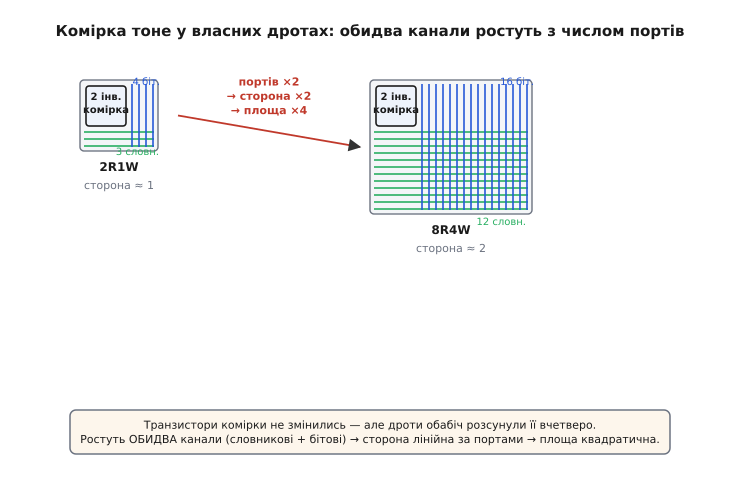
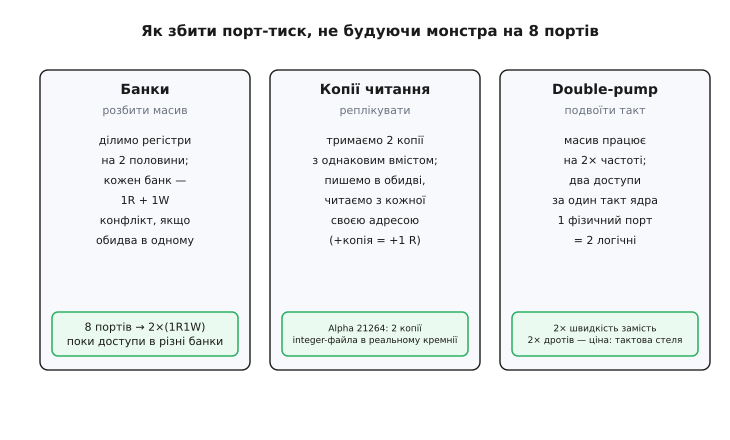

# 🧮 Математика масштабування портів регістрового файла

Є одне число, яке визначає майже всю архітектуру процесорного ядра, — і воно ховається не в логіці, а в **геометрії дротів**. Питання просте: якщо я хочу, щоб регістровий файл обслуговував не три звертання за такт, а шість чи вісім, скільки за це доведеться заплатити площею? Наївна відповідь — «удвічі більше портів, удвічі більша схема» — **хибна**. Правильна відповідь: площа росте **як квадрат** числа портів. Подвоїли порти — заплатили **вчетверо**. І саме ця квадратична стіна, а не брак ідей чи транзисторів, тримає число регістрів і портів у процесорах там, де воно є.

Мета цієї вставки — не оголосити «площа ∝ портів²», а **вивести** це співвідношення від першопричини, з фізики того, як комірка стикається з дротами. Коли механізм стане очевидним, стане очевидним і все, що з нього випливає: чому суперскалярні ядра задихаються від порт-тиску, і чому кожен реальний трюк пом'якшення — банки, копії, подвоєння частоти — це просто спосіб **не платити квадрат**.

## Що саме масштабуємо: порт — це пучок дротів наскрізь масиву

Спершу означимо предмет точно, бо вся математика тримається на одному фізичному факті.

**Порт** регістрового файла — це не «вхід» і не «роз'єм». Це **повний, самостійний канал доступу**, який фізично проходить **крізь кожну комірку масиву**. Розкладемо, з яких дротів він складається на рівні однієї комірки.

Комірка зберігання — це пара навхрест з'єднаних інверторів (як у [статичній пам'яті, SRAM](root:hw-components/sram-cell)): два стійкі стани, «0» і «1», що тримаються самі, поки є живлення. Сама комірка — кілька транзисторів у крихітному п'ятачку кремнію. Але щоб цей п'ятачок брав участь у роботі порту, до нього треба **підвести дроти двох сортів**:

- **Словниковий рядок** (*word line*) — горизонтальний дріт, що йде вздовж усього регістра. Дешифратор адреси піднімає рівно один такий рядок; він відмикає всі комірки «свого» регістра, дозволяючи їм говорити чи слухати. **Один порт — один словниковий рядок на комірку** (бо в кожного порту свій дешифратор і своя обрана адреса).
- **Бітова лінія** (*bit line*) — вертикальний дріт, спільний для одного розряду всіх регістрів; ним біт виходить (при читанні) або заходить (при записі). Тут асиметрія: **порт читання потребує однієї бітової лінії** на розряд, а **порт запису — двох** (пряму й інверсну), бо надійно перекинути пару інверторів у новий стан можна лише зустрічним штовханням з обох боків.

Звідси груба, але точна арифметика дротів на **одну комірку** — та сама, що стоїть у самій статті про регістровий файл:

```
позначмо   R = число портів читання,   W = число портів запису

словникових рядків на комірку   N_wl = R + W          (по 1 на будь-який порт)
бітових ліній на комірку         N_bl = R + 2·W        (читання 1, запис 2)
```

Для класичного **2R1W** (два читання, один запис — рівно те, що просить команда `add rd, ra, rb`):

```
N_wl = 2 + 1     = 3   словникові рядки
N_bl = 2 + 2·1   = 4   бітові лінії
```

Три горизонтальні дроти й чотири вертикальні пронизують **кожну** комірку. Запам'ятаймо ці два числа — з них виросте все інше.

> 🔧 **Навіщо це.** Коли пишете регістровий файл мовою опису апаратури й додаєте «ще один порт читання», ви подумки додаєте один рядок у код — а синтезатор додає **по дроту в кожну з тисяч комірок** у двох напрямках. Розрив між «однією стрічкою тексту» й «дротом крізь увесь масив» — це і є те, що робить порти дорогими. Розуміти цей розрив — значить не проситися легковажно про четвертий порт.

## Інтуїція: чому дроти, а не транзистори, диктують розмір

Тепер головна ідея, з якої випливає квадрат. Вона суперечить першому чуттю, тож будуймо її повільно.

Перше чуття каже: розмір комірки задають **транзистори** — скільки їх, стільки й кремнію. За цією логікою додавання порту, що дає комірці кілька транзисторів доступу, мало б збільшувати її **потроху й лінійно**. Це чуття **обманює**, і ось чому.

У щільному масиві пам'яті комірку стискають до фізичної межі — транзистори притиснуті один до одного так тісно, як дозволяє технологія. Але дроти, що йдуть **крізь** комірку, теж мають ширину й, головне, **мінімальний проміжок** між сусідніми дротами (інакше вони наведуться один на одного або замкнуться). Проміжок цей заданий технологією й від числа транзисторів не залежить. Тож коли ви ведете крізь комірку N_bl вертикальних дротів, вони займають смугу завширшки приблизно N_bl помножити на крок дроту — **незалежно** від того, які там під ними транзистори. Те саме по вертикалі зі словниковими рядками.

І ось перелам: у реальних регістрових файлах **дротів так багато, що їхня смуга ширша за самі транзистори**. Комірка перестає визначатися кремнієм — її розмір **задають дроти**. Кажуть, що масив став *wire-limited* (обмежений проводкою), а не *transistor-limited*. Комірка сидить не в п'ятачку своїх транзисторів, а в **перехресті двох пучків дротів**, і саме ширина цих пучків задає крок, з яким комірки стоять у масиві.


*Ліворуч комірка 2R1W: маленьке ядро з двох інверторів (сталий розмір) плюс вузькі канали — 3 словникові рядки внизу, 4 бітові лінії праворуч. Праворуч та сама комірка для 8R4W: ядро **не змінилося**, але канали розпухли до 12 словникових рядків і 16 бітових ліній. Порти зросли вдвічі — сторона зайнятого коміркою квадрата зросла вдвічі — площа, отже, вчетверо. Транзистори тут ні до чого: розмір диктують дроти.*

Зафіксуймо цей проміжний висновок формулою для **сторони** комірки (розміру, який вона займає в масиві по горизонталі й вертикалі). Нехай `p` — власний крок транзисторної частини (мінімальний розмір комірки без урахування зайвих дротів), `w` — крок одного дроту (з проміжком). Тоді:

```
ширина комірки  ≈ p + w · N_bl = p + w · (R + 2·W)     ← вертикальні дроти займають ширину
висота комірки  ≈ p + w · N_wl = p + w · (R + W)        ← горизонтальні займають висоту
```

Обидва виміри комірки ростуть **лінійно** з числом портів. Це ще не квадрат — квадрат народиться, коли ми перемножимо ширину на висоту.

## Формальний апарат: чому саме квадрат

Тепер зберемо площу. Площа масиву — це площа комірки, помножена на число комірок (число регістрів помножити на розрядність, що від портів **не залежить**). Тож усе цікаве — у площі **однієї** комірки:

```
площа комірки  A_cell = ширина · висота
              ≈ (p + w·(R + 2·W)) · (p + w·(R + W))
```

Погляньмо, що відбувається, коли портів **багато** (тоді `w·(R+…)` набагато більше за власний крок `p`, і членом `p` можна знехтувати). Позначмо для стислості загальне число портів `P = R + W`. Обидві дужки тоді пропорційні `P` (з точністю до того, що записи рахуються двічі в одному вимірі):

```
коли портів багато:   ширина ~ w·P,   висота ~ w·P
              A_cell  ~  (w·P) · (w·P)  =  w²·P²
```

Ось він, квадрат, у чистому вигляді. **Кожен вимір комірки лінійний за числом портів — а площа є добутком двох вимірів, тому квадратична.** Це та сама геометрія, з якої площа квадрата росте як квадрат сторони: збільшив сторону вдвічі — площа вчетверо. Тут «сторона» — це ширина каналу дротів, а вона лінійна за портами.

Порівняймо це з тим, що росте **лінійно**, — з числом **транзисторів**. Кожен порт додає комірці кілька транзисторів доступу (умовно: по одному-двоє на словниковий рядок). Тож:

```
транзисторів на комірку   ~  (стала база) + (стала) · P        ← ЛІНІЙНО за портами
площа комірки              ~  w² · P²                            ← КВАДРАТИЧНО за портами
```

Ось де ховається пастка інтуїції. Полічивши **транзистори**, ви побачите лінійний ріст і подумаєте, що подвоєння портів коштує вдвічі. Але кремнію займають не транзистори, а **дроти між ними**, і їх площа квадратична. Транзистори збрехали б вам про ціну **вдвічі** — реальна ціна **вчетверо**.

Підставмо числа, щоб відчути силу цієї різниці. Візьмімо файл, у якого крок дроту `w` домінує, і порахуймо **відносну** площу комірки для кількох конфігурацій, беручи 2R1W за одиницю. Груба оцінка — добуток `N_wl · N_bl = (R+W)·(R+2·W)`:

```
конфіг.   R  W    N_wl=R+W   N_bl=R+2W    добуток   відносно 2R1W
2R1W      2  1       3           4           12         1.0×
4R2W      4  2       6           8           48         4.0×
6R3W      6  3       9          12          108         9.0×
8R4W      8  4      12          16          192        16.0×
```

Подвоїли всі порти (з 2R1W до 4R2W) — площа комірки вчетверо. Потроїли (до 6R3W) — удев'ятеро. Учетверили (до 8R4W) — **у шістнадцятеро**. Крива площі — парабола, і вона вертикалить дуже швидко.

> 🔧 **Навіщо це.** Ці числа — не абстракція: це буквально те, у скільки разів більшу, гарячішу й повільнішу пам'ять доведеться поставити в ядро, якщо захотіти виконувати більше команд за такт. Регістровий файл суперскалярного процесора нерідко — **найгарячіша точка** всього кристала саме тому: там сходяться і квадратична площа, і довгі дроти наскрізь неї, і купа перемикань щотакту. Архітектор, який пам'ятає «16×», не малює 8-портовий монолітний файл — він шукає обхід.

## Точний варіант: коли `p` не нехтуємо

Наведена оцінка «~P²» — асимптотична: вона вірна, коли портів багато й дроти домінують. У реальному, помірно-портовому файлі власний крок комірки `p` теж важить, і повна формула лишається квадратичною, але з лінійним і сталим доданками:

```
A_cell ≈ (p + w·N_bl)·(p + w·N_wl)
       = p² + p·w·(N_wl + N_bl) + w²·N_wl·N_bl
         └┬┘   └─────┬─────┘      └────┬─────┘
        стала     лінійна за P      квадратична за P
```

Три доданки — три режими. При **малому** числі портів панує `p²` (комірку тримають транзистори, додавання порту майже безкоштовне — тому 1R- і 2R-файли дешеві). При **великому** числі портів панує `w²·N_wl·N_bl` — та сама парабола. Між ними — плавний перехід. Практична межа, за якою квадрат стає нестерпним, зазвичай припадає десь на **чотири-шість** портів: до неї файл ще терпимий, за нею роздувається лавиною. Саме тому лінія оборони архітекторів пролягає навколо цих чисел.

Зверни увагу на **асиметрію запису** в квадратичному члені. Оскільки N_bl = R + 2·W, кожен порт **запису** роздуває вертикальний вимір **удвічі сильніше** за порт читання. Тож при виборі, який порт додати, читання «дешевше» за запис — і не випадково реальні файли мають портів читання **більше**, ніж запису (класично R > W). Це видно на живому кремнії: інтегерний регістровий файл процесора **MIPS R10000** мав **сім портів читання й три записи** (7R3W), а не симетричний набір — читань навмисно більше, бо кожне дешевше.

> Довідка: інтегерний регістровий файл R10000 мав 10 портів — **7 читання й 3 записи** — щоб живити паралельне виконання чотирьох команд за такт (двох цілочислових арифметичних, однієї завантаження/збереження й однієї переходу). Статус: усталений факт, підтверджений технічними описами мікроархітектури процесора.

## Де в темі це працює: порт-тиск суперскалярних і багатопотокових ядер

Тепер видно, **навіщо** вся ця математика. Вона пояснює одну з центральних напруг сучасних процесорів — **порт-тиск** (*port pressure*).

Ланцюжок причин прямий. Щоб виконувати **кілька команд за такт** (суперскалярне ядро завширшки 2, 4, 6…), треба щотакту годувати **кілька АЛП** одночасно. Кожна арифметична команда просить два операнди й повертає один результат — 2R1W на команду. Тож ядро завширшки `k` вимагає від регістрового файла близько:

```
портів читання ≈ 2·k        (два операнди на кожну з k команд)
портів запису  ≈ 1·k        (один результат на команду)
```

Ядро завширшки 4 — це вже вимога **8R4W** до одного спільного файла. А ми щойно порахували: 8R4W коштує **у шістнадцятеро** більшої комірки за 2R1W. Додаймо сюди **багатопотоковість** (*SMT* — одночасна багатопотоковість): якщо ядро чергує кілька потоків, кожному потрібні свої регістри, файл росте вшир (більше регістрів), а вимоги портів лишаються. Виходить пам'ять, що і глибока, і широкопортова водночас, — найдорожче з можливого.

Ось чому широке ядро не можна просто «побудувати з великим файлом»: квадратична стіна робить монолітний 8-портовий файл повільним (довгі бітові лінії — велика ємність — велика затримка) і гарячим (площа й перемикання). Число портів упирається не в бажання, а в **фізику дротів**. Тому реальні широкі ядра йдуть в **обхід** — і кожен обхід є, по суті, **арифметичним трюком, як не платити P²**.


*Три способи дати ядру багато доступів, не будуючи один монстр-файл на 8 портів. Банки: розбити регістри на частини, кожна з малим числом портів, — конфлікт лише коли два звертання влучили в один банк. Копії читання: тримати кілька однакових копій масиву й читати з кожної своєю адресою (застосовано в реальному кремнії — Alpha 21264 тримав дві копії інтегерного файла). Double-pumping: ганяти масив на подвоєній частоті, віддаючи два доступи за один такт ядра. Кожен трюк міняє квадрат на щось лінійніше — ціною конфліктів, площі-копій або тактової стелі.*

## Арифметика пом'якшень: як обійти квадрат

Розберімо три головні обходи **числом**, щоб побачити, що саме кожен виграє й чим платить.

**Розбиття на банки (*banking*).** Ідея: не будувати один файл на `P` портів, а поділити регістри на `b` менших **банків**, кожен зі своїм малим набором портів. Класично — по одному читанню й одному запису на банк:

```
було:   1 файл × P портів          →  площа ~ P²  (на комірку)
стало:  b банків × (1R+1W) кожен    →  на комірку в банку ~ (1+1)·(1+2) = сталa мала величина
```

Площа падає драматично, бо кожен банк лишається малопортовим — квадрат бере **маленьке** число портів на банк, а не велике на весь файл. Ціна — **конфлікти банків**: якщо два звертання цього такту влучили в **один** банк, а в ньому лише один порт читання, одне з них треба відкласти. Тож банки додають логіку арбітражу й ризик простою; виграш реальний рівно доти, доки звертання **розкидані** по банках рівномірно. Кожен банк дає, грубо, **+1 читання й +1 запис** до сумарної пропускної здатності файла — але лише коли адреси не стикаються.

**Копії для читання (реплікація).** Ідея працює для **читань** і спирається на просту асиметрію: додати порт читання дорого, а **скопіювати весь масив** — теж коштовно, але дає одразу цілий незалежний порт. Тримаємо кілька **копій** регістрового файла з **однаковим** вмістом: у всі копії пишемо **синхронно тими самими** даними, а читаємо з кожної копії **своєю** адресою.

```
1 копія  = R портів читання
2 копії  = 2·R портів читання   (кожна копія — свій незалежний набір читань)
n копій  = n·R портів читання
```

Тобто **репліка = +один повний комплект портів читання** без роздування квадрата в одному масиві: замість одного файла на 8R будуємо два файли по 4R. Ціна — **подвоєна площа копій** і те, що **порти запису доводиться дублювати в кожну копію** (усі копії мусять лишатися однаковими). Тому реплікація вигідна, коли читань **набагато** більше за записи (а так і є). Це не теорія: процесор **Alpha 21264** тримав **дві копії** інтегерного регістрового файла, кожна на 4 читання й 6 записів, — замість одного широкопортового масиву. Кожна копія годувала **свій кластер** (одне цілочислове АЛП плюс блок обрахунку адрес), тож удвічі вужчий тракт даних дозволив і менший файл, і вищу тактову частоту; платою було те, що синхронізація записів між копіями коштувала один такт.

> Довідка: Alpha 21264 дублював інтегерний регістровий файл (дві копії по 4R6W), кожна у своєму кластері; це вдвічі зменшувало ширину тракту даних і піднімало частоту, а синхронізація записів між копіями забирала ~1 такт. Статус: усталений факт, з технічних описів мікроархітектури 21264.

**Подвоєння частоти (*double-pumping*).** Найхитріший обхід: не додавати дроти взагалі, а **встигати більше за той самий такт**. Масив ганяють на **вдвічі вищій** внутрішній частоті, ніж такт ядра, і за один такт ядра роблять **два** послідовні доступи через **той самий** фізичний порт:

```
1 фізичний порт × 2× частота  →  2 логічні доступи за такт ядра
```

Тобто фізичний файл лишається малопортовим (площа мала), а «логічно» віддає вдвічі більше. Ціна — **тактова стеля**: масив уже мусить працювати на подвоєній частоті, тож заголовна частота ядра обмежена тим, чи встигне пам'ять зробити два доступи поспіль. Коли частота ядра й так близька до межі технології, подвоїти її для файла нікуди — тоді цей трюк не працює, і лишаються банки та копії.

Погляньмо на всі три разом — кожен **міняє квадрат на щось дешевше**, і кожен має свою розплату:

```
трюк              що виграє                       чим платить
банки           малопортові шматки замість P²    конфлікти при збігу банку
копії читання   +повний набір читань за копію     подвоєна площа + дубль записів
double-pump     2 доступи без нових дротів         тактова стеля масиву
```

Жоден не «скасовує» квадрат — усі його **обходять**: розбивають велике `P` на кілька малих (банки), розмножують масив замість портів (копії), або тиснуть час замість простору (подвоєння). Що це саме обходи, а не скасування, видно з розплати: за все доводиться платити або конфліктами, або площею, або частотою. Безкоштовного багатопортового файла не існує — бо не існує безкоштовних дротів.

## Підсумок ниткою

Уся ця математика — один довгий причинний ланцюжок від фізики до архітектури. Порт — це не вхід, а **пучок дротів крізь кожну комірку**: R+W словникових рядків і R+2·W бітових ліній. Дротів у щільному файлі так багато, що вони, а не транзистори, **задають розмір** комірки, тож кожен її вимір **лінійний** за числом портів. Площа — добуток двох вимірів, тому **квадратична**: подвоїв порти — заплатив вчетверо, тоді як транзисторів додалося лише вдвічі. Ця парабола вертикалить біля чотирьох-шести портів і робить широкий суперскалярний файл найгарячішим вузлом ядра — звідси **порт-тиск**. І кожен реальний рятунок — банки, копії для читання (як дві копії в Alpha 21264), подвоєння частоти — це просто спосіб **не платити P²**: розбити велике число портів на малі, розмножити масив замість портів або встигнути більше за такт. Квадрат не скасувати; його можна лише обійти — і вся інженерія багатопортової пам'яті є мистецтвом такого обходу.
