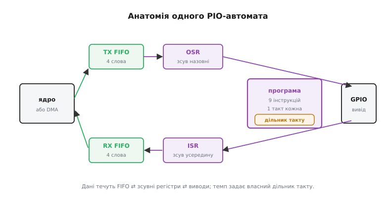
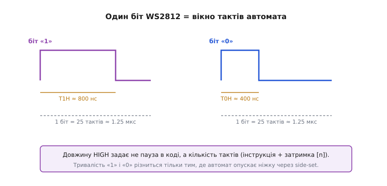
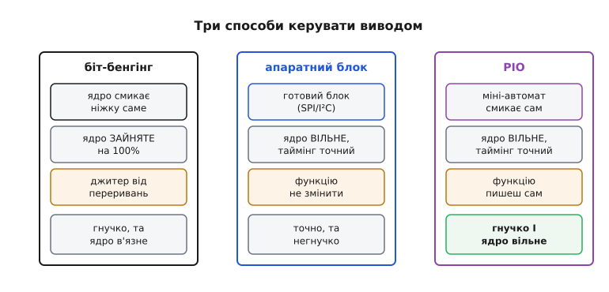

# RP2040 і PIO — детально

<preknowlist>
- [GPIO-регістри](topic:sf-devices/gpio-registers) — як ядро вмикає й читає цифрову ніжку та що таке біт-бенгінг.
- [Проблема потоку даних (DMA)](topic:hw-arch/dma-problem) — як окремий контролер рухає дані повз ядро.
- [ARM Cortex-M](topic:hw-arch/cortex-m) — що це за ядро й що означає «одна команда за такт».
</preknowlist>

Периферія будь-якого мікроконтролера скінченна: кілька UART, пара SPI, трохи таймерів — усе зафіксовано при виготовленні. Щойно потрібен протокол, якого в залізі нема (адресні світлодіоди, нестандартний паралельний дисплей, вихід відео), лишається біт-бенгінг: ядро саме смикає ніжку [GPIO](topic:sf-devices/gpio-registers) інструкція за інструкцією. Він з'їдає ядро цілком і тремтить від кожного переривання. PIO (англ. *Programmable I/O* — «програмований ввід-вивід») прибирає цей вибір: чіп дописує собі відсутній блок периферії короткою програмою для крихітного апаратного автомата, і той генерує сигнал сам, з точністю до такту, поки ядро зайняте іншим.

Тут розбираємо, *як саме* це влаштовано всередині — рівно настільки глибоко, щоб написати власний PIO-протокол і передбачити його таймінг до окремого такту. Будова одного автомата, його дев'ять команд, два зсувні регістри з автоматичним підживленням, дільник такту з дробовою точністю й кодування side-set із затримкою — усе це разом дає головну властивість PIO: **детермінований час**. Розберемо кожну частину, а тоді складемо з них повний протокол.

## Що таке скінченний автомат у залізі

Скінченний автомат (англ. *state machine* — «автомат станів») — пристрій, що в кожен момент перебуває в одному зі скінченного набору станів і щотакту переходить до наступного за чіткими правилами. У звичайному коді таку конструкцію часто розгортають програмно — цикл `switch` за змінною стану. PIO робить інакше: автомат тут **вбудований у кремній** і тактується незалежно від ядра, тож його стан змінюється навіть тоді, коли обидва ядра Cortex-M0+ зайняті чимось іншим.

У RP2040 таких автоматів вісім: **два блоки PIO, по чотири автомати в кожному**. Блоки рівноправні (`pio0` і `pio1`), кожен має власну пам'ять програм на 32 команди, спільну для всіх чотирьох своїх автоматів. Автомати всередині блоку працюють незалежно: різні програми (точніше — різні точки входу в спільну пам'ять), різні дільники такту, різні набори ніжок. Тому один блок може водночас гнати, скажімо, WS2812 на одному автоматі й приймати квадратурний енкодер на другому.

> 🔧 **Навіщо це.** Вісім незалежних автоматів означають вісім паралельних апаратних протоколів без участі ядра. Коли в проєкті потрібно водночас керувати стрічкою світлодіодів, читати кілька енкодерів і віддавати тактовий сигнал — це розкладається по автоматах, і жоден не краде такти в інших.

## П'ять частин одного автомата

Кожен автомат складається з п'яти частин, і протокол народжується з їхньої взаємодії.

**Пам'ять команд і виконання.** На блок припадає 32 комірки команд, спільні для всіх його чотирьох автоматів; програма одного автомата — короткий шматок цієї пам'яті, і кілька автоматів можуть ділити ту саму ділянку або займати різні. Автомат має лічильник команд і виконує рівно одну команду за такт — без конвеєра, без передбачення переходів. Саме ця простота робить час передбачуваним, а жорстка стеля у 32 команди диктує лаконічність PIO-коду.

**Два зсувні регістри.** OSR (англ. *output shift register* — «вихідний зсувний регістр») віддає біти назовні: команда `OUT` бере задану кількість бітів з OSR і кладе їх на ніжки, у регістр чи лічильник. ISR (англ. *input shift register* — «вхідний зсувний регістр») збирає біти ззовні: команда `IN` засуває біти з ніжок до ISR. Обидва зсуваються в наперед заданому напрямку — ліворуч або праворуч.

**Два буфери FIFO.** TX FIFO (на передачу) і RX FIFO (на прийом), по чотири 32-бітні слова кожен. Це місток між автоматом і рештою системи: ядро або [DMA](topic:hw-arch/dma-controller) кладе слова в TX FIFO, автомат їх забирає; назад автомат складає прийняте в RX FIFO, а ядро/DMA вичитує. Поки в буфері є місце й дані, автомат і ядро працюють незалежно.

**Дільник такту.** Окремий лічильник, що ділить системний такт і задає темп саме цього автомата. Завдяки дробовій частині (про неї нижче) темп виставляється майже довільний — від мегагерців до кількох кілогерців.

**Карта ніжок.** Кожен автомат отримує власні призначення GPIO: які ніжки він читає, на які виводить, якими керує через side-set. Завдяки гнучкому апаратному комутатору RP2040 майже будь-яку ніжку можна віддати майже будь-якій функції.



*Анатомія одного PIO-автомата. Дані течуть від ядра або DMA через TX FIFO у OSR і далі на ніжки; назустріч — від ніжок через ISR у RX FIFO. Темп задає власний дільник такту, логіку — крихітна програма з дев'яти різновидів команд.*

## Дев'ять команд — уся система команд

Уся мова PIO — це **дев'ять команд**. Не дев'ять рядків, а дев'ять *різновидів* — із параметрами вони покривають усе, що автомат уміє.

```txt
JMP   — умовний/безумовний стрибок (умови: X==0, X--, пін, !OSRE тощо)
WAIT  — чекати на рівень піна, на біт IRQ або на джерело — спинити автомат
IN    — засунути N бітів із джерела (піни, X, Y, ISR) до ISR
OUT   — висунути N бітів з OSR у приймач (піни, напрям, X, Y, PC, ISR)
PUSH  — віддати вміст ISR у RX FIFO
PULL  — забрати слово з TX FIFO у OSR
MOV   — копіювати між регістрами (X, Y, OSR, ISR, піни) з опціями (інверсія, дзеркало)
IRQ   — підняти/зняти прапорець переривання (для ядра або іншого автомата)
SET   — записати малу сталу (0–31) у піни, напрям або X/Y
```

До кожної команди додаються два допоміжні поля X і Y — два регістри загального призначення всередині автомата (лічильники бітів, тимчасові значення). Цих дев'яти команд достатньо, бо PIO не рахує й не приймає рішень за вас — він **точно в часі рухає біти між FIFO і ніжками**. Складну логіку лишають ядру або DMA.

Найтонше місце — `OUT`/`IN` із напрямком зсуву та `JMP` з умовами `X--` чи `!X`: на них тримаються лічильники бітів і петлі протоколу. Тривалу паузу роблять не порожнім циклом, а командою `WAIT` (чекати на подію) або вбудованою затримкою, про яку далі.

## Side-set і затримка: два таймери в кожній команді

Тут ховається головний трюк точного таймінгу. У кожній команді PIO є п'ятибітне поле, яке програміст ділить між двома можливостями: **затримкою** і **side-set**.

**Затримка `[n]`.** Після виконання команди автомат простоює ще `n` тактів, нічого не роблячи. Значення `n` — від 0 до 31 (якщо весь п'ятибітний бюджет віддано затримці). Тобто будь-яку команду можна «розтягнути» до 32 тактів, не пишучи порожніх циклів.

**Side-set.** Та сама команда може *паралельно* виставити стан кількох спеціально призначених ніжок — без жодного зайвого такту. Якщо ти оголосив `.side_set 1`, один біт п'ятибітного поля йде на керування однією ніжкою (`side 0`/`side 1`), а решта чотири лишаються затримці (`[0]`–`[15]`). Оголосиш `.side_set 2` — дві ніжки, і на затримку лишається менше.

Звідси проста, але важлива арифметика: **п'ять бітів діляться між side-set і затримкою**. Що більше ніжок ти смикаєш через side-set, то менший діапазон затримки лишається. Це фундамент, на якому стоїть увесь точний таймінг PIO: тривалість фази сигналу = (1 такт самої команди) + (затримка `[n]`), а перемикання рівня робиться side-set у потрібну мить тієї ж команди.

> 🔧 **Навіщо це.** Side-set прибирає класичну ваду біт-бенгінгу — «команда перемкнути ніжку коштує окремих тактів». У PIO перемикання безкоштовне за часом: воно їде разом із корисною командою. Тому фронти лягають точно туди, куди порахував програміст, без накопичення похибки.

## Дільник такту: дробова точність

Темп автомата задає дільник такту — і він **дробовий**: 16 бітів на цілу частину й 8 бітів на дробову (формат «16.8» з фіксованою комою). Автомат тактується на частоті `f_sys / div`, де `div` — це число від 1 до приблизно 65536 з кроком 1/256.

Навіщо дробова частина? Бо потрібні частоти рідко є цілим дільником системного такту. Якщо `f_sys = 125 МГц`, а тобі треба рівно 20 МГц для WS2812, цілий дільник дав би 125/6 ≈ 20.83 МГц або 125/7 ≈ 17.86 МГц — повз ціль. Дробовий дільник 6.25 дає рівно 20 МГц.

```txt
Дільник для WS2812 (1 біт = 25 тактів автомата, темп біта 800 кГц)
─────────────────────────────────────────────────────────────────
треба тактів автомата за секунду:  800 000 · 25 = 20 000 000  (20 МГц)
системний такт:                    125 000 000               (125 МГц)
дільник:                           125 000 000 / 20 000 000 = 6.25

ціла частина  = 6        (16 бітів)
дробова       = 0.25 = 64/256   (8 бітів)
```

Дробовий дільник працює рівномірним чергуванням: щоб дати в середньому 6.25, автомат робить більшість тактів по 6 і час від часу по 7, так що *середній* період точний. Для протоколів із допуском у десятки наносекунд (як WS2812) це бездоганно; для наджорстких випадків варто підбирати ціле `div`, щоб уникнути мікротремтіння окремого такту.

## Autopull і autopush: коли FIFO годує регістр сам

Команда `PULL` забирає слово з TX FIFO у OSR; `PUSH` віддає ISR у RX FIFO. Писати їх руками в кожній ітерації — марнувати дорогоцінні команди з тих 32. Тому PIO має **автоматичний режим**.

**Autopull.** Ти задаєш *поріг* — скільки бітів автомат має висунути з OSR, перш ніж той вважається порожнім. Щойно `OUT` вичерпав цей поріг, автомат **сам** підтягує наступне слово з TX FIFO в OSR — без окремої команди `PULL`. Для WS2812 поріг = 24: автомат висуває рівно 24 біти кольору (GRB) і автоматично бере наступний піксель.

**Autopush** — дзеркально на прийом: коли `IN` назбирав у ISR задану кількість бітів, автомат сам віддає слово в RX FIFO й обнуляє ISR. Зручно для приймачів сталої ширини (наприклад, 8-бітні слова з шини).

Тонкощів дві, і обидві — класичні мовчазні помилки:

- **Напрям зсуву.** OSR і ISR зсуваються ліворуч або праворуч, і це задається окремо. Переплутаєш — біти підуть дзеркально (молодший там, де чекали старший). Протокол «попливе» без жодної помилки компіляції.
- **Поріг.** Виставиш 32 замість 24 — автомат чекатиме зайвих 8 бітів і зсуне всю картину. WS2812 одразу покаже неправильні кольори.

> 🔧 **Навіщо це.** Autopull/autopush звільняють обмежену пам'ять команд: замість `PULL`/`PUSH` у петлі автомат робить це апаратно, і всі 32 комірки лишаються під логіку протоколу. А ще саме autopull робить підключення DMA на FIFO прозорим: DMA сипле слова в TX FIFO, автомат сам їх розбирає — ядро не торкається передачі взагалі.

## Складаємо протокол: WS2812 команда за командою

Тепер усі частини є, і програма читається повністю. WS2812 кодує кожен біт довжиною імпульсу HIGH: довгий HIGH — «1», короткий — «0», повний біт триває ≈1.25 мкс. На автоматі @20 МГц один такт ≈ 50 нс, тож біт — це 25 тактів.

:::tabs
```asm
; WS2812 — pioasm; автомат @20 МГц (1 такт ≈ 50 нс), 1 біт = 25 тактів
.program ws2812
.side_set 1               ; 1 ніжка під side-set → 4 біти лишаються затримці [0..15]

.wrap_target              ; нескінченна петля без втрати такту на стрибок
bitloop:
    out x, 1   side 0 [6]  ; 1 такт: висунути 1 біт у X, ніжка LOW; +6 затримки = 7 тактів (350 нс)
    jmp !x, do0 side 1 [3] ; 1 такт: якщо біт==0 → do0; підняти ніжку HIGH; +3 = 4 такти
    jmp bitloop side 1 [11]; біт «1»: тримати HIGH ще 1+11 = 12 тактів → сумарно T1H ≈ 800 нс
do0:
    jmp bitloop side 0 [7] ; біт «0»: ніжку LOW, 1+7 = 8 тактів → T0H ≈ 400 нс
.wrap
```
```python
# WS2812 — rp2.asm_pio; автомат @20 МГц (1 такт ≈ 50 нс), 1 біт = 25 тактів
import rp2
from rp2 import PIO

# 1 ніжка під side-set → 4 біти лишаються затримці [0..15];
# autopull із порогом 24 і напрям зсуву задано просто в декораторі
@rp2.asm_pio(sideset_init=PIO.OUT_LOW,
             out_shiftdir=PIO.SHIFT_LEFT, autopull=True, pull_thresh=24)
def ws2812():
    wrap_target()                                # нескінченна петля без втрати такту на стрибок
    label("bitloop")
    out(x, 1)            .side(0) [6]   # 1 такт: висунути 1 біт у X, ніжка LOW; +6 затримки = 7 тактів (350 нс)
    jmp(not_x, "do0")   .side(1) [3]   # 1 такт: якщо біт==0 → do0; підняти ніжку HIGH; +3 = 4 такти
    jmp("bitloop")      .side(1) [11]  # біт «1»: тримати HIGH ще 1+11 = 12 тактів → сумарно T1H ≈ 800 нс
    label("do0")
    jmp("bitloop")      .side(0) [7]   # біт «0»: ніжку LOW, 1+7 = 8 тактів → T0H ≈ 400 нс
    wrap()
```
:::

Розберемо такти по фазах, бо саме тут видно, як side-set і затримка дають точний час.

```txt
Біт «1»:
  out x,1 side 0 [6]   → ніжка LOW   7 тактів  (350 нс)  ; початок біта
  jmp !x  side 1 [3]   → ніжка HIGH  4 такти   (200 нс)
  jmp     side 1 [11]  → ніжка HIGH 12 тактів  (600 нс)
  ───────────────────────────────────────────────────
  HIGH разом = 4 + 12 = 16 тактів → T1H ≈ 800 нс ✓
  весь біт   = 7 + 4 + 12 = 23 такти + автопідживлення ≈ 25 тактів ✓

Біт «0»:
  out x,1 side 0 [6]   → ніжка LOW   7 тактів  (350 нс)
  jmp !x  side 1 [3]   → ніжка HIGH  4 такти   (200 нс)  ; коротка «шапка»
  jmp     side 0 [7]   → ніжка LOW   8 тактів  (400 нс)
  ───────────────────────────────────────────────────
  HIGH разом = 4 такти → T0H ≈ 200..400 нс ✓  (у межах допуску WS2812)
```

Ключ — `.side_set 1`: кожен `out`/`jmp` тут *водночас* виставляє рівень ніжки, не витрачаючи на це окремого такту. Якби рівень перемикали окремою командою, біт не вліз би в 25 тактів. Затримка `[n]` добирає решту часу фази. А `out x, 1` спирається на autopull із порогом 24: коли всі 24 біти пікселя висунуто, автомат сам тягне наступний з TX FIFO.

Драйвер на C лишається тонким — він тільки заводить автомат і годує FIFO:

:::tabs
```cpp
#include "hardware/pio.h"
#include "hardware/clocks.h"
#include "ws2812.pio.h"          // згенеровано pioasm із програми вище

#define WS2812_PIN 16
#define SM         0

void ws2812_init(void) {
    uint off = pio_add_program(pio0, &ws2812_program);
    pio_sm_config c = ws2812_program_get_default_config(off);
    sm_config_set_sideset_pins(&c, WS2812_PIN);                // ніжка під side-set
    float div = (float)clock_get_hz(clk_sys) / (800000.f * 25.f);
    sm_config_set_clkdiv(&c, div);                             // 6.25 → автомат @20 МГц
    sm_config_set_out_shift(&c, false, true, 24);             // зсув ліворуч, autopull, поріг 24
    pio_gpio_init(pio0, WS2812_PIN);
    pio_sm_set_consecutive_pindirs(pio0, SM, WS2812_PIN, 1, true);
    pio_sm_init(pio0, SM, off, &c);
    pio_sm_set_enabled(pio0, SM, true);
}

void ws2812_send(const uint32_t *pixels, uint n) {
    for (uint i = 0; i < n; i++)
        pio_sm_put_blocking(pio0, SM, pixels[i] << 8u);       // вирівняти GRB у старші 24 біти
}
```
```python
import rp2
from machine import Pin

WS2812_PIN = 16
# зсув ліворуч, autopull і поріг 24 задано в декораторі @rp2.asm_pio(ws2812) вище

# freq = 800 кГц × 25 тактів = 20 МГц (дільник 6.25 рахує рушій MicroPython)
sm = rp2.StateMachine(0, ws2812,
                      freq=800_000 * 25,
                      sideset_base=Pin(WS2812_PIN))            # ніжка під side-set
sm.active(1)

def ws2812_send(pixels):
    for px in pixels:
        sm.put(px << 8)                                       # вирівняти GRB у старші 24 біти
```
:::

Аргументи `sm_config_set_out_shift(&c, false, true, 24)` — це рівно ті дві тонкощі, про які йшлося: `false` — напрям зсуву (ліворуч), `true` — увімкнути autopull, `24` — поріг. Помилка в будь-якому з трьох дає «попливлі» кольори без жодного попередження компілятора.



*Один біт WS2812 — це вікно з 25 тактів автомата. Тривалість імпульсу HIGH (а отже, значення біта) задає сумарна кількість тактів команди й затримки `[n]`; перемикання рівня робить side-set усередині тієї ж команди.*

## Чому це справді третій шлях

PIO стоїть між двома знайомими крайнощами. Готовий апаратний блок (SPI/I²C/UART) точний і не займає ядро, але робить лише закладену функцію — нестандартний протокол йому недоступний. [Біт-бенгінг](topic:sf-devices/gpio-registers) універсальний, але тримає ядро в петлі весь час і тремтить від кожного переривання. PIO бере найкраще: **гнучкість (функцію пишеш сам) + вільне ядро + детермінований таймінг**.



*Три способи довести сигнал до ніжки. PIO займає клітинку, яка раніше була порожня: гнучкий, як біт-бенгінг, але з вільним ядром і точним тактом, як апаратний блок.*

Межі теж варто бачити чітко. Пам'ять — 32 команди на блок, спільні між його автоматами: складний протокол доводиться розкладати між кількома автоматами або частину логіки виносити в C. Автоматів усього вісім. Складної арифметики автомат не виконує — це генератор і приймач таймінгово-точних сигналів, а не процесор. І код прив'язаний до RP2040: на іншому чіпі (наприклад, ESP32 з його RMT) його доведеться переписувати під тамтешній механізм та його [екосистему](topic:sys-bsystem/mcu-ecosystem).

## Типові пастки на практиці

- **Таймінг рахується в тактах, не в наносекундах.** Тривалість фази = (інструкції + затримки `[n]`) × період дільника. Помилишся в одному `[n]` — протокол попливе. Рахуй такти по фазах, як вище, перш ніж заливати.
- **Напрям і поріг зсуву.** `autopull`/`autopush` із неправильним напрямом дають дзеркальні біти; неправильний поріг — зсунуту ширину слова. Класична мовчазна помилка без діагностики від компілятора.
- **FIFO лише на 4 слова.** Без DMA ядро мусить устигати підживлювати TX FIFO; на швидкому протоколі це знову прив'язує ядро. Правильне рішення — DMA на FIFO, тоді передача справді безкоштовна для ядра.
- **П'яти бітів на двох не вистачить.** Що більше ніжок під side-set, то менший діапазон затримки. Якщо потрібні і кілька ліній side-set, і довгі затримки — доводиться додавати команди-паузи, а це з'їдає пам'ять.
- **Окремий ланцюжок інструментів.** `pioasm` — окремий асемблер і окремий крок збірки; звичайним відлагоджувачем PIO-код не зупиниш, головний інструмент діагностики — логічний аналізатор. Це інша культура налагодження, ніж [покрокова відладка ядра](topic:sys-ide/why-debugger).
