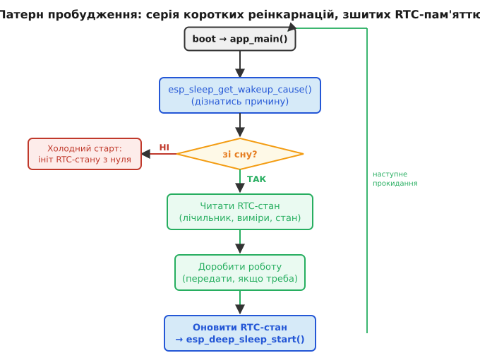

# RTC-пам'ять

Вийти з [deep-sleep](root:hw-arch/sleep-modes) — це **не «прокинутися й продовжити».** Це стартувати заново з `app_main()`: чиста SRAM, порожній стек, обнулені глобальні змінні. Усе, що жило в пам'яті під час активної фази, зникає, бо живлення з більшості чипа знято. Тому прошивку сплячого пристрою пишуть інакше, ніж звичайну: не як цикл, що триває, а як серію коротких життів, де кожне починається з нуля.

Назва **RTC-пам'ять** іде від блока, у якому вона фізично сидить, — RTC (англ. *real-time clock*, годинник реального часу). Це окремий куточок чипа з власним, дуже економним живленням: він рахує час, поки решта спить. RTC-пам'ять — кілька кілобайтів статичної пам'яті в тому самому домені живлення, тому вона переживає сон разом із годинником.

## Холодний старт чи пробудження — дві дороги в `app_main()`

Прокидання з deep-sleep — одна з [причин скидання (reset)](root:hw-arch/reset-causes), які прошивка розрізняє на старті. Код щоразу запускається спочатку, але через `esp_sleep_get_wakeup_cause()` (а ширше — `esp_reset_reason()`) дізнається головне: «я стартував не від холодного увімкнення, а зі сну». Звідси дві дороги в `app_main()`. Холодний старт (вставили батарею, натиснули reset) означає, що пам'ять пуста й усе треба ініціалізувати. Пробудження зі сну означає, що в RTC-домені лишився «спомин» від попереднього життя — і його можна підхопити замість того, щоб рахувати все наново.

Розрізнити їх — перша дія прошивки. Доки причина невідома, не можна довіряти жодній змінній: при холодному старті RTC-пам'ять містить сміття (її ніхто не ініціалізував), а при пробудженні — справжній стан. Тому код спершу питає причину, і лише тоді вирішує, читати «спомин» чи створювати його з нуля.

> 🔧 **Навіщо це.** Якщо переплутати дві дороги — наприклад, безумовно обнулити лічильник на старті, — пристрій після кожного сну думатиме, що він новонароджений, і втратить усе накопичене. Перевірка причини скидання — це той запобіжник, який відрізняє «продовжую роботу» від «починаю спочатку».

## Що переживає deep-sleep, а що ні


*Карта пам'яті уві сні: майже все знеструмлено й гине, живе лише вузький RTC-домен. Саме тому «спомин» між снами кладуть у нього.*

**Гине** звичайна SRAM (на класичному ESP32 це близько 520 КБ), регістри периферії, стан радіо Wi-Fi і BLE, усі глобальні та локальні змінні, стек задач і структури купи. З цих ділянок знято живлення, тож після пробудження там нічого осмисленого немає.

**Живе** RTC-пам'ять — на ESP32 це RTC SLOW (близько 8 КБ) і RTC FAST (теж близько 8 КБ), обидві в RTC-домені, який лишається під живленням. Разом із ними переживають сон сам RTC-таймер (він і будить чип), підмножина виводів RTC-GPIO і [ULP-співпроцесор](root:hw-arch/ulp-coprocessor) — крихітне ядро, що може збирати дані, доки головні ядра сплять.

Тут варто бути точним. RTC-пам'ять переживає **deep-sleep**, але не переживає **повного знеструмлення**: вийняли батарею — і вона зникає так само, як звичайна SRAM. Це статична пам'ять, а не Flash; вона тримається лише доти, доки на RTC-домен подано живлення. За замовчуванням ESP-IDF тримає цей домен увімкненим, якщо у програмі є хоч одна змінна в RTC-пам'яті, — але це живлення можна й вимкнути вручну (`esp_deep_sleep_pd_config`), і тоді «спомин» не доживе до ранку. Звідси чітка межа з [Flash зсередини](root:hw-components/flash-internals): критичні конфігурації, які мусять пережити будь-яке вимкнення, — у Flash; тимчасові дані, потрібні лише між двома снами, — у RTC-пам'яті, де вони дешевші й швидші.

## RTC-пам'ять як ниточка крізь сон

В ESP-IDF змінну кладуть у RTC-пам'ять атрибутом `RTC_DATA_ATTR`. Така змінна переживе deep-sleep і дасть наступному запуску «спомин»: лічильник прокидань, накопичені [ULP-співпроцесором](root:hw-arch/ulp-coprocessor) виміри, стан кінцевого автомата, час останньої передачі, кешовані параметри підключення Wi-Fi. За замовчуванням `RTC_DATA_ATTR` кладе дані в RTC SLOW пам'ять; за потреби її звільняють під ULP, а змінні переносять у RTC FAST окремим налаштуванням.

Дві ділянки розрізняються не розміром, а тим, хто й як до них дістає. RTC SLOW — повільніша, зате доступна і головним ядрам, і ULP-співпроцесору; саме тут зручно накопичувати те, що ULP збирає вві сні, а головне ядро потім читає по пробудженні. RTC FAST швидша, але прив'язана до одного ядра, тож у неї кладуть код і дані так званого wake-stub — крихітної функції, яку чип виконує одразу після пробудження, ще до повної ініціалізації системи, коли треба зреагувати миттєво й, можливо, заснути знову, навіть не піднімаючи всю прошивку. Для більшості задач вистачає простого `RTC_DATA_ATTR` і SLOW-пам'яті; тонкий поділ стає в пригоді, коли борються за кожну мікросекунду й мікроампер пробудження.

Думати про прошивку сплячого пристрою треба не як про «цикл, що триває», а як про **серію коротких реінкарнацій** (від лат. *re-* «знову» + *carnis* «плоть» — «втілення наново»): кожна починається з нуля й отримує спадщину від попередньої лише через RTC-пам'ять. Без цієї ниточки кожне життя стартувало б наосліп.



*Старт після сну як замкнуте кільце: причина → читання RTC-стану → робота → оновлення стану → сон. Холодний старт лише раз заходить збоку й ініціалізує стан.*

Оскільки кожне прокидання коштує заряду ([boot-вартість у бюджеті струму](root:embedded/duty-cycle-current)), відновлення має бути якомога швидшим. Усе, що можна взяти з RTC-пам'яті замість перечитування з Flash чи переузгодження через мережу, не платить ціну реініціалізації. Кешування SSID і ключа Wi-Fi (разом із PMK), IP-адреси, часу останньої синхронізації NTP у RTC-пам'яті здатне скоротити boot-фазу в кілька разів і відповідно знизити середній струм.

## Worked-приклад. Лічильник прокидань і батчинг через RTC-пам'ять

Найдорожча фаза сплячого пристрою — радіо. Якщо вмикати Wi-Fi на кожен вимір, передача з'їсть весь виграш від сну. Ідея батчингу (англ. *batch* — «пачка, партія»): накопичувати виміри в RTC-пам'яті, а радіо вмикати раз на кілька циклів і віддавати все одним пакетом. «Спомин» між снами тут — масив вимірів і лічильник.

```c
#include "esp_sleep.h"
#include <string.h>

// Ці змінні живуть у RTC SLOW пам'яті — переживають deep-sleep
RTC_DATA_ATTR int   boot_count = 0;
RTC_DATA_ATTR float samples[6];
RTC_DATA_ATTR int   sample_idx = 0;

#define BATCH_SIZE 6
#define SLEEP_PERIOD_US (10ULL * 60 * 1000000)   // 10 хвилин

static float read_sensor(void) {
    // ... реальне зчитування ADC або I2C-давача ...
    return 22.5f;
}

static void send_batch(float *data, int count) {
    // ... підключення Wi-Fi, MQTT/HTTP, відключення ...
}

void app_main(void) {
    boot_count++;
    esp_sleep_wakeup_cause_t cause = esp_sleep_get_wakeup_cause();

    if (cause == ESP_SLEEP_WAKEUP_UNDEFINED) {
        // Холодний старт — RTC-пам'ять містить сміття, ініціалізуємо
        sample_idx = 0;
        memset(samples, 0, sizeof(samples));
    }

    // Зчитати вимір і накопичити в RTC-пам'яті
    samples[sample_idx % BATCH_SIZE] = read_sensor();
    sample_idx++;

    // Кожне 6-те прокидання — віддати накопичене одним пакетом
    if (sample_idx % BATCH_SIZE == 0) {
        send_batch(samples, BATCH_SIZE);   // дорога Wi-Fi-фаза — раз на 60 хв
    }

    // Назад у deep-sleep — RTC-пам'ять збережена до наступного разу
    esp_sleep_enable_timer_wakeup(SLEEP_PERIOD_US);
    esp_deep_sleep_start();
}
```

Радіо вмикається вшестеро рідше, а заряд Wi-Fi-фази тепер амортизується на 6 вимірів замість одного. За [арифметикою бюджету струму](root:embedded/duty-cycle-current): якщо одна передача коштує 95 мА·с, то при батчингу × 6 на кожен вимір припадає лише близько 16 мА·с замість 95. Середній струм падає майже пропорційно:

```
Без батчингу:  передача щоразу → ~95 мА·с на вимір
З батчингом:   95 мА·с / 6 + 6 мА·с сну ≈ 22 мА·с на цикл
               I_сер = 22 мА·с / 600 с ≈ 37 мкА
               Виграш проти «передавати щоразу» ≈ кілька разів
```

Прошивка тієї самої складності, а час роботи від пари елементів АА (близько 2000 мА·год) видовжується з місяців до років — завдяки одному патерну: тримай у RTC-пам'яті, передавай рідше.

> 🔧 **Навіщо це.** RTC-пам'ять малесенька — кілька кілобайтів на все. Тому в неї кладуть не «дані взагалі», а рівно ту записку, що робить наступне прокидання коротшим: лічильники, невеликі буфери, кеш мережі. Великі масиви чи логи їй не місце — для них Flash; RTC-пам'ять береже саме те, за що інакше довелося б платити повільною реініціалізацією на кожному пробудженні.

Уся енергоощадність сплячого пристрою зводиться до одного: тримати чип у глибокому сні якомога довше, прокидатися якомога рідше й коротше. RTC-пам'ять — та нитка, що зшиває окремі пробудження в одну тривалу роботу: без неї кожна реінкарнація починала б наосліп і платила повну ціну старту, а з нею пристрій несе крізь сон саме той «спомин», який робить наступне життя дешевим.
