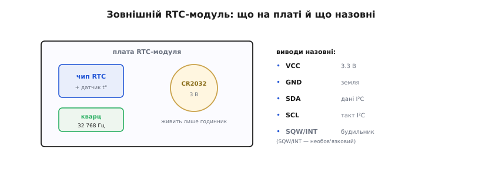

# 🔌 Зовнішній RTC-модуль: розпіновка, підключення, граблі класу

Коли внутрішнього годинника мікроконтролера не досить — потрібен час, що переживе **повне** знеструмлення й не збреже за місяці, — беруть окрему платку: **зовнішній RTC-модуль**. Це маленька плата, на якій зібрано чип годинника, **кварц на 32 768 Гц**, тримач батарейки-«таблетки» й кілька дрібних деталей обв'язки. Конкретні чипи бувають різні (точний термокомпенсований клас і дешевший клас без компенсації), але **схема підключення в усіх однакова** — тому й говоримо про модуль як про клас, без партномерів.

## Що на платі й навіщо

Серце модуля — **чип RTC**, що сам лічить секунди-хвилини-години-дату й віддає їх по [шині **I²C**](root:com-devices/i2c-bus). Поруч — **кварцовий резонатор** на характерні 32 768 Гц: це 2¹⁵ коливань за секунду, тож проста двійкова ділилка всередині чипа рівно раз на секунду «цокає». Далі — **тримач CR2032**: пласка літієва «таблетка» 3 В, що живить **лише годинник**, коли основне живлення зникло. На точних модулях у чипі схований ще й **датчик температури** для термокомпенсації; на платі часто сидить і окрема мікросхема **EEPROM** — невелика енергонезалежна пам'ять на тій самій шині (зручно покласти поряд кілька байтів налаштувань).

Виводів у модуля небагато, і вони стандартні для I²C-периферії:

```
VCC  — живлення, 3.3 В або 5 В (більшість модулів терплять обидва)
GND  — спільна земля
SDA  — лінія даних I²C
SCL  — лінія такту I²C
SQW / INT — вихід «будильника» чи прямокутного сигналу (необов'язковий)
32K  — вивід чистих 32 768 Гц (на деяких платах; рідко потрібен)
```


*На платі — чип годинника, кварц 32 768 Гц і тримач CR2032 (живить лише годинник). Назовні виходять чотири дроти I²C-підключення (VCC, GND, SDA, SCL) і необов'язковий вихід-будильник SQW/INT.*

## Чому саме 32 768 Гц

Та частота кварцу не випадкова, і варто розуміти, звідки вона. 32 768 — це рівно **2¹⁵**, тобто два в п'ятнадцятому степені. Усередині чипа стоїть простий **двійковий дільник** — ланцюжок із п'ятнадцяти тригерів, кожен з яких ділить частоту навпіл. Подавши на його вхід 32 768 коливань за секунду, на виході п'ятнадцятого тригера дістанемо рівно **один** імпульс на секунду — це і є «цок» годинника. Жодної складної математики: степінь двійки ділиться навпіл доти, доки не лишиться одиниця. Тому такий кварц десятиліттями є стандартом «годинникових» резонаторів — він дешевий, його роблять мільярдами, і саме під нього заточені всі RTC-чипи. Дрібний наслідок для збирача: якщо колись побачите окремий «годинниковий» кварц у схемі — це майже напевно ті самі 32 768 Гц.

## Вихід-будильник: як годинник будить пристрій

Окремої уваги вартий вивід **SQW/INT** — той, що я назвав необов'язковим. Для багатьох автономних пристроїв він насправді ключовий. Річ у тім, що RTC уміє не лише пасивно тримати час, а й **подати сигнал** у заданий момент: чип має один-два регістри «будильника», куди записують годину-хвилину (а то й число), і коли його власний час їх досягає, він **смикає** вивід INT у нуль. Це і є апаратний будильник.

Навіщо це на практиці? Тут у гру входить [глибокий сон](root:hw-arch/sleep-modes): пристрій, що мусить берегти заряд, більшість часу майже знеструмлений, і розбудити його може лише зовнішній сигнал на спеціальній ніжці. Якраз цей сигнал і дає вихід будильника RTC. Сценарій виходить елегантний: мікроконтролер виставляє RTC будильник «розбуди мене о 06:00», засинає в найглибший сон, споживаючи мікроампери, — а годинник на своїй краплі струму чекає. О шостій INT смикає ніжку пробудження, пристрій оживає, робить свою справу й знову лягає спати до наступного будильника. Без такого виходу довелося б або тримати ввімкненим таймер самого мікроконтролера (а він у глибокому сні часто й сам зупиняється чи бреше), або будитися надто часто. RTC-будильник дозволяє спати **точно до потрібної миті** — і саме він робить можливими пристрої, що живуть на батарейці місяцями.

Вивід цей здебільшого працює в режимі **відкритого стоку** (тягне лінію лише в нуль), тож на нього теж потрібна підтяжка до VCC — на готових платах вона зазвичай уже є. А той самий вивід на багатьох чипах уміє натомість видавати **рівний прямокутний сигнал** фіксованої частоти (1 Гц, кілька кГц) — зручно, коли треба «такт» для чогось зовнішнього; режим (будильник чи меандр) перемикають регістром.

## Як під'єднати

Підключення — як у будь-якого I²C-давача, чотирма дротами: VCC і GND до живлення, SDA та SCL — до однойменних ліній шини мікроконтролера. На ESP32 це типово GPIO 21 (SDA) і GPIO 22 (SCL), але вивід можна перепризначити. Кілька дрібниць, що економлять годину налагодження:

- **Підтяжки (pull-up) на SDA/SCL.** I²C працює на «відкритому стоці»: лінію в нуль тягне пристрій, а вгору її повертає **резистор-підтяжка** до VCC. Майже всі готові RTC-модулі вже несуть свої підтяжки (зазвичай 4.7 кОм) на платі — і це варто **перевірити**, бо якщо на одну шину повісити кілька модулів, кожен зі своїми підтяжками, сумарний опір стане замалим і шина «не підніметься». Тоді зайві підтяжки прибирають.
- **Спільна земля.** GND модуля і мікроконтролера мусять бути з'єднані — інакше рівні «попливуть» і зв'язок буде хаотичним.
- **Адреса на шині.** У RTC фіксована I²C-адреса (у відомого термокомпенсованого чипа — 0x68), і змінити її не можна. Тому **два однакові RTC на одній шині не уживуться** — конфлікт адрес. Якщо поряд на тій самій платі є EEPROM, вона відповідає на **іншу** адресу й годиннику не заважає.

## Граблі класу

Тепер найважливіше — типові пастки, на яких спотикаються майже всі, хто бере дешевий RTC-модуль уперше.

**Пастка перша, найнебезпечніша: підзарядка під CR2032.** Багато дешевих модулів несуть **схемку підзарядки** батарейки — резистор і діод, що потроху «доливають» струм у тримач, коли подане основне живлення. Задумано це під **акумуляторну** літієву «таблетку» (на кшталт LIR2032, що її можна заряджати). Та продають такі модулі здебільшого зі **звичайною CR2032 — а вона незаряджувана**. Спроба «зарядити» незаряджувану таблетку гріє її, вона **здувається**, а в гіршому разі може й **спалахнути** — є реальні випадки за рік-два безперервної роботи. Тому правило: ставите звичайну CR2032 — **знеструмте схему підзарядки** (на платах її гасять, прибравши той резистор), або беріть модуль без неї. Заряджувану таблетку лишати під підзарядкою можна, але переконайтеся, що це справді вона.

**Пастка друга: годинник «забув» час, хоч батарейка стоїть.** Часто причина — **сіла батарейка** (CR2032 не вічна, надто якщо її випадково підсаджувала згадана схемка) або вона **погано контачить** у дешевому тримачі. Друга причина тонша: у багатьох RTC є **прапорець зупинки генератора** (його ставить чип, коли помічає, що живлення зникало повністю й резерву теж не було). Доки цей прапорець піднятий, годинник може **не цокати** навіть після відновлення живлення, аж доки час не виставлять наново. Готові бібліотеки вміють це перевіряти й скидати — варто звіряти час при старті й, якщо він «нереальний» (наприклад, 2000 рік), переставляти його з NTP чи вручну.

**Пастка третя: 5 В проти 3.3 В.** Модуль зазвичай терпить обидва живлення, але якщо запитати його від 5 В, лінії SDA/SCL **підтягуються до 5 В**, а ніжки 3.3-вольтового мікроконтролера такого можуть не любити. Найбезпечніше — живити RTC-модуль тим самим **3.3 В**, що й сам мікроконтролер; тоді рівні шини збігаються й перетворювач рівнів не потрібен.

**Пастка четверта: плутанина BCD при прямому доступі.** Якщо читаєте регістри чипа напряму (а не через бібліотеку), пам'ятайте: час лежить у **BCD** — кожна десяткова цифра окремим півбайтом. Прочитавши «години» сирим байтом, легко отримати безглузді «20:00» там, де насправді 14:00. Бібліотеки роблять перерахунок самі, але при ручному доступі це джерело примарних помилок.

> 🔧 **Навіщо це.** Зовнішній RTC-модуль — найдешевший спосіб дати автономному пристрою надійний календарний час: під'єднав чотирма дротами, виставив раз — і він тримає час роками на одній «таблетці». Але саме цей клас плат носить дві приховані міни: схему підзарядки під незаряджувану CR2032 (ризик здуття чи пожежі) і прапорець зупинки генератора, через який годинник мовчить після знеструмлення. Знаючи про них наперед, ви заощадите собі і згорілу батарейку, і години здивування, чому «годинник із батарейкою все одно щоразу скидається».
