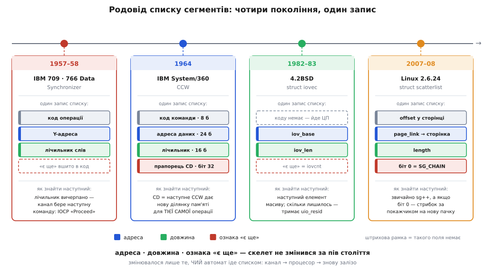
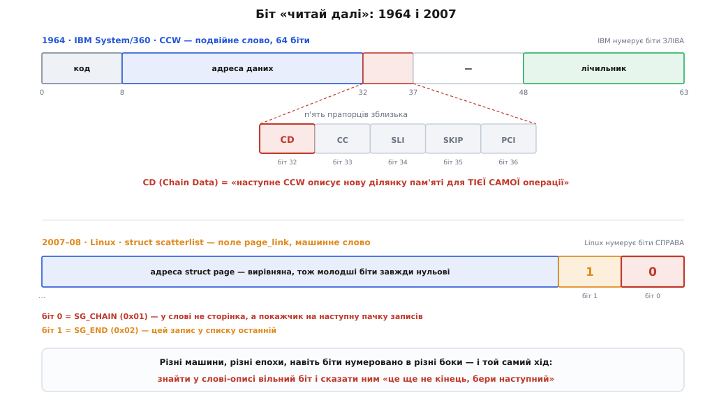

# 📜 Родовід списку сегментів

Коли та сама структура зринає в машинах, між якими пів століття й жодної спільної деталі, це варте пояснення. Список пар «адреса, довжина» народжувався щонайменше чотири рази: у лампових каналах IBM кінця 1950-х, у System/360, у ядрі берклівського Юніксу, у драйверах Linux. Щоразу інші люди, інша задача, інше залізо — і щоразу та сама пара чисел плюс ознака «є ще».

Найпростіше пояснення — переписували одне в одного. Воно майже напевно хибне — і зрозуміти, чому саме, цікавіше за самі дати. Бо якщо структура з'являється не через копіювання, значить, її щось **змушує** з'явитися, і варто розібратися, що саме.


*Колір поля — за **роллю**, не за епохою: адреса синя, довжина зелена, ознака «є ще» червона. Читаючи картки зліва направо, видно повтор тієї самої трійці. Штрихова рамка означає, що окремого поля немає — роль виконує щось інше: у 709 ознака «є ще» вшита в сам код операції, а в `iovec` її заміняє лічильник елементів масиву.*

## Умова, за якої список узагалі стає можливим

Перш ніж шукати перший scatter-gather, варто спитати, коли він став **можливим**. Відповідь проста: доти, доки байти переносить процесор, ніякого списку сегментів бути не може — і не тому, що ніхто не здогадався.

IBM 704 (середина 1950-х) переганяв дані інструкцією `CPY` — по одному слову за раз, під керуванням програми, без системи переривань. Процесор мусив крутити цикл `CPY`, підлаштований під швидкість стрічки: не встиг — дані загублено. Одна стрічка за раз, і весь час машини йшов на те, щоб ритмічно тикати в пристрій.

Зверніть увагу, що в такій машині список сегментів **безглуздий**. Раз байти перекладає процесор, він і так у кожен момент знає, куди класти наступне слово, — адреса живе в регістрі, а не в описі. Список потрібен лише тоді, коли є **хтось інший**, кому цю адресу треба заздалегідь **розповісти**.

Отже, справжня передумова — поява автономного рушія, який читає своє завдання **з пам'яті**. Не просто [окремої залізяки, що вміє переносити байти](root:hw-arch/dma-controller), а такої, що бере з пам'яті **програму** й іде нею сама. Щойно з'явився автомат, який читає послідовність команд із пам'яті, — з'явилося й місце, куди можна покласти другу команду. А друга команда, що продовжує ту саму передачу в іншу ділянку, — це вже scatter-gather, хай навіть ніхто ще не вимовив цих слів.

## IBM 709 і слово «Proceed»

Такий рушій з'явився в IBM 709 — ламповій машині, оголошеній у січні 1957-го й уперше встановленій у серпні 1958-го. Її блок IBM 766 Data Synchronizer заведено вважати **першим канальним контролером** в історії: він давав два незалежно програмовані канали введення-виведення, які працювали паралельно з процесором. Частину ідей 709-й, за наявними описами, успадкував від проєкту Stretch, що йшов у IBM тими ж роками (сам Stretch поїхав до замовника пізніше, 1961-го), — тож казати «канал винайшли для 709» було б надто сміливо: радше 709 першим його **привіз**.

Канал 709/7090 мав власний набір команд, і в їхніх назвах уже все сказано. Головні:

```
IOCD — I/O under Count control and Disconnect
       переслати задане число слів із заданої адреси — і від'єднатися
IOCP — I/O under Count control and Proceed
       переслати задане число слів — і ВЗЯТИ НАСТУПНУ КОМАНДУ
IORP — I/O of a Record and Proceed
       гнати до кінця запису або доки лічильник не вичерпається —
       і взяти наступну команду
TCH  — Transfer in Channel: перехід усередині канальної програми
```

Уся вага — в різниці між `D` і `P` наприкінці мнемоніки. `Disconnect` означає «це кінець». А `Proceed` означає: коли лічильник слів упаде до нуля, канал **бере наступну команду з пам'яті й веде ту саму передачу далі** — за новою адресою, з новим лічильником. Запис на стрічці не переривається; переривається лише ділянка пам'яті, у яку він лягає.

Прочитайте це визначення ще раз і порівняйте з тим, що ви очікували побачити тільки в 1964-му. Ланцюжок `IOCP → IOCP → IOCD` — це список сегментів. Кожна команда несе адресу й довжину; ознака «є ще» захована в самому коді операції; канал іде списком сам. Один запис зі стрічки розсипається по трьох різних місцях пам'яті — тобто **scatter-read**, за сім років до System/360:

```
   IOCP  БУФЕР_A, 20     ← перші 20 слів запису лягають за адресою БУФЕР_A
   IOCP  БУФЕР_B, 100    ← наступні 100 слів того самого запису — у БУФЕР_B
   IOCD  БУФЕР_C, 36     ← останні 36 слів — у БУФЕР_C, і канал від'єднується
```

> 🔧 **Навіщо це.** Тут видно, звідки взагалі береться потреба. Заголовок запису й корисне тіло — різні за призначенням: заголовок треба розібрати програмі, тіло треба покласти туди, де його чекають. Якби канал умів лише «висип усе підряд з однієї адреси», програмі довелося б потім **переносити** тіло на місце. `IOCP` прибирає цей перенос: канал одразу кладе кожен шматок куди слід. Це той самий мотив, що через пів століття зватимуть zero-copy, — і він виник ще в ламповій машині.

**Статус доказовості.** Що 766 Data Synchronizer — перший канальний контролер, а 709 — перша машина з канальним введенням-виведенням, стоїть у довідкових джерелах узгоджено; це усталене твердження, хоч і не першоджерельне. Семантика `IOCP`/`IORP` («лічильник вичерпано → бери наступну команду») засвідчена і в описах системи команд, і незалежно — в реалізації симулятора SIMH, який цю логіку відтворює. А от де саме проходить межа між 709 і 7090 у деталях набору команд, я за наявними джерелами впевнено не проведу: машини програмно споріднені (7090 — транзисторний 709), більшість доступних описів команд каналу подано для сімейства разом. Тож обережне формулювання таке: **data chaining існує з покоління 709/7090, кінець 1950-х**, а не «з 1964-го».

## System/360: не винахід, а називання

7 квітня 1964 року IBM оголосила System/360. Архітектуру описали Джин Амдал (Gene Myron Amdahl), Ґеррит Блау (Gerrit Anne Blaauw — нідерландець, народжений у Гаазі, згодом професор університету Твенте) і Фред Брукс (Frederick Phillips Brooks Jr.) у статті «Architecture of the IBM System/360» — IBM Journal of Research and Development, том 8, квітень 1964-го. Дата оголошення й авторський склад — усталені факти.

Канальна команда System/360, **CCW**, — це подвійне слово на 64 біти:

```
біти  0–7   код команди
біти  8–31  адреса даних (24 біти)
біти 32–36  прапорці: CD · CC · SLI · Skip · PCI
біти 48–63  лічильник (16 біт)
```

І от тепер найважливіше. Якщо scatter-read уже вмів 709, що ж такого зробила System/360?

Вона **розчепила** два різні «далі», які доти сиділи злиплими в коді операції, і дала кожному власний біт:

- **CD** (Chain Data, біт 32) — продовжити операцію, взявши ділянку пам'яті з наступного CCW. Команда та сама, дані ті самі, змінюється лише **куди класти**.
- **CC** (Chain Command, біт 33) — виконати наступне CCW як **нову команду**.

Це два цілком різні наміри, і в 709 їх не було як окремих понять: `IOCP` казав «є ще» одним нероздільним шматком сенсу. System/360 зробила з них два ортогональні прапорці — а отже, два **іменовані** поняття, які можна обговорювати, документувати й комбінувати окремо. (Настільки окремо, що знадобилося навіть правило старшинства: якщо в одному CCW підняти обидва, data chaining переважає.)

Ось у чому внесок архітектури, і це загальніший урок, ніж здається. Внесок архітектури часто не в тому, що вона щось уперше зробила, а в тому, що вона розділила злиплене й дала частинам імена. Після цього про річ **можна думати**. Доки «продовжити дані» й «продовжити команду» — одна мнемоніка, ти маєш прийом. Щойно це два біти в різних позиціях — ти маєш поняття.

Тоді ж, у документації IBM, поняття отримало й свої слова. Data chaining описували так: наступне CCW дає адресу **додаткових даних для тієї самої команди**, завдяки чому частини одного запису читаються в кілька різних ділянок пам'яті або пишуться з них, — і саме це назвали **gather-writing** і **scatter-reading**. Тобто «scatter» і «gather» у нашому сенсі — слова IBM, і вони прижилися так міцно, що через двадцять років спокійно перекочували в Юнікс, а через сорок — у Linux, уже ніким не пов'язані з мейнфреймами.

## Дев'ятнадцять років — і зовсім інший світ

Далі в родоводі провал: жодних канальних програм, ніяких мейнфреймів. Наступна поява — у Каліфорнії, у групі CSRG Берклійського університету, яка на гроші DARPA робила Юнікс із мережею.

Тут корисно спинитися й оцінити, наскільки чужий це ґрунт. У 709 список сегментів читало **залізо**. У Берклі ніякого каналу немає: `readv` — це системний виклик, і список обходить **процесор** звичайним циклом. Спільного з CCW — нуль: інша машина (VAX), інша задача (сокети й файли), інші люди, інша галактика. І все ж:

```c
/*	uio.h	6.1	83/07/29	*/

struct iovec {
	caddr_t	iov_base;
	int	iov_len;
};

struct uio {
	struct	iovec *uio_iov;
	int	uio_iovcnt;
	int	uio_offset;
	int	uio_segflg;
	int	uio_resid;
};
```

`iov_base` і `iov_len` — адреса й довжина. Знову вони.

Але найкраще в цьому файлі — не `iovec`, а `uio`. Подивіться на `uio_resid`: скільки байтів **ще лишилося** переслати. І на пару `uio_iov` / `uio_iovcnt`: покажчик на поточний сегмент і скільки їх ще попереду. Це не опис списку — це опис **місця, де ми в ньому зупинилися**. Берклійці не просто повторили пару «адреса, довжина»: вони закріпили в структурі те, що передача обривається посеред сегмента й має вміти продовжитися. Той самий висновок, до якого змушує будь-яка реальна передача, — оформлений як поле структури.

Опис `readv` на сторінці посібника 4.2BSD не залишає сумнівів щодо родоводу слів: виклик, сказано там, **розсіює** («scatters») вхідні дані по буферах, заданих елементами масиву `iovec`. Слово IBM, ужите про системний виклик Юніксу.

**Статус доказовості — і одне уточнення, яке варто зробити.** Загальновідоме твердження «`readv`/`writev` уперше з'явилися в 4.2BSD» походить із розділу HISTORY пізніших посібників BSD (у самій сторінці 4.2BSD такого розділу ще немає — це ретроспективна приписка). Як твердження про **випуск** воно правильне: 4.2BSD вийшла в серпні 1983-го. Але код старший. У дереві 4.1cBSD той самий `uio.h` має тавро `4.1 82/09/04` — **4 вересня 1982 року**, з тими самими `struct iovec` і `struct uio` до останнього поля. За хронологією Кірка Мак-Кузіка (Marshall Kirk McKusick), проміжні збірки йшли так: 4.1a — квітень 1982-го, лише для місцевого вжитку; 4.1b — червень 1982-го, кілька машин у Берклі; 4.1c — квітень 1983-го. Тобто структура існувала щонайменше з осені 1982-го, а «з'явилася в 4.2BSD» означає «тоді її побачив світ».

Кому її приписати — питання, на яке я чесно не відповім. Білл Джой (Bill Joy) пішов у Sun Microsystems навесні 1982-го, роботу завершував Сем Леффлер (Sam Leffler); тавро `82/09/04` лягає вже після відходу Джоя, але саме лише тавро файлу не називає автора. Тож: **структура — CSRG, осінь 1982-го; конкретне ім'я за цими джерелами не встановлюється.**

## Linux: масив упирається в стелю — і ланцюг народжується знову

Четверта поява — найпоказовіша, бо тут видно не лише структуру, а й **силу, що її витискає**.

У Linux список сегментів для DMA — це масив `struct scatterlist`. Масив, а не ланцюг: простий, кеш-дружній, ходиш по ньому `sg++`. І в нього була вбудована стеля — масив мав уміститися в **одну сторінку**. Порахуймо, чого це коштувало:

```
i386: sizeof(struct scatterlist) ≈ 20 Б
      4096 Б / 20 Б            = 204 записи на сторінку
      204 × 4096 Б             ≈ 835 584 Б ≈ 800 КБ

  → одна передача не могла перевищити ~800 КБ,
    а на x86-64 (запис удвічі товщий) — удвічі менше
```

Для дисків початку 2000-х це не тиснуло. Для багатомегабайтних передач на потужних машинах — стало стіною.

Що робити з масивом, який уперся в стелю? Данець Єнс Аксбоє (Jens Axboe, народжений в Оденсе, супровідник блокового рівня Linux) запропонував рішення, від якого людина, що читала посібники IBM 1964 року, всміхнеться: **зчепити пачки записів у ланцюг**. Хай масив лишається масивом, але останній запис пачки хай каже: «далі не тут, іди за покажчиком». Джонатан Корбет (Jonathan Corbet) описав патч на LWN 16 травня 2007-го — на той час уже шоста редакція; до ядра chaining дійшов у версії 2.6.24, випущеній 24 січня 2008-го.

Тепер — як саме сказано «є ще». Адреса сторінки завжди вирівняна, тож молодші біти покажчика завжди нульові: місце, яке дарма пропадає. Туди й поклали ознаку:

```c
#define SG_CHAIN	0x01UL   /* біт 0: у page_link не сторінка, а покажчик
                                    на наступну пачку записів */
#define SG_END		0x02UL   /* біт 1: цей запис — останній у списку */

static inline struct scatterlist *sg_next(struct scatterlist *sg)
{
	if (sg_is_last(sg))
		return NULL;
	sg++;
	if (unlikely(sg_is_chain(sg)))
		sg = sg_chain_ptr(sg);
	return sg;
}
```

Порівняйте `sg_next` із каналом System/360. Автомат дивиться на запис. Піднято ознаку кінця — стоп. Не піднято — береться наступний запис; а якщо той каже «я не сегмент, я перехід», автомат іде за покажчиком і веде далі. Це `CD`, `CC` і `TIC` (Transfer In Channel — той самий перехід, що на 7090 звався `TCH`) в одній інлайновій функції на C, написаній 2007 року людиною, якій System/360 для цього не була потрібна.


*Головна теза родоводу в одній картинці. Угорі — CCW: 24-бітова адреса, 16-бітовий лічильник і окреме поле прапорців, де `CD` (біт 32) каже «наступне CCW дає нову ділянку для тієї самої операції». Унизу — `page_link`: адреса сторінки, вирівняна так, що молодші біти вільні, і в них — `SG_CHAIN` (біт 0) та `SG_END` (біт 1). Зверніть увагу на пастку: IBM нумерує біти зліва, Linux — справа, тож жодного числового збігу тут немає й бути не може. Збіг — у ході думки: знайти у слові-описі вільний біт і сказати ним «це ще не кінець».*

Ця остання деталь варта того, щоб її не змазати. Спокусливо було б написати «і там, і там — біт chaining», натякаючи на спорідненість. Але «біт 32» у CCW і «біт 0» у `page_link` — це різні системи числення бітів, і рівність тут суто риторична. Саме тому збіг **не** можна пояснити копіюванням: якби Аксбоє переписував із CCW, він переписав би й розкладку. Він її не переписував. Він розв'язував ту саму задачу тим самим наявним матеріалом — і прийшов туди ж.

## Чому це щоразу той самий список

Тепер зберімо. Чотири появи, розкидані на пів століття, без спільної лінії успадкування. Пояснення «переписували» не тримається: між каналом 709 і `sg_next` немає ланцюжка запозичень, а розкладка бітів у кожному поколінні своя. Але й «дивовижний збіг» — не пояснення, а відмова від нього.

Правильна відповідь у тому, що структуру **затискають умови**. Щоразу, коли сходяться три обставини:

1. пам'ять роздроблена — суцільного шматка потрібного розміру просто немає;
2. байти переносить **не** той, хто складав буфер, а окремий автомат, що йде фізичними адресами;
3. зайва копія неприйнятна — саме заради її відсутності все й затівалося,

— простір розв'язків стискається майже до точки. Автоматові треба **якось** дізнатися про кожен шматок. Він не має ні таблиці сторінок, ні контексту програми — отже, кожен шматок мусить бути названий явно: адреса й довжина, іншого способу вказати на ділянку пам'яті не існує. Шматків більше за один — отже, потрібен порядок, тобто послідовність. Автомат мусить знати, де кінець, — отже, потрібна ознака «є ще», і найдешевше її нести в самому записі. Все. Це не один із варіантів — після трьох умов більше нічого не лишається винаходити.

Ось чому кожне покоління доходить до списку сегментів самотужки й не потребує попереднього. Інженер IBM 1957 року, берклієць 1982-го й Аксбоє 2007-го розв'язували одну задачу під одними обмеженнями — і задача має по суті один розв'язок. Структура не передавалася у спадок; вона щоразу **виводилася наново**, як однакова відповідь на однакове рівняння.

І тоді зрозуміло, що саме змінювалося за пів століття. Не структура — вона стояла. Змінювалося те, **чий** автомат іде списком: канал 709, канал System/360, процесор у `readv`, знову залізо в `dma_map_sg`. І змінювалося те, як записано ознаку «є ще»: вшита в код операції (709), окремий прапорець у полі (CCW), лічильник елементів масиву (`iovec`), украдений біт вирівняного покажчика (`scatterlist`). Чотири способи сказати одне слово — «далі».

## Що тут доведене, а що — здогад

Наостанок варто розділити те, що зазвичай подають однією інтонацією.

**Усталене:** IBM 709 оголошено в січні 1957-го, встановлено в серпні 1958-го; 766 Data Synchronizer — перший канальний контролер. System/360 оголошено 7 квітня 1964-го; архітектуру описали Амдал, Блау й Брукс у IBM Journal of Research and Development. Розкладка CCW і значення `CD`/`CC` — із документації архітектури. 4.2BSD вийшла в серпні 1983-го. Ядро 2.6.24 вийшло 24 січня 2008-го; `SG_CHAIN`/`SG_END` — із чинного заголовка ядра.

**Уточнене тут проти ходячої версії:** що scatter-gather «почався з System/360 у 1964-му» — надто щедро до System/360. Data chaining працює з покоління 709/7090, з кінця 1950-х; внесок System/360 інший і не менший — вона розділила data chaining і command chaining на два ортогональні іменовані прапорці й дала явищу слова **scatter-read** та **gather-write**. Так само «`readv` з'явився у 4.2BSD» — правда про випуск, але код стоїть у дереві з тавром 4 вересня 1982 року.

**Тонше, ніж хотілося б:** межу між 709 і 7090 у деталях набору канальних команд я за наявними джерелами не проводжу — описи здебільшого подано для сімейства разом. Авторства `struct iovec` жодне з опрацьованих джерел не називає; тавро файлу автора не встановлює, а Джой на той час уже пішов у Sun.

**Здогад, і його треба називати здогадом:** що всі чотири появи **незалежні**. Доведено лише те, що слова `scatter`/`gather` тягнуться від IBM, що структури ізоморфні й що жоден із проаналізованих описів не каже «ми взяли це з CCW». Розкладка бітів у кожному поколінні своя — це сильний доказ проти прямого переписування, але доказ непрямий. Строго кажучи, «незалежне перевідкриття» тут — найкраще пояснення наявних свідчень, а не задокументований факт. Різниця між цими двома речами й є тим, що відрізняє історію від легенди.
