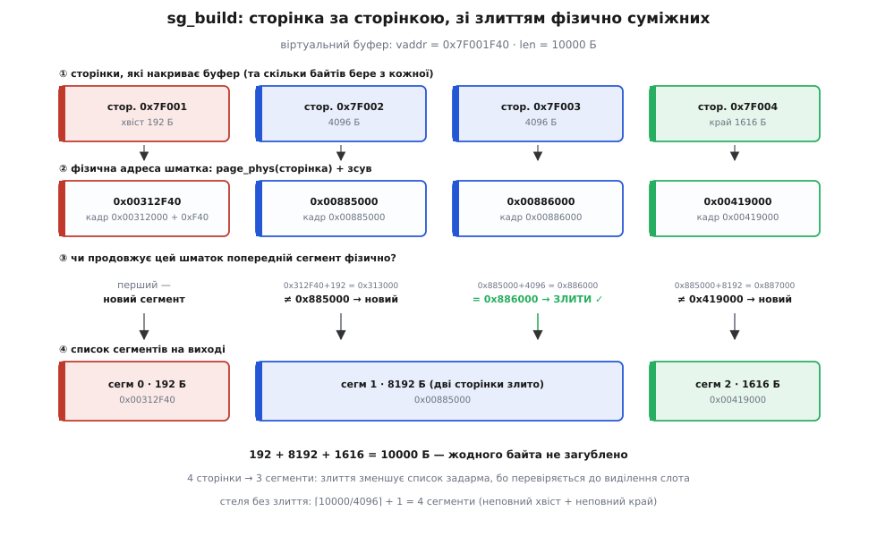
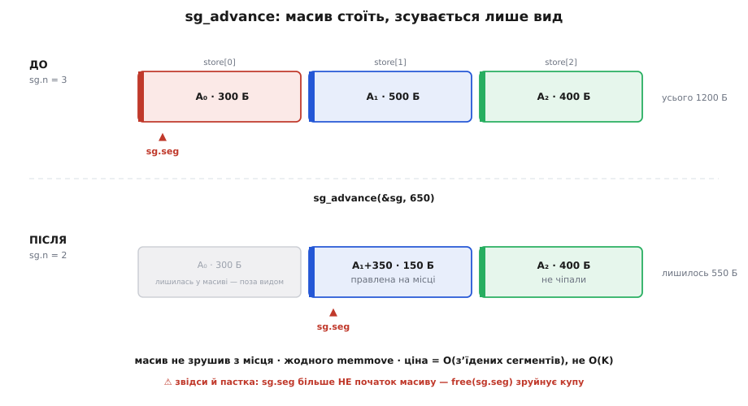

# ⚙️ Список сегментів у коді: побудова, злиття, advance і шлях-відскок

Тридцять рядків — тип, сума, обрізання — це макет. Він правильний і показує думку, але між ним і кодом, якому можна довірити рушій DMA, лежать три речі, про які макет мовчить.

Перша: **звідки список береться**. «Пройти буфер сторінка за сторінкою й злити фізично суміжні» — одне речення, а всередині нього і невирівняний початок, і перевірка суміжності, і стеля масиву, у яку впирається роздроблений буфер.

Друга: функція, що **повертає індекс**, — ще не операція над типом. Залишок лишається в голові у виклику: «продовжуй з i-го, і не забудь, що i-й уже підрізаний». Справжня операція мусить віддати сам залишок — і при цьому втримати закон, який порушується тихо.

Третя: **шлях-відскок**. Коли список програє й доводиться копіювати, це копіювання теж хтось має написати — і саме воно впирається в питання, про яке тип `(адреса, довжина)` мовчить принципово.

З цього питання й почнімо, бо відповідь на нього визначає форму всього іншого.

## Одна структура, два адресні простори

`uintptr_t addr` — це число. Але **чиє** число?

Кандидатів рівно два. Або це **віртуальна адреса** — та, якою ходить процесор. Тоді список можна розіменувати: читати, писати, `memcpy`. Саме такий список подає `writev` — масив `iovec` із покажчиками, зрозумілими програмі.

Або це **фізична адреса** (чи адреса, якою пристрій бачить пам'ять після IOMMU) — та, якою ходить рушій. Такий список призначений залізу, і розіменувати його з коду не можна: у користувацькому просторі такої адреси немає в жодній таблиці сторінок, а в ядрі до неї спершу треба долізти окремим відображенням.

Тип у обох випадків однаковий. Дії — протилежні. І тому найдорожча помилка в цьому коді не арифметична, а **семантична**: `memcpy` з фізичної адреси компілюється бездоганно, мовчить на всіх попередженнях і виявляється лише на залізі — у кращому разі падінням, у гіршому тихим псуванням чужої пам'яті за адресою, яка випадково виявилася відображеною.

Дисципліна проста, і в типі її немає: **один список живе в одному просторі**, і хто його створив, той і знає, в якому. Linux цю дисципліну вносить прямо в систему типів — заводить окремий `dma_addr_t`, щоб адресу для пристрою не можна було випадково підставити туди, де компілятор чекає покажчик. У коді нижче простір названо в контракті кожної функції; це слабше за окремий тип, але принаймні чесно.

```c
#include <stdint.h>    // uintptr_t, SIZE_MAX
#include <stddef.h>    // size_t
#include <string.h>    // memcpy
#include <stdbool.h>

// Один суцільний клапоть. Простір адреси НЕ закодовано в типі —
// його задає той, хто список побудував (див. контракт кожної функції).
struct sg_seg {
    uintptr_t addr;    // початок клаптя
    size_t    len;     // скільки байтів у клапті
};

// ВИД (view) на масив сегментів. НЕ власник памʼяті: під масив хтось
// інший (виклик, арена, пул драйвера) уже виділив місце.
struct sg_list {
    struct sg_seg *seg;   // куди дивимось зараз
    int            n;     // скільки сегментів попереду
};
```

Розділення «вид ≠ власник» виглядає педантизмом рівно доти, доки не дійдемо до `advance` — там воно виявиться тим, що робить операцію дешевою, і водночас тим, що ставить найпідступнішу пастку в усьому файлі.

## Сумарна довжина: місце, де переповнення не гіпотетичне

Найпростіша операція — і на ній уже видно різницю між макетом і робочим кодом.

```c
// Сумарна довжина списку. Простір адрес — будь-який (адреси не чіпаємо).
// false ⇒ сума не влазить у size_t; *out не змінено. O(n).
bool sg_total(const struct sg_list *sg, size_t *out) {
    size_t s = 0;
    for (int i = 0; i < sg->n; i++) {
        if (s > SIZE_MAX - sg->seg[i].len) return false;   // перевірка ДО додавання
        s += sg->seg[i].len;
    }
    *out = s;
    return true;
}
```

Уся суть — у рядку перевірки, і в тому, що вона стоїть **перед** додаванням, а не після. Спокуса написати `if (s + len < s) return false;` — «додав, глянув, чи не перескочило» — для беззнакових типів працює: перенос у `size_t` визначений стандартом, і сума справді стане меншою. Але ця перевірка тримається на тому, що тип беззнаковий, і ламається тихо в той день, коли хтось поміняє поле на `ssize_t` чи `int64_t`: для знакових типів переповнення — невизначена поведінка, компілятор має право вважати, що його не буває, і **викидає перевірку разом із гілкою**. Форма `s > SIZE_MAX - len` не переповнює нічого ніколи (`len ≤ SIZE_MAX`, отже, різниця невід'ємна), тож переживає таку заміну без сюрпризів.

Що це не паперовий страх, видно з `readv`: серед його помилок стандарт Linux прямо перелічує `EINVAL` — «сума значень `iov_len` переповнює `ssize_t`». Ядро рахує цю саму суму й перевіряє її саме тут, бо через список сегментів заходить довільне число з користувацького простору, а сегментів може бути тисяча.

## Побудова: сторінка за сторінкою, зі злиттям

Тепер головне — звідки список береться.

> **Що треба знати про сторінки.** Пам'ять роздана сторінками сталого розміру (типово 4096 Б). Віртуальна сторінка відображена в довільний фізичний **кадр**, і сусідні віртуальні сторінки майже ніколи не лягають у сусідні кадри. Байт усередині сторінки зберігає свій **зсув**: якщо віртуальна сторінка `V` лягла в кадр `F`, то байт `V + off` фізично сидить за `F + off`. Саме на цій рівності тримається весь прохід нижче — детально механізм розібрано у [віртуальній пам'яті](root:hw-arch/virtual-memory).

Вхід: віртуальна адреса й довжина. Вихід: список фізичних сегментів. Між ними — прохід, що бере від кожної сторінки рівно стільки, скільки та може дати.

```c
#define PAGE_SIZE  4096u
#define PAGE_MASK  (PAGE_SIZE - 1u)

// Адреса кадру, у який відображено сторінку page_vaddr (у житті — virt_to_phys(),
// або те, що поверне шар DMA-відображення разом із програмуванням IOMMU).
typedef uintptr_t (*page_phys_fn)(uintptr_t page_vaddr, void *ctx);

// Побудувати список ФІЗИЧНИХ сегментів із суцільного ВІРТУАЛЬНОГО буфера.
// store/cap — памʼять під сегменти (виклик — власник).
// Повертає кількість сегментів або -1, якщо не влізло в cap.
int sg_build(struct sg_list *sg, struct sg_seg *store, int cap,
             uintptr_t vaddr, size_t len,
             page_phys_fn page_phys, void *ctx)
{
    sg->seg = store;
    sg->n   = 0;

    uintptr_t v    = vaddr;
    size_t    left = len;

    while (left > 0) {
        size_t off   = (size_t)(v & PAGE_MASK);   // зсув усередині сторінки
        size_t chunk = PAGE_SIZE - off;           // скільки лишилось до кінця сторінки
        if (chunk > left) chunk = left;           // ...або до кінця буфера

        uintptr_t phys = page_phys(v - off, ctx) + off;

        // ЗЛИТТЯ: чи продовжує цей шматок попередній сегмент ФІЗИЧНО?
        if (sg->n > 0) {
            struct sg_seg *last = &store[sg->n - 1];
            if (last->addr + last->len == phys) {
                last->len += chunk;               // ростимо той самий сегмент
                v += chunk; left -= chunk;
                continue;                         // слот не потрібен
            }
        }

        if (sg->n == cap) return -1;              // стеля списку
        store[sg->n].addr = phys;
        store[sg->n].len  = chunk;
        sg->n++;
        v += chunk; left -= chunk;
    }
    return sg->n;
}
```

Три місця тут варті погляду.

**Перше — `chunk`.** Два рядки, `PAGE_SIZE - off` і кліп по `left`, покривають обидва нерівні краї буфера, і жодного окремого випадку для них не треба. Перша ітерація сама віддасть лише **хвіст** початкової сторінки (бо `off` великий), остання — сама обріжеться по `left`. Невирівняний початок не потребує коду; він потребує правильного виразу.

**Друге — умова злиття** `last->addr + last->len == phys`. Вона працює не «на попередню сторінку», а на **фізичний кінець сегмента, що вже росте**. Різниця стає видною на третій сторінці поспіль: якщо сегмент уже зібрав дві сторінки, `last->addr + last->len` — це кінець другої, і порівняння з третьою правильне саме тому, що ми питаємо кінець **сегмента**, а не запам'ятовуємо адресу попередньої сторінки. Одна змінна, якої тут немає, — це одна змінна, яку немає як розсинхронізувати.

**Третє — порядок перевірок.** `sg->n == cap` стоїть **після** спроби злити. Це не випадковість: злиття не потребує нового слота, тож список, що впритул уперся в стелю, все одно приймає ще одну суміжну сторінку. Поміняти два блоки місцями — і побудова почне провалюватися там, де мала б спокійно дорости.

І окремо: `len == 0` не потребує жодного `if`. Цикл просто не крутиться, список виходить порожній, `sg_total` дає 0. Порожній буфер — законний вхід із законним виходом, а не окремий випадок.


*Буфер 10000 Б від невирівняної адреси накриває чотири віртуальні сторінки, і кожна віддає свій шматок: хвіст 192 Б, дві повні по 4096, край 1616. Фізично сторінки лягли врозкид — крім двох середніх, які випадково опинилися в сусідніх кадрах (0x885000 і 0x886000). Перевірка «кінець попереднього сегмента = початок цього» ловить цей збіг і зрощує їх в один сегмент 8192 Б. Чотири сторінки — три сегменти, і жодного зайвого байта.*

**Приклад (прохід повністю).** Буфер `vaddr = 0x7F001F40`, `len = 10000`. Зсув у першій сторінці: `0x7F001F40 & 0xFFF = 0xF40 = 3904`.

```
ітер.  v           off    chunk              phys              дія
────────────────────────────────────────────────────────────────────────────
 1   0x7F001F40   3904   4096-3904 = 192   0x00312F40   n=0 → сегм 0 = (0x312F40, 192)
 2   0x7F002000      0   4096             0x00885000   0x312F40+192 = 0x313000
                                                        ≠ 0x885000 → сегм 1 = (0x885000, 4096)
 3   0x7F003000      0   4096             0x00886000   0x885000+4096 = 0x886000
                                                        = phys → ЗЛИТИ: сегм 1.len = 8192
 4   0x7F004000      0   4096 → кліп 1616 0x00419000   0x885000+8192 = 0x887000
                                                        ≠ 0x419000 → сегм 2 = (0x419000, 1616)

перевірка суми:  192 + 8192 + 1616 = 10000 ✓
```

Чотири сторінки — три сегменти. Один збіг у розкладці пам'яті прибрав один дескриптор задарма: перевірка на злиття коштує одне порівняння на сторінку, а економить рушієві цілий запис і цілий стан автомата.

**Складність.** Один прохід, по одному звертанню до трансляції на сторінку: `O(⌈B/P⌉)` — за **сторінками**, не за байтами; жодного виділення пам'яті. Кількість сегментів на виході не перевищить `⌈B/P⌉ + 1` (по одному на сторінку плюс можливі два неповні краї), а злиття це число лише зменшує — у щасливому разі, коли ядро дало суцільний фізичний блок, увесь мегабайт згорнеться в **один** сегмент.

## advance: розріз і закон збереження

Реальна передача рідко зупиняється на межі сегмента. `send` віддав 650 байтів зі 1200; `n` влучило всередину другого сегмента; з рештою треба продовжити. Ось повна операція.

```c
// Просунути список на bytes переданих байтів.
// ІНВАРІАНТ:  total(до) == bytes + total(після).
// false ⇒ bytes > total; список НЕ змінено. O(зʼїдених сегментів).
bool sg_advance(struct sg_list *sg, size_t bytes) {
    int    i    = 0;
    size_t rest = bytes;

    while (i < sg->n && rest >= sg->seg[i].len) {   // цілі сегменти — геть
        rest -= sg->seg[i].len;
        i++;
    }
    if (i == sg->n && rest > 0) return false;       // просять більше, ніж є

    if (rest > 0) {                                 // влучений — розрізати
        sg->seg[i].addr += rest;                    // база вперед
        sg->seg[i].len  -= rest;                    // довжина менша
    }
    sg->seg += i;                                   // вид зсувається — без memmove
    sg->n   -= i;
    return true;
}
```

Тут кожен рядок тримає щось, що ламається, якщо його посунути.

**Віднімання не може піти під нуль — і це не пощастило, а порядок умов.** У циклі `rest -= sg->seg[i].len` захищене умовою входу `rest >= len`. Після виходу з циклу справджується протилежне: `rest < sg->seg[i].len` — і саме тому `len -= rest` дає додатне число. Беззнакова арифметика тут не має шансу підкрастися: обидва відніманні стоять під своїми охоронцями. Побічний наслідок красивий: **розріз ніколи не породжує сегмент нульової довжини** — якщо `rest` дорівнював би довжині, сегмент з'їв би цикл.

**Помилка не псує списку.** Перевірка «просять більше, ніж є» стоїть **до** будь-якої зміни: `rest` — локальна копія, розріз ще не стався, `sg->seg` і `sg->n` не чіпані. Виклик, що спитав зайвого, дістає `false` і **той самий список**, з яким прийшов. Ця атомарність — не окрема турбота й не додатковий код; вона дісталася задарма від того, що перевірка стоїть на своєму місці. Аби пересунути її на два рядки нижче — і невдалий виклик лишав би за собою підрізаний сегмент.

> 🔧 **Навіщо це.** Інваріант `total(до) == bytes + total(після)` — не прикраса до коментаря, а єдине, що стоїть між сокетним циклом і зіпсованими даними. Цикл «надіслали скільки вийшло → `advance` на стільки ж → надсилаємо решту» довіряє списку сказати, що ще не пішло. Помилка на один байт в `advance` не впаде й не попередить: вона тихо надішле байт двічі або проковтне його, і виявиться це десь у зіпсованому файлі на тому кінці. Тому сума довжин — величина, що **зберігається**: скільки байтів пішло, рівно на стільки список коротший, ніколи не більше й не менше. Кожен рядок операції або переносить байти з «попереду» в «пройдено», або не має права там бути.

**Приклад (розріз).** Список `[300][500][400]`, усього 1200 Б; пристрій узяв 650.

```
i=0:  rest 650 >= len 300  → rest = 350,  i = 1     сегмент зʼїдено цілком
i=1:  rest 350 >= len 500? ні              → вихід з циклу,  i = 1

i(1) != n(3)                      → не помилка
rest = 350 > 0                    → розріз: seg[1].addr += 350
                                             seg[1].len   = 500 - 350 = 150
sg->seg += 1;  sg->n = 2

перевірка інваріанта:  1200 == 650 + (150 + 400) = 650 + 550 ✓
```

А тепер — те, заради чого «вид» відділявся від «власника».


*Що діється в пам'яті під час `advance(650)`. Масив `store[]` не рухається взагалі: з'їдена комірка просто лишається позаду вида, влучена правиться на місці, а пара `(seg, n)` зсувається праворуч. Звідси й ціна операції — за з'їденими сегментами, а не за всім списком. І звідси ж пастка: після зсуву `sg.seg` уже не показує на початок масиву.*

**Складність — і чому це не дрібниця.** `sg_advance` коштує `O(числа повністю з'їдених сегментів)`. Альтернатива, яка сама проситься під руку, — тримати вид завжди на початку масиву й після кожного `advance` робити `memmove` хвоста ліворуч. Вона теж «працює», і на трьох сегментах різниці не видно. Порахуймо, коли видно.

```
список із K сегментів, вичерпуємо по одному:

  з memmove:   кожен advance пересуває хвіст  → K + (K-1) + ... + 1 = K(K+1)/2
               усього ≈ K²/2 перекладань сегментів
  зі зсувом:   кожен advance чіпає лише зʼїдене → K зсувів на весь прогін

K = 1024 (стеля iovec у Linux):
  з memmove:   ≈ 524 000 перекладань по 16 Б  ≈ 8 МБ марного руху памʼяті
  зі зсувом:   1024 інкременти покажчика
```

Квадрат вилазить рівно там, де боляче: на довгому роздробленому списку, який частинами вичерпує повільний сокет. Структура, вигадана, щоб **не копіювати**, почала б копіювати сама себе — з тією ж пропускною здатністю пам'яті, тільки без жодної користі.

Ціна цієї дешевизни — той самий рядок `sg->seg += i`. Після нього `sg->seg` **не є** початком масиву, і `free(sg.seg)` руйнує купу. Ось чому «вид» і «власник» розведені з самого початку: власник тримає окремий покажчик на `store` і саме його звільняє, а вид вільно повзе. І другий бік того самого: `advance` **правит масив на місці**, тобто вихідний список знищено. Для сокетного циклу це саме те, що треба (залишок і є новий список), але для повторної передачі того ж буфера потрібна копія — 16 байтів на сегмент, зроблена **до** першої спроби.

## Шлях-відскок: збирання й розсіювання копіюванням

Іноді список програє: рушій не бере стільки сегментів, вимагає вирівнювання, якого немає, або сегменти такі дрібні, що дескриптор дорожчий за копію. Тоді лишається зробити руками те, що мав зробити рушій, — і це рівно два цикли.

```c
// GATHER: зібрати розкидані сегменти в один суцільний буфер.
// ⚠ addr мусять бути ВІРТУАЛЬНІ (розіменовні). Повертає скільки зібрано.
size_t sg_gather(const struct sg_list *sg, void *dst, size_t cap) {
    unsigned char *d = (unsigned char *)dst;
    size_t done = 0;
    for (int i = 0; i < sg->n && done < cap; i++) {
        size_t take = sg->seg[i].len;
        if (take > cap - done) take = cap - done;      // не вилізти за dst
        if (take == 0) continue;                       // memcpy з NULL — навіть на 0 Б
        memcpy(d + done, (const void *)sg->seg[i].addr, take);
        done += take;
    }
    return done;
}

// SCATTER: розкласти суцільний буфер по сегментах.
// ⚠ addr мусять бути ВІРТУАЛЬНІ. Повертає скільки розклано.
size_t sg_scatter(const struct sg_list *sg, const void *src, size_t len) {
    const unsigned char *s = (const unsigned char *)src;
    size_t done = 0;
    for (int i = 0; i < sg->n && done < len; i++) {
        size_t put = sg->seg[i].len;
        if (put > len - done) put = len - done;        // не вичерпати src
        if (put == 0) continue;
        memcpy((void *)sg->seg[i].addr, s + done, put);
        done += put;
    }
    return done;
}
```

Дві функції — дзеркальні, і кожна тримає ту саму пару охоронців. `done < cap` в умові циклу й кліп `take > cap - done` разом дають те, що `cap - done` ніколи не піде під нуль (бо `done ≤ cap` завжди) і `memcpy` ніколи не вийде за виділений буфер. Функція повертає **скільки насправді перенесла**, а не мовчить: якщо список несе більше, ніж вміщає `dst`, виклик про це дізнається з повернення, а не з пошкодженої пам'яті сусіда.

Рядок `if (take == 0) continue;` виглядає зайвим — `memcpy` на нуль байтів же нічого не робить. Не зовсім: див. пастку про порожні сегменти нижче, вона того варта.

**Складність.** `O(B)` за байтами — тобто рівно те, чого список мав уникнути. Плюс `O(K)` викликів `memcpy`, і на дрібних сегментах саме ці виклики, а не байти, стають головною ціною: `memcpy` на 8 байтів — це майже сама лише підготовка. Тому шлях-відскок і зветься шляхом-відскоком: він завжди правильний і завжди останній у черзі.

## Перевірка списку перед подачею

Усе, що рушій вимагає, дешевше перевірити один раз перед подачею, ніж ловити по симптомах.

```c
enum sg_err {
    SG_OK = 0,
    SG_E_EMPTY_SEG,   // сегмент нульової довжини
    SG_E_ALIGN,       // база чи довжина не вирівняні
    SG_E_TOOMANY,     // більше сегментів, ніж бере рушій
    SG_E_OVERFLOW,    // сумарна довжина не влазить у size_t
};

// align — СТЕПІНЬ ДВІЙКИ (1 = вимог немає). O(n).
enum sg_err sg_check(const struct sg_list *sg, size_t align, int max_segs) {
    if (sg->n > max_segs) return SG_E_TOOMANY;

    const uintptr_t m = (uintptr_t)align - 1;          // маска молодших бітів
    size_t total = 0;
    for (int i = 0; i < sg->n; i++) {
        if (sg->seg[i].len == 0)                 return SG_E_EMPTY_SEG;
        if (sg->seg[i].addr & m)                 return SG_E_ALIGN;
        if ((uintptr_t)sg->seg[i].len & m)       return SG_E_ALIGN;
        if (total > SIZE_MAX - sg->seg[i].len)   return SG_E_OVERFLOW;
        total += sg->seg[i].len;
    }
    return SG_OK;
}
```

Маска `align - 1` для степеня двійки дає всі молодші біти, і `addr & m` не-нуль рівно тоді, коли адреса не кратна `align`. Окремий випадок «вимог немає» окремим випадком не є: `align = 1` дає `m = 0`, і обидві перевірки чесно пропускають усе.

## Складність усього типу

| операція | ціна | за чим рахуємо |
|---|---|---|
| `sg_total` | `O(K)` | сегменти |
| `sg_build` | `O(⌈B/P⌉)` | **сторінки**, не байти; K ≤ ⌈B/P⌉ + 1 |
| `sg_advance` | `O(з'їдених)` | на повний прогін списку — `O(K)` разом |
| `sg_gather` / `sg_scatter` | `O(B)` + `O(K)` викликів | байти **й** виклики `memcpy` |
| `sg_check` | `O(K)` | сегменти |

Головне в цій таблиці — рядок `sg_build`: побудова платить за **сторінки**, а не за байти. Мегабайт — це 256 звертань до трансляції замість мільйона перекладених байтів; саме тут і живе весь виграш прийому, і саме цю пропорцію руйнує кожне падіння на шлях-відскок.

## Пастки

**Порожні сегменти.** Нульова довжина проходить крізь `sg_total` непомітно й крізь `sg_advance` без шкоди (цикл проковтне такий сегмент і піде далі). А от `memcpy` на нуль байтів — це вже цікаво: за стандартом C (7.1.4) передавати `NULL` у функцію стандартної бібліотеки — **невизначена поведінка навіть при нульовій довжині**, і це не буквоїдство. GCC, починаючи з 4.9, з такого виклику робить висновок «покажчик не-`NULL`» і **викидає наступну перевірку на `NULL`** як недосяжну. Тому `if (take == 0) continue;` вище — не забобон. (Статус: усталений факт, який саме змінюється — пропозицію N3322, що робить `memcpy(NULL, NULL, 0)` визначеним, прийнято до C2y, а GCC 15 уже має для цього окремий атрибут `nonnull_if_nonzero`. Але код, що має жити на старших компіляторах, на це покладатися не може.) Із залізом ще жорсткіше: у нульової довжини часто просто **немає кодування**. Класичний 8237 програмують значенням «байтів мінус один», тож записаний нуль означає **один** байт, а не жоден. Тому `sg_check` і відкидає порожні сегменти на вході, а не сподівається, що вони пройдуть.

**Переповнення `size_t`.** Розібрано вище: перевіряти **до** додавання, а не після, — бо перевірка «після» тримається на беззнаковості типу й зникає разом із нею. Окремий, тонший бік: `last->addr + last->len` в умові злиття теоретично переповнює `uintptr_t`, якщо сегмент упирається в самий верх адресного простору. На справжніх системах верхня сторінка не роздається саме тому, що на ній ламається вся арифметика «адреса + довжина»; але якщо код їде в дивне середовище — це рядок, який треба згадати.

**Вирівнювання.** Рушії часто вимагають кратності базі й довжині — комусь 4 байти, комусь ціла сторінка, а NVMe оперує сторінками з власним зсувом. Невирівняний хвіст — це знову привід для копії: типовий вихід — відщипнути невирівняні краї в маленький суцільний буфер, а серединою, яка вирівняна, годувати рушій напряму. `sg_check` каже, чи потрібне це, **до** подачі — коли ще можна щось вирішити.

**Стеля кількості сегментів.** У `iovec` вона зветься `IOV_MAX`: у Linux це **1024**, і POSIX гарантує лише мінімум `{_XOPEN_IOV_MAX}` = **16**, тож переносний код мусить питати `sysconf(_SC_IOV_MAX)`, а не вірити в тисячу. (Історична деталь із того ж джерела: у Linux 2.0 стеля справді дорівнювала 16.) У ядрі це `SG_MAX_SINGLE_ALLOC` — стільки `struct scatterlist`, скільки влазить у сторінку; довші списки збирають **ланцюгом**, де остання комірка кожного шматка стає покажчиком на наступний (тому обхід і йде через `sg_next()`, а не через `++`). Практичний висновок для нашого коду: `sg_build` повертає `-1` замість того, щоб писати за межі, і виклик мусить це вміти розрулити — розбити передачу надвоє або звести список злиттям чи відскоком.

**Вид — не власник.** Найтихіша пастка файлу. `sg_advance` зсуває `sg->seg`, і після першого ж просування `free(sg.seg)` б'є по купі, а `sg.seg[-1]` — цілком читомий сусід, який просто вже не ваш. Тримайте покажчик на `store` окремо; вид — це курсор, і звільняти курсор не можна.

**Список — не істина.** Побудований список — це знімок відображення на мить `sg_build`. Він лишається правдою, лише поки сторінки **закріплені**, а після передачі кожен сегмент іще треба окремо провести через [кеш](root:hw-arch/cache-coherency-dma) — скинути перед збиранням, знедійснити після розсіювання. Список сегментів описує **де лежать байти**, і не бере на себе жодних обіцянок про те, що вони там лежатимуть далі й що вони свіжі.
