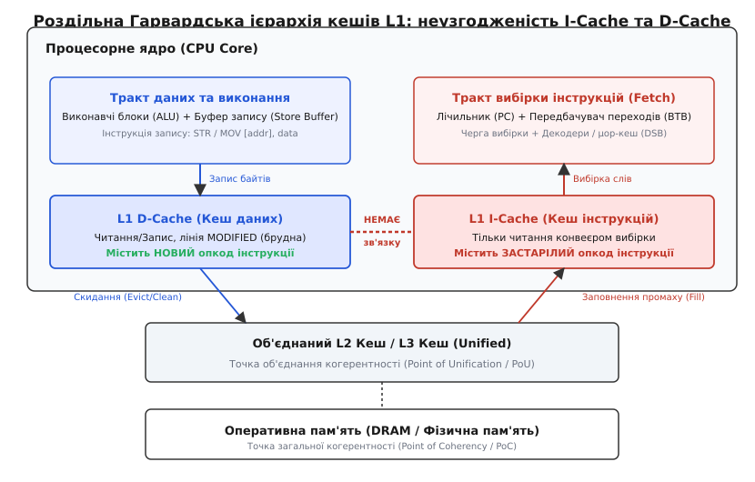
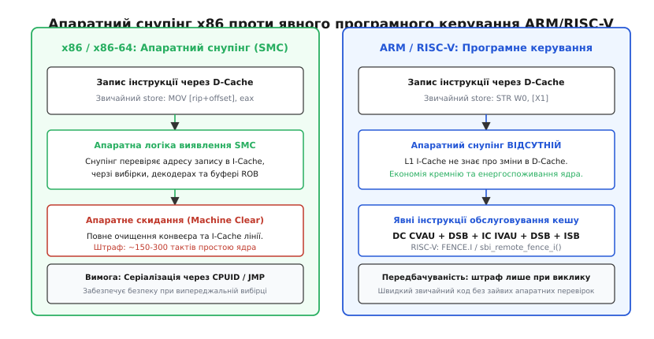
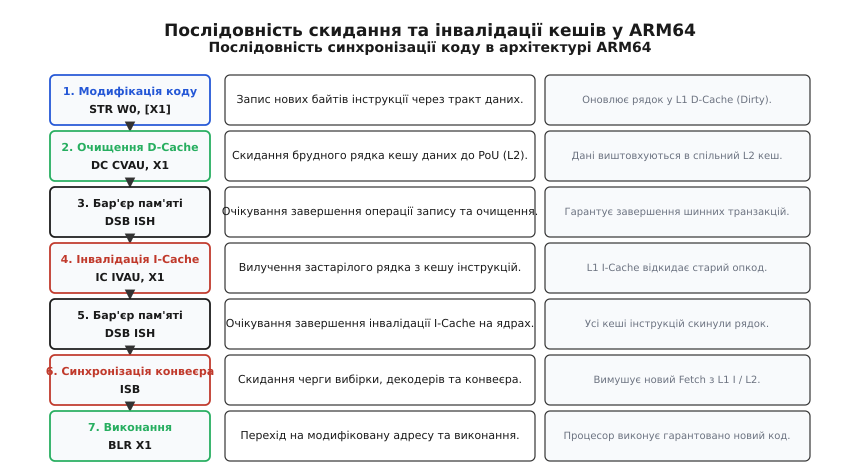
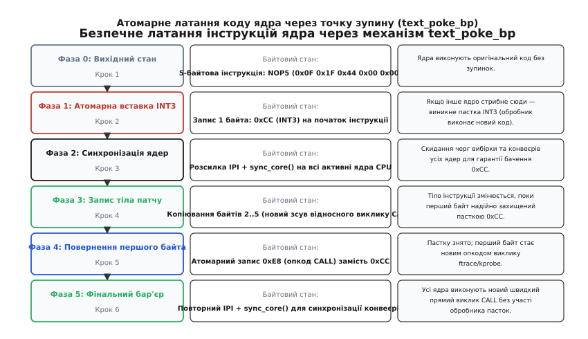

# Самомодифікований код: когерентність I-Cache та D-Cache

<preknowlist>
- [Ієрархія кеш-пам'яті](topic:hw-arch/cache) — поділ на рівні L1, L2, L3, кеш-лінії, промахи та затримки доступу.
- [Конвеєр інструкцій](topic:hw-arch/pipeline) — стадії вибірки, декодування, виконання та конвеєрні затримки й скидання (pipeline flush).
- [Цикл вибірки та виконання](topic:hw-arch/fetch-decode-execute) — механіка роботи Instruction Fetch Unit, лічильника команд (PC) та черги команд.
- [Когерентність кешів](topic:hw-arch/cache-coherence) — протоколи узгодження стану пам'яті (MESI/MOESI) між кількома ядрами.
- [Віртуальна пам'ять](topic:hw-arch/virtual-memory) — сторінкова адресація, біти прав доступу (R/W/X) та таблиці сторінок.
- [Бар'єри пам'яті](topic:hw-arch/memory-barrier-instructions) — упорядкування записів і читань для запобігання позачерговому перевпорядкуванню на рівні процесора.
</preknowlist>

Коли програма записує значення у звичайну змінну, процесор спрямовує байти через буфер запису у кеш даних першого рівня. Якщо ж програма записує за тією самою адресою нову машинну інструкцію і негайно передає на неї лічильник команд, обчислювальна система опиняється в стані апаратного розриву: конвеєр вибірки інструкцій продовжує зчитувати застарілі байти з кешу інструкцій або внутрішньої черги декодера, ігноруючи щойно виконаний запис у кеші даних.

На абстрактному рівні архітектури фон Неймана (von Neumann architecture) оперативна пам'ять сприймається як єдиний однорідний масив байтів, у якому інструкції та дані відрізняються лише тим, як саме процесор їх інтерпретує. Проте на рівні кремнію сучасних суперскалярних процесорів ця єдність є мікроархітектурною ілюзією. Прагнення збільшити пропускну здатність конвеєра змусило інженерів розділити пам'ять першого рівня на два ізольовані тракти: тракт вибірки інструкцій (Instruction Fetch) та тракт завантаження й збереження даних (Load/Store Unit).

У результаті виникає фундаментальна апаратна проблема самомодифікованого коду (self-modifying code, скорочено SMC): кеш інструкцій (I-Cache) та кеш даних (D-Cache) на рівні L1 функціонують як дві незалежні підсистеми пам'яті. Без застосування спеціальних апаратних схем снупінгу або явних програмних бар'єрів обслуговування кешу спроба динамічного виконання щойно згенерованого коду призводить до фатальних збоїв — аварійного завершення процесу через вибірку недійсного опкоду (`SIGILL`), читання пошкоджених операндів або виконання застарілих гілок коду.

---

## 1. Роздільна Гарвардська ієрархія L1: витоки апаратного розриву

Щоб процесор міг виконувати декілька інструкцій за один такт (superscalar execution), блок вибірки інструкцій (Instruction Fetch Unit, IFU) повинен неперервно подавати у декодери від 16 до 64 байтів коду за кожен такт частоти. Одночасно блоки виконання (Execution Units) потребують виконання від двох до чотирьох операцій читання (`LDR`/`MOV`) та запису (`STR`/`MOV`) даних у пам'ять щотакту.

Якщо кеш першого рівня зробити єдиним спільним блоком пам'яті, виникає непереборний структурний конфлікт (Structural Hazard): тракт вибірки інструкцій та виконавчі конвеєри даних почнуть конкурувати за доступ до спільних портів масиву SRAM-комірок кешу. Додавання великої кількості портів читання/запису до масиву SRAM експоненційно збільшує площу кристала, паразитну ємність ліній та електричне енергоспоживання, що унеможливлює роботу процесора на високих тактових частотах (понад 2–4 ГГц).

Єдиним ефективним інженерним рішенням став перехід до модифікованої Гарвардської архітектури (Modified Harvard Architecture): кеш першого рівня фізично розділяється на два спеціалізовані масиви — L1 Instruction Cache (I-Cache) та L1 Data Cache (D-Cache), тоді як нижчі рівні ієрархії (L2, L3 та системна пам'ять DRAM) залишаються спільними (Unified).


*Роздільна Гарвардська ієрархія кешів L1: неузгодженість I-Cache та D-Cache при записі інструкцій через тракт даних.*

### Архітектурні відмінності масивів L1 I-Cache та L1 D-Cache

Обидва кеші оптимізовані під діаметрально протилежні моделі звернення до пам'яті:

1. **L1 D-Cache (Кеш даних):**
   * **Режим роботи:** повна підтримка читання та довільного байтового запису.
   * **Політика оновлення:** зворотний запис (Write-Back) із виділенням рядка при записі (Write-Allocate). Модифіковані рядки позначаються прапорцем брудного стану (Dirty/Modified).
   * **Когерентність:** підключається до апаратної шини між'ядерної когерентності даних за протоколами MESI, MOESI або MESIF.
   * **Службові структури:** тісно інтегрується з буфером запису (Store Buffer) та чергою завантажень/збережень (Load/Store Queue), що забезпечують пересилання даних із буфера запису в команди завантаження (Store-to-Load Forwarding) ще до фіксації даних у самому кеші.

2. **L1 I-Cache (Кеш інструкцій):**
   * **Режим роботи:** суворо доступний лише для читання (Read-Only) з точки зору конвеєра процесора. Конвеєр вибірки ніколи не генерує операцій запису в I-Cache.
   * **Оптимізація вибірки:** оптимізований під максимальну пропускну здатність послідовного читання широкими блоками (Fetch Windows) і мінімальну затримку заповнення ліній.
   * **Інтеграція з конвеєром:** безпосередньо зв'язаний з блоком переддекодування (Predecode Bits), таблицями передбачення переходів (Branch Target Buffer, BTB; Pattern History Table, PHT) та кешем розкодованих мікрооперацій (Decoded Stream Buffer, DSB або μop-Cache).
   * **Відсутність шинних зв'язків:** у класичних архітектурах RISC (ARM, RISC-V, MIPS) I-Cache не має зворотного каналу прослуховування транзакцій D-Cache свого ядра.

### Індексація та тегування: VIPT проти PIPT

Суттєву роль у виникненні апаратних проблем відіграє спосіб адресації кешів. Більшість процесорів реалізують кеш інструкцій за схемою VIPT (Virtually Indexed, Physically Tagged): індекс рядка обчислюється безпосередньо з віртуальної адреси без очікування трансляції MMU, а фізичний тег перевіряється паралельно після завершення роботи буфера трансляції адрес (TLB). 

Якщо в операційній системі одна й та сама фізична сторінка коду відображена за двома різними віртуальними адресами (синоніми або аліаси віртуальної пам'яті), у кеші VIPT виникає явище аліасингу (Cache Aliasing): один і той самий машинний код може одночасно завантажитися у два різні набори (sets) кешу інструкцій. Запис через першу віртуальну адресу не оновить копію за другою адресою, якщо розмір сторінки менший за розмір асоціативного банку кешу (way size), що створює додатковий ризик виконання розсинхронізованого коду.

Історичний шлях від перших однорідних машин фон Неймана до сучасних систем із суворим розділенням ресурсів пам'яті детально розглянуто у вставці [📜 Від фон Неймана до W^X: еволюція самомодифікованого коду](topic:hw-arch/self-modifying-code/hist-von-neumann-to-wx.md).

---

## 2. Анатомія проблеми застарілих інструкцій (Stale Instructions)

Щоб зрозуміти фізичну природу виникнення апаратного збою, простежимо покроковий шлях даних і команд при спробі програми змінити власний код за віртуальною адресою `A`.

Нехай за адресою `A` спочатку містилася команда додавання `ADD R0, R1` (машинний код `0x0100`), яка вже була завантажена у кеш інструкцій L1 I-Cache. Програма вирішує замінити цю команду на інструкцію віднімання `SUB R0, R1` (машинний код `0x0200`).

```
Крок 1: Програма виконує операцію запису:
        STORE [A] <- 0x0200

        - Виконавчий блок ALU надсилає опкод 0x0200 у буфер запису (Store Buffer).
        - Згодом запис потрапляє в L1 D-Cache. Рядок кешу даних, що містить адресу A,
          переходить у стан MODIFIED (Dirty). У D-Cache тепер записано 0x0200.
        - До спільного кешу L2 і тим більше до оперативної пам'яті DRAM нове значення 
          ще не дійшло (оскільки діє політика Write-Back).

Крок 2: Програма негайно виконує перехід на адресу A:
        JUMP [A]

        - Лічильник команд PC оновлюється значенням A.
        - Блок вибірки IFU звертається до L1 I-Cache за адресою A.
        - У масиві L1 I-Cache відбувається кеш-влучання (Cache Hit), оскільки стара
          кеш-лінія з кодом 0x0100 все ще знаходиться там!
        - Конвеєр декодує та виконує застарілу інструкцію ADD замість нової SUB.
```

Ця ситуація називається проблемою застарілих інструкцій (Stale Instructions Hazard).

```
Ієрархічний стан пам'яті в момент збою:
┌────────────────────────────────────────────────────────┐
│ Виконавчий блок (ALU) -> Store Buffer -> L1 D-Cache   │  Містить: 0x0200 (НОВЕ)
└────────────────────────────────────────────────────────┘
                           ▲ РОЗРИВ КОГЕРЕНТНОСТІ
┌────────────────────────────────────────────────────────┐
│ Блок вибірки (IFU)    <- Prefetch Q  <- L1 I-Cache    │  Містить: 0x0100 (СТАРЕ)
└────────────────────────────────────────────────────────┘
                           │
┌──────────────────────────▼─────────────────────────────┐
│ Об'єднаний кеш L2 / L3 (Point of Unification, PoU)     │  Містить: 0x0100 (СТАРЕ)
└────────────────────────────────────────────────────────┘
```

### Рівні залягання застарілого коду в мікроархітектурі

Проблема не обмежується лише масивом комірок SRAM самого кешу L1 I-Cache. Застарілі байти та похідні метадані паралельно осідають у цілій низці внутрішніх конвеєрних структур ядра:

1. **Черга попередньої вибірки (Instruction Prefetch Queue / Fetch Buffer):** мікропроцесор вичитує інструкції наперед великими пачками. Якщо змінена інструкція знаходилася на відстані 2–4 команд від точки запису, вона вже вичитана в чергу вибірки до того, як запис фізично зафіксувався в D-Cache.
2. **Біти переддекодування (Predecode Bits):** під час заповнення кеш-лінії I-Cache із кешу L2 апаратний переддекодер процесора аналізує довжину інструкцій x86 (від 1 до 15 байтів) та розміщує службові мітки меж інструкцій безпосередньо в додаткових бітах рядка кешу. Якщо код модифіковано через D-Cache, старі мітки довжини залишаються в I-Cache. Декодер починає різати нові інструкції за старими межами, що породжує повний хаос у декодуванні команд.
3. **Кеш розкодованих мікрооперацій (Decoded Stream Buffer, DSB / μop-Cache):** сучасні процесори (Intel Skylake/Golden Cove, AMD Zen 2–5) зберігають розкодовані мікрооперації в окремому кеші мікрокоду. Навіть якщо рядок у L1 I-Cache інвалідовано, процесор може продовжити виконувати старі мікрооперації прямо з μop-кешу.
4. **Передбачувач переходів (Branch Target Buffer, BTB):** якщо модифікований код замінив умовний перехід на прямий виклик чи інструкцію повернення, масиви передбачення переходів продовжать спекулятивно спрямовувати конвеєр за старими цільовими адресами.
5. **Буфер перевпорядкування (Reorder Buffer, ROB):** при позачерговому виконанні (Out-of-Order Execution) інструкції після модифікованої ділянки вже можуть перебувати на стадіях перейменування регістрів (Register Renaming) або спекулятивного обчислення.

---

## 3. Архітектурна дивергенція: апаратний снупінг x86 проти програмного узгодження ARM/RISC-V

Розв'язання проблеми когерентності роздільних кешів пішло двома принципово різними шляхами в розвитку комп'ютерної схемотехніки.


*Порівняння підходів до когерентності: апаратний снупінг x86 проти явного програмного керування ARM та RISC-V.*

### x86 та x86-64: Повний апаратний снупінг для SMC

Філософія архітектури x86 історично спирається на принцип максимальної апаратної сумісності зі старим програмним забезпеченням. Щоб програми епохи DOS та ранніх операційних систем, які активно модифікували свій код, могли працювати без змін на сучасних багатоядерних суперскалярних процесорах, компанії Intel та AMD інтегрували в кристал складну систему виявлення самомодифікації (SMC Detection Hardware).

#### Апаратний механізм обробки запису в пам'ять коду на x86
1. **Снупінг буфера запису (Store-to-Instruction Snoop):** при виконанні кожної інструкції запису в пам'ять (`MOV [mem], reg`) адреса запису паралельно транслюється на спеціальні схеми порівняння адрес, інтегровані в кеш інструкцій L1 I-Cache, кеш мікрооперацій (μop-Cache) та чергу вибірки.
2. **Виявлення перетину:** якщо апаратний компаратор фіксує, що фізична адреса запису збігається з адресою будь-якої інструкції, яка наразі закешована в I-Cache або вже завантажена в конвеєр, процесор ініціює апаратну процедуру очищення конвеєра — **Machine Clear** (або SMC Pipeline Nuke).
3. **Скидання конвеєра:**
   * Усі інструкції, які наразі перебувають на стадіях вибірки, декодування та спекулятивного виконання в буфері ROB, негайно анулюються (Flushed).
   * Відповідна лінія в L1 I-Cache та записи в μop-кеші маркуються як недійсні (Invalid).
   * Процесор змушений дочекатися повного зливу буфера запису в кеш даних і перезапустити вибірку інструкцій із оновленого стану пам'яті.

```
Ціна апаратного снупінгу на x86:
- Штраф за Machine Clear при виявленні SMC: від 150 до 300 тактів повного простою ядра.
- Складність схемотехніки: тисячі додаткових транзисторів для постійного порівняння адрес на кожній операції запису.
```

#### Коли апаратного снупінгу x86 стає недостатньо
Попри наявність автоматичного снупінгу, стандарт Intel 64 and IA-32 Architectures Software Developer's Manual (Volume 3A, Section 8.1.3) чітко розмежовує два сценарії:

1. **Модифікація коду тим самим потоком на тому самому ядрі (Self-Modifying Code):** апаратний снупінг гарантує коректність, проте для усунення перегонів у черзі випереджальної вибірки рекомендується виконати інструкцію прямого безумовного переходу `JMP` безпосередньо після запису.
2. **Модифікація коду іншим ядром або потоком (Cross-Modifying Code):** якщо Ядро A модифікує код, який у цей самий момент виконується на Ядрі B, апаратного снупінгу локального ядра недостатньо. Ядро B може вибрати половину старої інструкції та половину нової (Torn Instruction Fetch). Для безпечної модифікації потрібна синхронізація через серіалізуючі інструкції (`CPUID`, `IRET`, `RSM`) або міжпроцесорні переривання (IPI).

---

### ARM (AArch64 / AArch32): Програмно-керована когерентність

В архітектурі ARM розробники пішли протилежним шляхом: відмова від складного та енерговитратного апаратного снупінгу між D-Cache та I-Cache на користь максимальної простоти кристала, низького енергоспоживання та високої енергоефективності.

В процесорах ARM кеш інструкцій L1 I-Cache є повністю сліпим до операцій запису через кеш даних L1 D-Cache. Програмне забезпечення несе абсолютну відповідальність за явну підтримку когерентності через чітко визначений шестиетапний протокол очищення та інвалідації.


*Послідовність програмного скидання та інвалідації кешів в архітектурі ARM64: від запису через D-Cache до інструкції бар'єра ISB.*

#### Поняття точок уніфікації (PoU) та когерентності (PoC)
Архітектура ARM формалізує дві фундаментальні межі в ієрархії пам'яті:
* **Point of Unification (PoU):** точка, в якій I-Cache, D-Cache та блоки трансляції таблиць сторінок MMU одного процесорного ядра бачать ідентичний стан пам'яті. Зазвичай це об'єднаний кеш L2.
* **Point of Coherency (PoC):** точка, де всі агенти системи (всі ядра кластера, GPU, контролери DMA) бачать спільний стан пам'яті. Зазвичай це системна оперативна пам'ять DRAM.

Для самомодифікованого коду достатньо синхронізувати пам'ять до точки **PoU**.

#### Шестикроковий протокол синхронізації в ARM64 (AArch64)

```
Крок 1: Запис нових машинних інструкцій у пам'ять
        STR W0, [X1]
        // Байти потрапляють у Store Buffer та L1 D-Cache (стан Modified).

Крок 2: Очищення кешу даних до точки PoU
        DC CVAU, X1
        // Примусово виштовхує брудну лінію з L1 D-Cache у спільний кеш L2 (PoU).

Крок 3: Бар'єр синхронізації даних
        DSB ISH
        // Зупиняє ядро до отримання апаратного підтвердження, що операція DC CVAU
        // повністю завершилася на шині пам'яті для всього кластера (Inner Shareable).

Крок 4: Інвалідація кешу інструкцій до точки PoU
        IC IVAU, X1
        // Скидає застарілу кеш-лінію з L1 I-Cache. Наступна вибірка піде в L2.

Крок 5: Бар'єр синхронізації даних
        DSB ISH
        // Очікує завершення операції інвалідації IC IVAU на всіх ядрах кластера.

Крок 6: Синхронізація конвеєра інструкцій
        ISB
        // Повністю скидає чергу вибірки, декодери та конвеєр локального ядра,
        // примушуючи його заново вибрати інструкцію з оновленого стану I-Cache/L2.
```

Повний довідник інструкцій, системних викликів та функцій компіляторів для різних архітектур і операційних систем систематизовано у вставці [📋 Довідник інтерфейсів обслуговування кешу](topic:hw-arch/self-modifying-code/api-cache-flush.md).

---

### Обмеження протоколів MESI у багатоядерних системах

Чому стандартні апаратні протоколи когерентності (MESI, MOESI), які чудово синхронізують змінні між кешами даних кількох ядер, не вирішують проблему для I-Cache автоматично?

Причина полягає в масштабованості апаратних каталогів когерентності (Coherence Directories / Snoop Filters):
* Апаратний каталог на рівні L3 або системного інтерконекту (Ring Bus, Mesh) відстежує стан ліній виключно для кешів даних L1 D-Cache.
* Коли Ядро 0 виконує запис за адресою інструкції, контролер пам'яті надсилає запит на володіння (Request For Ownership, RFO), який переводить рядок у D-Cache Ядра 1 у стан `Invalid`.
* Проте кеш інструкцій L1 I-Cache Ядра 1 не підключений до снуп-фільтра L3! Він не отримує повідомлення про недійсність і продовжує зберігати застарілий опкод.
* Лише явна трансляція широкомовного сигналу інвалідації інструкцій (`IC IALLUIS` на ARM або міжпроцесорні виклики `FENCE.I` на RISC-V) змушує віддалені ядра скинути вміст своїх I-Cache.

---

### RISC-V: Інструкція `FENCE.I` та модель пам'яті

Архітектура RISC-V поділяє філософію ARM щодо розділення кешів. Стандарт набору інструкцій визначає розширення `Zifencei` (Instruction-Fetch Fence).

Базова інструкція `FENCE.I` виконує локальну синхронізацію:
1. Забезпечує, що всі попередні операції збереження даних, виконані локальним апаратним потоком (hart), стають видимими для наступних операцій вибірки інструкцій на цьому ж ядрі.
2. Інвалідує локальний L1 I-Cache та промиває конвеєр вибірки команд.

```
RISC-V асемблер:
sw      a0, 0(a1)       # Записати нову інструкцію в пам'ять
fence.i                 # Синхронізувати тракт даних і тракт інструкцій
jr      a1              # Безпечний перехід на модифікований код
```

Для узгодження змін між різними ядрами в багатопроцесорній системі на базі RISC-V ядро операційної системи надсилає міжпроцесорний виклик супервізора OpenSBI — `sbi_remote_fence_i()`, який ініціює виконання `FENCE.I` на всіх віддалених процесорних ядрах.

---

## 4. Взаємодія з механізмами безпеки ОС: політика `W^X`

Неможливо розглядати роботу самомодифікованого коду у відриві від фундаментального системного правила безпеки — `W^X` (Write XOR Execute, або запис, або виконання, але ніколи одночасно).

Якщо пам'ять одночасно доступна для запису та виконання (`RWX`), будь-яка вразливість переповнення буфера дозволяє зловмиснику впровадити довільний бінарний шелкод і негайно виконати його. Сучасні операційні системи за замовчуванням блокують виділення сторінок із правами `RWX`.

```
Матриця дозволів сторінки в таблиці сторінок (PTE):
┌────────────────────────┬───────┬───────┬───────┬───────────────────────────────┐
│ Режим використання     │ Read  │ Write │ Exec  │ Статус безпеки                │
├────────────────────────┼───────┼───────┼───────┼───────────────────────────────┤
│ Дані / Стек / Купа     │   +   │   +   │   -   │ Безпечно (NX/XD = 1)          │
│ Статичний код (.text)  │   +   │   -   │   +   │ Безпечно (Read-Only)          │
│ Прямий SMC (заборонено)│   +   │   +   │   +   │ НЕБЕЗПЕЧНО (Блокується ОС)    │
│ JIT-компіляція (W^X)   │   +   │ +/-   │ -/+   │ Динамічне перемикання прав    │
└────────────────────────┴───────┴───────┴───────┴───────────────────────────────┘
```

### Стратегії JIT-компіляторів для дотримання `W^X`

Щоб генерувати та виконувати код в умовах діючої політики `W^X`, середовища виконання застосовують дві головні стратегії:

#### 1. Послідовне перемикання прав доступу через `mprotect`
1. Виділити анонімну пам'ять із правами `PROT_READ | PROT_WRITE`.
2. Записати машинні інструкції в буфер через звичайні операції пам'яті.
3. Викликати системний виклик `mprotect(ptr, size, PROT_READ | PROT_EXEC)`, перевівши сторінку в режим виконання.
4. Виконати інвалідацію кешів процесора (`__builtin___clear_cache`).
5. Виконати згенерований код.

#### 2. Подвійне віртуальне відображення (Dual Virtual Mapping)
У багатопотокових системах виклик `mprotect` викликає дорогі зупинки ядер через скидання буферів TLB (TLB Shootdown). Тому високопродуктивні рушії створюють два різні віртуальні адресні простори для одного й того самого фізичного блоку RAM:
* Віртуальна адреса `V_write` мапується з правами `PROT_READ | PROT_WRITE` (доступна лише потоку компілятора).
* Віртуальна адреса `V_exec` мапується з правами `PROT_READ | PROT_EXEC` (доступна для виконання робочим потокам).

Потік-компілятор записує байти за адресою `V_write`, виконує скидання кешів, після чого робочі потоки негайно виконують код за адресою `V_exec` без жодної затримки на системні виклики `mprotect`.

Практичну реалізацію динамічного JIT-компілятора, дотримання політики `W^X` та інструменти налагодження в GDB детально продемонстровано у проектній вставці [⚙️ Практична реалізація JIT-трампліна](topic:hw-arch/self-modifying-code/proj-jit-trampoline.md).

> 🔧 **Навіщо це.**
> У розробці високопродуктивних JIT-рушіїв та драйверів підтримка когерентності між D-Cache та I-Cache є єдиною гарантією того, що динамічно згенерований або оновлений на льоту машинний код виконається коректно без падіння процесу у `SIGILL` чи збою пам'яті. Розуміння апаратного снупінгу x86 та явних бар'єрів ARM/RISC-V дозволяє проектувати надійні замикання, транслятори байт-коду та системи безаварійного латання ядер ОС.

---

## 5. Застосування у великих системах: JIT-компілятори та гаряче латання ядра

Самомодифікований код і когерентність роздільних кешів лежать в основі двох критичних підсистем сучасного системного програмування: JIT-компіляторів високорівневих мов та механізмів гарячого оновлення ядер операційних систем без перезавантаження.

### JIT-компіляція: Амортизація скидання кешу

У рушіях JavaScript (Google V8, JavaScriptCore), Java Virtual Machine (HotSpot C1/C2) та LuaJIT емісія коду відбувається невеликими блоками. Виклик повної послідовності інструкцій обслуговування кешу (`DC` + `DSB` + `IC` + `ISB`) на кожну згенеровану інструкцію повністю знищив би продуктивність.

Тому промислові рушії використовують концепцію **амортизованої синхронізації кешу (Amortized Cache Flushing)**:
* Компілятор виділяє великий неперервний буфер (Code Arena / Code Slab) розміром від 64 КБ до 2 МБ.
* Емісія сотень методів або базових блоків відбувається послідовно у пам'ять буфера.
* Операції очищення D-Cache та інвалідації I-Cache викликаються один раз для всього діапазону адресної арени після завершення фази компіляції цілого модуля чи функції, що зменшує накладні витрати на бар'єри пам'яті до часток відсотка загального часу виконання.

#### JIT-компіляція фільтрів eBPF у ядрі Linux
Аналогічний механізм діє всередині ядра Linux при завантаженні програм розширеного фільтра пакетів eBPF (Extended Berkeley Packet Filter). Системний виклик `bpf(BPF_PROG_LOAD, ...)` передає байт-код eBPF, після чого вбудований у ядро модуль `bpf_jit_compile` транслює віртуальні регістри у нативні опкоди процесора. Ядро виділяє модуль пам'яті через `bpf_jit_alloc_exec`, записує машинний код, викликає функцію архітектурної інвалідації `flush_icache_range()` і лише після цього позначає сторінку як Read-Only через захист записів таблиць сторінок ядра.

### Динамічна бінарна трансляція (QEMU TCG, Apple Rosetta 2)

Системи емуляції та міжплатформної трансляції коду (такі як Tiny Code Generator у QEMU або емулятор Rosetta 2 для виконання x86-64 коду на Apple Silicon) перетворюють гостьові інструкції на блоки базового нативного коду (TranslationBlocks, TB).

Для прискорення роботи транслятор застосовує техніку зв'язування блоків (Direct Block Chaining):
1. Замість повернення у головний диспетчер емулятора після кожного базового блоку, хвостова інструкція стрибка першого блоку динамічно переписується прямим машинним переходом на адресу другого скомпільованого блоку.
2. Якщо гостьова програма змінює власний код (наприклад, у захищених іграх або старих програмах DOS), емулятор перехоплює запис через апаратні пастки MMU (Write Fault), знаходить усі пов'язані трансльовані блоки у кеші коду, розриває ланцюжки переходів (Unchaining) та інвалідує їхні кеш-лінії.

---

### Гаряче латання ядра Linux (Kernel Livepatching, `ftrace`, `kprobes`)

Управління самомодифікованим кодом у просторі ядра операційної системи є значно складнішим завданням, ніж у просторі користувача. Ядро не може зупинити своє виконання, а тисячі потоків на десятках процесорних ядер одночасно виконують критичні системні функції.

Підсистеми динамічного трасування (`ftrace`), налагодження (`kprobes`) та безпекового латання без перезавантаження (`livepatch`) щоденно модифікують інструкції працюючого ядра прямо під час роботи сервера під навантаженням.

#### Небезпека частково зчитаної інструкції (Torn Fetch Hazard)
Розглянемо випадок підсистеми `ftrace`. На початку кожної функції ядра компілятор GCC генерує 5-байтову послідовність-заглушку `NOP5` (опкод `0x0F 0x1F 0x44 0x00 0x00` на x86-64). Коли адміністратор активує трасування функції, ядро замінює цей `NOP5` на 5-байтову команду відносного виклику `CALL <ftrace_caller>` (опкод `0xE8 <offset32>`).

Якщо Ядро A спробує просто скопіювати 5 нових байтів за адресою функції через `memcpy`, а в цей самий момент Ядро B входить у цю функцію, Ядро B може вибрати з пам'яті перші 2 байти нового опкоду та останні 3 байти старого `NOP5`. Процесор отримає пошкоджену комбінацію байтів, яка розкодується як невідома інструкція або перехід за випадковою адресою, викликавши паніку ядра (Kernel Panic).

#### Рішення: Механізм `text_poke_bp` в ядрі Linux

Для вирішення цієї проблеми розробники ядра Linux створили механізм атомарного латання коду через тимчасову точку зупину — функцію `text_poke_bp()`.


*Атомарне латання коду ядра Linux через тимчасову точку зупину INT3 (механізм text_poke_bp).*

Послідовність роботи `text_poke_bp()`:

1. **Атомарний запис пастки `INT3`:** Ядро записує рівно 1 байт `0xCC` (інструкція точки зупину `INT3`) на місце першого байта цільової 5-байтової інструкції. Запис одного байта є гарантовано неподільним (атомарним) на будь-якій процесорній архітектурі.
2. **Міжпроцесорна синхронізація ядер:** Ядро розсилає міжпроцесорне переривання IPI всім іншим ядрам CPU, змушуючи їх виконати інструкцію серіалізації конвеєра (`sync_core()`). Тепер кожне ядро системи гарантовано бачить байт `0xCC`.
3. **Обробка перехідного стану:** якщо будь-яке процесорне ядро викликає модифіковану функцію в цей момент, воно миттєво потрапляє в спеціальний обробник переривання `do_int3()`. Обробник перевіряє таблицю активних патчів, емулює виконання нової функції та повертає керування без збою.
4. **Запис тіла інструкції:** поки перший байт надійно заблокований пасткою `0xCC`, ядро безпечно записує байти 2..5 (зсув виклику `offset32`).
5. **Атомарне повернення першого байта:** ядро замінює перший байт `0xCC` на справжній опкод `0xE8` (команда `CALL`).
6. **Фінальна серіалізація:** повторна розсилка IPI оновлює конвеєри всіх процесорів. Тепер усі ядра виконують прямий швидкий виклик `CALL` на максимальній швидкодії без виклику обробників пасток.

---

## 6. Синтез архітектурних принципів

Еволюція самомодифікованого коду та роздільних кешів є класичним прикладом інженерного компромісу між простотою апаратного забезпечення та відповідальністю системного програмного забезпечення:

1. **Ціна апаратних абстракцій:** спроба зберегти ілюзію повної однорідності пам'яті фон Неймана на рівні кремнію (як у x86) вимагає складних схем снупінгу, збільшує бюджет транзисторів і призводить до важких падінь швидкодії ядра (Machine Clear) при виявленні змін коду.
2. **Ефективність явного контролю:** підхід явного програмного керування кешами (як в ARM та RISC-V) усуває зайві апаратні перевірки на кожному такті запису даних, звільняючи кремній для додаткових обчислювальних блоків та суттєво знижуючи енергоспоживання процесора.
3. **Сучасний розподіл ролей:** апаратура забезпечує швидкі примітиви обслуговування ліній кешу (`DC`, `IC`, `FENCE.I`, `ISB`), операційна система контролює безпеку адресного простору (`W^X`, `mprotect`, подвійні відображення), а компілятори та динамічні середовища виконання амортизують накладні витрати на узгодження, перетворюючи модифікацію коду на надійний і контрольований інструмент високої продуктивності.
