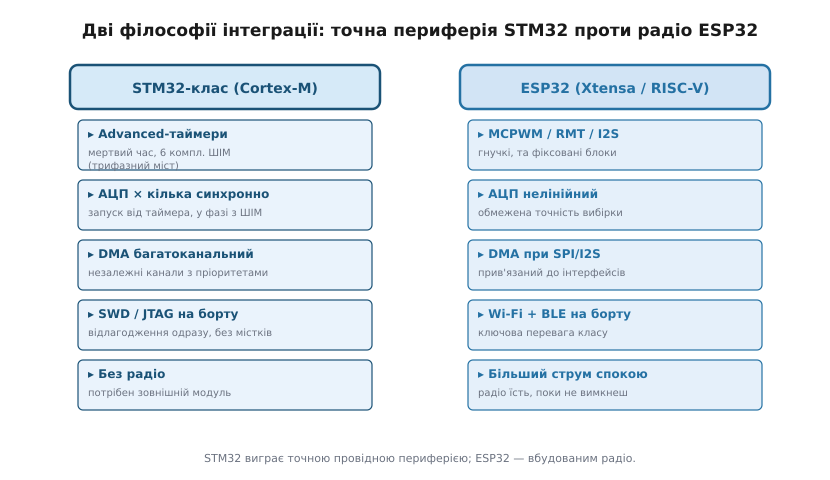
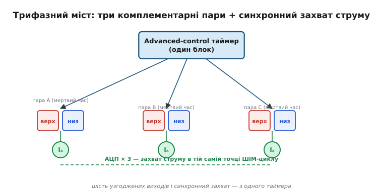

# STM32-клас

Візьми ядро [ARM Cortex-M](topic:hw-arch/cortex-m) — компактний 32-бітний процесор, який ARM не виробляє сам, а ліцензує виробникам, щоб ті обвішали його власною периферією. Що буде, якщо обвішати його щедро й точно? Вийде STM32 — родина мікроконтролерів від STMicroelectronics (звідси «ST» у назві; «M32» — Microcontroller, 32 біти). ST випустила перші STM32 у 2007 році, із серії F1, і відтоді клас розрісся в тисячі моделей. Об'єднує їх одне: до ядра Cortex-M додано не периферію-мінімум, а повний набір таймерів, аналого-цифрових перетворювачів, каналів прямого доступу до пам'яті, провідних інтерфейсів. Саме ця багата й точна провідна периферія, а не саме ядро, визначає нішу STM32-класу.

Корисно тримати поряд два орієнтири. [ESP32](topic:hw-arch/esp32-architecture) несе на борту радіо — Wi-Fi і Bluetooth — і цим виграє там, де треба бездротовий зв'язок. STM32 радіо не має, зате дає багатшу й суворішу провідну периферію: точні таймери, синхронні АЦП, незалежний DMA. А на іншому полюсі — [AVR-клас](topic:hw-arch/avr), де все прозоро аж до окремих регістрів, але периферії значно менше. STM32 стоїть між ними: дорослий за можливостями, складніший за AVR, провідний на противагу радіо ESP32.

## Периферія по блоках

Найхарактерніший блок STM32 — таймери. Вони діляться на три ваги: *basic* (найпростіші, для відліку часу), *general-purpose* (універсальні, з кількома каналами захоплення й порівняння) і **advanced-control** — таймери керування силовою електронікою. Останні вміють те, чого нема в простих: апаратний **мертвий час** (*dead time* — коротка пауза, поки один ключ плеча вже закрився, а протилежний ще не відкрився), **комплементарні пари** виходів (верхній і нижній ключ одного плеча, керовані в протифазі) і апаратний захист від «прострілу» (*shoot-through* — коли обидва ключі плеча відкрилися разом і коротнули живлення).

Той самий мертвий час уміє генерувати й [апаратний ШІМ ESP32](topic:hw-arch/hardware-pwm) через блок MCPWM. Різниця не в наявності функції, а в зусиллях і детермінізмі: advanced-control таймер STM32 робить це меншою конфігурацією, а фази вирівняні апаратно — без джитеру, який вносить програмне втручання.

> 🔧 **Навіщо це.** Апаратний мертвий час — не зручність, а захист заліза. Якщо паузу між закриттям одного ключа й відкриттям другого формувати програмно, будь-яке запізнення переривання відкриє обидва ключі разом і спалить силовий каскад. Коли паузу тримає таймер, прострілу не буде навіть під повним навантаженням ядра.

[АЦП](topic:hw-analog/adc) у STM32-класі можна запускати **синхронно** від таймера: кілька перетворювачів одночасно беруть вибірку в точно визначений момент ШІМ-циклу. Це критично, коли треба виміряти струм у фазних обмотках саме тоді, коли ключі в потрібному стані, — і це різкий контраст із [нелінійністю та похибками АЦП ESP32](topic:hw-sensing/adc-errors), де про точну синхронізацію вибірки говорити складно.

[DMA-контролер](topic:hw-arch/dma-controller) — прямий доступ до пам'яті — у STM32-класі має кілька незалежних каналів із пріоритетами. Де DMA на ESP32 прив'язаний здебільшого до SPI та I2S, там DMA STM32 паралельно й незалежно обслуговує таймери, АЦП і UART. Завдяки цьому ядро не витрачає такти на перекладання байтів — залізо саме переносить дані з периферії в пам'ять і назад.



*Дві філософії інтеграції. STM32 ставить на точну провідну периферію, ESP32 — на вбудоване радіо та гнучкі блоки; вибір між ними майже завжди зводиться до того, що з цього важить для задачі.*

## Скільки PWM-каналів треба

Поставмо конкретну задачу й порахуймо, що під неї потрібно.

**Умова: керувати трифазним мостом (6 комплементарних ШІМ-виходів із мертвим часом) і одночасно міряти струм у трьох фазах синхронно з ШІМ.**

```
Вимога                      Потрібно   STM32 adv-timer   ESP32 MCPWM
─────────────────────────────────────────────────────────────────────
ШІМ-каналів (комплем.)      6          6 (1 таймер)      6 (2 блоки)
Мертвий час апаратно        так        так               так
Синхронний запуск АЦП       3 канали   так (через TRGO)  потребує налаштувань
Незалежна конфігурація      повна      так               часткова
─────────────────────────────────────────────────────────────────────
Висновок: обидва вміють, та STM32 advanced-control таймер
накриває задачу ОДНИМ блоком; на ESP32 — два MCPWM-блоки
плюс окремі зусилля на синхронний запуск АЦП.
```

Тут `TRGO` (*trigger output*) — апаратний сигнал, яким таймер штовхає АЦП почати вибірку точно в потрібну мить циклу. Для силового керування двигуном STM32-клас дає компактніше й детермінованіше рішення: один таймер замість двох блоків і ручної синхронізації.



*Чому трифазний міст любить advanced-таймер. Шість узгоджених виходів і захват струму в одній точці циклу народжуються з одного блока — без зовнішнього диригента.*

## Чого немає і що натомість

Головна відмінність від ESP32 — немає вбудованого радіо. Потрібен бездротовий зв'язок — або зовнішній модуль, або [мікроконтролер із вбудованим радіо (nRF-клас)](topic:hw-arch/nrf-radio-mcu). Натомість STM32-клас дає ширший вибір корпусів і ваг ядра: від Cortex-M0+ для простих дешевих задач до Cortex-M7 (серії F7, H7) для вибагливих обчислень. Серії позначають літерою й цифрою — F0 і F1 для бюджетних загальних задач, F4 і H7 для високої продуктивності, G4 заточена під керування двигунами; різняться вони тактовою частотою, обсягом пам'яті й набором блоків, а принцип лишається спільним.

Прошивають і відлагоджують STM32 штатно через **SWD** (*Serial Wire Debug* — послідовне відлагодження по двох дротах). Це [відлагоджувальний інтерфейс](topic:sys-ide/swd-jtag-internals), який дозволяє ставити точки зупину й читати пам'ять чипа всього через дві лінії — компактніша рідня повного JTAG.

> 🔌 **Плати STM32-класу.** Доторкнутися до STM32 можна на платі: офіційні Nucleo з розпаяним відлагоджувачем ST-Link і народна «Blue Pill» — голий чип, де програматор шукаєш сам. Анатомія обох, живлення й «перший байт» — у вставці [Плати STM32: Nucleo і Blue Pill](topic:hw-arch/stm32/comp-stm32-boards.md).

## Коли брати саме STM32

Межа вибору виходить простою. STM32-клас доречний, коли задача впирається в **точну провідну периферію**: керування силовою електронікою (трифазний міст, сервопривід, перетворювач напруги), синхронне вимірювання струмів і напруг, жорсткий детермінізм по часу, кілька паралельних потоків DMA. Тут синхронні АЦП із запуском від ШІМ і апаратний мертвий час — не «опційні функції», а архітектурні рішення, заточені саме під це.

Якщо ж серцем задачі є бездротовий зв'язок — збір даних у мережу, віддалене керування, — природніше брати [ESP32](topic:hw-arch/esp32-architecture) з його радіо на борту, а силову частину за потреби винести на окремий драйвер. А коли задача зовсім скромна — блимнути світлодіодом, опитати кілька ніжок, дешево й тиражно, — навіть STM32 буває надміром, і простіший [AVR-клас](topic:hw-arch/avr) обійдеться дешевше й прозоріше. STM32 — це середина, де багатство периферії вже окупає складність, але радіо ще не потрібне.

## Ціна зрілого середовища

Розвинене середовище розробки ST — це водночас перевага і вага. **STM32CubeMX** дозволяє клацнути периферію мишею й згенерувати код ініціалізації; не треба вручну заповнювати десятки регістрів. Зворотний бік — згенерований **HAL** (*Hardware Abstraction Layer* — шар апаратної абстракції) товстий і ховає деталі, які іноді важливо бачити. Це контраст із [класичним AVR](topic:hw-arch/avr), де все прозоро аж до окремих бітів.

Ця дилема «HAL проти голих регістрів» — частина ширшого питання [екосистеми мікроконтролера](topic:sys-bsystem/mcu-ecosystem): наскільки інструменти, бібліотеки й спільнота допомагають — чи, навпаки, ховають від тебе залізо. Вибір між зручністю генератора й контролем над кожним регістром залежить від того, що тобі важливіше в конкретному проєкті: швидко піднятися чи точно розуміти кожен такт.

STM32 дає багато готової **фіксованої** периферії — набір контролерів, які роблять рівно те, на що спроєктовані. Протилежну ідею втілює [RP2040 з його блоком PIO](topic:hw-arch/rp2040-pio): периферію, якої в чипі немає, програмують самі — крихітні автомати на ніжках відтворюють довільний протокол замість фіксованого набору. Зважити ці підходи один проти одного — частина [вибору мікроконтролера під задачу](root:embedded/mcu-checklist).
