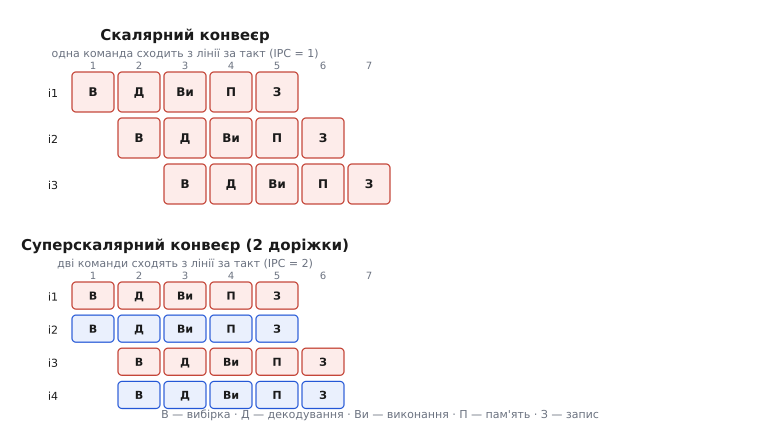
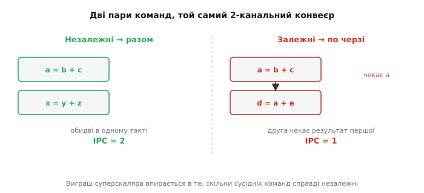
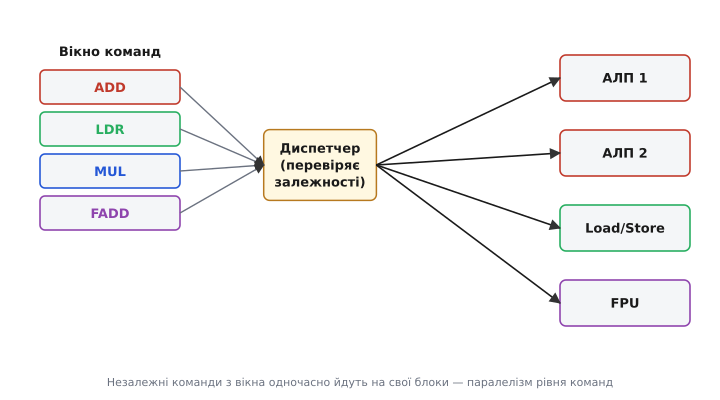

# Суперскалярна архітектура: більше однієї команди за такт

Конвеєр довів процесор до межі «одна команда за такт» — далі, здавалося б, нікуди. Але межа ця удавана. Її ставить не фізика, а наше припущення, що всередині процесора кожної стадії — по одному блоку. Прибери це припущення, постав два додавачі замість одного, дві станції вибірки, два шляхи запису — і за той самий такт зможуть завершитися **дві** команди, а не одна. Це і є суперскаляр: процесор, що виконує більше однієї команди за такт, не піднімаючи частоти. Назва (лат. *super-* — «понад» + *scalar*, від *scala* — «драбина, шкала»; «скалярним» звали процесор, що бере команди по одній, як одне число зі шкали) якраз і означає «понад одну за раз».

Щоб побачити, звідки береться цей виграш і чому він так швидко впирається в стелю, почнімо з того, на чому суперскаляр стоїть.

### Звідки взялася стеля «одна за такт»

[Конвеєр](topic:hw-arch/pipeline) розбиває виконання команди на стадії — вибірка, декодування, виконання, доступ до пам'яті, запис результату — і пускає команди вервечкою: поки одна виконується, наступну вже декодують, ще одну вибирають. Так процесор доводить **CPI** (англ. *cycles per instruction*, тактів на команду) до одиниці: після розгону конвеєра одна команда завершується щотакту.

> 🔧 **Навіщо це.** CPI — головне мірило, яким інженер оцінює процесорне ядро окремо від частоти. Час програми = кількість_команд × CPI × період_такту. Конвеєр б'є по середньому множнику, тягнучи CPI до 1. Суперскаляр — єдиний спосіб зробити CPI **меншим** за 1, не чіпаючи ані числа команд, ані частоти. Тому саме він визначає, наскільки «широке» ядро в кожному сучасному процесорі — від телефона до сервера.

Але одиниця тут — не закон природи, а наслідок будови. У класичному конвеєрі кожної стадії рівно один блок: одна станція вибірки, один декодер, одне арифметико-логічне [ядро](topic:hw-arch/processor-parts). Тому крізь стадію проходить одна команда за такт — вузьке горло не в ідеї, а в тому, що станція одна. А в реальній програмі сусідні команди часто **незалежні**: `a = b + c` і `x = y + z` не заважають одна одній — жодна не читає того, що пише інша. Якби додавачів було два, обидві злетіли б в один такт. Оце й підказує вихід: розмнож блоки.

### Ідея: широкий конвеєр

Суперскаляр бере конвеєр і робить його **широким** — на кожній стадії пропускає не одну команду, а кілька паралельних «доріжок» (англ. *lanes*). Двоканальне (англ. *dual-issue*) ядро щотакту вибирає дві команди, декодує дві, має два виконавчі шляхи й може завершити дві.


*Той самий п'ятистадійний конвеєр, але в суперскаляра — дві доріжки. Угорі скалярне ядро: команди зсунуто на один такт, після розгону одна завершується щотакту (IPC = 1). Унизу двоканальне: команди йдуть парами, тож щотакту сходить з лінії дві (IPC = 2). Затримка однієї команди та сама — виграш у тому, що за такт їх виходить удвічі більше.*

Тут з'являється друге мірило, дзеркальне до CPI: **IPC** (англ. *instructions per cycle*, команд за такт) — просто 1/CPI. Скалярний конвеєр у ідеалі дає IPC = 1; двоканальний суперскаляр — до 2, чотириканальний — до 4. Це саме те, чого конвеєр сам по собі дати не може: він прискорює **темп** до однієї команди за такт і зупиняється, бо станцій по одній. Суперскаляр знімає цю межу, ставлячи станцій по кілька.

Ключове слово — «до». IPC = 2 буває лише тоді, коли в потоці стабільно трапляються пари незалежних команд. Варто їм почати залежати одна від одної — і друга доріжка порожніє. Тому вся інженерія суперскаляра крутиться навколо одного питання: **скільки сусідніх команд справді можна пустити разом.**

### Паралелізм рівня команд — сировина, якої мало

Ту незалежність, з якої суперскаляр видобуває виграш, називають **паралелізмом рівня команд** (англ. *instruction-level parallelism*, ILP): скільки команд поряд у потоці можна виконати одночасно, не порушивши змісту програми. Це сировина. Немає ILP — немає чого паралелити, і хоч десять доріжок постав, працюватиме одна.

Розгляньмо, звідки ILP береться і куди зникає:

```
; є ILP — команди незалежні, ідуть парою:
    ADD  r1, r2, r3   ; r1 = r2 + r3
    ADD  r4, r5, r6   ; r4 = r5 + r6   ← не чіпає r1, летить разом

; немає ILP — друга чекає результат першої:
    ADD  r1, r2, r3   ; r1 = r2 + r3
    ADD  r4, r1, r6   ; r4 = r1 + r6   ← читає r1, мусить чекати
```

У першій парі регістри не перетинаються — обидві команди йдуть в один такт. У другій друга команда читає `r1`, який щойно записала перша: поки результат не готовий, другу не запустити. Це **залежність за даними** (англ. *data dependency*): справжній причинно-наслідковий зв'язок, який суперскаляр обійти не може — він може лише виконувати паралельно те, що незалежне.


*Той самий двоканальний конвеєр на двох парах. Ліворуч команди незалежні — обидві злітають в один такт, обидві доріжки зайняті, IPC = 2. Праворуч друга читає результат першої (`d = a + e` потребує щойно обчислене `a`) — доводиться чекати, друга доріжка простоює, IPC падає до 1. Вся вигода суперскаляра тримається на тому, скільки сусідніх команд справді незалежні.*

Звідси випливає невтішне: у типовому коді ILP невеликий. Виміри на звичайних програмах дають у середньому близько 2 команд, які можна пустити разом у короткому вікні, — зрідка більше. Тому реальний виграш двоканального ядра — не рівно ×2, а десь ×1.5–1.8; ширші ядра дають дедалі менший додаток на кожну нову доріжку. Це головна причина, чому суперскаляри не роблять довільно широкими: п'ята й шоста доріжки коштують кремнію та енергії, а простоюють майже завжди.

### Що всередині: диспетчер і кілька виконавчих блоків

Щоб пускати кілька команд за такт, ядру треба дві речі: **кілька виконавчих блоків** (англ. *execution units*) і **диспетчер** (англ. *dispatcher*), що вирішує, які команди й куди відправити цього такту.

Виконавчі блоки — це не просто «два однакові додавачі». Команди бувають різні: цілочислове додавання, множення, доступ до пам'яті, дії з [дробовими числами](topic:hw-arch/fpu). Тож блоки роблять **спеціалізованими**: кілька простих цілочислових АЛП, окремий блок множення, блок завантаження-збереження (англ. *load/store unit*) для роботи з пам'яттю, блок для чисел із [плаваючою комою](topic:hw-arch/floating-point). Це вигідно вдвічі: спеціалізований блок менший і швидший за універсальний, а різнотипні команди природно виконуються паралельно — цілочислова та дійсночислова не змагаються за той самий залізний блок.


*Декодовані команди чекають у вікні. Диспетчер щотакту дивиться на кілька перших, відсіює ті, що залежать від ще не готових результатів, а решту розкидає по вільних блоках: додавання — на АЛП, читання пам'яті — на load/store, множення — на друге АЛП, дійсночислове — на FPU. Різнотипні команди природно йдуть паралельно, бо кожна має свій блок.*

Диспетчер — серце суперскаляра й найдорожча його частина. Щотакту він мусить: подивитися на кілька наступних команд одразу; перевірити **всі** залежності між ними та з тими, що ще виконуються; знайти для кожної придатної команди вільний блок потрібного типу; і все це — за один такт, щоб не стати новим вузьким горлом. Складність цієї перевірки росте квадратично від ширини: для двох команд пар порівнянь одиниці, для чотирьох — уже помітно більше, для восьми — стільки, що логіка перевірки сама диктує довжину такту. Оце квадратичне зростання — друга (після браку ILP) причина, чому широкі ядра невигідні.

Тут проходить важлива межа. Диспетчер, що видає команди **строго в порядку програми** (англ. *in-order*) і зупиняє всю видачу, щойно черговій команді нема з чим піти, — простий і дешевий. Такий саме стоїть у Cortex-M7 — двоканальному ядрі для вбудованих систем: команди видаються по порядку, зате завершуватися можуть у різному, аби ядро лишалося передбачуваним і дешевим. Але в нього є ахіллесова п'ята: одна команда, що застрягла в очікуванні даних, тримає за собою всю чергу, навіть якщо далі стоять цілком незалежні команди, готові виконуватися. Обійти цю ваду вміє лише [позачергове виконання](topic:hw-arch/out-of-order-execution) — коли ядро дозволяє собі брати з вікна не наступну, а будь-яку готову команду. Це різко піднімає використання доріжок, але й додає стільки складності, що більшість суперскалярів у вбудованому світі лишаються простими, in-order.

> 🔧 **Навіщо це.** Розуміння «in-order суперскаляр застряє на першій же незалежній затримці» напряму диктує, як писати гарячий цикл під Cortex-M7 чи подібне ядро. Якщо поставити довгу команду (ділення, промах кешу) перед ланцюжком залежних від неї — застрягне все ядро. Якщо ж перемежати незалежні обчислення, компілятор (а без нього — ви руками) заповнить другу доріжку, поки перша чекає. Тому на таких ядрах порядок команд, який видає компілятор, — не косметика, а прямий важіль швидкості.

### Чому просто «додати доріжок» не спрацьовує

Наївна надія — «зробимо ядро восьмиканальним і піднімемо IPC до 8» — розбивається об три стіни, які варто бачити разом, бо вони й формують реальні процесори.

**Перша — брак ILP.** У звичайному коді рідко трапляється підряд вісім незалежних команд. Здебільшого доріжки стоятимуть порожні: сировини для них немає.

**Друга — вартість диспетчера.** Логіка перевірки залежностей росте квадратично від ширини. З певної точки вона сама подовжує такт — тобто ширше ядро працює на **нижчій** частоті, і виграш від зайвих доріжок з'їдається втратою частоти.

**Третя — енергія.** Кожна доріжка — це реальний кремній, що споживає струм, навіть коли простоює. Ширше ядро гарячіше; а тепловий бюджет у сучасних чипів жорстко обмежений [стіною потужності](topic:hw-arch/power-wall). Витрачати ват на доріжку, що працює раз на десять тактів, — марнотратство.

Тому реальні ядра осідають на скромній ширині: вбудовані Cortex-M — дво-, великі серверні ядра — чотири- до шести-, зрідка ширше, і то з величезним апаратом позачергового виконання, щоб хоч чимось ті доріжки нагодувати. Восьмиканальних ядер загального призначення на скалярному коді фактично немає — не тому, що не вміють збудувати, а тому, що ILP і енергія не окупають.

### Суперскаляр — це не багатоядерність

Дуже поширена плутанина, яку варто розвіяти прямо. Суперскаляр і [багатоядерність](topic:hw-arch/multicore) обидва «роблять багато водночас», але це паралелізм на різних поверхах, і плутати їх — значить неправильно уявляти, звідки береться швидкість.

Суперскаляр — це **одне** ядро, що бере кілька команд **з одного** потоку (однієї програми, одного потоку виконання) і пускає їх паралельно всередині себе. Програма нічого не знає й не робить — паралелізм витягує залізо, автоматично, з послідовного коду. Багатоядерність — це **кілька** ядер, кожне зі своїм конвеєром, що виконують **різні** потоки; тут паралелізм має організувати програміст чи операційна система, розкидавши роботу на потоки.

Аналогія: суперскалярне ядро — це один кухар з чотирма руками, що робить чотири незалежні дії однієї страви водночас; багатоядерність — чотири окремі кухарі, кожен зі своєю стравою. Аналогія ламається там, де в кухаря руки заважають одна одній (залежності за даними), а окремі кухарі незалежні майже завжди — саме тому багатоядерність масштабується краще, коли роботу вдається чесно розділити. Сучасний процесор поєднує обидва рівні: кожне з багатьох ядер усередині ще й суперскалярне.

### Ідея, старша за мікропроцесори

Думка «поставмо кілька виконавчих блоків і годуймо їх паралельно» набагато старша за слово, що її називає. Ще в **1964 році** суперкомп'ютер CDC 6600, спроєктований під орудою Сеймура Крея (Seymour Cray) у Control Data Corporation, мав десять окремих функційних блоків і міг тримати кілька команд у роботі водночас — сьогодні це назвали б суперскаляром, хоча тоді терміна не існувало.

Саме слово **«суперскаляр»** з'явилося пізніше: його ввели Тілак Аджервала (Tilak Agerwala) і Джон Кок (John Cocke) у технічному звіті IBM «High Performance Reduced Instruction Set Processors» (Дослідний центр Вотсона, звіт RC12434, **1987**). *(Статус: усталено — звіт цитують як першоджерело терміна.)* Кок, до речі, — один із батьків самої ідеї RISC.

На **одному кристалі** суперскаляр з'явився наприкінці 1980-х: першими комерційними однокристальними суперскалярними мікропроцесорами були Intel i960CA (**1989**), AMD 29050 (**1990**) і Motorola MC88110 (**1991**). *(Статус: усталено.)* У світ настільних комп'ютерів масовий суперскаляр приніс Intel Pentium (**1993**) — перше суперскалярне ядро сімейства x86, з двома цілочисловими конвеєрами. Відтоді суперскалярність — норма: практично кожен процесор, від телефона до сервера, всередині широкий. Хто хоче простежити цей шлях від функційних блоків CDC 6600 до сучасних ядер докладніше — [історія суперскаляра](topic:hw-arch/superscalar/hist-superscalar.md) зібрана окремо.

### Що з цього випливає для того, хто пише код

Найважливіший висновок практичний. Суперскаляр працює **сам** — він витягує паралелізм із звичайного послідовного коду, нічого від вас не вимагаючи. Але скільки саме він витягне, залежить від того, скільки в коді ILP, а на це ви впливаєте.

Довгі ланцюжки залежних дій душать суперскаляр: якщо кожна команда чекає попередню, широке ядро працює як вузьке. Незалежні обчислення, перемежані так, щоб поряд стояли команди без спільних даних, — навпаки, заповнюють доріжки. Здебільшого цю перестановку робить оптимізатор компілятора: він свідомо розкладає команди так, щоб суперскалярне ядро знайшло, чим зайняти всі шляхи. Тому найкраще, що робить прикладний програміст для суперскаляра, — пише зрозумілий код і не заважає компілятору бачити незалежність (уникає зайвих залежностей через пам'ять, дає компілятору знати, що вказівники не перетинаються). Ядро зробить решту саме — тихо, за кожен такт.
