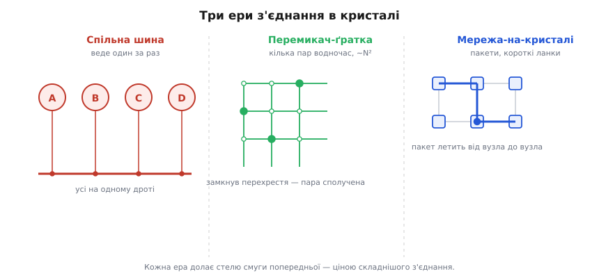

# 📜 Один дріт на всіх: як народилася системна шина

Слово, яким сьогодні називають найбільшу магістраль усередині процесора, колись означало кінний екіпаж на вулицях Нанта, а до того — латинський відмінок без кореня. А сама ідея — «не тягнути дріт від кожного до кожного, а завести один спільний і причепити всіх паралельно» — визріла не в тиші лабораторії, а в цілком конкретній інженерній халепі кінця 1960-х, коли мінікомп'ютери росли швидше, ніж встигали множитися дроти між їхніми частинами. Ця вставка — про те, звідки взялося і слово, і річ: як «шина» пройшла шлях від громадського воза через мідний брус електростанції до жмута ліній у DEC PDP-11, і чому потім цей спільний дріт уперся в стелю й мусив поступитися.

## Латинський відмінок, що втік від свого кореня

Почнімо зі слова, бо його історія напрочуд промовиста. Англійське *bus* — це урізане *omnibus*, а *omnibus* латиною — давальний відмінок множини від *omnis* («увесь»), тобто буквально «для всіх». Річ у тім, що це слово **не має власного кореня взагалі**: від латинського прикметника лишився самий хвіст-закінчення *-ibus*, і саме цей хвіст став іменником. Мовознавці не дарма звуть це одним із найдивніших словотворів — уявіть, ніби українське «-ам» відкололося від «усім» і зажило самостійним словом.

Як латинський відмінок опинився на боці воза? Тут починається легенда, яку варто одразу позначити як **легенду, а не документований факт**. Розповідають, що близько 1826 року в Нанті колишній офіцер Станіслас Бодрі (фр. *Stanislas Baudry*, 1777–1830) запустив службу кінних екіпажів, і кінцева зупинка одного з маршрутів опинилася перед крамницею капелюшника на прізвище Омнес (фр. *Omnès*), над якою красувалася вивіска-каламбур «Omnes Omnibus» — «Омнес для всіх». Городяни начебто підхопили слово *omnibus*, і воно приклеїлося до самого воза: транспорт **для всіх**, хто заплатить, без резервації місць.

Красива історія — але Бібліотека Конгресу США, розбираючи саме цей сюжет, прямо називає його фольклором: **жоден сучасний тим подіям документ не підтверджує ані вивіски «Omnes Omnibus», ані навіть існування капелюшника Омнеса на тій вулиці**. Певне лише те, що слово *omnibus* у значенні громадського транспорту закріпилося за компанією Бодрі наприкінці 1820-х, а французька повна форма зафіксована коло 1828 року; до Лондона воно доїхало 1829-го, і вже 1832 року англійці вкоротили його до звичного *bus*. Отже: сам факт народження слова — твердий, а мила байка про капелюшника — популярна легенда без підтвердних паперів. Тримаймо цю межу чітко, бо історія техніки любить обростати саме такими зручними анекдотами.

> 🔧 **Навіщо це.** Ця дрібниця з етимологією — не забавка, а ключ до самої суті шини. «Для всіх» — це і є її означальна риса: не приватний провід між двома вузлами, а **спільна лінія, доступна всім одразу**. Хто цей зміст тримає в голові, той ніколи не сплутає шину (одну магістраль на багатьох) із з'єднанням «точка-точка» (окремий провід на пару) — а це фундамент усієї архітектури обміну.

## Мідний брус, що роздавав струм усім

Між нантським возом і комп'ютерною шиною є проміжна, суто електрична ланка — і саме вона перекинула слово в техніку. На межі XIX–XX століть, коли будували перші електростанції, у центрі кожної стояла товста мідна штаба, до якої з одного боку підходили дроти від генераторів (динамо-машин), а з іншого розходилися лінії до всіх споживачів. Ця штаба роздавала струм **усім** одразу, тож інженери природно охрестили її **omnibus bar** — «штаба для всіх», — а тоді вкоротили до **busbar**, «шинопровід».

Ця ланка добре задокументована з американського боку. У каталозі компанії *American Steel and Wire* 1910 року вміщено цілий електротехнічний словничок, де чорним по білому: **BUS** — «слово, що вживають замість omnibus», а **OMNIBUS BARS** — «важкі мідні бруси, під'єднані просто до полюсів динамо». Тобто вже на початку XX століття в США *bus* усталилося як фаховий скорот для спільного провідника живлення. Статус тут: **документований факт** (є друковане джерело епохи), а не переказ.

Логіка перенесення прозора. Мідний busbar роздавав **енергію** всім споживачам однією спільною жилою. Коли за півстоліття інженерам знадобилося роздавати не струм, а **дані** — числа між ядром, пам'яттю й периферією, — вони взяли готове слово: та сама ідея спільної лінії, до якої всі під'єднані паралельно, тільки тепер нею їдуть біти, а не ампери. Так *bus* із силового бруса став **інформаційною магістраллю**, і саме в цьому значенні прийшов у обчислювальну техніку. (Цікаво, що в перших машинах слово ще не було спільним: в австралійському комп'ютері CSIRAC кінця 1940-х ту саму спільну лінію звали *digit trunk* — «цифровий стовбур»; загальновживаним *bus* зробився пізніше, разом із розквітом мінікомп'ютерів.)

## PDP-11 і Unibus: коли спільний дріт став архітектурою

Тепер — про річ, а не слово. Ідея спільної лінії для даних носилася в повітрі й до PDP-11, але саме ця машина зробила її **осердям усієї архітектури** й показала світові, наскільки далеко можна зайти, якщо довіритися одному спільному наборові ліній до кінця.

Наприкінці 1960-х корпорація **DEC** (Digital Equipment Corporation, Массачусетс) готувала нове покоління мінікомп'ютерів. Ключову ідею з'єднання розробили близько **1969 року** Гордон Белл (англ. *Gordon Bell*) — інженер DEC і водночас професор — разом зі своїм аспірантом Гарольдом Макфарландом (англ. *Harold McFarland*) у **Карнегі-Меллонському університеті** (Піттсбург). Макфарланд, випускник цього ж університету, устиг попрацювати в DEC і приніс у проєкт як добру теоретичну школу архітектури, так і практичне чуття заліза. Результат — **PDP-11**, оголошений у **січні 1970 року**; перша модель, PDP-11/20, почала відвантажуватися того ж року за ціною коло $11 800. Статус усіх цих тверджень: **документований факт** (Вікіпедія, історичні огляди DEC, спогади самого Белла збігаються в датах, іменах і місці).

А тепер — сама ідея, заради якої все й затівалося. Замість того щоб робити окремі шини для пам'яті та окремі для введення-виведення (як водилося доти), DEC провела **один-єдиний спільний набір ліній**, до якого чіплялося геть усе: ядро, модулі пам'яті й будь-яка периферія. Цей набір і назвали **Unibus** — від *uni-* «єдиний»: одна магістраль на всю машину. Технічно він ніс:

```
Unibus (PDP-11), коротко:
  16 ліній даних     → слово 16 біт за одне звернення
  18 адресних ліній  → 2¹⁸ = 262 144 байтів = 256 КБ адресного простору
  + лінії керування, арбітражу, переривань
```

Але найкрасивіше рішення — не в кількості ліній, а в **однаковому ставленні до всіх**. На Unibus **периферія жила в тому самому адресному просторі, що й пам'ять**. Верхні 8 КБ адрес віддали під керівні регістри пристроїв, і звернутися до регістра контролера диска чи терміналу означало те саме, що звернутися до комірки пам'яті: виставив адресу, виставив дані, сказав «читаю» чи «пишу». **Жодних окремих особливих команд введення-виведення в системі команд не було взагалі.** Цей підхід — коли пристрої відображені в пам'ять і керуються звичайними читаннями-записами за адресами — зветься **звертанням до пристроїв як до пам'яті** (англ. *memory-mapped I/O*), і PDP-11 зробив його своєю визначальною рисою.

Наслідки виявилися глибшими, ніж просто «менше команд». Коли периферія — це комірки на спільній шині, то будь-який пристрій, здатний виставити адресу, може читати й писати пам'ять **сам, без ядра**: так природно, майже задарма, з'явився [прямий доступ до пам'яті (DMA)](root:hw-arch/dma), а разом із ним і потреба розсуджувати, **хто зараз веде** спільну лінію, коли охочих кілька, — тобто [арбітраж шини](root:hw-arch/bus-arbitration). Тут Unibus був продуманий елегантно: він дозволяв **накладати** арбітраж (вибір наступного ведучого) на передачу даними поточним ведучим, щоб не марнувати такти. І вся складна логіка свідомо зсувалася в нечисленних ведучих, а незліченні ведені лишалися простими — розумний розподіл, який зробив периферію дешевою й розмаїтою.

Ще одна річ, через яку Unibus став **школою** для цілої індустрії: **DEC відкрито опублікувала його специфікацію**. Це означало, що будь-яка стороння фірма могла спроєктувати плату, яка чіплялася до Unibus, — і навколо PDP-11 розрослася ціла екосистема сумісної периферії від третіх виробників. Відкритий, документований інтерфейс — а не таємний внутрішній секрет — виявився таким же важливим для успіху, як і сама технічна ідея. (Формальний документ «Unibus Specification» DEC видала друком; статус — **документований факт**.)

> 🔧 **Навіщо це.** Коли ви сьогодні у прошивці пишете `*(volatile uint32_t*)0x40021000 = 1;`, щоб увімкнути тактування периферійного блоку, ви робите **буквально те саме, що робив PDP-11 п'ятдесят років тому** на Unibus: один цикл запису за адресою, яку дешифратор упізнає як «регістр такого-то пристрою». Уся ідея, що регістри заліза сидять у мапі пам'яті поряд із ОЗП і керуються звичайними присвоєннями, — це спадок Unibus, який ви щодня використовуєте, навіть не знаючи його імені.

## Чому спільний дріт уперся в стелю

Unibus був геніальний для своєї доби — жменька вузлів на одній платі, кожен розмовляє по черзі, усе просто й дешево. Але в самій його природі схована межа, об яку рано чи пізно розбивається будь-яка спільна шина, і варто зрозуміти цю межу **фізично**, а не просто прийняти на віру.

Річ у головному правилі спільної лінії: **у кожну мить нею говорить рівно один**. Це не примха, а необхідність — інакше два вузли виставлять на один дріт різні напруги, і буде [конфлікт на шині](root:hw-digital/hi-z-state) з наскрізним струмом. Отже, скільки б вузлів не висіло на шині, обмін іде **по одному**: поки ведучий А передає веденому Б, усі решта чекають, хоч би як їм кортіло теж обмінятися. Пропускна здатність спільної лінії — це один канал, поділений між усіма охочими. Порахуймо, чому це стеля:

```
Спільна шина, груба оцінка смуги:
  смуга однієї лінії  = ширина × частота  (фіксована фізикою: довжина, ємність, завади)
  на N вузлів          → та сама смуга ділиться між усіма
  кожен вузол у гіршому разі → смуга / (N−1)

Ширша (більше ліній) — доріжки однакової довжини поряд, перехресні завади.
Швидша (вища частота) — жорсткі фронти, відбиття, час устоювання на довгому дроті.
Обидва шляхи вперлися: далі — тільки МЕНШЕ вузлів на дріт.
```

Поки вузлів було четверо на платі 30 см завдовжки, це нікого не мучило. Але коли обчислення **переїхали в кремній** і в одному чипі опинилися десяток процесорних ядер, кілька контролерів пам'яті, відеоблок, мережа — спільний дріт задихнувся одразу з двох боків. По-перше, десятки вузлів на одну чергу — це очевидне вузьке горло: усі стоять у хвіст до єдиної магістралі. По-друге, самі **двонапрямлені лінії з третім станом** усередині кристала виявилися витратними: перемикати довгу спільну жилу між станами дорого за живленням і повільно на фронтах, а вести її через увесь чип — кошмар для трасувальника. Спільний дріт, що був чеснотою на платі, став тягарем у кремнії.

## Три ери з'єднання: спільний дріт → ґратка → мережа

Вихід шукали не навпомацки — інженери пройшли **три виразні ери** з'єднання, і кожна наступна долала межу попередньої ціною нової складності. Це не просто хронологія, а логічний ланцюг «проблема → рішення → нова проблема», який варто простежити до кінця.

**Ера перша — спільна шина.** Один набір ліній, усі паралельно, веде один за раз. Дешево дротами, просто в керуванні, але смуга — одна на всіх (саме доба Unibus і його спадкоємців на платах).

**Ера друга — перемикач-ґратка (англ. crossbar).** Раз спільний дріт душить паралельність, приберімо його зовсім: до кожного вузла — свої лінії, а посередині **ґратка перемикачів**, що зводить пари вузлів так, щоб кілька обмінів ішли **водночас**, не заважаючи одне одному. Уяви матрицю: рядки — джерела, стовпці — призначення, на кожному перехресті замикач; замкнув потрібні — і пара сполучена окремим шляхом. Смуга росте в рази, бо передач тепер багато паралельно. Але ґратка на N вузлів коштує ~N² перехресть: подвоїв вузли — учетверив залізо. Тож crossbar блискучий на десятку вузлів і **не масштабується** далі — площа й живлення вибухають, а розвести всі ці лінії на кристалі стає, за словами інженерів 2000-х, «трасувальним кошмаром».

**Ера третя — мережа-на-кристалі (англ. network-on-chip, NoC).** Раз навіть суцільна ґратка не тягне при багатьох вузлах, зробімо всередині чипа справжню **маленьку мережу**: дані ріжуть на пакети й пересилають від маршрутизатора до маршрутизатора коротенькими ланками «точка-точка», геть як пакети в комп'ютерній мережі, тільки все живе в кремнії. Кожна ланка коротка (легко розвести й розігнати), обмінів багато паралельно, а росте таке з кількістю вузлів куди лагідніше за N². Тому в сучасних великих системах-на-кристалі з десятками й сотнями блоків панує саме NoC: за однакової смуги його комутатор виходить у рази компактнішим за рівноцінну crossbar-ґратку з усією її логікою відстеження незавершених передач.


*Дуга з'єднання. Ліворуч — спільна шина: усі на одному дроті, веде один за раз (доба Unibus). Посередині — crossbar: окремі лінії й ґратка перемикачів, кілька пар обмінюються водночас, та ціна росте як N². Праворуч — NoC: маленька мережа маршрутизаторів, дані летять пакетами короткими ланками, паралельно й масштабовано. Кожен крок долає стелю смуги попереднього ціною складнішого з'єднання.*

І ось найтонше в цій дузі. **Сама ідея шини нікуди не зникла** — вона піднялася з рівня фізичних дротів на рівень **угоди про сигнали й правила**. Усередині сучасного чипа вузли досі «розмовляють по шині» в сенсі спільної мови обміну — рукостискання «дійсний/готовий», адреси, читання-записи, — навіть якщо фізично їх сполучає crossbar чи NoC, а не спільна жила. Слово, що починало шлях як мідний брус, а тоді як жмут ліній Unibus, стало нарешті **протоколом**. Але суть, задана ще латинським «для всіх», уціліла крізь усі три ери незмінною: спільна домовленість, якою всі вузли говорять одне з одним і з пам'яттю.

## Що лишилося від тієї історії

Коли ви наступного разу побачите в довіднику на мікроконтролер слово «bus» — знайте, за ним стоїть довга дуга. Латинський відмінок «для всіх», що втратив корінь і став словом. Кінний омнібус Нанта з його милою, але недоведеною легендою про капелюшника Омнеса. Мідний busbar електростанції, що роздавав струм усім. Unibus мінікомп'ютера DEC PDP-11, який довірився одному спільному наборові ліній до кінця й показав світові memory-mapped I/O, DMA та відкриту специфікацію як спосіб зростити цілу екосистему. І три ери з'єднання в кремнії — спільний дріт, ґратка, мережа, — де інженери щоразу пробивали стелю смуги ціною складнішої машинерії, але зберігали незмінним головне: **шина — це те, що для всіх**. Одна спільна домовленість, якою розмовляє вся система.
