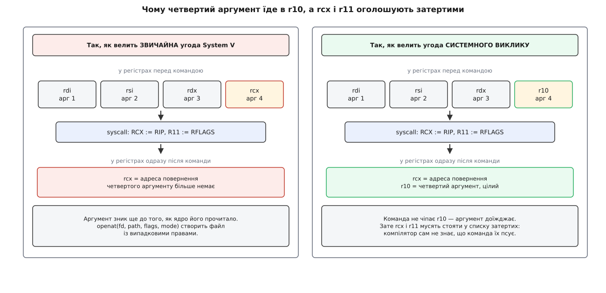
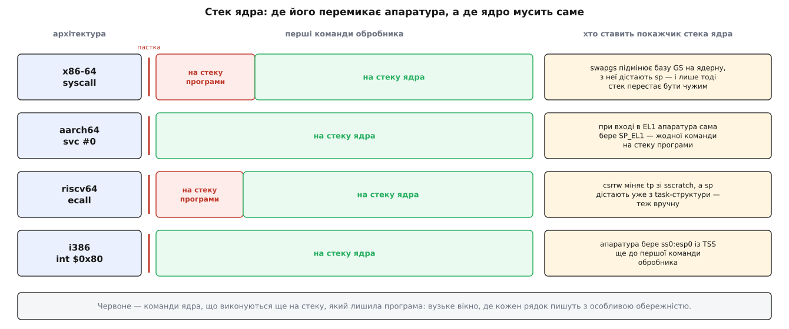
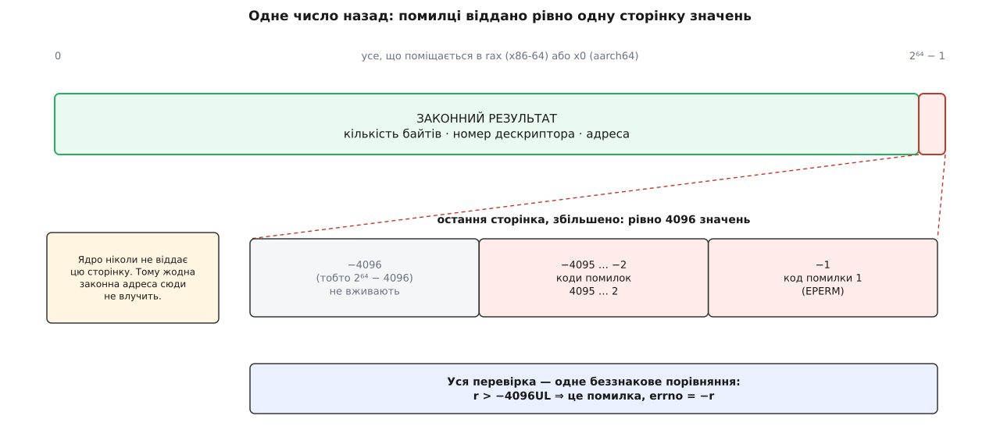

# 🧾 Контракти переходу в ядро: x86-64, aarch64, riscv64, i386

Це довідник, у який зазираєш, коли пишеш нижче за бібліотеку C: яка команда влаштовує пастку, у якому регістрі їде номер послуги, куди лягають шість аргументів, що приїжджає назад, які регістри після цього непридатні й звідки апаратура бере адресу входу. Усе — таблицями, без розповіді; тримати це в голові не варто, а звіряти доводиться щоразу.

<preknowlist>
- [Кільця захисту й рівні привілеїв](topic:hw-arch/protection-rings) — машина пам'ятає, на якому рівні працює зараз, і частину команд дозволяє лише на привілейованому.
- [Обробка виключень у процесорі](topic:hw-arch/cpu-exception-handling) — пастка веде на наперед заданий обробник, а потім керування вертається назад.
- [Угода про виклик (ABI)](topic:hw-arch/calling-convention) — які регістри везуть аргументи, хто зобов'язаний їх зберегти й куди лягає адреса повернення.
</preknowlist>

Скрізь далі йдеться про Linux. Апаратна частина (команди, регістри, вектори) належить архітектурі й однакова для будь-якої системи; розкладка номерів і аргументів, кодування помилки й правила збереження регістрів — це вже домовленість конкретного ядра, і в FreeBSD чи в Windows на тій самій апаратурі вони інші.

## Перехід одним поглядом

| | **x86-64** | **aarch64** | **riscv64** | **i386** (для контрасту) |
|---|---|---|---|---|
| команда-пастки | `syscall` | `svc #0` | `ecall` | `int $0x80` (застаріле) |
| регістр номера | `rax` (читають як 32-бітне) | `x8` (читають `w8`) | `a7` | `eax` |
| результат | `rax` | `x0` | `a0` | `eax` |
| другий результат | `rdx` | `x1` | `a1` | `edx` |
| адреса входу з | `IA32_LSTAR` | `VBAR_EL1` + 0x400 | `stvec` | вентиль 0x80 в IDT |
| адреса повернення в | `rcx` | `ELR_EL1` | `sepc` — **на саму `ecall`** | на стеку ядра |
| старий стан прапорців у | `r11` (RFLAGS) | `SPSR_EL1` (PSTATE) | `sstatus.SPIE` / `SPP` | `eflags` на стеку ядра |
| покажчик стека ядра ставить | **ядро само** | апаратура (`SP_EL1`) | **ядро само** | апаратура (TSS `ss0:esp0`) |
| команда повернення | `sysretq`, іноді `iretq` | `eret` | `sret` | `iret` |
| таблиця номерів | своя, історична | спільна `asm-generic` | спільна `asm-generic` | своя, найстарша |
| файл з номерами | `asm/unistd_64.h` | `asm/unistd.h` | `asm/unistd.h` | `asm/unistd_32.h` |

Три рядки цієї таблиці варті окремого слова, бо саме на них найчастіше спотикаються.

**Другий регістр результату** існує в описі ABI, але на цих чотирьох архітектурах Linux ним не користується: колонка лишилася від систем, де так вертали пару значень (класичний приклад — `pipe`, що на кількох старих архітектурах віддавав два дескриптори двома регістрами). Розраховувати на нього не можна.

**`sepc` на RISC-V вказує на саму команду `ecall`**, а не на наступну, — це не помилка документації, а загальне правило архітектури для синхронних винятків. Ядро додає до нього 4 перед `sret`; саме 4, бо стисненої форми `ecall` не існує, тож довжина команди відома напевно.

**Номер на x86-64 беруть як 32-бітне ціле** (`eax`, а не весь `rax`). Практичний наслідок один: старша половина регістра ролі не грає, а от домішувати щось до номера понад 32 біти безглуздо.

## Шість аргументів: хто де їде

| Арх | арг 1 | арг 2 | арг 3 | арг 4 | арг 5 | арг 6 |
|---|---|---|---|---|---|---|
| **x86-64** | `rdi` | `rsi` | `rdx` | `r10` | `r8` | `r9` |
| **aarch64** | `x0` | `x1` | `x2` | `x3` | `x4` | `x5` |
| **riscv64** | `a0` | `a1` | `a2` | `a3` | `a4` | `a5` |
| **i386** | `ebx` | `ecx` | `edx` | `esi` | `edi` | `ebp` |
| **arm/EABI** (32 біти, номер у `r7`) | `r0` | `r1` | `r2` | `r3` | `r4` | `r5` |

На aarch64 і riscv64 ця розкладка збігається зі звичайною [угодою про виклик](topic:hw-arch/calling-convention) один в один: перші шість аргументів функції їдуть тими самими регістрами, і відрізняється лише те, що номер везуть окремим регістром (`x8`, `a7`), який у мові C служить тимчасовим. Тому на цих архітектурах писати системний виклик руками просто: береш звичайний виклик і додаєш один регістр.

На x86-64 є рівно одна розбіжність — четвертий аргумент. Звичайна угода System V везе його в `rcx`, а `syscall` сама кладе туди адресу повернення, ще до того як ядро отримає керування. Аргумент, покладений у `rcx`, зникає безслідно.



*Ліворуч — те, що станеться, якщо взяти звичайну угоду й просто дописати команду: `rcx` буде затерто адресою повернення раніше, ніж ядро прочитає аргумент. Праворуч — чинна угода: четвертий аргумент зсунуто в `r10`, а `rcx` і `r11` оголошено затертими, бо компілятор сам не здогадається, що команда їх псує.*

На i386 збігу з мовою C немає взагалі: звичайна угода там передає аргументи стеком, тож розкладка по регістрах — це цілком окрема домовленість. Шостий аргумент їде в `ebp`, який компілятор охоче тримає за кадровий покажчик, — саме тому виклики з шістьма аргументами на i386 незручно писати вручну.

## Що вціліє після повернення

| Арх | змінюється напевно | решта |
|---|---|---|
| **x86-64** | `rax` (результат), `rcx` (адреса повернення), `r11` (старі RFLAGS) | усі інші загальні регістри ядро відновлює такими, якими вони були |
| **aarch64** | `x0` (результат) | `x1`–`x30` ядро відновлює зі збереженого стану |
| **riscv64** | `a0` (результат) | усі інші відновлює |
| **i386** | `eax` (результат) | через `int $0x80` — усі інші відновлює |

Прапорці на x86-64 приїжджають назад не такими, як були: команда гасить у RFLAGS усі біти, виставлені в `IA32_FMASK`, а Linux ставить туди майже все — зокрема біт дозволу переривань, біт покрокового трасування, біт напрямку рядкових операцій. Старе значення лишається в `r11`, і саме звідти `sysret` кладе його назад.

Окремий рядок — векторні регістри aarch64. Нижні 128 біт `Z0`–`Z31` (тобто звичні `V0`–`V31`) переживають системний виклик за звичайними правилами AAPCS64, а **решта бітів `Z0`–`Z31`, усі предикати `P0`–`P15` і `FFR` після повернення з виклику обнулені**. Налаштована довжина вектора при цьому зберігається. Це задокументована частина ABI, а не властивість конкретного ядра, і код, що тримає щось цінне в широкій частині векторного регістра через системний виклик, зламається.

У вбудованому асемблері до списку затертих завжди додають `"memory"`: ядро могло записати в буфер, на який показував аргумент, і компілятор мусить про це знати.

## Що робить апаратура в мить пастки

Тут архітектури розходяться найсильніше — і найдорожча розбіжність стосується стека.



*Червоне — відрізок, на якому команди ядра виконуються ще на тому стеку, який лишила програма. На aarch64 його немає зовсім: вхід у EL1 сам бере `SP_EL1`. На i386 його теж немає: апаратура витягає `ss0:esp0` з TSS. А `syscall` на x86-64 і `ecall` на RISC-V покажчика стека не чіпають узагалі, тож перші команди обробника мусять дістати його самі — і саме ці рядки пишуть з особливою обережністю.*

### x86-64

Усе, що потрібно команді, лежить у машинно-специфічних регістрах (MSR), писати в які може лише ядро.

| MSR | адреса | що тримає |
|---|---|---|
| `IA32_EFER` | 0xC000_0080 | біт 0 (SCE) — дозвіл на `syscall`; без нього команда дає #UD |
| `IA32_STAR` | 0xC000_0081 | біти 47:32 — селектори CS/SS ядра; біти 63:48 — селектори для `sysret` |
| `IA32_LSTAR` | 0xC000_0082 | RIP точки входу з 64-бітного режиму |
| `IA32_CSTAR` | 0xC000_0083 | RIP точки входу з режиму сумісності (реально працює на AMD) |
| `IA32_FMASK` | 0xC000_0084 | маска: кожен виставлений біт команда гасить у RFLAGS |

Послідовність команди рівно така: `rcx := rip_наступної`, `r11 := rflags`, `rflags := rflags AND NOT FMASK`, `cs`/`ss` беруться з `IA32_STAR` (описи сегментів не читаються з таблиць у пам'яті — атрибути підставлені наперед), `rip := IA32_LSTAR`. Покажчик стека не змінюється.

Повернення — `sysretq`: `rip := rcx`, `rflags := r11`, рівень униз. Але Linux користується ним не завжди. Якщо ядро змінило збережені регістри (наприклад, через трасування) або `rcx` вийшла неканонічною, ядро вертається довшим шляхом — `iretq`. Причина історична й дорога: на процесорах Intel `SYSRET` із неканонічною адресою в `RCX` давав загальний збій захисту вже **на нульовому рівні**, тобто в ядрі, з користувацьким стеком, — уразливість CVE-2012-0217 (2012), що зачепила Xen, FreeBSD, Solaris і Windows. На процесорах AMD такої поведінки немає. *Статус: усталений факт, розбіжність поведінки задокументована обома виробниками.*

### aarch64

| що | де |
|---|---|
| точка входу | `VBAR_EL1` + 0x400 — «синхронний виняток із нижчого EL у стані AArch64» |
| таблиця векторів | 16 записів по 128 байтів, база вирівняна на 2 КіБ |
| причина винятку | `ESR_EL1[31:26]` (EC) = 0x15 — `SVC` з AArch64 (0x11 — `SVC` з AArch32) |
| безпосереднє значення `svc #imm16` | потрапляє в поле ISS того ж `ESR_EL1` — **Linux його ігнорує** |
| адреса повернення | `ELR_EL1` (наступна команда) |
| старий PSTATE | `SPSR_EL1` |
| стек | `SP_EL1`, перемикає апаратура |
| повернення | `eret` — одним рухом бере PC з `ELR_EL1` і PSTATE зі `SPSR_EL1` |

Те, що номер можна було б закодувати в самій команді, а Linux цього не робить, — свідомий вибір: номер у регістрі означає, що той самий двійковий код обгортки годиться для будь-якого номера, а таблиця номерів не прибита до кодування команд. `svc #0` — просто домовленість про те, яке значення писати.

### riscv64

| що | де |
|---|---|
| точка входу | `stvec`: поле BASE плюс поле MODE; для синхронних винятків обидва режими ведуть у BASE |
| причина винятку | `scause` = 8 — виклик середовища з U-режиму; `stval` = 0 |
| адреса повернення | `sepc` — **адреса самої `ecall`**, ядро додає 4 |
| старий стан | `sstatus`: `SPP` = 0 (прийшли з U-режиму), `SPIE` ← попереднє значення `SIE` |
| стек | ядро дістає само: `csrrw` міняє `tp` зі `sscratch`, далі `sp` беруть зі структури задачі |
| повернення | `sret` — розкручує `sepc`, `SPP` і `SPIE` назад |

### i386

Вхід — звичайний вентиль-пастка з номером 0x80 у таблиці дескрипторів переривань. Апаратура бере `ss0:esp0` з сегмента стану задачі (TSS), перемикається на стек ядра й кладе туди `ss`, `esp`, `eflags`, `cs`, `eip`; `iret` знімає це назад. Швидкий вхід (`sysenter`) налаштовують трьома MSR — `IA32_SYSENTER_CS` (0x174), `IA32_SYSENTER_ESP` (0x175), `IA32_SYSENTER_EIP` (0x176), — але виписувати цю команду руками не варто: правильна ціль на i386 — функція `__kernel_vsyscall` із [vDSO](topic:sys-unix/vdso), яка сама обирає найкращу команду для цієї машини й уміє з неї вернутися. Голий `int $0x80` працює завжди, тільки повільніше.

## Помилка як від'ємне число

Ядро віддає одне число. Розрізняє результат і помилку домовленість про діапазон, і перевірка робиться одним беззнаковим порівнянням.

```
r — вміст регістра результату, розглянутий як БЕЗЗНАКОВЕ 64-бітне число

  r ≤ 0xFFFF_FFFF_FFFF_F000   →  успіх; r — законне значення
  r > 0xFFFF_FFFF_FFFF_F000   →  помилка; errno = −r

  0xFFFF_FFFF_FFFF_F000 = −4096 як знакове
  діапазон помилок:  −4095 … −1   →   errno 4095 … 1
  константа ядра:    MAX_ERRNO = 4095
```



*Під помилки віддано рівно одну сторінку значень у самому кінці беззнакового діапазону. Ядро ніколи не віддає адресу з цієї сторінки як законний результат, тож жодне справжнє значення туди не влучить, і вся перевірка зводиться до одного беззнакового порівняння.*

Число 4095 тут не випадкове й не лише про `errno`: та сама «остання сторінка» слугує ядру для того, щоб функція могла вернути **або** покажчик, **або** код помилки в одному значенні. Саме на цьому діапазоні стоять внутрішні `ERR_PTR` і `IS_ERR`.

Так поводяться не всі архітектури Linux — і це друга річ, через яку переносний код не виписує системні виклики руками.

| ядро / архітектура | як каже «помилка» |
|---|---|
| Linux: x86-64, aarch64, riscv64, i386 | від'ємне значення в регістрі результату, діапазон −4095…−1 |
| Linux: powerpc64, команда `sc` | біт SO в `cr0`: SO=0 — успіх, `r3` — результат; SO=1 — помилка, `r3` — код |
| Linux: powerpc64, команда `scv 0` | як у всіх: −4095…−1 |
| Linux: mips | окремий регістр-прапорець `a3`: якщо ненульовий, у регістрі результату лежить код помилки |

Невідомий номер помилкою виклику не є — це звичайна відмова: ядро перевіряє межу таблиці й вертає `-ENOSYS` (−38). Тому «чи вміє це ядро таку послугу» перевіряють саме викликом, а не версією ядра.

Обгортка бібліотеки C робить із цього числа звичну пару: побачивши значення з діапазону помилок, вона кладе його з протилежним знаком у [`errno`](topic:sf-apps/errno) і вертає −1. Але робить це **лише вона**: після ручного виклику `errno` не змінюється, і читати його безглуздо.

## Стеля в шість аргументів і що робити, коли їх більше

Стеля береться не зі смаку, а з того, що аргументи їдуть **тільки регістрами**: зі стека їх було б не забрати без звернення до пам'яті недовіреної програми. Шість — стільки регістрів кожна з цих архітектур може виділити, не зачепивши потрібних самому переходу. Коли послузі треба більше, вживають один із чотирьох прийомів.

| прийом | як виглядає | приклади |
|---|---|---|
| покажчик на структуру | останнім аргументом їде адреса, ядро читає структуру з усіма пересторогами | більшість сучасних послуг з великою кількістю полів |
| **розширювана структура з полем розміру** | пара «адреса + `size`», причому `size` служить неявним номером версії | `clone3(struct clone_args *, size_t size)`, `openat2(int dirfd, const char *path, struct open_how *how, size_t size)`, `sched_setattr`, `perf_event_open` |
| спакувати кілька останніх в одну структуру | сьомий аргумент не влазив — його склали з шостим | `pselect6`: шостим їде адреса `struct { const sigset_t *ss; size_t ss_len; }` |
| мультиплексор (застаріле) | один номер на купу послуг, перший аргумент — підномер | `socketcall`, `ipc` на i386; так більше не роблять |

Розширювану структуру варто розібрати окремо, бо це чинний спосіб додавати послуги. Ядро копіює її функцією `copy_struct_from_user`, яка порівнює свій розмір із переданим: структура коротша за очікувану — решту полів доповнюють нулями (стара програма на новому ядрі); довша — приймають лише тоді, коли зайвий хвіст цілком нульовий (нова програма на старому ядрі, яка не просить нічого нового). Одне число `size` таким чином замінює версію інтерфейсу в обидва боки.

Окремий випадок стелі — 64-бітний аргумент на 32-бітній архітектурі: він займає **два** регістри, і порядок половинок залежить від [порядку байтів](topic:hw-arch/endianness) платформи. На arm/EABI до цього додається вирівнювання: 64-бітне значення мусить лягти в парну-непарну пару регістрів (`r2`:`r3`, не `r1`:`r2`), тож між аргументами інколи вставляють порожній. Саме звідси беруться дивні на вигляд послуги на кшталт `_llseek`, що приймає зсув двома половинами окремими аргументами, і перевпорядковані варіанти `fadvise64_64` та `sync_file_range2`. *Статус: усталений факт, перелік зачеплених послуг наведено в довідковій сторінці `syscall(2)`.*

## Мінімальний виклик руками

Найкоротший спосіб дістатися ядра на x86-64 з шістьма аргументами. Регістри `r8`–`r10` не мають однобуквених обмежень у вбудованому асемблері GCC, тож їх задають регістровими змінними.

```c
#include <asm/unistd.h>   /* __NR_write, __NR_openat, … */

static long sys6(long n, long a1, long a2, long a3,
                 long a4, long a5, long a6)
{
    register long r10 __asm__("r10") = a4;   /* НЕ rcx: її затре сама команда */
    register long r8  __asm__("r8")  = a5;
    register long r9  __asm__("r9")  = a6;
    long ret;
    __asm__ volatile ("syscall"
                      : "=a" (ret)
                      : "a" (n), "D" (a1), "S" (a2), "d" (a3),
                        "r" (r10), "r" (r8), "r" (r9)
                      : "rcx", "r11", "memory");
    return ret;          /* −4095…−1 — це помилка, а не результат */
}
```

Обмеження вбудованого асемблера по архітектурах:

| Арх | номер | арг 1–3 | арг 4–6 | результат | обов'язкові затерті |
|---|---|---|---|---|---|
| **x86-64** | `"a"` | `"D"`, `"S"`, `"d"` | регістрові змінні `r10`, `r8`, `r9` | `"=a"` | `"rcx"`, `"r11"`, `"memory"` |
| **aarch64** | регістрова змінна `x8` | регістрові змінні `x0`–`x2` | регістрові змінні `x3`–`x5` | `x0` | `"memory"`, `"cc"` |
| **riscv64** | регістрова змінна `a7` | регістрові змінні `a0`–`a2` | регістрові змінні `a3`–`a5` | `a0` | `"memory"` |

Готова обгортка з бібліотеки C, коли переносність важливіша за контроль:

```c
#include <sys/syscall.h>
#include <unistd.h>

long syscall(long number, ...);
/* Кладе аргументи за угодою цієї архітектури, вертає результат.
   Помилка: результат −1, код у errno (тобто вже перекладений із від'ємного).
   Номер беруть з макросів SYS_write / SYS_openat — це синоніми __NR_*. */
```

## Дрібниці, що коштують дня

| що | де кусає |
|---|---|
| `rcx` і `r11` на x86-64 | затирає сама команда; у списку затертих їх мусиш назвати ти, компілятор не знає |
| четвертий аргумент | на x86-64 це `r10`, а не `rcx`, як у звичайній угоді |
| `sepc` на riscv64 | вказує на саму `ecall`; забути +4 — це нескінченний цикл із тієї самої команди |
| `svc #imm` на aarch64 | Linux безпосереднє значення ігнорує; номер бере лише з `w8` |
| `ebp` на i386 | шостий аргумент конфліктує з кадровим покажчиком; безпечніше йти через `__kernel_vsyscall` з vDSO |
| векторні регістри aarch64 | усе, крім нижніх 128 біт `Z0`–`Z31`, обнуляється системним викликом |
| біт 30 у номері | `__X32_SYSCALL_BIT` (0x4000_0000) позначає виклик за ABI x32; власні номери x32 починаються з 512 |
| `errno` після ручного виклику | не змінюється: його ставить обгортка, а не ядро |
| перевірка «є така послуга?» | лише за `-ENOSYS` від самого виклику, не за версією ядра |

Конкретне втілення цього контракту в Linux — таблиця, диспетчеризація, обгортки — [описано окремо](topic:sys-unix/syscall-mechanics).
