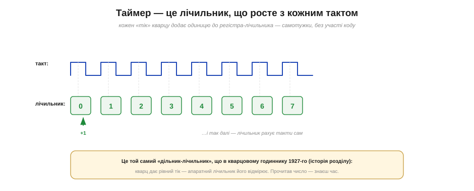
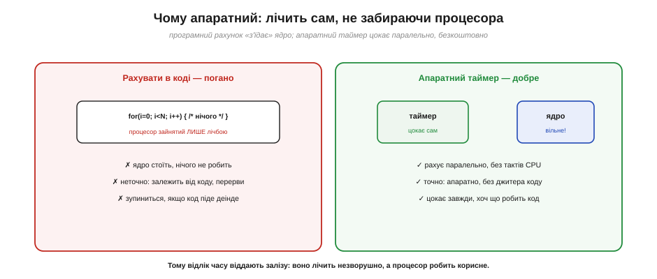
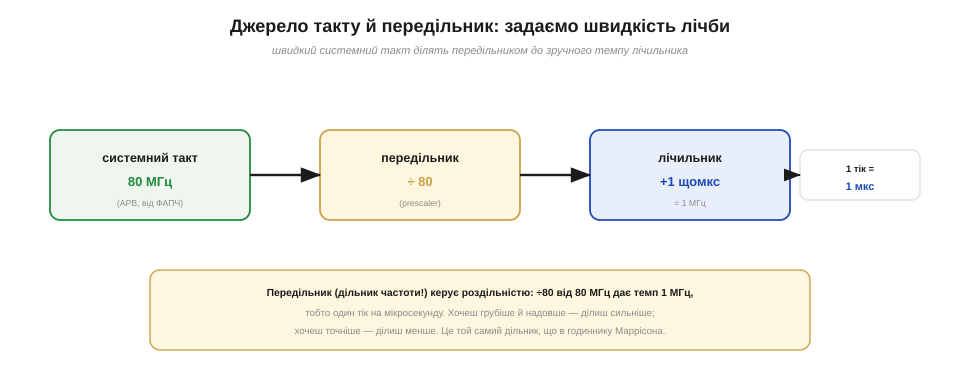
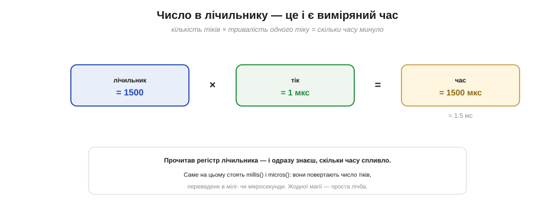
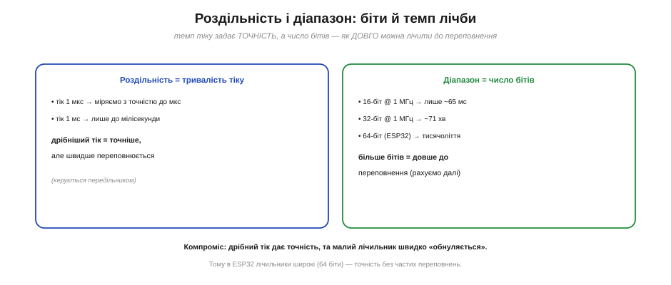
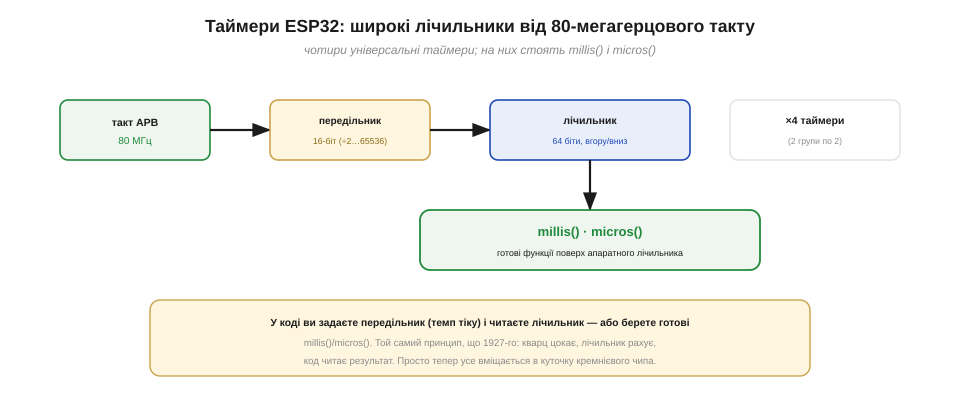

# Таймер-лічильник: апаратний рахівник тактів

В основі будь-якого вимірювання часу лежить проста, але могутня пара: **рівний тік плюс лічильник**. Кварц дає бездоганно рівні коливання, а щось мусить їх **рахувати**, щоб перетворити на час. У мікроконтролері цим «чимось» і є **таймер** — апаратний лічильник тактів. Розберімо, як він улаштований, чому його роблять залізним, як задають швидкість лічби й чому число в його регістрі — це буквально виміряний час.

### Лічильник, що росте з кожним тактом

У серці таймера — звичайний регістр-**лічильник**: комірка, що зберігає число. Особливість у тому, що це число **саме зростає на одиницю** з кожним тактом, який приходить від джерела часу. Тік — лічильник став 1. Ще тік — 2. Ще — 3. І так безперервно, без жодної команди від коду: лічба вбудована в саме залізо.


*Кожен такт (тік) додає одиницю до регістра-лічильника: 0, 1, 2, 3… Це той самий «дільник-лічильник», що й у кварцовому годиннику: кварц дає рівний тік, а апаратний лічильник його відмірює. Прочитав число в регістрі — знаєш, скільки тіків минуло, тобто скільки спливло часу.*

Це й уся базова ідея таймера: він **рахує час у тіках**. Що довше працює — то більше число в лічильнику, і це число прямо пропорційне часу, що минув. Лишається домовитися, як часто приходять тіки і що робити, коли лічильник дорахує до межі й [переповниться](topic:hw-arch/timer-overflow). Та основа гранично проста: **таймер — це лічильник тактів**.

Кілька штрихів до цієї картини. По-перше, лічильник уміє рахувати не лише **вгору**, а й **вниз** — від заданого числа до нуля (це інколи зручніше, коли треба відлічити «скільки лишилося»). По-друге, найпростіший режим — **вільний хід**: лічильник просто рахує вгору, а дорахувавши до максимуму, починає з нуля знову, і так без кінця. Саме у вільному ході працює годинник на кшталт `millis()`. А складніші режими — зупинитися на потрібному числі чи перезапуститися — лише надбудова над тим самим лічильником.

Зриму аналогію легко знайти в побуті. Таймер — це як **лічильник на турнікеті** чи одометр у машині: щось коротко клацає (тут — кварц), а механізм покірно додає одиницю й показує накопичене число. Різниця лише в темпі: турнікет клацає від людей, одометр — від обертів колеса, а таймер — від коливань кристала, мільйони разів на секунду. Принцип же той самий — **рахувати однакові події**, і накопичене число розповідає, скільки їх уже сталося.

### Чому апаратний, а не в коді

Постає природне запитання: навіщо окреме залізо, якщо «порахувати» можна й у коді — крутити цикл і збільшувати змінну? Можна, але це **погана** ідея, і ось чому. Поки процесор крутить такий цикл, він зайнятий **лише** лічбою й нічого іншого робити не може. Точність такого «годинника» жалюгідна: вона залежить від того, скільки інструкцій у циклі, чи не втрутилося переривання, чи не пішов код іншою гілкою. А щойно процесор займеться чимось іншим — лічба **зупиниться**.


*Ліворуч — лічба в коді: процесор намертво зайнятий порожнім циклом, рахунок неточний і спиниться, щойно код піде деінде. Праворуч — апаратний таймер: він цокає **паралельно**, не забираючи тактів процесора, точно й завжди, хоч би що робив код. Тому відлік часу віддають залізу.*

Апаратний таймер позбавлений усіх цих вад. Він — окремий вузол чипа, що цокає **сам по собі**, незалежно від процесора: рахує тіки точно й безперервно, поки ядро виконує корисну роботу. Жодного джитера від коду, жодної зупинки. Це класичний приклад того, навіщо в мікроконтролері стільки спеціалізованої периферії: дрібну, але нескінченну роботу (лічити час) віддають простому залізу, звільняючи розумне й дороге ядро для справ.

> 🔧 **Навіщо це.** Запам'ятайте принцип: **час лічить залізо, а не код**. Спроба «відрахувати» затримку порожнім циклом — типова помилка початківця: вона марнує процесор і дає неточний, нестабільний результат. Усі надійні способи працювати з часом спираються на апаратний таймер — він цокає сам, а ви лише читаєте його показання чи просите сповістити, коли набіжить потрібне число.

Варто додати, чому це не дрібниця, а наріжний принцип. Апаратний таймер **детермінований**: один тік — рівно одна одиниця часу, завжди, незалежно від того, що коїться в коді, скільки переривань спрацювало чи якою гілкою пішла програма. Така незворушність і робить його придатним там, де час важить по-справжньому, — у точних вимірах, зв'язку, керуванні. Тому таймери є в **кожному** мікроконтролері, від найдешевшого 8-бітного до ESP32, і завжди їх декілька: відлік часу — надто базова потреба, щоб довіряти її коду.

### Звідки тіки й як задати їхній темп

Тіки таймера походять від системного такту, а той кінець кінцем — від [кварцу](topic:hw-components/quartz-resonator). Але кварц цокає **дуже** швидко: у ESP32 системний такт — десятки мегагерців. Рахувати кожне таке коливання незручно: лічильник миттю переповнювався б, та й рідко треба така дрібна точність. Тому між джерелом такту й лічильником ставлять **передільник** (*prescaler*) — дільник частоти, що ділить швидкий такт на потрібне число, задаючи **темп** лічби.


*Системний такт (80 МГц — такт APB, похідний від кварцу через помножувач-ФАПЧ) проходить крізь **передільник**: поділивши на 80, дістаємо темп 1 МГц — один тік на мікросекунду. Передільник керує роздільністю: хочеш точніше — ділиш менше, хочеш грубіше й надовше — ділиш сильніше. Це той самий дільник частоти, що в годиннику Маррісона.*

Завдяки передільнику ви самі обираєте, **скільки реального часу важить один тік** лічильника. Поділили 80 МГц на 80 — тік дорівнює одній мікросекунді, і лічильник рахує мікросекунди. Поділили на 80 000 — тік дорівнює мілісекунді. Це налаштування — одне з найперших, що роблять із таймером: задати передільник означає вибрати **одиницю часу**, якою таймер міряє. Решта — проста лічба цих одиниць.

Сам передільник — теж лічильник, лише крихітний: він рахує вхідні такти й випускає один вихідний на кожні N. Поділ на 80 означає «пропусти 80 коливань — видай один тік». Кілька звичних налаштувань для 80 МГц: ÷80 дає 1 МГц (тік 1 мкс), ÷8000 — 10 кГц (тік 0.1 мс), ÷80000 — 1 кГц (тік 1 мс). Що більший передільник, то «повільніший» і грубіший тік, зате лічильник довше не переповнюється. Підбираючи передільник, ви фактично крутите ручку «точність ↔ тривалість» під свою задачу.

### Число лічильника — це і є час

Тепер найголовніше для практики. Якщо ви знаєте, **скільки важить один тік**, то число в лічильнику миттю перетворюється на час простим множенням: **час = число тіків × тривалість тіку**. Лічильник показує 1500, а тік налаштовано на 1 мкс? Отже, минуло 1500 мкс, тобто 1.5 мс. От і весь «годинник».


*Лічильник = 1500, один тік = 1 мкс → минуло 1500 мкс = 1.5 мс. Прочитав регістр лічильника — і одразу знаєш, скільки часу спливло. Саме на цьому стоять `millis()` і `micros()`: вони повертають число тіків, переведене в мілі- чи мікросекунди. Жодної магії — проста лічба.*

Тут і криється зв'язок із функціями, які ви, можливо, вже вживали. `millis()` повертає, скільки мілісекунд минуло від старту, а `micros()` — скільки мікросекунд. Під капотом вони просто **читають апаратний лічильник** (що цокає від кварцу) і переводять його показання в звичні одиниці. Коли ви викликаєте `millis()`, ви буквально питаєте таймер: «скільки тіків ти вже нарахував?» — і дістаєте відповідь у мілісекундах.

Звідси й найчастіше практичне вживання таймера — **виміряти тривалість**. Прийом простий: запам'ятати показання на початку, зробити щось, відняти від нового показання старе — різниця й є витрачений час. Саме так заміряють, скільки виконується шматок коду: `t0 = micros();` … `dt = micros() - t0;`. Таймер тут — секундомір: одне читання на старті, друге на фініші, віднімання дає інтервал. Цим вимірюють і тривалість зовнішніх імпульсів, і швидкодію власних функцій — будь-що, у чого є початок і кінець у часі.

### Роздільність і діапазон: компроміс

Дві властивості таймера визначають, що ним можна виміряти. **Роздільність** — це тривалість одного тіку: дрібніший тік дає точніший вимір (мікросекунди проти мілісекунд), і керується вона передільником. **Діапазон** — це найбільше число, яке вміщає лічильник, перш ніж переповнитися; його задає **число бітів** лічильника.


*Роздільність = тривалість тіку (дрібніший тік — точніше, але швидше переповнення). Діапазон = число бітів: 16-бітний лічильник на 1 МГц переповниться вже за ~65 мс, 32-бітний — за ~71 хвилину, а 64-бітний (як у ESP32) — за тисячоліття. Компроміс: дрібний тік дає точність, та малий лічильник швидко «обнуляється».*

Тут є природний компроміс. Зробиш тік дуже дрібним (велика точність) — лічильник набиратиме своє максимальне число швидко й часто переповнюватиметься. Зробиш лічильник ширшим (більше бітів) — він довше рахуватиме без переповнення, але займе більше місця в чипі. Класичні 8-бітні мікроконтролери мали тісні 8- і 16-бітні таймери, де переповнення треба було пильнувати щомиті. ESP32 у цьому розкішний: його лічильники **64-бітні**, тож навіть із мікросекундним тіком вони рахуватимуть без переповнення довше за вік цивілізації.

На старих 8-бітних чипах цей компроміс відчували гостро. В Arduino Uno, скажімо, таймерів три: два **8-бітні** (рахують лише до 255) і один **16-бітний** (до 65535), і мікросекундний тік переповнював їх за частки секунди — переповнення доводилося ловити й рахувати окремо. ESP32 із 64-бітними лічильниками зняв цей клопіт майже повністю: обирай дрібний тік заради точності, не боячись, що лічильник скоро «обнулиться». Це один із тих випадків, де щедрість сучасного заліза просто **усуває** давній постійний клопіт.

### Таймери в ESP32

Зберімо все на прикладі ESP32. У ньому **чотири** універсальні таймери (зібрані у дві групи по два), і кожен улаштований за тією самою схемою: бере такт APB (зазвичай 80 МГц, похідний від кварцу через ФАПЧ), пропускає крізь **16-бітний передільник** (ділить на будь-що від 2 до 65 536), а результат рахує **64-бітним** лічильником, що вміє йти як вгору, так і вниз.


*Будова таймера ESP32: такт APB (80 МГц) → 16-бітний передільник (÷2…65536) → 64-бітний лічильник (вгору/вниз), і таких таймерів чотири. На цій апаратурі й стоять готові `millis()`/`micros()`. У коді ви або задаєте передільник і читаєте лічильник, або просто берете ці готові функції.*

У повсякденному коді ви рідко чіпаєте таймер напряму — частіше досить `millis()` чи `micros()`. Та коли потрібна повна влада над часом (точний період, апаратна реакція на час), таймер налаштовують руками: задають передільник (вибирають одиницю часу) і далі читають лічильник чи просять його сповістити перериванням. У будь-якому разі під усім цим — та сама пара з 1927 року: кварц цокає, лічильник рахує, код читає результат.

**Порахуймо: передільник, тік і переповнення.**

```
Дано: системний такт 80 МГц, лічильник 64-біт.

Обираємо передільник ÷80:
   тік = 80 / 80 = 1 МГц  →  один тік = 1 мкс  (роздільність)

Скільки минуло, якщо лічильник = 2000?
   час = 2000 тіків × 1 мкс = 2000 мкс = 2 мс

Коли переповниться (за такого тіку)?
   64-біт: 2⁶⁴ ≈ 1.8×10¹⁹ тіків × 1 мкс ≈ 584 тисячі років
   (а 16-біт лічильник переповнився б уже за 65 мс!)
```

Приклад показує всю арифметику таймера разом: передільник задає тривалість тіку, число тіків множимо на неї — дістаємо час, а ширина лічильника каже, як довго можна рахувати до переповнення. У ESP32 з його 64 бітами про переповнення можна майже не думати — і це велика зручність порівняно зі старими 8-бітними чипами.

> 🧮 **А коли частота не ділиться рівно?** 1 кГц із 80 МГц виходить **точно** (80 000 = 80 × 1000). Та не всяка ціль так лягає на цілі дільники — і тоді лишається крихітна похибка, що **накопичується** з часом. Як це порахувати й коли воно важить — у вставці [Передільник і дільники](topic:hw-arch/timer-counter/math-prescaler.md).

> 🔧 **Навіщо це.** На щодня вам майже завжди досить `millis()`/`micros()` — не лізьте в передільники без потреби. Прямо налаштовувати таймер варто, коли треба апаратно реагувати на час (без участі `loop()`), генерувати точний період або ловити тривалість швидких сигналів. Тоді перше рішення — обрати передільник, тобто **одиницю часу**, у якій таймер працюватиме: від цього залежить і точність, і коли він переповниться. А `millis()` лишіть для простого «скільки минуло».

Варто розрізнити дві близькі речі. **Таймер**, про який ідеться, рахує час **від старту** чипа й обнуляється при перезавантаженні — він про **проміжки** («минуло стільки-то»). А ось «котра година і яке число» зберігає окремий вузол — [**годинник реального часу** (RTC)](topic:hw-arch/rtc) з власним маленьким [кварцом на 32 768 Гц](topic:hw-components/watch-crystal-rtc), який може цокати навіть у глибокому сні, поки решта чипа спить. Тут нам цікавий саме таймер-проміжок; RTC живе своїм окремим життям, дотичним до [режимів сну](topic:hw-arch/sleep-modes).

Отже, таймер — це апаратний лічильник, що сам рахує тіки системного такту (родом від кварцу), не забираючи процесора. Передільник задає **тривалість одного тіку** (роздільність), число бітів — **діапазон** до переповнення, а добуток «тіки × тривалість тіку» дає виміряний **час**; на цьому й стоять `millis()`/`micros()`. Лишається одна межа, через яку лічильник не може перескочити мовчки: рости вічно він не вміє, і коли добігає максимуму, стається [**переповнення**](topic:hw-arch/timer-overflow) — момент, на якому будують відлік **періоду** повторюваних подій.
