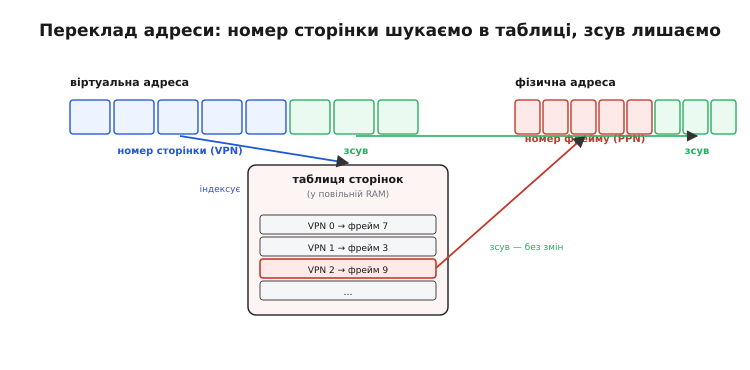
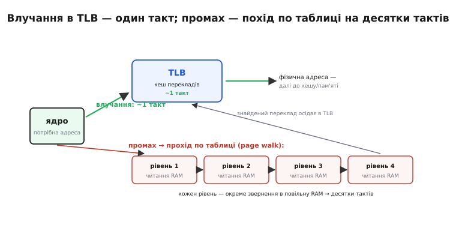
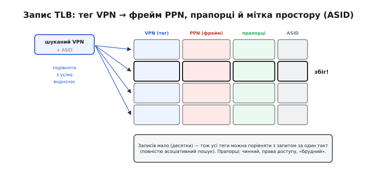
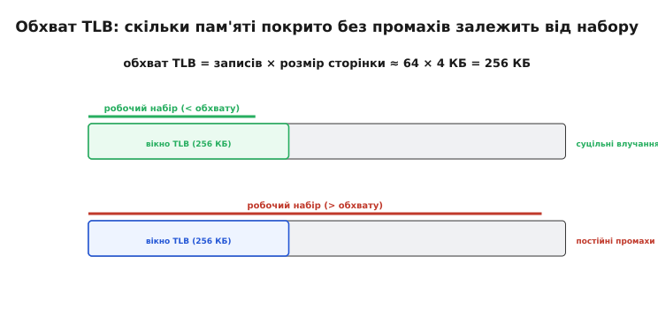

# TLB — кеш адресного перекладу

Коли програма працює з [віртуальною пам'яттю](root:hw-arch/virtual-memory), жодна адреса, яку вона називає, не є справжньою адресою в мікросхемі пам'яті. Програма каже «дай байт за адресою 0x4020», а залізо мусить спершу **перекласти** цю віртуальну адресу у фізичну — бо насправді той байт лежить десь інде. І тут криється прикра пастка, від якої все могло б розсипатися: сама таблиця перекладу лежить **у тій самій повільній пам'яті**. Виходить, щоб прочитати одне число, треба спершу піти в пам'ять по переклад, а вже потім — по саме число. Кожне звернення роздвоюється; програма стає вдвічі повільнішою на рівному місці. Ця тема — про дотепний обхід цієї пастки: **TLB** (англ. *translation lookaside buffer* — «буфер перекладу з відкладанням убік»), крихітний надшвидкий кеш, що тримає під рукою кілька останніх перекладів адрес і завдяки цьому дає ядру фізичну адресу за один такт, а не за похід у пам'ять. Розберемо, звідки береться потреба в перекладі, чому без TLB усе було б болісно повільним, як він влаштований усередині — і чому саме він тихо стоїть за швидкодією майже кожного сучасного процесора з віртуальною пам'яттю.

### Звідки береться переклад і чому він дорогий

Почнімо з того, **навіщо** взагалі перекладати адреси. Віртуальна пам'ять дає кожній програмі власний рівний адресний простір — так, ніби вся пам'ять машини належить лише їй, від нуля й далі. Насправді ж фізична пам'ять поділена між багатьма програмами, подекуди фрагментована, а частина даних узагалі виселена на диск. Щоб ця ілюзія трималася, залізо ділить пам'ять на однакові шматки — **сторінки** (англ. *page*, зазвичай 4 КБ) — і веде **таблицю сторінок** (*page table*): для кожної віртуальної сторінки записано, у якому фізичному кадрі-**фреймі** (*frame*) вона зараз лежить.

Сама адреса при цьому розпадається на дві частини напрочуд просто. Старші біти — це **номер сторінки** (*virtual page number*, VPN): він каже, *яка* сторінка. Молодші біти — **зсув** (*offset*) усередині сторінки: він каже, *яке місце* всередині неї. Переклад чіпає лише номер сторінки; зсув переходить у фізичну адресу без змін, бо всередині сторінки все лежить упритул.


*Переклад чіпає лише **номер сторінки**: VPN індексує таблицю сторінок і дає номер фрейму (PPN), а зсув усередині сторінки переходить у фізичну адресу без змін. Уся суть перекладу — «VPN → PPN»; клопіт лише в тому, що сама таблиця живе в повільній пам'яті.*

Ось де вилазить ціна. Таблиця сторінок велика — вона описує **весь** адресний простір, — тож тримати її можна лише в головній пам'яті (RAM). А отже, щоб перекласти одну адресу, ядро мусить спершу **звернутися в RAM** по відповідний рядок таблиці. І це не одне звернення: у сучасних машин таблиця **багаторівнева** (щоб не займати пам'ять під порожні ділянки простору), тож переклад — це **прохід по таблиці** (*page table walk*) через кілька рівнів, і **кожен рівень — окреме читання RAM**. Для звичних чотирирівневих таблиць це чотири походи в повільну пам'ять — заради того, щоб лише **дізнатися адресу** ще не прочитаного числа. Саме читання числа — п'яте звернення. Один логічний доступ обернувся п'ятьма фізичними. Без обхідного ходу віртуальна пам'ять коштувала б цих кількаразових уповільнень на **кожному** доступі.

### Рішення — кешувати самі переклади

Тепер придивімося до природи цих перекладів — і рятівний хід стане очевидним. Програми не скачуть навмання по всьому адресному простору; вони товчуться на невеликому наборі сторінок — той самий код у циклі, той самий масив, той самий стек. Це [локальність](root:hw-arch/cache) у чистому вигляді, лише на рівні сторінок: якщо ядро щойно переклало якийсь VPN, воно майже напевно попросить той самий переклад ще багато разів поспіль. А коли щось потрібне знову й знову — його треба **тримати під рукою**, а не діставати щоразу заново.

> 🔧 **Навіщо це.** Тут працює той самий принцип, що й скрізь у залізі: дорогу операцію, яку доводиться повторювати з однаковим результатом, кешують. Переклад адреси — дорогий (прохід по таблиці) і повторюваний (та сама сторінка знову й знову), тож він — ідеальний кандидат на кешування. Зрозумівши це, ви впізнаєте TLB як окремий випадок універсальної ідеї, а не як загадкову абревіатуру.

Саме це й робить **TLB** — маленький, дуже швидкий кеш, що зберігає кілька **останніх перекладів** «VPN → PPN». Перед кожним зверненням у пам'ять ядро спершу заглядає в TLB. Знайшовся там потрібний переклад — це **влучання** (*hit*): фізична адреса готова за один такт, без жодного походу в таблицю. Не знайшовся — **промах** (*miss*): тоді, і лише тоді, ядро виконує повний прохід по таблиці, дістає переклад із RAM, а знайдений результат **кладе в TLB** — щоб наступні звернення до тієї самої сторінки були вже влучаннями.


*Дві дороги для тієї самої адреси. **Влучання**: переклад уже в TLB — фізична адреса за ~1 такт. **Промах**: доводиться пройти таблицю (тут чотири рівні), кожен рівень — окреме читання повільної RAM, разом десятки тактів; знайдений переклад осідає в TLB, тож повторні звернення до цієї сторінки будуть уже влучаннями.*

Назва «lookaside buffer» — стара, ще з часів [перших машин із віртуальною пам'яттю](root:hw-arch/tlb/hist-atlas.md): так у Манчестері звали кеш узагалі, а кеш саме **перекладів** природно став «translation lookaside buffer». Слово *lookaside* тут означає «зазирнути вбік»: перед тим як іти довгою дорогою в таблицю, ядро кидає швидкий погляд убік — у TLB, — чи немає готової відповіді там.

### Що всередині: тег, фрейм і паралельний пошук

Тепер — усередину. TLB маленький саме тому, що мусить бути блискавичним: у ньому лише **десятки записів** (типово 16–64 на першому рівні). Кожен запис — це один кешований переклад плюс те, що робить його придатним і безпечним.


*Кожен запис TLB тримає **тег** — віртуальний номер сторінки (VPN), за яким його впізнають, — і **корисне навантаження**: номер фрейму (PPN), куди ця сторінка перекладається. Плюс **прапорці** (чинний, права доступу, «брудний») і **ASID** — мітку, чиєму адресному простору належить переклад. Пошук — паралельне порівняння тега з усіма записами водночас.*

Найважливіша тонкість — **як** у TLB шукають. Оскільки записів мало, залізо може дозволити собі розкіш: порівняти шуканий VPN **з усіма записами одночасно**, за один такт. Це **повністю асоціативний** пошук (*fully associative*) — переклад може лежати в будь-якому рядку, і всі теги звіряються паралельно спеціальними компараторами. Для великого кешу так робити було б надто дорого (компаратор на кожен рядок), але тут рядків жменя, тож паралельне порівняння — саме те, що дає відповідь за такт. Деякі TLB роблять частково асоціативними (наборами), а поверх маленького першого рівня ставлять більший, повільніший **другий рівень** TLB — та сама ідея ієрархії, що й у [кеша даних](root:hw-arch/cache): дрібний швидкий попереду, більший повільніший позаду.

Кілька прапорців у записі несуть окрему вагу. **Права доступу** дозволяють на тому ж такті перевірити, чи взагалі можна читати/писати цю сторінку, — захист простору дається майже задарма, разом із перекладом. А **ASID** (*address space identifier* — «ідентифікатор адресного простору») розв'язує тонку, але критичну проблему: у різних програм той самий VPN означає **різні** фізичні сторінки. Без мітки після переходу на іншу програму TLB видавав би їй чужі, застарілі переклади — і вона читала б чужу пам'ять. Про це — трохи далі, бо тут криється цілий клас помилок.

### Скільки пам'яті покриває TLB: обхват

Постає природне питання: якщо в TLB лише десятки записів, а програма чіпає тисячі сторінок, чи не промахується він увесь час? Відповідь ховається в понятті **обхвату** (*TLB reach*) — скільки пам'яті TLB покриває водночас. Воно рахується елементарно:

```
обхват  =  кількість записів  ×  розмір сторінки

приклад:  64 записи × 4 КБ  =  256 КБ
```

Тобто кількадесят записів по 4 КБ покривають лічені сотні кілобайтів. Поки **робочий набір** програми — усе, що вона активно чіпає просто зараз — влазить у цей обхват, переклади сидять у TLB і майже кожне звернення влучає. Щойно набір переростає обхват, записи починають витісняти одне одного, і TLB **пробуксовує** (*thrashing*): раз за разом промахується на сторінках, які щойно з нього викинуло.


*Обхват TLB = записи × розмір сторінки. Поки робочий набір влазить у це вікно (згори) — суцільні влучання. Коли переростає (знизу) — сторінки витісняють одна одну, і TLB пробуксовує промахами. Тому великі структури даних, розкидані по багатьох сторінках, б'ють по швидкодії навіть тоді, коли самі дані добре лежать у [кеші](root:hw-arch/cache).*

Ось чому обхват важить на практиці. Дані можуть чудово лежати в [кеші даних](root:hw-arch/cache) — і все одно гальмувати, якщо розкидані по надто багатьох сторінках: кеш влучає, а TLB промахується, і кожен промах тягне прохід по таблиці. Саме проти цього придумали **великі сторінки** (*huge pages*, 2 МБ чи 1 ГБ замість 4 КБ): один запис TLB покриває тоді не 4 КБ, а мегабайти, і той самий десяток записів дає обхват у сотні мегабайтів. Ту саму пам'ять описує менше сторінок — менше перекладів — менше промахів TLB.

### Ціна промаху: чому влучання так важливі

Порахуймо, чого коштує TLB, тими самими грошима, що й будь-який кеш, — **середнім часом доступу**. Логіка та сама: більшість звернень дешеві (влучання), зрідка трапляється дороге (промах із проходом по таблиці).

**Умова.** Влучання в TLB — 1 такт. Промах — прохід по таблиці на 30 тактів (кілька читань RAM). Частка промахів — 1% (99% влучань). Скільки в середньому коштує переклад однієї адреси?

:::tabs
```c
// внесок перекладу в кожне звернення = зважена суміш
double hit  = 0.99 * 1.0;    // 99% влучань по 1 такту
double miss = 0.01 * 30.0;   // 1% промахів по 30 тактів
double avg  = hit + miss;    // = 0.99 + 0.30 = 1.29 такту
```
```python
# внесок перекладу в кожне звернення = зважена суміш
hit  = 0.99 * 1.0    # 99% влучань по 1 такту
miss = 0.01 * 30.0   # 1% промахів по 30 тактів
avg  = hit + miss    # = 0.99 + 0.30 = 1.29 такту
```
:::

```
середній час перекладу  ≈  0.99·1  +  0.01·30
                        ≈  0.99    +  0.30
                        =  1.29 такту на звернення
```

Лише 1.29 такту на переклад — попри те, що кожен окремий промах коштує аж 30. Уся сила — в **арифметиці рідкісного дорогого**: одна дорога подія на сотню дешевих майже не зрушує середнє. Але вгляньмося у зворотний бік, бо він практичний. Хай частка влучань упаде з 99% до 90% (програма розповзлася по пам'яті, обхвату не вистачає): середнє стрибає до 0.90·1 + 0.10·30 = 3.9 такту — **утричі гірше** від, здавалося б, дрібної зміни. TLB, як і будь-який кеш, великодушний, поки ви влучаєте, і суворо карає, щойно робочий набір перестає влазити в обхват.

### TLB і кеш: паралельний погляд

Може здатися, що переклад і читання даних мусять іти по черзі: спершу дістань фізичну адресу з TLB, тоді з нею йди в [кеш](root:hw-arch/cache). Так було б повільно — дві послідовні затримки на кожне звернення. Тому інженери зробили тонкий хід: **пошук у TLB і пошук у кеші запускають водночас**.

Він можливий завдяки тому, що **зсув усередині сторінки при перекладі не змінюється** — а саме молодші біти адреси й вибирають, у яке місце кеша дивитися. Тож поки TLB перекладає старші біти (номер сторінки), кеш уже за молодшими бітами (зсувом) відбирає потрібне місце. Коли TLB видає фізичний номер фрейму, кеш саме встигає звірити його зі своїм тегом — і, якщо збіглося, віддає дані. Дві операції, що виглядали послідовними, перекрилися в часі — той самий трюк, що й у [конвеєра](root:hw-arch/pipeline): не робити по черзі те, що можна робити паралельно. Ось чому TLB стоїть на **найгарячішому** шляху процесора: він у критичному ланцюжку кожного доступу до пам'яті, і його швидкість прямо обмежує швидкість усієї машини.

### Небезпечний бік: TLB тримає стару правду

Досі TLB був чистим добром — пришвидшує й нічого не псує. Та в нього є гострий край, як у кожного кеша: **він тримає копію, а копія може застаріти**. Таблиця сторінок у пам'яті — це джерело правди; TLB — лише кеш недавніх відповідей із неї. Щойно правда змінюється, а копія в TLB лишається старою, ядро діє за **застарілим** перекладом — і це вже не сповільнення, а справжня помилка.

Найгостріше це при **переході між програмами**. Кожна програма має власну таблицю сторінок, тож той самий VPN у неї означає **свій** фрейм. Перемкнулися на іншу програму — і переклади в TLB стали чужими: за ними нова програма читала б пам'ять попередньої. Класичний захист — **скинути** (*flush*) весь TLB на кожному перемиканні: спорожнити його, щоб жоден чужий переклад не лишився. Дієво, але дорого — після скидання нова програма починає з суцільних промахів, поки TLB знову не прогріється. Саме тому й придумали **ASID**: приклеїти до кожного запису мітку його адресного простору, щоб переклади різних програм могли **співіснувати** в TLB, а ядро на пошуку зважало лише на записи з поточною міткою. Тоді перемикання не потребує скидання — і TLB лишається теплим.

Друга гостра ситуація — коли **саму таблицю змінили**: скажімо, сторінку виселили на диск, забрали право на запис чи переставили в інший фрейм. Тепер запис у TLB бреше — вказує на переклад, якого вже немає. Тут скидати весь TLB марнотратно; є прицільна команда **знеправити** (*invalidate*) один конкретний запис за його VPN. У світі ARM це, зокрема, інструкція `TLBI`; після неї потрібен ще [бар'єр пам'яті](root:hw-arch/memory-barrier-instructions), щоб знеправлення гарантовано набуло чинності, перш ніж піде наступний доступ, — інакше ядро могло б проскочити зі старим перекладом. Це той самий TLB, лише з підступного боку: те, що дає швидкість, вимагає дисципліни в супроводі, бо забутий скид застарілого запису — тонка й підступна помилка.

---

**Коротко.** У [віртуальній пам'яті](root:hw-arch/virtual-memory) кожну адресу треба **перекладати** з віртуальної у фізичну через **таблицю сторінок**, а та лежить у повільній RAM — тож наївний переклад коштує кількох звернень у пам'ять (**проходу по таблиці**) на *кожен* доступ. **TLB** (translation lookaside buffer) — крихітний надшвидкий кеш кількох останніх перекладів «номер сторінки → номер фрейму»: **влучання** дає фізичну адресу за ~1 такт, **промах** запускає повний прохід по таблиці, а знайдений переклад осідає в TLB. Усередині — десятки записів (тег VPN, фрейм PPN, прапорці прав, мітка ASID); пошук **повністю асоціативний** — усі теги звіряються водночас за такт. **Обхват** = записи × розмір сторінки (типово ~64 × 4 КБ ≈ 256 КБ): поки робочий набір влазить — суцільні влучання, переріс — TLB **пробуксовує** (проти цього — великі сторінки). Середній час доступу тримає високу частку влучань (99% → ~1.3 такту; падіння до 90% — уже втричі гірше). TLB шукають **паралельно** з [кешем](root:hw-arch/cache) (зсув не змінюється при перекладі), тож він стоїть на найгарячішому шляху процесора. Гострий бік — застаріла копія: при переході між програмами TLB **скидають** (або рятуються ASID), а після зміни таблиці **знеправляють** конкретний запис — забутий скид дає підступну помилку.
