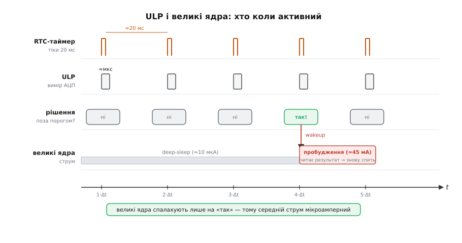

# ⚙️ Програма для ULP: виміряти, порівняти з порогом і не будити ядра

Робоча програма, яку заливають у [ULP-співпроцесор](topic:hw-arch/ulp-coprocessor) — крихітне ядро, що чергує в RTC-домені, поки великі ядра сплять. Зібрана з канонічного прикладу ESP-IDF; нижче — обидві половини прошивки й де там пастка.

## Задача

Поки обидва великих ядра ESP32-S2/S3 перебувають у deep-sleep — а разом із ними вимкнено весь Wi-Fi/Bluetooth-тракт (це один із [режимів сну](topic:hw-arch/sleep-modes)) — хтось мусить регулярно читати давач, порівнювати значення з порогом і будити систему лише тоді, коли поріг перевищено. Будити ядра щоразу на кожен вимір — дорого: одне пробудження коштує кількох десятків мілісекунд ініціалізації й десятки міліампер струму; якщо вимір потрібен кожні 20 мс, це вже не сон, а безперервна робота.

Вимір замість великих ядер виконує ULP-співпроцесор (англ. *ultra-low-power coprocessor*): він лишається живим у deep-sleep і є одним із [джерел пробудження](topic:hw-arch/wakeup-sources). Нижче — саме його програма, а не теорія сну: як виглядає така прошивка і де в ній пастка.

---

> 🔧 **Навіщо це — і для якого чіпа**
>
> На класичному ESP32 (Xtensa) ULP — це скінченний автомат (FSM, finite-state machine), програмований власним асемблером або макро-DSL (`ulp_insn_t`), без жодного C. Повноцінний C на ULP з'явився лише на **ESP32-S2 та ESP32-S3**: там вбудоване окреме ядро ULP-RISC-V (ULP-RISC-V coprocessor), яке виконує скомпільований C-код. Тому весь код нижче — виключно для ESP32-S2/S3. Якщо у вас класичний ESP32 — шукайте розділ `ulp` з FSM-прикладами, не цей.

---

## Ідея

Прошивка складається з двох половин, що живуть у цілком різних світах.

Перша — маленька програма ULP (компілюється окремим RISC-V-тулчейном, лягає в RTC slow memory). Її будить апаратний RTC-таймер раз на задані 20 мс: ULP прокидається, читає АЦП, порівнює сире значення з порогом і або піднімає сигнал пробудження для великих ядер, або просто повертається з `main()` — і засинає до наступного тіку. Жодного `while(1)`.

Друга — звичайна програма на головному ядрі (`app_main`). При холодному старті вона конфігурує АЦП під ULP, заливає і запускає ULP-прошивку, налаштовує RTC-таймер і сама іде в deep-sleep. Якщо ULP її розбудить — вона прочитає збережений результат виміру і знову засне.

Ключова асиметрія тут принципова: рішення «будити чи ні» ухвалює сам ULP — ще до того, як великі ядра ввімкнуться. Якщо поріг не перевищено, ядра навіть не дізнаються, що відбувся вимір. Саме в цій асиметрії вся економія. Почнімо з половини ULP — у ній суть.



*ULP прокидається за тіком RTC-таймера, робить один вимір і гасне; великі ядра вмикаються лише коли вимір перейшов поріг. Майже весь час система спить — тому середній струм мікроамперний.*

---

## Програма ULP (співпроцесорна половина)

Це окремий `main()`, що його виконує ядро ULP-RISC-V; воно стартує кожного разу, коли RTC-таймер клацає чергові 20 мс. Тіло функції коротке — один вимір за виклик — бо ніякої циклічності тут немає: циклічність забезпечує сам апаратний таймер.

**`ulp/main.c` — програма ULP-RISC-V (ESP32-S2/S3)**

```c
#include <stdint.h>
#include "ulp_riscv_utils.h"
#include "ulp_riscv_adc_ulp_core.h"

/* АЦП-канал і поріг — підганяємо під свій давач */
#define EXAMPLE_ADC_UNIT    ADC_UNIT_1
#define EXAMPLE_ADC_CHANNEL ADC_CHANNEL_0
/* 2000 — сирий код АЦП; при atten 12 dB і ADC_BITWIDTH_DEFAULT
   це приблизно 1.75 В (як у канонічному прикладі ESP-IDF).     */
#define EXAMPLE_ADC_THRESHOLD 2000

/* Глобальні змінні, доступні головному ядру через префікс ulp_:
   ulp_adc_threshold і ulp_wakeup_result                        */
uint32_t adc_threshold = EXAMPLE_ADC_THRESHOLD;
int32_t  wakeup_result = 0;

int main(void)
{
    /* Читаємо АЦП у RTC-домені (не esp_adc — той у high-power домені). */
    int32_t v = ulp_riscv_adc_read_channel(EXAMPLE_ADC_UNIT, EXAMPLE_ADC_CHANNEL);

    if (v > (int32_t)adc_threshold) {
        wakeup_result = v;
        ulp_riscv_wakeup_main_processor(); /* піднімаємо сигнал пробудження */
    }

    return 0;
    /* Після return 0: ulp_riscv_halt() викликається АВТОМАТИЧНО —
       ULP паркується до наступного тіку RTC-таймера.
       Ставити while(1) або явний halt тут не потрібно і шкідливо. */
}
```

Тут немає ні `while(1)`, ні `delay()` — на відміну від наївного уявлення про «нескінченний цикл мікроконтролера». Період задає апаратний RTC-таймер на боці головного ядра (`ulp_set_wakeup_period`), а ULP лише виконує один вимір і гасне. Саме в цьому економія: ядро ULP активне мікросекунди за тік, а не весь інтервал між вимірами.

Читання АЦП іде через спеціальну функцію `ulp_riscv_adc_read_channel` — не через звичайний `esp_adc`, який живе у high-power домені й недоступний під час сну. Сам АЦП теж належить RTC-домену — це SAR-АЦП (англ. *successive-approximation register* — регістр послідовного наближення), і конфігурують його заздалегідь, ще на боці великого ядра.

---

## Програма головного ядра (як залити, запустити й заснути)

ULP сам себе не завантажує — це робить велике ядро один раз, при холодному старті. При пробудженні від ULP велике ядро лише читає результат і знову засинає.

**`ulp_riscv_adc_example_main.c` — ініціалізація та режим сну**

```c
#include "esp_sleep.h"
#include "ulp_riscv.h"
#include "ulp_adc.h"
#include "ulp_main.h"   /* згенерований заголовок: оголошує ulp_adc_threshold,
                           ulp_wakeup_result і т. д.                         */

/* Символи бінарника ULP — лінкер підставляє автоматично */
extern const uint8_t ulp_main_bin_start[] asm("_binary_ulp_main_bin_start");
extern const uint8_t ulp_main_bin_end[]   asm("_binary_ulp_main_bin_end");

static void init_ulp_program(void);

void app_main(void)
{
    /* Дізнаємось, чому прокинулись */
    esp_sleep_wakeup_cause_t causes = esp_sleep_get_wakeup_causes();

    if (!(causes & BIT(ESP_SLEEP_WAKEUP_ULP))) {
        /* Перший старт або пробудження НЕ від ULP — заливаємо й запускаємо ULP */
        init_ulp_program();
    } else {
        /* ULP розбудив нас: є значення вище порогу */
        printf("ULP wakeup! value=%ld threshold=%lu\n",
               (long)ulp_wakeup_result, (unsigned long)ulp_adc_threshold);
    }

    /* Тримаємо RTC-периферію живою — інакше АЦП-конфіг загубиться в сні.
       Це типова пастка: без цього рядка ULP читатиме сміття.              */
    ESP_ERROR_CHECK(esp_sleep_pd_config(ESP_PD_DOMAIN_RTC_PERIPH,
                                        ESP_PD_OPTION_ON));
    esp_sleep_enable_ulp_wakeup();
    esp_deep_sleep_start();
}

static void init_ulp_program(void)
{
    /* Конфігуруємо АЦП під ULP-RISC-V */
    ulp_adc_cfg_t cfg = {
        .adc_n   = EXAMPLE_ADC_UNIT,
        .channel = EXAMPLE_ADC_CHANNEL,
        .width   = ADC_BITWIDTH_DEFAULT,
        .atten   = ADC_ATTEN_DB_12,
        .ulp_mode = ADC_ULP_MODE_RISCV,
    };
    ESP_ERROR_CHECK(ulp_adc_init(&cfg));

    /* Заливаємо бінарник ULP у RTC slow memory */
    ESP_ERROR_CHECK(ulp_riscv_load_binary(ulp_main_bin_start,
                        ulp_main_bin_end - ulp_main_bin_start));

    /* Таймер: ULP прокидатиметься кожні 20 000 мкс = 20 мс */
    ulp_set_wakeup_period(0, 20000);

    /* Запускаємо ULP */
    ESP_ERROR_CHECK(ulp_riscv_run());
}
```

Дві половини зв'язує «контракт» через символи з префіксом `ulp_`. Глобальна змінна `adc_threshold` у ULP-коді стає `ulp_adc_threshold` у заголовку `ulp_main.h`, який генерується системою збірки. Так само `wakeup_result` стає `ulp_wakeup_result`. Обидва живуть прямо в RTC slow memory — ніякої шини, ніякого UART чи I²C. Велике ядро читає `ulp_wakeup_result` прямим зверненням до пам'яті, ніби це звичайна глобальна змінна. Це механізм shared-symbol: прямий «канал зв'язку» між ULP і великим ядром через спільну [RTC-пам'ять](topic:hw-arch/rtc-memory), що переживає сон.

---

## Складнощі і пастки

- **Не той чіп.** На класичному ESP32 C-ULP недоступний — лише ULP-FSM (асемблер або макро-DSL `ulp_insn_t`). C на ULP = лише ESP32-S2/S3 (RISC-V). Найчастіша плутанина при пошуку прикладів.

- **RTC-домен живлення.** Рядок `esp_sleep_pd_config(ESP_PD_DOMAIN_RTC_PERIPH, ESP_PD_OPTION_ON)` є обов'язковим. Якщо його пропустити, у deep-sleep вимикається SAR-ADC-конфіг і ULP читатиме сміттєві значення. Граблі тихі — компілятор не попереджає.

- **ULP бачить не всі піни й периферію.** Доступні лише RTC-здатні GPIO і периферія RTC-домену: RTC_IO, RTC_CNTL, SAR ADC. Звичайні драйвери `esp_adc`, `gpio` — ті, що живуть у high-power домені — в ULP недоступні. Використовуйте тільки `ulp_riscv_*`-функції.

- **RTC-пам'ять мала.** Код і дані ULP мусять вміститися в зарезервований блок RTC slow memory (`CONFIG_ULP_COPROC_RESERVE_MEM`). ULP розрахований на крихітну логіку «зміряв → порівняв» — великий алгоритм туди не запхати.

- **Період — це струм.** Менший `ulp_set_wakeup_period` → частіші виміри → вищий середній струм. Як саме це рахується — [цикл і середній струм](root:embedded/duty-cycle-current).

- **Поріг у сирих кодах, не у вольтах.** Порівнюємо raw-код АЦП; перерахунок у вольти залежить від обраного atten і ширини: 2000 при `ADC_ATTEN_DB_12` ≈ 1.75 В, але при іншому atten це вже інші вольти. Якщо потрібно точно — рахуйте на боці великого ядра після пробудження.

- **`halt` сам.** Не ставте `while(1)` із ручним сном у ULP-коді. Повернення з `main()` автоматично викликає `ulp_riscv_halt()` і паркує ULP до наступного тіку RTC-таймера. Зайвий цикл лише марно витрачатиме струм.

---

## Підсумок

Вся програма ULP зводиться до трьох кроків: прочитав АЦП → порівняв із порогом → можливо, розбудив. На це йдуть мікросекунди за тік; великі ядра вмикаються лише тоді, коли є реальний привід. Ось чому такий вартовий коштує мікроампери, а не міліампери.

Як саме ці мікроампери складаються в дні автономної роботи від батареї — показують [цикл і середній струм](root:embedded/duty-cycle-current) і [бюджет батареї](topic:hw-power/battery-budget).
