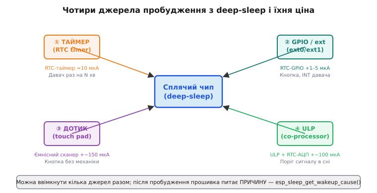
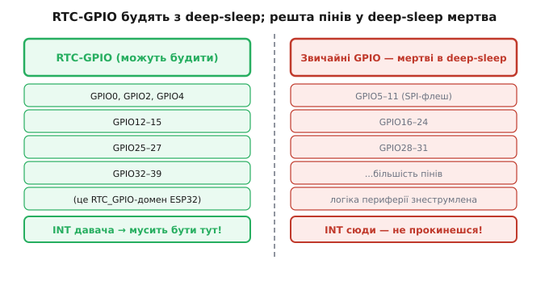

# Джерела пробудження

Сон без здатності прокинутися — це смерть, а не сон. Пристрій, що заснув глибоко й не вміє відгукнутися на потрібну подію, з погляду користувача просто зламався. Тому в [глибокому сні](topic:hw-arch/sleep-modes) завжди лишається ввімкненим бодай маленький сторож, який стежить за однією-єдиною умовою й будить велике ядро, щойно вона настане. Цей сторож і є джерело пробудження. У нього є ціна: щось мусить лишатися живим уві сні, а живе — споживає струм. Вибір джерела пробудження — це насправді вибір, що саме тримати ввімкненим, поки решта чипа знеструмлена.

ESP32 дає чотири такі сторожі, і вони впорядковані за зростанням і ціни, і вміння: таймер, зовнішня ніжка (GPIO), ємнісний дотик і крихітний співпроцесор ULP. Розгляньмо кожен з механізмом — що він тримає живим, у скільки це обходиться і коли він доречний.

**Таймер (RTC timer)** відповідає на найпростішу умову: «розбуди через N мікросекунд». Це найдешевший і найпередбачуваніший варіант. Живим лишається тільки [RTC-домен, що веде відлік часу уві сні](topic:hw-arch/rtc); сам лічильник додає до споживання дрібку, тож струм у такому сні впирається в підлогу самого deep-sleep — близько 10 мкА на ESP32, практично стільки ж, скільки чип їв би й без жодного будильника. На таймері стоїть будь-який давач із рідкісним семплуванням: прокинутися раз на хвилину, зняти показ, заснути. Період задають у мікросекундах, тож «раз на 15 хвилин» — це просто число `15 × 60 × 1000000`.

**Зовнішнє пробудження по ніжці (ext0 / ext1)** відповідає на умову «розбуди, коли ніжка змінить рівень». Це сторож для кнопки або для INT-виходу зовнішнього давача, що [сам сигналізує про подію перериванням](topic:hw-arch/interrupts) — акселерометр відчув удар, давач руху побачив рух. Тут два механізми з однаковою метою, але різною кухнею. **ext0** (external 0) стежить за **однією** ніжкою і працює крізь блок RTC_IO, тож вимагає тримати ввімкненим домен RTC-периферії. **ext1** (external 1) стежить за **маскою кількох** ніжок і реалізований простішим контролером RTC_CNTL, який живе й тоді, коли RTC-периферію знеструмлено, — тому ext1 у глибокому сні виходить ощадливішим. Умов у ext1 рівно дві, і їх легко переплутати: `ESP_EXT1_WAKEUP_ANY_HIGH` будить, коли **будь-яка** з обраних ніжок стала високою, а `ESP_EXT1_WAKEUP_ALL_LOW` — коли **всі** обрані стали низькими. Ціна обох — тримати живим RTC-GPIO: кілька мікроампер понад підлогу сну.

**Дотик (touch pad)** перетворює металеву площадку на ніжці у кнопку без жодної механіки: ємність площадки змінюється, коли її торкається палець, і чип будиться на цю зміну. Виграш не лише в зручності, а й у надійності — механічна кнопка зношується й деренчить контактами, а площадка на платі не має чого зношувати. Платять за це струмом: щоб ловити дотик уві сні, RTC мусить періодично сканувати ємність, і це найдорожчий зі звичайних сторожів. У типовій конфігурації пробудження дотиком коштує близько 150 мкА (даташит), а наївне налаштування легко дає й 300 з гаком; тонким підбором періоду й тривалості сканування струм опускають до десятка мікроампер, але задарма дотик не дається ніколи.

**ULP (ultra-low-power co-processor — «наднизькоспоживчий співпроцесор»)** — це не пасивний сторож, а програмований. Крихітний [процесор у RTC-домені](topic:hw-arch/ulp-coprocessor) сам прокидається за власним таймером, **щось вимірює** — читає АЦП, опитує ніжку, рахує — і вже **сам вирішує**, будити велике ядро чи знову заснути. Він найрозумніший і найгнучкіший: дозволяє відсіювати дрібні події прямо уві сні, не піднімаючи дорогі ядра на кожен поріг. Платня — складність програмування (ULP має власну вузьку систему команд) і струм у середньому близько 100 мкА, коли він періодично щось міряє.



*Карта чотирьох сторожів навколо сплячого ядра: таймер, GPIO/ext, дотик, ULP — із позначкою, що кожен тримає живим, і доданим струмом. Критерій вибору один: найдешевший сторож, що закриває задачу.*

> 🔧 **Навіщо це.** Джерело пробудження — це те, що ти свідомо лишаєш увімкненим уві сні, тож бери найдешевше, що закриває задачу. Для рідкісного давача вистачить таймера; для реакції на зовнішню подію — ніжки; піднімати ядро на кожен дрібний поріг сигналу марно, тут заробляє ULP. Кожен зайвий ввімкнений сторож — це доданок до струму спокою, помножений на місяці автономної роботи.

## Будити вміють не всі ніжки

Тут чатує пастка, яку легко проґавити аж до моменту, коли готова плата відмовляється прокидатися. У deep-sleep **здатність будити зберігають лише RTC-GPIO** — підмножина ніжок, заведених у низькоспоживчий RTC-домен. Звичайні GPIO в deep-sleep мертві: логіку їхньої периферії знеструмлено разом з рештою чипа, і жодну зміну рівня на них ніхто не побачить. На класичному ESP32 RTC-здатні рівно ці номери: GPIO 0, 2, 4, 12–15, 25–27 і 32–39 — більше жодного.



*Ліворуч — RTC-GPIO, спроможні будити з deep-sleep; праворуч — звичайні GPIO, у deep-sleep мертві. Пастка розведення плати: якщо INT-вихід давача потрапить на не-RTC-ніжку, чип просто не прокинеться на подію, і знайдеться це вже на готовому виробі.*

> 🔧 **Навіщо це.** Список RTC-ніжок треба тримати перед очима ще на етапі розведення плати, а не прошивки. Кнопку живлення й INT-виходи давачів, які мають піднімати чип зі сну, заводять лише на RTC-здатні номери; помилка тут не лагодиться кодом — лише перепайкою або новою ревізією плати.

## Кілька сторожів одночасно і причина пробудження

Сторожі не виключають один одного: у deep-sleep можна ввімкнути кілька джерел разом. Таймер і кнопка — і чип прокинеться від того, що настане раніше: або сплив період, або хтось натиснув. Це звичайний патерн «прокидайся за розкладом, але дай користувачу втрутитися будь-коли».

Поєднання, проте, мають межі, які диктує живлення RTC-периферії. На ESP32 **ext0 несумісний із дотиком і з ULP**: ext0 тримає домен RTC-периферії ввімкненим у конкретному режимі, а дотик і ULP вимагають його по-своєму, і одночасно це не вживається. Якщо потрібні кнопка плюс ULP, для кнопки беруть ext1 (він іде крізь інший контролер) — і конфлікту немає.

Після пробудження прошивка стартує і насамперед питає, **чому** її підняли, — через `esp_sleep_get_wakeup_cause()`. Це той самий патерн «звідки я взявся», що й при [розрізненні причин скидання](topic:hw-arch/reset-causes): один вхід у програму, а далі гілки залежно від події. Розрізнивши причину, прошивка робить різне: за таймером — тихо знімає черговий вимір; за кнопкою — вмикає екран і чекає на людину; за дотиком — будить інтерфейс. Без цього розрізнення пристрій після кожного сну поводився б однаково й не знав би, реагувати на розклад чи на людину.

## Worked-приклад. Кнопка АБО таймер, з розрізненням причини

**Умова.** Давач має прокидатися раз на 15 хвилин для планового виміру, але користувач має змогу будь-коли підняти його кнопкою. Кнопка заведена на GPIO 36 (RTC-здатний), притискає лінію в нуль; обидва джерела вмикаємо разом, а після старту обираємо гілку за причиною пробудження.

:::tabs
```c
#include "esp_sleep.h"
#include "driver/gpio.h"

#define WAKE_GPIO     GPIO_NUM_36          // мусить бути RTC-здатною ніжкою!
#define SLEEP_MINUTES 15
#define US_PER_MIN    60000000ULL          // мікросекунд у хвилині

void app_main(void) {
    // 1. Чому нас підняли?
    switch (esp_sleep_get_wakeup_cause()) {
        case ESP_SLEEP_WAKEUP_TIMER:        // сплив період
            handle_periodic_measurement();
            break;
        case ESP_SLEEP_WAKEUP_EXT0:         // натиснули кнопку
            handle_button_press();
            break;
        default:                            // перше холодне ввімкнення
            cold_start_init();
            break;
    }

    // 2. Вмикаємо ОБИДВА сторожі перед сном.
    esp_sleep_enable_timer_wakeup(SLEEP_MINUTES * US_PER_MIN);
    esp_sleep_enable_ext0_wakeup(WAKE_GPIO, 0);   // рівень 0 (LOW) будить

    // 3. У глибокий сон — прокинемося від того, що настане раніше.
    esp_deep_sleep_start();
    // Рядки нижче не виконуються: deep-sleep перезапускає чип з app_main().
}
```
```micropython
import machine
import esp32
from machine import Pin

WAKE_GPIO     = 36            # мусить бути RTC-здатною ніжкою!
SLEEP_MINUTES = 15
MS_PER_MIN    = 60000        # мілісекунд у хвилині

# 1. Чому нас підняли?
cause = machine.wake_reason()
if cause == machine.TIMER_WAKE:          # сплив період
    handle_periodic_measurement()
elif cause == machine.EXT0_WAKE:         # натиснули кнопку
    handle_button_press()
else:                                    # перше холодне ввімкнення
    cold_start_init()

# 2. Вмикаємо ОБИДВА сторожі перед сном.
#    ext0 будить рівнем 0 (LOW) на RTC-ніжці.
esp32.wake_on_ext0(pin=Pin(WAKE_GPIO), level=esp32.WAKEUP_ALL_LOW)

# 3. У глибокий сон — таймер задають самим викликом deepsleep(ms);
#    прокинемося від того, що настане раніше.
machine.deepsleep(SLEEP_MINUTES * MS_PER_MIN)
# Рядки нижче не виконуються: deep-sleep перезапускає чип з початку.
```
:::

Два рядки налаштування — і пристрій реагує і на розклад, і на людину; гілку коду обирає причина пробудження, прочитана першою ж дією. Варто додати ще третій сторож — наприклад, акселерометр на ext1 для пробудження від руху, — і логіка масштабується тим самим патерном: увімкнути джерело, додати гілку в `switch`. А коли треба не просто прокидатися дешево, а взагалі **знеструмити чип у нуль** і будити його ззовні, на сцену виходять [зовнішні залізні будильники](topic:hw-arch/wakeup-sources/comp-wake-hw.md) — окремий клас схемних рішень поза самим чипом.
