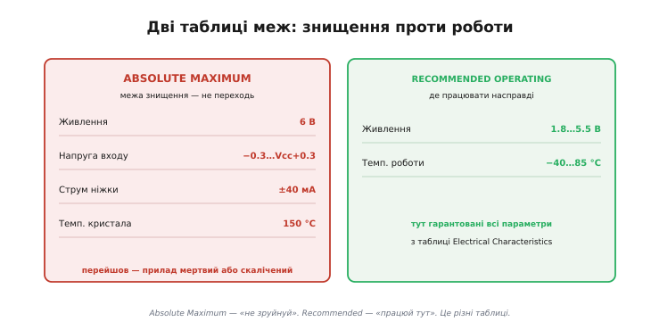
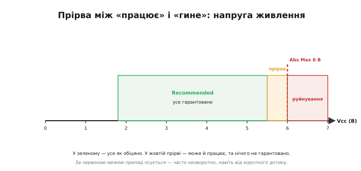
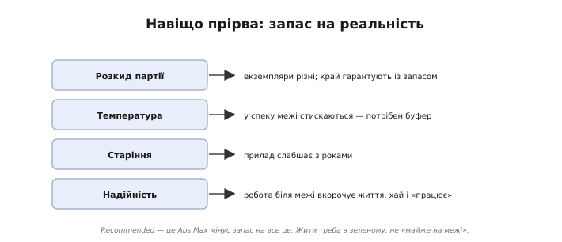
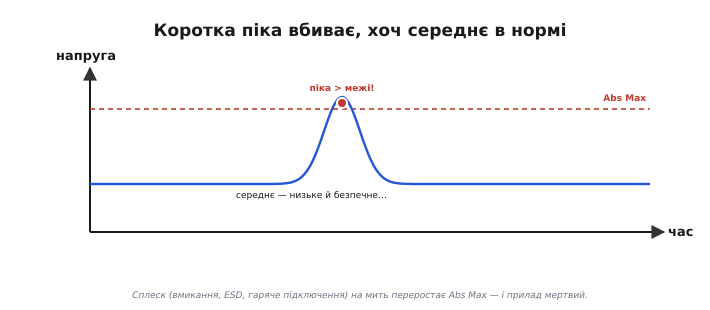
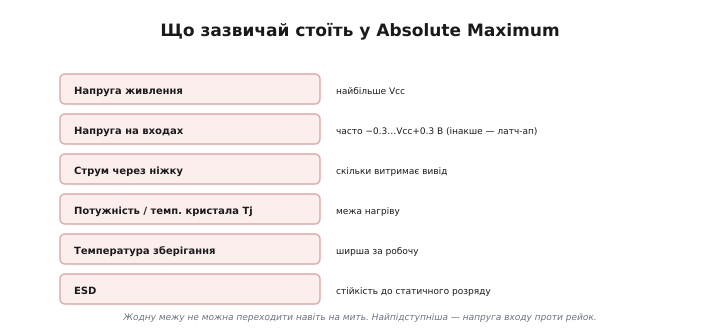
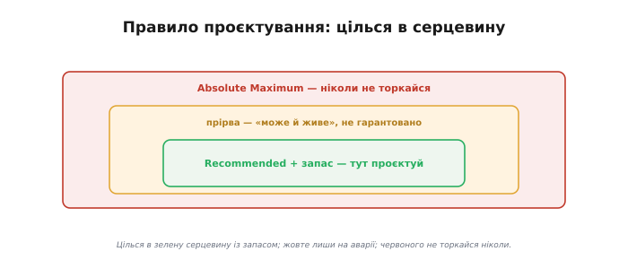

# Граничні режими

У кожному даташиті є дві таблиці меж, схожі на вигляд і легко плутані — а наслідки плутанини фатальні. Одна зветься **Absolute Maximum Ratings** *(англ. absolute — «безумовний, граничний»)*, друга — **Recommended Operating Conditions** *(англ. recommended — «рекомендований»)*. Перша каже, де прилад **гине**; друга — де він **працює**. Між ними навмисне лишено зазор, і розуміти, що це за зазор і чому жити треба в меншій із двох, — одне з найважливіших умінь читання даташита.

### Дві таблиці — два протилежні сенси

Ці дві таблиці кажуть **різні** речі, і їх ніяк не можна сплутати.


*Absolute Maximum — «червона риса знищення»: за нею прилад руйнується або непомітно калічиться. Recommended Operating — «робочий діапазон»: лише тут виробник гарантує всі параметри з таблиці Electrical Characteristics. Це дві окремі таблиці з протилежним призначенням.*

**Absolute Maximum Ratings** — це не робочі значення, а **межі виживання**. Вони кажуть: «ось ця напруга, цей струм, ця температура — крайня риса; перейдеш її — прилад може зруйнуватися або непомітно деградувати». Працювати **на** цих межах не можна й не передбачено — це **стрес-рейтинг**, а не режим роботи. Часто прямо під таблицею стоїть холодна примітка: «перевищення абсолютних максимумів може спричинити незворотне пошкодження; це лише межа стресу, а не гарантія працездатності». Слово «стрес-рейтинг» тут не випадкове. Виробник **випробовує** прилад на цих межах як на стрес-тесті — перевіряє, що той їх **переживе**, — але **не** обіцяє, що на них він **працюватиме** як слід. Тож абсолютний максимум — це «витримає, не розсиплеться», а не «функціонуватиме за паспортом». І ще практичне: перейшов абсолютний максимум — і жодних претензій до виробника, гарантію знято, бо ти порушив умову, під якою її давали.

**Recommended Operating Conditions** — навпаки, це **робочий простір** приладу: діапазон живлення, температури, напруг, **усередині** якого він поводиться як належить. І головне: усі точні цифри з головної таблиці параметрів (Electrical Characteristics) виробник гарантує **тільки** в цих межах. Вийшов за Recommended — і навіть якщо прилад «працює», його параметри вже ніхто не обіцяє.

Тримайте різницю чітко: Absolute Maximum — «**не зруйнуй**», Recommended Operating — «**працюй тут**».

З цих двох таблиць виходять і дві геть різні біди, які теж не можна плутати. Вийти за **Recommended** (але лишитися під Absolute Maximum) — це не смерть, а **втрата гарантій**: прилад живий, та його параметри вже «попливли» — він може стати повільнішим, шумнішим чи менш точним, ніж обіцяно. А перейти **Absolute Maximum** — це вже **пошкодження**: прилад або гине одразу, або тихо калічиться (працює, але з прихованою вадою, що виявиться згодом). Перше — «не за паспортом», друге — «зламано». Тому й таблиці дві: одна відповідає на питання «чого боятися, щоб не спалити?», друга — «де прилад поводиться як у даташиті?». Сплутати їх — однаково що сплутати «швидкість, на якій машина не розвалиться» зі «швидкістю, на яку її розраховано».

### Прірва між ними

Найважливіше тут — **зазор** між цими таблицями. Він не випадковий: виробник лишає його навмисне. Скажімо, абсолютний максимум живлення — 6 В, а рекомендований діапазон — 1.8…5.5 В. Що ж між 5.5 і 6 вольтами?


*Шкала напруги живлення. У зеленій зоні (Recommended) гарантовано все. Жовта смужка між 5.5 і 6 В — «прірва»: прилад там, найпевніше, ще живе, але жодних гарантій уже нема. Червона риса 6 В — абсолютний максимум, за нею — руйнування, часто незворотне навіть від короткого дотику.*

Це «нічийна земля». У зеленій зоні прилад працює **й** усе гарантовано. У жовтій прірві він, скоріш за все, ще функціонує — але параметри вже не обіцяні, а надійність потерпає. За червоною рискою — псування. Тому правильне читання таке: **Recommended — це де жити, Absolute Maximum — це чого не торкатися ніколи, а простір між ними — не «бонусний запас для роботи», а буфер, у який залазити не варто**.

Класичний приклад ціни помилки — узяти 3.3-вольтовий чип і подати на нього 5 В. П'ять вольтів далеко за його абсолютним максимумом — і чип гине тієї ж миті, як з'явиться живлення, ще до першого рядка коду. Або тонша пастка: подати сигнал на вхід чипа, поки той **ще не запитаний**, — вхід опиняється «вище» за нульову рейку живлення, порушено абсолютний максимум входу, і прилад вигоряє, хоча начебто «нічого ж не вмикали».

### Навіщо ця прірва

Чому ж не зробити рекомендований діапазон до самої межі? Бо зазор — це **запас на реальність**, і причин для нього кілька.


*Зазор закладають на розкид партії (екземпляри різні), на температуру (у спеку межі стискаються), на старіння (прилад слабшає з роками) і на надійність (робота біля краю вкорочує життя, навіть коли «працює»). Recommended — це Absolute Maximum мінус усі ці запаси.*

По-перше, **розкид партії**: жоден екземпляр не точно такий, як у даташиті, тож межі гарантують із запасом на найгірший. По-друге, **температура**: багато меж стискаються в спеку чи на морозі, і рекомендований діапазон лишає буфер на це. По-третє, **старіння**: прилад поступово деградує, і запас продовжує йому життя. По-четверте, **надійність**: навіть якщо біля самої межі прилад «працює», постійна робота там вкорочує його вік — мов двигун, що весь час реве на червоній зоні тахометра. Recommended Operating — це і є Absolute Maximum, з якого виробник чесно відняв усі ці запаси й сказав: «отут — безпечно».

Особливо це стосується **температури**. Чимало абсолютних максимумів даються при кімнатних 25 °C, а в спеку безпечна межа **знижується** — наприклад, допустима потужність падає з нагрівом корпусу. Цю залежність виробник показує окремими [графіками дератингу](topic:hw-components/datasheet-graphs), і рекомендований діапазон уже враховує запас на неї. Тому межу не читають як одне число на всі умови: вона сама залежить від того, як гаряче приладу.

Зверніть увагу, що той буфер не такий і великий: між рекомендованими 5.5 і граничними 6 В лишається пів-вольта. Ці пів-вольта легко «з'їдають» реальні дрібниці — пульсації блока живлення, викид при ввімкненні сусіднього вузла, наводка по дроту. Ось чому жити **на** 5.5 В небезпечно: будь-яке таке брижіння вже штовхне напругу за межу. Проєктувати треба з власним запасом **нижче**, лишивши буфер недоторканим — він на непередбачене, а не на щодень.

**Скільки лишити на струм через вивід.** Абсолютний максимум струму ніжки — ±40 мА, рекомендований максимум витоку — 20 мА, а зважений вибір — недовантажити вивід відсотків на 70 % від уже рекомендованого, щоб витримати розкид і нагрів. У прошивці це означає рахувати струм світлодіода, перш ніж вішати його прямо на ніжку:

```c
// LED від GPIO 3.3 В через послідовний резистор
const float V_io   = 3.3f;    // напруга на виводі, В
const float V_led  = 2.0f;    // падіння на червоному світлодіоді, В
const float R      = 220.0f;  // послідовний резистор, Ом

float I = (V_io - V_led) / R;        // = 1.3 / 220
//        I ≈ 0.0059 А = 5.9 мА

// перевірка проти меж виводу:
//   Absolute Maximum ніжки = 40 мА  → 5.9 мА під нею з величезним запасом
//   Recommended (типово)   = 20 мА  → 5.9 мА = лише 30 % від рекомендованого
// висновок: 220 Ом безпечні; навіть 150 Ом (≈8.7 мА) лишаються в зеленій зоні.
```

Якби резистор поставили на 47 Ом, струм підскочив би до (3.3 − 2.0) / 47 ≈ 27.7 мА — уже **за** рекомендованими 20 мА, у жовтій прірві перед абсолютним максимумом. Прилад би «світив», та вивід працював би на знос. Тому й рахують струм заздалегідь, а не підбирають резистор «на око».

### Підступ перехідних процесів

Найпідступніша пастка абсолютних максимумів — у тому, що їх не можна переходити **навіть на мить**, а порушення часто стається саме на коротку мить, у перехідному процесі, якого на перший погляд і не видно.


*Сигнал переважно низький і безпечний, але один короткий сплеск переростає Absolute Maximum — і цього досить, щоб прилад загинув, хоча решту часу все гаразд. Абсолютний максимум стосується миттєвих значень, а не середніх.*

Звідки беруться такі піки? З **увімкнення** (кидок струму чи напруги в перші мілісекунди), із **гарячого підключення** (під'єднав роз'єм під напругою — стрибок), з **індуктивних викидів** (вимкнув котушку — сплеск), з **електростатичного розряду** (торкнувся пальцем — тисячі вольтів на мить). Усе це може на коротку мить вискочити за абсолютний максимум — і вбити прилад, хоча вимірюване середнє лишається в нормі. Саме тому в схемах ставлять обмежувальні діоди, послідовні резистори, плавний пуск і захист від ESD: вони зрізають оці невидимі піки, не даючи їм дістати до руйнівної межі. Кожному типу піків — свій захист: від ESD і перенапруги на вході рятують [обмежувальні діоди до рейок чи супресор (TVS)](root:embedded/zener-schottky), від кидка ввімкнення — плавний пуск, від [індуктивного викиду — гасний діод](root:embedded/flyback-protection). Спільна ідея одна: зрізати пік, **перш ніж** він дістане абсолютного максимуму.

### Що зазвичай стоїть у Absolute Maximum

Які саме межі перелічує ця таблиця? Набір типовий і його варто знати в обличчя.


*Звичні рядки: максимальне живлення; напруга на входах (часто −0.3…Vcc+0.3 В); струм через ніжку; розсіювана потужність і температура кристала; температура зберігання (ширша за робочу); стійкість до ESD.*

Окремо виділимо найпідступніший рядок — **напругу на входах**. Її майже завжди обмежують відносно **рейок живлення**: типово «не нижче −0.3 В і не вище Vcc+0.3 В». Причина в тому, що всередині кожного входу є захисні діоди до рейок; заженеш вхід надто далеко за рейку — і крізь них потече струм, аж до небезпечного явища **латч-апу** *(англ. latch-up — «защіпання, замикання на засув»)*, коли мікросхема «замикається» сама на себе й вигоряє. Звідси важливе наслідкове правило: **сигнал на вході не повинен з'являтися раніше за живлення** (інакше вхід «вище» за ще нульову рейку) і не повинен перевищувати її. Це часта причина загадкових смертей: подали сигнал на незапитаний чип — і спалили його, нічого начебто не порушивши.

Ще один рядок вартий уваги — **температура кристала** (Tj). Це не та температура, що ви міряєте пальцем на корпусі, а внутрішня, на самому кремнієвому кристалі, — і саме вона має лишатися під межею (зазвичай 125 або 150 °C). Прилад може здаватися лише теплим зовні, а кристал усередині вже на межі: адже тепло від кристала до корпусу й повітря тече крізь [тепловий опір](topic:ph-thermodynamics/thermal-resistance). Тому для потужних приладів Tj рахують окремо, а не «на дотик».

А рядок **ESD** каже, який статичний розряд прилад витримає, перш ніж пробитися (його міряють за стандартними моделями — розряд від пальця, від машини). Саме тому чутливі чипи возять в антистатичних пакетах і паяють на заземленому килимку: один необачний дотик сухого пальця — і кілька тисяч вольтів на коротку мить, а це теж порушений абсолютний максимум.

### Правило: цілься в серцевину

Усе це зводиться до одного інженерного правила.


*Три зони. Зелена серцевина (Recommended із запасом) — тут проєктують. Жовта прірва — лишають хіба на короткі аварійні викиди. Червоного (Absolute Maximum) не торкаються ніколи.*

Цілься в **зелену серцевину** — рекомендований діапазон, ще й із власним запасом. Жовту прірву лиши на непередбачене (короткий аварійний викид, який схема має пережити). А червоної межі не торкайся **ніколи**, навіть на мить — і подбай, щоб її не торкнулися перехідні піки. Хто проєктує посередині зеленої зони, той робить надійні прилади; хто тулиться до краю заради «ну воно ж працює» — той ремонтує їх потім у полі. Загальне правило надійності просте: тримай робочі величини на рівні десь **70–80 %** від гранично допустимих, а не впритул до них. Цей свідомий недовантаж *(англ. derating — «зниження від номіналу»)* — те, що відрізняє прилад, який працює роками, від того, що відмовляє за місяць.

На практиці це зводиться до двох перевірок для кожного виводу. Спершу — Absolute Maximum: переконайся, що його не зачепиш **ні** в роботі, **ні** в перехідних піках (а як треба — додай захист). Потім — Recommended Operating: тримай робочу точку **всередині** нього, ще й із запасом. Дві таблиці — два питання: «не вб'ю?» і «гарантовано?». Звичка ставити їх обидва, перш ніж паяти, рятує і прилади, і нерви.

> 🔧 **Навіщо це.** Дві таблиці меж — це перше, куди заглядають, узявши компонент. **Absolute Maximum** — священна межа знищення: не переходь її ніколи, надто пильнуй короткі піки (вмикання, ESD, гаряче підключення), бо вона про **миттєві** значення. **Recommended Operating** — твій робочий простір, і лише там гарантовано всі параметри; проєктуй усередині нього, ще й із запасом. А прірву між ними не сприймай як «дозволений бонус»: це буфер на розкид, спеку й старіння, у який залазити не варто. Найчастіша причина «незрозуміло чому згорів» — порушений абсолютний максимум, якого ніхто не помітив.

### Межа — це ще не вся правда даташита

Дві таблиці меж окреслюють, де приладу жити, а де гинути. Та навіть усередині рекомендованого діапазону параметри — не одне тверде число: точні характеристики виробник дає трійцею [min / typ / max з умовами вимірювання](topic:hw-components/min-typ-max), де «typ» якраз нікому не гарантують. Межі кажуть, чого не можна; гарантовані колонки кажуть, на що можна розраховувати, — і читати компонент означає тримати в голові обидві відповіді разом.
