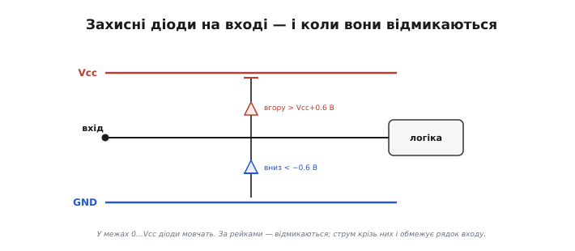
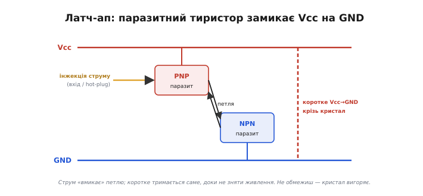
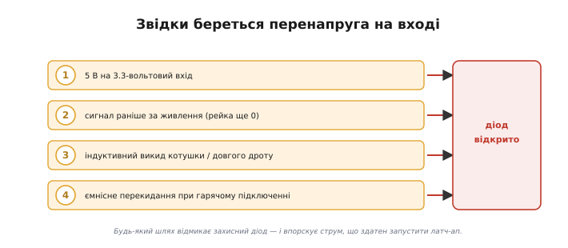
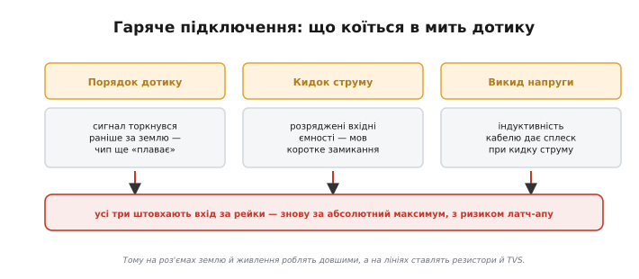

# 🔌 Absolute Maximum на практиці: латч-ап, перенапруга на вході, гаряче підключення

> Абсолютний максимум *(absolute maximum)* у [таблиці datasheet](topic:hw-components/abs-max-ratings) — це червона риска знищення, яку не можна переходити навіть на мить. Торкнутися її ненароком найлегше трьома способами, і тут ми роздивимось кожен зблизька: що саме відбувається всередині чипа при **латч-апі** *(latch-up)*, чому **перенапруга на вході** *(input overvoltage)* вбиває навіть короткою голкою і чим небезпечне **гаряче підключення** *(hot-plug)*. Бо «згорів незрозуміло чому» — це майже завжди один із цих трьох, і впізнавати їх треба з першого погляду.

### Спільний винуватець — захисні діоди на вході

Щоб зрозуміти всі три відмови одразу, треба зазирнути всередину будь-якого цифрового входу. На кожній вхідній (та й вихідній) ніжці сучасного чипа сидить пара **захисних діодів** *(ESD clamp diodes)*: один — від ніжки до додатної рейки живлення (Vcc), другий — від ніжки до землі (GND). У нормальній роботі, коли напруга на вході лежить між 0 і Vcc, обидва діоди зворотно зміщені й мовчать — ніби їх і нема. Вони чекають аварії.

*На кожному вході — два діоди-обмежувачі: до Vcc і до GND. Поки сигнал у межах рейок (0…Vcc), вони зворотно зміщені й мовчать. Підскочив вхід вище Vcc+0.6 В — відкривається верхній; упав нижче −0.6 В — нижній. Тоді через ніжку рине струм, і саме його обмежує рядок «напруга на входах −0.3…Vcc+0.3 В» в Absolute Maximum.*

Сенс цих діодів — рятувати тонкий підзатворний оксид транзисторів від статики: коли приходить розряд, діод відмикається й зливає удар у рейку, не давши напрузі дорости до пробою. Але та сама конструкція породжує **правило входу** з таблиці Absolute Maximum: «напруга на входах не нижче −0.3 В і не вище Vcc+0.3 В». Ці 0.3 В — це майже поріг відмикання діода: поки не перейшли його, діод закритий і струму нема; перейшли — він відкрився, і крізь ніжку **потече струм**. Сам по собі діод короткий імпульс пережив би, та біда в тім, що цей струм може запустити куди гіршу річ.

### Латч-ап: чип замикається сам на себе

Найпідступніша з трьох відмов — **латч-ап**. Усередині кожної КМОН-мікросхеми *(CMOS)* поряд лежать транзистори n- і p-типу, а в кремнієвій підкладці між ними мимоволі утворюються два **паразитні** [біполярні транзистори](topic:hw-components/bjt-structure), з'єднані так, що творять **тиристорну** структуру — приховану петлю додатного зворотного зв'язку. У нормі вона спить. Та варто крізь захисний діод (або іншим шляхом) впорснути в підкладку струм — і петля може «клацнути»: один паразитний транзистор відмикає другий, той підтримує перший, і структура **замикається сама на себе**.

*Між сусідніми транзисторами в підкладці ховається паразитний тиристор (дві біполярні структури в петлі зворотного зв'язку). Інжектований струм (з перенапруги на вході чи з гарячого підключення) його «вмикає» — і утворюється коротке замикання Vcc на GND просто крізь кристал. Струм тримається сам, доки не зніметься живлення; якщо його не обмежено — кристал вигоряє.*

Наслідок страшний: між Vcc і GND виникає коротке замикання **просто крізь кристал**, і тримається воно **саме**, навіть коли причина вже зникла. Зняти його можна лише одним — **повним вимкненням живлення**. Якщо ж джерело здатне віддати чималий струм, цей внутрішній коротень розжарює кремній за частку секунди, і чип гине з характерною випаленою цяткою. Симптом латч-апу легко впізнати: прилад раптом починає люто гріти, споживання підскакує до межі блока живлення, а скидання сигналом не допомагає — лише висмикнути живлення. Хто хоч раз бачив, як після імпульсу, що прийшов по входу, мікросхема починає пекти палець, той запам'ятовує латч-ап назавжди.

### Перенапруга на вході: сигнал поза рейками

Тепер ясно, чому **перенапруга на вході** така небезпечна. Досить вигнати вхід на якісь пів вольта вище Vcc або нижче GND — і захисний діод відмикається, впорскуючи в підкладку той самий струм, що здатен запустити латч-ап. А способів вигнати вхід за рейки в реальній схемі повно.

*Чотири звичні шляхи вигнати вхід за рейки: 5-вольтовий сигнал на 3.3-вольтовий вхід; сигнал, що приходить, поки чип ще не запитаний (рейка нульова, а на вході вже напруга); індуктивний викид від котушки чи довгого дроту; ємнісне перекидання при гарячому підключенні. Усі вони відмикають захисний діод.*

Перший і найочевидніший — **різні рівні логіки**: подати 5-вольтовий сигнал на вхід 3.3-вольтового чипа. Сигнал «високий» (5 В) опиняється на 1.7 В вище за рейку Vcc=3.3 В — діод відкрито, струм тече весь час, поки лінія висока. Другий, тонший: **сигнал приходить раніше за живлення**. Якщо сусідній вузол запитався першим і вже жене напругу на вхід нашого чипа, поки той ще знеструмлений, то рейка Vcc у нас нульова, а на вході — повні вольти; вхід знову «вище» за рейку, діод відкрито. Звідси практичне правило послідовності: **спершу подай живлення, потім сигнали**. Третій шлях — **[індуктивні викиди](root:embedded/flyback-protection)** і наводки по довгих дротах: вони закидають на вхід коротку голку поза рейками. Простий і надійний захист від усього цього — **послідовний резистор** на вході (кілька кілоом): він не заважає сигналу, але обмежує струм крізь захисний діод до безпечних міліампер, навіть коли діод таки відкрився. А де перенапруга буває велика — додають зовнішній [TVS-діод](topic:hw-components/tvs-diode), що [зрізає удар](root:embedded/zener-schottky), не даючи йому дійти до ніжки.

### Гаряче підключення: стрибки в момент дотику

Третій спосіб торкнутися абсолютного максимуму — **гаряче підключення**: з'єднати роз'єм, кабель чи модуль, коли система **вже під напругою**. На перший погляд безпечно, а насправді в коротку мить дотику контактів коїться відразу кілька неприємностей.

*У мить стику роз'єму під напругою сигнальні контакти можуть торкнутися раніше за землю — і сигнал приходить на ще «плаваючий» щодо системи чип. Розряджені вхідні ємності тягнуть кидок струму, а паразитна індуктивність кабелю дає викид напруги. Усі три ефекти штовхають вхід за рейки.*

Біда перша — **порядок дотику контактів**. Контакти роз'єму ніколи не сходяться ідеально водночас: котрийсь торкнеться на частку мілісекунди раніше. Якщо першим виявиться сигнальний, а не земляний, то сигнал прийде на плату, чия земля ще не з'єднана зі спільною, — і відносно неї вхід легко опиниться поза рейками. Саме тому на якісних роз'ємах (USB — класичний приклад) контакти землі й живлення роблять **довшими**, щоб вони сходилися першими, а сигнальні — останніми; так земля й живлення встигають стати на місце до того, як піде сигнал. Біда друга — **кидок струму** в розряджені вхідні та розв'язувальні ємності новопід'єднаного вузла: у першу мить вони виглядають як коротке замикання й тягнуть різкий сплеск. Біда третя — **викид напруги** від паразитної індуктивності кабелю при цьому кидку струму. Кожен із трьох ефектів окремо й усі разом штовхають напругу на ніжках за рейки — тобто знову за абсолютний максимум, з тим самим ризиком латч-апу. Тому модулі, розраховані на «гаряче» з'єднання, проєктують свідомо: послідовні резистори й TVS на лініях, плавне наростання живлення, а часом і спеціальні мікросхеми *hot-swap*, що вмикають живлення нового вузла керовано, без удару.

> 🔧 **Навіщо це.** Три найчастіші способи безкарно на вигляд порушити Absolute Maximum — і всі ведуть до одного: струму крізь захисний діод входу й ризику латч-апу, коли чип замикає Vcc на GND сам на себе й вигоряє. Тому, читаючи рядок «напруга на входах −0.3…Vcc+0.3 В», тримайте в голові три перевірки. **Перша:** чи не приходить на вхід рівень, вищий за його живлення (5 В на 3.3-вольтовий вхід)? Тоді — узгодження рівнів. **Друга:** чи не з'явиться сигнал раніше за живлення? Тоді — правильна послідовність увімкнення (спершу живлення) та послідовний резистор на вході. **Третя:** чи з'єднуватимуть це «гарячим» способом? Тоді — довша земля в роз'ємі, послідовні резистори й TVS, плавний пуск. Дешевий послідовний резистор на вході рятує від більшості цих бід, бо обмежує струм діода до безпечного, навіть коли все пішло не так. Хто звик ставити ці три питання, той не побачить загадкового «згорів сам по собі».
