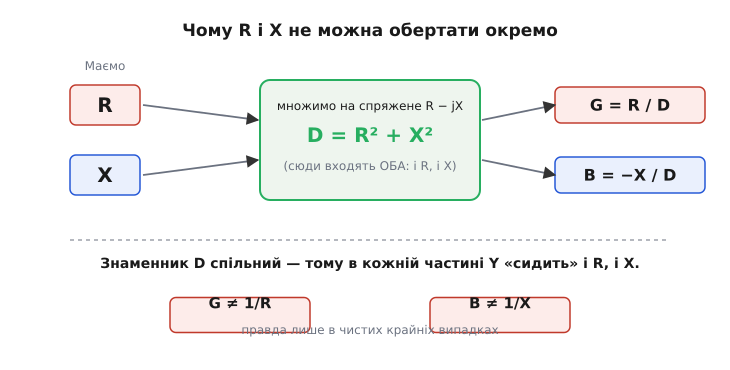
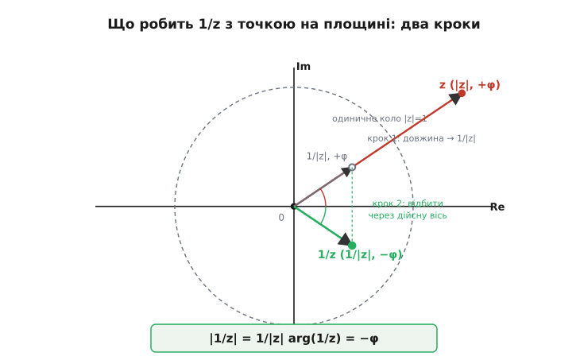
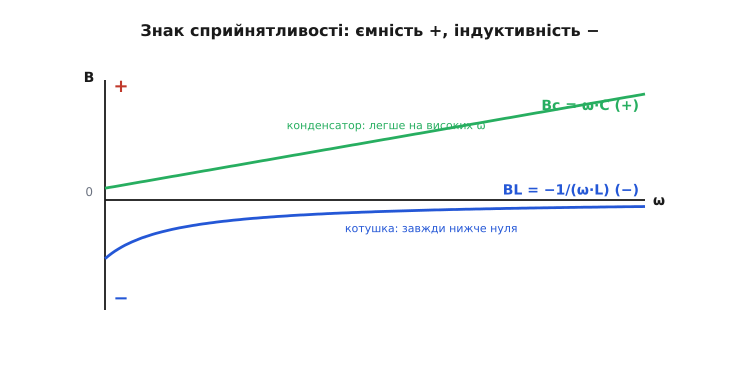

# 🧮 Обернути імпеданс у адмітанс: алгебра й геометрія ділення на комплексне число

Адмітанс означений до образливого просто: Y = 1/Z. Здавалося б, що тут розбирати — взяв та й поділив одиницю на число. Уся складність ховається в одному слові: Z — **комплексне** число, Z = R + jX. А «поділити одиницю на комплексне число» — операція, у якій дійсна й уявна частини не лишаються кожна при своєму, а перемішуються. Саме на цьому перемішуванні спотикається половина тих, хто вперше переходить від опорів до провідностей: рука сама тягнеться написати «ну то G = 1/R, а B = 1/X». Це найпоширеніша й найдорожча помилка в усій темі — і вона неправильна.

Розберімо ділення на комплексне число до самого дна, з двох боків заразом. **Алгебраїчний бік** покаже, *чому* в обох частинах адмітансу опиняється і R, і X, і звідки беруться точні формули G = R/(R²+X²) та B = −X/(R²+X²). **Геометричний бік** покаже те саме як рух точки на площині й пояснить, *чому* при оберненні модуль перевертається, а кут віддзеркалюється: |Y| = 1/|Z|, φ_Y = −φ_Z. Наприкінці — знаки сприйнятливості для конденсатора й котушки, які з цієї математики випадають самі собою й уже не потребують зубріння.

Що таке комплексне число-стрілка, чому j² = −1 і чому множення на j — це поворот на 90°, тут уважаємо вже відомим. Якщо ці речі ще не вляглися, варто спершу глянути сусідню вставку.

> 🔧 **Навіщо це знати.** Прошивка будь-якого приладу, що міряє повний опір — LCR-метр, аналізатор імпедансу, вхідний каскад вимірювача, — щомиті крутить рівно це обернення: давач віддає пару (R, X), а на екран треба вивести і Y, і провідність, і добротність, і фазу. Хто розуміє, *чому* частини перемішуються, ніколи не переплутає формули й не вставить у код хибне «1/R». Хто завчив формули напам'ять без розуміння — рано чи пізно вставить.

> Спираємося на: число-стрілка, полярна форма (модуль і кут), множення як «довжини множаться, кути додаються», j як поворот на 90°. Усе це — у вставці [«Комплексні числа й фазори»](root:ph-electromagnetism/phasors): синусоїду пакують в одну стрілку (фазор), а реактивності стають комплексними «опорами» через множення на jω.

## Чому не можна просто перевернути кожну частину

Спокуса перевернути частини окремо росте з аналогії, яка тут не працює. Для **дійсних** чисел усе слухняно: якщо опір складається з двох послідовних, R = R₁ + R₂, то ніхто не пише «1/R = 1/R₁ + 1/R₂» — це очевидна дурниця. Але коли число одне, R, перехід 1/R здається безпечним. І для суто дійсного він безпечний. Уся пастка — в уявній частині.

Гляньмо, чому «перевернути частини» хибне, найгрубішим тестом — на числах. Візьмімо найпростіший комплексний випадок: Z = j (чистий уявний опір, одиниця по уявній осі; фізично — реактивність 1 Ом без жодного активного опору). «Наївне правило» каже: дійсна частина 0 → перевертаємо в ∞? уявна 1 → перевертаємо в 1? Виходить нісенітниця. А правильна відповідь відома точно:

```
1/j = 1/j · (j/j) = j / j² = j / (−1) = −j
```

Обернення j — це **−j**, число з нульовою дійсною частиною й уявною −1. Тобто чисто уявне число при оберненні лишилося чисто уявним, але **знак** уявної частини перевернувся, а величина зосталась 1. Жодне «перевернути кожну частину окремо» такого не дає — бо ділення на комплексне число не діє покомпонентно. Воно діє на число **як на ціле**.

Звідки взявся трюк `· (j/j)`? Це і є ключ до всього подальшого. Ми домножили дріб на одиницю, хитро записану так, щоб **знаменник став дійсним**. Поки в знаменнику сидить j, поділити неможливо — немає правила «ділити на уявне». Тому ми переганяємо уявність зі знаменника в чисельник, де з нею вже легко впоратися. Для повного Z = R + jX той самий хід виглядає так само, лише множник складніший.

## Спряжене число: інструмент, що випрямляє знаменник

Множник, який перетворює комплексний знаменник на дійсний, зветься **спряженим** (*complex conjugate*, від лат. *coniugatus* — з'єднаний, спарований). У числа Z = R + jX спряжене — це **Z\* = R − jX**: те саме, лише з протилежним знаком при уявній частині. Геометрично спряження — це віддзеркалення стрілки через дійсну вісь (точка над віссю стає такою самою точкою під нею).

Уся магія в тому, що **число, помножене на своє спряжене, стає чисто дійсним** — і саме воно дорівнює квадрату довжини стрілки:

```
Z · Z* = (R + jX)(R − jX)
       = R² − jXR + jXR − j²X²      ← середні члени гасяться
       = R² − (−1)·X²
       = R² + X²
```

Простежте, що сталося. Два змішані члени −jXR і +jXR — однакові за величиною й протилежні за знаком, тож вони **точно знищують одне одного**. А останній член −j²X² через j² = −1 обертається на **+X²**, додатний. Лишається R² + X² — сума квадратів, без жодного j. Це не випадковий збіг, а вся суть спряження: воно влаштоване рівно так, щоб уявність вибула.

І ще: вираз R² + X² ми вже знаємо в обличчя. Це квадрат **модуля** (довжини) імпедансу:

```
|Z|² = R² + X²        (теорема Піфагора на площині: R по осі, X — догори)
```

Тобто Z · Z\* = |Z|². Спряжене — це інструмент, який обмінює комплексний знаменник на дійсне число |Z|², рівне квадрату довжини стрілки. Запам'ятайте цю рівність: вона зараз дасть нам і формули частин, і весь геометричний зміст обернення.

> 🔧 **Навіщо це.** У прошивці добуток на спряжене — це не абстракція, а буквально дві дії: `den = R*R + X*X;` (один рядок рахує |Z|²) і далі ділення на `den`. Знати, що `den` — це квадрат довжини вектора імпедансу, корисно ще й тому, що `sqrt(den)` одразу дає |Z| для виведення на екран. Один проміжний результат — і модуль, і знаменник для частин.

## Виведення формул: звідки беруться G і B

Тепер усе готове, щоб вивести точні формули — не оголосити, а отримати на очах. Множимо чисельник і знаменник 1/Z на спряжене знаменника Z\* = R − jX:

```
Y = 1/Z = 1/(R + jX)
        = (R − jX) / [(R + jX)(R − jX)]
        = (R − jX) / (R² + X²)
```

Знаменник став дійсним (R² + X²), як ми й домагалися. Тепер ділення на дійсне число — дрібниця: ділимо на нього **кожну** частину чисельника окремо. Чисельник R − jX має дійсну частину R і уявну −X, отже:

```
Y = R/(R² + X²)  −  j · X/(R² + X²)
```

Зіставимо це із загальним записом адмітансу Y = G + jB. Дійсна частина — це G, множник при j — це B:

```
G = R / (R² + X²)
B = −X / (R² + X²)
```

Ось вони, виведені до кінця. Тепер видно **чому** частини перемішуються, і це вже не таємниця: у знаменнику обох сидить **той самий вираз R² + X²**, а він містить і R, і X разом. Інакше й бути не може — адже знаменник народився з добутку на спряжене, де R і X неминуче зустрілися в сумі квадратів. Тому:

- активна провідність **G залежить не лише від R**, а й від реактивності X (через знаменник);
- сприйнятливість **B залежить не лише від X**, а й від активного опору R (через той самий знаменник);
- розв'язати їх «нарізно» неможливо — вони склеєні спільним знаменником намертво.


*Чому частини не обертаються окремо. Множення на спряжене R − jX зводить опір і реактивність в один спільний знаменник D = R² + X², куди входять обидва. Тому в кожну частину адмітансу — і в G, і в B — потрапляє і R, і X. Рівність G = 1/R справджується лише в чистому крайньому випадку (X = 0), B = −1/X — лише при R = 0; між ними завжди змішування.*

> 🔧 **Навіщо це.** Класична помилка в коді обчислювача імпедансу — написати `G = 1.0/R; B = 1.0/X;` «за аналогією». Компілятор не заперечить, прилад покаже числа — просто **неправильні**, і помітити це на око важко. Розуміння виведення — найдешевший захист: знаючи, що в знаменнику завжди |Z|², ви фізично не зможете написати таку стрічку.

## Перевіримо формули на крайніх випадках

Гарна формула мусить впізнавано вироджуватися там, де відповідь і так очевидна. Прожену виведені G і B через три контрольні точки.

**Чистий резистор: X = 0.** Тоді знаменник R² + 0 = R², і формули дають G = R/R² = 1/R, B = 0. Усе як треба: у резистора провідність — це просто перевернутий опір, а сприйнятливості нема. Це той єдиний випадок, де наївне «G = 1/R» **випадково правильне** — бо немає X, щоб усе зіпсувати.

**Чистий реактивний елемент: R = 0.** Знаменник 0 + X² = X², формули дають G = 0/X² = 0, B = −X/X² = −1/X. Активної провідності нема (елемент енергії не витрачає), а сприйнятливість — це перевернута реактивність зі **зміненим знаком**. Згадайте контрольний приклад Z = j (тут R = 0, X = 1): дістаємо B = −1/1 = −1, тобто Y = −j. Точно те, що ми рахували руками на початку. Формули й «лобовий» розрахунок сходяться — добрий знак, що ніде не наплутали.

**Загальний випадок: і R, і X ненульові.** Тут уже жодного спрощення немає, і саме тут люди помиляються. Візьмімо конкретику: Z = 30 + j40 Ом. Знаменник R² + X² = 900 + 1600 = 2500. Тоді:

```
G = 30 / 2500  = 0.0120 См
B = −40 / 2500 = −0.0160 См
```

Зверніть пильну увагу: G = 0.012 См — це **не** 1/R = 1/30 ≈ 0.0333 См. Реактивність 40 Ом «розбавила» активну провідність більш ніж утричі, бо в знаменнику не R² = 900, а R² + X² = 2500. Хто механічно взяв би 1/R, помилився б майже втричі — і це не дрібна похибка, а груба. Ось ціна нерозуміння перемішування, у конкретних сименсах.

## Геометричний бік: що робить 1/Z зі стрілкою

Алгебра дала формули, та вона не пояснює, *чому* при оберненні кут перевертається. Це найкраще видно з геометрії — і там обернення розпадається на два прості, наочні кроки. Згадаймо: будь-яке комплексне число можна записати полярно — довжиною |Z| і кутом φ. Питання: на що перетворить це число операція 1/Z?

Зайдемо через ту саму рівність Z · Z\* = |Z|², лише переставимо її:

```
1/Z = Z* / |Z|²
```

Прочитаймо праву частину геометрично, по черзі. Z\* — це сама стрілка Z, **віддзеркалена через дійсну вісь** (кут із +φ став −φ, довжина та сама |Z|). Поділ на |Z|² — це **стискання** довжини в |Z|² разів. Складімо обидві дії: довжина зі стану |Z| ділиться на |Z|², отже стає |Z|/|Z|² = 1/|Z|; а кут від віддзеркалення став −φ. Звідси одразу:

```
|Y| = 1 / |Z|          ← довжина перевертається
φ_Y = −φ_Z             ← кут віддзеркалюється
```

Те саме можна побачити ще наочніше, розклавши обернення на **інверсію по радіусу** й **віддзеркалення**, як на рисунку. Спершу точку «втягують» уздовж її ж променя так, що нова відстань стає оберненою до старої (далека точка стає близькою й навпаки) — це інверсія відносно одиничного кола, вона міняє лише довжину, кут лишає тим самим +φ. Потім результат **відбивають через дійсну вісь** — і кут стає −φ. Два кроки — і ось вам 1/Z.


*Обернення комплексного числа в два кроки. Крок 1 — інверсія по радіусу: точка z з довжиною |z| і кутом +φ переходить у точку з довжиною 1/|z| на тому самому промені (кут поки що +φ). Крок 2 — спряження: віддзеркалення через дійсну вісь, після якого кут стає −φ. Підсумок: |1/z| = 1/|z|, arg(1/z) = −φ. Це не правило з неба, а проста геометрія, та сама для будь-якого комплексного числа.*

Те, що обернення комплексного числа — це інверсія в одиничному колі з наступним віддзеркаленням через дійсну вісь, — усталений факт комплексного аналізу, не наша вигадка для зручності. Він дає миттєву інтуїцію, яку формули приховують: **кут адмітансу завжди протилежний кутові імпедансу**.

## Чому φ_Y = −φ_Z — і що це означає фізично

Рівність φ_Y = −φ_Z варта окремої зупинки, бо вона раз у раз дивує. Уявіть індуктивне коло: струм відстає від напруги, і кут імпедансу **додатний** (φ_Z > 0). Той самий, нічим не змінений фізичний зсув струму відносно напруги в мові адмітансу записується **від'ємним** кутом (φ_Y < 0). Виникає відчуття, ніби індуктивність «передумала» й стала ємнісною. Нічого подібного: коло те саме, струм відстає так само, як відставав. Перевернувся лише **знак у записі**, бо ми дивимося на ту саму стрілку з протилежного боку дзеркала.

Чому так, видно і без геометрії, з означень. Кут імпедансу — це фаза, на яку напруга випереджає струм: Z = V/I, тож arg(Z) = arg(V) − arg(I). Адмітанс — обернене відношення: Y = I/V, отже arg(Y) = arg(I) − arg(V). Це **те саме** з переставленими місцями зменшуваним і від'ємником, а така перестановка просто міняє знак різниці:

```
arg(Y) = arg(I) − arg(V) = −[arg(V) − arg(I)] = −arg(Z)
```

Фізичний зміст не зник і не змінився — змінилося, чию фазу від чиєї віднімаємо. Імпеданс питає «наскільки напруга випереджає струм», адмітанс — «наскільки струм відстає від напруги». Це одне й те саме число з протилежним знаком. Тому, переходячи від Z до Y, не лякайтеся, коли «індуктивне» раптом дістає від'ємний кут: це властивість мови, а не кола.

**Worked-приклад: перевести Z = 30 + j40 у полярний адмітанс.** Той самий двополюсник, але тепер дивимося на довжину й кут.

:::tabs
```c
// Полярний бік обернення: |Y| = 1/|Z|, φ_Y = −φ_Z
#include <stdio.h>
#include <math.h>

int main(void) {
    double R = 30.0, X = 40.0;              // Ом
    double Zmag = sqrt(R*R + X*X);          // |Z| = sqrt(2500) = 50 Ом
    double phiZ = atan2(X, R);              // кут імпедансу (рад), +53.13°

    double Ymag = 1.0 / Zmag;               // |Y| = 1/50 = 0.0200 См
    double phiY = -phiZ;                    // кут адмітансу = −φ_Z, −53.13°

    printf("|Z| = %.1f Ом,  phiZ = %+.2f deg\n", Zmag, phiZ*180.0/M_PI);
    printf("|Y| = %.4f См,  phiY = %+.2f deg\n", Ymag, phiY*180.0/M_PI);
    return 0;
}
```
```python
# Полярний бік обернення: |Y| = 1/|Z|, φ_Y = −φ_Z
import cmath
import math

R, X = 30.0, 40.0                       # Ом
Z = complex(R, X)                       # імпеданс як комплексне число

Zmag = abs(Z)                           # |Z| = 50 Ом
phiZ = cmath.phase(Z)                   # кут імпедансу (рад), +53.13°

Y = 1 / Z                               # обернення робить сама мова
Ymag = abs(Y)                           # |Y| = 1/50 = 0.0200 См
phiY = cmath.phase(Y)                   # кут адмітансу = −φ_Z, −53.13°

print(f"|Z| = {Zmag:.1f} Ом,  phiZ = {math.degrees(phiZ):+.2f} deg")
print(f"|Y| = {Ymag:.4f} См,  phiY = {math.degrees(phiY):+.2f} deg")
```
:::

Дістаємо |Y| = 0.0200 См під кутом −53.13°. Звіримо з прямокутним боком, щоб переконатися, що це те саме число: |Y| = √(G² + B²) = √(0.012² + 0.016²) = √(0.000144 + 0.000256) = √0.0004 = 0.02 См — збігається. А кут arctan(B/G) = arctan(−0.016/0.012) = arctan(−1.333) = −53.13° — теж збігається. Прямокутна форма (G, B) і полярна (|Y|, φ_Y) — два записи однієї стрілки; додатна X = +40 дала додатний φ_Z = +53° і, як належить, від'ємний φ_Y = −53°. Коло індуктивне в обох мовах — просто «індуктивність» в адмітансі позначена мінусом кута.

> 🔧 **Навіщо це.** `atan2(X, R)` (а не `atan(X/R)`) у коді невипадково: `atan2` правильно віддає кут у всіх чотирьох чвертях, зокрема при R < 0 чи R = 0, де `atan` ламається. Прилад, що міряє імпеданс будь-якого знаку, без `atan2` показуватиме фазу неправильно у половині випадків. Дрібниця в одному виклику — а від неї залежить, чи правильний знак фази на екрані.

## Знаки сприйнятливості: чому C додатна, а L від'ємна

Тепер найприємніше: знаки сприйнятливості конденсатора й котушки не треба завчати — вони падають із формули B = −X/(R²+X²) самі. Розгляньмо чисті реактивні елементи (R = 0, тоді B = −1/X) і підставмо їхні реактивності.

**Котушка.** Її реактивність додатна й росте з частотою: XL = ω·L > 0. Підставляємо:

```
BL = −1/XL = −1/(ω·L)        ← від'ємна
```

Сприйнятливість котушки **від'ємна** — і це прямий наслідок того, що її реактивність додатна, а обернення несе мінус. За модулем вона **спадає** з частотою: що швидші коливання, то менше |BL| = 1/(ωL), то «важче» котушка пропускає змінний струм. На графіку BL завжди нижче нуля й піднімається до нуля знизу зі зростанням ω.

**Конденсатор.** Його реактивність від'ємна: Xc = −1/(ω·C) < 0. Підставляємо:

```
Bc = −1/Xc = −1/(−1/(ω·C)) = +ω·C   ← додатна
```

Сприйнятливість конденсатора **додатна** — бо подвійний мінус (від'ємна реактивність плюс мінус від обернення) дає плюс. І вона **росте** з частотою: Bc = ω·C, що швидші коливання — то легше конденсатор пропускає струм. На графіку Bc — пряма, що йде вгору від нуля.


*Знаки сприйнятливості випадають із обернення. Bc = ω·C додатна й зростає прямою (конденсатор тим легше пропускає, чим вища частота). BL = −1/(ω·L) від'ємна й за модулем спадає, наближаючись до нуля знизу (котушка тим важче пропускає, чим вища частота). Подвійний мінус у Bc = −1/Xc обертає від'ємну ємнісну реактивність на додатну сприйнятливість; одинарний мінус у BL = −1/XL робить індуктивну сприйнятливість від'ємною.*

Ось чому в адмітансі знаки ніби «міняються місцями» порівняно з реактивностями. У світі імпедансу котушка має додатну реактивність (XL > 0), конденсатор — від'ємну (Xc < 0). У світі адмітансу — навпаки: котушка дає від'ємну сприйнятливість, конденсатор — додатну. Це не два суперечливі факти, а **одне й те саме**, побачене з двох боків дзеркала: обернення кожного разу несе зміну знаку. Хто це зрозумів, той ніколи не переплутає, який елемент тягне уявну частину вгору, а який униз.

Перевірмо, що це узгоджується з кутами, які ми щойно вивели. У чистого конденсатора Z = −j/(ωC), кут φ_Z = −90° (струм випереджає напругу). Тоді φ_Y = +90°, тобто Y дивиться вгору по уявній осі — додатна сприйнятливість. У чистої котушки Z = +jωL, φ_Z = +90°, отже φ_Y = −90°, Y дивиться вниз — від'ємна сприйнятливість. Полярний бік і знаки сходяться ідеально: усе це наслідки однієї рівності φ_Y = −φ_Z.

## Куди це далі веде

Уся ця математика — не самоціль, а фундамент, на якому стоїть зручність адмітансу. Коли елементи з'єднані **паралельно**, їхні адмітанси просто складаються, Y = Y₁ + Y₂ + …, бо на всіх та сама напруга, а струми додаються. Підставивши сюди щойно виведені сприйнятливості з правильними знаками, дістаємо для паралельного контуру дуже прозорий вираз: дійсна частина — провідність 1/R, а уявна — **різниця** ємнісної та індуктивної сприйнятливостей, ω·C − 1/(ω·L). Конденсатор тягне її вгору, котушка — вниз, і там, де вони зрівнюються, уявна частина обертається на нуль. Це й є умова резонансу, прочитана однією дією: «уявна частина адмітансу = 0». Те, що тримання обох знаків нарізно гарантує правильний — найкоротший шлях до неї.

І ще одне, тонше. Те, що φ_Y = −φ_Z, означає: переходячи між «важкістю» й «легкістю», ви не втрачаєте жодної інформації про фазу — лише дивитеся на ту саму стрілку з іншого боку. Обидві мови повноцінні; майстерність у тому, щоб брати ту, у якій арифметика простіша. Послідовне коло природно «розмовляє» імпедансами (спільний струм), паралельне — адмітансами (спільна напруга). А інструмент переходу між ними — рівно те комплексне ділення, яке ми щойно розклали на гвинтики: домножити на спряжене, зібрати спільний знаменник |Z|², прочитати частини. Зробите це з розумінням — і жодне «обернути частини окремо» вас уже не спіймає.
