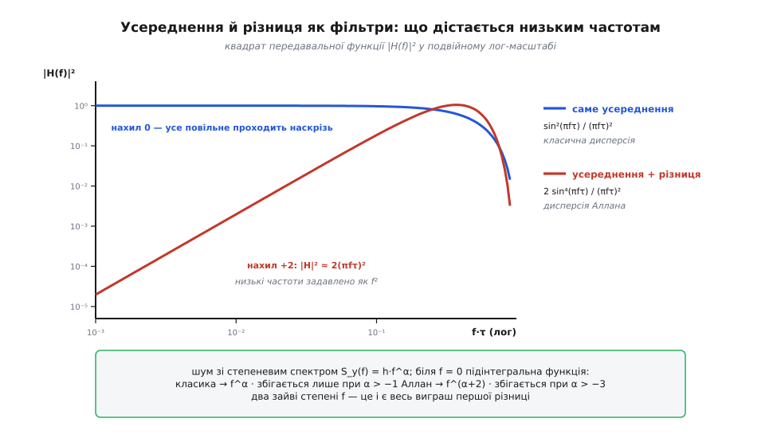
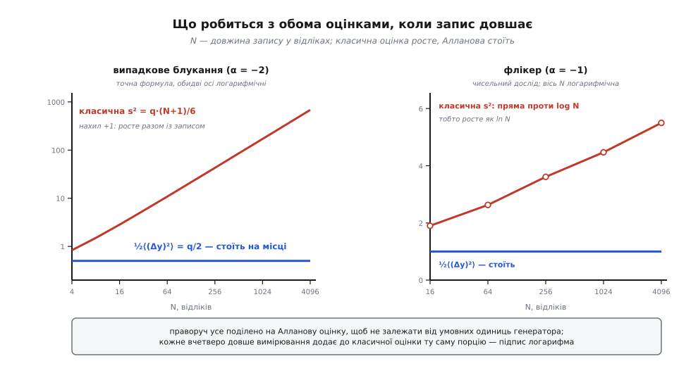

# 🧮 Звідки береться ½ і чому перша різниця сходиться

В означенні σ²y(τ) = ½·⟨(yₖ₊₁ − yₖ)²⟩ дві речі мають вигляд домовлености: множник ½ і сам вибір різниці сусідів. Тут виводиться, що жодна з них не домовленість — ½ виявляється звичайною поправкою Бесселя, порахованою для вибірки з двох елементів, а перша різниця виявляється найслабшим із можливих фільтрів, що не бачить сталої, і саме цієї слабкої дії рівно вистачає, щоб інтеграл, який розходився, збігся.

## Про що йдеться

y₁, y₂, y₃, … — це середні відносні відхилення частоти за послідовні відрізки часу тривалістю τ, стик у стик, без пропусків. Кутові дужки ⟨…⟩ означають усереднення по ансамблю (математичне сподівання); на скінченному записі його заступає середнє по всіх наявних відліках чи парах. Сперечаються дві оцінки розкиду:

```
класична:  s²     = 1/(N−1) · Σₖ (yₖ − ȳ)²,   де ȳ = (1/N) · Σₖ yₖ
Алланова:  σ²y(τ) = ½ · ⟨(yₖ₊₁ − yₖ)²⟩
```

## ½ — це поправка Бесселя, порахована для двох

Візьмімо звичайну незміщену [вибіркову дисперсію](root:math-probability/sample-variance) — ту саму, з дільником N−1, який компенсує те, що середнє ȳ порахували з тих-таки даних, — і підставмо в неї N = 2. Більше нічого робити не доведеться:

```
ȳ = (y₁ + y₂) / 2
y₁ − ȳ = −(y₂ − y₁) / 2
y₂ − ȳ = +(y₂ − y₁) / 2
Σ (yₖ − ȳ)² = 2 · (y₂ − y₁)²/4 = (y₂ − y₁)²/2
s² = Σ (yₖ − ȳ)² / (N − 1) = (y₂ − y₁)²/2 = ½ · (y₂ − y₁)²
```

Ось і весь множник. Величина ½(y₂ − y₁)² — не новий винахід, а буквально та сама підручникова вибіркова дисперсія, лише порахована на вибірці з двох відліків: коли відліків двоє, єдиний спосіб відхилитися від середнього — розійтися в різні боки, і кожен відхиляється рівно на пів різниці. А дисперсія Аллана — це середнє такої двоелементної дисперсії по всіх сусідніх парах запису. Звідси й давніша, описова назва величини: **двовибіркова дисперсія**.

Так само влаштоване й загальніше означення, з якого починав сам Аллан: береться дисперсія M суміжних середніх, усе з тим самим дільником M−1, а дисперсія Аллана є випадок M = 2. Тобто ½ ніхто не добирав окремо — вона приїхала разом із поправкою Бесселя, щойно в неї підставили найменше можливе M.

> 🔧 **Навіщо це.** З цієї тотожности випливає безкоштовна перевірка обчислень. Якщо на короткому записі без дрейфу обидві оцінки розійшлися рівно вдвічі — шукайте забутий (або зайвий) множник ½, а не фізику: розходження саме в 2.00 раза ніколи не буває «майже правильним».

## Той самий ½ з іншого боку: різниця подвоює дисперсію

Перший шлях був суто алгебраїчний і нічого не припускав про шум. Другий пояснює, **чому там двійка**, — а заразом і те, коли ½ калібрує правильно, а коли ні.

Запишімо відлік як сталий рівень плюс шум: yₖ = μ + nₖ. Різниця сусідів рівня не бачить зовсім:

```
yₖ₊₁ − yₖ = (μ + nₖ₊₁) − (μ + nₖ) = nₖ₊₁ − nₖ
```

μ скорочується точно, без наближень, і байдуже, чи він відомий. Тепер розкриймо квадрат:

```
⟨(yₖ₊₁ − yₖ)²⟩ = ⟨nₖ₊₁²⟩ − 2·⟨nₖ · nₖ₊₁⟩ + ⟨nₖ²⟩
```

Білий частотний шум означає рівно те, що сусідні τ-середні між собою не [корельовані](root:math-probability/covariance): ⟨nₖ · nₖ₊₁⟩ = 0. Тоді середній доданок зникає, а два крайні дають по σ² кожен:

```
⟨(yₖ₊₁ − yₖ)²⟩ = σ² + σ² = 2σ²      →      ½ · ⟨(yₖ₊₁ − yₖ)²⟩ = σ²
```

Двійка тут та сама, що й у складанні незалежних похибок: різниця двох незалежних величин має розкид у √2 разів більший за кожну з них, отже її квадрат — удвічі більший. Множник ½ рівно це й відкручує. І зверніть увагу, наскільки точна ця рівність: сподівання ½(Δy)² дорівнює σ² вже для **однієї** пари, а не в границі великого N. Одна пара — один ступінь вільности — незміщена оцінка.

Тут-таки видно асиметрію, яка згодом усе вирішить. Класична формула мусить спершу дізнатися ȳ і лише потім міряти відстані до нього; вона платить за це одним ступенем вільности (той самий дільник N−1) і цілком залежить від того, чи ȳ взагалі має сенс. Різниця сусідів про середнє не питає ніколи.

**Перевірмо на трьох відліках.** Хай y₁, y₂, y₃ незалежні, з дисперсією σ² (середнє покладемо нулем — воно однаково скоротиться).

```
Алланова:  ½ · ½ · [ ⟨(y₂−y₁)²⟩ + ⟨(y₃−y₂)²⟩ ] = ¼ · (2σ² + 2σ²) = σ²

класична:  ȳ = (y₁ + y₂ + y₃)/3
           y₁ − ȳ = (2y₁ − y₂ − y₃)/3  →  ⟨(y₁−ȳ)²⟩ = (4+1+1)·σ²/9 = 2σ²/3
           для y₂ і y₃ так само         →  Σ = 3 · 2σ²/3 = 2σ²
           s² = 2σ² / (3−1) = σ²
```

Обидві дають σ² — точно, без наближень. Так і мало бути: там, де стара міра ще працює, нова зобов'язана видавати те саме число, інакше всі раніше видані паспорти генераторів довелося б перечитувати з поправкою.

На випадкових записах це видно й чисельно. Усереднення по 20 000 записів [білого шуму](root:ph-thermodynamics/white-noise-spectrum) з σ² = 1:

```
N =    8:   ⟨s²⟩ = 1.0006     ⟨½(Δy)²⟩ = 0.9964
N =   32:   ⟨s²⟩ = 0.9992     ⟨½(Δy)²⟩ = 1.0010
N =  128:   ⟨s²⟩ = 1.0002     ⟨½(Δy)²⟩ = 0.9989
N = 1024:   ⟨s²⟩ = 0.9999     ⟨½(Δy)²⟩ = 1.0000
```

Обидві оцінки не тільки збігаються між собою — вони й не рухаються з довжиною запису. Саме цим білий шум і особливий, і саме тому калібрувати нову міру можна було лише по ньому: це єдиний випадок, де старій мірі ще є що сказати.

## Що означає «сходиться»

Тепер друга половина запитання. Обидві оцінки — звірі одного роду: кожна є зваженим інтегралом від [спектральної щільности потужности](root:com-signal/psd) шуму S_y(f), тобто від того, скільки шумової потужности припадає на кожну частоту. Питання збіжности — це питання про те, чи має цей [невласний інтеграл](root:math-analysis/improper-integral) скінченне значення. Отже, дивитися треба на ваги.

### Дві машинки як два фільтри

Почнімо з усереднення, спільного для обох. Кожен відлік yₖ — це середнє неперервної y(t) по своєму вікну завширшки τ. Подаймо на вхід чисту синусоїду частоти f і подивімося, що з неї лишиться:

```
(1/τ) · ∫₀^τ e^(−i2πft) dt = e^(−iπfτ) · sin(πfτ) / (πfτ)

|Hсер(f)|² = sin²(πfτ) / (πfτ)²
```

Читається це просто. Повільна синусоїда (fτ ≪ 1) за час вікна майже не змінюється, усереднення її не чіпає — вага 1. Швидка (fτ ≫ 1) встигає кілька разів перейти нуль і в середньому нищить сама себе — вага падає.

Тепер різниця. Наступне вікно — це те саме вікно, зсунуте на τ, а зсув у часі на τ для синусоїди означає множення на e^(−i2πfτ). Отже, відняти сусіда — це помножити на (1 − e^(−i2πfτ)):

```
|1 − e^(−i2πfτ)|² = 2 − 2·cos(2πfτ) = 4 · sin²(πfτ)
```

Разом із множником ½ дістаємо повну вагу дисперсії Аллана:

```
|H_A(f)|² = ½ · [ sin²(πfτ)/(πfτ)² ] · 4 sin²(πfτ) = 2 · sin⁴(πfτ) / (πfτ)²

σ²y(τ) = ∫₀^∞ S_y(f) · 2 sin⁴(πfτ) / (πfτ)² df
```

### Уся відповідь — у поведінці біля нуля

Порівняймо дві ваги там, де ламалася класика, — на найповільніших частотах. При малому аргументі sin(πfτ) ≈ πfτ, тож

```
|Hсер|² → 1
|H_A|²  → 2 · (πfτ)⁴ / (πfτ)² = 2 · (πfτ)²   ∝  f²
```

Ось і вся суть першої різниці, в одному рядку: **вона приставляє множник f² до низькочастотної частини шуму**. Саме усереднення повільним складовим не заважає взагалі — воно для того й зроблене, щоб пропускати повільне. Різниця ж давить їх тим сильніше, чим вони повільніші, і в границі f → 0 давить до нуля.



*Ліворуч на осі — найповільніші складові шуму. Класична вага їх пропускає як є, Алланова гасить квадратично; уся різниця в збіжності обох оцінок береться саме з цієї лівої частини малюнка.*

Далі — арифметика показників. Шуми генератора добре описуються степеневими спектрами S_y(f) = h_α · f^α, і питання збіжности біля нуля стає питанням про один-єдиний показник:

```
класика:  ∫₀ f^α df       скінченний ⟺ α > −1
Аллан:    ∫₀ f^(α+2) df   скінченний ⟺ α > −3
```

Два зайві степені f — це весь виграш, і його вистачає на всі шуми, що трапляються в генераторах:

```
 α    шум                          біля f = 0: класика   біля f = 0: Аллан
+2    білий фазовий                збігається            збігається
+1    флікерний фазовий            збігається            збігається
 0    білий частотний              збігається            збігається
−1    флікерний частотний          РОЗХОДИТЬСЯ           збігається
−2    випадкове блукання частоти   РОЗХОДИТЬСЯ           збігається
−3    флікерне блукання            РОЗХОДИТЬСЯ           РОЗХОДИТЬСЯ (межа)
−4    випадковий біг               РОЗХОДИТЬСЯ           РОЗХОДИТЬСЯ
```

Два рядки посередині — [флікерний шум](root:ph-condensed/flicker-noise) і [випадкове блукання](root:math-probability/random-walk) — і є той діапазон, у якому живе реальний кварц і атомний еталон. Класична дисперсія падає рівно на них; дисперсія Аллана дістає їх обидва, та ще й із запасом на цілий рядок нижче.

Чесно буде сказати й про другий кінець інтеграла. На високих частотах sin⁴ товчеться біля одиниці, а знаменник росте як f², тож |H_A|² спадає лише як 1/f² — і ∫^∞ f^α/f² df скінченний тільки при α < 1. Для флікерного (α = +1) і білого (α = +2) фазового шуму інтеграл тікає вгорі, і відповідь стає залежною від верхньої межі смуги вимірювання f_h: у формулах для цих двох шумів f_h стоїть явно. Це не дрібниця, а корінь відомої вади міри — обидва [фазові шуми](root:hw-components/phase-noise) дають на кривій майже однаковий нахил ≈ τ⁻¹, і розрізнити їх дисперсія Аллана не може.

### ½ проходить перевірку і в частотній картині

Множник ½ вивели двома суто часовими способами; тепер є чим перевірити його втретє — уже інтегралом. Візьмімо білий частотний шум, S_y(f) = h₀ (стала), і порахуймо обидві величини до числа. Заміна u = πfτ, df = du/(πτ):

```
σ²y(τ) = 2h₀ · ∫₀^∞ sin⁴(πfτ)/(πfτ)² df = (2h₀ / (πτ)) · ∫₀^∞ sin⁴u/u² du
```

Інтеграл береться через тотожність sin⁴u = (3 − 4cos2u + cos4u)/8. Розбивати її на три окремі інтеграли не можна: біля нуля кожен із них розбігся б, хоч їхня сума й скінченна. Тому чисельник перегруповують у пари, кожна з яких щезає в нулі разом зі знаменником:

```
3 − 4·cos2u + cos4u = 4·(1 − cos2u) − (1 − cos4u)
∫₀^∞ (1 − cos au)/u² du = πa/2                        (a > 0)
∫₀^∞ sin⁴u/u² du = (1/8) · [ 4 · π·2/2 − π·4/2 ] = (1/8) · (4π − 2π) = π/4
```

Отже

```
σ²y(τ) = (2h₀/(πτ)) · π/4 = h₀ / (2τ)
```

Тепер класична — дисперсія одного τ-середнього того самого шуму, тобто той самий інтеграл, але з вагою самого лише усереднення:

```
∫₀^∞ h₀ · sin²(πfτ)/(πfτ)² df = (h₀/(πτ)) · ∫₀^∞ sin²u/u² du = (h₀/(πτ)) · π/2 = h₀/(2τ)
```

Однаково — до останнього символу. Калібрування, придумане в часовій області, витримує подорож у частотну: для білого частотного шуму дисперсія Аллана дорівнює звичайній дисперсії τ-середнього не «приблизно» і не «з точністю до множника», а тотожно. Заразом звідси падає й уся ліва стінка σ‑τ‑кривої: σy(τ) = √(h₀/(2τ)) ∝ τ^(−1/2). Множник ½ дає не лише правильний нахил −1/2, а й правильний коефіцієнт перед ним — той, за яким із виміряної кривої читають h₀ самого генератора.

## Як розбіжність виглядає на скінченному записі

Нескінченних чисел у лабораторії не буває, тому варто перекласти слово «розходиться» на мову вимірювання. Запис тривалістю T просто не бачить частот, нижчих за ≈ 1/T: на таких частотах у ньому немає жодного повного періоду, і повільне коливання проходить крізь запис як шматок сталого зсуву. Отже, класична оцінка — це той самий розбіжний інтеграл, обрізаний знизу на f ≈ 1/T:

```
α = −1 (флікер):    ∫ від 1/T до f_h  h₋₁ · f⁻¹ df = h₋₁ · ln(f_h·T)   → росте як ln T
α = −2 (блукання):  ∫ від 1/T до f_h  h₋₂ · f⁻² df ≈ h₋₂ · T           → росте як T
```

Ось звідки береться те, що на око виглядає як примха приладу: «стандартне відхилення» несе в собі T — довжину вашого запису — як звичайний множник. Це не оцінка з великою похибкою; це оцінка **іншої величини**.

### Точний рахунок на випадковому блуканні

Спектральний висновок можна перевірити в часовій області, і для блукання це робиться до кінця, без жодних наближень. Модель проста: кожен наступний відлік дорівнює попередньому плюс незалежний поштовх.

```
yₖ = yₖ₋₁ + εₖ,   ⟨εₖ⟩ = 0,   ⟨εₖ²⟩ = q,   поштовхи незалежні
```

Алланова оцінка розправляється з цим за один рядок: різниця сусідів **і є** поштовх.

```
yₖ₊₁ − yₖ = εₖ₊₁      →      σ²y = ½ · ⟨ε²⟩ = q/2
```

Ані N, ані T у відповіді немає — і не могло бути, бо різниця не бачить нічого, крім одного кроку.

Тепер класична. Знадобиться коваріація двох відліків: y_j і y_k мають спільними всі поштовхи до меншого з номерів, і кожен такий поштовх додає q:

```
⟨y_j · y_k⟩ = q · min(j, k)
```

Далі — чиста алгебра. Розкладімо суму квадратів відхилень на дві частини:

```
Σₖ (yₖ − ȳ)² = Σₖ yₖ² − N·ȳ²

⟨Σₖ yₖ²⟩ = q · Σ_{k=1..N} k = q · N(N+1)/2
```

Другий доданок потребує подвійної суми Σ_j Σ_k min(j,k). Її беруть переліком у зручнішому порядку: min(j,k) — це кількість тих m від 1 до N, для яких одночасно m ≤ j і m ≤ k. Порахуймо ті самі трійки (j, k, m), але спершу зафіксувавши m: тоді j і k незалежно пробігають по N − m + 1 значень кожен.

```
Σ_j Σ_k min(j,k) = Σ_{m=1..N} (N − m + 1)² = Σ_{r=1..N} r² = N(N+1)(2N+1)/6

⟨N·ȳ²⟩ = (1/N) · q · N(N+1)(2N+1)/6 = q · (N+1)(2N+1)/6
```

Складаємо:

```
⟨Σₖ (yₖ − ȳ)²⟩ = q(N+1) · [ N/2 − (2N+1)/6 ] = q(N+1)(N−1)/6 = q(N²−1)/6

⟨s²⟩ = q(N²−1) / (6·(N−1)) = q · (N+1)/6
```

Дві відповіді поруч кажуть усе:

```
Аллан:   σ²y  = q/2                (від N не залежить узагалі)
класика: ⟨s²⟩ = q · (N+1)/6        (пряма пропорція до довжини запису)
відношення:  ⟨s²⟩ / σ²y = (N+1)/3
```

Підставмо числа. Сто відліків — класична оцінка вже в 33.7 раза більша за Алланову. Десять тисяч — у 3334 рази. У перерахунку на відхилення: подовжили вимірювання в сто разів — і «стандартне відхилення» виросло майже рівно вдесятеро, у √100, хоча генератор не змінився ані на йоту. А σy(τ) обидва рази те саме √(q/2).

### Флікер: те саме, тільки повільніше

Для флікерного шуму такої точної формули в кілька рядків не випишеш, зате чисельний дослід відтворює передбачення ln T один в один. Ось усереднення по 1500 випадкових флікерних записів, поділене на Алланову оцінку, щоб позбутися умовних одиниць генератора:

```
N =   16:   ⟨s²⟩ / σ²y = 1.90
N =   64:                2.63
N =  256:                3.61
N = 1024:                4.47
N = 4096:                5.50
```

Кожне вчетверо довше вимірювання додає до відношення приблизно ту саму порцію (0.73, 0.98, 0.86, 1.03) — а сталий приріст на сталий **множник** N і є підпис логарифма. Сама ж Алланова оцінка на тих самих записах виходить на поличку: 1.96 при N = 256 і 2.00 при N = 4096, тобто за шістнадцятикратного подовження запису вона зрушила на два відсотки.



*Ліва панель — точна формула q(N+1)/6, права — чисельний дослід. Синя лінія в обох випадках горизонтальна: це і є те, що називають збіжністю оцінки.*

## Чому саме ПЕРША різниця

Лишилося пояснити останній вибір: чому різниця — і чому саме перша.

Вимога, з якої все випливає, одна: міра не має права залежати від рівня, навколо якого коливається сигнал, — бо саме цього рівня як сталого числа й не існує. Мовою частот «не залежить від сталої» означає H(0) = 0: на нульовій частоті вага мусить бути нульова. А гладка функція, що обертається в нуль у точці, поблизу неї спадає щонайменше як перший степінь — отже, її квадрат щонайменше як f². Так виходить нижня межа: **f² — це найслабше можливе придушення низьких частот** для будь-якої міри, що ігнорує сталу. Перша різниця дає рівно його, ані краплі більше.

Це не дрібна деталь, а критерій вибору. Сильніший фільтр верхніх частот теж прибрав би сталу — і збігався б навіть на гірших шумах. Але за це довелося б платити: що дужче давиться повільна частина, то менше в оцінці лишається справжньої повільної поведінки генератора, яку на довгих τ ми якраз і хочемо побачити. Перша різниця — найдешевший спосіб зробити запитання осмисленим, тому вона й виграла.

**Чого перша різниця не прибирає.** Сталу — прибирає точно. Сталий нахил — ні. Хай частота повзе рівномірно, y(t) = y₀ + D·t, де D — швидкість дрейфу за секунду:

```
середнє за k-те вікно:   ȳₖ = y₀ + D · (k + ½) · τ
різниця сусідів:         ȳₖ₊₁ − ȳₖ = D · τ         (однакова для всіх k)
σ²y(τ) = ½ · (D·τ)²      →       σy(τ) = D·τ / √2
```

Детермінований дрейф проходить крізь різницю наскрізь і чесно проступає на кривій прямою, що росте як τ у першому степені. Це не хиба міри, а точний звіт: перша різниця нищить многочлени нульового степеня, а не першого.

**Драбина.** Звідси видно й продовження. Різниця d-го порядку нищить многочлени до степеня d−1 і дає біля нуля вагу ∝ f^(2d), тобто збігається при α > −(2d+1). d = 1 — це дисперсія Аллана: прибирає сталий зсув, тримає α > −3. d = 2 — [дисперсія Адамара](root:hw-sensing/hadamard-variance): прибирає ще й лінійний дрейф і дістає α > −5, тобто флікерне блукання й випадковий біг, на яких перша різниця вже здається. Кожен наступний щабель коштує ще одного ступеня вільности на кожній групі відліків: із того самого запису виходить менше незалежних доданків, отже ширший довірчий інтервал — [статистика оцінювача](root:hw-sensing/allan-variance) псується. Тому вище за потребу цією драбиною не лізуть, а правило вибору просте: беріть найменший порядок різниці, що прибирає ту повільну складову, яка вам заважає, і ні на щабель більше.
