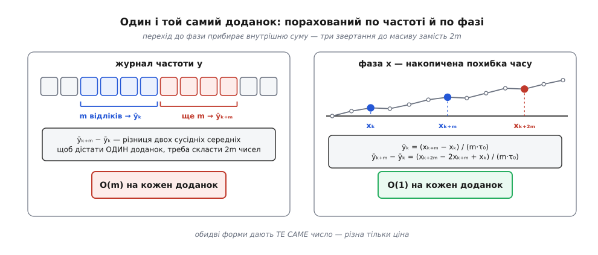
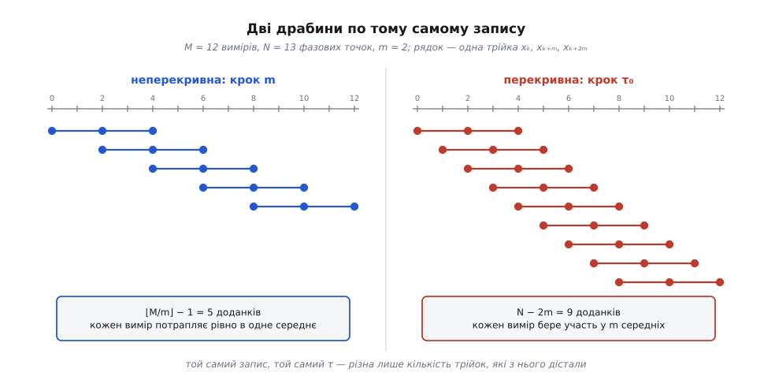
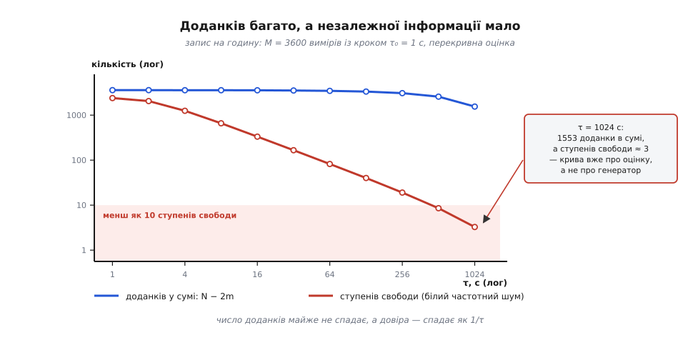

# ⚙️ Порахувати девіацію Аллана з журналу вимірів

На диску лежить текстовий файл: мільйон чисел, по одному на кожну секунду вимірювання. Треба перетворити його на таблицю «τ → σy(τ)», з якої малюють σ‑τ‑криву. Усієї роботи — кілька десятків рядків коду, і майже кожен із них має спосіб тихо видати правдоподібну, але хибну криву, не повідомивши про жодну помилку.

## Що на вході й що на виході

[Частотомір](topic:hw-sensing/frequency-counter), прив'язаний до опорного генератора, пише по одному числу на кожен свій відрізок вимірювання τ₀. Журнал буває у двох рівносильних формах:

```
частотний журнал:  yₖ — середнє відносне відхилення частоти за k-й відрізок τ₀
фазовий журнал:    xₖ — накопичена похибка часу на момент k·τ₀, у секундах

перехід:  yₖ = (xₖ₊₁ − xₖ) / τ₀        зворотний:  xₖ = τ₀ · (y₀ + y₁ + … + yₖ₋₁)
```

Зверніть увагу на рахунок: **M частотних вимірів дають N = M + 1 фазових точок**, бо кожен вимір — це різниця двох сусідніх фаз, а перша фаза є до всякого вимірювання (її нуль довільний). Ця одиничка — перше місце, де плутаються; тримайте її в голові з самого початку, бо далі всі межі циклів пишуться саме через N.

На виході — рядок на кожне τ. І в ньому має бути не два числа, а чотири (тут показано початок таблиці для годинного запису з кроком 1 с):

```
   tau, s      sigma_y(tau)   доданків   відрізків
        1        1.0042e-11       3599       3601
        2        7.0751e-12       3597       1800
        4        5.0238e-12       3593        900
      ...
```

Дві останні колонки — не декорація. «Доданків» — скільки різниць увійшло в суму; «відрізків» — скільки разів проміжок завдовжки τ узагалі вміщується в записі. Правду про надійність рядка каже **друга** з них, а не перша, — і без цих колонок правий кінець кривої неможливо чесно прочитати.

## Перший рух: перекласти журнал у фазу

Означення просить середніх за відрізок τ = m·τ₀ — тобто середніх по m сусідніх відліках:

```
ȳₖ(m) = (yₖ + yₖ₊₁ + … + yₖ₊ₘ₋₁) / m

σ²y(m·τ₀) = ½ · ⟨ (ȳₖ₊ₘ(m) − ȳₖ(m))² ⟩
```

Написане в лоб, це дорого. Щоб дістати **один** доданок суми, треба скласти m чисел, потім ще m, і аж тоді відняти: 2m звертань до масиву на кожен доданок. А доданків — майже стільки, скільки точок у записі. Отже, ціна одного τ росте як N·m, а на довгих τ це вбивчо.

Але ця сума складатися й не мусить — вона згортається сама. Підставмо кожен відлік через фазу, yₖ = (xₖ₊₁ − xₖ)/τ₀, і подивімось, що станеться в чисельнику: кінець кожного доданка збігається з початком наступного, і всі внутрішні фази взаємно знищуються.

```
ȳₖ(m) = [ (xₖ₊₁ − xₖ) + (xₖ₊₂ − xₖ₊₁) + … + (xₖ₊ₘ − xₖ₊ₘ₋₁) ] / (m·τ₀)
      = (xₖ₊ₘ − xₖ) / (m·τ₀)
```

Це вся хитрість, і вона очевидна, щойно сказана вголос: **середня частота за проміжок — це просто те, на скільки за цей проміжок утекла фаза, поділене на його довжину.** Ніякого усереднення рахувати не треба, бо фаза його вже порахувала — вона накопичувальна за побудовою.

Тепер різниця двох сусідніх середніх:

```
ȳₖ₊ₘ − ȳₖ = (xₖ₊₂ₘ − 2xₖ₊ₘ + xₖ) / (m·τ₀)
```

Друга різниця по трьох фазових точках, рознесених на m кроків. Хоч яке m — **три звертання до масиву**, не 2m. Уся оцінка набирає остаточного вигляду:

```
σ²y(m·τ₀) = 1/(2·(m·τ₀)²·(N − 2m)) · Σ (xₖ₊₂ₘ − 2xₖ₊ₘ + xₖ)²,   k = 0 … N−2m−1
```

Саме в цій формі формулу подає довідник NIST SP 1065 (W. J. Riley, *Handbook of Frequency Stability Analysis*, 2008); там-таки зауважено, що частотну форму з внутрішньою сумою на великих записах практично не вживають — саме через її ціну.



*Перехід до фази не змінює жодного числа — він змінює тільки ціну. Внутрішня сума зникає, бо накопичувати фаза вміє сама.*

Якщо ваш прилад пише фазу напряму — а часо-інтервальні лічильники саме так і роблять, вимірюючи різницю часу між фронтами двох сигналів, — інтегрувати нічого не треба: фаза для них рідна форма, а частота вже похідна від неї.

> 🔧 **Навіщо це.** Різниця не косметична. Мільйон точок, повна октавна драбина: у фазовій формі це близько 1.8×10⁷ других різниць — десятки мілісекунд. Та сама драбина в частотній формі коштує вже близько 10¹² звертань до масиву, бо ціна кожного наступного τ подвоюється разом із m. Одна алгебраїчна тотожність перетворює «поставив і пішов пити каву» на «поки клацнув мишею — готово».

## Скільки трійок брати: перекривна оцінка

Формула вимагає трійок фазових точок (k, k+m, k+2m). Лишається одна свобода: **які саме** трійки брати з запису. Тут і розходяться дві драбини.

**Неперекривна** (класична) вимагає, щоб жодні два середні не спиралися на той самий відлік: перше середнє з'їдає відліки з 0-го по (m−1)-й, друге — з m-го по (2m−1)-й, третє йде далі. Пари сусідніх середніх ідуть підряд, тож крок по фазовому індексу дорівнює m, а доданків виходить ⌊M/m⌋ − 1.

**Перекривна** зауважує, що формулі байдуже, з якого k починати трійку: кожен зсув на один крок τ₀ дає нову законну трійку. Крок — τ₀, доданків N − 2m.



*Той самий журнал, той самий τ — різна лише кількість трійок, яку з нього дістали.*

Різниця росте разом із τ. У годинному записі з кроком 1 с на τ = 64 с неперекривна драбина дає 55 доданків, перекривна — 3473: у шістдесят три рази більше з тих самих даних. На τ = 900 с неперекривна має аж три доданки, перекривна — 1801.

Задарма? Майже. Ціна одного τ росте з O(N/m) до O(N) — але це та ціна, яку фазова форма щойно зробила мізерною. Дорожча плата в іншому: сусідні трійки перекриваються майже повністю, тобто **міряють майже те саме**, і на довірі приріст позначається куди скромніше, ніж на кількості доданків. Наскільки скромніше — рахується точно, і це найважливіше число всієї процедури.

## Драбина τ: чому октавами

Криву читають у подвійному логарифмічному масштабі, де важать нахили. Отже, точки мають лягати рівномірно **там** — а рівномірність на лог-осі означає рівні множники, а не рівні кроки. Найприродніший множник — двійка: m = 1, 2, 4, 8, 16, … Такий крок звуть **октавним**, і log₂N точок накривають увесь доступний діапазон часів.

Чому не порахувати всі τ підряд? Ціна. Перекривна оцінка коштує N − 2m доданків на кожне m, тож усі m від 1 до N/2 разом дають приблизно N²/4:

```
N = 10⁶ точок:
  октавна драбина (m = 1, 2, 4, …):   1.8×10⁷ доданків   → мілісекунди
  усі τ підряд (m = 1, 2, 3, …):      2.5×10¹¹ доданків  → у 14 000 разів довше
```

А віддача з цих витрат була б мізерна: при m і m+1 трійки складаються майже з тих самих точок, тож сусідні значення σy(τ) відрізняються радше шумом оцінки, ніж змістом.

Мізерна — але не нульова. Суцільний прохід по всіх τ (або згущений, «багато τ») виявляє **періодичні** збурення: коли на генератор циклічно діє щось зовнішнє — термостат кондиціонера, добовий хід температури, — на кривій з'являється горб на характерному τ, а октавна драбина легко переступить через нього. Довідник NIST SP 1065 радить саме так: за норму — октавний або декадний крок, а суцільний прохід тримати як інструмент полювання на циклічні збурення.

## Робочий код

Лишилася одна річ, яку треба вирішити до написання коду: **пропуски**. У журналі бувають дірки — прилад загубив цикл, кабель смикнули, файл склеїли з двох сеансів. Пропуск не можна ані викинути, ані замінити нулем. Викинути — зсунеться вся часова сітка: проміжок із m індексів охопить уже (m + пропущені)·τ₀ реального часу, тобто буде довший, ніж каже його назва. Підставити нуль — фаза після дірки поїде на постійну величину, і кожна трійка, що перестрибує через неї, дасть фальшивий викид.

Правильно — **зберегти місце** пропуску й відкинути ті трійки, які його накривають. Перевіряти це перебором було б дорого (2m точок на кожну трійку), тож заводимо другий накопичувальний масив: ngₖ — скільки пропусків трапилося серед перших k вимірів. Тоді проміжок від k до k+2m чистий тоді й лише тоді, коли ng на його кінцях однакове:

```
трійка (k, k+m, k+2m) придатна  ⟺  ng[k+2m] == ng[k]
```

Одне порівняння замість перегляду 2m чисел — той самий фокус, що з фазою: накопичувальна сума відповідає на питання про будь-який відрізок за сталий час.

Далі код робить рівно чотири речі: читає журнал, знімає середню частоту (навіщо — у пастках нижче), одним проходом будує фазу й лічильник пропусків, і йде октавною драбиною.

:::tabs
```c
/* adev.c — перекривна девіація Аллана з журналу відносної частоти.
   Збірка:  cc -O2 -o adev adev.c -lm
   Виклик:  ./adev 1.0 < y.txt      // 1.0 — крок вимірювання τ₀, секунди
   Рядок журналу: число y (відносне відхилення частоти) або «*» — пропуск. */
#include <stdio.h>
#include <stdlib.h>
#include <math.h>

#define MIN_SPANS 10   /* менш як стільки незалежних відрізків τ у записі — не рахуємо */

int main(int argc, char **argv)
{
    double tau0 = (argc > 1) ? atof(argv[1]) : 1.0;

    /* 1. Прочитати журнал. Усе, що не парситься у скінченне число, — пропуск. */
    size_t cap = 4096, M = 0;
    double *y    = malloc(cap * sizeof *y);
    char   *miss = malloc(cap);
    if (!y || !miss) { perror("malloc"); return 1; }

    char buf[128];
    while (fgets(buf, sizeof buf, stdin)) {
        if (M == cap) {
            cap *= 2;
            y    = realloc(y, cap * sizeof *y);
            miss = realloc(miss, cap);
            if (!y || !miss) { perror("realloc"); return 1; }
        }
        char *end;
        double v = strtod(buf, &end);
        int ok = (end != buf) && isfinite(v);
        y[M]    = ok ? v : 0.0;
        miss[M] = !ok;
        M++;
    }
    if (M < 4) { fprintf(stderr, "замало даних\n"); return 1; }

    /* 2. Зняти середню частоту: девіація Аллана від сталого зсуву не залежить,
          а великий зсув під час інтегрування з'їдає значущі цифри. */
    double sum = 0.0;
    size_t nv = 0;
    for (size_t i = 0; i < M; i++)
        if (!miss[i]) { sum += y[i]; nv++; }
    double mean = nv ? sum / nv : 0.0;

    /* 3. Один прохід: фаза x (секунди) і наростальний лічильник пропусків.
          Фазових точок на одну більше, ніж вимірів. */
    size_t N = M + 1;
    double   *x  = malloc(N * sizeof *x);
    unsigned *ng = malloc(N * sizeof *ng);
    if (!x || !ng) { perror("malloc"); return 1; }
    x[0] = 0.0;
    ng[0] = 0;
    for (size_t i = 0; i < M; i++) {
        x[i + 1]  = x[i] + (miss[i] ? 0.0 : y[i] - mean) * tau0;
        ng[i + 1] = ng[i] + (unsigned) miss[i];
    }

    /* 4. Драбина τ октавами: m = 1, 2, 4, 8, … */
    printf("#   tau, s      sigma_y(tau)   доданків   відрізків\n");
    for (size_t m = 1; 2 * m < N && N / m >= MIN_SPANS; m *= 2) {
        double acc = 0.0;
        size_t k = 0;
        for (size_t i = 0; i + 2 * m < N; i++) {
            if (ng[i + 2 * m] != ng[i]) continue;   /* трійка накрила пропуск */
            double d = x[i + 2 * m] - 2.0 * x[i + m] + x[i];
            acc += d * d;
            k++;
        }
        if (k < 2) continue;
        double tau  = (double) m * tau0;
        double avar = acc / (2.0 * tau * tau * (double) k);
        printf("%9.4g  %14.4e  %9zu  %9zu\n", tau, sqrt(avar), k, N / m);
    }

    free(y); free(miss); free(x); free(ng);
    return 0;
}
```
```cpp
// adev.cpp — перекривна девіація Аллана з журналу відносної частоти.
// Збірка:  g++ -O2 -std=c++17 -o adev adev.cpp
// Виклик:  ./adev 1.0 < y.txt      // 1.0 — крок вимірювання τ₀, секунди
// Рядок журналу: число y (відносне відхилення частоти) або «*» — пропуск.
#include <cmath>
#include <iomanip>
#include <iostream>
#include <string>
#include <vector>

constexpr size_t MIN_SPANS = 10;   // менш як стільки незалежних відрізків τ у записі — не рахуємо

int main(int argc, char* argv[])
{
    double tau0 = (argc > 1) ? std::stod(argv[1]) : 1.0;

    // 1. Прочитати журнал. Усе, що не парситься у скінченне число, — пропуск.
    std::vector<double> y;
    std::vector<bool> miss;
    std::string line;

    while (std::getline(std::cin, line)) {
        if (line.empty()) continue;
        try {
            size_t idx = 0;
            double v = std::stod(line, &idx);
            bool ok = (idx > 0) && std::isfinite(v);
            y.push_back(ok ? v : 0.0);
            miss.push_back(!ok);
        } catch (const std::exception&) {
            y.push_back(0.0);
            miss.push_back(true);
        }
    }
    if (y.size() < 4) {
        std::cerr << "замало даних\n";
        return 1;
    }

    const size_t M = y.size();

    // 2. Зняти середню частоту: девіація Аллана від сталого зсуву не залежить,
    //    а великий зсув під час інтегрування з'їдає значущі цифри.
    double sum = 0.0;
    size_t nv = 0;
    for (size_t i = 0; i < M; ++i) {
        if (!miss[i]) {
            sum += y[i];
            ++nv;
        }
    }
    double mean = nv ? sum / nv : 0.0;

    // 3. Один прохід: фаза x (секунди) і наростальний лічильник пропусків.
    //    Фазових точок на одну більше, ніж вимірів.
    const size_t N = M + 1;
    std::vector<double> x(N, 0.0);
    std::vector<unsigned> ng(N, 0);

    for (size_t i = 0; i < M; ++i) {
        x[i + 1]  = x[i] + (miss[i] ? 0.0 : y[i] - mean) * tau0;
        ng[i + 1] = ng[i] + (miss[i] ? 1u : 0u);
    }

    // 4. Драбина τ октавами: m = 1, 2, 4, 8, …
    std::cout << "#   tau, s      sigma_y(tau)   доданків   відрізків\n";
    for (size_t m = 1; 2 * m < N && N / m >= MIN_SPANS; m *= 2) {
        double acc = 0.0;
        size_t k = 0;
        for (size_t i = 0; i + 2 * m < N; ++i) {
            if (ng[i + 2 * m] != ng[i]) continue;   // трійка накрила пропуск
            double d = x[i + 2 * m] - 2.0 * x[i + m] + x[i];
            acc += d * d;
            ++k;
        }
        if (k < 2) continue;
        double tau = static_cast<double>(m) * tau0;
        double avar = acc / (2.0 * tau * tau * static_cast<double>(k));
        std::cout << std::setw(9) << std::setprecision(4) << tau << "  "
                  << std::setw(14) << std::scientific << std::setprecision(4) << std::sqrt(avar) << "  "
                  << std::setw(9) << std::defaultfloat << k << "  "
                  << std::setw(9) << N / m << "\n";
    }

    return 0;
}
```
```python
#!/usr/bin/env python3
"""adev.py — перекривна девіація Аллана з журналу відносної частоти.

Виклик:  python adev.py y.txt 1.0      # 1.0 — крок вимірювання τ₀, секунди
Рядок журналу: число y (відносне відхилення частоти) або «*» — пропуск."""
import sys
import numpy as np

MIN_SPANS = 10      # менш як стільки незалежних відрізків τ у записі — не рахуємо


def adev_octaves(y, tau0, min_spans=MIN_SPANS):
    """Дає (τ, σy(τ), доданків, відрізків) для m = 1, 2, 4, 8, …"""
    y = np.asarray(y, dtype=np.float64)
    miss = ~np.isfinite(y)

    # зняти середню частоту: девіація Аллана від сталого зсуву не залежить,
    # а великий зсув під час інтегрування з'їдає значущі цифри
    y = np.where(miss, 0.0, y - y[~miss].mean())

    # один прохід: фаза (секунди) і наростальний лічильник пропусків;
    # фазових точок на одну більше, ніж вимірів
    x = np.concatenate(([0.0], np.cumsum(y) * tau0))
    ng = np.concatenate(([0], np.cumsum(miss)))
    n = x.size

    m = 1
    while 2 * m < n and n // m >= min_spans:
        keep = ng[2 * m:] == ng[:n - 2 * m]              # трійка не накрила пропуск
        d = (x[2 * m:] - 2.0 * x[m:n - m] + x[:n - 2 * m])[keep]
        if d.size >= 2:
            tau = m * tau0
            yield tau, np.sqrt(d @ d / (2.0 * tau * tau * d.size)), d.size, n // m
        m *= 2


if __name__ == "__main__":
    path, tau0 = sys.argv[1], float(sys.argv[2])
    y = np.genfromtxt(path)          # усе, що не число, стає NaN — це й є пропуски
    print("#   tau, s      sigma_y(tau)   доданків   відрізків")
    for tau, sigma, k, spans in adev_octaves(y, tau0):
        print("%9.4g  %14.4e  %9d  %9d" % (tau, sigma, k, spans))
```
:::

Сішний і C++ варіанти — це те, що ставлять у прилад або в конвеєр обробки, де журнал іде гігабайтами і дорога кожна кеш-промашка: вони читають потоком і тримають у пам'яті рівно потрібні масиви без зайвих накладних витрат (у C++ — через безпечні `std::vector` і RAII). Пайтонівський — це те, що відкривають у лабораторії поруч із побудовою графіка; уся внутрішня петля там сховалася в три зрізи масиву, і вона теж іде на рідній швидкості, бо всередині numpy той самий цикл.

## Скільки це коштує

```
інтегрування журналу:           O(N)         один прохід, дві накопичувальні суми
одне значення τ:                O(N)         три звертання × (N − 2m) доданків
октавна драбина (log₂N точок):  O(N·log N)

N = 10⁶ точок, повна октавна драбина:
  ≈1.8×10⁷ других різниць        → десятки мілісекунд
  N·8 байт (фаза) + N·4 байти (лічильник пропусків) ≈ 12 МБ пам'яті
```

Пам'ять і є справжня межа. Доба вимірювань із кроком 1 мс — це 8.6×10⁷ точок, тобто вже понад гігабайт; далі фазу в пам'яті не тримають, а читають блоками: для кожного m потрібні лише три точки, рознесені на відомі відстані, тож послідовний прохід файлом дає їх без завантаження всього масиву.

І контрольне число для порівняння: частотна форма з внутрішньою сумою коштує N·m на кожне τ, тобто на всій октавній драбині — близько N². Для мільйона точок це різниця між десятками мілісекунд і доброю чвертю години.

## Пастка перша: правий кінець кривої розповідає про оцінку, а не про генератор

Формула працює, доки в сумі є хоч один доданок: N − 2m ≥ 1, тобто m ≤ (N−1)/2. Дійти до цієї межі — τ дорівнює половині запису — технічно можна. Змісту в цьому нуль, і ось чому.

Спокуслива підказка «доданків багато, отже надійно» — хибна саме для перекривної оцінки. Доданків справді багато й на довгих τ, але вони перекриваються майже цілком: сусідні трійки — це той самий проміжок, зсунутий на крок. Незалежної інформації в записі стільки, скільки разів у ньому вміщується проміжок завдовжки τ, тобто **N/m разів**, — і саме ця величина, а не число доданків, керує довірою.

Точний рахунок дає число ступенів свободи. Для білого частотного шуму перекривна оцінка має (за тим самим довідником NIST SP 1065):

```
edf = [ 3(N−1)/(2m) − 2(N−2)/N ] · 4m² / (4m² + 5)
```

Головний член тут — 3(N−1)/(2m): довіра спадає як 1/m, тобто як 1/τ, і на m ≈ N/2 сходить до одиниці.

**Годинний запис із кроком τ₀ = 1 с: M = 3600 вимірів, N = 3601 фазова точка.**

```
τ = 64 с (m = 64):
  доданків (перекривна):    N − 2m = 3601 − 128 = 3473
  доданків (неперекривна):  ⌊M/m⌋ − 1 = 56 − 1 = 55
  edf = [3·3600/128 − 2·3599/3601] · 16384/16389
      = [84.375 − 1.999] · 0.9997 ≈ 82

τ = 900 с (m = 900, чверть запису):
  доданків (перекривна):    3601 − 1800 = 1801
  edf = [3·3600/1800 − 1.999] · ≈1 = 6.000 − 1.999 ≈ 4.0

τ = 1800 с (m = 1800, половина запису — гранично можливе):
  доданків: 1        edf ≈ 1.0
```

Читається це так. По-перше, перекривність таки допомагає: на τ = 64 с вона дає 82 ступені свободи там, де неперекривна оцінка має 55 майже незалежних доданків, тобто приблизно стільки ж ступенів свободи. Приріст реальний, але вимірюється десятками відсотків — не в шістдесят три рази, як число доданків. По-друге й головне: на τ = 900 с сума має 1801 доданок і всього чотири ступені свободи. А чотири ступені свободи означають, що справжнє значення з 95-відсотковою певністю лежить десь між 0.60 і 2.87 від показаного — тобто точка гуляє в межах майже п'ятикратного розтягу, і жодне «але доданків же тисяча вісімсот» цього не рятує.



*Синя лінія — те, що бачить програміст; червона — те, що знає статистика. На правому краю драбини вони розходяться в сотні разів.*

Звідси й умова зупинки в коді: драбина обривається не там, де скінчилися доданки, а там, де в записі лишається менш як десяток незалежних відрізків завдовжки τ. Аналізатори роблять так само — у Stable32, наприклад, кожен тип дисперсії має власний «stop ratio», і максимальне m дістають діленням довжини запису на це число. Число 10 у `MIN_SPANS` — вибір консервативний, не священний; головне, щоб він був **свідомий**, бо типова помилка виглядає безневинно: крива задирається вгору на останніх точках, і її читають як дрейф чи старіння, тоді як це просто оцінка, що розсипалася. [Довірчі інтервали й ступені свободи оцінювача](topic:hw-sensing/allan-variance) — окрема статистична тема; для коду досить пам'ятати, що надійність рядка визначає остання колонка таблиці, а не передостання.

## Пастка друга: журнал мусить бути суцільним

Уся викладка вище тримається на одному тихому припущенні: відрізки вимірювання йдуть **стик у стик**. Інтегрування yₖ у фазу — це буквально твердження, що між кінцем k-го відрізка й початком (k+1)-го немає нічого.

Реальні прилади це припущення часто порушують. Між двома вимірами лічильник витрачає час на обробку й видачу результату, і в цю паузу — **мертвий час** — про поведінку генератора не відомо нічого. Наслідків два, і другий гірший за перший. Перший: оцінка зміщується, причому по-різному для різних типів шуму (поправки Барнса B₂ і B₃ існують, але потребують знати тип шуму заздалегідь — тобто те, заради чого криву й будували). Другий: **перетворити частоту у фазу стає просто неможливо**, бо накопичена сума перестає відповідати накопиченій похибці часу. Довідник NIST SP 1065 не пропонує тут хитрощів, а радить прямо: вимірювати без мертвого часу. Практично це означає режим лічильника, у якому відліки суцільні, — його називають безрозривним або continuous.

## Пастка третя: не всякий частотомір міряє те, що ви думаєте

Навіть суцільний журнал не гарантує, що в ньому лежать ті самі yₖ, яких хоче формула. Означення дисперсії Аллана вимагає **простого середнього** частоти за відрізок τ₀ — з рівною вагою по всьому вікну; лічильники, що так роблять, звуть лічильниками Π-типу (за прямокутною формою вагового вікна).

Сучасні високороздільні лічильники здебільшого влаштовані інакше. Щоб виграти в роздільності, вони усереднюють багато сильно перекритих вимірів усередині одного вікна — а це дає вже не прямокутну, а трикутну вагу (Λ-тип), або й зважування за методом найменших квадратів. Енріко Рубіола показав ще 2005 року, чим це обертається: якщо ряд суцільних відліків такого лічильника подати у формулу двовибіркової дисперсії, на виході вийде **модифікована** девіація Аллана, а не звичайна (E. Rubiola, *Review of Scientific Instruments* 76, 054703, 2005; doi:10.1063/1.1898203).

Підступність у тому, що жодна помилка не виникне — крива намалюється й буде правдоподібною. Виявити підміну можна тільки за нахилом лівого кінця: там, де на [білому фазовому шумі](topic:ph-thermodynamics/white-noise-spectrum) звичайна девіація дає нахил −1, модифікована дає −3/2. Тобто ви впевнено визначите тип шуму — і визначите його неправильно. Ліки нехитрі: або взяти в лічильника сирий режим із прямокутним вікном, або чесно назвати результат модифікованою девіацією й порівнювати його з такими самими.

## Пастка четверта: викид гірший за пропуск

Пропуск принаймні чесний — він себе оголошує, і код вище його бачить. Викид не оголошує нічого. Один загублений період у 10 МГц — це стрибок фази на 100 нс: усі наступні відліки x зсуваються на цю величину назавжди. Зіпсованими виявляються 2m трійок — ті, що накривають стрибок, — і кожна з них дістає повні 10⁻⁷ с замість своїх 10⁻¹³. Внесок у дисперсію виходить приблизно Δ²/(m·τ₀²·N), тобто в девіації він спадає як 1/√τ:

```
одна втрата циклу, годинний запис (N = 3601, τ₀ = 1 с, Δ = 100 нс):
  σy(1 с) ≈ Δ / (τ₀·√N) = 10⁻⁷ / 60 ≈ 1.7×10⁻⁹
  а сам генератор давав 1.0×10⁻¹¹ — на два порядки менше
```

Нахил −1/2 — це точно нахил білого частотного шуму. Тобто збій не тільки підніме криву, а й прикинеться шумом: ви побачите «гірший генератор», а не поламаний вимір.

Шукати такі точки середнім і стандартним відхиленням марно: сам викид роздуває обидві ці міри й ховається за ними. Робастний спосіб — [медіана й медіанне абсолютне відхилення](topic:math-probability/robust-estimators): міряти розкид відхиленням від медіани, бо на медіану поодинокі велетні не впливають. Довідник NIST SP 1065 радить саме MAD із порогом близько п'яти, а знайдену точку — замінювати не інтерполяцією, а **пропуском**: інтерполяція вигадає дані, яких не було, і тихо занизить девіацію на коротких τ.

І окремо про формат журналу. Дірка мусить у ньому бути **записана** — рядком-заповнювачем або часовою міткою на кожному відліку. Файл, у якому невдалі виміри просто не потрапили в рядки, виглядає бездоганно суцільним, і жоден код не здогадається, що сітка часу поїхала.

## Пастка п'ята: значущі цифри витрачаються на те, що вас не цікавить

Рядок «зняти середню частоту» в коді виглядає косметичним. Він не косметичний.

Девіація Аллана до сталого зсуву частоти байдужа — різниця сусідів його викидає. Але **інтегрування** до нього аж ніяк не байдуже: постійна складова y накопичується у фазі лінійно й розганяє x до великих значень, тоді як корисна друга різниця лишається мікроскопічною. Обидва числа доводиться тримати в тому самому типі — а більше значущих цифр, ніж має тип, нізвідки не візьметься.

**Мільйон відліків із кроком 1 с (≈11.6 доби), зсув частоти 1 ppm, генератор із σy(1 с) = 1×10⁻¹³.**

```
накопичена фаза наприкінці:   |x| ≈ 10⁶ с · 10⁻⁶ = 1.01 с
корисна друга різниця:        ≈ √2 · τ₀ · σy = 1.4×10⁻¹³ с
відношення:                   ≈ 7×10¹²  — корисне сидить на 13 цифр нижче

float32 (≈7 значущих цифр):   σy(1 с) = 4.4×10⁻¹¹   замість 1.0×10⁻¹³
float64 (≈16 значущих цифр):  σy(1 с) = 1.0×10⁻¹³   ✓

після «y − ȳ» фаза більше не росте, а блукає біля нуля (|x| ≲ 10⁻¹⁰ с):
float32:                      σy(1 с) = 1.0×10⁻¹³   ✓
```

Найкрасномовніше в цьому прогоні інше. Якщо взяти генератор у сто разів кращий, а тоді ще вдесятеро — σy = 1×10⁻¹⁵ і 1×10⁻¹⁶, — float32 без знятого зсуву вперто видасть ті самі 4.4×10⁻¹¹. Число перестає залежати від генератора: воно міряє вже не прилад, а помилку заокруглення. Подвійна точність тут витримує, але запас у неї не безмежний — на 1×10⁻¹⁶ вона вже завищує результат відсотки на три. [Скільки цифр справді тримають числа з рухомою комою](topic:hw-arch/floating-point) — окрема тема; тут досить правила: **знімайте середнє перед інтегруванням**, це один рядок і повне лікування.

## Пастка шоста: дрейф — прибрати чи лишити, але не мовчки

Якщо генератор рівномірно сповзає — а [старіння кварцу](topic:hw-components/quartz-aging) саме так і виглядає, — перша різниця цього нахилу не прибирає: сталий зсув вона викидає, рівномірний нахил ні. Правий кінець кривої тоді чесно показує дрейф, а не шум.

Чесних відповідей дві. Або лишити як є й підписати, що крива включає дрейф. Або оцінити нахил, відняти його з журналу перед обчисленням — і теж підписати, бо після цієї операції права частина кривої говорить уже про залишкове блукання, а не про генератор як він є. Мовчазний варіант — прибрати й не сказати — робить криву непорівнянною ні з чиєю іншою, а порівнюваність і є єдина причина, чому цю величину взагалі стандартизували.

Жодна з цих пасток не викликає помилки й не спотворює форми кривої настільки, щоб це впало в око, — тим вони й небезпечні. Саме тому таблиця на виході має чотири колонки, а не дві: число доданків і число незалежних відрізків поруч із σy — це єдине, що дає побачити, у якому місці крива перестала розповідати про генератор.
