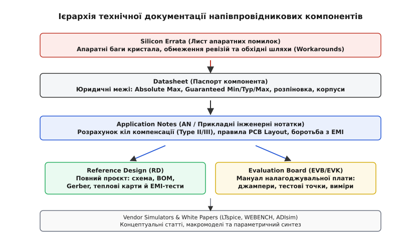
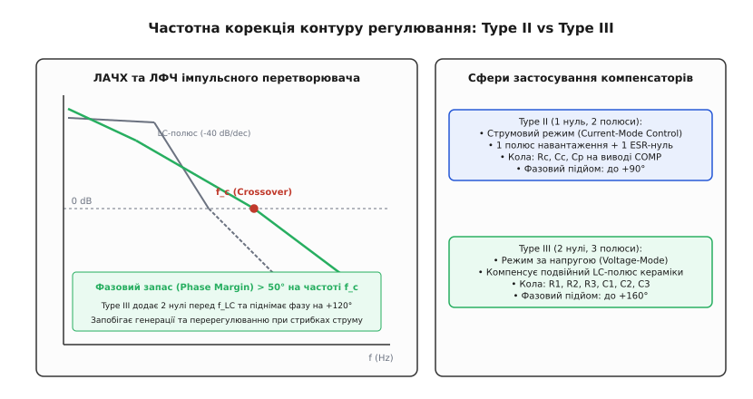
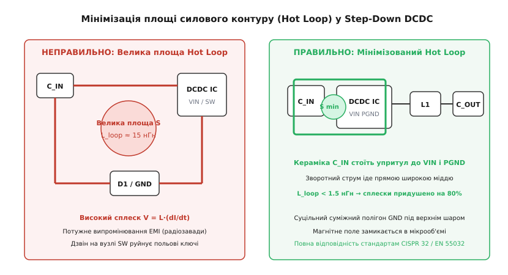
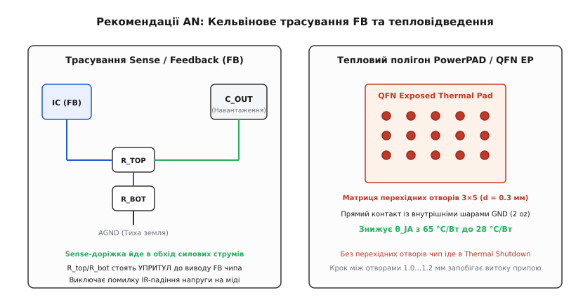
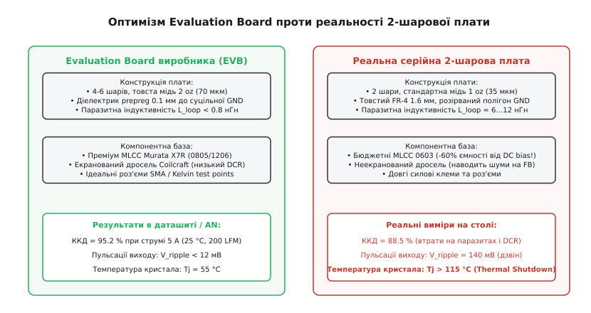

# Прикладні нотатки та референсні дизайни

<preknowlist>
- [Даташит — паспорт компонента: структура документа](root:hw-components/datasheet-structure) — призначення офіційної специфікації, карта розділів, таблиці меж і гарантованих параметрів.
- [Дрібний шрифт даташита та errata](root:hw-components/datasheet-fine-print) — умови виносок, типові значення (Typ) без гарантій та листи апаратних помилок кремнію.
- [Граничні режими та абсолютні максимуми](root:hw-components/abs-max-ratings) — різниця між Recommended Operating Conditions і руйнівними Absolute Maximum Ratings.
- [Стійкість ОП: запас фази і компенсація](root:hw-analog/opamp-stability) — критерій стійкості Найквіста, петльове підсилення, фазовий запас і частотна корекція.
- [Decoupling-конденсатор і фільтрація живлення](root:hw-components/decoupling) — паразитна індуктивність виводів і друкованих провідників, локалізація високочастотних імпульсних струмів.
- [Чотирипровідне (Кельвінове) підключення](root:hw-sensing/kelvin-connection) — поділ силових струмових і вимірювальних сигнальних кіл для усунення похибок від падіння напруги на опері міді.
- [Тепловий опір і розсіювання потужності](root:ph-thermodynamics/thermal-resistance) — передача тепла від напівпровідникового кристала до корпусу і навколишнього середовища через теплові опори.
- [Закон електромагнітної індукції Фарадея](root:ph-electromagnetism/faraday-law) — виникнення ЕРС самоіндукції та електромагнітного випромінювання при швидкій зміні струму в контурі.
</preknowlist>

Інженер створює компактний перетворювач живлення напругою 24 В у 3.3 В зі струмом навантаження 5 А. У даташиті на обрану мікросхему синхронного понижувального регулятора зазначено привабливі цифри: коефіцієнт корисної дії 95 %, вихідні пульсації менше 15 мВ і вбудований захист від перегріву. Схему зібрано за базовим зразком із першої сторінки паспорта на двошаровій платі з розрахунковими конденсаторами та дроселем.

Під час подачі навантаження 3.5 А пристрій раптово поводиться непередбачувано: вихідна напруга просідає, амплітуда пульсацій підскакує до 350 мВ, синій дросель видає чутний писк на частоті 12 кГц, а через сорок секунд мікросхема нагрівається до 125 °C і вимикається внутрішнім термозахистом. Одночасно сусідній мікроконтролер скидається за лінією живлення, а бездротовий модуль втрачає зв'язок через широкосмугові завади.

Спроба перевірити електричні параметри за таблицями даташита заходить у глухий кут: усі напруги живлення вкладаються в рекомендований діапазон, струм не перевищує граничний максимум, а компоненти справні. Причина аварії криється не в дефекті кристала, а в тому, що даташит фіксує лише статичні межі та ізольовані електричні характеристики кремнію. Він навмисно не містить повних розрахункових моделей петлі зворотного зв'язку для керамічних конденсаторів з нульовими втратами, не показує тривимірної геометрії високочастотних силових контурів і не попереджає, що тестова плата виробника охолоджувалася чотирма внутрішніми шарами міді.

Документами, що перетворюють розрізнений напівпровідниковий чип на надійну працюючу систему, є **прикладні нотатки** (*Application Notes, AN*) та **референсні дизайни** (*Reference Designs, RD*).

---

### Карта та ієрархія інженерної документації

У процесі проєктування електронного приладу розробник спирається на комплекс документів різного призначення, статусу та юридичної сили. Розуміння меж кожного з них захищає від хибних рішень.


*Ієрархія документації: від офіційного паспорта і списку апаратних помилок до прикладних посібників, готових схемотехнічних проектів і вендорних симуляторів. Кожен рівень відповідає на власне коло питань розробки.*

#### 1. Паспорт компонента (Datasheet)
Даташит є офіційною специфікацією та публічним контрактом між виробником напівпровідника і споживачем. Його зміст жорстко стандартизований:
- Граничні параметри (*Absolute Maximum Ratings*), перевищення яких знімає гарантію та руйнує кристал;
- Гарантовані робочі діапазони (*Recommended Operating Conditions*);
- Таблиці електричних характеристик із колонками Min, Typ, Max за чітко зафіксованих тестових умов (наприклад, `T_J = 25 °C`, `V_IN = 12 В`, статичне навантаження);
- Цоколівка, призначення виводів і креслення корпусів.

Даташит відповідає на запитання «*що цей кристал гарантовано витримує та які його межі*», але майже ніколи не пояснює «*як правильно розрахувати оточення для нестандартного режиму*».

#### 2. Прикладні інженерні нотатки (Application Notes, AN)
Прикладні нотатки пишуть інженери відділу застосування (*Applications Engineers, AE*) — фахівці, які щоденно стикаються зі складними випадками інтеграції чипів у клієнтські плати. Прикладна нотатка зосереджується на конкретній інженерній задачі:
- Повний математичний розрахунок передавальних функцій кіл зворотного зв'язку та стабілізації (компенсатори Type II / Type III);
- Фізика та топологія трасування друкованих плат (мінімізація випромінювання завад, відведення тепла);
- Проєктування захисту від електростатичного розряду (ESD) та перенапруг за стандартами IEC;
- Алгоритми калібрування аналого-цифрових трактів та програмні драйвери.

Нотатка не має юридичної сили гарантійного паспорта, але надає фізичне та аналітичне підґрунтя для схемотехнічного синтезу.

#### 3. Референсні дизайни (Reference Designs, RD)
Референсний дизайн — це завершений, зібраний і всебічно випробуваний у лабораторії прототип функціонального вузла чи цілого пристрою (наприклад, 65-ватне джерело живлення USB-PD на GaN-транзисторах, 8-канальний вимірювальний модуль термопар чи бездротовий контролер двигуна). Виробник надає повний пакет конструкторської документації:
- Принципові електричні схеми;
- Перелік компонентів (Bill of Materials, BOM) із зазначенням конкретних артикулів виробників;
- Файли трасування друкованих плат (Gerber / CAD-проєкти);
- Звіти випробувань (Test Reports): термограми тепловізором під повним навантаженням, графіки ККД, осцилограми перехідних процесів і спектрограми випробувань на електромагнітну сумісність (EMC) у безвідлунній камері.

#### 4. Посібники налагоджувальних плат (Evaluation Board / Evaluation Kit User Guides)
Ці мануали описують апаратну конфігурацію демонстраційних плат (EVB/EVK), які виробник продає для швидкої оцінки можливостей чипа на лабораторному столі. Вони пояснюють призначення тестових контактів, положення джамперів, методику підключення вимірювальних щупів осцилографа та вимоги до живлення.

#### 5. Концептуальні статті (White Papers)
Аналітичні публікації науково-дослідних відділів, присвячені порівнянню нових технологій (наприклад, переваги карбіду кремнію SiC над традиційним кремнієм у високовольтних інверторах) чи загальним системним архітектурам.

#### 6. Листи апаратних помилок (Silicon Errata)
Документ найвищого пріоритету правди. Якщо в кристалі виявлено апаратну ваду (наприклад, зависання модуля I2C при зміні частоти шини або помилка розрядності АЦП), саме Errata описує дефект і надає обов'язковий програмний або схемотехнічний обхідний шлях (*Workaround*).

---

### Практична цінність прикладних нотаток

Головна цінність Application Notes полягає в тому, що вони розкривають фізичні процеси, приховані за простими виводами мікросхеми. Розгляньмо чотири критичні напрямки, де без прикладних нотаток неможливо створити надійний пристрій.

#### 1. Синтез компенсації зворотного зв'язку DCDC-перетворювачів

Імпульсний перетворювач із замкненим контуром керування є динамічною системою. Вихідний силовий LC-фільтр другого порядку створює подвійний полюс на частоті резонансу:

```
f_0 = 1 / ( 2 · π · √(L · C_out) )
```

На цій частоті фаза сигналу в петлі зворотного зв'язку різко падає на −180°, а коефіцієнт передачі спадає зі швидкістю −40 дБ на декаду. Якщо в схемі використано сучасні керамічні конденсатори MLCC з мізерним власним послідовним опором (ESR < 5 мОм), фазовий зсув залишається на рівні −180° аж до мегагерцових частот. Без спеціальної частотної корекції петля зворотного зв'язку збуджується, перетворюючи стабілізатор на автогенератор.


*Діаграма Боде для контуру стабілізатора. Некомпенсований LC-фільтр завалює фазу на 180°. Компенсатор Type III додає два нулі та піднімає фазу на 120° у зоні частоти зрізу f_c, забезпечуючи фазовий запас понад 50°.*

Прикладні нотатки надають точні аналітичні формули для двох базових типів компенсаторів:
- **Type II (1 нуль, 2 полюси)**: застосовується для мікросхем зі струмовим керуванням (*Current-Mode Control*), де внутрішній контур струму розщеплює подвійний LC-полюс, залишаючи в силовій частині лише один домінантний полюс навантаження. Компенсатор додає до +90° фази за допомогою ланцюжка `R_c`, `C_c`, `C_p` на виводі COMP;
- **Type III (2 нулі, 3 полюси)**: застосовується для перетворювачів із керуванням за напругою (*Voltage-Mode Control*) та вихідними керамічними конденсаторами. Ланцюг із шести пасивних компонентів (`R1, R2, R3, C1, C2, C3`) навколо операційного підсилювача формує фазовий підйом до +140°…160°, повністю нейтралізуючи завал фази подвійного LC-полюса.

Повний математичний вивід передавальних функцій, розташування полюсів і нулів та практичний приклад розрахунку наведено у вставці [математичний розрахунок і виведення компенсаторів Type II та Type III](root:hw-components/application-notes/math-compensation-calc.md).

#### 2. Мінімізація силових контурів Hot Loops та боротьба з EMI

Найбільш руйнівним джерелом електромагнітних завад у силовій електроніці є паразитні індуктивності друкованих провідників у контурах із високою швидкістю зміни струму `di / dt` — так званих **гарячих контурах** (*Hot Loops*).

У понижувальному перетворювачі струм у контурі «вхідний конденсатор `C_in` — верхній польовий транзистор — нижній діод/транзистор — земляний вивід `PGND`» перемикається практично миттєво: струм 5 А наростає або спадає за час `t_sw = 3…5 нс`, що створює колосальну швидкість комутації `di / dt ≈ 10⁹ А/с` (один мільярд амперів на секунду).

За [законом електромагнітної індукції Фарадея](root:ph-electromagnetism/faraday-law) будь-яка паразитна індуктивність доріжки `L_loop` формує комутаційний сплеск напруги:

```
V_spike = L_loop · (di / dt)
```

Всього 10 мм друкованого провідника на платі мають власну індуктивність близько `10 нГн`. При комутації струму виникає індуктивний викид:

```
V_spike = 10 · 10⁻⁹ Гн · 1 · 10⁹ А/с = 10 В
```

Цей викид додається до напруги живлення 24 В, піднімаючи піковий потенціал на виводі SW до 34 В. Якщо транзистор розраховано на 30 В [граничного абсолютного максимуму](root:hw-components/abs-max-ratings), кристал пробивається лавинним пробоєм під час першого ж циклу перемикання.

Крім того, за законами електродинаміки замкнений контур площею `S`, через який протікає високочастотний струм `I`, діє як рамкова антена з магнітним дипольним випромінюванням. Напруженість випромінюваного електричного поля в дальній зоні прямо пропорційна площі контуру та квадрату частоти:

```
E_rad ∝ S · I · f²
```


*Зліва: неправильне трасування з рознесеними компонентами утворює контур з індуктивністю 15 нГн, що породжує сплески напруги та потужні завади. Справа: правильне трасування за рекомендаціями AN — кераміка C_IN стоїть упритул до VIN і PGND, зводячи площу контуру та індуктивність до мінімуму.*

Прикладні нотатки формулюють суворе правило трасування: вхідний керамічний конденсатор `C_in` зобов'язаний розташовуватися фізично впритул (на відстані менше 1 мм) до виводів `VIN` та `PGND` мікросхеми, а зворотний струм повинен протікати безпосередньо у верхньому шарі міді без перехідних отворів. Це знижує площу контуру з 50 мм² до 4 мм², а індуктивність — до менш ніж 1 нГн, що придушує викиди напруги на 85 % і дозволяє пройти сертифікацію на електромагнітну сумісність (CISPR 32 / EN 55032 Class B).

#### 3. Кельвінове трасування зворотного зв'язку та теплові полігони

Два класичні правила трасування з прикладних нотаток, порушення яких зводить нанівець роботу будь-якої схеми:

1. **Кельвінове підключення лінії зворотного зв'язку (Sense Trace)**:
   Опір силової мідної доріжки завтовшки 35 мкм (1 oz) і завширшки 2 мм становить близько `2.5 мОм` на кожні 10 мм довжини. При струмі 5 А на такій ділянці виникає падіння напруги `ΔV = 5 А · 2.5 мОм = 12.5 мВ`. Якщо підключити верхній резистор дільника зворотного зв'язку до силової шини біля дроселя, а не безпосередньо на виводах вихідного конденсатора, похибка регулювання вихідної напруги перевищить 2 %. Резистивний дільник повинен стояти безпосередньо біля виводу FB мікросхеми, а сигнальна лінія Sense має йти окремою тонкою доріжкою через внутрішній шар, екранований суцільними земляними полігонами від комутаційного вузла SW.

2. **Тепловідвідний майданчик (PowerPAD / Exposed Pad) та масив отворів**:
   Мікросхеми в корпусах QFN або SOIC-8 з відкритим металевим черевом розсіюють до 80 % тепла через нижній майданчик безпосередньо в мідь друкованої плати. Сам по собі майданчик на верхньому шарі не здатний охолодити чип, оскільки площа верхньої міді обмежена іншими компонентами. Прикладні нотатки регламентують створення матриці теплових перехідних отворів (*Thermal Vias*) діаметром 0.3 мм із кроком 1.0…1.2 мм, які з'єднують підкладку чипа з суцільними внутрішніми та нижніми полігонами заземлення. Це знижує [еквівалентний тепловий опір](root:ph-thermodynamics/thermal-resistance) кристал-середовище `θ_JA` з 65 °C/Вт до менш ніж 28 °C/Вт, запобігаючи переходу мікросхеми в аварійний терморежим.


*Зліва: Кельвінове трасування лінії зворотного зв'язку FB в обхід силових провідників. Справа: матриця теплових перехідних отворів під відкритим майданчиком корпусу QFN, яка скидає тепло на внутрішні полігони заземлення.*

#### 4. Захист бутстрепного кола та боротьба з від'ємними викидами на вузлі SW

У схемах синхронних перетворювачів із N-канальним верхнім польовим транзистором для керування його затвором застосовують літаюче бутстрепне коло (*Bootstrap Circuit*), що складається з конденсатора `C_boot` та діода `D_boot`. У момент вимкнення нижнього транзистора під час мертвого часу (*Dead-Time*) струм дроселя продовжує текти через внутрішній паразитний діод транзистора, затягуючи комутаційний вузол SW у від'ємну область напруги: `V_SW = −0.7…−1.5 В`.

Якщо паразитна індуктивність земляного провідника велика, напруга на виводі SW короткочасно падає до `−3…−5 В`. Це призводить до критичних наслідків:
- Напруга на виводі бутстрепа `BOOT` відносно підкладки мікросхеми `GND` перевищує абсолютний максимум, пропалюючи затвор внутрішнього драйвера;
- У кремнієвому кристалі відмикаються паразитно сформовані NPN- і PNP-структури, викликаючи катастрофічний ефект защіпання (*Latch-Up*), який закорочує шину живлення всередині чипа та випалює мікросхему за частки мілісекунди.

Прикладні нотатки виробників напівпровідників детально пояснюють методи усунення цієї проблеми: встановлення зовнішнього швидкодіючого діода Шотткі паралельно нижньому транзистору для обмеження від'ємного потенціалу на рівні не нижче −0.3 В, введення послідовного резистора `R_boot = 2.2…4.7 Ом` для демпфування дзвону та мінімізація індуктивності ланцюга бутстрепа.

---

### Критичний аналіз: як не стати жертвою рекламного оптимізму

Розробник, який сліпо копіює параметри референсного дизайну або налагоджувальної плати (EVB) у комерційний серійний виріб, неминуче потрапляє в інженерну пастку. Виробник компонентів зацікавлений продемонструвати максимально можливі рекордні характеристики свого чипа («*Hero Numbers*»), тому конструкція демонстраційних плат суттєво відрізняється від реальних серійних пристроїв.


*Прірва між ідеальною демонстраційною платою виробника та серійним бюджетним виробом. Дорогі 4-шарові плати з товстою міддю та преміум-компонентами забезпечують ККД 95 %, тоді як 2-шарова конструкція з дешевими деталями стикається з перегрівом, шумами та втратою ємності конденсаторів.*

#### Анатомія ідеальної плати виробника (EVB)
- **Багатошарова структура**: плати EVB майже завжди виготовляють на 4 або 6 шарах із товщиною міді зовнішніх і внутрішніх шарів 2 oz (70 мкм замість стандартних 35 мкм або 18 мкм);
- **Ультратонкий препрег**: діелектрик між верхнім сигнальним шаром і суцільним шаром заземлення становить лише 0.1 мм (FR4 High-Tg), що зменшує петльову індуктивність силових контурів до рекордних 0.5…0.8 нГн;
- **Преміальні пасивні компоненти**: застосовано дорогі високодобротні екрановані дроселі (Coilcraft, Würth Elektronik) з ультранизьким активним опором обмотки (DCR) та конденсатори класу Murata X7R у великих корпусах (1206 / 1210);
- **Лабораторні умови вимірювання**: випробування проводять при фіксованій температурі навколишнього середовища 25 °C, із примусовим обдувом вентилятором зі швидкістю повітряного потоку 200 LFM (*Linear Feet per Minute*), на відкритому стенді без закритого пластикового корпусу та з вимірюванням напруг через позолочені коаксіальні SMA-роз'єми.

#### Реальність бюджетного серійного виробу
- **2-шарова плата з базовою міддю 1 oz (35 мкм)**: товщина склотекстоліту FR-4 становить стандартні 1.6 мм. Індуктивність контуру зі зворотним провідником на нижньому боці плати зростає у 5–10 разів (до 6…12 нГн);
- **Деградація ємності кераміки (DC-Bias Effect)**: заради економії площі встановлюють мініатюрні MLCC типорозміру 0603. Кераміка з діелектриком X5R/X7R під дією постійної напруги 12 В втрачає до 60…75 % номінальної ємності (конденсатор на 10 мкФ перетворюється на 2.5…3.0 мкФ!). Це зміщує частоту резонансу LC-фільтра вгору, руйнує фазовий запас і призводить до генерації;
- **Неекрановані дроселі**: дешеві відкриті дроселі розсіюють магнітний потік у навколишній простір, наводячи паразитні ЕРС прямо у високоомні ланцюги дільника зворотного зв'язку;
- **Реальні теплові умови**: прилад працює в герметичному корпусі без вентиляції за температури всередині 50…60 °C, де розсіювання навіть 1.5 Вт тепла розігріває кристал до 130 °C.

**Інженерне правило дератингу**: під час перенесення рішень із референсного дизайну в реальну серійну 2-шарову плату необхідно знижувати паспортний ККД на 4…7 %, закладати реальну ефективну ємність конденсаторів із поправкою на DC-bias, використовувати виключно екрановані індуктивності та перераховувати тепловий баланс за найгіршої температури експлуатації.

---

### Неузгодженості: Даташит, Errata та Application Notes

Під час розробки виникають ситуації, коли різні офіційні документи одного й того самого виробника прямо суперечать один одному. Розуміння ієрархії достовірності запобігає фатальним помилкам у схемі та прошивці.

```
                  ┌─────────────────────────────────┐
                  │      SILICON ERRATA SHEET       │   Найвищий пріоритет
                  │  (Фіксує реальні вади кристала) │   (Спростовує все інше)
                  └────────────────┬────────────────┘
                                   │
                  ┌────────────────▼────────────────┐
                  │       ОФІЦІЙНИЙ DATASHEET       │   Юридичний контракт
                  │ (Гарантовані електричні норми)  │   (Переважає над AN)
                  └────────────────┬────────────────┘
                                   │
                  ┌────────────────▼────────────────┐
                  │     APPLICATION NOTES (AN)      │   Інженерні рекомендації
                  │ (Методологія, розрахунки, код)  │   (Можуть застарівати)
                  └────────────────┬────────────────┘
                                   │
                  ┌────────────────▼────────────────┐
                  │      REFERENCE DESIGNS (RD)     │   Окремі реалізації
                  │ (Приклад під конкретні деталі)  │   (Не універсальна норма)
                  └─────────────────────────────────┘
```

#### Чому виникають суперечності
1. **Еволюція ревізій кремнію (Silicon Stepping)**:
   Прикладну нотатку часто пишуть на етапі запуску першої ревізії чипа (Rev A0). Інженери виявляють апаратну помилку в апаратному модулі (наприклад, збій тактування SPI) і пропонують програмний обхідний шлях (вставку додаткових затримок у мікросекундах). Через рік виробник випускає ревізію кремнію Rev B0, де помилку виправлено на рівні топології масок кристала. Якщо програміст сліпо копіює старий код із нотатки для нового чипа Rev B0, затримки сповільнюють роботу системи або взагалі викликають блокування шини.
2. **Застарівання рекомендованої компонентної бази**:
   Референсний дизайн п'ятирічної давнини містить електролітичні танталові конденсатори, для яких розраховано компенсатор Type II під високий ESR. Спроба замінити тантал на сучасні керамічні MLCC без перерахунку кіл корекції призводить до миттєвої втрати стійкості.
3. **Прямі помилки в розрахункових формулах**:
   У прикладних нотатках трапляються друкарські помилки в розмірностях або пропущені коефіцієнти `2π` у формулах частот зрізу. Даташит на мікросхему в цьому випадку має перевагу: якщо формула з нотатки суперечить графіку меж стійкості з даташита, вірити слід даташиту.

**Золоте правило арбітражу**:
1. Лист апаратних помилок (*Silicon Errata*) скасовує будь-які твердження даташита та нотаток;
2. Даташит визначає непорушні електричні межі;
3. Прикладні нотатки надають алгоритми та методики, але кожна формула повинна перевірятися на відповідність фізичній розмірності та здоровому інженерному глузду.

---

### Вендорні симулятори та утиліти розрахунку

Для прискорення проєктування виробники напівпровідників випускають спеціалізоване програмне забезпечення для параметричного синтезу та симуляції схем:

- **LTspice (Analog Devices / Linear Technology)**: один із найшвидших симуляторів аналогових і силових схем. Містить точні нелінійні макромоделі тисяч регуляторів, підсилювачів і комутаторів. Дозволяє моделювати перехідні процеси перемикання з дискретністю в частки наносекунди та знімати частотні характеристики за методом розриву петлі Міддлбрука (*Middlebrook Loop Gain Measurement*);
- **WEBENCH Power Designer (Texas Instruments)**: потужний хмарний інструмент, який за заданими вхідними та вихідними напругами й струмами автоматично синтезує принципову схему, розраховує номінали пасивних компонентів, вибирає реальні артикули з глобальних баз постачальників, будує графіки ККД, карти розподілу тепла та розраховує запас стійкості;
- **ADIsimPower / ADIsimPE (Analog Devices)**, **Infineon Designer**, **MPS Virtual Bench**: спеціалізовані середовища для оптимізації топологій імпульсних перетворювачів під критерії мінімальної вартості, мінімальної площі або максимального ККД.

```
Параметри ТЗ ──> [ Вендорний симулятор ] ──> Теоретична схема ──> [ Перевірка дератингу ] ──> Реальна плата
(Vin, Vout, I)     (WEBENCH / LTspice)        та номінали           (DC-bias, Layout, ESL)      (PCB Layout)
```

#### Критерій стійкості вхідного фільтра за Міддлбруком
Особливим напрямком, детально висвітленим у класичних нотатках (наприклад, Linear Technology AN-19, TI SNVA489), є розрахунок вхідного фільтра електромагнітної сумісності (EMC). Імпульсний стабілізатор зі стабілізованою вихідною потужністю має **від'ємний динамічний вхідний опір** на низьких частотах:

```
R_in_dyn = dV_in / dI_in = − (V_in)² / P_out
```

Коли напруга на вході підвищується, струм споживання падає, щоб зберегти постійну потужність навантаження. Якщо на вході встановлено LC-фільтр для придушення завад, його вихідний імпеданс `Z_out_filter(s)` взаємодіє з вхідним опором перетворювача `Z_in_reg(s)`.

Згідно з **критерієм стійкості Міддлбрука** (*Middlebrook Stability Criterion*), система зберігає стійкість лише за умови, що модуль вихідного імпедансу вхідного фільтра на всіх частотах суттєво менший за модуль вхідного імпедансу стабілізатора:

```
| Z_out_filter(f) | ≪ | Z_in_reg(f) |
```

Якщо пік резонансу вхідного LC-фільтра перевищить `|R_in_dyn|`, виникає негативне демпфування: вхідне коло стабілізатора починає генерувати релаксаційні автоколивання амплітудою в кілька вольтів. Прикладні нотатки надають формули розрахунку паралельного демпфуючого ланцюга (електролітичного конденсатора великої ємності з власним послідовним опором або демпфуючого резистора `R_damp = √(L_in / C_in)`), що зрізає добротність вхідного фільтра до безпечного рівня `Q ≤ 1`.

#### Межі застосування вендорних симуляторів
Симуляційні макромоделі є функціональними поведінковими еквівалентами (*Behavioral Macromodels*), а не повними тривимірними моделями кремнієвих кристалів. Вони мають суттєві спрощення:
- Моделі за замовчуванням не враховують паразитної індуктивності та опору друкованих доріжок плати;
- Моделі конденсаторів часто є ідеальними ємностями без урахування падіння ємності від прикладеної постійної напруги зміщення (DC-bias derating);
- Теплові ефекти та саморозігрів кристала зазвичай моделюються спрощено без урахування реальної конвекції в закритому об'ємі.

Симулятор є чудовим інструментом для перевірки первинної концепції та порівняння варіантів, але він не замінює критичного інженерного розрахунку та обов'язкових випробувань фізичного прототипу на лабораторному столі. Для практичної автоматизації розрахунків скористайтеся утилітою [програмний калькулятор та верифікатор параметрів стабілізатора](root:hw-components/application-notes/proj-switching-loop-calc.md).

#### Анатомія артефактів вимірювань: як правильно тестувати DCDC на столі

Один із найпоширеніших хибних висновків розробника — вважати, що стабілізатор генерує гігантські пульсації (наприклад, 250 мВ замість паспортних 15 мВ), коли насправді спотворення створює сам вимірювальний щуп осцилографа.

Класичний щуп із довгим земляним дротом і затискачем-«крокодилом» завдовжки 12…15 см утворює паразитний замкнений індуктивний контур площею близько 10…15 см². За [законом Фарадея](root:ph-electromagnetism/faraday-law) цей контур діє як приймальна антена, яка вловлює змінне магнітне поле від силового дроселя та комутаційного вузла SW. Наведений у земляному дроті імпульсний струм створює на екрані осцилографа фальшиві високочастотні голки амплітудою в сотні мілівольтів.

Прикладні нотатки виробників регламентують метод вимірювання пульсацій **Tip-and-Barrel** (або застосування спеціальної пружинної земляної насадки замість дроту). З щупа знімають пластиковий ковпачок, надягають коротку коаксіальну пружину і торкаються голкою безпосередньо виводу керамічного конденсатора `C_out`, а пружиною — його земляного контакту. Тільки такий спосіб усуває наведення антени та показує справжні мікровольтові пульсації вихідної напруги.

---

### Зведена методологія інженерного проєктування

Створення надійного електронного пристрою на базі сучасної компонентної бази зводиться до послідовного наскрізного процесу:

1. **Пошук і первинний відбір за даташитом**: аналіз першої сторінки, таблиць Absolute Maximum Ratings і Recommended Operating Conditions для відсікання невідповідних деталей;
2. **Вивчення прикладних нотаток (AN)**: вибір топології, математичний розрахунок пасивного оточення, кіл компенсації зворотного зв'язку та визначення правил трасування силових і чутливих ліній;
3. **Обов'язкова перевірка Silicon Errata**: звірка поточної ревізії кремнію на наявність невиправлених апаратних багів і закладання обхідних шляхів у схемотехніку та мікропрограму;
4. **Адаптація Reference Design під реальні обмеження**: дератинг параметрів компонентів, вибір екранованих індуктивностей, врахування DC-bias кераміки та проєктування багатоточкового тепловідведення під реальну кількість шарів плати;
5. **Симуляція та bench-тестування**: верифікація в LTspice/WEBENCH із наступним вимірюванням на фізичному прототипі — зняттям осцилограм на вузлі SW на наявність дзвону методом короткої земляної пружини, термографуванням тепловізором під максимальним навантаженням і контролем спектра завад ближньопольовими пробниками.
