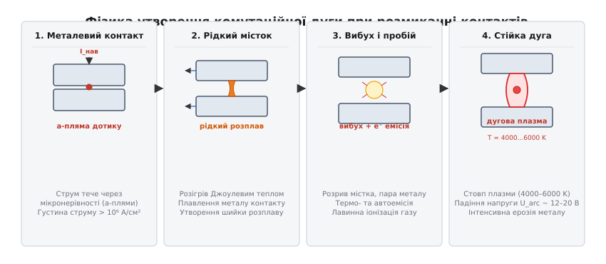
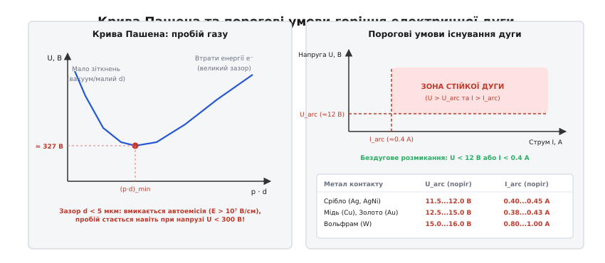
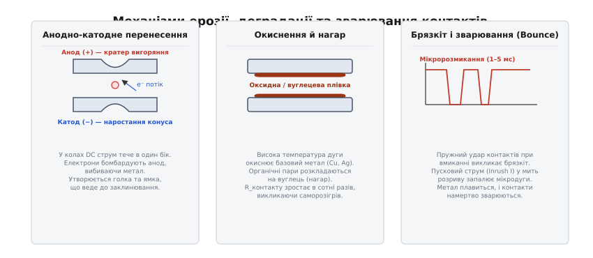
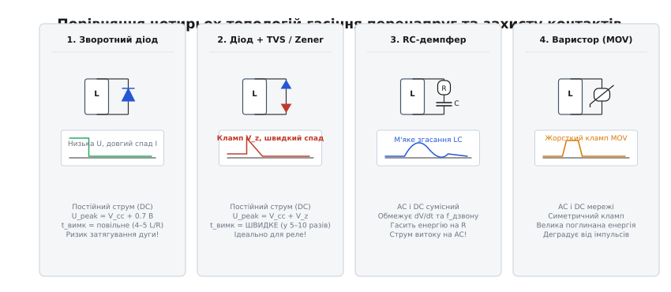
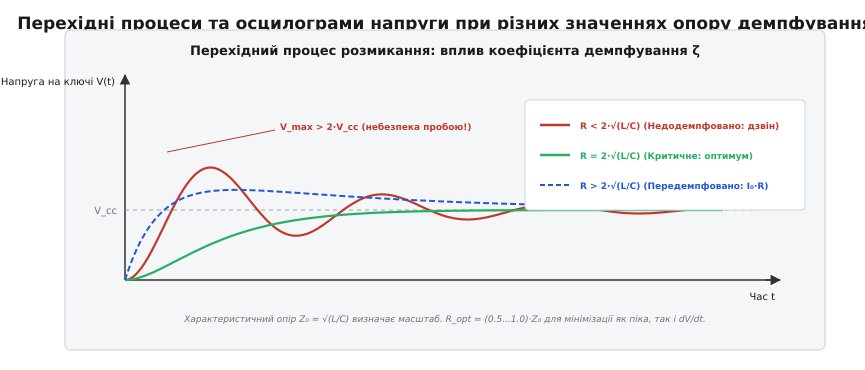
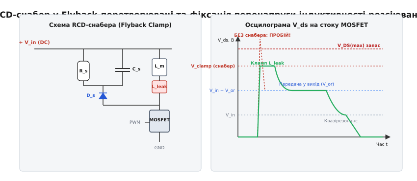

# Гасіння дуги та снабери

<preknowlist>
- [Брикання котушки: викиди напруги при комутації](root:hw-components/inductor-kickback) — виникнення ЕРС самоіндукції V = L·di/dt та індуктивного сплеску при обриві струму.
- [Енергія котушки](root:ph-electromagnetism/inductor-energy) — накопичення енергії магнітного поля W = ½·L·I² в індуктивних елементах та механізм її вивільнення.
- [TVS-діод](root:hw-components/tvs-diode) — кремнієвий напівпровідниковий обмежувач перенапруг для швидкого затискання імпульсів.
- [Варистор](root:hw-components/varistor) — нелінійний керамічний опір на основі оксиду цинку для поглинання комутаційних та грозових сплесків.
- [Газорозрядник](root:hw-components/gdt) — комутаційний захисний прилад з низькою напругою дугового розряду для відведення великих імпульсних струмів.
- [Зворотне відновлення діода](root:hw-components/reverse-recovery) — перехідні процеси розсмоктування неосновних носіїв у p-n переході.
- [RC-кола та стала часу](root:hw-analog/rc-time-constant) — процеси заряду й розряду ємності через опір за експоненційним законом.
- [Транзисторний ключ](root:hw-components/transistor-switch) — робота біполярних і польових транзисторів у ключовому режимі комутації навантаження.
</preknowlist>

Промислове реле постійного струму з напругою живлення 24 В комутує електромагнітний клапан гідросистеми зі струмом 2 А та індуктивністю обмотки 0.5 Гн. У замкненому стані в магнітному полі соленоїда накопичено рівно 1 Дж енергії (`E = 0.5 · L · I²`). У мить розмикання контактів пружина реле починає розводити електроди зі швидкістю 0.5 м/с. Струм намагається обірватися за 1 мікросекунду, через що на розриві індуктивність наводить ЕРС самоіндукції `V = L · (di/dt) = 0.5 · (2 / 10⁻⁶) = 1 000 000 В`. Навіть коли контакти розійшлися лише на 1 мікрометр, напруженість поля між ними досягає гігантських значень, повітряний зазор пробивається, і між електродами спалахує сліпучий плазмовий шнур електричної дуги з температурою понад 5000 °C.

Ця плазма розплавляє срібне покриття контактів зі швидкістю кількох мікрограмів за комутацію. За кілька сотень спрацьовувань метал випаровується, на поверхні утворюються глибокі кратери, а під час чергового замикання пружний удар і брязкіт контактів у ванні рідкого металу спричиняють їхнє надійне приварювання одне до одного. Соленоїд зависає у ввімкненому стані, а якщо комутація виконувалася напівпровідниковим транзистором без захисту — ключ пробивається наскрізь за перші ж 50 наносекунд.

Крім прямого механічного руйнування контактів, комутаційна дуга генерує надширокосмуговий імпульсний шум у діапазоні від 100 кГц до 1 ГГц. Швидкозмінні струми дугового розряду наводять паразитні перешкоди на сусідні цифрові шини зв'язку (I2C, SPI, CAN), викликаючи зависання керуючих мікроконтролерів і скидання лічильників датчиків.

Єдиний спосіб запобігти руйнуванню комутаційних вузлів полягає у створенні паралельного шляху для індуктивного струму в момент розриву та поглинанні енергії магнітного поля зовнішніми ланцюгами. Комплекс цих схемотехнічних рішень називають **гасінням дуги** (*англ. arc suppression*), а спеціалізовані демпфувальні ланцюги — **снаберами** (*англ. snubber від to snub — «обривати, стримувати, гасити»*).

---

### 1. Фізика виникнення комутаційної дуги: мікроконтактна геометрія та закон Пашена

Щоб ліквідувати комутаційну дугу, необхідно зрозуміти фізичний механізм її зародження. Помилково вважати, що дуга — це звичайна іскра, яка проскакує у повітрі. Механізм комутаційного дугоутворення проходить чотири послідовні фази.


*Чотири фази народження комутаційної дуги: від стягування струму в мікроплями дотику та утворення рідкого металевого містка Гольма до його вибухового випаровування й переходу в стаціонарний стовп дугової плазми.*

#### Фаза 1. Стягування струму в мікроплями (a-spots)
На мікроскопічному рівні поверхня металевих контактів ніколи не буває абсолютно плоскою: вона складається з мікронерівностей, виступів і западин. Коли контакти реле чи контактора стулені під механічним зусиллям пружини, вони торкаються лише вершинами мікронерівностей. Сумарна площа фізичного контакту становить менше 0.1 % від геометричної площі контактної пластини.

Увесь робочий струм кола змушений стягуватися у ці мікроскопічні перешийки завширшки від 1 до 10 мкм — **a-плями** (*англ. constriction spots*). Густина струму в зоні a-плям досягає колосальних значень:

```
j = I / S_a > 10⁶…10⁷ А/см²
```

Згідно із законом Кольрауша — Гольма, що ґрунтується на законі теплопровідності та електропровідності Відемана — Франца — Лоренца, температура в точці мікроконтакту `T_max` жорстко пов'язана з падінням напруги на контактах `U_c`:

```
U_c² = 8 · L_w · (T_max² - T_0²)
```
де `L_w = 2.44 · 10⁻⁸ В²/K²` — число Лоренца, а `T_0` — температура тіла контакту.

З цієї залежності випливає: щойно через перехідний опір або зменшення зусилля притискання падіння напруги на контакті досягає всього `0.3…0.4 В`, температура металу в a-плямі миттєво підскакує до точки плавлення срібла чи міді (`T > 1000 °C`).

#### Фаза 2. Рідкий металевий місток Гольма
Коли контакти починають механічно розходитися, контактне зусилля спадає до нуля. Кількість a-плям зменшується до єдиної останньої точки дотику. Метал у цій точці плавиться, утворюючи краплю розплаву, яка під дією сил поверхневого натягу витягується в шийку між електродами — **рідкий місток Гольма**.

При подальшому розведенні контактів довжина рідкого містка сягає кількох мікрометрів, опір зростає, напруга на ньому підвищується до напруги кипіння металу (`0.8…1.2 В`), і місток вибухоподібно випаровується.

#### Фаза 3. Вибухова автоемісія та іонізація
У мить розриву рідкого містка зазор між контактами становить мізерні частки мікрометра (`d < 1 мкм`). Індуктивність кола генерує сплеск напруги в сотні вольтів. Напруженість електричного поля в зазорі сягає:

```
E = U / d > 10⁷…10⁸ В/см
```

Таке надвисоке поле знижує потенційний бар'єр на поверхні катода, викликаючи польову **автоелектронну емісію** (квантовомеханічне тунелювання електронів крізь бар'єр) разом із потужною **термоелектронною емісією** з розжареної вибухом мікрокрапки. Потік електронів вривається в хмару щойно випаруваного металу контактів.

#### Фаза 4. Лавинна іонізація та стовп дуги
Потенціал іонізації пари металу (срібло — 7.57 еВ, мідь — 7.72 еВ) удвічі менший за потенціал іонізації азоту й кисню повітря (14–15 еВ). Електрони легко вибивають нові електрони з атомів металевої пари за механізмом лавин Таунсенда. Зазор миттєво заповнюється високотемпературною квазінейтральною плазмою — утворюється стабільний дуговий розряд.


*Зліва — закон Пашена для газового пробою: на зазорах d > 10 мкм діє мінімум 327 В, проте на зазорах d < 5 мкм автоемісія пробиває проміжок при низьких напругах. Справа — порогові межі існування стійкої дуги (U_arc, I_arc) для контактних матеріалів.*

#### Порогові умови горіння електричної дуги
Електрична дуга не може горіти при довільно малих значеннях струму та напруги. Для кожного металу існує фундаментальний фізичний поріг:
1. **Мінімальна напруга дуги `U_arc`** (типово 10–15 В) — це сума катодного та анодного падінь напруги, необхідних для підтримки автоемісії та нагріву плазми.
2. **Мінімальний струм дуги `I_arc`** (типово 0.1–0.5 А) — струм, нижче якого тепловиділення в каналі розряду стає меншим за тепловідвід у тіло контактів, плазма охолоджується, рекомбінує і дуга гасне.

| Матеріал контакту | Мінімальна напруга `U_arc`, В | Мінімальний струм `I_arc`, А | Температура плавлення, °C | Стійкість до зварювання |
| :--- | :--- | :--- | :--- | :--- |
| **Срібло (Ag)** | 11.5–12.0 | 0.40–0.45 | 961 | Низька |
| **Срібло–оксид олова (AgSnO₂)** | 12.0–13.0 | 0.35–0.40 | >1000 | Дуже висока |
| **Срібло–нікель (AgNi)** | 11.5–12.5 | 0.40–0.45 | >1000 | Середня |
| **Мідь (Cu)** | 12.5–13.0 | 0.40–0.43 | 1083 | Низька (окиснюється) |
| **Золото (Au)** | 14.5–15.0 | 0.38–0.40 | 1064 | Вкрай низька |
| **Вольфрам (W)** | 15.0–16.0 | 0.80–1.00 | 3422 | Найвища |

#### Металургія контактних сплавів
Через низьку стійкість чистого срібла до зварювання в сучасних силових реле застосовують композитні металокерамічні сплави. Раніше масово використовували сплав срібло–оксид кадмію (AgCdO), проте через токсичність кадмію директива RoHS зобов'язала перейти на **срібло–оксид олова (AgSnO₂)** та **срібло–нікель (AgNi)**. Мікроскопічні непровідні включення оксиду олова `SnO₂` дисперсно розподілені в срібній матриці. Коли контакт плавиться під дією дуги, оксид олова не дає краплі рідкого розплаву стягуватися в єдиний монолітний місток, розбиваючи розплав на мікровогнища і запобігаючи схоплюванню контактів.

З порогових значень випливає ключове правило бездугової комутації: **якщо напруга живлення кола `V_cc < 12 В` або сталий робочий струм `I < 0.3 А`, електрична дуга в повітрі не здатна перейти в стаціонарне горіння**. Саме тому низьковольтні 5-вольтові та 3.3-вольтові логічні кола ніколи не страждають від дугової ерозії, тоді як кола 24 В постійного струму та 230 В змінного струму є головною зоною дугового ризику.

> 📜 **Історичний екскурс:** Докладний розбір експериментів Деві, Пашена, Таунсенда та теорії контактного містка Гольма наведено у вставці [Від вольтової дуги Деві до закону Пашена та фізики контактів Гольма](root:hw-components/arc-suppression/hist-paschen-switching-arc.md).

---

### 2. Механізми ерозії та деградації контактів

Горіння комутаційної дуги та протікання великих струмів викликають руйнування контактів через три основні фізичні процеси: полярне перенесення металу, окиснення й термічне зварювання при брязкоті.


*Три головні дефекти контактної пари: анодно-катодне перенесення речовини з формуванням голки та кратера, високотемпературне окиснення поверхні з ростом перехідного опору та зварювання контактів при пружному брязкоті (bounce).*

#### Полярне перенесення металу (анодна та катодна ерозія)
У колах постійного струму (DC) напрямок руху заряджених частинок є незмінним. Це призводить до асиметричного зносу:
* **Короткодугова та мостова ерозія**: у початковий момент розмикання при довжині дуги менше 5 мкм потік електронів із катода бомбардує анод, викликаючи його локальне випаровування. Метал іонізується, летить до катода і осідає на ньому. На аноді утворюється **кратер**, а на катоді виростає загострений **конус (пік)**.
* **Довгодугова ерозія**: при великих зазорах і високій напрузі важкі позитивні іони плазми розганяються полем до катода і бомбардують його, вибиваючи метал у зворотному напрямку.

З часом наростаючий конус заходить у кратер протилежного контакту. При наступному замиканні виникає механічне заклинювання (*mechanical interlock*), і реле не може розімкнутися навіть після зняття напруги з котушки.

У колах змінного струму (AC) полярність змінюється кожні 10 мс (при 50 Гц), тому ерозія розподіляється між обома електродами симетрично, не утворюючи спрямованих конусів, а викликаючи рівномірне сплощення та вигоряння.

#### Окиснення та карбонізація
Температура дуги сягає 4000–6000 K. За таких умов мідь і срібло реагують із киснем повітря, утворюючи плівки оксидів `CuO` та `Ag₂O`. Якщо реле герметизоване в пластиковому корпусі, дуга розкладає органічні пари полімеру корпусу, висаджуючи на контакти шар чистого аморфного вуглецю (нагар).

Опір контакту `R_c` зростає від початкових 10–50 мОм до сотень ом. Під час проходження робочого струму на цьому опорі виділяється постійне джоулеве тепло `I² · R_c`, контакти перегріваються, пластмасовий корпус плавиться, і реле виходить з ладу.

#### Брязкіт контактів (Contact Bounce) та зварювання
Коли рухомий контакт реле або контактора б'є по нерухомому під дією магнітного приводу, виникає серія пружних механічних відскоків — **брязкіт контактів** (*англ. contact chatter / bounce*). Контакти розмикаються й змикаються від 2 до 10 разів протягом 1–5 мікросекунд.

Якщо навантаження має ємнісний характер (наприклад, імпульсний блок живлення з незарядженими вхідними електролітами), у мить першого дотику пусковий струм (*inrush current*) сягає 50–200 А. Коли через 0.2 мс контакт пружно відскакує, розриваючи цей струм, між ними спалахує мікродуга колосальної потужності. Метал контактів перетворюється на рідку калюжу. При повторному змиканні контакти занурюються у розплав, охолоджуються й **намертво приварюються (contact welding)**.

---

### 3. Схеми гасіння дуги на котушці та контактах постійного струму (DC)

Для захисту напівпровідникових ключів (MOSFET, BJT) та механічних контактів у колах DC застосовують схеми, що надають контур для циркуляції індуктивного струму.


*Принципові схеми та осцилограми перехідних процесів для чотирьох базових топологій: простий діод, комбінація діод-TVS, RC-снабер та варистор.*

#### Зворотний діод (Flyback Diode)
Найпоширеніше рішення для котушок реле та електромагнітів постійного струму. Звичайний кремнієвий випрямний діод (наприклад, 1N4007) підключають паралельно індуктивності зустрічно напрузі живлення.

У мить вимкнення ключа струм індуктивності замикається через діод. Напруга на колекторі або стоку ключа надійно обмежується:

```
V_switch = V_cc + V_forward ≈ V_cc + 0.7…1.0 В
```

Однак цей метод має критичний побічний ефект: струм циркулює у контурі «котушка–діод», спадаючи за експонентою зі сталою часу:

```
τ = L / R_coil
```
Повне розсіювання енергії триває `t_decay ≈ 4…5 · τ` (типово від 15 до 50 мс для стандартних реле). Протягом усього цього часу якір реле утримується залишковим магнітним полем і відпадає дуже повільно. Пружина не може забезпечити високу швидкість розведення силових контактів, зазор росте мляво, і дуга на силових контактах горить значно довше.

#### Комбінація «Діод + Стабілітрон (Zener)» або «Діод + TVS»
Щоб усунути затримку відпускання якоря, послідовно зі зворотним діодом вмикають стабілітрон (або односпрямований TVS-діод) у зустрічному напрямку.

У момент комутації напруга на котушці підскакує до напруги лавинного пробою стабілітрона `V_z`. Швидкість спаду струму задається рівнянням:

```
di / dt = - (V_z + V_diode) / L
```

Час згасання струму скорочується в десятки разів:

```
t_decay ≈ (L · I_0) / (V_z + V_diode)
```

Напруга на комутаційному ключі фіксується на безпечному рівні:

```
V_switch = V_cc + V_z + V_diode
```

**Приклад розрахунку:** реле з обмоткою `L = 80 мГн`, струмом `I_0 = 0.5 А`, опором `R = 48 Ом` від джерела 24 В:
* Зі звичайним діодом: `τ = 80 мГн / 48 Ом = 1.67 мс`. Час відпускання `t = 5 · τ ≈ 8.3 мс`.
* Зі стабілітроном `V_z = 36 В`: `t_decay = (0.08 · 0.5) / (36 + 0.7) = 0.04 / 36.7 ≈ 1.09 мс` (у 7.6 раза швидше!). Якір відривається різко, запобігаючи зварюванню силових контактів.

> 🔌 **Компонентна вставка:** Детальне порівняння параметрів діодних, варисторних та ємнісних ланцюгів наведено у вставці [Схеми захисту комутаційних контактів і ключів: порівняльний аналіз](root:hw-components/arc-suppression/comp-contact-protection.md).

---

### 4. RC-снабери (демпфери): фізика коливального контуру та розрахунок

Коли комутація відбувається в колах змінного струму (AC), простий діод застосувати неможливо, оскільки він закорочував би джерело щопівперіоду. Універсальним рішенням для AC та DC є **послідовний RC-демпфер (RC-снабер)**.


*Вплив величини демпфувального опору R_s на форму напруги перехідного процесу. Критичне демпфування (R = 2·Z₀) ліквідує перерегулювання без початкового резистивного стрибка.*

#### Принцип фізичної дії RC-снабера
Снабер підключають або паралельно індуктивному навантаженню, або безпосередньо паралельно контактам перемикача.
1. **Роль конденсатора `C_s`**: у момент розмикання контактів напруга на конденсаторі не може змінитися стрибком (`v_c(0⁺) = 0`). Увесь струм індуктивності спрямовується на заряд ємності, обмежуючи швидкість наростання напруги на контактах:
   ```
   dV / dt = I_0 / C_s
   ```
   Поки напруга на ємності зростає, механічні контакти встигають розійтися на відстань, де електрична міцність повітряного зазору перевищує миттєву напругу. Дуга не спалахує.
2. **Роль резистора `R_s`**: якби резистора не було, індуктивність `L` та ємність `C_s` утворили б ідеальний коливальний контур без втрат. Напруга на ключі коливалася б із частотою `f_0 = 1 / (2π√(LC))` з амплітудою `V_peak = V_cc + I_0 · √(L/C)`, що перевищує напругу живлення у 2–3 рази. Резистор `R_s` вводить у контур активні втрати, перетворюючи енергію коливань на тепло і демпфуючи дзвін. Крім того, при наступному замиканні контактів `R_s` обмежує струм розряду конденсатора на безпечному рівні:
   ```
   I_discharge_peak = V_cc / R_s
   ```

#### Математичні умови критичного демпфування
Аналіз характеристичного рівняння перехідного процесу дає характеристичний (хвильовий) імпеданс контуру:

```
Z_0 = √(L / C_s)
```

Коефіцієнт демпфування системи:

```
ζ = (R_s / 2) · √(C_s / L) = R_s / (2 · Z_0)
```

* **Якщо `R_s < 2 · Z_0` (`ζ < 1`)**: контур недодемпфований. Виникає високочастотний дзвін і небезпечний викид напруги `V_max > 2 · V_cc`.
* **Якщо `R_s = 2 · Z_0` (`ζ = 1`)**: критичне демпфування. Перехідний процес аперіодичний і найшвидший, перерегулювання відсутнє.
* **Якщо `R_s > 2 · Z_0` (`ζ > 1`)**: передемпфування. У першу ж мить струм `I_0`, проходячи через `R_s`, створює резистивний стрибок напруги `ΔV = I_0 · R_s`.

На практиці обирають компромісне значення `R_s = (0.5…1.0) · √(L / C_s)`, що забезпечує швидке згасання коливань при незначному початковому стрибку.

#### Втрати потужності на резисторі снабера
За кожен такт комутації конденсатор заряджається та розряджається, розсіюючи на резисторі енергію `E = C_s · V_cc²`. Середня теплова потужність резистора при робочій частоті комутації `f_sw`:

```
P_resistor = C_s · V_cc² · f_sw
```

> 🧮 **Математична вставка:** Повне аналітичне виведення рівнянь RLC-контуру, коефіцієнтів згасання та розрахунок втрат потужності подано у вставці [Математичний розрахунок параметрів демпфувальних RC- та RCD-ланок](root:hw-components/arc-suppression/math-snubber-design.md).

---

### 5. Варистори (MOV) та напівпровідникові супресори (TVS)

Коли необхідно захистити силові контакти від сплесків невідомої або випадкової енергії в мережах змінного струму (230/400 В), застосовують твердотільні обмежувачі напруги прямої дії.

#### Металооксидні варистори (MOV)
Варистор виготовляють спіканням мікрокристалів оксиду цинку (ZnO) з домішками оксидів вісмуту, кобальту та марганцю. На межах зерен утворюються зустрічні бар'єри Шотткі.

Вольт-амперна характеристика варистора описується степеневим законом:

```
I = k · V^β
```
де `β = 30…50` — коефіцієнт нелінійності.

У черговому режимі варистор має опір понад 100 МОм. При перевищенні класифікаційної напруги бар'єри тунелюються, опір падає до часток ома, і варистор затискає напругу на рівні `V_clamp`.

**Головне обмеження варисторів — деградація**. Кожен поглинений енергетичний імпульс створює локальні мікропробої між зернами ZnO. Струм витоку варистора поступово зростає. При постійному підключенні до мережі варистор врешті-решт переходить у стан теплового розгону і руйнується з коротким замиканням. Тому варистори захищають послідовними плавкими запобіжниками або терморозмикачами.

#### Кремнієві TVS-супресори
TVS-діод є спеціалізованим напівпровідниковим p-n переходом із великою площею кристала, оптимізованим для роботи в режимі контрольованого лавинного пробою.

На відміну від варисторів, кремнієві TVS мають:
1. Пікосекундну швидкодію (`t_response < 1 пс` для односпрямованих діодів).
2. Чітку й стабільну напругу затискання без старіння та деградації (ресурс за кількістю імпульсів практично необмежений за умови дотримання пікової потужності `P_ppm`).
3. Для кіл змінного струму використовують **симетричні (двоспрямовані) TVS-діоди**, що містять два зустрічно увімкнених переходи в одному корпусі.

---

### 6. RCD-снабери в імпульсних перетворювачах живлення

В імпульсних джерелах живлення (зворотноходових Flyback та прямоходових Forward перетворювачах) перемикання відбувається на високих частотах (50–500 кГц).


*Принципова схема первинного кола Flyback-перетворювача з RCD-снабером та осцилограма напруги на стоку MOSFET. Снабер фіксує кіловольтний сплеск індуктивності розсіювання L_leak на безпечному рівні V_clamp.*

#### Проблема індуктивності розсіювання
Первинна та вторинна обмотки імпульсного трансформатора мають неідеальну магнітну пластинчасту зв'язку. Частина магнітного потоку замикається через повітря, утворюючи **паразитну індуктивність розсіювання `L_leak`** (типово 1–3 % від основної індуктивності первинної обмотки `L_pri`).

У момент вимкнення силового MOSFET струм первинної обмотки `I_peak` переривається. Енергія основного магнітного поля `L_m` передається у вторинну обмотку і навантаження, але енергія індуктивності розсіювання `E_leak = 0.5 · L_leak · I_peak²` фізично не зв'язана з вторинною обмоткою і не може туди вийти. Ця енергія заряджає власну ємність транзистора `C_oss`, генеруючи викид напруги до 1000–1500 В, що миттєво спалює 600-вольтовий MOSFET.

#### Принцип роботи RCD-снабера
Щоб утилізувати цей викид, паралельно первинній обмотці встановлюють ланцюг із надшвидкого діода `D_s` (Ultra-fast recovery diode), паралельного конденсатора `C_s` та розрядного резистора `R_s`.

1. Коли MOSFET закривається, напруга на стоку піднімається вище напруги живлення `V_in` та відбитої напруги вторинної обмотки `V_or = (N_p / N_s) · (V_out + V_diode)`.
2. Діод снабера `D_s` відкривається, і струм індуктивності розсіювання за мізерні 50–100 нс перекачується в ємність `C_s`.
3. Напруга на стоку надійно фіксується на рівні `V_ds_peak = V_in_max + V_snubber`.
4. Діод закривається, і протягом решти періоду накопичений заряд повільно розсіюється на резисторі `R_s`.

Розрахункова формула опору резистора RCD-снабера:

```
R_s = (2 · V_snubber · (V_snubber - V_or)) / (L_leak · I_peak² · f_sw)
```

---

### 7. Високовольтне та силове дугогасіння: магнітний видув, дугогасні камери та вакуум

У потужних контакторах промислової автоматики, автоматичних вимикачах на струми в сотні ампер і тягових контакторах електротранспорту енергія кола досягає десятків кілоджоулів, а напруга живлення сягає сотень і тисяч вольтів. У таких вузлах звичайних пасивних снаберів недостатньо: дуга неминуче виникає і повинна бути примусово погашена за кілька мілісекунд.

#### 1. Магнітне дугогасіння (магнітний видув)
Метод ґрунтується на дії сили Лоренца на провідник зі струмом у магнітному полі:

```
F = I · (l × B)
```

Біля контактів встановлюють постійні магніти або спеціальну котушку, увімкнену послідовно з контактами. Створене магнітне поле напрямлене перпендикулярно до осі дуги. Сила Лоренца з величезним прискоренням виштовхує плазмовий шнур дуги з міжелектродного простору вбік, розтягуючи його.

Довжина дуги збільшується у 10–50 разів. Напруга, необхідна для підтримки розряду, зростає вище напруги джерела живлення, стовп плазми інтенсивно охолоджується навколишнім повітрям, опір дуги стрімко збільшується, струм спадає до нуля, і дуга гасне.

#### 2. Дугогасні камери з деіонізаційними решітками (De-Ion Chutes)
Видута магнітним полем дуга заводиться всередину дугогасної камери, що складається з набору паралельних сталевих або мідних пластин, розташованих на відстані 1.5–3 мм одна від одної.

Потрапляючи в решітку, дуга розсікається металевими пластинами на `N` послідовних коротких мікродуг. Оскільки кожна мікродуга має власне катодне падіння напруги `U_cat ≈ 12…15 В`, сумарне мінімальне падіння напруги на всьому пакеті становить:

```
U_total_arc = N · U_cat
```
Якщо в камері встановлено 20 пластин, мінімальна напруга горіння дуги підскакує до `20 · 13 В = 260 В`. У мережі 230 В джерело живлення більше не може підтримувати розряд, плазма віддає тепло масивним металевим пластинам, деіонізується, і струм обривається.

#### 3. Вакуумні та елегазові переривачі
У високовольтних вимикачах (від 6 до 110 кВ) контакти розміщують усередині запаяної вакуумної колби з тиском менше `10⁻⁴ Па` (ліва гілка кривої Пашена). У вакуумі немає нейтральних молекул газу для створення лавинної іонізації. Дуга горить виключно в парах випаруваного з контактів металу. При першому ж переході змінного струму через нуль пара миттєво конденсується на стінках камери за час менше 5–10 мікросекунд, електрична міцність зазору відновлюється зі швидкістю понад `10 кВ/мкс`, і дуга не здатна запалитися повторно.

---

### 8. Практичний інженерний вибір та алгоритмічний захист

Вибір оптимального методу дугогасіння визначається типом струму, напругою та характером навантаження:

1. **Котушки реле та соленоїди DC (напруга до 48 В, струм до 2 А)**:
   * Найкращий вибір: комбінація **діод + стабілітрон (Zener)** або TVS-супресор.
   * Забезпечує миттєве відпускання якоря реле (`t < 2 мс`) при надійному захисті керуючого транзистора.
2. **Контакти реле, що комутують навантаження AC (230 В, 50 Гц)**:
   * Найкращий вибір: **послідовний RC-снабер** (типово 100 Ом + 0.1 мкФ, клас X2 на 275 В AC) паралельно контактам або навантаженню.
   * Додатково: паралельний **варистор (MOV)** діаметром 14–20 мм на напругу 275–300 В AC для захисту від грозових і мережевих сплесків.
3. **Високочастотні імпульсні перетворювачі (Flyback/Forward)**:
   * Найкращий вибір: **RCD-снабер** на первинній обмотці трансформатора з ретельно розрахованою потужністю розсіювання резистора.
4. **Твердотільні реле (Solid State Relays, SSR) на тиристорах та симісторах**:
   * Для індуктивних навантажень змінного струму слід обирати твердотільні реле з миттєвим увімкненням (*Random-fire SSR*), а не з перемиканням у нулі напруги (*Zero-crossing SSR*). Перемикання в нулі напруги на чистій індуктивності викликає асиметричний пусковий струм і глибоке магнітне насичення осердя трансформатора або двигуна.
5. **Захист від брязкоту контактів у мікроконтролерних системах**:
   * Апаратний RC-фільтр на вході GPIO для запобігання хибним перериванням.
   * Програмний алгоритм інтегрувального лічильника (*debounce algorithm*) з таймінгом утримання стабільного стану 10–20 мс.

> ⚙️ **Практична вставка:** Чисельне моделювання комутації, автоматичний підбір номіналів снабера за рядом E24 та програмний фільтр брязкоту на C та C++ подано у вставці [Моделювання та розрахунок перехідних процесів комутації й демпфування](root:hw-components/arc-suppression/proj-snubber-calc.md).

Гасіння дуги та демпфування перехідних процесів перетворює руйнівний викид магнітного поля `½·L·I²` на безпечне тепло всередині снабера, зберігаючи цілісність металевих контактів та ізоляції електронних компонентів.
