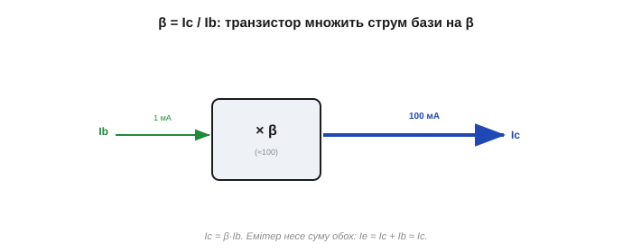
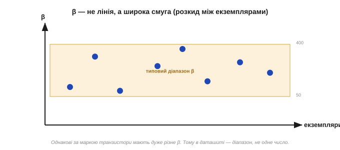
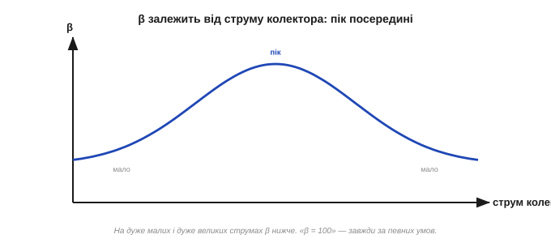
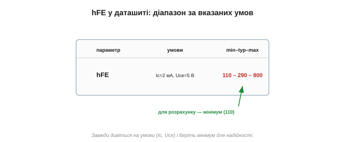
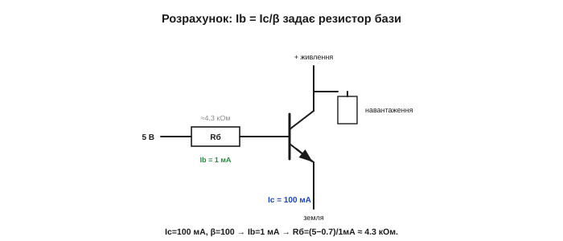
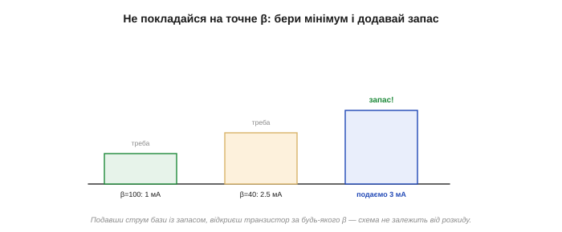

# Коефіцієнт підсилення β (hFE): Ic = β·Ib

У [роботі біполярного транзистора](root:hw-components/bjt-operation) струм колектора підкоряється відношенню Ic ≈ β·Ib. Придивімося до самого **β** — коефіцієнта підсилення струму. Це найчастіше згадуване число транзистора — і водночас найпідступніше: воно гуляє в широких межах і залежить мало не від усього. Уміти користуватися β (і знати, коли йому **не** довіряти) — основа роботи з BJT.

### Що таке β

**β** (бета) — це у скільки разів струм колектора більший за струм бази:

```
β = Ic / Ib       →       Ic = β · Ib
```

Тобто транзистор **множить** струм бази на β. Типове значення — близько **100** (а взагалі від кількох десятків до кількох сотень). У даташитах це число позначають **hFE**.

Поряд стоять і сусідні співвідношення [струмів транзистора](root:hw-components/bjt-operation): емітер несе суму, Ie = Ic + Ib = (β + 1)·Ib. А оскільки β велике, струм бази на тлі колекторного — крихта: Ic та Ie майже однакові (різняться лише на ~1 %). Тому в грубих прикидках часто пишуть Ic ≈ Ie, нехтуючи струмом бази, — і майже не помиляються. А ще β пов'язане з тією часткою α, що долітає до колектора:

```
β = α / (1 − α)
```

Ось чому β таке велике й таке примхливе водночас: коли α близьке до одиниці (0.99), мала зміна α дає величезну зміну β. Полічімо: α = 0.99 → β = 99; α = 0.995 → β = 199. **Удвічі** змінилося β від крихітної зміни α! Саме ця чутливість і робить β нестабільним числом.

До речі, β можна й **множити**: з'єднавши два транзистори так, щоб колектор першого живив базу другого (схема Дарлінгтона), дістають сумарне підсилення β₁·β₂ — десятки тисяч. Тоді вже зовсім крихітний струм керує великим навантаженням. Платня — більше падіння напруги й повільніша робота, тож дарма така зв'язка не дається.


*Коефіцієнт β — це множник: струм колектора у β разів більший за струм бази (Ic = β·Ib). Типово β ≈ 100. У даташиті його звуть hFE. Емітер несе суму обох: Ie = Ic + Ib.*

Що означає β практично? Що, керуючи **одним** міліампером у базі, ви рухаєте **сто** міліампер у колекторі: один «робітник» керування зрушує сотню «робітників» навантаження — звідси й слово «підсилення». Уточнімо одразу: β — це підсилення **струму**, а не напруги чи потужності. Велике β означає, що малий струм керує великим; а вже схема навколо транзистора перетворює це на підсилення напруги чи потужності — залежно від того, як його ввімкнути [підсилювальним каскадом](root:hw-analog/bjt-amplifier). Тож «β = 100» саме по собі каже лише, у скільки разів більший струм, а не наскільки «гучніший» вийде сигнал. Можна думати про β і як про «ціну керування»: щоб дістати ампер у колекторі, треба «заплатити» струмом бази в β разів меншим. Велике β — дешеве керування (мало струму бази на багато колекторного), мале β — дорожче. Цю ціну інженер завжди прикидає, добираючи струм бази.

### β — зовсім не точна стала

І ось головна пересторога: **β не можна вважати надійною сталою**. Вона розкидана й мінлива одразу з кількох причин.

**Розкид між екземплярами.** Навіть транзистори з **однаковою** маркою мають дуже різні β: даташит на той самий BC547 може обіцяти β десь від 110 до 800. Тому в паспорті завжди стоїть **діапазон**, а не одне число. Узяли два «однакові» транзистори — і вони запросто відрізняються вдвічі.

Звідки такий розкид? Бо β залежить від найтонших деталей виготовлення — точної товщини бази, рівнів легування, чистоти, — а їх неможливо витримати ідеально однаковими від кристала до кристала. Виробники навіть **сортують** готові транзистори за β на групи (скажімо, BC547A, B, C — з різними діапазонами β) і продають окремо. Та навіть усередині однієї групи розкид лишається помітним. Звідси висновок: число β у голові тримайте, але як **орієнтир**, а не як точну константу.

> ⚙️ **Практична вставка:** [виміряти β самому](root:hw-components/bjt-gain/proj-measure-hfe.md). Два способи: швидке гніздо hFE на мультиметрі (і чому його число оманливе — фіксовані умови) та чесний метод «двох точок» (задав Ib резистором, виміряв Ic, поділив — перевіривши активний режим), що дає β саме на робочому струмі, а на кількох струмах — і всю криву β(Ic).

**Залежність від струму.** β не однакове на всіх струмах колектора: воно росте від малих струмів, сягає піка десь посередині робочого діапазону й знову падає на дуже великих струмах.

**Залежність від температури.** З нагріванням β зазвичай **зростає** — і це буває небезпечно. На потужних транзисторах гарячіше → більше β → більший струм → ще гарячіше: така петля зветься **тепловим розгоном** і може спалити прилад. Тому в потужних каскадах ставлять емітерний резистор чи інші заходи, що стримують це самопідсилення.


*β — не лінія, а широка смуга. Навіть однакові за маркою транзистори мають β, що різниться в рази; до того ж воно повзе зі струмом і температурою. Тому проєктувати, спираючись на точне β, — погана ідея.*


*β залежно від струму колектора. На дуже малих і дуже великих струмах воно помітно нижче, а біля середини діапазону — найбільше. Тому «β = 100» — це завжди «за певних умов», а не на всі випадки.*

Чому β падає на краях діапазону? На дуже **малих** струмах більшу роль грають побічні витоки й рекомбінація, тож «корисна» частка носіїв меншає. На дуже **великих** струмах база ніби «захлинається» носіями, і ефективність переносу падає. Виходить, у транзистора є «улюблений» діапазон струмів, де він найефективніший, — і даташит недарма наводить β саме для типового робочого струму, а не абищо.

### Як читати β з даташита

У даташиті hFE наводять не одним числом, а **таблицею**: мінімум / типове / максимум — і обов'язково **за вказаних умов** (конкретний струм колектора Ic та напруга Uce). Золоте правило: для надійного розрахунку беріть **мінімальне** значення hFE — тоді схема працюватиме навіть із «найгіршим» екземпляром.


*У даташиті hFE — це діапазон (min–typ–max) за заданих Ic та Uce. Для безпечного розрахунку завжди беруть **мінімум**: якщо схема працює з найгіршим β, спрацює з будь-яким.*

Для прикладу візьмімо реальний BC547: його hFE паспортно лежить між 110 і 800 — розкид понад **усемеро**! Тому в розрахунку беруть, скажімо, 110 (мінімум), а не «типове» 290. І зверніть увагу на умови поряд із числом: hFE міряють за конкретного струму колектора (наприклад, 2 мА) і напруги Uce (5 В); на інших струмах воно інакше. Звичка читати ці умови, а не лише саме число, — частина [культури роботи з даташитами](root:embedded/datasheet-practice).

(Дрібна тонкість: hFE — це підсилення для **постійного** струму, Ic/Ib; для слабкого змінного сигналу вживають близький, але окремий параметр hfe — ΔIc/ΔIb. На нашому рівні їх можна вважати майже однаковими; обидва називають «бета». Велику літеру в індексі (hFE) ставлять для постійного струму, малу (hfe) — для змінного сигналу; різниця між ними помітна лише в точних аудіо- чи вимірювальних схемах, а в звичайній практиці нею нехтують.)

### Розрахунок: скільки струму подати в базу

β найчастіше потрібне, щоб порахувати **струм бази** під заданий струм колектора.

**Приклад. Треба пропустити Ic = 100 мА через транзистор із β = 100. Який струм бази потрібен?**
```
Ib = Ic / β = 100 мА / 100 = 1 мА
```
Тобто в базу досить подати лише 1 мА, щоб у колекторі потекло 100 мА. А далі під цей Ib добирають **резистор бази**: якщо керуємо сигналом 5 В, то R = (5 − 0.7)/0.001 ≈ 4.3 кОм (0.7 В — [падіння на відкритому переході база–емітер](root:hw-components/bjt-operation)).


*Коло з прикладу: щоб дістати Ic = 100 мА при β = 100, у базу пускають Ib = 1 мА; під цей струм і сигнал 5 В резистор бази виходить ≈4.3 кОм (мінус 0.7 В на переході). Так число β перетворюється на конкретний номінал.*

Другий приклад. Хай керуємо тим самим транзистором від виходу 3.3 В мікроконтролера, а ввімкнути треба 50 мА. Тоді Ib = 50/100 = 0.5 мА, а резистор бази R = (3.3 − 0.7)/0.0005 ≈ 5.2 кОм. Але якщо β «найгіршого» екземпляра лише 50, на ті самі 50 мА знадобиться вже 1 мА — тож резистор беруть менший, **із запасом**. Ось як непевність β відразу впливає на номінали. Перевірка здорового глузду: струм бази завжди має бути в рази менший за струм колектора (на те й підсилення). Якщо в розрахунку Ib вийшов співмірний з Ic — десь помилка або транзистор працює не в активному режимі.

> 🔧 **Навіщо це.** Розрахунок Ib = Ic/β — це хліб насущний транзисторних схем. Та пам'ятайте про підступність β: візьміть для розрахунку **мінімальне** β з даташита, інакше з «слабким» екземпляром струму бази не вистачить. А ще краще — будуйте схему так, щоб точне β було неважливе.

### Не довіряй β — проєктуй із запасом

Це, мабуть, найважливіша думка теми. Оскільки β таке непевне, **добрі схеми не залежать від його точного значення**. Два прийоми:

- **Транзистор-ключ.** Щоб надійно відкрити транзистор «навстіж», у базу подають **завідомо більше** струму, ніж Ic/β (так званий надлишок, *overdrive*) — тоді навіть екземпляр із малим β відкриється повністю. Це [режим насичення](root:hw-components/bjt-switch).
- **Підсилювач.** Підсилення роблять незалежним від β за допомогою **зворотного зв'язку**: коефіцієнт задають **резистори**, а не примхливе β транзистора, — як у [підсилювальному каскаді](root:hw-analog/bjt-amplifier).

Конкретно для ключа базу зазвичай «перекачують» у кілька разів — типово в ×5…×10 проти Ic/β: цей надлишок гарантує повне відкриття за будь-якого β й температури. Кілька зайвих міліампер у базі — мала ціна за певність, що ключ справді замкнувся.


*Мудрість роботи з β: розраховуй за мінімальним значенням і ще додай запас. У ключі — «перекачай» базу струмом, щоб відкрити напевно; у підсилювачі — віддай керування підсиленням резисторам через зворотний зв'язок. Тоді розкид β не зашкодить.*

Мантра інженера: «β — це приблизно сто, але може бути будь-чим; зроби так, щоб це не мало значення». Запам'ятайте її — вона рятуватиме ваші схеми частіше, ніж будь-яка точна формула. Звучить парадоксально для «коефіцієнта підсилення», та саме так і будують надійні схеми.

Чи не дивно це — мати «коефіцієнт підсилення», якому не можна довіряти? Зовсім ні, і в цьому мудрість інженерії. Покладатися на точну, але непевну величину — крихко; куди надійніше збудувати схему, що працює в **усьому** діапазоні β. Тому досвідчений інженер, побачивши розрахунок, де результат сильно залежить від β, одразу насторожується: десь схема вийшла ламкою. Добрий транзисторний каскад майже байдужий до того, чи β = 80, чи 400.

Покажемо думку на ключі. Якщо для ввімкнення 100 мА за β = 100 треба 1 мА в базу, то, подавши 3 мА (надлишок ×3), ви відкриєте навіть екземпляр із β = 40 — адже йому вистачить 2.5 мА. Зайвий струм бази тут не шкодить (транзистор просто йде в [насичення](root:hw-components/bjt-switch)), зате схема працює з **будь-яким** транзистором «із коробки», не питаючи його точного β. Оце і є «проєктування із запасом» на ділі.

### Межа застосовності

Уся ця арифметика β працює за однієї мовчазної умови: транзистор має бути в **активному** режимі. А насправді він має аж [три робочі стани](root:hw-components/bjt-regions) — закритий, активний і повністю відкритий, — і саме режим вирішує, чи рахувати Ic = β·Ib (активний), чи махнути на β рукою (насичений ключ). Тож «β = 100» — формула не на всі випадки, а лише для того стану, де транзистор працює пропорційним підсилювачем струму.

---
