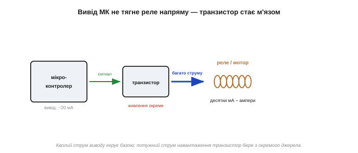
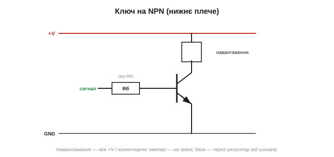
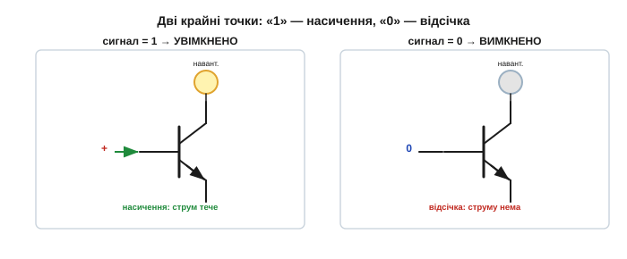
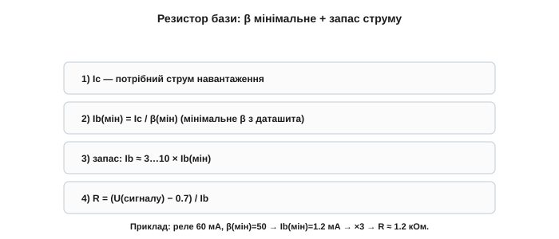
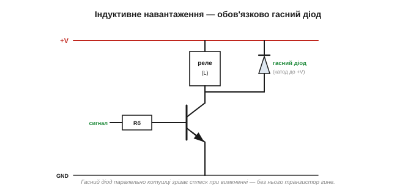
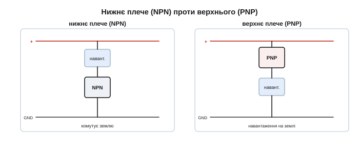

# BJT як ключ

У біполярного транзистора є два крайні [режими роботи](topic:hw-components/bjt-regions) — **відсічка** (закрито) і **насичення** (відкрито навстіж). З них народжується найпоширеніша на практиці схема: транзистор як **електронний ключ**. Крихітний сигнал — наприклад, із виводу мікроконтролера — вмикає й вимикає велике навантаження: реле, мотор, лампу. Цю схему ви збиратимете чи не найчастіше, тож розберімо її ґрунтовно. Якщо колись керуватимете чимось «справжнім» — лампою, мотором, реле — з плати чи мікроконтролера, почнете саме з неї; вона того варта, щоб запам'ятати її назубок.

### Навіщо транзистор-ключ

Вивід мікроконтролера видає логічний сигнал (0 чи 3.3/5 В), але **струму** дає мало — щонайбільше десятки міліампер. Цього вистачить хіба що на світлодіод, але не на реле (десятки мА на грані), мотор (ампери!) чи яскраву лампу. Спроба живити їх просто з виводу спалить вивід або просто не зрушить навантаження. Тут і потрібен транзистор: слабкий струм виводу він перетворює на потужний струм навантаження. Транзистор — це **м'яз** між «мозком» (мікроконтролером) і навантаженням.


*Вивід мікроконтролера дає сигнал, але мало струму — реле чи мотор йому не до снаги. Транзистор-ключ підсилює: кволий струм виводу керує потужним струмом навантаження від окремого джерела.*

Скільки ж дає вивід? Типовий вивід мікроконтролера віддає щонайбільше ~20–40 мА, і то на межі. Світлодіод (кілька мА) він потягне сам, а от реле (40–70 мА), невеликий мотор (сотні мА чи ампери), потужний світлодіод, нагрівач чи лампу — уже ні: або вивід перегріється й вийде з ладу, або просто не вистачить сили. Транзистор-ключ розв'язує це елегантно: вивід керує лише **базою** (1–2 мА), а потужний струм навантаження йде через колектор від **окремого** джерела. Мозок думає — м'яз тягне. Саме тому транзистор-ключ — перша «силова» схема, яку опановує кожен, хто переходить від світлодіодиків до керування справжніми пристроями: моторами, реле, освітленням.

Загалом транзистор-ключ — це **буфер** між слабким світом логіки й сильним світом навантажень: він приймає кволу команду й виконує її потужно. Майже в кожному пристрої, де мікроконтролер чимось «керує» — увімкнув підсвітку, крутнув мотор, клацнув реле, — за лаштунками стоїть такий ключ.

### Базова схема ключа (NPN, нижнє плече)

Найпростіший ключ на NPN-транзисторі збирають так: **навантаження** вмикають між плюсом живлення й колектором; **емітер** саджають на землю; **базу** живлять через резистор від керувального сигналу.

- Сигнал **високий** → крізь базу йде струм → транзистор **насичується** → навантаженням тече струм (від плюса крізь навантаження й транзистор на землю). **Увімкнено.**
- Сигнал **низький** → струму бази нема → **відсічка** → навантаження знеструмлено. **Вимкнено.**

Простежмо струм у ввімкненому ключі: він виходить із плюса живлення, проходить **навантаження**, далі крізь відкритий транзистор (колектор → емітер) і повертається на землю. Транзистор стоїть **знизу**, біля землі, — звідси й назва «нижнє плече». Навантаження ж верхнім кінцем завжди сидить на плюсі. Така схема найпростіша, бо емітер на землі, і керувати базою легко: подав на неї плюс відносно землі — відкрив. До бази сигнал заводять саме **через резистор**, а не напряму: інакше вивід і база з'єдналися б «накоротко» через відкритий перехід (≈0.7 В), і вивід тягнув би непомірний струм. Резистор бази — обов'язковий посередник між логікою й транзистором.


*Класичний ключ нижнього плеча. Навантаження — між «+» і колектором; емітер — на землі; база — через резистор від сигналу. Транзистор замикає або розмикає шлях навантаження на землю. Це найпоширеніша конфігурація.*


*Ключ працює лише у двох крайніх режимах: сигнал «1» → насичення (транзистор як замкнений вимикач, навантаження ввімкнено), сигнал «0» → відсічка (як розімкнений, навантаження вимкнено). Проміжний активний режим тут проскакують.*

Чому ключ працює лише у двох крайніх станах, а не «трохи відкритий»? Бо саме в [крайніх режимах](topic:hw-components/bjt-regions) транзистор майже не гріється: у відсічці немає струму, у насиченні майже немає напруги (Uce ≈ 0.2 В), тож добуток U·I — мала потужність. А «напіввідкритий» (активний) ключ розсіював би велику потужність і грівся. Тому ключ проскакує проміжний стан якнайшвидше — клац, і все. Власне, той характерний «клац» реле, увімкнутого транзистором, — це звук саме цієї схеми в дії.

### Розрахунок резистора бази

Головне в розрахунку — **гарантувати насичення**, а не точно потрапити в активний режим. Тому базу свідомо **перекачують** струмом.

1. Знаємо потрібний струм навантаження Ic.
2. Мінімальний струм бази: Ib(мін) = Ic / β(мін) — беремо **мінімальне** [β](topic:hw-components/bjt-gain) з даташита.
3. **Надлишок**: подаємо в кілька разів більше, Ib ≈ 3…10 × Ib(мін) (зручне правило для маленьких ключів — просто Ib ≈ Ic/10).
4. Резистор бази: R = (U(сигналу) − 0.7) / Ib.

**Приклад. Керуємо реле на 60 мА від виводу 5 В; β(мін) = 50.**
```
Ib(мін) = Ic / β(мін) = 60 мА / 50 = 1.2 мА
Ib (із запасом ×3)    ≈ 3.6 мА
R = (U − 0.7)/Ib = (5 − 0.7)/3.6 мА ≈ 1.2 кОм
```
Резистор ~1.2 кОм надійно заганяє транзистор у насичення навіть із «найгіршим» β.

Звідки той запас ×3…10? Бо [β непевне](topic:hw-components/bjt-gain) і падає на великих струмах, а нам потрібне **глибоке** насичення (низька Uce, мало тепла). Із запасом транзистор сидить у насиченні твердо, а зайвий струм бази не шкодить — лише трохи глибше відкриває ключ. Простіший другий приклад: щоб засвітити яскравий світлодіод на 20 мА від виводу 5 В, досить Ib ≈ 2 мА (із запасом), тобто R ≈ (5 − 0.7)/2 мА ≈ 2 кОм; а в коло колектора зі [світлодіодом](topic:hw-sensing/led-photodiode) ставлять ще й струмообмежувальний резистор. На практиці для дрібних навантажень часто й не рахують точно: резистор бази 1 кОм на 5-вольтовий сигнал дає ~4 мА — з головою на будь-який маленький ключ. Точний розрахунок потрібен, лише коли струми великі або сам сигнал слабкий.


*Розрахунок резистора бази: Ib = Ic/β (за мінімальним β), помножений на запас ×3…10 для певного насичення; далі R = (U(сигналу) − 0.7)/Ib. Надлишок струму бази не шкодить — він лише глибше відкриває ключ.*

> 🔧 **Навіщо це.** Резистор бази обов'язковий: він обмежує струм бази, інакше відкритий перехід база–емітер (≈0.7 В) майже закоротив би вивід керування й спалив би його чи базу. А «перекачування» струмом — це і є те «проєктування із запасом» через [мінімальне β](topic:hw-components/bjt-gain): беремо найгірше β, додаємо кратність — і ключ працює з будь-яким екземпляром, не питаючи його точного підсилення.

> 🧮 **Математична вставка:** [розрахунок резистора бази — насичення з запасом](topic:hw-components/bjt-switch/math-base-resistor.md). Чому в ключі забувають паспортне β й беруть **примусове** β_forced ≈ 10, звідки це число (компроміс «недонасичення гріється» проти «забагато бази — повільне вимикання»), повне виведення Rб з прикладом — і два запобіжники: струм виводу й Vce(sat).

### Не забути гасний діод!

Найважливіше попередження теми. Якщо навантаження **індуктивне** — котушка реле, мотор, соленоїд, — паралельно йому **обов'язково** ставлять [**гасний (flyback) діод**](root:embedded/flyback-protection). У мить вимкнення котушка вистрелює сплеском напруги (V = L·di/dt), і без діода цей сплеск **пробиває транзистор**. Це чи не найчастіша помилка початківця: зібрав ключ на реле, забув діод — і транзистор гине з перших же перемикань. Діод дає струмові котушки безпечний обхід, зрізаючи сплеск.


*Реле, мотор, соленоїд — індуктивні. Паралельно такому навантаженню ставлять гасний діод (катодом до «+»). Без нього сплеск при вимкненні пробиває транзистор. Це правило не має винятків для індуктивних навантажень.*

Орієнтація діода важлива: його ставлять паралельно котушці **катодом до плюса** (у нормі [він замкнений](root:embedded/flyback-protection)); коли ключ розмикається й напруга на котушці перевертається, діод відкривається й замикає струм котушки на себе. Для **неіндуктивних** навантажень (резистор, лампа розжарення, світлодіод) діод не потрібен — сплеску нема. Та якщо є хоч найменший сумнів щодо індуктивності (а в моторах і реле вона є завжди), діод ставлять: він не завадить, а може врятувати ключ. Нагадаймо масштаб загрози: сплеск від котушки реле сягає сотень вольтів — більш ніж досить, щоб пробити транзистор, розрахований на десятки. Тому забутий гасний діод — не дрібний недогляд, а майже гарантована смерть ключа на індуктивному навантаженні.

### Притягувальний резистор бази

Ще одна корисна звичка: між базою та емітером ставлять **притягувальний резистор** (кілька десятків кілоом). Він тримає транзистор **закритим**, коли керувальний сигнал «висить у повітрі» — наприклад, поки мікроконтролер скидається чи вивід ще не налаштовано. Без нього випадкова наводка могла б самочинно ввімкнути навантаження. Копійчана деталь — а рятує від несподіванок. Номінал тут зовсім не критичний: десятки кілоом — досить, щоб надійно стягнути базу до нуля, але не марнувати струм, коли сигнал високий. Особливо це важить у перші частки секунди після ввімкнення живлення, поки мікроконтролер ще не «прокинувся», а його виводи в невизначеному стані: без притягувального резистора реле чи мотор могли б на мить самочинно смикнутися.

### Нижнє плече проти верхнього

Описаний ключ — **нижнього плеча** (*low-side*): транзистор стоїть **між навантаженням і землею** й комутує «мінусовий» шлях. Це найпростіше й найпоширеніше. Та інколи навантаження мусить одним кінцем сидіти на землі (так зручніше чи безпечніше) — тоді комутують **верхнє плече** (*high-side*) транзистором **PNP**: він стоїть між плюсом і навантаженням. Керувати верхнім плечем трохи складніше (база PNP має йти **нижче** плюса, щоб відкрити), але принцип той самий.


*Дві конфігурації. Нижнє плече: NPN між навантаженням і землею (просто, поширено). Верхнє плече: PNP між плюсом і навантаженням (коли навантаження має сидіти на землі). Обидва — той самий ключ, лише з різного боку.*

Навіщо взагалі верхнє плече? Уявіть, що навантаження одним кінцем мусить сидіти на спільній землі (так часто буває заради безпеки чи зручності розведення). Тоді комутувати землю не можна — доводиться розмикати плюс, а це робота для PNP у верхньому плечі. Складність у тому, що базу PNP, аби відкрити, треба **опустити** нижче плюса, а сигнал мікроконтролера зазвичай ходить між нулем і плюсом, — тому верхнє плече часто керують через ще один, маленький NPN. На практиці новачки починають із нижнього плеча, а верхнє опановують згодом.

> 🔌 **Компонентна вставка:** [ключ у плюсовому проводі — PNP high-side](topic:hw-components/bjt-switch/comp-high-side-pnp.md). Чому простої заміни NPN на PNP замало: мікроконтролер не дістає до повної напруги живлення, щоб **закрити** PNP, тож той потрібен маленький NPN-«перекладач рівня». Повна схема з підтягувальним резистором, неінвертована логіка — і навіщо взагалі розривати «плюс» (спільна земля, безпека).

### Який транзистор і для чого

Добираючи транзистор-ключ, дивляться насамперед на **струм**: максимальний струм колектора Ic(макс) із даташита має із запасом перекривати [струм навантаження](root:embedded/bjt-load-driving). Для дрібниць (світлодіод, мале реле) досить копійчаного BC547 чи 2N2222 (до ~100–800 мА); для моторів і потужних реле беруть міцніші (TIP120, BD139) на радіаторі. Дивляться й на максимальну напругу колектор–емітер (щоб витримала живлення плюс можливий сплеск) і на потужність. А коли струми великі, дедалі частіше замість BJT беруть [**польовий** транзистор](topic:hw-components/field-control) — він у відкритому стані гріється менше.

А якщо струм навантаження великий, а β малого транзистора замало (потрібен надто великий струм бази)? Тоді ставлять два транзистори каскадом — [пару **Дарлінгтона**](topic:cat-hw-drivers/darlington-uln) — і [сумарне β](topic:hw-components/bjt-gain) сягає тисяч, тож база задовольняється мізерним струмом виводу. Платня — трохи більше падіння напруги на ключі. Коли ж таких ключів потрібно багато заразом, зручно взяти готову мікросхему-збірку на кшталт [ULN2003](topic:cat-hw-drivers/darlington-uln), де сім дарлінгтонових ключів із гасними діодами вже зведено в один корпус.

Що зазвичай вмикають таким ключем? Реле (а через нього — будь-що потужне), мотори й вентилятори, соленоїди й електромагніти, потужні чи численні світлодіоди, зумери, нагрівачі, ще один транзисторний каскад. Майже все, що «вмикається/вимикається» за командою, у дрібній електроніці комутують саме транзистором-ключем — він дешевий, малий і безвідмовний. Опанувавши цю одну схему, ви вмикатимете з мікроконтролера будь-що — від світлодіода до промислового реле.

### Коротко про ключ

Отже, транзистор-ключ — це проста, але всюдисуща схема: навантаження, транзистор, резистор бази, а для індуктивних — обов'язково гасний діод. Запам'ятайте цей короткий список — навантаження зверху, транзистор за струмом, резистор бази з запасом, гасний діод для котушок, притягувальний резистор для певності — і зберете надійний ключ майже не думаючи. Ключ працює на **крайніх** режимах транзистора (відсічці й насиченні), де той майже не гріється. Інше велике застосування транзистора — **активний** режим, де він не клацає, а плавно [підсилює сигнал](topic:hw-analog/bjt-amplifier).

---
