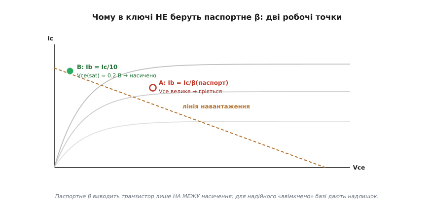
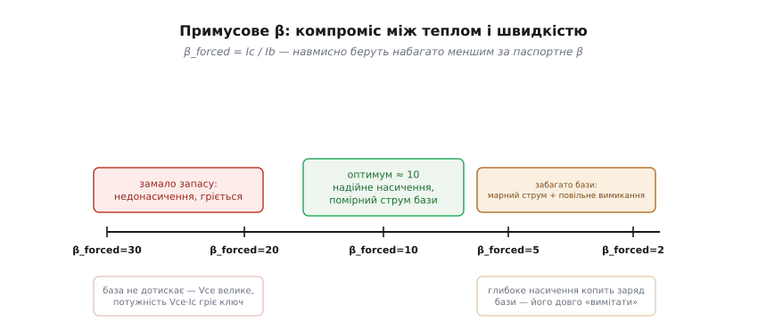
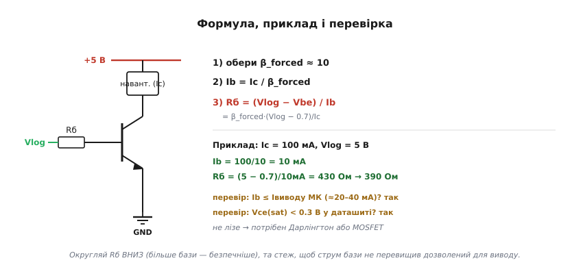

# 🧮 Розрахунок резистора бази: насичення з запасом

Резистор бази транзисторного ключа рахують «із запасом». Розберемо, **чому** цей запас потрібен, що таке примусове β, звідки взялося майже магічне число ≈10, як вивести саму формулу — і як переконатися, що ключ справді насичений, а не лише «майже відкритий».

### Пастка паспортного β

Спокуса очевидна: транзистор має [коефіцієнт підсилення β](root:hw-components/bjt-gain) — скажімо, 200, — тож для струму навантаження Ic ніби досить струму бази Ib = Ic/200. Логічно? Так. Хибно? Теж так. Річ у тім, що співвідношення **Ic = β·Ib** працює лише в [активному режимі](root:hw-components/bjt-regions) — там, де транзистор поводиться як підсилювач і колекторний струм слухняно слідує за базовим. А ключ нам потрібен у **насиченні**: відкритий «до кінця», з мінімальним падінням Vce(sat) ≈ 0.2 В. У насиченні рівність Ic = β·Ib **уже не діє** — колектор не може провести більше, ніж дозволяє зовнішнє коло (живлення поділене на опір навантаження), хоч скільки лий у базу. Якщо завести рівно Ib = Ic/β(паспорт), транзистор опиниться лише **на самій межі** насичення, у так званій крайці активної області:


*Точка A (Ib = Ic/β паспортне) сидить на самій межі: Vce ще велике, транзистор гріється. Точка B (Ib = Ic/10) лежить глибоко в насиченні, де Vce(sat) ≈ 0.2 В. Для надійного «ввімкнено» базі дають надлишок струму.*

Чому межа небезпечна — дві причини. По-перше, паспортне β **не константа**: воно [гуляє в рази від екземпляра до екземпляра](root:hw-components/bjt-gain), падає на холоді й помітно просідає на великих струмах — саме там, де ключ і працює. Транзистор, що ледь насичувався за β = 200, із сусіднього в тій самій партії примірника з β = 100 уже **не** насититься, а на морозі чи під повним струмом не насититься й «хороший». По-друге, недонасичений ключ має велике Vce, а отже, розсіює помітну [потужність P = Vce·Ic](root:ph-electromagnetism/electric-power) — і гріється там, де мав би лишатися холодним.

Порахуймо цей нагрів, щоб відчути масштаб. Хай ключ веде Ic = 100 мА. Насичений ключ має Vce(sat) ≈ 0.2 В, тож розсіює P = 0.2 × 0.1 = 0.02 Вт — двадцять міліват, мізер, корпус ледь теплий. Недотиснутий ключ, що завис у крайці активної області з Vce ≈ 2 В, розсіює P = 2 × 0.1 = 0.2 Вт — у **десять разів більше**, чверть ватта на крихітному корпусі, який без радіатора відчутно гріється; а на струмі в кілька разів більшому той самий недогляд уже випалює транзистор. Ось чому «майже відкрито» — це не дрібниця, а різниця між холодним ключем і згорілим. Висновок жорсткий: ключ або насичений, або ні; «майже» тут не працює.

### Примусове β: беремо менше навмисно

Рішення — навмисно завести в базу **більше** струму, ніж вимагає паспортне β. Уводять поняття **примусового β** (*англ.* forced beta) — це відношення, яке ми **самі нав'язуємо** схемою, а не беремо з даташита:

```
β_forced = Ic / Ib       (те, що ми задаємо опором бази)
```

Для надійного ключа беруть β_forced ≈ **10** — у багато разів менше за паспортне β (зазвичай 100–300). Тобто струму бази дають у 10–30 разів більше, ніж «теоретично потрібно» за паспортом. Цей надлишок і є той самий «запас на насичення»: він заганяє транзистор глибоко в насичення й тримає його там, попри будь-який розкид β, температуру й просідання підсилення під струмом. Інженери кажуть про це й інакше — «коефіцієнт перекачування бази» (*англ.* overdrive factor): у скільки разів реальний струм бази перевищує мінімально потрібний; для ключа його беруть 3…10.

### Звідки саме ≈10

Чому не 2 і не 50? Це компроміс, затиснутий з двох боків:


*Замало запасу (β_forced близьке до паспортного) — недонасичення й нагрів. Забагато (β_forced = 2…3) — марний струм бази й повільне вимикання. Близько 10 — золота середина.*

**Згори (β_forced завелике, мало бази):** недонасичення, велике Vce, нагрів — рівно те, чого ми щойно уникали. **Знизу (β_forced замале, забагато бази):** дві біди. Перша — марнотратство: струм бази тече з виводу мікроконтролера, а той дає лише десятки міліампер; глибоке перенасичення легко вимагає більше струму, ніж вивід узагалі здатен віддати. Друга, тонша — **швидкість вимикання**. У глибокому насиченні в базі накопичується надлишковий неосновний заряд (та сама ідея [накопиченого заряду](root:hw-analog/rc-time-constant), що й у конденсаторі). Щоб вимкнути транзистор, цей заряд треба спершу повністю «вимести» з бази, і доки він не зник, колектор іще проводить — транзистор немовби «залипає» відкритим на якийсь час (*англ.* storage time, час розсмоктування). Що глибше насичення — то більший накопичений заряд і то довше вимикання. Тому β_forced ≈ 10 — золота середина: надійне насичення без зайвого марнування струму й без надмірної інерції на вимиканні.

А якщо ключ мусить клацати дуже швидко (десятки-сотні кілогерц і вище)? Тоді насичення навмисно **обмежують**, не даючи транзистору пірнути глибоко. Класичний прийом — **затискач Бейкера** (*англ.* Baker clamp): діод Шотткі вмикають між колектором і базою. У нього менше пряме падіння, ніж у кремнієвого переходу база–колектор, тож він відкривається **першим** і відводить надлишок струму бази прямо в колектор, не даючи переходу глибоко насититися. Накопиченого заряду майже немає — вимикання різке. Саме так роблять «швидку» логіку: серія TTL із літерою «S» (Schottky) тримається на транзисторах із таким затискачем. Інший простий прийом — **пришвидшувальний конденсатор** паралельно резистору бази: на фронті він пропускає різкий сплеск струму (швидко вмикає), а на спаді допомагає висмоктати заряд із бази (швидко вимикає). Та для звичайного ключа, що клацає реле чи світлодіод, усі ці тонкощі зайві — досить β_forced ≈ 10.

### Виведення формули і перевірка

Тепер сама формула. Резистор бази бере на себе різницю між напругою сигналу й падінням база–емітер (≈0.7 В), а струм крізь нього і є Ib:


*Rб = (Vlog − 0.7)/Ib, де Ib = Ic/β_forced. Приклад на 100 мА дає 430 Ом; округлюють униз і перевіряють два запобіжники — струм виводу й Vce(sat).*

```
Ib = Ic / β_forced
Rб = (Vlog − Vbe) / Ib = β_forced · (Vlog − 0.7) / Ic
```

**Приклад. Ic = 100 мА, живлення логіки Vlog = 5 В, β_forced = 10.**
```
Ib = Ic / β_forced     = 100 мА / 10        = 10 мА
Rб = (Vlog − 0.7) / Ib = (5 − 0.7) / 10 мА  = 4.3 / 0.010 = 430 Ом
                                            →  беремо 390 Ом (ряд E12, униз)
```
У прошивці ця стадія зводиться до двох дій, однакових на будь-якому мікроконтролері: налаштувати вивід на вихід і виставити на ньому високий рівень. Увесь розрахунок зроблено заздалегідь, а програма лише смикає вивід:
:::tabs
```arduino
pinMode(KEY_PIN, OUTPUT);
digitalWrite(KEY_PIN, HIGH);   // 5 В крізь Rб=390 Ом → ~11 мА бази → ключ насичено
```
```esp-idf
#include "driver/gpio.h"

gpio_config_t io = { .pin_bit_mask = 1ULL << KEY_PIN,
                     .mode = GPIO_MODE_OUTPUT };   // решта полів — нулі: без підтяжок і переривань
ESP_ERROR_CHECK(gpio_config(&io));
ESP_ERROR_CHECK(gpio_set_level(KEY_PIN, 1));  // 3.3 В крізь Rб=240 Ом → ~11 мА бази → ключ насичено
```
```stm32
GPIO_InitTypeDef io = {0};                    // такт на порт уже ввімкнено __HAL_RCC_GPIOx_CLK_ENABLE()
io.Pin   = KEY_Pin;
io.Mode  = GPIO_MODE_OUTPUT_PP;               // двотактний вихід: сам віддає струм у базу
io.Speed = GPIO_SPEED_FREQ_LOW;               // ключ реле — поспіх ні до чого
HAL_GPIO_Init(KEY_GPIO_Port, &io);
HAL_GPIO_WritePin(KEY_GPIO_Port, KEY_Pin, GPIO_PIN_SET);  // 3.3 В крізь Rб=240 Ом → ~11 мА бази
```
:::
Rб у коментарях різний не випадково: він іде з логічного рівня саме цього виводу — 5 В у класичного AVR-Arduino, 3.3 В у ESP32 чи STM32; формула та сама, кожен підставляє свій Vlog.

Округлюють Rб **униз**: менший резистор дає трохи більший струм бази, а зайва база лише глибше насичує (безпечно), тоді як завелика база лишила б ключ недотиснутим. Та перш ніж ставити деталь, двічі перевіряють два запобіжники:

- **Чи витримає вивід?** Ib (тут 10 мА) має бути в межах допустимого струму виводу мікроконтролера (зазвичай 20…40 мА). Якщо ні — потрібен Дарлінгтон (велике сумарне β, мізерний Ib) або MOSFET, що керується напругою й струму майже не просить.
- **Чи справді насичено?** Подивіться в даташит Vce(sat) для вашого Ic: якщо вона ≈0.1…0.3 В — ключ насичений; якщо помітно більша — додайте струму бази (зменшіть Rб) і перевірте знову.

> 🔧 **Навіщо це.** Саме примусове β ≈ 10 робить ключ **байдужим до екземпляра**: береш будь-який транзистор тієї моделі, ставиш Rб за цією формулою — і він насичується, хоч би його паспортне β виявилося вдвічі меншим за типове чи просіло на холоді. Без запасу довелося б підбирати резистор під кожен транзистор; із запасом одна цифра в схемі працює на всю партію.

### Де це працює

Цей розрахунок — серце будь-якого транзисторного ключа: [драйвера реле](root:hw-motion/relay-driver), світлодіода, моторчика, сирени, нагрівача. Скрізь та сама логіка: **забудь паспортне β, візьми примусове ≈10, дай базі надлишок** — і перевір два запобіжники. А коли β_forced·(Vlog − 0.7)/Ic вимагає більшого струму бази, ніж може дати вивід, — це прямий сигнал, що настав час по Дарлінгтон або польовий транзистор, яким керують уже не струмом, а полем.
