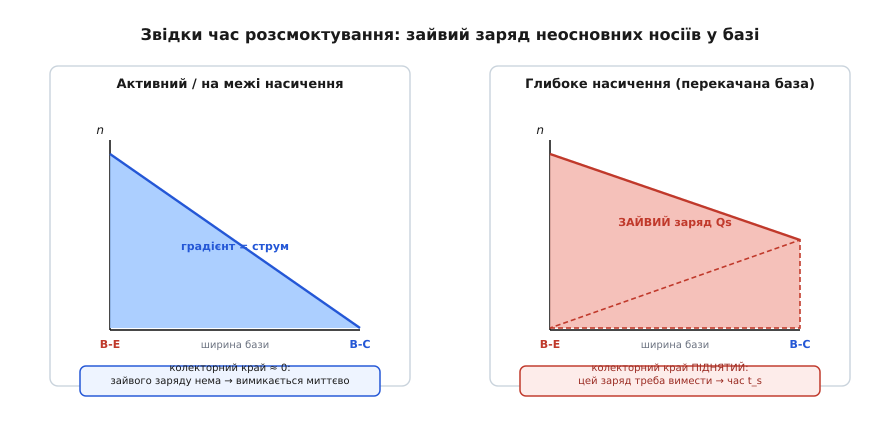
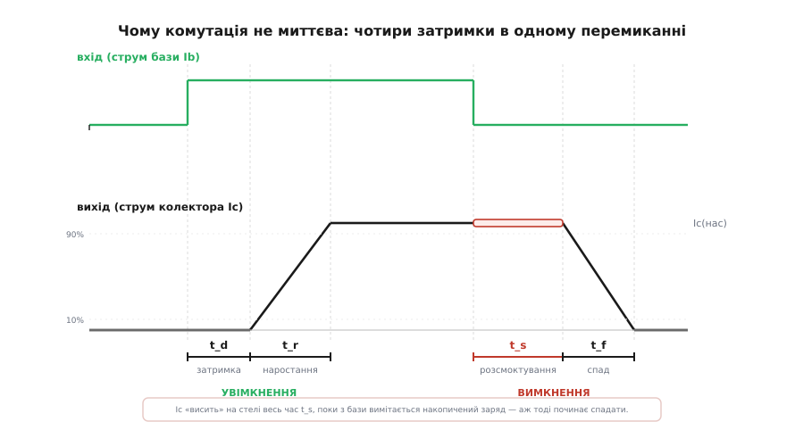
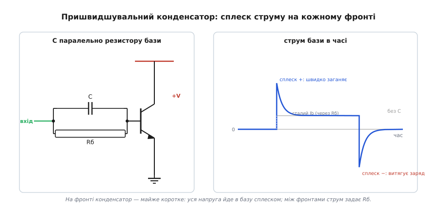
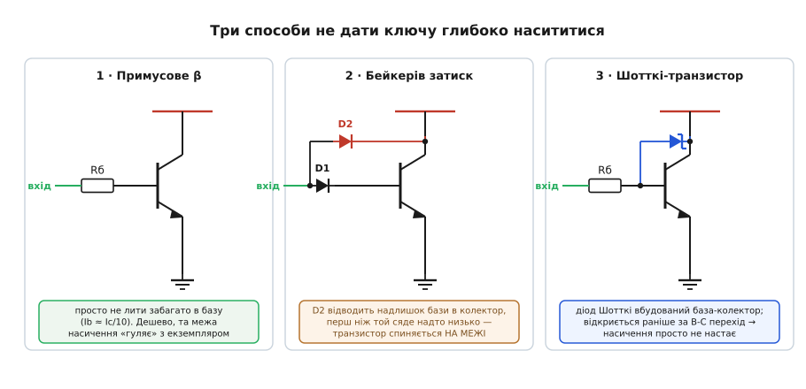

# BJT: швидкість комутації та заряд бази

Біполярний транзистор у ролі ключа на папері перемикається миттєво: подав струм у базу — відкрився, прибрав — закрився. Та якщо причепити до колектора осцилограф і ганяти ключ дедалі швидше, картина псується. Фронти розпливаються, а найприкріше — після команди «закрийся» транзистор ще якусь мить **уперто лишається відкритим**, наче не чує. Ця затримка не випадкова й не від поганого екземпляра: вона вшита у фізику приладу. Зрозуміти її — означає зрозуміти, чому той самий транзистор, що бездоганно клацає реле раз на секунду, геть не годиться, щоб формувати імпульси на мегагерцах, і що з цим роблять.

Корінь усього — **заряд**. Транзистор керується не «напругою на базі» в чистому вигляді, а кількістю носіїв, які цю базу заповнюють. Щоб змінити стан, цей заряд треба фізично **завести** або **вивести**, а на це потрібен час і струм. Звідси й випливає вся динаміка комутації.

## Транзистор як ємність, яку треба зарядити

Почнімо з очевиднішого боку — увімкнення. Перехід база–емітер — це не ідеальний вентиль, а напівпровідниковий стик із власною **ємністю** (лат. *capacitas* — місткість). Поки ви не зарядите цю ємність до порогових ~0.7 В, струм бази майже весь іде на її заряджання, а не «крізь» транзистор. Колектор у цей час ще мертвий: Ic = 0. Це перша затримка — **час затримки** (*delay time*, t_d): проміжок від фронту команди до миті, коли база нарешті відкрилася й колектор почав оживати.

Далі база відкрита, і носії (для NPN — електрони) ринули з емітера в базу, дифундуючи до колектора. Струм колектора росте — але теж не миттєво: базі треба **наповнитися** рухомими носіями до робочого рівня, а колекторному переходу — перезарядити свою ємність, поки напруга на ньому падає. Поки цей заряд накопичується, Ic піднімається від нуля до повного значення. Це **час наростання** (*rise time*, t_r), який зазвичай міряють як підйом струму з 10% до 90%.

> 🔧 **Навіщо це.** Ці дві затримки кажуть, чому слабкий струм бази робить ключ млявим. Чим більший струм бази на фронті, тим швидше заряджаються ємності переходів і наповнюється база — тим коротші t_d і t_r. Тому для швидкого вмикання базу спершу б'ють **сильним коротким струмом**, а не кволою постійною підкачкою: важлива не середня величина, а імпульс заряду на самому фронті.

Поки що нічого підступного: ключ просто має скінченну реакцію, бо в ньому є що заряджати. Підступ починається там, де ми, прагнучи надійно відкрити транзистор, заганяємо його **глибоко в насичення**.

## Пастка насичення: зайвий заряд у базі

Щоб транзистор-ключ певно сидів відкритим за будь-якого підсилення, у базу свідомо ллють струм **із запасом** — більше, ніж потрібно за Ic = β·Ib. Це правильно для статики: транзистор входить у [насичення](topic:hw-components/bjt-regions), напруга колектор–емітер падає до ~0.2 В, ключ холодний і твердо відкритий. Але за цю надійність доведеться заплатити при **вимкненні**.

Подивімося, що коїться з носіями в базі. У звичайному (активному) режимі концентрація неосновних носіїв спадає від емітерного краю бази майже до нуля на колекторному — рівно той градієнт (лат. *gradi* — крокувати, тут: нахил), що жене дифузійний струм. Колекторний край «висмоктаний» досуха: щойно носій туди дійшов, зворотно зміщений перехід база–колектор миттєво забирає його в колектор.

У насиченні все інакше. Перехід база–колектор теж відкривається — і перестає висмоктувати носії. Вони **накопичуються** по всій базі, і концентрація на колекторному краї підіймається над нулем. У базі осідає **зайвий заряд** (його звуть зарядом насичення, Q_s) — тим більший, чим глибше ви загнали транзистор надлишком струму бази.


*Концентрація неосновних носіїв упоперек бази. Зліва (активний режим) вона спадає до нуля на колекторному краї — зайвого заряду нема. Справа (глибоке насичення) колекторний край піднятий, і під ним сидить зайвий заряд Q_s, який доведеться вимести, перш ніж транзистор зможе закритися.*

Ось і причина впертості. Поки в базі є цей надлишок, **обидва переходи лишаються відкритими** — транзистор фізично ще в насиченні, хоч ви вже подали команду «закрийся». Зняти напругу з бази замало: заряд нікуди не дівається сам собою миттєво. Його треба або **витягти** зворотним струмом бази, або дочекатися, поки носії **рекомбінують** (лат. *re-* — знову + *combinare* — поєднувати: електрон зустрічає дірку й обоє зникають). І те, й те — час.

## Час розсмоктування і чотири фронти

Тепер зберімо всю динаміку вимкнення. Ви прибрали струм бази (а краще — подали зворотний). Транзистор не реагує одразу. Спершу йде **час розсмоктування** (*storage time*, t_s) — проміжок, поки з бази вимітається зайвий заряд насичення. Найковарніше тут те, що **струм колектора весь цей час не падає**: транзистор лишається в насиченні, Ic тримається на стелі, заданій колом. Осцилограф показує рівну поличку — ключ наче й не отримував команди. Аж коли заряд вичерпано до межі насичення, перехід база–колектор закривається, і лише **тоді** починається власне вимкнення — **час спаду** (*fall time*, t_f), за який Ic сходить зі стелі до нуля.


*Одне перемикання в часі. Угорі прямокутна команда на базі, унизу справжній відгук колектора. На ввімкненні: затримка t_d, тоді наростання t_r. На вимкненні: спершу розсмоктування t_s — струм уперто тримається на стелі, поки вимітається заряд бази, — і лише потім спад t_f. Підсвічена поличка t_s і є головна плата за глибоке насичення.*

Виходить чотири окремі затримки, по дві на кожен фронт:

```
увімкнення:   t_d (затримка)        +  t_r (наростання)
вимкнення:    t_s (розсмоктування)  +  t_f (спад)
```

Із них t_s зазвичай найбільший і найприкріший — це чиста втрата, плата саме за глибину насичення. У звичайних транзисторах розсмоктування тягнеться сотні наносекунд, а то й мікросекунди, тоді як решта фронтів — десятки наносекунд. Тому коли інженер скаржиться, що «ключ повільно вимикається», майже завжди йдеться про t_s.

Скільки триває розсмоктування — можна оцінити. Заряд бази спадає від рівня, накопиченого прямим струмом I_B1, до межі насичення (де базі досить лише I_C/β), і робить це під дією зворотного струму I_B2, що його ви виймаєте. Виходить логарифм:

```
t_s ≈ τ_s · ln[ (I_B1 + I_B2) / (I_C/β + I_B2) ]
```

де τ_s — стала часу насичення (паспортна величина транзистора, пов'язана з часом життя носіїв у базі). Формула підказує два важелі: менше **заганяти** в насичення (зменшити I_B1, тобто надлишок бази) і активніше **витягувати** заряд (збільшити зворотний I_B2). Обидва зменшують логарифм, а отже й t_s.

**Оцінка часу розсмоктування для дрібного ключа.**
```
Дано: τ_s = 200 нс, Ic = 100 мА, β = 100 (тобто на межі насичення треба Ic/β = 1 мА),
      пряма база I_B1 = 10 мА (десятикратний надлишок),
      вимикаємо просто в обрив: зворотний струм I_B2 ≈ 0.

t_s ≈ 200 · ln[ (10 + 0) / (1 + 0) ] = 200 · ln(10) = 200 · 2.30 ≈ 461 нс

Тепер активно витягнемо заряд зворотним струмом I_B2 = 10 мА:
t_s ≈ 200 · ln[ (10 + 10) / (1 + 10) ] = 200 · ln(20/11) = 200 · 0.598 ≈ 120 нс
```
Висновок: те саме перемикання, але з активним витягуванням заряду — майже вчетверо швидше вимкнення, і жодної зміни деталей, лише схема керування базою.

## Як прискорити ключ

Звідси випливають усі практичні засоби. Їх два сімейства: **витягувати заряд жвавіше** і **взагалі не давати йому накопичитися**.

**Зворотний струм бази на вимкненні.** Найпряміший хід — на вимкненні не просто відпустити базу, а коротко прикласти до неї зворотну напругу, щоб **активно висмоктати** носії (це і є I_B2 у формулі). Драйвери затворів і логічні виходи, що вміють тягнути базу в обидва боки (push-pull), роблять це самі. Простий обрив бази покладається на повільну рекомбінацію — тому й виходить найдовший t_s.

**Пришвидшувальний конденсатор.** Класичний трюк дискретних схем — поставити конденсатор **паралельно резистору бази**. На фронті вхідного сигналу конденсатор — майже коротке замикання: він пропускає різкий **сплеск** струму просто в базу, обходячи резистор. На передньому фронті цей сплеск швидко заганяє транзистор (коротшає t_d і t_r); на задньому — перевернута на конденсаторі напруга жене **зворотний** сплеск, що висмоктує заряд бази (коротшає t_s). Між фронтами конденсатор заряджений і струм бази задає вже резистор — рівно стільки, щоб тримати насичення. Один копійчаний елемент б'є по всіх чотирьох затримках одразу. Його так і звуть — пришвидшувальний, або форсувальний.


*Пришвидшувальний конденсатор. На фронті він майже закорочує резистор, тож уся напруга йде в базу сплеском; між фронтами струм бази визначає резистор. Праворуч: без конденсатора струм бази прямокутний, з ним — гострий додатний сплеск заганяє транзистор, а від'ємний на вимкненні витягує накопичений заряд.*

**Не насичувати взагалі.** Другий шлях радикальніший: спинити транзистор **на самій межі** насичення, не пускаючи глибше — тоді зайвому заряду просто нема звідки взятися, і розсмоктування майже зникає. Найгрубіший варіант — **примусове β**: лити в базу рівно стільки, щоб Ic/Ib дорівнювало невеликому числу (≈10), а не паспортному β у сотні. Дешево, але межа насичення «гуляє» від екземпляра до екземпляра й від температури, тож гарантії немає.

Надійніше — **затиснути** транзистор зворотним зв'язком, щоб він сам не дав напрузі колектора впасти надто низько. Це робить **Бейкерів затиск** (англ. *Baker clamp*): діод між базою та колектором, який, коли колектор просідає до межі насичення, **відводить надлишок струму бази прямо в колектор**, не пускаючи його далі заповнювати базу. Транзистор зависає трохи **не доходячи** до повного насичення — і вимикається майже без затримки.

Найелегантніше це втілює **Шотткі-транзистор** (*Schottky transistor*): той самий затиск, але роль діода грає вбудований [діод Шотткі](root:embedded/zener-schottky) база–колектор. Він відкривається за меншої напруги (~0.3 В), ніж кремнієвий перехід база–колектор (~0.5 В), тож спрацьовує **раніше** й не дає переходу відкритися — насичення просто не настає. До того ж сам діод Шотткі не накопичує заряду й перемикається блискавично. Саме на цьому принципі побудовано швидкісну логіку.


*Три способи не дати ключу глибоко насититися. Примусове β — просто менший струм бази (дешево, але межа «гуляє»). Бейкерів затиск — діод відводить надлишок бази в колектор біля межі насичення. Шотткі-транзистор — той самий затиск убудованим діодом Шотткі, що відкривається раніше за перехід база–колектор.*

> 🔧 **Навіщо це.** Вибір засобу диктує задача. Дрібне реле раз на секунду — досить простого ключа, на затримки байдуже. Десятки кілогерц (ШІМ мотора, перетворювач живлення) — уже варто або пришвидшувальний конденсатор, або зворотне витягування бази, інакше час розсмоктування з'їдатиме робочий цикл і грітиме ключ на перемиканнях. Десятки й сотні мегагерц (логіка, формувачі імпульсів) — лише не-насичувальні схеми; історично саме [заради цього](topic:hw-components/bjt-switching-speed/hist-charge-control.md) народилася ціла родина швидкої логіки на Шотткі-транзисторах.

Час розсмоктування — не суха теорія: він прямо кусає того, хто з мікроконтролера керує **двома** ключами на одному плечі (скажімо, верхнім і нижнім транзисторами півмоста мотора). Якщо ввімкнути один рівно тоді, коли вимикаєш другий, той другий ще тримається відкритим увесь свій t_s — і на коротку мить **обидва** відкриті, а живлення йде навпростець крізь них у землю (наскрізний струм, що палить ключі). Тому між «вимкнув один» і «увімкнув інший» лишають паузу — **мертвий час** (*dead-time*), не коротший за час розсмоктування.

**Перемикання плеча з урахуванням часу розсмоктування.**
```c
/* t_s ≈ 0.5 мкс для звичайного ключа; беремо мертвий час із запасом */
#define DEADTIME_US 2u    /* > t_s найгіршого транзистора в партії */

void half_bridge_set_high(void) {
    gpio_clear(LOW_SIDE);              /* команда «вимкнись» нижньому */
    delay_us(DEADTIME_US);            /* ЧЕКАЄМО, поки вибереться його заряд бази */
    gpio_set(HIGH_SIDE);              /* лише тепер вмикаємо верхній — без наскрізного струму */
}
```
Висновок: пропустити цю паузу — означає покластися на те, що ключ закриється миттєво, а він не закриється: t_s гарантує перекриття й наскрізний струм. Saturated-ключі вимагають довшого мертвого часу; Шотткі-ключі (майже без t_s) — куди коротшого.

> 📜 **Історична вставка:** [заряд бази, Бейкерів затиск і логіка на Шотткі](topic:hw-components/bjt-switching-speed/hist-charge-control.md). Як у 1950-х транзистор переосмислили з «підсилювача струму» на **прилад, керований зарядом**, хто такий Бейкер і його «зворотне затискання», і як діод Шотткі вдвічі прискорив цифрову логіку.

## Чому це не зникає з кращим транзистором

Спокусливо подумати, що швидший транзистор розв'яже все сам. Почасти так: транзистори для високих частот роблять із тонкою базою й малою площею переходів — менше носіїв треба заводити, менші ємності, коротший час життя заряду. Та сама фізика лишається: будь-який біполярний ключ, заведений у насичення, накопичує заряд, який треба вимести. Тому навіть найшвидший BJT, якщо загнати його глибоко в насичення, матиме свій час розсмоктування — просто менший. Уникнути t_s повністю можна **лише** не насичуючи прилад (затиск, Шотткі) або взявши інший тип ключа.

Тут і пролягає вододіл із [польовим транзистором](topic:hw-components/field-control). Той керується **полем**, а не інжекцією носіїв у базу: у його каналі немає накопиченого неосновного заряду, який треба розсмоктувати, тож «часу розсмоктування» в нього просто не існує як явища. Його швидкість обмежує інше — заряд власної ємності затвора, який теж треба заводити й виводити, але це інша історія. Саме тому в сучасній сильнострумовій комутації на високих частотах біполярний ключ майже всюди поступився польовому: останній не має вродженої затримки на розсмоктуванні заряду бази.

Підсумок простий і практичний. Швидкість біполярного ключа впирається не в магію, а в **заряд**, який треба завести при ввімкненні й вивести при вимкненні. Глибоке насичення дарує надійне «відкрито» й низькі втрати в статиці, але платить за це найдорожчою затримкою — часом розсмоктування. Хочете швидко — або жвавіше качайте заряд туди-сюди (сильний фронт, зворотне витягування, пришвидшувальний конденсатор), або не давайте йому накопичитися (затиск, Шотткі). А коли й цього мало — берете прилад, у якому накопиченого заряду бази немає взагалі.
