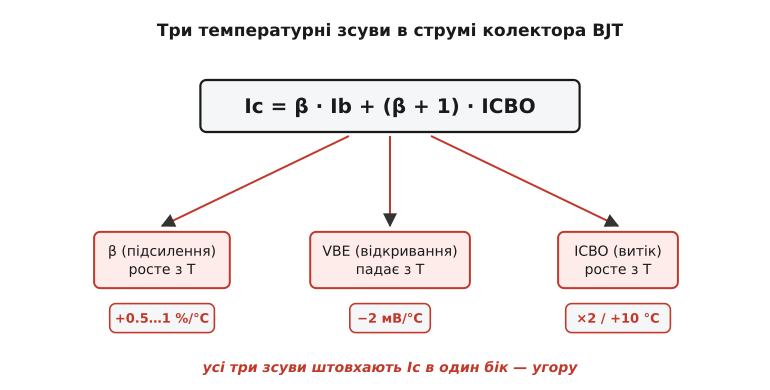
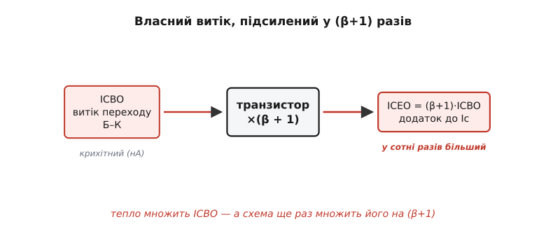
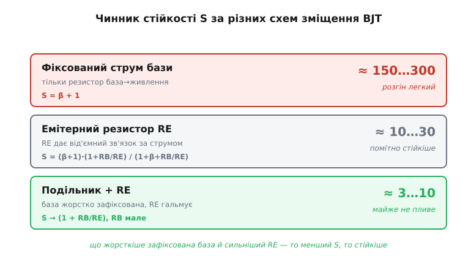

# Тепловий розгін у BJT-схемах

Зберіть звичайний підсилювальний каскад на біполярному транзисторі (англ. *bipolar junction transistor*, BJT), виставте робочу точку — скажімо, 2 мА колекторного струму — і пустіть його гріти радіатор у спекотний день. Через хвилину виміряйте струм ще раз: він уже не 2 мА, а 2.6. Через п'ять хвилин — 4 мА, і каскад «попливає» в насичення, спотворюючи сигнал. А іноді цифри не зупиняються зовсім: струм женеться вгору, аж поки транзистор не вмирає. Дивина в тому, що **той самий транзистор у сусідній схемі тримає свої 2 мА намертво** хоч узимку, хоч улітку. Деталь однакова — а доля протилежна. Вирішує не транзистор, а **схема навколо нього**: те, як вона задає й утримує робочу точку.

Ось у чому суть, яку варто винести наперед. Будь-який BJT від нагріву прагне пропускати більший струм — це закладено в його фізику. Чи перетвориться це прагнення на повзучий дрейф робочої точки, а тоді й на [тепловий розгін](root:hw-components/thermal-runaway) (англ. *thermal runaway* — коли струм і температура «втікають» з-під керування лавиною), залежить від однієї величини, яку інженер задає вибором схеми зміщення. Її звуть **чинником стійкості** (англ. *stability factor*) S. Уся ця стаття — про те, звідки в BJT-схемі береться дрейф, як S його вимірює і як схемою притиснути S до безпечного значення.

> Загальну механіку петлі «тепло → струм → ще тепло» — чому це додатний зворотний зв'язок і коли він втікає — розбирає окрема стаття про [тепловий розгін транзистора](root:hw-components/thermal-runaway). Що треба тримати в голові тут: нагрітий BJT за тієї самої напруги на базі тягне більший струм; більший струм — більше тепла; коло замикається саме на себе. Якщо підсилення цього кола за один оберт перевалює за одиницю, струм біжить угору без упину. Нижче — як саме BJT-схема задає це підсилення через свою робочу точку.

## Три зсуви, що штовхають струм колектора вгору

Щоб зрозуміти дрейф саме в BJT, придивімося до рівняння, яким описують його колекторний струм. Воно складається з двох доданків:

```
Ic = β · Ib + (β + 1) · ICBO
```

Перший доданок — «корисний» струм: струм бази Ib, помножений на коефіцієнт передавання струму [β](root:hw-components/bjt-gain) (відношення колекторного струму до базового). Другий — паразитний: ICBO, крихітний струм витоку зворотно зміщеного переходу база–колектор, помножений на (β+1). Тепло чіпає **всі три** величини в цьому рівнянні, і — що найгірше — штовхає їх в один бік.

**β росте з температурою.** Коефіцієнт передавання струму не сталий: нагрівшись, кремнієвий транзистор підсилює сильніше — типово на половину-один відсоток на кожен градус. Той самий струм бази дає більший колекторний струм просто тому, що β побільшало.

**Напруга відкривання VBE падає з температурою.** Перехід база–емітер відкривається приблизно при 0.7 В «при кімнаті», але нагрів зсуває цей поріг униз — приблизно на **−2 мВ на кожен градус** (усталена величина для кремнію, від −1.8 до −2.0 мВ/°C, що прямо випливає з фізики p-n-переходу). Якщо схема тримає напругу на базі сталою, то нагрітий перехід «бачить» наче зайву напругу й тягне більший струм бази.

**Витік ICBO росте з температурою.** Цей струм народжується тепловим утворенням носіїв у зворотно зміщеному переході, тож із нагрівом він **подвоюється приблизно на кожні 10 °C**. У сучасному кремнію він крихітний (нано-, у потужних приладах — мікроампери), але колись, в епоху германію, саме він був головним винуватцем розгону.


*У рівнянні Ic = β·Ib + (β+1)·ICBO тепло чіпає три величини одночасно: β росте, VBE падає (а отже росте струм бази за сталої напруги), ICBO росте. Жоден зсув не тягне струм униз — усі троє штовхають його вгору. Саме тому BJT «тепліє в небезпечний бік».*

Запам'ятаймо головне: три незалежні механізми, і всі додатні. Ось чому BJT настільки схильний до повзучого дрейфу робочої точки — у нього аж три причини проводити сильніше, коли він гріється.

## Власний витік, підсилений у (β+1) разів

Перш ніж рахувати, варто окремо спинитися на множнику (β+1) біля витоку — бо в ньому ховається підступність, властива саме BJT, а не транзисторам узагалі.

ICBO — це витік **переходу база–колектор**. Але транзистор улаштований так, що цей крихітний струм, потрапивши в базу, поводиться як звичайний базовий струм: транзистор його **підсилює**. У результаті в колекторний струм витік виходить не сам собою, а помноженим на (β+1):

```
ICEO = (β + 1) · ICBO
```

Ось чому це небезпечніше, ніж здається з голих наноампер. Хай при кімнаті ICBO = 20 нА — мізер. Та β у потужного приладу легко 150, тож у колекторі це вже (β+1)·ICBO ≈ 3 мкА. Нагрійте кристал на 40 °C — ICBO почетвериться (подвоєння на кожні 10 °C, чотири подвоєння), стане 320 нА, а в колекторі — близько 48 мкА. Транзистор **підсилює власний паразитний струм**, і це підсилення тим більше, чим «сильніший» транзистор.


*Крихітний витік переходу база–колектор транзистор пропускає крізь власне підсилення: у колекторний струм він приходить у (β+1) разів більшим. Тепло множить сам ICBO, а схема ще раз множить його на (β+1) — два множники накладаються.*

> 🔧 **Навіщо це.** Звідси правило для потужних і високотемпературних каскадів: чим вищий β, тим уважніше з тепловим бюджетом. Дарлінгтонова пара, де загальний β — це добуток двох (тисячі!), особливо вразлива: її сумарний витік підсилюється колосально, і саме тому потужні дарлінгтони так легко йдуть у розгін без емітерного резистора. Якщо ваш каскад має жити гарячим, низький-помірний β часто **безпечніший** за рекордно високий.

## Чинник стійкості: одне число, що міряє дрейф

Тепер головне поняття цієї статті. Усі три зсуви вище — це причини, чому *транзистор* хоче більший струм. Але наскільки робоча точка *схеми* справді зрушить, залежить від того, як схема реагує на ці зсуви. Щоб це виміряти одним числом, уводять **чинник стійкості за струмом витоку**:

```
S = ΔIc / ΔICO    (за сталих β і VBE)
```

Читається просто: на скільки зміниться колекторний струм, якщо струм витоку зміниться на одиницю. Це **коефіцієнт підсилення дрейфу** — у скільки разів схема множить паразитний поштовх, перетворюючи його на зсув робочої точки. Якщо S = 100, то кожен наноампер витоку зрушує колекторний струм на 100 нА. Якщо S = 5 — лише на 5. Менший S означає, що схема **глушить** дрейф; великий — що **підсилює** його. (Аналогічно вводять і чинники за VBE й за β — ΔIc/ΔVBE та ΔIc/Δβ; вони міряють чутливість до двох інших зсувів. Усі три рухаються разом: схема, що тримає малий S за витоком, зазвичай тримає малими й решту.)

> Як саме чинники стійкості виводяться з рівнянь кола — звідки береться S = β+1 для голого зміщення, повна формула для каскаду з емітерним резистором, і чому подільник заганяє S до одиниць — у [виведенні чинника стійкості](root:hw-components/bjt-thermal-runaway/math-stability-factor.md). Там та сама ідея, що тут на пальцях, доведена через закони кіл до робочих формул, якими рахують зміщення.

І ось ключове прозріння: **S задає не транзистор, а топологія зміщення**. Той самий транзистор у різних схемах має геть різний S — від сотень до одиниць. Розгляньмо три способи виставити робочу точку BJT, від найгіршого до найкращого.

## Сходинка зміщень: від розгону до намертво

**Фіксований струм бази — найгірше.** Найпростіше зміщення: один резистор від живлення до бази задає струм бази, а колекторний струм виходить як β·Ib. Біда в тому, що тут **ніщо не реагує** на дрейф. Струм витоку додається до колекторного, помножений на (β+1), — і для цієї схеми

```
S = β + 1
```

Для β = 150 це S ≈ 151. Кожен наноампер витоку — півтораста наноампер дрейфу; а ще пливе β, а ще пливе VBE, і ніщо їх не стримує. Така схема — пряме запрошення до теплового розгону, і її давно вважають поганим тоном для будь-чого, що гріється.

**Емітерний резистор — уже стійко.** Увімкнімо резистор RE між емітером і землею. Тепер увесь струм емітера (майже рівний колекторному) тече крізь RE й піднімає потенціал емітера на Ic·RE. А відкриває перехід **різниця** між напругою бази й напругою емітера. Хай тепло спробувало підняти струм — більше падіння на RE підняло емітер — різниця база–емітер **зменшилась** — перехід прикрився — струм повернувся назад. Це [від'ємний зворотний зв'язок](root:hw-analog/negative-feedback) за струмом, свідомо вбудований у схему, щоб гасити тепловий поштовх. Чинник стійкості падає до десятків:

```
       (β + 1) · (1 + RB/RE)
S = ───────────────────────────
        1 + β + RB/RE
```

де RB — опір кола бази. Коли RB/RE мале, ця дріб прямує до (1 + RB/RE) — тобто до невеликого числа, а не до β+1. Чим менший RB (жорсткіше зафіксована база) і чим більший RE (сильніше гальмо), тим менший S.

**Подільник напруги з RE — намертво.** Найкраще зміщення BJT: два резистори R1–R2 від живлення утворюють жорсткий [подільник напруги](root:hw-analog/voltage-divider), що тримає базу при сталому потенціалі, а RE дає гальмо. Тут RB — це паралель R1 і R2, її роблять малою, тож S заганяється до одиниць:

```
S → 1 + RB/RE     (RB мале)     ≈ 3…10
```

Робоча точка такого каскаду майже не пливе — ані від тепла, ані від розкиду β між екземплярами. Саме тому подільник із емітерним резистором — стандартне зміщення підсилювального каскаду, а не примха.


*Що жорсткіше схема фіксує базу й що сильніший емітерний резистор, то менший чинник стійкості S — і то менше робоча точка реагує на тепловий дрейф. Голе зміщення струмом бази (S ≈ β+1) розганяється легко; подільник із RE (S ≈ кілька одиниць) тримає струм майже незмінним.*

Бачимо тяглу думку: усі три схеми дають той самий транзистор ту саму температурну фізику, але **по-різному реагують** на неї. Чинник стійкості — це і є міра реакції схеми, а не приладу.

## Порахуймо: той самий транзистор, дві схеми, дві долі

Сухе «менший S — стійкіше» оживає на числах. Візьмімо один транзистор і поставмо його у дві схеми — голу й добру, — а тоді подивімося, як зрушить робоча точка від нагріву на 50 °C.

**Умова.** Транзистор: β = 150 при +25 °C, β росте на 0.8 % на градус; VBE = 0.65 В при +25 °C, спадає на 2 мВ/°C; струм витоку дамо помірний. Цільовий колекторний струм 2 мА при +25 °C. Живлення 12 В. Схема А — фіксований струм бази (резистор база→живлення задає Ib = Ic/β). Схема Б — подільник, що тримає базу, плюс RE = 470 Ом. Нагріймо кристал до +75 °C і порахуймо новий колекторний струм у кожній схемі.

:::tabs
```cpp
// Як тепло зрушує робочу точку BJT у двох схемах зміщення.
// Схема А (фіксований Ib): струм бази закріплений, Ic = β·Ib пливе разом з β.
// Схема Б (подільник + RE): база при сталому потенціалі, RE гасить дрейф.
#include <stdio.h>

int main(void) {
    const float Vbb     = 1.59f;     // потенціал бази від подільника (схема Б), В
    const float RE      = 470.0f;    // емітерний резистор (схема Б), Ом
    const float beta25  = 150.0f;    // β при 25 °C
    const float Ic25    = 0.002f;    // цільовий струм при 25 °C, А

    // струм бази, закріплений у схемі А раз і назавжди при 25 °C
    const float Ib_fixed = Ic25 / beta25;

    float T[2] = {25.0f, 75.0f};
    for (int k = 0; k < 2; k++) {
        float dT   = T[k] - 25.0f;
        float beta = beta25 * (1.0f + 0.008f * dT);      // β росте 0.8 %/°C
        float Vbe  = 0.65f - 0.002f * dT;                // VBE спадає 2 мВ/°C

        // Схема А: Ib зафіксований → Ic просто слідує за β
        float IcA = beta * Ib_fixed;

        // Схема Б: подільник тримає Vbb, RE гальмує.
        // Ic·RE + Vbe ≈ Vbb  →  Ic ≈ (Vbb − Vbe) / RE  (струм бази нехтуємо)
        float IcB = (Vbb - Vbe) / RE;

        printf("T=%2.0f C:  схема А Ic = %.2f мА   схема Б Ic = %.2f мА\n",
               T[k], IcA * 1000.0f, IcB * 1000.0f);
    }
    return 0;
}
```
```python
# Як тепло зрушує робочу точку BJT у двох схемах зміщення.
# Схема А (фіксований Ib): струм бази закріплений, Ic = β·Ib пливе разом з β.
# Схема Б (подільник + RE): база при сталому потенціалі, RE гасить дрейф.

Vbb    = 1.59     # потенціал бази від подільника (схема Б), В
RE     = 470.0    # емітерний резистор (схема Б), Ом
beta25 = 150.0    # β при 25 °C
Ic25   = 0.002    # цільовий струм при 25 °C, А

# струм бази, закріплений у схемі А раз і назавжди при 25 °C
Ib_fixed = Ic25 / beta25

for T in (25.0, 75.0):
    dT   = T - 25.0
    beta = beta25 * (1.0 + 0.008 * dT)     # β росте 0.8 %/°C
    Vbe  = 0.65 - 0.002 * dT               # VBE спадає 2 мВ/°C

    # Схема А: Ib зафіксований → Ic просто слідує за β
    IcA = beta * Ib_fixed

    # Схема Б: подільник тримає Vbb, RE гальмує.
    # Ic·RE + Vbe ≈ Vbb  →  Ic ≈ (Vbb − Vbe) / RE  (струм бази нехтуємо)
    IcB = (Vbb - Vbe) / RE

    print(f"T={T:2.0f} C:  схема А Ic = {IcA * 1000.0:.2f} мА   "
          f"схема Б Ic = {IcB * 1000.0:.2f} мА")
```
:::

Простежмо обидві схеми вручну, щоб побачити розвилку.

```
Схема А — фіксований струм бази (Ib закріплено = 2 мА / 150 = 13.3 мкА):
  +25 °C:  β = 150          → Ic = 150 · 13.3 мкА = 2.00 мА
  +75 °C:  β = 150·(1+0.4)  → Ic = 210 · 13.3 мкА = 2.80 мА     (+40 %!)
  робоча точка попливла на 40 % лише від зростання β — і це ще без витоку.

Схема Б — подільник + RE = 470 Ом (база тримається при 1.59 В):
  Ic ≈ (Vbb − Vbe) / RE,  струм бази нехтуємо (β великий)
  +25 °C:  Vbe = 0.650 В → Ic = (1.59 − 0.650)/470 = 0.940/470 = 2.00 мА
  +75 °C:  Vbe = 0.550 В → Ic = (1.59 − 0.550)/470 = 1.040/470 = 2.21 мА  (+10 %)
  зрушила лише крихта — від сповзання VBE; β у цій схемі майже ні до чого.
```

Висновок промовистий. **Той самий транзистор, той самий нагрів на 50 °C — а схема А попливла на 40 %, тоді як схема Б ледь на десяток відсотків.** І причина не в транзисторі: у схемі А струм цілком відданий на ласку β, який від тепла розпухає; у схемі Б подільник тримає базу, а RE гасить будь-яку спробу струму зрости, тож від тепла лишається тільки слабке сповзання через VBE. Велике значення S схеми А обернулося великим дрейфом; мале S схеми Б — мізерним. А де великий дрейф — там петля розгону вже на півдорозі: ще трохи поганого тепловідводу, і схема А зірветься у втечу, тоді як схема Б навіть не похитнеться.

> 🔧 **Навіщо це.** Практичний підсумок прямий: робочу точку BJT-каскаду тримай **схемою, а не вірою в транзистор**. Падіння на RE хоча б у кілька десятих вольта (а краще — близько вольта) і жорсткий подільник, чий струм у 5–10 разів більший за струм бази, дають S у одиниці й робочу точку, що не пливе ні від тепла, ні від заміни транзистора на інший екземпляр із іншим β. Ця сама стійкість, яку ми будуємо проти теплового дрейфу, заразом рятує від розкиду параметрів — одним заходом.

## Усе докупи: чому BJT-схема втікає або тримається

Зведімо механіку в кілька правил, і кожне прямо випливає з того, що ми розібрали.

**Тепловий дрейф у BJT має три корені, і всі додатні.** β росте, VBE падає, ICBO росте — кожен поштовх збільшує колекторний струм. Жодного природного гальма зсередини транзистора немає; гальмо мусить дати схема.

**Витік приходить у колектор у (β+1) разів більшим.** Тому високий β — це не лише велике підсилення сигналу, а й велике підсилення власного паразитного струму. Гарячі й потужні каскади на дарлінгтонах вимагають особливої уваги до тепла.

**Чинник стійкості S — це міра реакції схеми, а не приладу.** S = ΔIc/ΔICO каже, у скільки разів схема множить дрейф. Голе зміщення струмом бази дає S ≈ β+1 (сотні) — приречено; емітерний резистор збиває S до десятків; подільник напруги з RE — до одиниць.

**Розриває петлю той самий від'ємний зв'язок, що стабілізує робочу точку.** Емітерний резистор і жорсткий подільник служать одразу двом цілям: тримають Q-точку проти розкиду β й глушать тепловий дрейф. Це найдешевша й найнадійніша угода в усьому зміщенні BJT.

**Тепловий дрейф — це переддень розгону.** Поки [тепловий розгін](root:hw-components/thermal-runaway) ще не зірвався у втечу, він уже проявляється як повзучий дрейф робочої точки. Схема з малим S не лише не втікає — вона взагалі майже не дрейфує. Доповнюють її добрий тепловідвід (менший тепловий опір прямо послаблює останню ланку петлі) і [зниження навантаження за температурою](root:hw-components/power-derating), що лишає запас на найгарячіший день.

Уся загроза вміщається в одну думку: **BJT від тепла тягне більший струм трьома способами одразу, а чи перетвориться це на дрейф і розгін — вирішує чинник стійкості, який інженер задає схемою зміщення.** Хто тримає це в голові, той не дивується каскадові, що «попливав» улітку, — і знає, що ліки не в кращому транзисторі, а в кращій схемі навколо нього.
