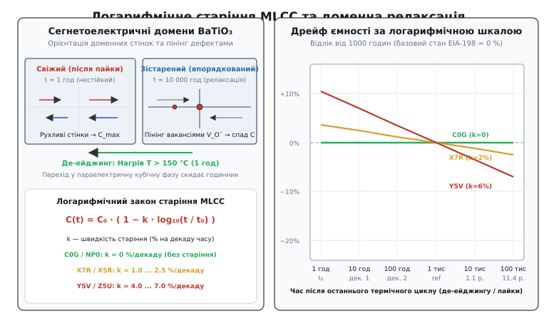
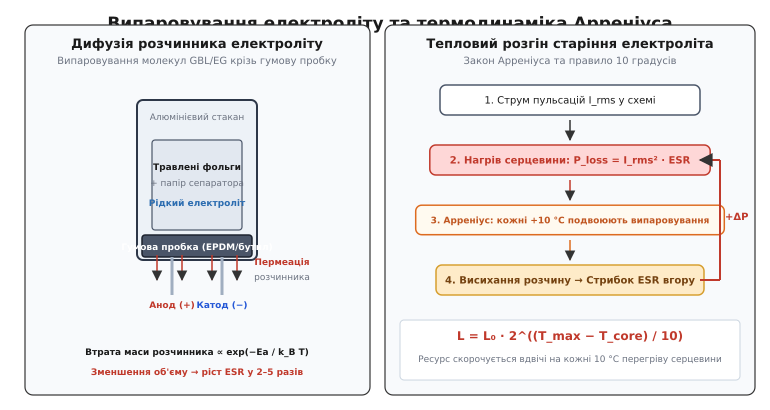
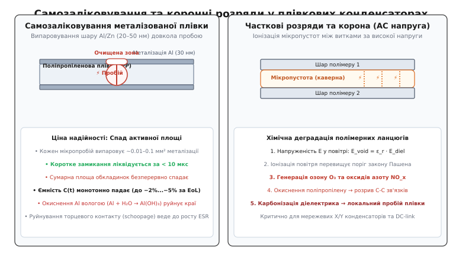
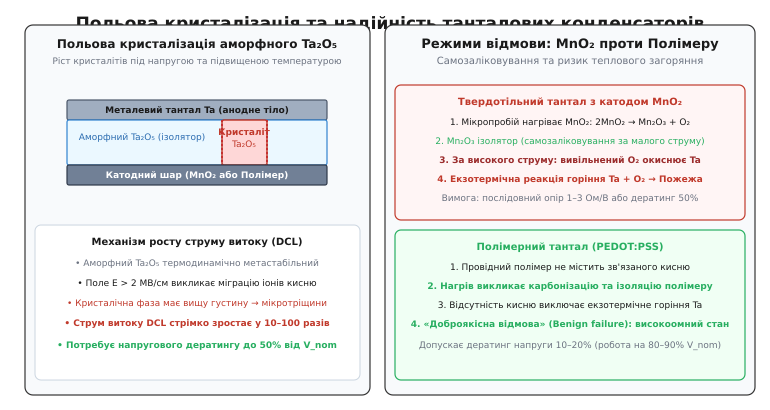
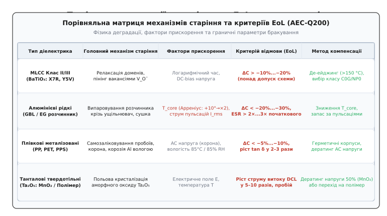

# Старіння конденсаторів

<preknowlist>
- [Конденсатор](topic:hw-components/capacitor) — фундаментальний принцип накопичення електричного заряду та енергії в діелектрику.
- [Діелектрики конденсаторів](topic:hw-components/capacitor-dielectrics) — поляризація речовини, діелектрична проникність та класи матеріалів.
- [ESR конденсатора](topic:hw-power/esr-capacitor) — еквівалентний послідовний опір, активні втрати та тангенс кута втрат.
- [Електролітичний конденсатор](topic:hw-components/electrolytic-cap) — будова анодної фольги, рідкий електроліт та роль оксидного шару.
- [MLCC](topic:hw-components/mlcc) — багатошарова монолітна структура керамічних чіп-конденсаторів.
- [Твердотільний танталовий конденсатор](topic:hw-components/tantalum-capacitor) — пористий анод, діелектрик пентаоксиду танталу та катодні системи.
- [Полімерний конденсатор](topic:hw-components/polymer-capacitor) — застосування провідних полімерів для зниження ESR та підвищення надійності.
- [Закон Арреніуса і ресурс компонентів](topic:hw-components/arrhenius-lifetime) — термодинамічна кінетика швидкості деградаційних хімічних реакцій.
- [Дератинг](topic:hw-components/derating) — зниження теплових та електричних навантажень для гарантування довговічності.
</preknowlist>

У тяговому інверторі міського електробуса потужністю 150 кВт блок силової фільтрації постійного струму (DC-link) бездоганно відпрацював перші три роки за щоденної експлуатації з середньою температурою охолоджувальної рідини близько +55 °C. На четвертий рік під час пікового літнього навантаження система керування почала фіксувати раптові аварійні вимкнення за перенапругою на шині живлення під час комутації IGBT-модулів. Осцилографічні вимірювання виявили, що високочастотні викиди напруги на силових ключах зросли з початкових 45 В до 180 В, небезпечно наблизившись до межі пробою кристалів 1200 В.

Демонтаж та лабораторна діагностика компонентів фільтра показали різнорідну, але узгоджену картину деградації діелектриків. Встановлені у вторинних ланцюгах контролера керамічні багатошарові конденсатори (MLCC) типорозміру 0805 на базі діелектрика X7R втратили 14 % початкової ємності. Алюмінієві електролітичні конденсатори з рідким електролітом втратили 22 % ємності, а їхній еквівалентний послідовний опір `ESR` зріс від початкових 18 мОм до 74 мОм, викликавши подвоєння внутрішнього Джоулевого нагріву. Плівкові поліпропіленові конденсатори високої напруги втратили 4.5 % ємності внаслідок десятків тисяч локальних мікропробоїв, а твердотільні танталові конденсатори в колах аналогових датчиків струму збільшили струм витоку у 8 разів.

Жоден із цих компонентів не зазнав миттєвого електричного удару, короткого замикання чи перевищення граничних паспортних параметрів (англ. *Absolute Maximum Ratings*). Усі напруги, струми та температури суворо вкладалися у розрахункові інженерні рамки. Пристрій деградував через фундаментальний, невпинний фізико-хімічний процес зміни структури матеріалів під впливом термодинамічних флуктуацій, електричних полів, дифузії речовин та механічних напружень — **старіння конденсаторів** (англ. *capacitor aging*, від латинського *capacitas* — місткість та *aevitas* — вік).

> 🔧 **Навіщо це.** Конденсатор — єдиний пасивний компонент в електроніці, параметри якого можуть суттєво змінитися без зовнішніх аварій лише внаслідок плину часу або перебування на складі. Розуміння фізики старіння різних класів діелектриків дозволяє закладати точні початкові запаси ємності, правильно інтерпретувати результати вхідного контролю компонентів, прогнозувати температурний розгін вихідних фільтрів та проєктувати пристрої з гарантованим терміном безвідмовної служби понад 10–25 років.

## Керамічні MLCC класу II та III: доменна релаксація та де-ейджинг

Керамічні конденсатори наймасовішого застосування — багатошарові керамічні монолітні чіпи (англ. *Multi-Layer Ceramic Capacitors*, MLCC) — демонструють унікальний механізм старіння, який є повністю оборотним за допомогою термічного нагрівання.

Діелектриком кераміки класу II (зокрема типів X7R, X5R, X8R) та класу III/IV (Y5V, Z5U) виступає титанат барію `BaTiO3` зі спеціальними легуючими добавками. Цей матеріал належить до класу **сегнетоелектриків** (англ. *ferroelectrics*, від імені сегнетової солі, вперше синтезованої французьким аптекарем П'єром Сеньєтом, фр. *Pierre Seignette*).


*Зліва: кристалічна ґратка BaTiO3 та фіксація доменних меж дефектами, що викликає спад діелектричної проникності, і повернення до початкового стану де-ейджингом. Справа: логарифмічний дрейф ємності для діелектриків C0G, X7R та Y5V за декадами часу.*

### Кристалічна ґратка перовскіту та точка Кюрі

Кристалічна структура титанату барію має перовскітну будову: у вершинах кубічної комірки розташовані іони барію `Ba²⁺`, у центрах граней — іони кисню `O²⁻`, а в геометричному центрі комірки — іон титану `Ti⁴⁺`.

За температури вище критичної точки Кюрі (англ. *Curie temperature*, `T_Curie ≈ +120...+130 °C`, названої на честь французького фізика П'єра Кюрі, фр. *Pierre Curie*) кристалічна ґратка є строго симетричним центросиметричним кубом. У такому стані центри позитивних і негативних зарядів збігаються, спонтанний електричний дипольний момент дорівнює нулю (`P_s = 0`), а матеріал перебуває у **параелектричній фазі** (англ. *paraelectric phase*).

Коли температура опускається нижче точки Кюрі (наприклад, під час охолодження плати після паяння оплавленням при температурі +240...+260 °C), відбувається фазовий перехід другого роду:
1. Кубічна ґратка витягується вздовж однієї з просторових осей, перетворюючись на тетрагональну призму (відношення осей `c/a ≈ 1.01`).
2. Центральний іон титану `Ti⁴⁺` зазнає зміщення від центросиметричного положення приблизно на `0.01 нм` у бік одного з кисневих іонів.
3. У кожній елементарній комірці виникає стійкий електричний диполь зі спонтанною поляризацією.

### Утворення доменної структури та пінінг вакансіями

Щоб мінімізувати пружну механічну деформацію та електростатичну енергію кристала, сусідні диполі спонтанно групуються у макроскопічні області однакової орієнтації — **сегнетоелектричні домени** (англ. *domains*, від латинського *dominium* — володіння). Межі між доменами розділяються 90-градусними та 180-градусними доменними стінками.

Колосальна діелектрична проникність титанату барію (`ε_r ≈ 2000 ... 15000`) зумовлена не лише зміщенням окремих іонів усередині комірки, а й коливальним зміщенням самих доменних стінок під дією слабкого змінного електричного поля.

Одразу після охолодження нижче точки Кюрі доменна структура перебуває у хаотичному, механічно напруженому та термодинамічно метастабільному стані. Доменні стінки легко ковзають крізь кристалічну ґратку, завдяки чому свіжоохолоджений керамічний конденсатор має максимально можливу початкову ємність `C_max`.

З часом під дією теплових коливань у кристалі відбуваються два повільних процеси:
1. Домени спонтанно переорієнтовуються у термодинамічно стійкіші низькоенергетичні конфігурації з меншою вільною енергією Гіббса.
2. Природні точкові дефекти кераміки — подвійно іонізовані кисневі вакансії `V_O¨` та домішкові іони акцепторів — повільно мігрують крізь ґратку до меж доменів. Осідаючи на доменних стінках, вони створюють локальні потенційні ями і механічно блокують рух стінок. Цей ефект закріплення називають **доменним пінінгом** (англ. *domain wall pinning*).

Втрата рухливості доменних стінок означає зменшення їхнього внеску в загальну поляризацію діелектрика, через що діелектрична проникність `ε_r` і ємність конденсатора `C` невпинно зменшуються.

Історію того, як це явище спантеличило перших розробників радарів і призвело до виявлення фазових переходів у титанаті барію, наведено у [історії відкриття сегнетоелектрики титанату барію та загадки «зникаючої ємності»](topic:hw-components/capacitor-aging/hist-de-aging-discovery.md).

### Логарифмічний закон старіння та декади часу

Оскільки релаксація охоплює широкий статистичний спектр енергій активації бар'єрів, швидкість зміни ємності у часі підпорядковується строгому **логарифмічному закону**:

```
C(t) = C_0 · ( 1 − k · log₁₀(t / t_0) )
```

У цій формулі:
- `C(t)` — ємність конденсатора у момент часу `t`;
- `t_0` — початкова точка відліку часу після останнього нагрівання вище точки Кюрі;
- `C_0` — ємність конденсатора у момент часу `t_0`;
- `k` — **коефіцієнт швидкості старіння** (англ. *aging rate*), що виражається у відсотках спаду ємності на одну декаду часу (`% / decade`).

Декада часу означає десятикратне збільшення напрацювання. Якщо за початок відліку прийняти `t = 1 година`, то декади часу розгортаються у геометричній прогресії:
- 1 декада: від 1 до 10 годин;
- 2 декади: від 10 до 100 годин;
- 3 декади: від 100 до 1 000 годин (близько 42 діб);
- 4 декади: від 1 000 до 10 000 годин (близько 1.14 року);
- 5 декад: від 10 000 до 100 000 годин (близько 11.4 років).

Величина коефіцієнта старіння `k` визначається класом діелектрика:
- **Клас I (C0G, NP0):** матеріали на основі цирконату кальцію `CaZrO3` не мають сегнетоелектричних доменів, тому `k = 0 %/декаду`. Їхня ємність абсолютно стабільна у часі.
- **Клас II (X7R, X5R, X8R):** стабілізована кераміка з легуванням, типове значення `k = 1.0 ... 2.5 %/декаду`.
- **Клас III / IV (Y5V, Z5U):** нелегована високопроникна кераміка з великими зернами, типове значення `k = 4.0 ... 7.0 %/декаду`.

Для розрахунку дрейфу X7R з коефіцієнтом `k = 2.0 %/декаду`: за перші 1000 годин після виготовлення конденсатор втратить `3 · 2.0 % = 6.0 %` від початкового годинного значення, а за наступні 11 років експлуатації — ще `2 · 2.0 % = 4.0 %`.

### Де-ейджинг: стирання годинника старіння

Оскільки старіння кераміки зумовлене суто просторовою конфігурацією доменів і пінінгом вакансій, а не хімічним руйнуванням чи випаровуванням речовини, цей процес є **повністю оборотним**.

Якщо нагріти зістарений конденсатор вище точки Кюрі — зазвичай до температури **+150 °C протягом щонайменше 1 години** — тетрагональне спотворення зникає, кристал повертається в кубічну параелектричну фазу, а всі закріплені доменні стінки повністю розпадаються.

Під час наступного охолодження до кімнатної температури процес формування доменної структури починається з абсолютно чистого початкового стану. Годинник старіння скидається на `t = 0`, і ємність миттєво повертається до максимального значення `C_max`. Цю технологічну процедуру називають **де-ейджингом** (англ. *de-aging*).

> ⚠️ **Пастка вхідного контролю на складі.** Будь-який процес високотемпературного паяння (хвилею при +260 °C або оплавленням у печі) є повноцінним циклом де-ейджингу. Якщо виміряти ємність MLCC X7R одразу після виходу плати з печі, прилад покаже ємність на 5–8 % вищу за номінал. Якщо ж та сама партія котушок пролежала на складі 9 місяців, вхідний контроль покаже ємність біля нижньої межі допуску. Міжнародні стандарти **EIA-198** та **IEC 60384-9** встановлюють арбітражне правило: номінальна ємність керамічного конденсатора нормується строго через **1000 годин** після останнього термічного циклу де-ейджингу.

Взаємозв'язок старіння з постійною напругою зміщення (DC-bias ефектом) полягає в тому, що зовнішнє поле додатково фіксує диполі, проте спад від DC-bias зникає миттєво після зняття напруги, тоді як релаксаційне старіння повертається лише через тепловий нагрів.

## Алюмінієві електролітичні конденсатори: дифузія та випаровування

Алюмінієві електролітичні конденсатори з рідким електролітом (англ. *Aluminum Electrolytic Capacitors with Liquid Electrolyte*) мають діаметрально іншу фізику старіння. Тут процес носить суто хімічний, необоротний характер і полягає у фізичній втраті рідкої фази.


*Зліва: конструкція алюмінієвого електролітичного конденсатора та шляхи молекулярної пермеації розчинника крізь гумовий торцевий ущільнювач. Справа: позитивний зворотний зв'язок теплового розгону старіння (струм пульсацій → нагрів серцевини → випаровування → ріст ESR).*

### Хімія та механіка висихання

Внутрішня структура конденсатора являє собою рулон із двох травлених алюмінієвих фольг, розділених пористим паперовим сепаратором. Анодна фольга покрита нанометровим діелектричним шаром оксиду алюмінію `Al2O3`. Щоб забезпечити електричний контакт з глибокими нанопорами травленої фольги, сепаратор просочують рідким струмопровідним електролітом.

Електроліт складається з органічного розчинника високої чистоти (γ-бутиролактон `GBL`, етиленгліколь `EG` або диметилформамід `DMF`) та розчинених солей (солі борної кислоти або дикарбонових кислот, четвертинні амонієві сполуки). Знизу алюмінієвий стакан герметизується гумовою пробкою (англ. *end seal bung*) на основі бутилкаучуку або етилен-пропіленового каучуку (`EPDM`), крізь яку проходять металеві виводи.

Полімерний матеріал гумової пробки не є абсолютно непроникним бар'єром. На молекулярному рівні розчинник електроліту має ненульовий тиск насиченої пари і повільно дифундує крізь мікропори гуми у навколишнє середовище шляхом молекулярної пермеації (англ. *permeation*).

Втрата розчинника призводить до послідовної ланцюгової деградації:
1. **Зменшення ефективної площі контакту:** рівень рідини спадає, електроліт відступає з найтонших пор анодної фольги. Оскільки ємність пропорційна площі перекриття `C = ε_0 · ε_r · (A / d)`, ємність конденсатора починає монотонно спадати.
2. **Падіння питомої іонної провідності:** концентрація солей у залишку розчину зростає понад точку евтектики, розчин гусне, перетворюючись на високов'язкий гель. Рухливість іонів падає у десятки разів.
3. **Експоненційне зростання ESR:** опір рідкого шару формує основу еквівалентного послідовного опору `ESR`. При висиханні електроліту `ESR` зростає у 2–5 разів, а на фінальній стадії — у 10–50 разів від початкового паспортного значення.

### Закон Арреніуса та правило 10 градусів

Швидкість дифузії та випаровування молекул розчинника визначається термодинамічною енергією активації молекул за законом Арреніуса. Оскільки енергія активації випаровування типових розчинників становить `E_a ≈ 0.90 ... 0.98 еВ`, швидкість процесу старіння подвоюється на кожні 10 °C підвищення температури.

Емпірична залежність залишкового ресурсу конденсатора `L` від робочої температури описується відомим **правилом 10 градусів**:

```
L = L_0 · 2^( (T_max − T_core) / 10 ) · ( V_max / V_applied )^n
```

У цій формулі:
- `L_0` — гарантований виробником ресурс при граничній температурі `T_max` (наприклад, `2000 годин` при `+105 °C` або `5000 годин` для довговічних серій);
- `T_core` — внутрішня температура найбільш нагрітої точки серцевини конденсатора (англ. *hot-spot core temperature*);
- `V_max` та `V_applied` — номінальна та фактично прикладена постійна напруга;
- `n` — емпіричний показник напругового дератингу (`n ≈ 0 ... 1.0` для алюмінієвих електролітів).

### Джоулів самонагрів та петля теплового розгону старіння

Головна небезпека рідких електролітів полягає у взаємодії між струмом пульсацій та опором `ESR`. Коли через конденсатор фільтра протікає середньоквадратичний змінний струм `I_rms`, у його внутрішньому об'ємі виділяється активна потужність втрат:

```
P_loss = I_rms² · ESR
```

Це тепло розсіюється через металевий корпус із тепловим опором `R_th` (°C/Вт), нагріваючи серцевину до температури:

```
T_core = T_ambient + ΔT = T_ambient + I_rms² · ESR · R_th
```

Тут виникає згубний **позитивний зворотний зв'язок** (петля теплового розгону старіння):
1. Струм пульсацій викликає початковий нагрів серцевини `ΔT`.
2. Вища температура `T_core` за законом Арреніуса прискорює дифузію розчинника крізь гумовий ущільнювач.
3. Випаровування розчинника викликає зростання опору `ESR`.
4. Зростання `ESR` за того самого струму пульсацій `I_rms` генерує ще більше тепла `P_loss`.
5. Серцевина нагрівається ще сильніше, прискорюючи фінальне висихання.

Якщо робоча точка не збалансована інженерним запасом, цей процес завершується лавиноподібним руйнуванням: електроліт закипає, внутрішній тиск пари розриває запобіжну насічку на кришці алюмінієвого стакана (англ. *vent opening*), а конденсатор перетворюється на розімкнене коло з повною втратою фільтрації.

Математичний вивід коефіцієнтів Арреніуса та покроковий розрахунок перегріву серцевини наведено у [математичних моделях старіння діелектриків](topic:hw-components/capacitor-aging/math-aging-kinetics.md).

## Плівкові конденсатори: самозаліковування, коронний розряд та вологість

Плівкові конденсатори (англ. *Film Capacitors*) на базі поліпропілену (`PP`), поліетилентерефталату (`PET`, лавсан/майлар) або поліфеніленсульфіду (`PPS`) вважаються еталоном довговічності у силових фільтр-ланках відновлюваної енергетики та електромобілів. Проте й вони мають власні фізичні межі довготривалої надійності.


*Зліва: процес самозаліковування (clearing) при локальному пробої металізованої плівки з випаровуванням шару алюмінію. Справа: коронні та часткові розряди у мікропустотах між витками під високою змінною напругою.*

### Механізм самозаліковування (Clearing)

У металізованих плівкових конденсаторах електродами слугує ультратонкий шар алюмінію чи цинку завтовшки всього `20 ... 50 нм`, нанесений на полімерну плівку методом вакуумного напилення.

Якщо всередині діелектричної плівки через локальний дефект (мікропустоту або сторонню домішку) під дією напруженості електричного поля виникає електричний мікропробій, утворюється плазмовий мікрошнур. Струм короткого замикання за лічені мікросекунди нагріває зону пробою до температури понад +1000 °C.

За такої температури нанометровий металевий шар довкола точки пробою миттєво випаровується і розлітається радіусом у кілька десятків мікрометрів. Метал окиснюється до ізолюючого оксиду `Al2O3`, ізолюючи зону пробою від решти електрода за час менше 10 мкс без спалаху та без катастрофічного закорочування виводів. Цей процес називають **самозаліковуванням** (англ. *self-healing* або *clearing*).

Ціною такого надійного захисту від короткого замикання є безперервний **спад активної площі обкладинок**. Кожна подія самозаліковування безповоротно забирає крихітний шматочок площі електроду. Протягом років роботи під дією імпульсних сплесків напруги ємність плівкового конденсатора повільно й монотонно зменшується (зазвичай на 2–5 % за весь гарантований термін служби).

### Коронний розряд та часткові розряди під змінною напругою

Під час роботи на високій змінній або пульсуючій напрузі (AC) домінує механізм **часткових розрядів** (англ. *Partial Discharge*, PD).

Між витками змотаної плівки завжди залишаються мікроскопічні повітряні пустоти. Оскільки діелектрична проникність поліпропілену (`ε_r ≈ 2.2`) вища за проникність повітря (`ε_r = 1.0`), напруженість електричного поля всередині повітряної пустоти виявляється у 2.2 раза вищою, ніж у сусідньому полімері.

Коли напруженість поля в каверні перевищує поріг іонізації повітря за законом Пашена, спалахують мікроскопічні коронні розряди. Утворена холодна плазма іонізує залишковий кисень і азот, генеруючи озон `O3` та оксиди азоту `NO_x`. Ці хімічно агресивні сполуки атакують полімерні ланцюжки поліпропілену, окиснюють вуглецеві зв'язки, викликають розтріскування плівки та її поступову карбонізацію з перетворенням на провідний вуглецевий слід.

### Електрохімічна корозія металізації вологою

Треттім фактором старіння плівкових конденсаторів є **дифузія атмосферної вологи** крізь епоксидний компаунд або пластиковий корпус.

Молекули води `H2O`, потрапляючи на ультратонкий шар алюмінієвої металізації під дією електричного поля, вступають в електрохімічну реакцію:

```
2Al + 6H₂O → 2Al(OH)₃ + 3H₂↑
```

Утворений гідроксид алюмінію `Al(OH)3` є непровідним пухким ізолятором. Корозія розвивається від країв плівки всередину, відсікаючи металізацію від торцевого напиленого контактного шару (цинкового контакту *schoopage*). Це викликає комбіноване падіння ємності та різке зростання тангенса кута втрат `tan δ`.

## Танталові конденсатори: польова кристалізація та надійність

Твердотільні танталові конденсатори (англ. *Solid Tantalum Capacitors*) використовують пористу анодну губку зі спеченого порошку металевого танталу, покриту тонким анодованим шаром пентаоксиду танталу `Ta2O5` завтовшки від 20 до 200 нм.


*Зліва: фазовий перехід аморфного Ta2O5 у кристалічну фазу під дією сильного електричного поля, що формує провідні канали витоку. Справа: порівняння безпеки відмови між класичним катодом MnO2 (ризик горіння) та провідним полімером.*

### Фізика польової кристалізації

Анодний діелектрик `Ta2O5` спочатку формується у чисто **аморфному стані** (англ. *amorphous oxide*). Аморфна сітка не має меж зерен і забезпечує надзвичайно низький струм витоку за напруженості поля до `E ≈ 2 ... 5 МВ/см`.

Проте аморфна фаза `Ta2O5` є термодинамічно метастабільною відносно стабільної кристалічної модифікації. Під одночасною дією двох факторів — сильного електричного поля та підвищеної температури — починається процес **польової кристалізації** (англ. *field-induced crystallization*).

Іони кисню в аморфній сітці повільно дрейфують уздовж силових ліній поля до інтерфейсу метал/оксид. У точках концентрації механічних напружень або домішок зароджуються кристалічні острівці `Ta2O5`. Оскільки кристалічний пентаоксид танталу має більшу густину, ніж аморфний, на межах між кристалітом та аморфною матрицею виникають мікротріщини та висока концентрація кисневих вакансій.

Межі зерен кристалітів утворюють низькоомні канальні шляхи витоку електронів. Внаслідок цього струм витоку (англ. *Direct Current Leakage*, DCL) конденсатора під час тривалої експлуатації зростає у 5–50 разів, що веде до локального точкового пробою діелектрика.

### Механізми відмови: MnO2 проти провідного полімеру

Наслідки локального пробою танталового діелектрика критично залежать від матеріалу катодного шару:

1. **Танталові конденсатори з катодом з діоксиду марганцю (`MnO2`):**
   Діоксид марганцю є твердим напівпровідником. Під час локального мікропробою тепловий нагрів викликає хімічне розкладання катода:
   ```
   2MnO₂ → Mn₂O₃ + O₂
   ```
   Утворений оксид `Mn2O3` є ізолятором. За малого струму це забезпечує самозаліковування дефекту. Проте якщо конденсатор живиться від потужної шини живлення з низьким внутрішнім опором (великий струм КЗ), вивільнений атомарний кисень `O2` миттєво вступає у бурхливу екзотермічну реакцію з металевим танталом анода:
   ```
   4Ta + 5O₂ → 2Ta₂O₅ + Q (тепло)
   ```
   Тантал — пірофорний метал. Починається екзотермічне самопідтримуване горіння з температурою понад +2000 °C, що супроводжується вибухом корпусу, відкритим полум'ям та пропалюванням друкованої плати. Саме тому для танталових конденсаторів з `MnO2` обов'язковим правилом є **50 % напруговий дератинг** (робота при напрузі не більше половини від номінальної) та обмеження струму послідовним резистором.

2. **Танталові конденсатори з полімерним катодом (Ta-Polymer):**
   У сучасних танталових конденсаторах замість `MnO2` застосовують струмопровідні полімери — полі-3,4-етилендіокситіофен (`PEDOT:PSS`). Провідний полімер не містить у своєму складі зв'язаного кисню. Під час локального перегріву полімер локально карбонізується або випаровується, перетворюючись на високоомний ізолятор, без вивільнення окиснювача. Тантал не спалахує. Така відмова є суто «доброякісною» (англ. *benign failure mode*), що дозволяє експлуатувати полімерні танталові конденсатори з напруговим запасом усього 10–20 % від номіналу.

## Розрахунок залишкового ресурсу (EoL) та стандарти надійності

Поняття кінця життєвого циклу конденсатора (англ. *End of Life*, EoL) в інженерній практиці не тотожне фізичному руйнуванню або короткому замиканню. EoL настає тоді, коли параметри деталі виходять за рамки, необхідні для стабільної роботи електронної схеми.


*Зведена інженерна таблиця критеріїв досягнення кінця життєвого циклу (EoL) та стандартних вимог автомобільного стандарту AEC-Q200 для всіх основних типів діелектриків.*

### Стандартні критерії бракування (EoL limits)

Згідно з міжнародними стандартами **IEC 60384** та вимогами автомобільного комітету **AEC-Q200** (Rev D/E), компоненти вважаються такими, що вичерпали свій ресурс, за таких умов:

1. **Алюмінієві електролітичні рідкі:**
   - Падіння ємності: `ΔC / C_0 > −20 %` (для деяких силових серій `−30 %`);
   - Зростання опору втрат: `ESR > 2.0 · ESR_initial` (подвоєння початкового паспорта);
   - Тангенс кута втрат: `tan δ > 2.0 · tan δ_initial`;
   - Струм витоку: перевищення паспортного ліміту `I_leak > I_max`.

2. **Керамічні MLCC класу II (X7R, X5R):**
   - Сумарний спад ємності `ΔC / C_0 > −12.5 %` (або вихід за межі початкового поля допуску ±10 % з урахуванням DC-bias та логарифмічного старіння);
   - Опір ізоляції: падіння нижче `R_ins < 100 МОм` (або `R_ins · C < 10 Ом · Ф`).

3. **Плівкові металізовані:**
   - Падіння ємності: `ΔC / C_0 > −5 %` (для прецизійних кіл) або `−10 %` (для силових фільтрів);
   - Зростання тангенса втрат: `tan δ > 2 ... 3` рази від початкового.

4. **Твердотільні танталові:**
   - Зростання струму витоку: `DCL > 5 ... 10` разів від базового паспортного значення.

Систематизований аналіз усіх технологій, факторів стресу та математичних моделей наведено у [порівнянні механізмів старіння, ресурсних моделей та критеріїв EoL конденсаторів](topic:hw-components/capacitor-aging/comp-aging-mechanisms.md).

Практичний програмний інструмент для моделювання поведінки фільтрів за комплексним профілем експлуатації представлено у [калькуляторі залишкового ресурсу та деградації конденсаторів під профілем навантаження](topic:hw-components/capacitor-aging/proj-lifetime-estimator.md).

### Інженерні правила проєктування довговічних схем

Щоб гарантувати 10–25 років безвідмовної служби виробу, інженери керуються чотирма системними правилами:

1. **Комбінована компенсація спаду ємності MLCC:**
   При розрахунку стабільності контуру зворотного зв'язку або фільтрації DC-DC перетворювача номінал керамічного конденсатора закладають з урахуванням найгіршого випадку комбінації чотирьох факторів:
   ```
   C_actual = C_nom · ( 1 − Tol_mfg ) · ( 1 − Loss_DC_bias ) · ( 1 − Loss_temp ) · ( 1 − k · log₁₀( t / t_0 ) )
   ```
   Для конденсатора X7R номіналом 10 мкФ на 16 В при роботі на напрузі 12 В і температурі +85 °C через 5 років реальна ємність може складати всього `10 · (1 − 0.10) · (1 − 0.55) · (1 − 0.05) · (1 − 0.08) ≈ 3.53 мкФ` (втрата 65 % від паспорта).

2. **Тепловий дератинг електролітів:**
   Зниження робочої температури корпусу рідкого електроліту всього на 20 °C (наприклад, з +85 °C до +65 °C за рахунок грамотного компонування друкованої плати подалі від силових дроселів і радіаторів) збільшує термін служби пристрою у **4 рази** (`2² = 4`).

3. **Застосування гібридних та твердотільних технологій:**
   У важкодоступних блоках живлення з необслуговуваним ресурсом > 15 років рідкі електроліти замінюють на гібридні алюмінієво-полімерні конденсатори (англ. *Hybrid Aluminum Polymer*), де рідкий розчинник зв'язаний гелеподібною полімерною матрицею, що виключає катастрофічне висихання.

4. **Напруговий дератинг танталу:**
   Для класичних танталових конденсаторів з `MnO2` робоча напруга не повинна перевищувати 50 % номіналу. Для полімерних танталових конденсаторів допускається робота на 80–90 % номінальної напруги.

## Підсумок

Старіння конденсаторів — це не абстрактний випадковий збій, а суворий термодинамічний процес із чітко визначеною фізичною кінетикою:
- **Кераміка MLCC класу II/III** релаксує за логарифмічним законом через закріплення доменних стінок вакансіями і повністю відновлюється термічним де-ейджингом вище точки Кюрі (+150 °C);
- **Рідкі електроліти** незворотно висихають через пермеацію розчинника за законом Арреніуса (правило 10 °C), що загрожує тепловим розгоном від зростання `ESR` під струмом пульсацій;
- **Плівкові конденсатори** повільно втрачають ємність через випаровування металізації під час самозаліковування мікропробоїв та руйнуються частковими коронними розрядами під високою змінною напругою;
- **Танталові конденсатори** зазнають польової кристалізації діелектрика `Ta2O5` зі зростанням струму витоку, де провідний полімер забезпечує безпечну відмову на відміну від пірофорного катода `MnO2`.

Довговічність електронного пристрою визначається не удачею, а точним фізико-хімічним розрахунком закладених компонентів на етапі схемотехнічного проєктування.
