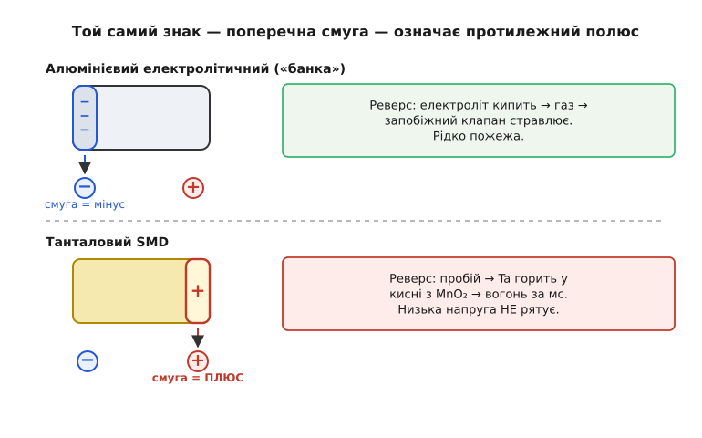

# 🔌 Електролітичні й танталові: смуга «−» проти смуги «+», і чому тантал горить

Полярний конденсатор має один правильний бік. Поставите його навпаки — у кращому випадку він тихо втратить ємність і потече, у гіршому спалахне за мілісекунди й випалить діру в платі. Уся профілактика зводиться до одного вміння: **подивитися на корпус і безпомилково сказати, де плюс**. Проблема в тому, що алюмінієвий електролітичний і танталовий конденсатори позначають полярність **протилежними знаками** — і рефлекс, напрацьований на одному, підставляє на іншому. Розберімо обидві конвенції, чому вони такі, і що саме фізично стається при зворотній установці.

### Дві протилежні конвенції на одній платі

На **алюмінієвому електролітичному** («банка», англ. *can*) маркують **мінус**: уздовж корпусу йде кольорова (зазвичай світла) **смуга зі знаками «−»**, і вона вказує на **негативний** вивід. Логіка проста: у наскрізно-монтажного (THT) конденсатора плюсовий вивід ще й роблять довшим, тож смуга «−» і коротша ніжка вказують на той самий бік — мінус. Рефлекс закарбовується миттєво: **смуга = мінус**.

На **танталовому** SMD-конденсаторі все навпаки: **риска (смуга) позначає плюс**. Світла полоса — найчастіше жовта, біла або сіра — на одному торці корпусу вказує на **анод, тобто плюс**. Той самий візуальний знак — поперечна смуга на торці — означає на танталі **протилежний полюс**, ніж на алюмінієвій банці.

```
            смуга на корпусі вказує на:
─────────────────────────────────────────────
алюмінієвий електроліт   →   МІНУС  (−)
танталовий SMD           →   ПЛЮС   (+)
─────────────────────────────────────────────
            той самий знак — протилежний полюс
```

Звідки така розбіжність? Не з фізики, а з історії: конвенції склалися в різних галузях незалежно одна від одної, і кожна закріпила свій стандарт раніше, ніж постало питання сумісності. Алюмінієві електроліти прийшли з силової та аудіотехніки, де THT-«банка» з довгим плюсовим виводом природно тягла за собою позначення короткого мінусового кінця. Танталові — з компактної військової та космічної електроніки, де маркують анод. Жодна сторона не «помиляється»; просто **єдиного правила «смуга = такий-то полюс» не існує**, хоча око розробника відчайдушно хоче такого правила. Саме тому на змішаній платі, де поряд стоять і алюмінієві, і танталові конденсатори, перенесений рефлекс «смуга = мінус» — найчастіша причина встановити тантал задом наперед.


*Той самий знак — поперечна смуга на торці — на алюмінієвій банці вказує на мінус, а на танталовому чипі на плюс. Праворуч — що стається при зворотній установці кожного типу.*

> 🔧 **Навіщо це.** Коли ви паяєте плату ESP32 з танталом на вході регулятора живлення поряд із алюмінієвим електролітом на виході, ці два конденсатори вимагають **протилежного** прочитання смуги. Звичка з ремонту блоків живлення («смуга — це мінус») тут пряма дорога до спаленого тантала на першому ж увімкненні. Перед паянням полярного SMD-тантала перевіряйте позначку плюса на корпусі **і** контур плюса в посадковому місці плати, а не діяти рефлексом.

### Що написано на корпусі, крім полярності

Полярність — лише половина маркування. На корпусі, де є місце (передусім на алюмінієвій банці), друкують повний набір, і читати треба **всі числа**:

```
470 µF   25 V   105 °C        2• 4 1
└──┬──┘  └─┬─┘  └──┬──┘        └──┬──┘
 ємність  гранична  темп.клас    дата-код
          напруга   (ресурс)     (рік • тиждень)
```

- **Ємність** у мікрофарадах прямим текстом: «470 µF». На «банці» місця досить, тому кодування трьома цифрами (як на дрібній кераміці) тут не потрібне — дешевше надрукувати повний номінал.
- **Гранична напруга** «25 V» — це **максимум**, який витримує оксидний діелектрик, а **не** робоча точка. Її беруть із запасом (про запас нижче).
- **Температурний клас** «105 °C» (буває 85 °C) — верхня робоча температура, від якої прямо залежить **ресурс**: рідкий електроліт усередині висихає тим швидше, чим гарячіше, і кожні зайві ~10 °C приблизно вдвічі скорочують строк життя. Тому «105 °C» проти «85 °C» у теплому корпусі — це принципово довший ресурс, а не просто інша цифра.
- **Дата-код** — найчастіше у форматі **YYWW** (дві цифри року, два — тижня): «2412» означає 12-й тиждень 2024 року. Він важить, бо в електролітів є **строк зберігання**: оксидна плівка з роками деградує, і дуже старі деталі перед увімкненням інколи доводиться «формувати» поступовим підняттям напруги. Кодування дати в виробників різниться, тож формат уточнюють за даташитом серії.

На **танталовому** SMD-корпусі місця менше, тому ємність і напругу часто кодують (наприклад, «476» = 47·10⁶ пФ = 47 µF, та сама мантиса-плюс-нулі, що й [на кераміці](root:hw-components/capacitor-code-and-package-reading), плюс літера-код напруги). Але **позначка плюса нікуди не зникає** — її лишають завжди, бо ціна помилки полярності тут найвища.

### Чому зворотна полярність — це не «трохи гірше», а відмова

Полярний конденсатор працює завдяки **надтонкій оксидній плівці**, яку електрохімічно вирощують на аноді й яка й служить діелектриком. Ця плівка — однобічна: вона тримає напругу лише в **одному** напрямку (плюс на аноді). Прикладіть напругу навпаки — і плівка перестає бути ізолятором. Далі сценарій різний для двох типів, і саме тут криється головна небезпека тантала.

**Алюмінієвий електроліт при зворотній напрузі.** Зворотна напруга руйнує оксид, через конденсатор тече дедалі більший струм, він гріється, а рідкий електроліт усередині **закипає й виділяє газ**. Тиск росте швидше, ніж корпус здатен його втримати. Щоб «банка» не лопнула, як граната, у сучасних конденсаторів на торці **надсічено запобіжний клапан** — хрест або K-подібна канавка: корпус по ній розкривається й **стравлює** газ, а не вибухає осколками. Тому над електролітом завжди лишають вільний простір — здута кришка не повинна впертися в сусідню деталь чи корпус приладу. Відмова неприємна (запах, бризки електроліту, інколи гучний хлопок), але здебільшого **не пожежна**.

**Танталовий при зворотній напрузі (або кидку струму).** Тут усе значно гірше, і причина — **внутрішня хімія**. У класичному твердотільному танталі катодом служить **діоксид марганцю (MnO₂)**. Зворотна напруга пробиває тонкий діелектрик (танталовий пентоксид, Ta₂O₅), опір падає майже до нуля, крізь конденсатор іде великий струм і місцево розігріває деталь. А MnO₂ — **сильний окисник**: від нагріву він віддає кисень, і цей кисень з'єднується з розжареним металевим танталом у **самопідтримну екзотермічну реакцію**. Тантал по суті **горить у власному кисні** — температура сягає понад 600 °C, конденсатор спалахує, димить або розламується, і все це **за мілісекунди** після подачі живлення. Найважливіше: цей механізм керується **хімією, а не величиною напруги**. Реверснутий тантал на 3.3 V відмовляє так само катастрофічно, як на 50 V, — низька напруга **не рятує**.

```
зворотна напруга → пробій діелектрика → струм майже без обмеження
   алюмінієвий: електроліт кипить → газ → клапан стравлює (рідко пожежа)
   танталовий:  Ta гріється + MnO₂ віддає O₂ → Ta горить → вогонь (мс)
```

> 🔧 **Навіщо це.** Саме через це маркування тантала вивчають окремо й перевіряють двічі. Інші помилки монтажу прощають: переплутаний резистор гріється, неправильна кераміка просто фільтрує не так. Реверснутий тантал на платі живлення — це **вогонь**, який випалює сусідні доріжки й деталі на першому ж увімкненні. Один цей факт виправдовує звичку перевіряти полярність тантала за корпусом і за платою, а не на пам'ять.

### Як із цим живуть на практиці

Знання двох конвенцій і механізму відмови переходить у кілька робочих звичок.

**Запас за напругою — обов'язковий, для тантала окремо суворий.** Граничну напругу на корпусі ніколи не вибирають «впритул» до робочої. Для танталів із MnO₂ галузеве правило — **дератинг щонайменше вдвічі (50%)** у колах із кидками струму: вхід DC-DC перетворювача, конденсатор прямо на батареї. Тобто в шину 5 V ставлять тантал не на 6.3 V, а **на 10 V і вище**. Причина не лише в самій напрузі: при ввімкненні живлення крізь конденсатор б'є **кидок струму (inrush)**, і саме швидке наростання напруги на тлі великого струму запускає ту саму займисту відмову, що й реверс. Запас за напругою цей ризик гасить. Для спокійніших застосувань (розв'язка, тайминг, вихід DC-DC) досить меншого запасу (~20%).

**Полімерний тантал — безпечніша відмова.** У сучаснішому різновиді замість MnO₂ катодом служить **провідний полімер (PEDOT)**. У полімері **немає активного кисню** в молекулі, тож при пробої тантал **не загоряється** — відмова «benign» (доброякісна): конденсатор закорочується, але **без вогню**. Полімерні танталові ще й стійкіші до кидків струму й мають нижчий послідовний опір. Розбіжність конвенцій маркування це не скасовує (полярність так само критична), але прибирає найстрашніший наслідок помилки. Якщо схема дозволяє, на вході живлення часто свідомо беруть полімерний тантал саме заради цього.

**Worked example: вибір тантала в шину 5 V.**

**Умова.** На вході DC-DC перетворювача в схемі ESP32 потрібен танталовий конденсатор 47 µF у шині 5 V. Це вузол із кидком струму при ввімкненні. Яку граничну напругу взяти й чому?

```c
// Дано: робоча напруга шини
const float V_rail   = 5.0f;     // V
// Правило для MnO2-тантала на вході перетворювача: дератинг 50%
const float derate   = 0.50f;    // макс. робоча = 50% від номіналу корпусу

// Мінімальна гранична напруга корпусу:
//   V_rail <= derate * V_rated   =>   V_rated >= V_rail / derate
float V_rated_min = V_rail / derate;   // = 5.0 / 0.50 = 10.0 V
```

```
крок                         значення
-------------------------    --------------------------
робоча напруга шини          5.0 V
дератинг (вхід DC-DC, MnO₂)  50%  → робоча = 0.5·номінал
мінімальний номінал корпусу  5.0 / 0.5 = 10 V
найближчий стандартний ряд   ставимо 16 V (з запасом)
```

**Висновок.** Тантал «47 µF 6.3 V» у шину 5 V — це майже впритул (робоча 5 V проти граничної 6.3 V, дератинг лише ~20%), і у вузлі з кидком струму він — кандидат на займання. Правильний вибір — **16 V** (а не мінімально-прохідні 10 V), бо стандартний ряд напруг дискретний і запас зайвим не буває. А якщо плата важлива — полімерний тантал тієї ж напруги, щоб навіть помилка монтажу не закінчилася вогнем.

### Типові граблі

- Перенести рефлекс **«смуга = мінус»** з алюмінієвого електроліта на танталовий SMD, де риска позначає **плюс** — і впаяти тантал задом наперед. Найпоширеніша й найдорожча помилка: результат не «трохи гірше», а вогонь на першому ввімкненні.
- Вважати, що **низька напруга безпечна**: «у мене всього 3.3 V, що йому буде». Займиста відмова тантала керується хімією MnO₂, а не величиною напруги — реверс на 3.3 V горить так само, як на 50 V.
- Брати граничну напругу тантала **впритул** до робочої. У колі з кидком струму (вхід DC-DC, прямо на батареї) потрібен дератинг **50%**, інакше кидок струму при ввімкненні запалює деталь без жодного реверсу.
- Читати на корпусі лише ємність, **проґавивши температурний клас і дату-код** алюмінієвого електроліта: «85 °C» у теплому місці й деталь п'ятирічної давнини — обидва тихо вкорочують ресурс.
- Ставити алюмінієву «банку» **впритул до сусідньої деталі чи кришки**, не лишивши простору над запобіжним клапаном — здута кришка не зможе стравити газ, і клапан не спрацює як задумано.

### Варіації

Існують і **неполярні** («біполярні», BP/NP) алюмінієві електроліти — фактично дві банки зустрічно, для кіл змінного струму; на них смуги полярності немає взагалі, бо немає «правильного» боку. Ніобієві конденсатори поводяться подібно до танталових (та сама родина оксидних діелектриків), але м'якша хімія робить їх менш схильними до займання. А **полімерний алюмінієвий** (та сама провідно-полімерна ідея, що й полімерний тантал, але на алюмінієвій основі) поєднує низький опір із доброякісною відмовою. Спільне для всієї родини одне: **полярність критична завжди**, а от наслідок її порушення — від тихого витоку до вогню — задає **внутрішня хімія конкретного типу**, і саме її, а не лише напис на корпусі, треба тримати в голові.
