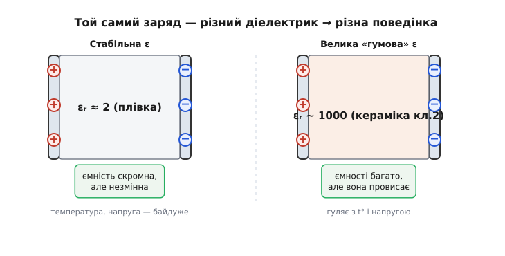
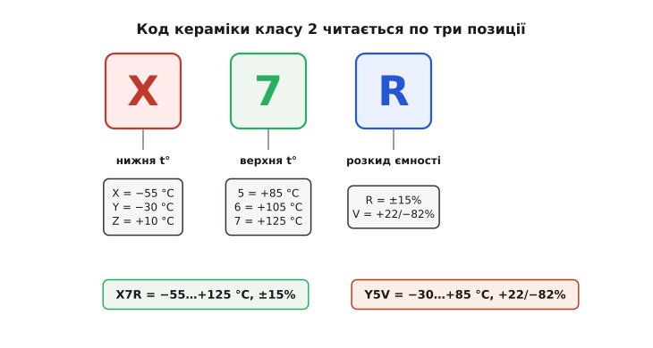
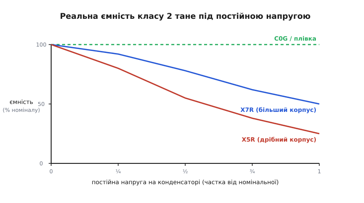
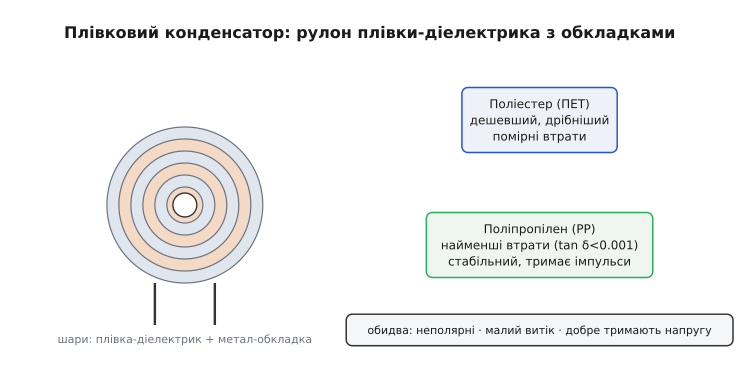
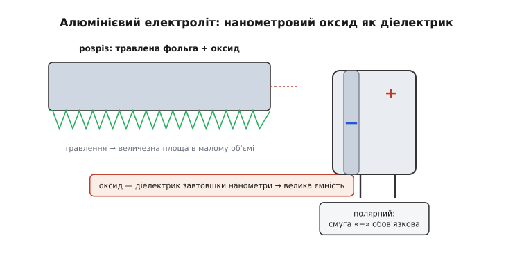
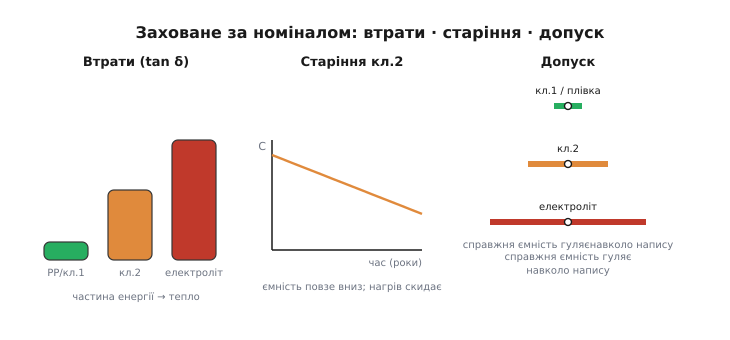
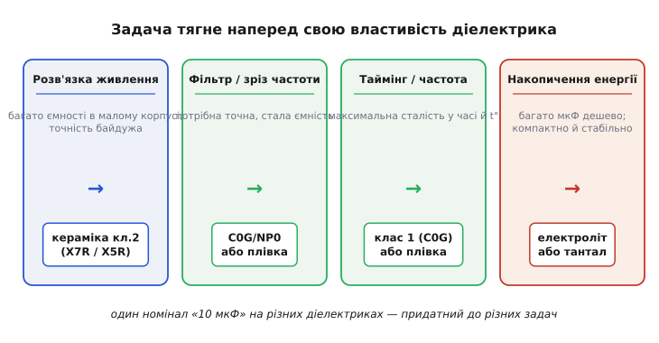

# Діелектрики конденсаторів: чому «10 мкФ» бувають геть різні

Два конденсатори лежать поруч: на обох написано «10 мкФ, 25 V», обидва коштують копійки. Поставте перший у годинниковий генератор — і годинник за добу збіжить на хвилини; поставте другий — і він триматиме час роками. Поставте перший у фільтр живлення під напругою — він віддасть усі свої 10 мкФ; другий під тією самою напругою всохне до кількох мікрофарад, і фільтр перестане фільтрувати. Те саме число на корпусі, та сама ємність на папері — і протилежна поведінка. Уся різниця ховається в одному: з чого зроблено **тонкий шар ізолятора між обкладками**. Цей шар і є діелектрик, і саме він, а не число мікрофарад, вирішує, на що конденсатор здатний. Розберімо, чому так — і як обрати правильний діелектрик, щоб схема працювала, а не «майже працювала».

### Чому все вирішує саме діелектрик

[Конденсатор](topic:hw-components/capacitor) — це два провідники, розділені ізолятором; заряд на обкладках тримається полем у зазорі, а сам ізолятор зветься діелектриком (*dielectric*, від грецьк. *dia-* «крізь» + *electric* — «той, крізь який проходить поле, але не струм»). Здавалося б, його роль скромна: не дати обкладкам торкнутися. Насправді все навпаки. Той самий заряд, розведений по обкладках, дає **різну** напругу залежно від того, що між ними, — бо діелектрик частково «гасить» поле власними молекулами, які повертаються назустріч йому. Що сильніше речовина гаситься полем, то більше заряду влазить на ту саму напругу, тобто то більша [ємність](topic:ph-electromagnetism/capacitance) при тих самих розмірах. Цю здатність речовини описує число — **діелектрична проникність** (*permittivity*, позначають ε): у вакууму вона взята за одиницю (точніше, за εᵣ = 1), у поліпропілену ≈ 2, а в спеціальної кераміки — тисячі.

Звідси перший наслідок, який пояснює все подальше: **щоб напхати багато мікрофарад у крихітний корпус, потрібен діелектрик із величезною ε**. А речовини з величезною ε — це особливі керамічні суміші, у яких та сама фізика, що дає високу проникність, водночас робить її **нестабільною**: вона гуляє з температурою, провисає під напругою, повільно змінюється з часом. Речовини зі скромною, але **сталою** ε (плівки, особлива кераміка) дають мало ємності на той самий об'єм, зате тримають її незмінно. Це і є головний компроміс усієї теми, і він не технологічна випадковість, а фізика: **велика ємність і стабільність тягнуть у різні боки**, бо за велику ε платять її непостійністю.


*Дві обкладки, однаковий розведений заряд — але різний діелектрик. Стабільна ε (зліва) дає скромну, зате незмінну ємність. Велика, але «гумова» ε (справа) дає багато ємності, що провисає від температури й напруги. Вибір діелектрика — це вибір місця на цій шкалі «багато проти стабільно».*

> 🔧 **Навіщо це.** Перше питання при доборі конденсатора — не «скільки мікрофарад», а «яка задача»: тримати точний час чи просто згладити живлення. Бо саме задача диктує, чи потрібна **стабільна** ємність (тоді беремо діелектрик зі скромною сталою ε й миримося з більшим корпусом), чи потрібно **багато** ємності в малому об'ємі (тоді беремо «гумову» кераміку й миримося з тим, що реальна ємність гуляє). Сплутати ці дві потреби — і схема або займе пів плати, або «попливе».

### Класи кераміки: стабільна проти місткої

Керамічні конденсатори — найпоширеніші у світі, і всередині них діелектрик ділять на **два класи**, які стоять на протилежних кінцях нашого компромісу.

**Клас 1** — стабільна кераміка. Найвідоміший представник має код **C0G** (його ж за старою військовою системою звуть **NP0**, *Negative-Positive-Zero* — «коефіцієнт ні додатний, ні від'ємний, а нуль»). Її ε скромна, тож великих номіналів не буває — типово від часток пікофарада до десятків нанофарад. Зате вона майже ідеальна: ємність змінюється з температурою на **0 ± 30 мільйонних на градус** (це менше за ±0.3% у всьому діапазоні −55…+125 °C), практично не провисає під напругою, майже не старіє й має дуже малі втрати. Якщо потрібна точність — годинник, фільтр, контур, що задає частоту, — клас 1 поза конкуренцією.

**Клас 2** — містка кераміка. Тут ε величезна (та сама фізика сегнетоелектрика, що дає тисячі одиниць проникності), тож у такий самий корпус влазять уже мікрофаради. Розплата — нестабільність: ємність помітно гуляє з температурою, відчутно провисає під прикладеною напругою і повільно старіє. Найпоширеніші коди — **X7R**, **X5R** і найдешевший **Y5V**. Ці три літери з цифрою — не назва фірми, а **код діапазону й розкиду** за стандартом EIA, і його варто вміти читати.


*Код на кшталт X7R читається по три позиції. Перша літера — нижня робоча температура (X = −55 °C, Y = −30 °C, Z = +10 °C). Цифра — верхня (5 = +85 °C, 6 = +105 °C, 7 = +125 °C). Остання літера — наскільки ємність гуляє в цьому діапазоні (R = ±15%, V = +22/−82%). Тож X7R = −55…+125 °C, ±15%; Y5V = −30…+85 °C, +22/−82%.*

Прочитавши код, відразу видно різницю в характері. **X7R** працює від −55 до +125 °C і за весь цей розмах змінює ємність не більш як на ±15% — це робоча конячка для розв'язки й накопичення, де треба багато ємності, а ±15% стерпно. **X5R** — те саме ±15%, але верхня межа лише +85 °C; його беруть, коли гаряче не буває, бо такий діелектрик дешевший і компактніший. А **Y5V** — крайній випадок гонитви за ємністю: розкид +22/−82% означає, що на краю діапазону від заявленої ємності лишається менш як п'ята частина. Y5V дає максимум мікрофарад за найменші гроші, але довіряти його числу можна хіба що в теплій кімнаті й без серйозної напруги; для будь-чого відповідального він не годиться.

> 🔧 **Навіщо це.** Код діелектрика — це чесний паспорт того, наскільки можна вірити написаному номіналу. Побачили **C0G/NP0** — ємність точна, ставте у фільтри й таймери. Побачили **X7R** — добра універсальна кераміка, але закладайте ±15%. Побачили **Y5V** — будьте насторожі: під напругою й на морозі від «10 мкФ» лишаться одиниці, тож у живленні це ще згодиться як грубий буфер, а в точному колі — ні. Читання цих трьох символів економить години відлагодження «чому фільтр зрізає не там».

### Падіння ємності під напругою: пастка DC-bias

Найпідступніша вада кераміки класу 2 та, про яку мовчить великий напис на корпусі: її ємність **падає від прикладеної постійної напруги**. Це називають ефектом DC-bias (*DC bias* — «зсув постійним струмом»), і він дивує навіть досвідчених. Причина — у тій самій сегнетоелектричній фізиці, що дає велику ε: внутрішні області кераміки (домени) повертаються вздовж поля й «вичерпуються», тож кожен наступний вольт додає вже менше заряду, ніж попередній. Що ближче робоча напруга до номінальної, то сильніше провисання.


*У кераміки класу 2 ефективна ємність падає зі зростанням постійної напруги на конденсаторі: біля половини номінальної напруги її легко лишається половина, а в дрібному корпусі під майже повною напругою — і чверть. C0G (клас 1) і плівка тримають ємність рівно. Тому «10 мкФ X5R, 6.3 V» на шині 5 В — це насправді 3–5 мкФ, а не 10.*

Найгірше, що провисання тим сильніше, чим **менший корпус** при тому самому номіналі: виробник, аби втиснути 10 мкФ у крихітний типорозмір, бере найтоншу кераміку з найбільшою ε — а саме вона найдужче провисає. Тому однакові «10 мкФ X5R 6.3 V» у великому й малесенькому корпусі під робочою напругою дадуть зовсім різну реальну ємність.

**Приклад (скільки лишиться під напругою).** Ставимо «10 мкФ X5R, 6.3 V» на шину живлення 5 В. Скільки ємності насправді працює? Кераміка класу 2 в дрібному корпусі біля 80% номінальної напруги легко втрачає близько 60% ємності:

```
Uроб / Uном = 5.0 / 6.3 ≈ 0.79     (працюємо біля 80% межі)
втрата ≈ 60%   →   лишається 40%
Cреальна ≈ 10 мкФ × 0.40 = 4 мкФ
```

Замість 10 мкФ фільтр бачить ~4 мкФ — і зрізає вищі частоти, ніж планувалося. Ліки прості: брати конденсатор із більшим запасом за напругою (16 V замість 6.3 V провисає куди менше, бо 5 В для нього — третина межі, а не чотири п'ятих) або більший корпус, або взагалі інший діелектрик. Те, що тут запас за напругою рятує не лише від [пробою діелектрика](topic:hw-components/capacitor-parasitics), а ще й від утрати ємності, — друга вагома причина не економити на номінальній напрузі кераміки.

### Плівкові: коли потрібні стабільність і малі втрати

Якщо клас 1 точний, але дрібний, а клас 2 місткий, але «гумовий», то є й третя дорога — **плівкові конденсатори** (*film capacitors*). Тут діелектрик — тонесенька пластикова плівка, згорнута з обкладками в рулон. ε пластику скромна (близько 2–3), тож при великих ємностях плівковий конденсатор виходить помітно більшим за керамічний. Зате він дає те, чого не дає містка кераміка: **стабільну ємність, малий витік і дуже малі діелектричні втрати**, та ще й неполярний і добре тримає високу напругу.

Дві плівки покривають майже все. **Поліестер** (*polyester*, він же ПЕТ або в старих позначеннях «майлар») — дешевший, компактніший, із помірними втратами; добрий вибір для розв'язки, муфт між каскадами, фільтрів, де не треба надточності. **Поліпропілен** (*polypropylene*, PP) — благородніший: його втрати винятково малі (тангенс утрат нижче 0.001), ємність дуже стабільна, він тримає високі напруги й великі імпульсні струми. Саме тому поліпропілен ставлять там, де крізь конденсатор тече потужний змінний струм або потрібна найвища точність: у силових фільтрах, ланках резонансу, аудіо, гасінні перешкод на мережі.


*Плівковий конденсатор — рулон із плівки-діелектрика й обкладок. Поліестер — дешевший і дрібніший, помірні втрати; поліпропілен — найменші втрати, висока стабільність і стійкість до імпульсів, але крупніший. Спільне для обох: неполярні, малий витік, добре тримають напругу — ціна цього лише розмір.*

Окрема корисна риса більшості плівкових — **самовідновлення** (*self-healing*). Обкладка тут — найтонший шар напиленого металу. Якщо в плівці виникає крихітний пробій, у місці іскри метал миттю випаровується довкола дефекту, ізолюючи його, — і конденсатор живе далі, лише ледь утративши ємність. Завдяки цьому плівкові деталі надійні там, де можливі викиди напруги, і їх люблять у колах, прив'язаних до мережі.

> 🔧 **Навіщо це.** Коли крізь конденсатор тече серйозний змінний струм або коли від ємності залежить точність, кераміка класу 2 підводить (провисає й гріється на втратах), а клас 1 не дає потрібних мікрофарад. Тут і виходить на сцену плівка: поліпропілен у силових фільтрах, ланках резонансу й «мережевих» місцях, поліестер — у дешевших муфтах і фільтрах. Так, він більший — але стабільність, малі втрати й самовідновлення того варті там, де кераміка зламалася б.

### Електролітичні алюмінієві: багато ємності за гроші об'єму

А якщо потрібні **сотні й тисячі мікрофарад** — згладити випрямлену напругу, протриматися крізь провал живлення? Ні кераміка, ні плівка стільки дешево не дадуть. Тоді беруть **алюмінієвий електролітичний** конденсатор (*electrolytic*, від грец. *electron* + *lytos* «розкладний» — бо діелектрик тут створює електрохімія). Хитрість у тому, що його діелектрик — це **найтонша оксидна плівка**, яку сама напруга нарощує на травленій алюмінієвій фользі. Плівка ця настільки тонка (нанометри), а поверхня фольги настільки порізана для збільшення площі, що в звичайну «банку» влазить колосальна ємність — те, чого пласкими пластинами не досягти.

За цю ємність платять трьома вадами, і всі вони ростуть із самої будови. По-перше, **полярність**: оксид тримається, лише поки «плюс» прикладено правильно; увімкнений навпаки, [електролітичний конденсатор](topic:hw-components/electrolytic-cap) руйнує свій діелектрик, перегрівається й роздувається або вибухає. По-друге, чималий **послідовний опір і втрати** (рідкий електроліт не ідеальний провідник), тож деталь гріється від пульсівного струму. По-третє, **обмежений ресурс**: електроліт повільно висихає, ємність падає, опір росте — особливо в теплі.


*Діелектрик алюмінієвого електроліта — нанометрова оксидна плівка на сильно травленій (порізаній) фользі: величезна площа в малому об'ємі дає сотні-тисячі мікрофарад. Ціна — полярність (оксид живе лише в один бік), чималі втрати й обмежений ресурс (електроліт висихає). Корпус має чітку смугу «−».*

> 🔧 **Навіщо це.** Електроліт — це робочий кінь накопичення: великий буфер на вході живлення, згладжування після випрямляча, резерв на провали. Туди, де треба багато мікрофарад дешево й точність не критична, він підходить ідеально. Але три правила непорушні: **не плутати полярність** (інакше «бах»), брати **запас за напругою** і для пульсівних кіл шукати позначку низького опору. А поряд із великим електролітом майже завжди ставлять дрібну кераміку — повільні провали гасить електроліт, а швидкі стрибки струму бере на себе кераміка з її малим опором.

### Танталові: компактний і стабільний електроліт, що боїться перенапруги

Є й шляхетніший родич алюмінієвого — **танталовий** конденсатор. Принцип той самий (тонкий оксид як діелектрик), але основа — пориста спечена таблетка з танталу, а замість рідкого електроліту часто твердий діоксид марганцю. Завдяки цьому тантал виходить **компактнішим і стабільнішим** за алюміній: за тих самих мікрофарад він менший, менше всихає, краще тримає ємність у часі й з температурою, має нижчий і стабільніший опір.

Але в нього свій норов, і дуже суворий. Танталовий конденсатор **гостро боїться перевищення напруги й кидків струму**: пробій оксиду в танталі здатен запустити локальний розігрів, за якого тантал спалахує — деталь не просто виходить з ладу, а може **загорітися**. Тому для тантала діє найжорсткіше правило запасу: робоча напруга береться зазвичай **удвічі** нижча за номінальну (тобто конденсатор «25 V» ставлять на шину не вищу за ~12 В), а вмикання робиться так, щоб уникати різких кидків. Полярність, як і в алюмінію, плутати не можна.

> 🔧 **Навіщо це.** Тантал беруть, коли треба компактно, стабільно й надійно в часі — у портативній техніці, де дорога кожна десята міліметра, і де важлива стала ємність роками. Та платять за це дисципліною: **половинний запас за напругою — не порада, а вимога безпеки**, інакше рідкісний кидок може закінчитися вогником на платі. Якщо такого запасу дати не можна — краще взяти алюміній або сучасну кераміку.

### Втрати, старіння й допуск: дрібний шрифт діелектрика

Поза головним поділом є три тонкощі, що теж народжуються в діелектрику й впливають на вибір.

**Діелектричні втрати.** Жоден діелектрик не повертає всю запасену енергію без решти: молекули, що повертаються за полем, труться, і частина енергії йде в тепло. Цю частку описує **тангенс утрат** (*loss tangent*, tan δ): що він менший, то «чистіший» конденсатор. У поліпропілену він винятково малий (нижче 0.001), у класу 1 теж малий, у класу 2 помітно більший, а в електролітів великий. Там, де крізь конденсатор тече сильний змінний струм (силові фільтри, резонанс), малий tan δ критичний — інакше деталь гріє сама себе.

**Старіння.** Кераміка класу 2 має ще одну дивну рису: її ємність **повільно падає сама собою** з часом (так зване старіння, *aging*) — на сталий відсоток за кожне десятикратне збільшення часу від виготовлення. Нагрівання понад точку Кюрі скидає старіння в нуль, і відлік починається знову (саме тому свіжовідпаяна деталь на мить «молодшає»). Клас 1, плівка й електроліти цього майже не мають. Для точних кіл це ще один доказ на користь класу 1.

**Допуск.** Нарешті, навіть номінал заданий не точно: реальна ємність гуляє навколо напису в межах допуску (*tolerance*). У класу 1 і плівки він вузький (±1…±5%), у класу 2 ширший (±10…±20%), а в електролітів буває аж −20…+80%. Для фільтра чи таймера, де ємність задає частоту, широкий допуск — це одразу збита настройка.


*Три вади, заховані за номіналом. Втрати (tan δ): частина енергії йде в тепло — мала в поліпропілену й класу 1, велика в класу 2 й електролітів. Старіння: ємність класу 2 повільно повзе вниз із роками, скидаючись від нагріву. Допуск: справжня ємність гуляє навколо напису — вузько в класу 1 і плівки, широко в електролітів.*

### Як обрати діелектрик під задачу

Тепер усі нитки сходяться. Діелектрик обирають не за звичкою, а за тим, **що конденсатор має робити**, бо кожна задача витягує наперед свою властивість.

**Розв'язка живлення біля мікросхеми.** Тут треба багато ємності в дрібному корпусі й малий опір на високих частотах, а точність байдужа. Ідеал — **кераміка класу 2 (X7R, X5R)**: дешево, компактно, швидко. Ефект DC-bias компенсують запасом за напругою й, де потреба, трохи більшим номіналом. Це найчастіший конденсатор на будь-якій платі.

**Фільтр, від якого залежить частота зрізу.** Якщо фільтр має різати рівно там, де треба, ємність мусить бути точною й стабільною. Беруть **C0G/NP0** (для малих номіналів) або **плівку** (для більших). Кераміку класу 2 сюди ставити небезпечно: її ємність попливе від напруги й температури — і зріз попливе разом із нею.

**Таймінг і задавання частоти** (генератор, лічба часу). Тут потрібна максимальна сталість: «гумова» ємність зробить годинник брехливим, а частоту — плавкою. Безумовний вибір — **клас 1 (C0G/NP0)** або плівка; саме їх ставлять у [кола зі сталою часу RC](topic:hw-analog/rc-time-constant), де τ = R·C напряму задає період.

**Накопичення енергії й згладжування** (буфер живлення, резерв на провал). Тут панує мікрофарада, а точність не потрібна. Беруть **алюмінієвий електроліт** (багато ємності дешево) або **тантал** (де треба компактно й стабільно, з обов'язковим половинним запасом за напругою). Поряд майже завжди — дрібна кераміка на швидкі стрибки.


*Задача тягне наперед свою властивість. Розв'язка — багато ємності в малому корпусі, точність байдужа → клас 2 (X7R/X5R). Фільтр і таймінг — потрібна стала, точна ємність → клас 1 (C0G/NP0) або плівка. Накопичення — потрібна велика ємність дешево → електроліт; компактно й стабільно → тантал. Один номінал «10 мкФ» на різних діелектриках придатний до різних задач.*

> 🔧 **Навіщо це.** Та сама помилка губить новачків знову й знову: узяти «потрібні мікрофаради» будь-яким конденсатором. Поставили містку кераміку класу 2 в таймер — годинник збігає; поставили C0G у накопичувач — він фізично не вмістить потрібну ємність; поставили електроліт навпаки — він вибухнув; не дали танталу запасу — він загорівся. Вибір діелектрика — це і є реальне інженерне рішення за номіналом: спершу задача, потім клас діелектрика, і лише потім — число мікрофарад і запас за напругою.

Отже, головне число конденсатора — не лише мікрофаради, а **діелектрик, що за ними стоїть**. Велика, але непостійна ε кераміки класу 2 (X7R, X5R, Y5V) дає багато ємності ціною провисання під напругою, дрейфу й старіння. Скромна, зате стала ε класу 1 (C0G/NP0) і плівки дає точність ціною розміру. Електроліти (алюмінієвий і танталовий) тонким оксидом дають колосальну ємність ціною полярності, втрат і ресурсу. Знаючи, яку властивість витягує ваша задача — стабільність, місткість, малі втрати чи стійкість, — ви читаєте за кодом на корпусі не просто число, а придатність. А де діелектрик доходить своєї межі й конденсатор перестає бути ідеальним — це вже окрема розмова про [паразити й реальні неідеальності](topic:hw-components/capacitor-parasitics).

---
