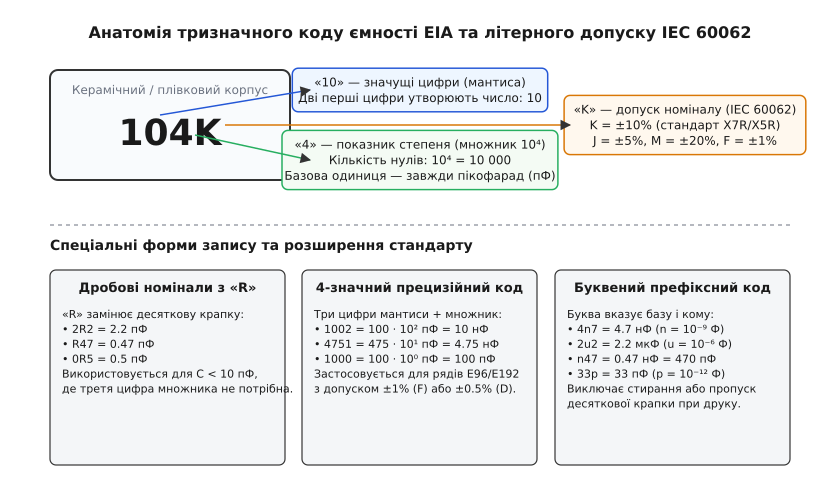
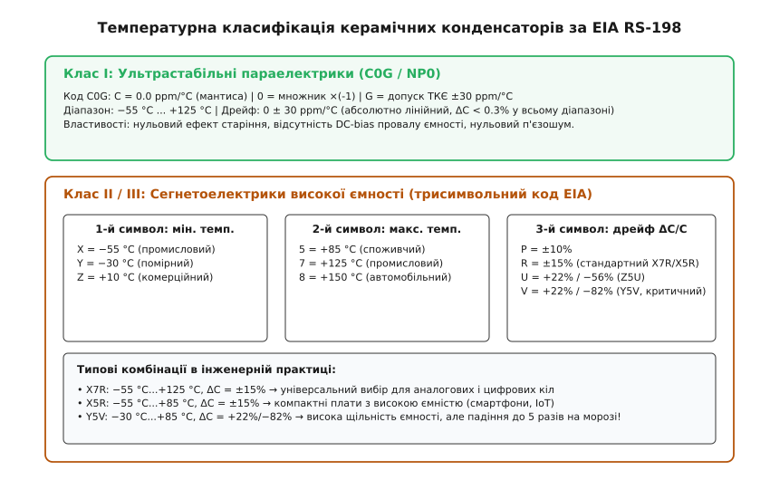
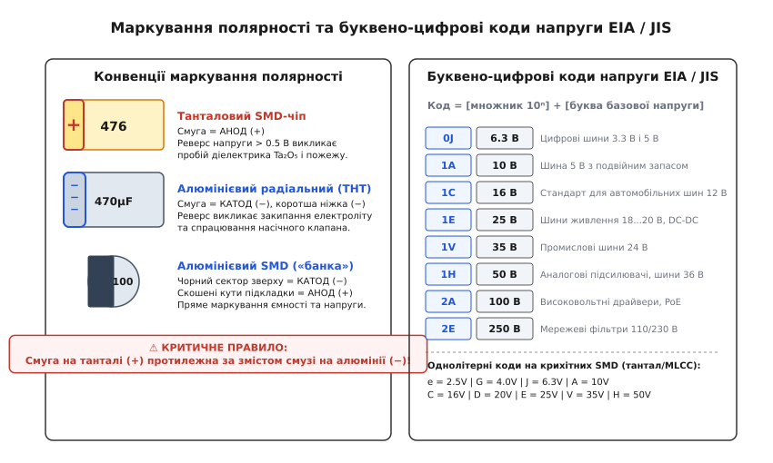

# Стандарти кодування конденсаторів (EIA, IEC 60062)

<preknowlist>
- [Електрична ємність](root:ph-electromagnetism/capacitance) — здатність накопичувати електричний заряд на обкладках при прикладеній різниці потенціалів, вимірювана у фарадах.
- [Конденсатор](root:hw-components/capacitor) — фізична будова обкладок, діелектрик, співвідношення струму й напруги.
- [Діелектрики конденсаторів](root:hw-components/capacitor-dielectrics) — поляризація діелектриків, відносна проникність та температурна стабільність матеріалів.
- [Паразити конденсатора](root:hw-components/capacitor-parasitics) — еквівалентний послідовний опір (ESR), паразитна індуктивність (ESL) і резонансна частота.
</preknowlist>

Керамічний дисковий конденсатор діаметром п'ять міліметрів або прямокутний SMD-чіп типорозміру 0603 мають площу поверхні в кілька квадратних міліметрів. На такій площині фізично неможливо надрукувати повний текстовий паспорт компонента: «0.0000001 Фарад, виробничий допуск ±10%, гранична робоча напруга 50 Вольт, температурний клас X7R». Якби виробники маркували компоненти прямим числовим значенням у фарадах, інженери мусили б читати довгі хвости нулів або шукати мікроскопічну десяткову крапку, стирання якої при пайці миттєво перетворює номінал на фатально інший.

Діапазон номіналів ємності, що застосовується в сучасній електроніці, охоплює понад вісім порядків: від десятих часток пікофарада (0.1 пФ) у високочастотних контурах узгодження антен до тисяч мікрофарад у силових фільтрах імпульсних перетворювачів. Запис такого діапазону в єдиній інженерній системі вимагає математично строгого, компактного та стійкого до помилок кодування.

Для усунення хаосу заводських позначень міжнародні організації — Альянс галузей електронної промисловості (EIA, Electronic Industries Alliance) та Міжнародна електротехнічна комісія (IEC, International Electrotechnical Commission у стандарті IEC 60062) — ввели взаємоузгоджену систему компактного маркування. Вона стандартизує три критичні метрологічні параметри: номінальну ємність, виробничий допуск і температурну стабільність або граничну напругу.

### Тризначний числовий код EIA: мантиса та показник степеня

В основі цифрового маркування конденсаторів лежить принцип мантиси (лат. *mantissa* — додаткова частина) та десяткового показника степеня. Базовою одиницею вимірювання за замовчуванням є **пікофарад** (пФ, `1 пФ = 10⁻¹² Ф`).

Вибір пікофарада як опорної одиниці зумовлений метрологічною зручністю: це найменша практична ємність, що зустрічається в дискретній схемотехніці. Завдяки цьому будь-який номінал від одиниць пікофарад до сотень мікрофарад виражається за допомогою цілих додатних степенів десятки, що дозволяє уникнути знаків мінуса в обмеженому полі маркування.

Тризначний числовий код `d₁d₂d₃` розшифровується за єдиним правилом:
1. Перші дві цифри `d₁` та `d₂` утворюють двозначне число — **мантису** значення.
2. Третя цифра `d₃` є **показником степеня десятки** (множником `10^(d₃)`), тобто вказує кількість нулів, які необхідно дописати до мантиси.
3. Отримане числове значення є ємністю в **пікофарадах**.

```
C_pF = (d₁ · 10 + d₂) · 10^(d₃)   [пікофаради, пФ]
```

Розрахунок номіналу для коду `104` розкладається на наступні ланки: мантиса складається з цифр `1` та `0` (число 10), третя цифра `4` задає множник `10⁴ = 10 000`. Множення дає `10 · 10 000 = 100 000 пФ`. Переведення в похідні одиниці здійснюється діленням на тисячу: `100 000 пФ = 100 нФ = 0.1 мкФ`.

Аналогічно декодуються інші стандартні номінали:
- `472` = `47 · 10² пФ = 4 700 пФ = 4.7 нФ`;
- `103` = `10 · 10³ пФ = 10 000 пФ = 10 нФ`;
- `224` = `22 · 10⁴ пФ = 220 000 пФ = 220 нФ = 0.22 мкФ`;
- `105` = `10 · 10⁵ пФ = 1 000 000 пФ = 1 000 нФ = 1 мкФ`;
- `475` = `47 · 10⁵ пФ = 4 700 000 пФ = 4.7 мкФ`;
- `106` = `10 · 10⁶ пФ = 10 000 000 пФ = 10 мкФ`.


*Анатомія тризначного коду ємності EIA: мантиса, множник степеня десятки в базі пікофарад, позиція літери «R» та зіставлення з європейським префіксним форматом запису.*

#### Нульовий множник та прямий двозначний запис

Найпоширенішою помилкою при ручному читанні є інтерпретація третьої цифри `0`. Код `100` означає мантису `10`, помножену на `10⁰ = 1`, тобто рівно `10 пФ`, а не 100 пФ чи 100 нФ. Цифра нуль на третій позиції — це показник степеня, який дорівнює одиниці, а не «порожнє місце» чи додатковий нуль номіналу. Відповідно:
- `220` = `22 · 10⁰ пФ = 22 пФ`;
- `330` = `33 · 10⁰ пФ = 33 пФ`;
- `470` = `47 · 10⁰ пФ = 47 пФ`.

Для зовсім малих ємностей стандарти дозволяють прямий двозначний запис: напис `22` або `47` на дисковому корпусі без третьої цифри позначає безпосередньо `22 пФ` та `47 пФ`. Третя цифра стає обов'язковою лише тоді, коли номінал перевищує двозначну межу пікофарадного діапазону.

#### Субпікофарадні номінали та буква «R»

Коли номінал становить менше ніж 10 пФ і містить дробову частину (наприклад, 2.2 пФ або 0.47 пФ), стандартний числовий код виявляється непридатним. Для таких компонентів застосовують літеру `R` (від англ. *Radix point* — десяткова крапка). Літера `R` ставиться на місці коми й водночас фіксує базову розмірність у пікофарадах:
- `2R2` = 2.2 пФ;
- `4R7` = 4.7 пФ;
- `R47` або `0R47` = 0.47 пФ;
- `0R5` = 0.5 пФ;
- `R82` = 0.82 пФ.

Використання літери замість типографської крапки є метрологічною вимогою: друкована крапка має розмір у частки міліметра і при контакті з флюсом чи змивкою легко розчиняється або маскується порошинкою, тоді як літера зберігає читабельність навіть при частковому стиранні.

Спеціальні розширення EIA також передбачають використання цифр `8` та `9` на третій позиції як дробових множників:
- цифра `8` позначає множник `10⁻² = 0.01` (наприклад, код `108` означає `10 · 0.01 = 0.1 пФ`);
- цифра `9` позначає множник `10⁻¹ = 0.1` (наприклад, код `229` означає `22 · 0.1 = 2.2 пФ`, код `109` = 1.0 пФ).

#### Чотиризначний код для прецизійних серій

У високоточних конденсаторах (ряди E96 та E192 з допуском 1% і менше) двох цифр мантиси недостатньо для опису номіналу. Для них стандарт визначає чотиризначний код `d₁d₂d₃d₄`, де перші три цифри утворюють тризначну мантису, а четверта є показником степеня:
- `1002` = `100 · 10² пФ = 10 000 пФ = 10 нФ`;
- `4751` = `475 · 10¹ пФ = 4 750 пФ = 4.75 нФ`;
- `1000` = `100 · 10⁰ пФ = 100 пФ`.

#### Європейський стиль буквеного маркування (IEC 60062)

На схемах, у специфікаціях і на плівкових конденсаторах європейських виробників поширений запис, у якому замість коми вказується літера метричного префікса одиниці: `p` (піко, 10⁻¹²), `n` (нано, 10⁻⁹), `u` або `µ` (мікро, 10⁻⁶), `m` (мілі, 10⁻³):
- `4n7` = 4.7 нФ = 4700 пФ;
- `2u2` = 2.2 мкФ;
- `n47` = 0.47 нФ = 470 пФ;
- `33p` = 33 пФ;
- `p82` = 0.82 пФ;
- `1m0` = 1.0 мФ = 1000 мкФ.

> 🔧 **Навіщо це.** На платі керування швидкісним імпульсним перетворювачем поруч стоять керамічний конденсатор фільтра зворотного зв'язку напруги та навантажувальний конденсатор кварцового резонатора. Перший має номінал `104` (100 нФ), а другий — `100` (10 пФ). Різниця між ними становить рівно чотири порядки (у 10 000 разів). Помилкове встановлення `104` замість `100` повністю заблокує збудження кварцу на частоті 16 МГц, а встановлення `100` замість `104` залишить шину живлення без фільтрації високочастотних завад.

---

### Буквені коди допусків номіналу за IEC 60062 / EIA

Жоден технологічний процес виготовлення конденсаторів не здатний забезпечити абсолютно точний номінал ємності. Товщина діелектричної плівки чи шару кераміки коливається в межах часток мікрометра, площа перекриття металізованих обкладок зазнає механічного зміщення при нарізанні, а діелектрична проникність суміші змінюється від партії до партії при високотемпературному спіканні.

Для опису допустимого відхилення реальної ємності від номінальної після цифрового коду ставиться одна літера. Стандарт IEC 60062 розділяє коди допусків на дві окремі метрологічні категорії залежно від величини номіналу.

| Літера коду | Допуск для ємностей C < 10 пФ | Допуск для ємностей C ≥ 10 пФ | Типове схемотехнічне застосування |
|:---|:---|:---|:---|
| **B** | ±0.10 пФ | ±0.1% | Еталонні вимірювальні мости, НВЧ-фільтри |
| **C** | ±0.25 пФ | ±0.25% | Прецизійні резонансні контури |
| **D** | ±0.50 пФ | ±0.5% | Вузькосмугові активні RC-фільтри |
| **F** | — | ±1.0% | Прецизійні вимірювальні кола, серії E96 |
| **G** | — | ±2.0% | Генератори тактових частот, серії E48 |
| **J** | — | ±5.0% | Кераміка C0G/NP0, плівкові конденсатори, ряд E24 |
| **K** | — | ±10.0% | Стандартна блокувальна кераміка X7R/X5R, ряд E12 |
| **M** | — | ±20.0% | Електролітичні конденсатори, ряди E6 |
| **Z** | — | +80.0% / −20.0% | Низьковольтна розв'язка живлення (Y5V, Z5U) |
| **P** | — | +100.0% / −0.0% | Гарантований мінімум ємності (GMV) |

#### Фізика розділення допусків на абсолютні та процентні

Для малих номіналів (`C < 10 пФ`) відсоткове нормування втрачає фізичний сенс: наприклад, допуск ±1% для конденсатора ємністю 1.0 пФ означав би допустимий розкид ±0.01 пФ. Ця величина менша за паразитну ємність між двома паралельними контактними майданчиками на текстоліті (близько 0.05–0.1 пФ) і лежить нижче межі чутливості більшості виробничих вимірювальних мостів. Тому для субпікофарадного діапазону стандарт фіксує абсолютні значення похибки: `B` (±0.1 пФ), `C` (±0.25 пФ) та `D` (±0.5 пФ).

Для номіналів від 10 пФ і вище допуск стає відносним і виражається у відсотках. Прецизійна термостабільна кераміка (C0G) зазвичай маркується літерою `J` (±5%) або `F` (±1%), масова промислова кераміка (X7R) — літерою `K` (±10%), а електролітичні конденсатори — літерою `M` (±20%).

Асиметричний допуск `Z` (+80% / −20%) історично використовувався для дешевих керамічних конденсаторів фільтрації живлення на базі матеріалів Y5V та Z5U: у колах блокування живлення перевищення ємності не становить загрози, тоді як її просідання регламентується жорсткіше.

#### Зв'язок допусків із рядами переважних чисел IEC 60063

Номінали ємності не вибираються довільно: вони підпорядковуються геометричним прогресіям рядів Ренара стандарту IEC 60063. Кожен ряд розбиває одну декаду (інтервал значень від `1.0` до `10.0`) на `N` логарифмічно рівновіддалених значень зі знаменником:

```
q = 10^(1/N)   [знаменник геометричної прогресії ряду]
```

Значення номера ряду `N` строго відповідає гарантованому виробничому допуску:
- **Ряд E6** (`N = 6`, знаменник `q ≈ 1.47`): номінали `1.0, 1.5, 2.2, 3.3, 4.7, 6.8`. Допуск становить `±20%` (код `M`). Поля допусків двох сусідніх номіналів (наприклад, `1.0 ± 20% = [0.80, 1.20]` та `1.5 ± 20% = [1.20, 1.80]`) стикаються в точці 1.20 без розривів.
- **Ряд E12** (`N = 12`, знаменник `q ≈ 1.21`): номінали `1.0, 1.2, 1.5, 1.8, 2.2, 2.7, 3.3, 3.9, 4.7, 5.6, 6.8, 8.2`. Допуск становить `±10%` (код `K`).
- **Ряд E24** (`N = 24`, знаменник `q ≈ 1.10`): 24 номінали на декаду, допуск `±5%` (код `J`).
- **Ряд E96** (`N = 96`, знаменник `q ≈ 1.024`): 96 прецизійних номіналів на декаду, допуск `±1%` (код `F`).

Завдяки цьому принципу будь-який виготовлений конденсатор із технологічним розкидом параметрів обов'язково потрапляє в поле допуску одного зі стандартних номіналів ряду, що мінімізує відсоток промислового браку при сортуванні.

---

### Температурні класи керамічних конденсаторів за EIA RS-198

Температурна залежність ємності визначається фундаментальною фізикою матеріалу діелектрика. Усі керамічні діелектрики поділяються на два класи: параелектрики низької проникності та сегнетоелектрики високої проникності.

#### Клас I: Ультрастабільні параелектричні конденсатори (C0G / NP0)

Конденсатори Класу I виготовляють на основі діоксиду титану (TiO₂) або силікатів цирконію з додаванням оксидів рідкісноземельних металів. Це неполярні параелектрики з відносною діелектричною проникністю в межах `ε_r ≈ 15...100`.

Стандарт EIA RS-198 кодує температурний коефіцієнт ємності (ТКЄ) конденсаторів Класу I за допомогою трьох символів:
1. **Перший символ (літера)** — значуща цифра номінального значення ТКЄ у частках на мільйон на градус Цельсія (`ppm/°C`, де `1 ppm/°C = 10⁻⁶ 1/°C`):
   - `C` = 0.0, `B` = 0.3, `L` = 0.8, `P` = 1.0, `R` = 2.2, `S` = 3.3, `T` = 4.7, `U` = 7.5.
2. **Другий символ (цифра)** — множник степеня десятки для ТКЄ:
   - `0` = ×(−1), `1` = ×(−10), `2` = ×(−100), `3` = ×(−1000);
   - `4` = ×(+1), `5` = ×(+10), `6` = ×(+100), `7` = ×(+1000).
3. **Третій символ (літера)** — виробничий допуск нахилу ТКЄ:
   - `G` = ±30 ppm/°C, `H` = ±60 ppm/°C, `J` = ±120 ppm/°C, `K` = ±250 ppm/°C.

Найвідоміший представник Класу I — матеріал **C0G**:
- Мантиса `C` = 0.0 ppm/°C;
- Множник `0` = ×(−1);
- Допуск `G` = ±30 ppm/°C.

Розрахунковий температурний коефіцієнт C0G становить `0 ± 30 ppm/°C` у повному промисловому діапазоні від −55 °C до +125 °C. При нагріванні на 100 °C максимальний дрейф ємності складає:

```
ΔC / C = 30 · 10⁻⁶ · 100 = 0.003 = 0.3%
```

Еквівалентна назва **NP0** є абревіатурою від *Negative-Positive-Zero* («негативний-позитивний-нуль»), що підкреслює відсутність спрямованого температурного дрейфу в будь-який бік.

Конденсатори C0G/NP0 мають нульовий ефект старіння (ємність не змінюється з роками), нульову залежність ємності від прикладеної постійної напруги зміщення (DC bias), вкрай низький тангенс кута діелектричних втрат (`tan δ < 0.001` на частотах до 1 ГГц) і повну відсутність п'єзоелектричного ефекту. Їхня питома ємність на одиницю об'єму невелика (зазвичай не перевищує 10–100 нФ у корпусах SMD), тому їх застосовують у фазообертачах, коливальних контурах та колах зворотного зв'язку аналогових фільтрів.


*Матриця розшифровки температурних класів керамічних конденсаторів за стандартом EIA RS-198: ультрастабільний Клас I проти сегнетоелектриків Класів II та III.*

#### Клас II та Клас III: Сегнетоелектрики високої проникності (X7R, X5R, Y5V, Z5U)

Конденсатори Класів II та III будуються на базі сегнетоелектричної кераміки з кристалічною решіткою перовскіту — титанату барію (BaTiO₃) з легуючими домішками. Цей матеріал забезпечує гігантську діелектричну проникність (`ε_r ≈ 1000...15000`), що дозволяє отримувати ємності до 100–220 мкФ у мініатюрних чіпах 0805 чи 1206.

Платою за високу питому ємність є нелінійність сегнетоелектричних доменів: діелектрична проникність сильно залежить від температури навколишнього середовища, напруженості електричного поля та часу, що минув з моменту спікання.

Для Класів II/III стандарт EIA RS-198 визначає трисимвольний код, у якому кожен знак позначає конкретну граничну характеристику:

1. **Перший символ (літера) — нижня робоча температура**:
   - `X` = −55 °C;
   - `Y` = −30 °C;
   - `Z` = +10 °C.

2. **Другий символ (цифра) — верхня робоча температура**:
   - `4` = +65 °C;
   - `5` = +85 °C;
   - `6` = +105 °C;
   - `7` = +125 °C;
   - `8` = +150 °C;
   - `9` = +200 °C.

3. **Третій символ (літера) — максимальне допустиме відхилення ємності ΔC/C у цьому інтервалі**:
   - `A` = ±1.0%, `B` = ±1.5%, `C` = ±2.2%;
   - `D` = ±3.3%, `E` = ±4.7%, `F` = ±7.5%;
   - `P` = ±10.0%;
   - `R` = ±15.0% (основний стандарт промислової кераміки);
   - `S` = ±22.0%;
   - `T` = +22% / −33%;
   - `U` = +22% / −56%;
   - `V` = +22% / −82% (максимальна нестабільність).

#### Порівняльний аналіз поширених класів діелектриків

- **`X7R`**: діапазон від −55 °C до +125 °C, максимальний дрейф ємності `ΔC ≤ ±15%`. Це промисловий еталон для кіл живлення, фільтрації та аналогової комутації сигналів у розширеному діапазоні температур.
- **`X5R`**: діапазон від −55 °C до +85 °C, дрейф `ΔC ≤ ±15%`. Завдяки зниженню верхньої температурної межі дозволяє досягти вищої щільності ємності при тому самому об'ємі корпусу; широко застосовується в смартфонах, планшетах і портативній техніці.
- **`Y5V`**: діапазон від −30 °C до +85 °C, дрейф ємності становить від `+22%` до `−82%`. Величезна питома ємність досягається за рахунок крутого піку діелектричної проникності поблизу точки Кюрі. При охолодженні пристрою до −30 °C конденсатор номіналом 10 мкФ залишає лише 1.8 мкФ ємності, що нерідко призводить до раптового перезавантаження цифрових мікросхем через просідання живлення.
- **`Z5U`**: діапазон від +10 °C до +85 °C, дрейф від `+22%` до `−56%`. Дешевий діелектрик виключно для офісної та побутової апаратури, яка працює в опалюваних приміщеннях.

#### Європейські стандарти класифікації IEC 60384

У європейській технічній документації та стандартах DIN/EN замість трисимвольного коду EIA можна зустріти позначення за стандартом IEC 60384-8 (Клас 1) та IEC 60384-9/21 (Клас 2):
- **Клас 1B / 1C**: високостабільні термокомпенсовані діелектрики (аналог C0G/NP0);
- **Клас 2C1**: стабільний сегнетоелектрик з діапазоном −55 °C...+125 °C і дрейфом ±20% (еквівалент X7R);
- **Клас 2F4**: низькостабільний сегнетоелектрик високої проникності з дрейфом +30%/−80% (еквівалент Y5V).

---

### Коди номінальної напруги: літерно-цифрові системи EIA та JIS

Робоча напруга вказує максимальну постійну різницю потенціалів, яку діелектрик конденсатора витримує без електричного пробою протягом усього гарантованого терміну служби. На малогабаритних корпусах замість повного напису «50V» застосовують двосимвольний або односимвольний буквено-цифровий код стандарту EIA / JIS C 5101.

#### Двосимвольний код EIA / JIS

Двосимвольний код будується за формулою: перший символ — цифра `n`, яка задає показник степеня десятки (`10ⁿ`), а другий символ — літера базової напруги:

```
U_ном = Базове_значення(Літера) · 10ⁿ   [Вольт]
```

| Код | Номінальна напруга | Код | Номінальна напруга | Схемотехнічне призначення |
|:---|:---|:---|:---|:---|
| **0E** | 2.5 В | **1V** | 35 В | Шини живлення ядер ЦПУ (0E) / промислові шини 24 В (1V) |
| **0G** | 4.0 В | **1H** | 50 В | Літій-іонні акумулятори (0G) / універсальний аналоговий стандарт (1H) |
| **0J** | 6.3 В | **2A** | 100 В | Цифрове живлення 3.3 В та 5 В (0J) / драйвери моторів, PoE (2A) |
| **1A** | 10 В | **2C** | 160 В | Подвійний запас для шини 5 В (1A) / перетворювачі напруги підсвітки (2C) |
| **1C** | 16 В | **2E** | 250 В | Автомобільні бортові мережі 12 В (1C) / вхідні фільтри мережі 110/230 В (2E) |
| **1E** | 25 В | **2J** | 630 В | Шини живлення 18...20 В, DC-DC (1E) / демпферні снубери, силові інвертори (2J) |
| **1D** | 20 В | **3A** | 1000 В (1 кВ) | Високовольтні імпульсні кола, підпал ламп (3A) |

#### Однолітерний код для надкомпактних корпусів

На крихітних SMD-корпусах танталових та керамічних конденсаторів (типорозміри 0402, 0603) для економії місця перед кодом ємності друкують єдину літеру напруги:
- `e` = 2.5 В;
- `G` = 4.0 В;
- `J` = 6.3 В;
- `A` = 10 В;
- `C` = 16 В;
- `D` = 20 В;
- `E` = 25 В;
- `V` = 35 В;
- `H` = 50 В.

Напис `A106` розшифровується як: напруга `A` = 10 В, ємність `106` = 10 мкФ.

---

### Особливості маркування полярних конденсаторів

На відміну від керамічних та плівкових конденсаторів, полярні оксидно-електролітичні конденсатори вимагають строгого дотримання полярності підключення. Помилка монтажу призводить до незворотного руйнування діелектричного шару.


*Порівняння конвенцій маркування полярності танталових та алюмінієвих конденсаторів поруч із ієрархією буквено-цифрових кодів напруги EIA / JIS.*

#### Танталові твердотільні конденсатори (SMD)

Танталові конденсатори складаються з пресованого пористого анода зі спеченого порошку танталу, на поверхні якого шляхом анодного окиснення вирощено надтонкий діелектричний шар пентаоксиду танталу (Ta₂O₅). Катодом служить напівпровідниковий шар діоксиду марганцю (MnO₂) або електропровідний полімер (PEDOT:PSS).

- **Маркування**: поздовжня кольорова смуга (або скошений кут прямокутного корпусу) позначає **ПОЗИТИВНИЙ** вивід (анод, `+`).
- **Фізика реверсу**: якщо до танталового конденсатора з катодом MnO₂ прикласти зворотну напругу величиною понад 0.5 В, виникає лавинний струм витоку. Він викликає локальний перегрів, відновлення оксиду Ta₂O₅ до металевого танталу та вивільнення вільного кисню з кристалічної решітки MnO₂. За температури понад 400 °C дрібнодисперсний тантал бурхливо окиснюється у вивільненому кисні: відбувається термічний саморозігрів, який за лічені мікросекунди перетворюється на відкрите полум'я з виділенням температури понад 2000 °C.

#### Алюмінієві електролітичні конденсатори (Radial THT та SMD)

В алюмінієвих конденсаторах анодом є травлена алюмінієва фольга з шаром оксиду Al₂O₃, а катодом виступає рідкий або гелевий електроліт, просочений у паперовий сепаратор.

- **Маркування вивідних радіальних корпусів (THT)**: уздовж алюмінієвого циліндра нанесено контрастну світлу смугу з надрукованими знаками «−». Вона вказує на **НЕГАТИВНИЙ** вивід (катод, `−`). Сам негативний вивід нового компонента завжди робиться коротшим за позитивний.
- **Маркування вертикальних SMD-банок**: на верхній металевій площині нанесено чорний зафарбований сектор («півмісяць»). Він однозначно вказує на **НЕГАТИВНИЙ** вивід (`−`). Пластикова основа деталі зі скошеними кутами орієнтована до плюсового контакту.
- **Фізика реверсу**: при зворотній полярності рідкий електроліт починає інтенсивно електролізуватися з виділенням газоподібного водню (H₂). Тиск усередині герметичного алюмінієвого циліндра швидко зростає до 10–20 атмосфер. Щоб запобігти неконтрольованому осколковому вибуху, на верхній кришці циліндра фрезерують хрестоподібну або літерну насічку безпеки (Safety Vent), яка контрольовано розкривається при перевищенні критичного тиску і стравлює киплячий електроліт.

#### Неполярні плівкові конденсатори та зовнішня фольга

На деяких прецизійних високочастотних та аудіоплівкових конденсаторах (наприклад, поліпропіленових) можна побачити чорну смугу на одному з торців. Це **не полярність**. Смуга вказує вивід, з'єднаний із **зовнішнім шаром фольги** (Outer Foil), який фізично огортає рулон ззовні.

При монтажі в чутливих схемах (гітарні передпідсилювачі, вимірювальні входи) цей вивід підключають до землі або джерела з мінімальним імпедансом: зовнішня обкладка працює як електростатичний екран, що захищає внутрішні шари конденсатора від наведених електромагнітних завад.

---

### Метрологія ємності та умови вимірювань за IEC 60384

Часто інженер під час перевірки компонента на ручному LCR-метрі бачить ємність, яка суттєво відрізняється від надрукованого номіналу. Причиною є невідповідність умов тестування стандартам метрології IEC 60384.

#### Стандартні частоти вимірювання

Ємність будь-якого конденсатора є частотно-залежною величиною через діелектричну релаксацію та наявність паразитної еквівалентної послідовної індуктивності (ESL). Стандарт IEC 60384 регламентує наступні вимірювальні частоти:

```
C ≤ 1000 пФ          →  f_test = 1.0 МГц ± 10%,  U_test = 1.0 ± 0.2 В_скв (Клас I)
1000 пФ < C ≤ 10 мкФ →  f_test = 1.0 кГц ± 10%,  U_test = 1.0 ± 0.2 В_скв
C > 10 мкФ           →  f_test = 120 Гц ± 10%,  U_test = 0.5 ± 0.1 В_скв (Електроліти)
```

Спроба виміряти електролітичний конденсатор ємністю 470 мкФ на частоті 100 кГц дасть занижене значення через вплив паразитної індуктивності рулону фольги, а вимірювання 10 пФ на частоті 100 Гц призведе до величезної похибки через високий реактивний імпеданс ємності (`X_C = 1 / (2π f C) ≈ 160 МОм`), який шунтується вхідним опором приладу.

#### Ефект падіння ємності під постійною напругою (DC Bias Effect)

У сегнетоелектричній кераміці Класу II (BaTiO₃) прикладена постійна напруга зміщення вирівнює електричні диполі вздовж вектора поля та блокує доменні стінки кристала. Внаслідок цього матеріал втрачає здатність додатково поляризуватися під дією змінної складової сигналу.

Конденсатор номіналом `10 мкФ 25 В` у компактному корпусі `0603` під робочою постійною напругою 12 В втрачає до **70–80%** своєї номінальної ємності: реальна діюча ємність становить лише 2–3 мкФ. Цей ефект не відображається в цифровому коді маркування, оскільки код фіксує лише ємність за нульової постійної напруги зміщення (`V_DC = 0 В`).

#### Старіння діелектрика (Aging)

Кристалічна структура титанату барію після проходження точки Кюрі (близько +125 °C) під час виробничого спікання поступово релаксує з тетрагональної у більш стабільну низькоенергетичну фазу. Цей процес супроводжується монотонним падінням діелектричної проникності:

```
C(t) = C₀ · (1 - k · log₁₀(t / t₀))
```
де `k` — коефіцієнт старіння (зазвичай 1–2% за декаду часу для X7R і до 5% для Y5V).

Конденсатор, виготовлений 1000 годин тому, покаже меншу ємність, ніж щойно виготовлений. Для відновлення початкового номіналу застосовують процедуру де-ейджингу (de-aging): компонент прогрівають до температури +150 °C протягом 1 години, після чого дають охолонути протягом 24 годин.

#### Комплексний інженерний розрахунок діючої ємності (Worst-Case Analysis)

При проєктуванні відповідальних вузлів живлення інженер повинен обчислювати мінімально гарантовану ємність фільтра за формулою найгіршого випадку, перемножуючи всі дестабілізуючі фактори:

```
C_min = C_ном · (1 - δ_tol) · (1 - δ_temp) · (1 - δ_aging) · (1 - δ_bias)
```

Розглянемо конденсатор `10 мкФ 16В X7R` у корпусі `0805`, встановлений на шину живлення 12 В за температури +85 °C через 3 роки експлуатації:
- Виробничий допуск (код `K` = ±10%): `δ_tol = 0.10`;
- Температурний дрейф (`X7R` при +85 °C): `δ_temp = 0.10` (падіння на 10%);
- Старіння діелектрика за 25 000 годин (~4.4 декади): `δ_aging = 4.4 · 0.015 ≈ 0.07` (падіння на 7%);
- Ефект напруги зміщення (`12 В` для корпусу `0805 16В` за даташитом): `δ_bias = 0.55` (падіння на 55%).

Підставляючи коефіцієнти, отримуємо:
```
C_min = 10 · (1 - 0.10) · (1 - 0.10) · (1 - 0.07) · (1 - 0.55)   [підстановка параметрів найгіршого випадку]
      = 10 · 0.90 · 0.90 · 0.93 · 0.45                           [обчислення множників деградації]
      = 3.39 мкФ                                                 [кінцева гарантована ємність фільтра]
```

Реальна діюча ємність десятимікрофарадного конденсатора у найгіршій робочій точці схеми складає лише **3.39 мкФ** — майже втричі менше за паспортне значення. Розрахунок показує, що без урахування комплексу стандартів маркування та фізичних властивостей діелектрика схема гарантовано вийде з ладу через пульсації напруги.

---

### Чому на SMD MLCC немає маркування та як читати заводський Part Number

Сучасні багатошарові керамічні чіп-конденсатори (MLCC, Multi-Layer Ceramic Capacitors) у корпусах 0402, 0201 та 01005 випускаються абсолютно «сліпими» — на них немає жодного символу. Лазерне гравірування на ультратонкій кераміці товщиною 0.3–0.5 мм створює мікротріщини в структурі обкладок, що викликає пробій під час пайки, а чорнильний друк затирається при оплавленні припою в печі.

Єдиним джерелом достовірної інформації про компонент є заводське маркування на пакувальній бобіні (Reel Tape) за стандартом EIA-481. Заводський номер деталі (Part Number) кодує повний набір метрологічних параметрів. Розглянемо структуру артикулу світового лідера Murata на прикладі `GRM188R71H104KA93D`:

```
GRM  18  8  R7  1H  104  K  A93  D
 │    │  │  │   │    │   │   │   └─ Пакування: D = 8 мм паперова стрічка
 │    │  │  │   │    │   │   └───── Внутрішній заводський код серії
 │    │  │  │   │    │   └───────── Допуск: K = ±10% (IEC 60062)
 │    │  │  │   │    └───────────── Номінальна ємність: 104 = 100 нФ
 │    │  │  │   └────────────────── Робоча напруга: 1H = 50 В (EIA/JIS)
 │    │  │  └────────────────────── Діелектрик: R7 = X7R (-55...+125°C, ±15%)
 │    │  └───────────────────────── Товщина корпусу: 8 = 0.8 мм
 │    └──────────────────────────── Типорозмір: 18 = 0603 (1.6 × 0.8 мм)
 └───────────────────────────────── Серія: багатошарова монолітна кераміка
```

Вміння читати стандартні буквено-цифрові фрагменти в складі довгого артикулу дозволяє інженеру миттєво ідентифікувати ємність (`104`), напругу (`1H`), діелектрик (`R7 = X7R`) та допуск (`K`) у каталозі будь-якого світового дистриб'ютора без відкриття повного 80-сторінкового даташиту.

---

### Worked Example: Комплексний розбір маркувань

Розглянемо фрагмент переліку компонентів (BOM) плати промислового контролера з чотирма типами маркувань:

```
Компонент 1:  104K 1H X7R
Компонент 2:  2R2C 1H C0G
Компонент 3:  475M 1C X5R
Компонент 4:  476 1A (Тантал SMD)
```

#### Розрахунок параметрів для кожного компонента

**1. Маркування `104K 1H X7R`:**
- **Ємність**: `10 · 10⁴ пФ = 100 000 пФ = 100 нФ = 0.1 мкФ`;
- **Виробничий допуск**: літера `K` → `±10%` (робочий розкид при виготовленні: від 90 нФ до 110 нФ);
- **Номінальна напруга**: код `1H` → `5.0 · 10¹ В = 50 В`;
- **Температурний діапазон**: `X7R` → від −55 °C до +125 °C із максимальним дрейфом `ΔC ≤ ±15%`.
- **Застосування**: блокувальна розв'язка шини живлення аналогових операційних підсилювачів або мікроконтролерів.

**2. Маркування `2R2C 1H C0G`:**
- **Ємність**: `2R2` → літера `R` замінює кому → `2.2 пФ`;
- **Виробничий допуск**: літера `C` при `C < 10 пФ` означає абсолютний допуск `±0.25 пФ` (допустимий номінал: 1.95...2.45 пФ);
- **Номінальна напруга**: `1H` → `50 В`;
- **Температурний діапазон**: `C0G` → Клас I, ультрастабільний, ТКЄ `0 ± 30 ppm/°C` у межах −55 °C...+125 °C.
- **Застосування**: частотозадавальний конденсатор кварцового резонатора на частоту 32.768 кГц або 24 МГц.

**3. Маркування `475M 1C X5R`:**
- **Ємність**: `47 · 10⁵ пФ = 4 700 000 пФ = 4.7 мкФ`;
- **Виробничий допуск**: `M` → `±20%` (розкид: 3.76...5.64 мкФ);
- **Номінальна напруга**: `1C` → `1.6 · 10¹ В = 16 В`;
- **Температурний діапазон**: `X5R` → від −55 °C до +85 °C, дрейф `ΔC ≤ ±15%`.
- **Застосування**: згладжувальний фільтр виходу імпульсного стабілізатора DC-DC 3.3 В або 5 В.

**4. Маркування `476 1A` (Тантал SMD):**
- **Ємність**: `47 · 10⁶ пФ = 47 мкФ`;
- **Номінальна напруга**: `1A` → `1.0 · 10¹ В = 10 В`;
- **Полярність**: смуга на корпусі вказує на **позитивний** вивід (анод).
- **Застосування**: буферний накопичувач живлення для компенсації імпульсних сплесків струму Wi-Fi/GSM передавача.

Для автоматизованої розшифровки складних маркувань і перевірки номіналів за стандартними рядами чисел застосовують програмний [декодер і валідатор маркувань конденсаторів](root:hw-components/capacitor-standard-code-tables/proj-capacitor-decoder.md).

---

### Типові інженерні помилки та пастки

1. **Прочитання коду `330` як 330 пФ або 33 нФ**: третя цифра `0` означає множник `10⁰ = 1`, тому `330` — це рівно `33 пФ`. Помилка в читанні призводить до десятикратного або тисячократного спотворення ємності в схемі.
2. **Перенесення правила «смуга = мінус» на танталові чіпи**: смуга на алюмінієвому радіальному конденсаторі позначає мінус (катод), а смуга на танталовому SMD — **плюс** (анод). Зворотне впаювання танталового конденсатора призводить до його спалаху та вигорання друкованої плати.
3. **Заміна діелектрика X7R на Y5V заради високої ємності**: конденсатор Y5V під робочою напругою та при зниженні температури до −10 °C втрачає до 80% ємності, що призводить до циклічних перезавантажень процесорів у зимовий період.
4. **Ігнорування імперських та метричних колізій типорозмірів SMD**: імперський корпус `0603` має розміри `1.6 × 0.8 мм`, тоді як метричний `0603M` відповідає імперському `0201` (`0.6 × 0.3 мм`). Помилка у формуванні замовлення призводить до отримання мікроскопічних деталей, непридатних для ручного монтажу.
5. **Нехтування ефектом падіння ємності від напруги (DC Bias)**: розрахунок фільтра живлення виключно за номіналом на корпусі (наприклад, 10 мкФ 16В на шині 12В) без перевірки графіка залежності ємності від постійної напруги призводить до трикратного зростання пульсацій живлення.
