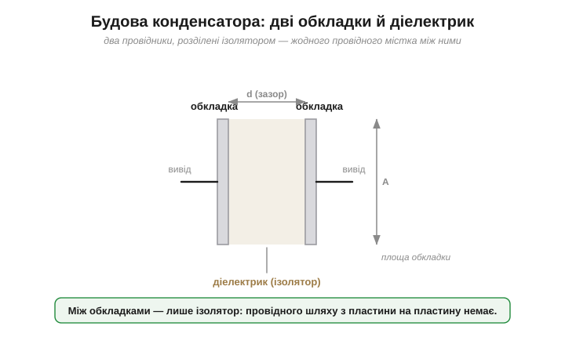
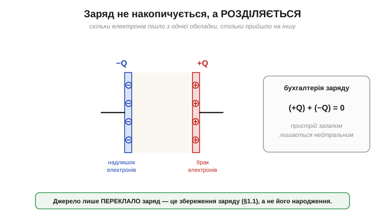
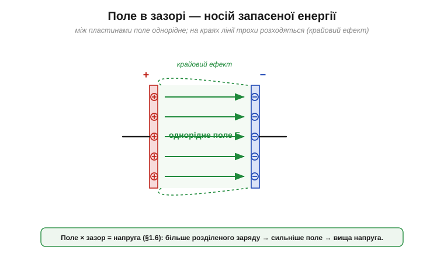
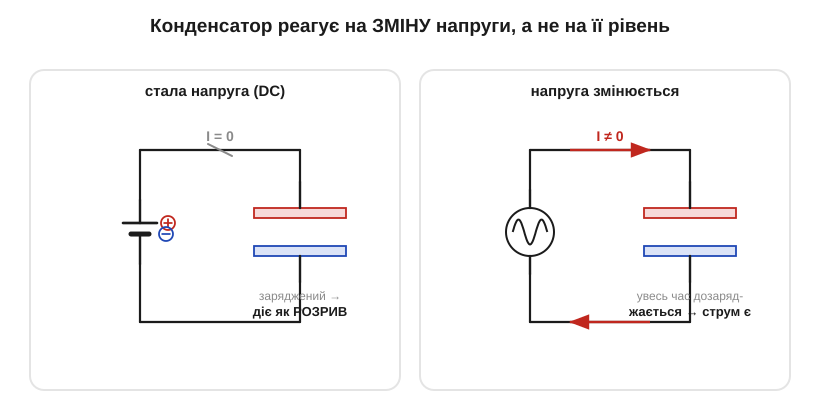
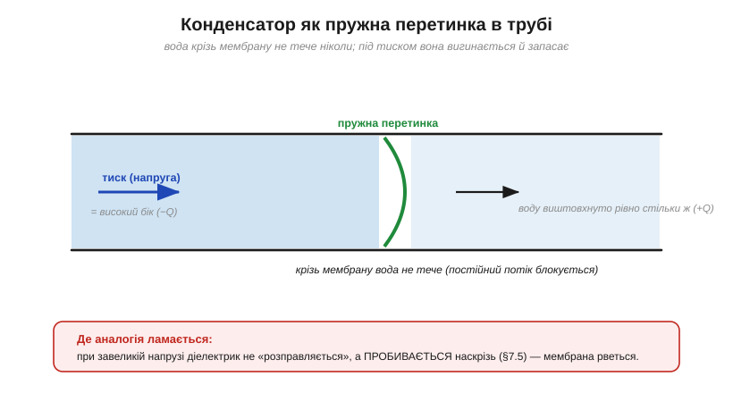
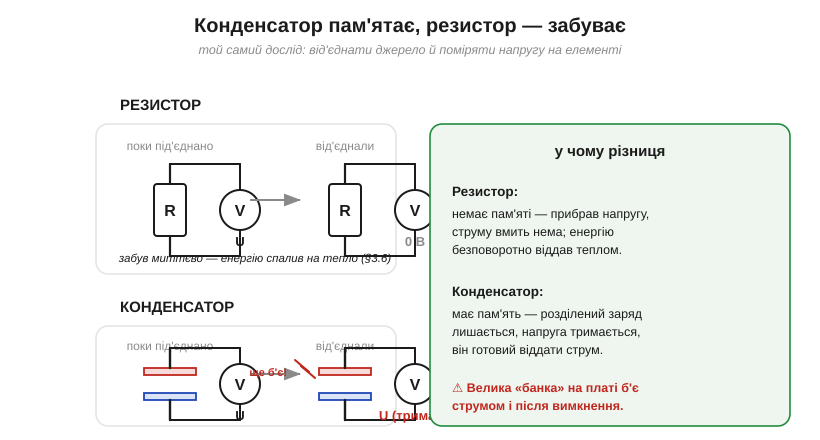
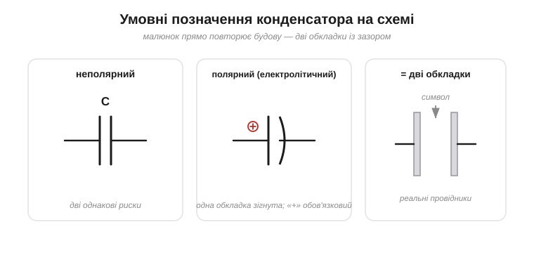

# Що таке конденсатор: два провідники, що тримають розділений заряд

Уявіть просту річ: дві металеві пластини поруч, які **не торкаються**. Між ними — повітря або тонкий шар ізолятора. Жодного дроту з пластини на пластину, коло **розірване** проміжком. На перший погляд — некорисна порожнеча: струм крізь неї не пройде. І все ж саме ця «некорисна» пара пластин уміє те, чого не вміє жоден резистор: **тримати в собі запас заряду** й віддавати його, коли треба. Розберімо, як порожнеча між двома провідниками стає коміркою пам'яті для електрики.

### Будова: дві обкладки й діелектрик

**Конденсатор** (*capacitor*; стара назва — *condenser*, звідси «конденсатор») — це **два провідники, розділені ізолятором**. Провідники називають **обкладками** (*plates*), ізолятор між ними — **діелектриком** (*dielectric*). Оце й уся конструкція; усе інше — варіації форми (пласкі пластини, згорнута в рулон плівка, дві фольги на склі лейденської банки).


*Конденсатор у найпростішому вигляді: дві провідні обкладки площею A на відстані d, між ними — діелектрик. Виводи йдуть від кожної обкладки назовні. Жодного провідного містка між обкладками немає — їх розділяє ізолятор.*

Зверніть увагу, наскільки це схоже на лейденську банку: внутрішня фольга — одна обкладка, зовнішня (рука) — друга, скло — діелектрик. Франклін, розібравши банку, довів, що заряд тримається саме на межі з діелектриком — і саме цю ідею варто розгорнути строго.

### Заряд не накопичується, а розділяється

Найперше непорозуміння, яке варто прибрати одразу: конденсатор **не накопичує заряд, як відро воду**. Він тримає на одній обкладці надлишок (+Q), а на другій — рівно такий самий **брак** (−Q). Сумарний заряд усього пристрою лишається **нульовим** — рівно стільки ж **+**, скільки **−**, як у будь-якого нейтрального тіла з рівними числами [протилежних зарядів](topic:ph-electromagnetism/electric-charge).


*«Зарядити конденсатор» означає не долити заряду, а **перекласти** його з однієї обкладки на іншу: скільки електронів пішло з правої обкладки (вона стала +Q), стільки прийшло на ліву (−Q). Пристрій загалом лишається нейтральним — це прямий наслідок збереження заряду.*

Тому правильні слова — не «накопичити», а **розділити** заряд. Конденсатор — це машинка для **розділення** заряду й утримання половинок нарізно, по два боки тонкого діелектрика. Саме розділені, вони «хочуть» возз'єднатися (різнойменні притягуються), але діелектрик їм не дає — і в цьому напруженні весь сенс.

### Поле в зазорі — ось де «сидить» запас

Що тримає половинки нарізно й чому вони так тягнуться одна до одної? Між обкладками виникає [електричне поле](topic:ph-electromagnetism/electric-field) (*field*): надлишок **+** на одній обкладці створює поле, спрямоване через зазор до **−** на іншій. Для двох близьких пластин це поле напрочуд **рівномірне** — однакові за густиною лінії, що йдуть прямо від + до −, і лише скраю трохи «випинаються» назовні (крайовий ефект).


*Між пластинами — однорідне поле (рівні стрілки від + до −); на краях лінії трохи розходяться. Саме це поле в діелектрику й «тримає» розділений заряд — і саме в ньому запасено [енергію](topic:ph-electromagnetism/capacitor-energy). Це строге втілення Франклінового відкриття: запас живе не в металі, а в полі між обкладками.*

Поле в зазорі — це місток до напруги. [Поле, помножене на відстань](root:embedded/field-and-potential), дає **різницю потенціалів**, тобто **напругу**. Отже, розділений заряд породжує поле, а поле — напругу між виводами конденсатора. Що більше заряду ми розвели по обкладках, то сильніше поле й то більша напруга на конденсаторі. Точне співвідношення «скільки заряду на скільки вольтів» — це вже [**ємність**](topic:ph-electromagnetism/capacitance); тут нам важлива сама причинність: **більше розділеного заряду → вища напруга**.

### Як конденсатор заряджається

Звідки беруться ці +Q і −Q? Їх **переганяє джерело** (батарея чи інший конденсатор). Під'єднаймо обкладки до батареї. Її поле жене вільні електрони провідником: з обкладки, з'єднаної з **+** клемою, електрони витягуються (обкладка стає **+Q**), а на обкладку, з'єднану з **−**, — напихаються (вона стає **−Q**).


*Батарея відкачує електрони з правої обкладки й накачує на ліву. Струм тече **в дротах** (заряд рухається до обкладок і від них), але **не крізь діелектрик** — там заряду не перейти. Конденсатор заповнюється, поки його напруга не зрівняється з напругою джерела.*

Ключове спостереження: струм у дротах **є**, поки конденсатор заряджається, хоча крізь сам зазор не проходить жоден заряд. Електрони не перестрибують діелектрик — вони лише збираються на обкладках. Зовні це виглядає так, ніби «струм пройшов крізь конденсатор», та насправді з одного боку заряд притік, а з іншого — рівно стільки ж відтік. *Як швидко* йде це заповнення (і чому крива саме така) визначає [стала часу кола](topic:hw-analog/rc-time-constant); тут досить знати, що заряджання **не миттєве** й що під кінець струм спадає до нуля.

### Чому конденсатор «не пропускає» постійний струм

Коли конденсатор зарядився до напруги джерела, переганяти заряд більше нікуди — струм **припиняється**. Підключений до сталої (постійної) напруги, заряджений конденсатор поводиться як **розрив**: крізь нього **постійний струм не тече**. А от поки напруга **змінюється** — заряд доводиться щоразу доганяти, і струм у дротах є.


*Зліва — стала напруга: конденсатор зарядився, струм = 0, він діє як розрив кола. Справа — напруга змінюється: конденсатор увесь час дозаряджається/розряджається, тож у дротах тече струм. Звідси правило: конденсатор реагує на **зміну** напруги, а не на її рівень.*

> 🔧 **Навіщо це.** Це властивість, на якій тримається половина аналогової схемотехніки. Конденсатор **пропускає зміни й блокує сталу складову** — тож ним «зрізають» постійний рівень, лишаючи тільки коливання сигналу (так звана розв'язка по змінному струму). На цьому ж стоїть **розв'язувальний конденсатор** біля кожної мікросхеми: для повільних, «постійних» процесів він невидимий, а на швидкий стрибок струму миттєво віддає свій запас. Як саме реакція залежить від частоти зміни, описує [ємнісний опір](topic:hw-components/capacitive-reactance); поки достатньо інтуїції «реагує на зміну».

### Аналогія: пружна перетинка в трубі

Щоб відчути це нутром, уявіть водогінну аналогію (струм — потік води, напруга — тиск). Конденсатор — це **пружна гумова перетинка**, що перекриває трубу впоперек. Вода крізь неї не проходить **ніколи** (мембрана суцільна). Та коли з одного боку піднімають тиск, перетинка **вигинається**, відштовхуючи трохи води з іншого боку, — і запасає енергію в своєму натягу. Перестали тиснути — мембрана розправляється й **повертає** воду назад.


*Пружна перетинка: під тиском вигинається (запасає), штовхає воду по інший бік — рівно стільки, скільки прийшло (рівні +Q і −Q). Крізь саму мембрану вода не тече (постійний потік блокується), але «гойдання» тиску туди-сюди проганяє воду в трубі. Де аналогія ламається: справжній конденсатор не має суцільної «стінки», що рветься від тиску, — натомість при завеликій напрузі **пробивається діелектрик**.*

Аналогія точна там, де нам треба: **постійний потік — ні, зміни — так; запасає й повертає; має рівні «надлишок» і «брак» з двох боків**. Як завжди, корисно знати й межу: модель пружної мембрани нічого не каже про те, що буде, коли «продавити» діелектрик, — а він, на відміну від ідеальної гуми, при перевищенні напруги просто [**пробивається** наскрізь](topic:hw-components/capacitor-parasitics).

### Конденсатор пам'ятає: чим він не схожий на резистор

Ось найважливіша різниця між конденсатором і резистором. **Резистор не має пам'яті**: прибрали напругу — і струму миттєво нема, він нічого не зберіг (енергію він безповоротно перетворив на [тепло](topic:ph-electromagnetism/joule-heating)). **Конденсатор має пам'ять**: якщо зарядити його й **від'єднати**, розділений заряд нікуди не дінеться — діелектрик не дає половинкам зійтися, і напруга на виводах **лишається** надовго.


*Той самий дослід для обох. Від'єднали джерело — на резисторі напруга миттєво нуль (він «забув»), а заряджений конденсатор тримає напругу й готовий віддати струм (він «пам'ятає»). Резистор енергію **витрачає** на тепло; конденсатор — **запасає** й повертає.*

> 🔧 **Навіщо це.** Та сама «пам'ять» — це і користь, і небезпека. Користь: конденсатор згладжує провали живлення, бо тримає запас напоготові. Небезпека — пряме відлуння удару Мушенбрука: **великий конденсатор лишається зарядженим і після вимкнення приладу**. У блоках живлення, спалахах, підсилювачах він може тримати небезпечну напругу годинами. Тому в сервісі діє правило: перш ніж лізти руками — **розрядити** конденсатори. Заряджений конденсатор — це маленька лейденська банка у вас на платі.

### Як його малюють на схемі

На принциповій схемі (де кожна деталь має свій [умовний символ](topic:hw-pcb/component-symbols)) конденсатор зображають двома рисками — буквально дві обкладки із зазором між ними. Це один із найнаочніших символів: малюнок прямо повторює будову.


*Ліворуч — **неполярний** конденсатор: дві однакові прямі риски (символ ємності — велика латинська C, типові виводи без знака). Праворуч — **полярний** (електролітичний): одна обкладка зігнута або зафарбована, поряд — знак **+**; такий [не можна вмикати «навпаки»](topic:hw-components/capacitor-parasitics). Посередині показано, як символ відповідає реальним обкладкам.*

### Будь-які два провідники — це вже трохи конденсатор

Означення нічого не каже про спеціальну деталь — лише «два провідники й ізолятор між ними». А отже, конденсатор виникає **скрізь**, де поряд опинились два провідники, навіть якщо ми його туди не ставили. Дві сусідні доріжки на платі, дві жили в кабелі, вивід мікросхеми й металевий корпус, навіть провід над землею — це все пари провідників, розділені повітрям чи пластиком, тобто крихітні **ненавмисні** конденсатори. Їх називають **паразитними** (*parasitic capacitance*).

Зазвичай вони мізерні й непомітні. Та головна властивість конденсатора нікуди не дівається: він реагує на **зміну** напруги. Тому на швидких сигналах паразитна ємність прокидається — різкий перепад напруги на одній доріжці наводить струм у сусідній через їхню взаємну ємність. Це [**наведення**](topic:ph-electromagnetism/capacitive-coupling) (*crosstalk*): доріжки ніби й не з'єднані, а сигнал «протікає» з однієї в іншу саме крізь повітряний конденсатор між ними. Так само будь-який довгий неекранований провід має ємність на землю й поводиться не як ідеальний дріт, а як дріт із «розмазаним» уздовж нього конденсатором. Цю фізику не можна вимкнути — лише врахувати.

> 🔧 **Навіщо це.** Коли схема, що чудово працювала на макеті, на готовій платі раптом «дзвенить» чи ловить завади, перший підозрюваний — паразитна ємність між доріжками. Але та сама ідея працює й на користь: **ємнісний сенсор дотику** (екран телефона, кнопка без жодної механіки) — це просто вимірювання того, як ваш палець, ще один провідник, змінює ємність між двома доріжками під склом. Та сама лейденська банка — тепер у вигляді тачскрина в кишені.

**Приклад (скільки електронів розділяє конденсатор).** Нехай конденсатор тримає розділений заряд Q = 1 мкКл (мікрокулон) — типова величина для невеликого конденсатора в колі. Скільки електронів довелося перегнати з однієї обкладки на іншу? Користуємося лише [елементарним зарядом](topic:ph-electromagnetism/electric-charge):

```
N = Q / e
N = (1 × 10⁻⁶ Кл) / (1.602 × 10⁻¹⁹ Кл)
N ≈ 6.2 × 10¹²  електронів
```

Понад шість трильйонів електронів переїхали з правої обкладки на ліву — і саме стільки ж «дірок» (нестачі) лишилось на правій. Завважте: це **мізерна частка** від усіх електронів металу обкладок (їх там астрономічно більше) — конденсатор, як і вся електрика, грає на **малому дисбалансі** величезних протилежних зарядів.

Отже, конденсатор — це **два провідники з ізолятором між ними**, що **розділяють** заряд (рівні +Q і −Q), тримають його полем у зазорі, реагують лише на **зміну** напруги й **пам'ятають** свій стан. Усе це — якісно; перетворити «більше заряду — більша напруга» на точну формулу й одиницю дозволяє поняття [**ємності**](topic:ph-electromagnetism/capacitance).

---
