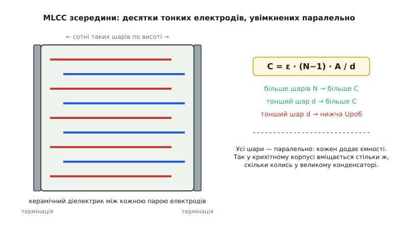
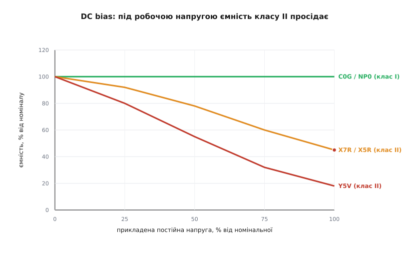

# 🔌 MLCC: керамічний конденсатор, що крадькома міняє ємність

> Майже кожен конденсатор на сучасній платі — це MLCC (англ. *multilayer ceramic capacitor*, багатошаровий керамічний конденсатор): крихітна сіра цеглинка без полярності й майже без ціни. Він витіснив усе інше там, де треба «просто ємність». Але є одна підступність, через яку чесний розрахунок розходиться з тим, що ви виміряєте на платі: ємність класу II залежить від прикладеної напруги, температури й навіть від того, скільки днів конденсатор пролежав після пайки. Розберімо, як він влаштований, чому буває двох дуже різних характерів і коли який брати.

### Чому «багатошаровий»: площа, складена гармошкою

Ємність плаского конденсатора зростає з площею пластин і падає з відстанню між ними: `C = ε · A / d`. Щоб у корпус завбільшки з макове зерня запхати десятки нанофарад, площу нарощують не вшир, а **вгору** — стосом. Усередині MLCC лежить пачка дуже тонких металевих електродів, прокладених шарами кераміки; сусідні електроди виведені на протилежні торці й там з'єднані металізацією. Виходить багато крихітних конденсаторів, увімкнених **паралельно**, а паралельні ємності додаються:

```
C = ε · (N − 1) · A / d
   N  — число електродних шарів (буває кількасот)
   A  — площа перекриття сусідніх електродів
   d  — товщина одного керамічного шару (сучасні — менш як 1 мкм)
```


*Електроди заходять гребінкою з протилежних боків і всі ввімкнені паралельно — кожен шар додає ємності. Та сама ідея «складеної площі», що в [електролітичному конденсаторі](topic:hw-components/electrolytic-cap) дає об'єм рідиною, тут працює сухим керамічним стосом — без полярності й без електроліту, що висихає.*

Звідси два важелі мініатюризації: більше шарів і тонший шар. Обидва нарощують ємність — але тонший шар d означає, що та сама напруга створює сильніше поле всередині кераміки, тож **робоча напруга падає**. Це наскрізний компроміс MLCC: ємність, об'єм і напруга тягнуть у різні боки, і виграш в одному майже завжди оплачується програшем в іншому.

### Два характери кераміки: клас I проти класу II

Уся хитрість MLCC — у самій кераміці між електродами. Її роблять із різних матеріалів, і вони діляться на два світи з протилежними характерами. Кодування — за стандартом EIA (Electronic Industries Alliance, США).

**Клас I (C0G, він же NP0).** Діелектрик на основі параелектриків (титанатів). Діелектрична проникність невелика, тож ємності в одному корпусі мало. Зате він — взірець стабільності: ємність майже не залежить ні від температури, ні від напруги, ні від часу. Код `C0G` (іноді пишуть `NP0` — «negative-positive-zero», нульовий температурний хід) означає температурний коефіцієнт **±30 ppm/°C** — це менш як ±0.3 % зміни в усьому діапазоні −55…+125 °C. Практично пряма лінія.

**Клас II (X7R, X5R, Y5V…).** Діелектрик на основі **сегнетоелектрика** — титанату барію (BaTiO₃). Його проникність у десятки разів вища, тож у тому самому корпусі вміщається в десятки разів більше ємності. За це й люблять клас II: 10 мкФ у корпусі 0805 — це він. Але та сама сегнетоелектрична природа, що дає велику ємність, робить її **нестабільною**: вона «пливе» від усього.

Тризнаковий код класу II читається так:

```
 X     7     R
 │     │     └─ макс. зміна ємності в межах діапазону
 │     └─────── верхня межа температури
 └───────────── нижня межа температури

нижня:  X = −55 °C   Y = −30 °C   Z = +10 °C
верхня: 5 = +85 °C   6 = +105 °C  7 = +125 °C
зміна:  R = ±15 %    S = ±22 %    V = +22 / −82 %
```

Тож **X7R** = «−55…+125 °C, ємність гуляє в межах ±15 %»; **X5R** = те саме, але лише до +85 °C; **Y5V** = «−30…+85 °C, і ємність може впасти аж на 82 %». Y5V бере найбільшу ємність в обмін на найгіршу стабільність — це крайній випадок класу II.

> 🔧 **Навіщо це.** Код на стрічці — не бюрократія, а попередження. Побачили `X5R` у схемі живлення, яка має працювати в авто (де під капотом легко +105 °C) — це помилка: вище +85 °C X5R уже поза специфікацією. А `Y5V` у фільтрі, від якого ви чекаєте стабільної ємності, — майже завжди прикра несподіванка.

### Чому клас II «пливе»: три окремі підступи

Ярлик «±15 %» приховує те, що насправді ємність класу II гризуть **три різні механізми**, і вони складаються.

**1. Просідання від постійної напруги (DC bias).** Це найбільший і найпідступніший ефект. Прикладена постійна напруга поляризує сегнетоелектричні домени в кераміці — і що ближче до номінальної напруги, то менше «вільної» поляризації лишається, щоб реагувати на сигнал. Результат: реальна ємність під робочою напругою може бути в рази меншою за ту, що написана на корпусі.


*Під номінальною напругою X7R/X5R втрачають десь половину, а Y5V — до чотирьох п'ятих ємності. C0G лишається пласким. Класичний приклад: конденсатор 10 мкФ 6.3 В X5R на шині 5 В може реально дати 3–4 мкФ замість десяти.*

Числа варті того, щоб їх запам'ятати:

```
клас II, на 50 % номінальної напруги  →  лишається ≈ 40…60 % ємності
клас II, на 100 % номінальної напруги →  X5R/X7R втрачають > 70 %
                                          Y5V — ще більше
```

Звідси народне правило **подвоєння напруги**: бери конденсатор із номінальною напругою щонайменше вдвічі вищою за робочу. Тоді поле в кераміці лишається помірним, і просідання — терпиме. Інакше доводиться ставити більший номінал «із запасом на брехню».

**2. Температурний хід.** Це і є те, що описує третя літера коду. Ємність X7R у межах −55…+125 °C гуляє в коридорі ±15 % — і це окремо від DC bias. Тобто холодним ранком і гарячим радіатором та сама деталь має різну ємність.

**3. Старіння.** Сегнетоелектрична кераміка повільно «застигає»: домени з часом упорядковуються, і ємність логарифмічно спадає. Для X7R темп старіння — близько **2.5 % за декаду годин** (тобто між 1-ю та 10-ю годиною, потім між 10-ю та 100-ю, і так далі — щоразу ще −2.5 %). За кілька років набігає десь 10–15 % втрати від початкової.

Найцікавіше: старіння **скидається нагріванням**. Якщо прогріти кераміку вище точки Кюрі титанату барію (≈ +125 °C — там сегнетоелектрична фаза переходить у параелектричну), домени «забувають» упорядкування, і відлік починається з нуля. Саме це робить пайка оплавленням: пройшовши піч, конденсатор виходить «помолоділим», і відлік старіння стартує від моменту пайки. Тому виміряна на свіжозмонтованій платі ємність за тиждень помітно нижча — і це норма, а не брак.

> 🔧 **Навіщо це.** Якщо в проєкті важлива точна ємність — генератор, [кварцовий резонатор](topic:hw-analog/pierce-oscillator) з його навісними конденсаторами, прецизійний [RC-таймер](topic:hw-analog/rc-time-constant), активний фільтр — клас II туди ставити **не можна**: він зведе нанівець усю точність DC bias-ом, температурою й старінням. Туди йде тільки C0G/NP0. Клас II — для розв'язки, накопичення, фільтрації живлення, де важить «багато ємності в малому об'ємі», а її точне значення нікого не турбує.

### Типорозміри: фізичний об'єм торгуєш на ємність і напругу

MLCC випускають у стандартних корпусах для поверхневого монтажу. Імперський код — це габарити в сотих дюйма: `0805` = 0.08″ × 0.05″. Поруч живе метричний код у десятих міліметра, і він плутає: метричний `1608` — це той самий корпус, що імперський `0603`. Тому завжди уточнюйте, у якій системі названо розмір.

```
імперський   метричний   Д × Ш, мм
  0201         0603        0.6 × 0.3
  0402         1005        1.0 × 0.5
  0603         1608        1.6 × 0.8
  0805         2012        2.0 × 1.25
  1206         3216        3.2 × 1.6
```

Розмір — це теж компроміс. Дрібніший корпус (0402, 0201) дає щільніший монтаж, але в ньому менше місця під шари — отже, менша гранична ємність і нижча робоча напруга. Більший (0805, 1206) вміщає більше ємності й тримає вищу напругу, **але** довша керамічна цеглина гірше переносить згин плати: MLCC крихкий, і вигин дошки (від гвинта, роз'єму, перепаду температур) легко дає в кераміці мікротріщину, яка з часом проростає в коротке замикання. Тому під механічно напруженими місцями великі корпуси або ставлять «торцем» уздовж осі згину, або беруть конструкції з гнучкими виводами.

### Маркування та як це виглядає в специфікації

На самому корпусі MLCC, як правило, **нічого не написано** — він замалий. Усі параметри читаються з партномера в специфікації або з котушки. Партномер виробника кодує діелектрик, корпус, напругу й допуск. Кілька реальних прикладів, як це розшифровується:

```
Murata  GRM188R71H104KA93 → GRM18=серія, 8=0603, R7=X7R, 1H=50 В, 104=100 нФ, K=±10 %
TDK     C1608X7R1H104K     → 1608 (=0603), X7R, 1H=50 В, 104=100 нФ, K=±10 %
Samsung CL10A106MQ8NNN     → CL10=0603, 106=10 мкФ, M=±20 %, X5R, 6.3 В
Yageo   CC0805KKX7R7BB105  → CC0805=0805, KK=±10 %, X7R, 7=16 В, 105=1 мкФ
```

Тут код ємності — той самий «два знаки + множник у пікофарадах», що й на старих дискових конденсаторах: `104` = 10 × 10⁴ пФ = 100 нФ; `106` = 10 × 10⁶ пФ = 10 мкФ. Літера наприкінці — допуск: `K` = ±10 %, `M` = ±20 %, `J` = ±5 %. Двознаковий код напруги (`1H` = 50 В, `1E` = 25 В, `0J` = 6.3 В) у кожного виробника трохи свій — звіряйтеся з таблицею в специфікації.

> 🔧 **Навіщо це.** Партномер сам собою не каже, **скільки реальної ємності** ви отримаєте на своїй напрузі. Два конденсатори «10 мкФ» від різних виробників в однаковому корпусі 0805 під 5 В можуть дати 4 мкФ і 7 мкФ — бо в них різна товщина шарів і різна кераміка. Серйозні специфікації дають графік «ємність від напруги»; якщо ємність критична, читайте саме його, а не цифру на стрічці.

### Коли який брати — стисло

- **Потрібна стабільна, точна ємність** (таймери, генератори, фазочутливі фільтри, навісні конденсатори [кварца](topic:hw-analog/pierce-oscillator)) → **C0G/NP0**. Платиш малою ємністю в корпусі, отримуєш незмінність.
- **Потрібно багато ємності в малому об'ємі**, точність байдужа ([розв'язка живлення](topic:hw-components/decoupling), накопичення, згладжування) → **X7R** (ширший температурний діапазон) або **X5R** (дешевше, але тільки до +85 °C). Завжди бери з запасом по напрузі (правило подвоєння) і не вір номіналу буквально.
- **Y5V** → лише там, де треба гранична ємність за копійки й абсолютно байдуже, скільки її лишиться. У більшості нових проєктів його уникають.
- **Корпус** — найдрібніший, який дає потрібну ємність і напругу та який ви здатні надійно припаяти; під місцями, де плата гнеться, — обережно з великими корпусами.

Підсумок одним реченням: MLCC дешевий і всюдисущий, але клас II — це конденсатор зі змінною ємністю, яка тихо просідає від напруги, температури й часу; пам'ятайте про це, беріть запас по напрузі, а там, де ємність має бути точною, ставте C0G.
