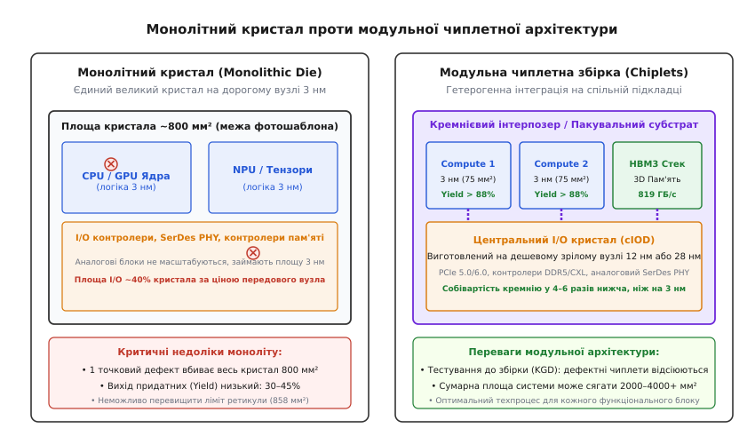
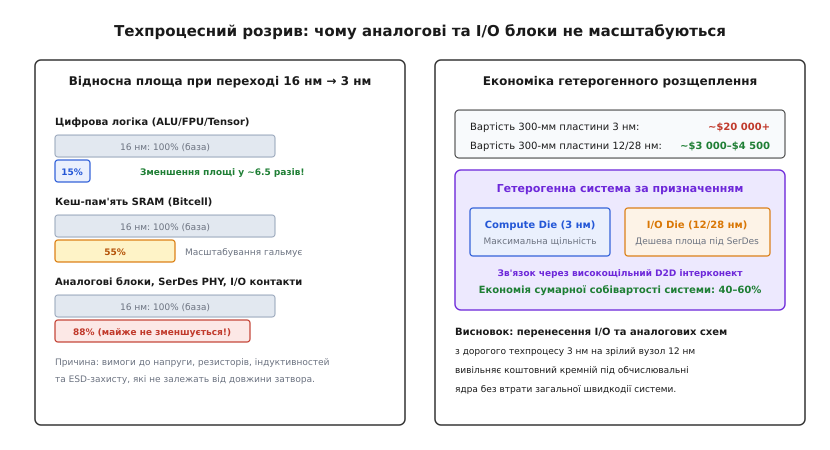
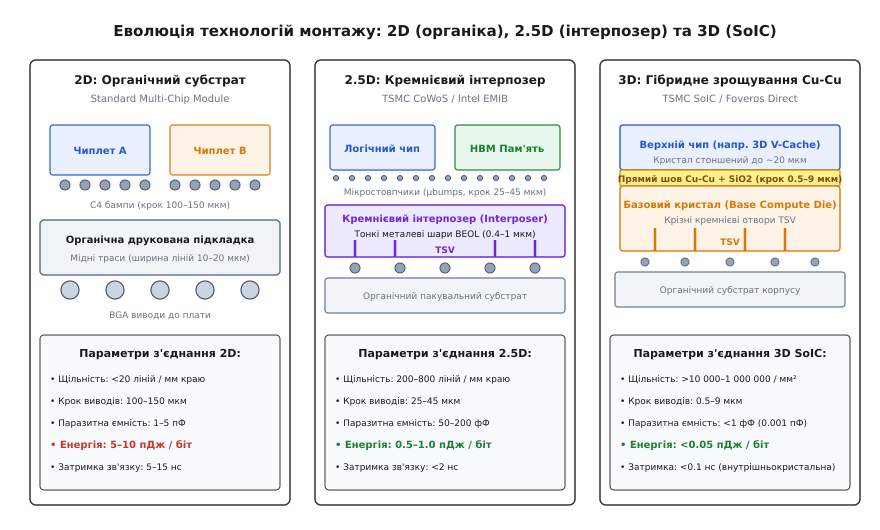
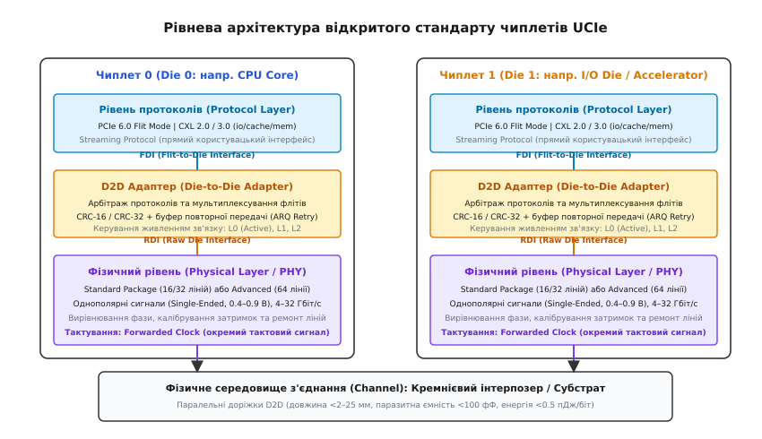

# Чиплети та advanced packaging

<preknowlist>
- [Вихід придатних кристалів (Yield)](topic:hw-components/yield) — статистика дефектів на пластині та експоненційне падіння виходу зі зростанням площі.
- [Фотолітографія](topic:hw-components/photolithography) — проекційне експонування через фотошаблон і оптичні межі літографічних сканерів.
- [Техпроцес](topic:hw-components/process-node) — геометричне масштабування транзисторів і фізичні обмеження кремнієвих вузлів.
- [Система-на-кристалі (SoC)](topic:hw-components/system-on-chip) — монолітна інтеграція гетерогенних вузлів на спільному кристалі.
</preknowlist>

Коли для навчання сучасних нейромереж або моделювання складних фізичних процесів потрібен процесор із сотнею мільярдів транзисторів, спроба виготовити його у вигляді єдиного кремнієвого моноліту площею `800 мм²` на передовому техпроцесі 3 нм стикається з економічною катастрофою. На кремнієвій пластині діаметром 300 мм, вартість обробки якої перевищує `$20 000`, випадкові точкові дефекти розподілені статистично: що більша площа окремого кристала, то вища ймовірність потрапляння дефекту в його схему. Якщо для кристала площею `75 мм²` вихід придатних виробів становить близько 88%, то для моноліту площею `800 мм²` він обвалюється нижче 35–40%. Із 64 теоретично можливих кристалів на пластині неушкодженими залишаються лише близько двох десятків, а собівартість кожного робочого моноліта злітає до сотень доларів, оскільки він змушений оплачувати вартість усього відбракованого кремнію.

Ба більше, оптичні літографічні сканери мають жорстку фізичну межу: максимальне поле експонування фотошаблона становить близько `858 мм²` (`26 мм × 33 мм`). Створити монолітний кристал більшого розміру без складного та ненадійного зшивання літографічних полів фізично неможливо. Водночас різні частини мікросхеми по-різному реагують на зменшення транзисторів: цифрові обчислювальні ядра подвоюють свою щільність на кожному новому вузлі, тоді як аналогові підсилювачі, фазові автопідстроювачі частоти (PLL), трансивери SerDes та контактні майданчики вводу-виводу майже не зменшуються через обмеження напруг пробою та шумів. Розміщення цих аналогових блоків на найдорожчому техпроцесі 3 нм є марнотратством коштовної площі.

Виходом із цієї технологічної безвиході стала **модульна архітектура чиплетів** (англ. *chiplet*, від *chip* та зменшувального суфікса *-let* — маленький кристал). Замість гігантського моноліту складна система розбивається на функціональні кремнієві фрагменти меншої площі, кожен із яких виготовляється за найбільш підхожим і економічно виправданим техпроцесом, після чого вони об'єднуються в єдиний високопродуктивний модуль за допомогою технологій **передового корпусування** (англ. *advanced packaging*).

---

## Фізичні та економічні межі монолітного кремнію

Щоб зрозуміти причину відмови від монолітних кристалів у високопродуктивних обчисленнях, необхідно проаналізувати два фундаментальні обмеження напівпровідникового виробництва: оптичну апертуру літографії та статистику дефектів.


*Порівняння монолітного кристала великої площі з модульною системою на базі спеціалізованих чиплетів на спільній підкладці.*

### Ліміт фотошаблона (Reticle Limit)
Оптична система сучасних літографічних сканерів DUV та EUV здійснює 4-кратне зменшення малюнка з кварцової маски (фотошаблона) на кремнієву пластину. Стандартний фізичний розмір маски становить 6 дюймів (`152.4 мм`), а її корисне поле експонування обмежене розміром `104 мм × 132 мм`.

Після оптичного зменшення в 4 рази максимальний розмір одиничного поля експонування на кремнії становить:

```
W_max = 104 мм / 4 = 26 мм
H_max = 132 мм / 4 = 33 мм
A_reticle = 26 мм × 33 мм = 858 мм²
```

Це число називають **межею фотошаблона** (англ. *reticle limit*). Якщо розробникам потрібен кристал площею `1500 мм²` (наприклад, для сучасних графічних процесорів або прискорювачів штучного інтелекту), єдиним монолітним способом його створення є літографічне зшивання (англ. *reticle stitching*) — послідовне експонування двох або більше сусідніх кадрів із прецизійним перекриттям. Проте похибка суміщення сканера навіть у 1.5 нм призводить до розривів або замикань субмікронних металевих ліній на стику полів, що викликає катастрофічне падіння відсотка придатних мікросхем.

Ситуація стає ще гострішою з переходом до літографії екстремального ультрафіолету з високою числовою апертурою (High-NA EUV, де `NA = 0.55`). Через необхідність застосування анаморфотної оптики з 8-кратним оптичним зменшенням по осі Y максимальне поле фотошаблона скорочується вдвічі — до `429 мм²` (`26 мм × 16.5 мм`). Для High-NA EUV поділ обчислювальних процесорів на чиплети є єдиним способом створення чипів із площею понад пів тисячі квадратних міліметрів.

### Експоненційне падіння виходу придатних кристалів
Розподіл точкових дефектів (частинок пилу, дефектів кристалічної ґратки, мікротріщин оксиду) на поверхні кремнієвої пластини підпорядковується законам статистики. У моделі Мерфі з урахуванням неоднорідності дефектів частка придатних кристалів `Y` залежить від їхньої площі `A` та середньої густини дефектів `D`:

```
Y = ((1 − e^(−D · A)) / (D · A))²
```

Оскільки площа `A` входить у показник експоненти, подвоєння площі кристала призводить не до дворазового, а до багаторазового падіння ймовірності його бездоганності. Коли моноліт площею `800 мм²` розбивають на чотири чиплети по `200 мм²`, кожен із них має площу вчетверо меншу, а отже, набагато рідше містить фатальний дефект. Браковані чиплети відсіюються ще на етапі тестування нерозрізаної пластини, і в підсумкову збірку потрапляють лише гарантовано працездатні кристали (Known Good Die).

Додатковий геометричний штраф створює кругла форма кремнієвої пластини: великі прямокутні кристали не вміщаються цілими біля краю пластини (Edge Exclusion Zone), що зменшує корисний вихід брутто-кристалів (DPW) на 25–35%.

Точний математичний апарат розрахунку експоненційних кривих виходу, геометричного розміщення кристалів на круглій пластині та економічного балансу збірки виведено в окремому розборі ([🧮 математична модель виходу придатних кристалів, межі фотошаблона та економіки чиплетів](topic:hw-components/chiplets/math-reticle-yield.md)).

---

## Гетерогенна інтеграція та диспропорція масштабування

Другою рушійною силою чиплетної архітектури є **гетерогенна інтеграція** (від грец. *heteros* — інший та *genos* — рід) — об'єднання в межах єдиного компонента кристалів, виготовлених за кардинально різними технологічними нормами.


*Розрив у масштабуванні площі: цифрова логіка стискається в рази, тоді як аналогові вузли та SerDes зберігають свої габарити.*

### Проблема диспропорції масштабування (Scaling Mismatch)
Історично з кожним новим техпроцесом зменшувалися всі компоненти мікросхеми. Проте на нормах менше 10 нм ця синхронність зруйнувалася:
1. **Цифрова логіка (ALU, конвеєри інструкцій, тензорні ядра):** чудово масштабується. При переході з вузла 16 нм на 3 нм площа логічних вентилів зменшується майже у 6.5 разів, а їхнє динамічне енергоспоживання суттєво падає завдяки зменшенню комутованої ємності затворів.
2. **Кеш-пам'ять SRAM:** масштабується значно повільніше. Площа стандартної 6-транзисторної комірки SRAM (6T-cell) на вузлах 3 нм зменшилася лише на 10–20% порівняно з 5 нм через необхідність збереження стабільності стану при випадкових коливаннях порогової напруги (термічний шум та квантові ефекти).
3. **Аналогові кола та інтерфейси вводу-виводу (I/O PHY, SerDes, PLL):** практично не масштабуються. Для підтримки стандартів PCIe 5.0/6.0 або ліній пам'яті DDR5 потрібні високі амплітуди напруг (0.8–1.2 В), прецизійні резистори узгодження імпедансу, конденсатори фільтрації живлення та масивні структури електростатичного захисту (ESD). Ці елементи вимагають товстих шарів діелектрика, щоб запобігти тунельному пробою оксиду, і їхня фізична площа на вузлі 3 нм залишається майже такою самою, як і на вузлі 16 нм.

У монолітній системі-на-кристалі підсистема вводу-виводу та аналогові блоки можуть займати до 30–40% усієї площі чипа. Виготовлення цих компонентів на вузлі 3 нм за ціною понад `$20 000` за пластину означає викидання коштів на вітер.

### Функціональне розщеплення системи
Чиплетна архітектура вирішує цю проблему шляхом фізичного розведення функцій:
- **Обчислювальні кристали (Compute Die / Core Complex Die, CCD):** містять виключно цифрові ядра процесора, графічні шейдери або матричні прискорювачі NPU. Їх виготовляють на найновіших передових літографічних лініях (3 нм або 5 нм), отримуючи максимальну щільність обчислень на квадратний міліметр.
- **Кристал вводу-виводу (I/O Die, cIOD):** концентрує в собі контролери пам'яті DDR5/LPDDR5, аналогові трансивери PCIe, генератори тактових частот PLL та логіку безпеки. Його виготовляють на зрілому, високорентабельному та перевіреному часом вузлі (наприклад, 12 нм або 28 нм), де вартість пластини становить лише `$3 000–$4 500`.

Крім розведення логіки та вводу-виводу, гетерогенна інтеграція відкрила шлях до безпосереднього підключення тривимірних стеків пам'яті високої пропускної здатності **HBM (High Bandwidth Memory)**. Кілька шарів кристалів DRAM монтуються вертикально за допомогою крізних кремнієвих отворів TSV безпосередньо поруч із процесором, забезпечуючи пропускну здатність шини пам'яті понад 1–2 ТБ/с на стек при ширині паралельного інтерфейсу 1024 біти.

Докладніше про те, як індустрія пройшла шлях від перших керамічних модулів IBM до рішень AMD EPYC та сучасних консорціумів, читайте в історичній довідці ([📜 історія розвитку багаточипових модулів та виникнення чиплетів](topic:hw-components/chiplets/hist-chiplet-evolution.md)).

---

## Технології передової збірки: 2D, 2.5D та 3D

Головним технічним викликом чиплетної концепції є забезпечення електричного зв'язку між розділеними кристалами. Якщо зв'язок реалізувати невдало, висока паразитна ємність та індуктивність довгих з'єднань нівелюють усі переваги поділу.

За геометрією та щільністю інтеграції технології збірки поділяють на три фундаментальні покоління:


*Порівняння конструкції та фізичних характеристик 2D (органіка), 2.5D (кремнієвий інтерпозер) та 3D (гібридне зрощування Cu-Cu).*

### 1. Традиційне 2D корпусування на органічному субстраті
У класичному багаточиповому модулі (Multi-Chip Module, MCM) окремі кристали встановлюються на спільну багатошарову друковану підкладку з органічного матеріалу (текстоліту).
- **Монтаж:** здійснюється за допомогою кулькових виводів C4 (англ. *Controlled Collapse Chip Connection*) з кроком 100–150 мкм.
- **Обмеження:** мінімальна ширина мідних доріжок в органіці становить 10–20 мкм. Це обмежує кількість ліній зв'язку вздовж межі кристала (shoreline density) скромним значенням у 15–20 ліній на міліметр.
- **Електричні параметри:** довжина трас сягає 5–25 мм, паразитна ємність становить `1–5 пФ`, а затримка поширення сигналу перевищує 5–15 нс. Енергія передавання одного біта становить `5–10 пДж/біт`, що робить широкі когерентні шини між чиплетами вкрай енерговитратними.

### 2. 2.5D інтеграція з кремнієвими інтерпозерами
Щоб наблизити характеристики міжчиплетних з'єднань до монолітних внутрішньокристальних шин, між чиплетами та органічною підкладкою розміщують проміжну пластину з чистого кремнію — **кремнієвий інтерпозер** (англ. *silicon interposer*). Найвідомішим прикладом є технологія **TSMC CoWoS-S (Chip-on-Wafer-on-Substrate)**.

```
Анатомія 2.5D збірки (TSMC CoWoS):

   [ Обчислювальний чиплет ]       [ Стек пам'яті HBM3 ]
   ════════╤═════════════╤════     ════════╤═════════╤════
           ○ Microbumps  ○                 ○  μbumps ○ (крок 25–45 мкм)
   ────────┴─────────────┴─────────────────┴─────────┴────
   ┌─────────────────────────────────────────────────────┐
   │ Кремнієвий інтерпозер (Silicon Interposer, ~100 мкм) │
   │  - Шар тонкої металізації BEOL (лінії 0.4–1.0 мкм)  │
   │  - Крізні кремнієві отвори TSV (Through-Silicon Via)│
   └─────────────────────────────────────────────────────┘
           ● C4 Bumps    ●                 ● C4 Bumps● (крок 100–150 мкм)
   ────────┴─────────────┴─────────────────┴─────────┴────
   ┌─────────────────────────────────────────────────────┐
   │        Органічний пакувальний субстрат корпусу      │
   └─────────────────────────────────────────────────────┘
           ◯ BGA кульки до материнської плати            ◯
```

- **Металізація BEOL (Back-End-of-Line):** інтерпозер виготовляють за технологією виробництва кремнієвих мікросхем. Він містить до 4–6 шарів мідної металізації з шириною ліній менше 1 мкм (`0.4–0.8 мкм`).
- **Мікростовпчики (Microbumps / μbumps):** чиплети монтуються на інтерпозер мікроскопічними припойними стовпчиками з кроком усього 25–45 мкм за технологією термокомпресійного зварювання (Thermal Compression Bonding, TCB).
- **Крізні кремнієві отвори (Through-Silicon Vias, TSV):** вертикальні циліндричні мідні провідники діаметром 5–10 мкм, протравлені методом глибокого реактивного іонного травлення (Bosch Process) крізь усю товщу кремнієвого інтерпозера (глибиною близько 100 мкм), що передають живлення та зовнішні сигнали вниз — до органічної підкладки.
- **Параметри:** щільність з'єднань зростає до 200–800 ліній на міліметр краю, паразитна ємність падає до `50–200 фФ`, а енерговитрати знижуються до `0.5–1.0 пДж/біт` при затримці передачі менше 1–2 нс.

#### Локальні кремнієві містки: Intel EMIB
Повнорозмірний кремнієвий інтерпозер має відчутний мінус: він дорогий, а його площа також обмежена розміром пластини. Для усунення цього недоліку компанія Intel розробила технологію **EMIB (Embedded Multi-die Interconnect Bridge)**.

Замість велетенського кремнієвого листа під усіма чипами, крихітний кремнієвий місток розміром у кілька квадратних міліметрів вмонтовується безпосередньо в поглиблення органічної підкладки суворо під стиком двох сусідніх чиплетів. Це забезпечує надвисоку щільність з'єднань між кристалами за допомогою мікростовпчиків, тоді як живлення та периферія підводяться до чиплетів напряму через дешеву органіку.

### 3. 3D інтеграція та пряме гібридне зрощування мідь-мідь
Коли чиплети монтуються не поруч (пліч-о-пліч), а шарами один над одним, технологія переходить у площину **3D інтеграції**.

Традиційне 3D-стекування з використанням припойних мікростовпчиків (як у першому поколінні Intel Foveros) має фізичну межу: при зменшенні кроку виводів нижче 10 мкм рідкий припій під час нагрівання неминуче розтікається, утворюючи паразитна перемички та короткі замикання між сусідніми контактами.

Революційним проривом стала технологія **прямого гібридного зрощування мідь-мідь (Direct Cu-Cu Hybrid Bonding)**, втілена в архітектурах **TSMC SoIC (System-on-Integrated-Chips)** та **Intel Foveros Direct**.

```
Механізм прямого гібридного зрощування (TSMC SoIC):

Верхній чиплет:  [ Кристал Кремнію ]
                 [ SiO₂ ] █ Cu █ [ SiO₂ ] █ Cu █ [ SiO₂ ]  (атомно гладка поверхня)
                   │        │        │        │        │
                   ▼        ▼        ▼        ▼        ▼   (молекулярне притискання при 25°C)
Нижній кристал:  [ SiO₂ ] █ Cu █ [ SiO₂ ] █ Cu █ [ SiO₂ ]
                 [ TSV  ]        [ TSV  ]                  (відпал при ~300°C: розширення Cu)
```

#### Фізичний механізм гібридного зрощування
1. Поверхні верхнього та нижнього кристалів поліруються методом хіміко-механічної планаризації (CMP) до атомарної гладкості (шорсткість менше 0.5 нм). Мідні контактні майданчики формуються так, щоб вони були заглиблені в діелектрик діоксиду кремнію (SiO₂) на кілька нанометрів (контроль прогину dishing менше 3 нм).
2. Після активації поверхонь плазмою азоту або аргону кристали суміщаються при кімнатній температурі з субмікронною точністю. Шари діоксиду кремнію торкаються і миттєво формують міцні молекулярні ковалентні зв'язки (Si–O–Si bonding).
3. Збірка нагрівається до помірної температури близько 300 °C (термічний відпал). Мідь має значно вищий коефіцієнт теплового розширення, ніж SiO₂. Мідні площадки розширюються, випинаються назовні, вступають у прямий фізичний контакт і сплавляються в єдину кристалічну ґратку за рахунок міжкристалітної дифузії міді.

#### Характеристики прямого 3D-зрощування
- Відсутність припою дозволяє зменшити крок контактів до **менше 1–9 мкм**.
- Щільність з'єднань досягає від **10 000 до 1 000 000 контактів на мм²**.
- Паразитна ємність контакту падає до мізерних **< 1 фемтофарада** (`<0.001 пФ`).
- Енергія передавання біта становить менше **0.05 пДж/біт**, що повністю стирає фізичну межу між внутрішньокристальною шиною та міжчиплетним переходом.
- Найяскравішим серійним зразком є технологія **AMD 3D V-Cache**: додатковий кристал SRAM кешу об'ємом 64 МБ стоншується до товщини 20 мкм і приварюється безпосередньо зверху на обчислювальний чиплет процесора, забезпечуючи пропускну здатність кешу понад 2.5 ТБ/с.

---

## Відкриті стандарти та інтерфейси чиплетів: BoW та UCIe

Перші покоління систем на чиплетах спиралися на закриті фірмові протоколи: AMD Infinity Fabric, Intel AIB (Advanced Interface Bus) та Ultra Path Interconnect (UPI). Це робило неможливим створення гібридних мікросхем із чиплетів різних виробників (наприклад, поєднання процесорних ядер Arm, виготовлених на TSMC, із матричним тензорним чиплетом від стороннього розробника, зібраним на фабі Samsung).

Для подолання цієї ізоляції індустрія розробила уніфіковані відкриті стандарти інтерконекту D2D (Die-to-Die).


*Стек стандарту UCIe: рівень протоколів PCIe/CXL, D2D-адаптер контролю цілісності та фізичний рівень паралельних ліній зв'язку.*

### Стандарт BoW (Bunch of Wires)
Створений консорціумом Open Compute Project (OCP) у рамках підгрупи ODSA (Open Domain-Specific Architecture). BoW є простим та енергоефективним паралельним інтерфейсом, оптимізованим для недорогих 2D органічних субстратів та 2.5D інтерпозерів.
- Використовує однополярні сигнальні лінії (Single-Ended) з напругами 0.75–0.9 В.
- Забезпечує передачу даних зі швидкістю до 16 Гбіт/с на контакт при енергоспоживанні 0.5–1.0 пДж/біт.
- Завдяки простоті контролера BoW ідеально підходить для підключення малопотужних сенсорів, допоміжних мікроконтролерів та спеціалізованих FPGA-чиплетів.

### Стандарт UCIe (Universal Chiplet Interconnect Express)
Специфікація UCIe, представлена у 2022 році, стала головним світовим стандартом зв'язку для передових обчислювальних систем. Її підтримали всі провідні виробники кремнію: Intel, AMD, Arm, TSMC, Samsung, Qualcomm, Nvidia та ASE Group.

#### Трирівневий стек стандарту UCIe
1. **Рівень протоколів (Protocol Layer):**
   Забезпечує нативне, безшовне перенесення стандартних пакетів без зміни програмних драйверів операційної системи. Підтримує:
   - **PCIe 6.0 у режимі Flit Mode:** передача пакетів TLP для стандартних пристроїв вводу-виводу.
   - **Compute Express Link (CXL 2.0 / 3.0):** протоколи `CXL.io` (керування), `CXL.cache` (апаратна когерентність кешів між чиплетами без участі ОС) та `CXL.mem` (пряме звернення до пулу оперативної пам'яті сусіднього кристала).
   - **Streaming Protocol:** користувацький сирий інтерфейс (наприклад, для прямої передачі шин AMBA AXI5 або пакетів NoC).

2. **Адаптер зв'язку (Die-to-Die Adapter Layer):**
   Відповідає за надійність і керування каналом:
   - Пакує дані в уніфіковані **фліти** (Flits) фіксованого розміру (68 байтів, 256 байтів або 544 байти).
   - Генерує апаратну контрольну суму CRC-16 або CRC-32 для кожного фліта.
   - Містить апаратний буфер повторної передачі (ARQ Retry Buffer), який миттєво відправляє спотворений фліт повторно у разі виявлення помилки.
   - Керує динамічними станами енергозбереження каналу: активний `L0`, черговий `L1` (час виходу <10 нс) та глибокий сон `L2` з повним вимкненням живлення.

3. **Фізичний рівень (Physical Layer / PHY):**
   Перетворює біти флітів в електричні сигнали на контактах підкладки:
   - Оперує паралельними однополярними лініями (16/32 лінії для Standard Package, 64 лінії для Advanced Package).
   - Використовує пряме супутнє тактування (Forwarded Clock): разом із лініями даних передається синхронний тактовий сигнал, що усуває необхідність у складних та енергоємних схемах відновлення тактової частоти з даних (CDR, Clock Data Recovery).
   - Здійснює динамічне калібрування затримок (Deskew) за допомогою схем DLL для вирівнювання фазового зсуву між паралельними доріжками з точністю до одиниць пікосекунд.

Детальну апаратну карту регістрів, розпіновку ліній та структуру флітів стандарту наведено в окремому довіднику ([📋 специфікація фізичного та канального рівнів стандарту UCIe](topic:hw-components/chiplets/api-ucie-spec.md)).

Практичну програмну модель роботи інтерфейсу D2D з обчисленням перемикань ліній та енергоспоживання продемонстровано у прикладі реалізації ([⚙️ емуляція зв'язку Die-to-Die з розрахунком енергоефективності та виправленням помилок](topic:hw-components/chiplets/proj-d2d-link-sim.md)).

---

## Інженерні виклики: тестування KGD, тепловий бар'єр та мережа живлення

Перехід до чиплетів створює комплекс специфічних схемотехнічних проблем, які не виникали в монолітних мікросхемах.

### 1. Проблема Known Good Die (KGD)
Якщо монолітний кристал бракується цілком на пластині, то в чиплетній системі дефект лише в одному з кристалів, виявлений уже після фінального монтажу на спільний інтерпозер, призводить до викидання на смітник усього готового модуля разом з іншими справними дорогими чиплетами.

Якщо модуль складається з `N = 8` чиплетів, і кожен чиплет перевірений на пластині з якістю `98%` (`Y_die = 0.98`), то підсумковий вихід спакованого модуля через накопичення помилок впаде до:

```
Y_package = (Y_die)⁸ · Y_assembly
          = (0.98)⁸ × 0.99
          = 0.8507 × 0.99 = 0.8422  (лише 84.2% придатних модулів!)
```

Втрата 16% готових пристроїв є неприпустимою. Тому чиплетна індустрія вимагає концепції **Known Good Die (KGD)**: кристали проходять вичерпне багатоетапне тестування ще у формі нерозрізаної пластини за допомогою спеціальних зондових головок високої щільності (Micro-probe cards), вбудованих схем самотестування (BIST) та стандартів сканування міжчипових зв'язків IEEE 1149.4 та IEEE 1838 для 3D-інтегральних схем. Тестове покриття дефектів KGD має перевищувати `99.8%`.

#### Резервування ліній (Lane Redundancy / Repair)
Оскільки під час паяння тисяч мікростовпчиків один із контактів може відірватися або закоротитися, у кожен модуль PHY закладають від 2 до 4 резервних ліній зв'язку. Під час первинного апаратного тренування каналу вбудований контролер зондує кожну лінію. Якщо лінія #15 виявляється обірваною, мультиплексор PHY автоматично перемикає її сигнал на резервну лінію SPARE #0, а конфігурація перепризначення назавжди записується в енергонезалежні перемички eFuse.

### 2. Цілісність сигналів і перехресні завади (Signal Integrity)
Висока щільність паралельних ліній на кремнієвому інтерпозері (де відстань між сусідніми мідними доріжками становить менше 1 мкм) створює сильну паразитну ємнісну та індуктивну взаємодію між лініями. Одночасне перемикання десятків паралельних ліній (Simultaneous Switching Activity) викликає перехресні наведення (Crosstalk), що зменшує висоту та ширину ока сигнальної діаграми (Eye Diagram Closure).

Для забезпечення цілісності сигналів у стандарті UCIe застосовують чергування сигнальних ліній із лініями опорної землі (GND Shielding), кодування з обмеженням кількості однакових бітів підряд (Data Inversion) та прецизійний динамічний трекінг напруги й фази (PVT Tracking), який компенсує температурний дрейф затримок під час роботи процесора.

### 3. Тепловий бар'єр 3D-стекування (Thermal Stacking Challenge)
Кремній є непоганим провідником тепла (теплопровідність близько `150 Вт/(м·К)`), проте діоксид кремнію SiO₂ та полімерні клейові підкладки мають теплопровідність менше `1–1.5 Вт/(м·К)` — у сто разів гірше.

Коли один над одним монтуються два активні обчислювальні кристали, сумарна щільність теплового потоку перевищує `100–200 Вт/см²`. Тепло від нижнього кристала не може ефективно вийти в радіатор через верхній кристал, що спричиняє перегрів нижніх шарів до температур понад 120 °C і викликає тепловий розгін транзисторів (Thermal Runaway).

Для боротьби з тепловим бар'єром застосовують такі конструктивні правила:
- **Ієрархія шарів:** найбільш теплонавантажені компоненти (обчислювальні ядра CPU/GPU) завжди розміщують у верхньому шарі, що безпосередньо контактує з металевою теплорозподільною кришкою корпусу (IHS) та радіатором.
- **Пасивні основи:** нижні шари відводять під пасивні інтерпозери, малопотужні I/O-контролери або кеш-пам'ять SRAM, що виділяє у рази менше тепла на одиницю площі.
- **Термічні TSV (Thermal TSVs):** масиви глухих мідних стовпчиків, які не несуть електричних сигналів, а слугують вертикальними теплопровідними містками для відведення тепла крізь товщу кристалів.

### 4. Мережа розподілу живлення (Power Delivery Network, PDN)
Сучасний процесор із десятками чиплетів споживає струм силою `500–1000 А` при робочій напрузі ядер усього `0.75–0.85 В`. 

Проходження струму такої сили крізь сотні мікростовпчиків та тонкі шари металізації інтерпозера викликає паразитне падіння напруги (IR-Drop) та потужні індуктивні викиди `L · (di/dt)` при різкій зміні навантаження обчислювальних ядер (Simultaneous Switching Noise, SSN).

Для стабілізації живлення в чиплетних модулях застосовують:
- **Глибокі траншейні конденсатори (Deep Trench Capacitors, DTC):** кремнієві конденсатори з питомою ємністю до `300–500 нФ/мм²`, вбудовані безпосередньо в структуру кремнієвого інтерпозера впритул до контактів живлення чиплетів.
- **Інтегровані стабілізатори напруги (Integrated Voltage Regulators, IVR):** на інтерпозер подається висока напруга (наприклад, 1.8 В або 3.3 В), що зменшує струм у зовнішніх лініях у 2–4 рази, а локальні перетворювачі поруч із чиплетами понижують її до цільових 0.75 В.

---

> 🔧 **Навіщо це.**
> Чиплетна архітектура докорінно змінила економіку та цикл розробки складних цифрових систем. Замість витрачання 3–4 років і `$300–$500 млн` на проєктування єдиного гігантського монолітного чипа, розробники можуть використати модульний підхід: створити компактне 8-ядерне обчислювальне ядро на передовому вузлі 3 нм, взяти готовий стандартний I/O-чиплет на вузлі 12 нм і підключити стандартні модулі пам'яті HBM3 за допомогою інтерфейсу UCIe.
> 
> Це дозволяє випускати цілі лінійки продуктів — від 8-ядерних процесорів для ноутбуків (1 чиплет логіки + 1 I/O) до 96-ядерних серверних гігантів (12 чиплетів логіки + 1 масивний I/O) — на базі одного й того самого кремнієвого блоку. Чиплети перетворили кремній із монолітного виробу на гнучкий конструктор, продовживши закон Мура в нову епоху System-on-Package («система-в-корпусі»).
