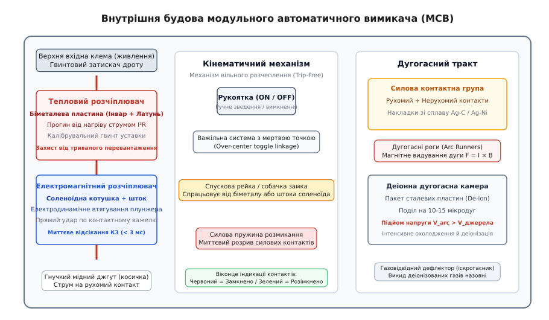
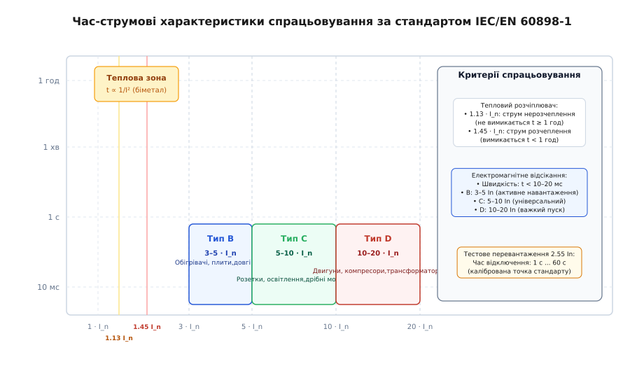
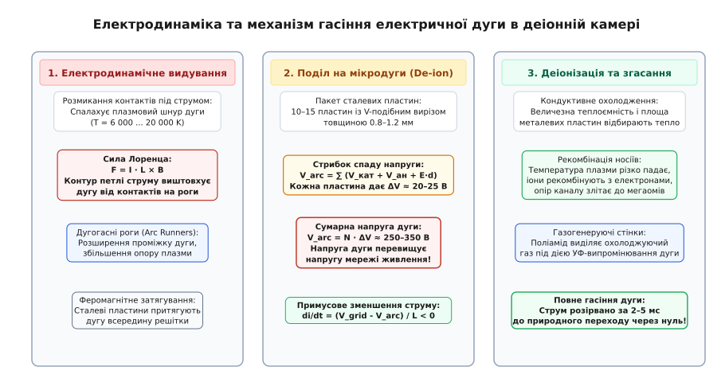
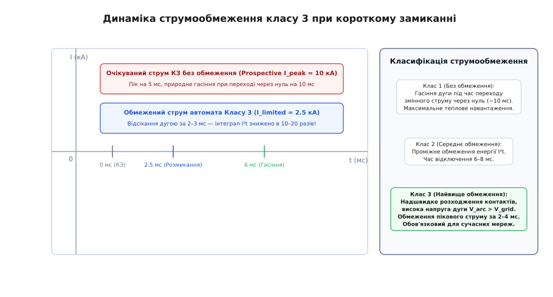
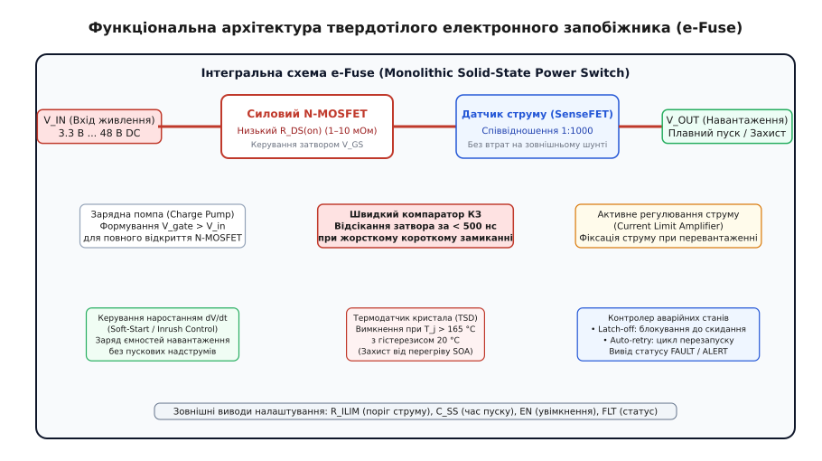

# ⚡ Автомат захисту

<preknowlist>
- [Закон Ома](root:hw-analog/ohms-law) — співвідношення між напругою, струмом і активним опором провідника `V = I · R`.
- [Джоулеве тепло](root:ph-electromagnetism/joule-heating) — виділення теплової потужності `P = I² · R` під час проходження електричного струму.
- [Коротке замикання](root:hw-analog/short-circuit) — аварійне стрибкоподібне зростання струму в контурі з низьким внутрішнім імпедансом джерела.
- [Принцип роботи запобіжника](root:hw-components/fuse-operation) — термічне розплавлення металевого провідника та динаміка гасіння електричної дуги у кварцовому наповнювачі.
- [Сила Лоренца](root:ph-electromagnetism/lorentz-force) — дія магнітного поля на рухомі електричні заряди та провідники зі струмом.
- [Теплове розширення](root:ph-thermodynamics/thermal-expansion) — зміна геометричних розмірів твердих тіл при нагріванні.
</preknowlist>

Коли в розподільчій мережі 230 В з повним імпедансом петлі живлення 0.23 Ом відбувається металеве замикання фазного провідника на нуль, струм у контурі за частку мілісекунди злітає від робочих 10 А до 1000 А. Одноразовий плавкий запобіжник у такій аварії розплавиться й розірве лінію, проте після ліквідації несправності вимагатиме інструментів, запасної вставки та часу на заміну, а при помірному перевантаженні 1.3 · I_n нагріватиметься годинами, дозволяючи кабелю в стіні деградувати від перегріву. Автоматичний вимикач (лат. *disruptor*, англ. *circuit breaker*) розв'язує цю дилему: він поєднує в єдиному багаторазовому апараті два незалежні фізичні механізми розчеплення — повільний термодинамічний та миттєвий електродинамічний, — забезпечуючи безпечне відключення як довготривалих струмових перевантажень, так і надпотужних коротких замикань із наступним миттєвим ручним або автоматичним зведенням.

### Подвійна природа надструмів: перевантаження проти короткого замикання

Будь-яка електрична лінія живлення піддається двом принципово різним видам аварійних надструмів, які вимагають діаметрально протилежної поведінки захисного апарата:

1. **Теплове перевантаження (струми від 1.13 · I_n до 3 · I_n):**
   Виникає при одночасному підключенні занадто великої кількості споживачів до однієї розеточної групи або при механічному заклинюванні вала електродвигуна. Струм перевищує номінальний струм лінії `I_n` у 1.2–2.5 раза. При такому струмі мідні жили кабелю перерізом 2.5 мм² не плавляться миттєво, проте швидкість виділення джоулевого тепла `P = I² · R` починає переважати природне тепловідведення в стіну чи кабель-канал.
   
   Полівінілхлоридна (ПВХ) ізоляція кабелю розрахована на максимальну робочу температуру +70 °C. При тривалому нагріванні до +90...+120 °C пластифікатори випаровуються, полімер стає крихким, зазнає термічного піролізу й розтріскується. Через місяці такої експлуатації мікротріщини призводять до пробою між фазою та нулем і виникнення пожежі.
   
   Водночас захисний апарат не повинен вимикатися миттєво при кожному запуску пилососа чи холодильника, чий пусковий ємнісний або індуктивний струм короткочасно перевищує номінал у 3–5 разів протягом кількох періодів мережевої синусоїди. Захист від перевантаження зобов'язаний мати **обернено-залежну від струму часову характеристику**: що більший струм, то швидше розмикається коло (від десятків хвилин при перевантаженні 1.2 · I_n до кількох секунд при 2.5 · I_n).

2. **Коротке замикання (струми від 5 · I_n до 50 · I_n і більше):**
   Виникає при прямому електричному контакті фазного та нульового провідників (пробій ізоляції, помилка монтажу, потрапляння металевого предмета). Струм обмежується виключно внутрішнім опором живильного трансформатора та лінії (`I_sc = V_grid / Z_loop`) і сягає сотень або тисяч амперів.
   
   У цьому режимі процес нагрівання провідників є суто адіабатичним: тепло не встигає розсіюватися в довкілля. Швидкість наростання температури міді сягає тисяч градусів за секунду, ізоляція спалахує за частки періоду мережевої частоти, а колосальні електродинамічні сили Лоренца між провідниками виривають кабелі з кабельних трас і деформують розподільчі шини. Захист зобов'язаний спрацювати **миттєво** (за час менше 10–20 мс), розірвавши струм ще до настання теплового чи механічного руйнування установки.

Жоден монолітний фізичний чутливий елемент не здатний одночасно забезпечити стабільну півгодинну інтегральну теплову витримку при 1.2 · I_n та мікросекундну реакцію при 10 · I_n. Тому класичний автоматичний вимикач містить **два роздільні розчіплювачі**, увімкнені послідовно в один струмовий тракт: тепловий та електромагнітний.

### Анатомія модульного автоматичного вимикача (MCB)

Модульний автоматичний вимикач (MCB — Miniature Circuit Breaker) є високоточним електромеханічним приладом, укладеним у нерозбірний корпус із негорючого дугостійкого термопласту (поліаміду зі скловолоконним наповненням).


*Внутрішня будова та кінематика модульного автоматичного вимикача: струмовий тракт проходить послідовно крізь біметалеву пластину теплового захисту, соленоїд миттєвого відсікання, важільний замок вільного розчеплення (trip-free) та контактну групу з деіонною дугогасною камерою.*

Струмовий тракт усередині вимикача розгортається наступним ланцюжком:
1. **Верхній гвинтовий затискач:** вхідний контакт для підключення фазного проводу або розподільчої гребінки (фазної шини).
2. **Тепловий розчіплювач:** консольно закріплена біметалева пластина, оснащена калібрувальним гвинтом налаштування заводської уставки.
3. **Гнучкий мідний провідник:** багатожильний плетений джгут (косичка), що передає струм від біметалу на котушку соленоїда без створення паразитного механічного опору руху біметалу.
4. **Електромагнітний соленоїд:** товстодротяна мідна котушка з рухомим підпружиненим феромагнітним осердям (плунжером), шток якого спрямований на спускову рейку замка та рухомий контакт.
5. **Рухомий контактний важіль:** пружинна металева деталь із напаяною контактною накладкою зі спеціального срібно-графітового або срібно-нікелевого сплаву (Ag-C / Ag-Ni).
6. **Нерухомий контакт:** масивний мідний електрод із композитною накладкою, електрично з'єднаний із нижнім дугогасним рогом.
7. **Дугогасна камера (деіонна решітка):** блок із паралельних сталевих пластин, розташований у зоні розходження контактів.
8. **Газовідвідний дефлектор і полум'ягасник:** лабіринтний канал у нижній частині корпусу для скидання надлишкового тиску деіонізованих газів дуги.
9. **Нижня вихідна клема:** затискач для підключення кабелю захищеної лінії навантаження.

Ключовим елементом безпеки MCB є **механізм вільного розчеплення** (*trip-free mechanism* / *Freiauslösung*). Це кінематичний важільний замок із мертвою точкою (*over-center toggle linkage*), який зв'язує зовнішню пластикову рукоятку керування з рухомим силовим контактом.

Механізм спроєктовано так, що внутрішня спускова рейка розмикає силові контакти під дією розтискної пружини незалежно від положення зовнішнього важеля. Якщо вимикач заблоковано в положенні «УВІМК» навісним замком, пломбою або оператор силоміць утримує важіль рукою під час короткого замикання, замок вільного розчеплення скидається, пружина миттєво відриває силові контакти, а внутрішнє віконце індикатора стану перемикається з червоного на зелений колір.

> 📜 **Історична вставка:** [Еволюція автоматичного захисту: від електромагнітних реле Едісона до винаходу MCB Гуго Штотца](root:hw-components/circuit-breaker/hist-edison-to-stotz.md). Як небезпека пожеж від свинцевих вставок спонукала Томаса Едісона та Ґранвілла Вудса створити перші електромагнітні розмикачі, як Еліу Томсон відкрив магнітне видування дуги, Джозеф Слепян винайшов деіонну решітку, а німецький інженер Гуго Штотц у 1924 році об'єднав біметал і соленоїд у перший комбінований модульний автомат MCB.

### Тепловий розчіплювач: фізика біметалевої пластини

Тепловий захист автоматичного вимикача реалізовано на базі **біметалевої пластини** (*bimetallic strip*). Це композитний металевий елемент, утворений жорстким зварюванням двох шарів металів із суттєво різними коефіцієнтами лінійного теплового розширення (CTE — *Coefficient of Thermal Expansion*, `α`):

```
Активний шар (Латунь / сплав Cu-Ni):  α₁ ≈ 18 · 10⁻⁶ 1/K  (сильне розширення)
Пасивний шар (Інвар, сплав Fe-Ni 36%): α₂ ≈ 1.2 · 10⁻⁶ 1/K (майже не розширюється)
```

При протіканні електричного струму `I` крізь пластину в ній виділяється джоулева теплова потужність `P = I² · R`. Нагріваючись, активний шар видовжується значно сильніше за пасивний. Оскільки шари зварені по всій довжині, виникає механічний згинальний момент, і вільний кінець консольної пластини починає відхилятися в бік шару з меншим коефіцієнтом розширення (інвару).

```
         ХОЛОДНИЙ СТАН (I <= Inom): ПЛАСТИНА ПРЯМА
     +──────────────────────────────────────────────+
     | Активний шар 1: Латунь (α₁ великий)          |
     +──────────────────────────────────────────────+
     | Пасивний шар 2: Інвар (α₂ малий)             |
     +──────────────────────────────────────────────+
                                                    
         НАГРІТИЙ СТАН (I > Inom): ТЕРМІЧНИЙ ПРОГИН
               _ . - - - - - - - - - . _
           _ '                           ' _
        .-'   Активний шар 1 (розтяг)       '-.   ▲ Прогин y(T)
       (───────────────────────────────────────)  │
        '-.   Пасивний шар 2 (стиск)        .-'   ▼ Спуск рейки
           ' - _                         _ - '
                 ' - - - - - - - - - - '
```

Прогин вільного кінця пластини `y` прямо пропорційний перепаду температури `ΔT = T - T_amb`, квадрату довжини пластини `L²` та обернено пропорційний її товщині `d`:

```
y(ΔT) = [ 3 · (α₁ - α₂) · ΔT · L² ] / [ 4 · d ]
```

Термодинамічний баланс пластини описується диференціальним рівнянням:

```
C_th · [ dT(t) / dt ] = I² · R - k_th · (T(t) - T_amb)
```

де `C_th` — теплоємність біметалу, `k_th` — коефіцієнт теплопередачі в довкілля, `T_amb` — температура всередині розподільчого щита.

Розв'язок цього рівняння дає точний час розчеплення `t_trip`, необхідний для досягнення порогу спрацьовування `ΔT_trip`:

```
t_trip = τ · ln [ I² / (I² - I_inf²) ]
```

де `τ = C_th / k_th` — теплова постійна часу (типово 15–40 секунд для MCB), а `I_inf` — умовний граничний струм нерозчеплення, нижче якого пластина ніколи не розігріється до температури спуску.

Завдяки цьому рівнянню біметалевий розчіплювач реалізує ідеальну теплову модель кабелю: він «пам'ятає» попередній нагрів провідників. Якщо повторно ввімкнути автомат одразу після вибивання від перевантаження, гарячий біметал знову вимкне коло за кілька секунд, не дозволяючи розжареним проводам у стіні накопичити надлишкову критичну енергію.

> 🧮 **Математична вставка:** [Термодинамічна модель теплового розчіплювача та розрахунок часу спрацьовування біметалу](root:hw-components/circuit-breaker/math-bimetal-trip-time.md). Суворе виведення формули вигину Тимошенка для консольного біметалу, інтегрування диференціального рівняння теплового балансу, точний розрахунок гіперболічної кривої часу спрацьовування та виведення тягового зусилля електромагнітного соленоїда.

### Електромагнітний розчіплювач: електродинаміка миттєвого відсікання

Коли струм у колі перевищує номінал у 3–10 разів (початок зони короткого замикання), біметалева пластина виявляється надто повільною: теплова постійна часу `τ` не дозволяє їй нагрітися швидше ніж за 0.5–2 секунди. За цей час струм короткого замикання виділить руйнівну кількість енергії.

Для захисту від короткого замикання слугує **електромагнітний розчіплювач** (*magnetic trip unit*). Він складається з циліндричної соленоїдної котушки, всередині якої розташований рухомий сталевий плунжер (осердя) з каліброваною поворотною пружиною.

При протіканні струму крізь обмотку збуджується магнітне поле. Тягова електродинамічна сила `F_mag`, що намагається втягнути плунжер у центр котушки, пропорційна квадрату сили струму:

```
F_mag = [ μ₀ · N² · I² · A ] / [ 2 · x² ]
```

де `N` — число витків соленоїда, `A` — площа перерізу осердя, `x` — величина повітряного зазору, `μ₀` — магнітна стала.

Поки струм навантаження перебуває в межах штатного режиму або помірного перевантаження, сила притягання `F_mag` значно менша за силу пружності попередньо стиснутої поворотної пружини `F_spring`. Плунжер залишається нерухомим.

Коли струм стрибкоподібно перевищує поріг електромагнітного розчеплення `I_trip` (наприклад, 5 · I_n для типу C), сила `F_mag` перевищує опір пружини. Осердя стрімко втягується всередину соленоїда зі швидкістю понад 5–10 м/с.

Плунжер виконує **подвійну синхронну дію**:
1. Шток плунжера б'є по собачці замка вільного розчеплення, звільняючи силову пружину автомата;
2. Кінець штока завдає прямого механічного удару безпосередньо по рухомому контактному важелю (*direct contact kick-off*). Цей удар силоміць відриває рухомий контакт від нерухомого за час менше 1–2 мілісекунд, не чекаючи, поки спрацюють проміжні важелі замка.

### Час-струмові характеристики за IEC/EN 60898-1: типи B, C, D

Міжнародний стандарт IEC/EN 60898-1 (для побутових приладів) та стандарт IEC 60947-2 (для промислових розподільчих мереж) нормують форму час-струмових характеристик (TCC — *Time-Current Characteristics*) вимикачів.


*Час-струмові характеристики автоматичних вимикачів типів B, C і D на логарифмічній площині: спільна зона теплового біметалевого захисту вгорі та розділені вертикальні зони миттєвого електромагнітного відсікання внизу.*

Графік час-струмової характеристики будується на подвійній логарифмічній шкалі «час розчеплення `t` проти кратності струму `I / I_n`» і ділиться на дві зони:
1. **Теплова зона (верхня крива):** спільна для всіх типів (B, C, D) стандарту IEC 60898-1. Вона регламентується двома обов'язковими контрольними точками калібрування за температури +30 °C:
   - `I_nt = 1.13 · I_n` — **умовний струм нерозчеплення** (*conventional non-tripping current*). Автомат не повинен вимикатися протягом часу `t ≥ 1 год` (для номіналів до 63 А);
   - `I_t = 1.45 · I_n` — **умовний струм розчеплення** (*conventional tripping current*). Автомат зобов'язаний розімкнутися за час `t < 1 год`;
   - `2.55 · I_n` — контрольний струм великого перевантаження: час відключення має лежати строго в межах від 1 до 60 секунд (для I_n ≤ 32 А).
2. **Електромагнітна зона (вертикальні прямі відсікання):** діапазон миттєвого спрацьовування соленоїда (час `t < 10–20 мс`), який визначає літерне маркування автомата:

```
+─────────────────────────────────────────────────────────────────────────────+
|               КЛАСИФІКАЦІЯ ТИПІВ ЧАС-СТРУМОВИХ ХАРАКТЕРИСТИК                |
+───────+─────────────────+───────────────────────────────────────────────────+
| Тип   | Поріг соленоїда | Типове застосування та характер навантаження      |
+───────+─────────────────+───────────────────────────────────────────────────+
|   B   |   3 ... 5 · I_n | Побутові резистивні навантаження (електроплити,   |
|       |                 | обігрівачі, водонагрівачі); лінії великої довжини |
|       |                 | з високим опором петлі фаза-нуль (де струм КЗ малий)|
+───────+─────────────────+───────────────────────────────────────────────────+
|   C   |  5 ... 10 · I_n | Універсальний побутовий та комерційний стандарт.  |
|       |                 | Розеточні групи, освітлювальні мережі (LED,       |
|       |                 | люмінесцентні лампи), побутові кондиціонери       |
+───────+─────────────────+───────────────────────────────────────────────────+
|   D   | 10 ... 20 · I_n | Важкі індуктивні навантаження з великими пусковими|
|       |                 | струмами: асинхронні електродвигуни, компресори,  |
|       |                 | зварювальні трансформатори, джерела безперебійного|
|       |                 | живлення великої потужності                       |
+───────+─────────────────+───────────────────────────────────────────────────+
|   K   |  8 ... 14 · I_n | Спеціалізований двигунний захист без хибних       |
|       |                 | спрацьовувань при важкому затяжному пуску         |
+───────+─────────────────+───────────────────────────────────────────────────+
|   Z   |   2 ... 3 · I_n | Надвисокочутливий захист для напівпровідникових   |
|       |                 | приладів, промислових контролерів PLC та датчиків |
+───────+─────────────────+───────────────────────────────────────────────────+
```

> 🔧 **Правило вибору кривої B чи C.** Поширена помилка монтажників — встановлювати автомат типу C (наприклад, C16) на довгу лінію живлення (кабель 3 × 1.5 мм² довжиною 70 метрів у приватному будинку або сараї). Повний опір такої петлі «фаза-нуль» разом із трансформатором сягає `Z_loop ≈ 1.8 Ом`. Струм глухого КЗ у кінці лінії становить `I_sc = 230 В / 1.8 Ом ≈ 127 А`.
> 
> Для автомата C16 поріг електромагнітного відсікання становить `10 · 16 А = 160 А`. Струм КЗ 127 А виявляється **меншим** за поріг соленоїда! В результаті автомат сприймає коротке замикання як звичайне теплове перевантаження і розмикає коло не за 10 мс, а через 5–15 секунд від прогину біметалу. За цей час тонкий кабель встигає спалахнути. На таких протяжних лініях обов'язково застосовують вимикачі типу **B** (для B16 поріг відсікання `5 · 16 А = 80 А`, що гарантує надійне миттєве спрацьовування).

### Дугогасна камера: деіонні решітки та магнітне видування

Найважча фізична фаза роботи автоматичного вимикача настає в момент розходження контактів під струмом короткого замикання.

У мить відриву контактів остання точка дотику металу розжарюється до температури кипіння срібла (понад 2000 °C). Утворений мікроскопічний місток рідкого металу вибухає й випаровується. Напруженість електричного поля в зазорі величиною 0.1 мм сягає мільйонів вольтів на метр, що викликає ударну іонізацію пари металу та навколишнього повітря — між контактами спалахує **електрична дуга**.


*Електродинаміка та механізм гасіння електричної дуги в деіонній камері: відсікання дуги силою Лоренца, рух по дугогасних рогах і розщеплення на послідовний ланцюжок мікродуг у сталевій решітці Де-Іона.*

Температура в центральному плазмовому стовпі дуги сягає 6000–20 000 K. Опір стовпа плазми дуже низький, тому без спеціальних заходів струм продовжував би текти крізь повітряний зазор, доки корпус вимикача повністю не згорів би.

Для гарантованого гасіння дуги в MCB реалізовано три фізичні принципи:

1. **Електродинамічне магнітне видування (сила Лоренца):**
   Струмопровідні шини, що підходять до контактів, зігнуті у формі петлі (U-подібного контуру). Струм аварії, протікаючи по петлі, генерує власне неоднорідне магнітне поле з індукцією `B`.
   
   На плазмовий шнур дуги зі струмом `I_arc` та довжиною `L` починає діяти електродинамічна сила Лоренца:
   ```
   F = I_arc · L × B
   ```
   Ця сила виштовхує плазму від чутливої контактної зони праворуч — на масивні мідні або сталеві дугогасні роги (*arc runners*).

2. **Деіонна решітка Де-Іона (De-ion arc chute):**
   Дуга, що зісковзнула по рогах, влітає в дугогасну камеру, складену з пакета 9–15 профільованих паралельних пластин зі спеціальної сталі товщиною 0.8–1.2 мм, покритих тонким шаром міді або нікелю.
   
   Вхідний край кожної пластини має V-подібний виріз. Ця геометрія створює ефект «магнітної лійки»: феромагнітна сталь притягує дугу всередину за рахунок мінімізації магнітного опору контуру. Влітаючи в решітку, один довгий стовп дуги розрізається на `N` коротких послідовних мікродуг.
   
   Біля кожної металевої пластини миттєво формуються дві тонкі приелектродні зони: катодний шар із падінням напруги `V_cat ≈ 12 ... 15 В` та анодний шар `V_an ≈ 8 ... 10 В`. Сумарний спад напруги на дузі стає рівним сумі падінь напруг на всіх мікродугах:
   ```
   V_arc = ∑ [ V_cat + V_an + E_plasma · d_gap ] ≈ N · (20 ... 25 В)
   ```
   Для камери з 12 пластинами (11 повітряних зазорів) сумарна напруга дуги піднімається до:
   ```
   V_arc ≈ 11 × 25 В = 275 В
   ```
   Напруга дуги `V_arc` стає **вищою за миттєву напругу живильної мережі** `V_grid` (230 В AC). За другим законом Кірхгофа швидкість зміни струму в контурі стає від'ємною:
   ```
   L_line · (di / dt) = V_grid - V_arc < 0   ==>   di / dt < 0
   ```
   Струм примусово затягується до нуля за лічені мілісекунди, не чекаючи природного переходу синусоїди змінного струму через нуль!

3. **Кондуктивне охолодження та рекомбінація зарядів:**
   Сумарна площа поверхні пакета сталевих пластин становить десятки квадратних сантиметрів. Контактуючи з холодним металом, плазма віддає величезний тепловий потік. Температура падає нижче потенціалу іонізації азоту й кисню (нижче 2000 K), вільні електрони миттєво рекомбінують із позитивними іонами, і газовий зазор за мікросекунди перетворюється з провідника на якісний діелектрик.

> 🔌 **Компонентна вставка:** [Класифікація та конструкція промислових вимикачів: MCB, MCCB та дугогасні системи](root:hw-components/circuit-breaker/comp-breaker-types.md). Конструктивні відмінності між MCB, вимикачами в литому корпусі (MCCB), відкритими повітряними вимикачами (ACB) та вакуумними контакторами; металургія композитних контактів Ag-C, Ag-SnO₂ та Ag-WC, геометрія дугогасних рогів і деіонних решіток.

### Гранична вимикальна здатність і клас струмообмеження

Здатність автоматичного вимикача безпечно розірвати струм короткого замикання без механічного вибуху корпусу та без зварювання контактів кількісно характеризується його **вимикальною здатністю** (*Breaking Capacity*).

Стандарти розрізняють три ключові параметри (вимірюються в кілоамперах, кА):

1. `I_cn` (*Rated Short-Circuit Capacity*, стандарт IEC 60898-1):
   Номінальна вимикальна здатність для побутового застосування. Стандартні ряди значень: **4.5 кА**, **6 кА**, **10 кА** (зазначаються на передній панелі автомата в прямокутній рамці, наприклад `[6000]`).
   
   Тестовий цикл випробування виглядає як `O - t - CO`:
   - `O` (*Open*): автомат замикають на струм КЗ, він зобов'язаний його успішно розімкнути;
   - `t`: технологічна пауза 3 хвилини для охолодження;
   - `CO` (*Close-Open*): автомат вмикають вручну на існуюче коротке замикання, і він зобов'язаний миттєво розімкнутися знову.
   Після цього тесту автомат зобов'язаний зберегти базову працездатність і витримати тест на електричну міцність ізоляції.

2. `I_cu` (*Ultimate Breaking Capacity*, стандарт IEC 60947-2):
   Гранична вимикальна здатність промислового апарата (для MCCB та ACB сягає 25–150 кА). Тестовий цикл `O - t - CO`. Після тесту автомат не зобов'язаний зберігати свої паспортні теплові характеристики й може потребувати заміни.

3. `I_cs` (*Service Breaking Capacity*, стандарт IEC 60947-2):
   Експлуатаційна робоча вимикальна здатність, виражена у відсотках від `I_cu` (типово 50%, 75% або 100% від `I_cu`). Тестовий цикл `O - t - CO - t - CO`. Після вимкнення такого струму вимикач залишається повністю працездатним і придатним до тривалої подальшої експлуатації без погіршення параметрів.


*Динаміка струмообмеження класу 3 при короткому замиканні: надшвидке розмикання контактів за 2.5 мс обмежує піковий струм на рівні 2.5 кА замість очікуваних 10 кА, знижуючи руйнівну енергію I²t більш ніж на порядок.*

Найважливішим параметром сучасного автоматичного вимикача є його **клас струмообмеження** (*Current Limiting Class*, позначається цифрою в квадраті поруч із рамкою `I_cn`, наприклад `[6000] [3]`):

- **Клас 1:** вимикачі без струмообмеження. Контакти розходяться повільно, електрична дуга горить до природного переходу синусоїди змінного струму через нуль (час відключення близько 10 мс). Струм встигає досягти свого повного теоретичного піку `I_peak ≈ √2 · I_sc · k_asym` (до 2.2 рази вище за діюче значення);
- **Клас 2:** проміжне струмообмеження (час горіння дуги 6–8 мс);
- **Клас 3:** найвищий рівень струмообмеження (обов'язковий стандарт для житлового будівництва в Європі та Україні).

Завдяки надшвидкому відриву контактів штоком соленоїда (1–2 мс) та стрибку напруги в деіонній решітці автомат Класу 3 формує протидіючу напругу дуги `V_arc > V_grid` вже на 2.5 мс (за 2–3 мс) від початку аварії. Амплітуда струму зрізається на рівні 2.5 кА замість очікуваних 10 кА (у 3–5 разів нижче за очікуваний пік синусоїди), а повне гасіння дуги завершується за 5–7 мс.

Це кардинально зменшує **інтеграл Джоуля (енергію протікання)**:

```
I²t = ∫₀^t_clear [ i(t) ]² dt
```

Зниження теплового інтеграла `I²t` у 10–20 разів гарантує, що кабельні лінії не розплавляться, а контактні затискачі не зазнають термічного удару при глухому короткому замиканні.

### Електронні запобіжники (e-Fuse): напівпровідниковий захист низької напруги

У низьковольтній електроніці (DC 3.3 В, 5 В, 12 В, 24 В, 48 В у телеком-обладнанні, серверах гарячої заміни Hot-Swap, бортових системах автотранспорту) електромеханічні автомати виявляються непридатними:
- Механічний контакт занадто повільний (2–10 мс — за цей час чутливі мікросхеми встигають згоріти);
- Постійний струм напругою 24–48 В не має природного переходу через нуль, що викликає важку дугову ерозію контактів;
- Механіка не дозволяє програмно змінювати уставки, реалізовувати плавний пуск ємностей та передавати телеметрію в цифрову шину (I²C / PMBus).

Для розв'язання цих задач застосовують твердотілі **електронні запобіжники** (*e-Fuse* / *Smart High-Side Power Switch*).


*Функціональна архітектура монолітного e-Fuse: силовий N-MOSFET, зарядна помпа, датчик струму SenseFET, швидкий компаратор короткого замикання (< 500 нс), блок активного обмеження струму, плавний пуск та термозахист.*

Монолітна інтегральна схема e-Fuse містить у своєму складі:

1. **Силовий N-канальний MOSFET:**
   Комутує позитивну шину живлення (High-Side Switch). Завдяки технології вертикального затвора опір відкритого каналу становить `R_DS(on) = 1 ... 10 мОм`, що забезпечує мізерний спад напруги (десятки мілівольтів) і мінімальне тепловиділення при робочих струмах до 5–30 А.
2. **Вбудована зарядна помпа (Charge Pump):**
   Для повного відкриття N-канального MOSFET напруга на його затворі повинна перевищувати напругу витоку (тобто вхідну напругу живлення) на 5–10 В (`V_gate = V_in + V_drive`). Зарядна помпа генерує цю підвищену напругу за допомогою комутованих конденсаторів на кристалі.
3. **Датчик струму SenseFET:**
   Замість громіздкого зовнішнього резистора-шунта, на якому розсіюються вати тепла, кристал містить пропорційну секцію польового транзистора — **SenseFET** (*Current-Sensing FET*). Невелика кількість комірок транзистора (наприклад, 1 комірка з 1000) відведена для вимірювання. Струм через цю комірку становить рівно `1/1000` від повного струму навантаження, передаючись у внутрішній підсилювач без втрат енергії в силовому колі.
4. **Компаратор надшвидкого відсікання КЗ (< 500 нс):**
   При глухому короткому замиканні компаратор миттєво розряджає ємність затвора MOSFET потужним внутрішнім розрядним транзистором, відсікаючи струм аварії за **субмікросекундний час** (типово 200–500 нс, менше 500 наносекунд), повністю усуваючи просідання вхідної шини живлення.
5. **Контур активного лінійного обмеження струму (Current Limit Amplifier):**
   При помірному перевантаженні e-Fuse не вимикається одразу, а переводить силовий MOSFET у лінійний режим (активну зону насичення), динамічно підтримуючи струм навантаження на фіксованому рівні `I_limit` (наприклад, 1.2 · I_nom).
6. **Керований плавний пуск (Soft-Start / Inrush Current Control):**
   При підключенні плат розширення до шини живлення (гаряча заміна Hot-Swap) розряджені вхідні ємності навантаження `C_load` (сотні мікрофарад) еквівалентні короткому замиканню. e-Fuse плавно піднімає напругу на затворі за лінійним законом з контрольованою швидкістю `dV/dt`. Пусковий струм обмежується на безпечному рівні:
   ```
   I_inrush = C_load · (dV_out / dt)
   ```
7. **Термозахист кристала (Thermal Shutdown — TSD):**
   Температурний датчик розташований на кристалі в безпосередній близькості від силового транзистора. Якщо в режимі обмеження струму температура кристала досягає +165 °C, термозахист вимикає затвор із гістерезисом у 20 °C, запобігаючи виходу MOSFET за межі області безпечної роботи (SOA — *Safe Operating Area*).
8. **Конфігурація поведінки при аварії:**
   - **Auto-Retry (автоматичний повторний пуск):** після охолодження кристала або закінчення таймера e-Fuse автоматично робить нову спробу плавного пуску;
   - **Latch-Off (блокування):** вимикач залишається вимкненим до явного скидання сигналу `ENABLE` або перезапуску вхідного живлення.

> ⚙️ **Проєктна вставка:** [Програмне керування та алгоритм роботи інтелектуального електронного запобіжника](root:hw-components/circuit-breaker/proj-efuse-controller.md). Робоча реалізація драйвера смарт-комутатора e-Fuse мовами C та C++: автомат станів (FSM), програмне моделювання теплового інтеграла `I²t`, субмікросекундне відсікання КЗ, алгоритм Soft-Start та автоперезапуск після охолодження.

### Селективність, каскадування та температурний дератинг

При проектуванні розгалужених розподільчих мереж вимикачі вмикають ієрархічно: головний ввідний автомат у щиті будівлі → групові автомати на поверхах → лінійні автомати в окремих приміщеннях.

Головна вимога до такої системи — **селективність (вибірковість) захисту**: при виникненні аварії на кінцевій ділянці кола повинен спрацювати **лише найближчий до місця пошкодження** автомат, тоді як вищестоящі апарати повинні залишитися ввімкненими, зберігаючи живлення решти споживачів.

Селективність забезпечується трьома методами:
1. **Струмова селективність:** підбір вимикачів із різними струмовими номіналами `I_n` та різними типами електромагнітного розчеплення (наприклад, ввідний вимикач D32 А, а лінійні — B10 А або B16 А).
2. **Часова селективність:** застосування промислових апаратів (MCCB / ACB) із регульованою електронною витримкою часу спрацьовування (наприклад, ввідний автомат витримує коротке замикання протягом 100–300 мс, дозволяючи лінійному автомату MCB вимкнути аварію за перші 5 мс).
3. **Енергетична селективність (за інтегралом `I²t`):** гарантується, якщо повний інтеграл енергії відключення нижчестоящого апарата `I²t_total` менший за інтеграл нерозчеплення вищестоящого апарата `I²t_melt`.

Окремим фактором проектування є **температурний дератинг** (*temperature derating*). Оскільки біметалева пластина відкалібрована на роботу при температурі довкілля +30 °C, у щільно заповненому розподільчому щиті без вентиляції, де температура влітку сягає +50 °C, номінальний робочий струм автомата знижується на 10–15% (наприклад, автомат C16 А за температури +50 °C почне вибивати вже при струмі 14 А). Інженери враховують ці поправочні коефіцієнти, збільшуючи крок між модульними приладами або встановлюючи вентиляційні фальш-модулі.
