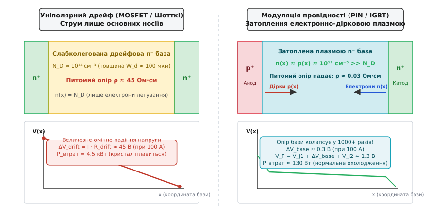
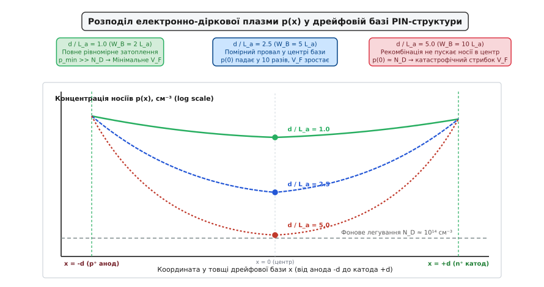
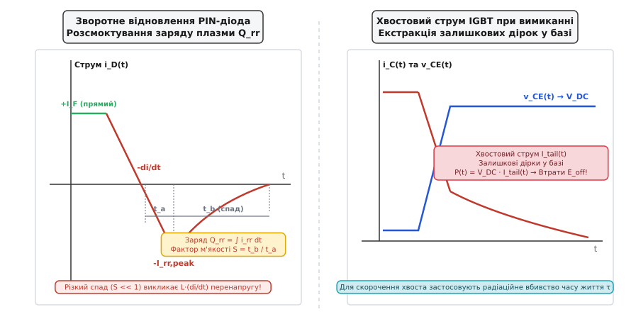
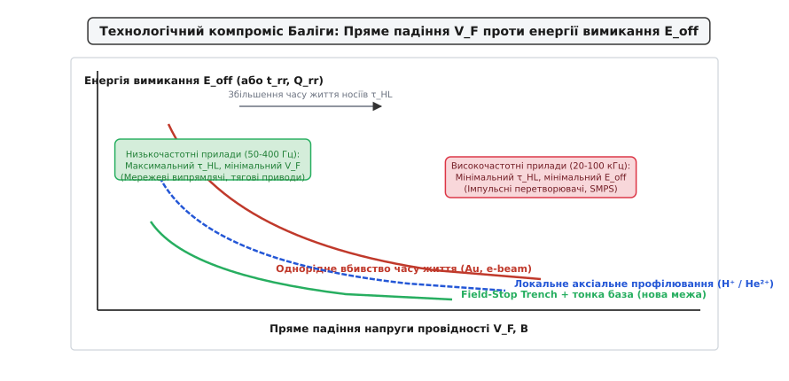

# Модуляція провідності у силових приладах

<preknowlist>
- [Напівпровідник](root:ph-condensed/semiconductor) — носії заряду, власна та домішкова концентрації, рекомбінація.
- [ВАХ діода](root:hw-components/diode-iv-curve) — пряме зміщення, контактна різниця потенціалів, експоненційний струм.
- [Питомий опір Ron·A та обмеження матеріалу](root:hw-components/specific-on-resistance-metric) — компроміс між пробивною напругою та омічним опором дрейфової зони.
- [Втрати перемикання в силових ключах](root:hw-components/switching-losses) — динамічні процеси, енергія вимикання та спад струму.
</preknowlist>

Коли силова схема керує тяговим електродвигуном поїзда або інвертором сонячної електростанції з напругою шини 1200 В і струмом 100 А, напівпровідниковий ключ мусить витримувати повну напругу в закритому стані та проводити струм із мінімальним падінням напруги у відкритому стані. Якщо спробувати виготовити такий перемикач як звичайний кремнієвий польовий транзистор або діод Шотткі, товща кремнію, необхідна для блокування 1200 В, створить омічний опір близько 0.45 Ом. При струмі 100 А на цьому внутрішньому опорі впаде 45 В, що викличе виділення 4.5 кВт тепла на кристалі площею всього в один квадратний сантиметр — і напівпровідник миттєво випарується. 

Єдиною фізичною причиною, чому високовольтна кремнієва електроніка взагалі існує і працює з ККД понад 98%, є явище **модуляції провідності**: катастрофічне падіння електричного опору слабколегованого напівпровідника під час його примусового затоплення щільною електронно-дірковою плазмою.

## Парадокс високовольтного кремнію та криза уніполярного дрейфу

Щоб зрозуміти, чому виникає потреба в модуляції провідності, необхідно простежити електростатику високовольтної напівпровідникової структури в закритому стані.

Коли до p-n переходу прикладено зворотну блокуючу напругу `V_B`, вона утримується областю просторового заряду (збідненим шаром). Напруженість електричного поля `E(x)` спадає від металургійної межі вглиб напівпровідника з нахилом, пропорційним концентрації фонового легування: `dE/dx = q · N_D / ε_s`. Якщо напруженість поля в будь-якій точці сягне критичного значення лавинної іонізації (`E_c ≈ 2.5 · 10⁵ В/см` для кремнію), розпочнеться неконтрольований лавинний пробій.

Звідси випливають дві взаємопов'язані геометричні та матеріальні вимоги до дрейфової зони:
1. **Концентрація домішки `N_D` мусить бути надзвичайно низькою:** щоб електричне поле спадало повільно і не перевищувало `E_c`, фонове легування зменшують пропорційно напрузі пробою: `N_D ∝ 1 / V_B`. Для приладу на 1200 В типова концентрація донорів становить лише `N_D ≈ 10¹⁴ см⁻³` (усього один атом фосфору на 500 мільйонів атомів кремнію).
2. **Товщина дрейфової зони `W_d` мусить бути великою:** інтеграл від електричного поля по товщині бази дорівнює прикладеній напрузі (`V_B = (1/2) · E_c · W_d`). Для блокування 1200 В товщина бази має становити не менше `W_d ≈ 100 мкм`.

В уніполярних приладах — таких як стандартний кремнієвий MOSFET чи діод Шотткі — струм переноситься виключно основними носіями заряду (електронами в n-області), концентрація яких строго фіксована рівнем фонового легування: `n = N_D`.

Питомий електричний опір `ρ` такого матеріалу за законом Ома становить:

```
ρ = 1 / (q · μ_n · N_D)
```

де `q = 1.602 · 10⁻¹⁹ Кл` — елементарний заряд, а `μ_n ≈ 1350 см²/(В·с)` — рухливість електронів у кремнії.

Підставивши концентрацію `N_D = 10¹⁴ см⁻³`, отримуємо питомий опір `ρ ≈ 46.3 Ом·см`. Загальний омічний опір дрейфового шару товщиною `100 мкм` (`0.01 см`) для кристала робочою площею `A = 1 см²` дорівнює:

```
R_drift = ρ · W_d / A = 46.3 · 0.01 / 1 = 0.463 Ом
```

Якщо крізь цей кристал пропустити струм `I = 100 А`, падіння напруги на омічному опорі бази складе:

```
ΔV_drift = I · R_drift = 100 · 0.463 = 46.3 В
```

Потужність статичних втрат, яка виділяється у формі тепла:

```
P_loss = I² · R_drift = 100² · 0.463 = 4630 Вт = 4.63 кВт
```

Жодна система рідинного чи повітряного охолодження не здатна відвести 4.6 кВт тепла з площі в один квадратний сантиметр: температура кристала за мікросекунди перевищить температуру плавлення кремнію (`1414 °C`).

Це явище описується одновимірною границею Баліги для питомого опору відкритого стану: `R_on,sp ∝ V_B^(2.5)`. Для напруг вище 300–500 В опір кремнієвих уніполярних ключів зростає настільки стрімко, що їх застосування в силовій енергетиці стає фізично неможливим без зміни механізму провідності, як детально розглянуто в статті про [питомий опір Ron·A та обмеження матеріалу](root:hw-components/specific-on-resistance-metric).

## Механізм інжекції високого рівня та затоплення бази плазмою

Вихід із глухого кута полягає в переході від уніполярного перенесення заряду до біполярного. Якщо обмежити ту саму слабколеговану дрейфову `n⁻`-базу сильнолегованими областями протилежних типів провідності — анодом `p⁺` з одного боку та катодом `n⁺` з іншого (структура `p⁺-n⁻-n⁺`, або PIN-діод) — фізична картина провідності змінюється докорінно.


*Порівняння уніполярного опору слабколегованої дрейфової зони (ліворуч) та катастрофічного колапсу її опору під час затоплення електронно-дірковою плазмою (праворуч)*

Коли до структури прикладається пряма напруга, контактні потенційні бар'єри на переходах знижуються:
1. Анодний перехід `p⁺-n⁻` починає масивно інжектувати (лат. *injectio* — впорскування) дірки в слабколеговану базу.
2. Катодний контакт `n⁻-n⁺` (або відкритий МОН-канал в IGBT) інжектує назустріч діркам зустрічний потік електронів.

Якщо прямий струм невеликий, концентрація введених носіїв менша за фонову концентрацію домішок (`Δp << N_D`). Цей режим називається інжекцією низького рівня (Low-Level Injection, LLI). У ньому поведінка матеріалу майже не відрізняється від класичного закону Ома.

Проте за робочих густин силового струму (`J = 100 – 300 А/см²`) концентрація введених носіїв досягає `10¹⁶ – 10¹⁷ см⁻³`. Це режим **інжекції високого рівня (High-Level Injection, HLI)**: концентрація інжектованих неосновних носіїв перевищує фонову концентрацію легування на 2–4 порядки:

```
p(x) >> N_D
```

У напівпровіднику не може виникнути відокремленого просторового заряду дірок, оскільки закон електростатики (рівняння Пуассона `dE/dx = q·(p - n + N_D)/ε_s`) миттєво породжує колосальне відновлювальне електричне поле. Щоб скомпенсувати позитивний заряд інжектованих дірок, катод постачає точно таку ж кількість електронів.

У товщі бази виникає стан динамічної **квазінейтральності** (лат. *quasi* — майже, *neuter* — ні той, ні інший):

```
n(x) ≈ p(x)
```

Слабколегована дрейфова зона повністю затоплюється щільною, нейтральною **електронно-дірковою плазмою**, концентрація якої становить сотні мільярдів носіїв на кубічний мікрометр.

Питома електропровідність `σ(x)` матеріалу тепер визначається не фоновими донорами `N_D`, а концентрацією плазми:

```
σ(x) = q · (μ_n · n(x) + μ_p · p(x)) ≈ q · (μ_n + μ_p) · p(x)
```

При концентрації плазми `p(x) ≈ 3 · 10¹⁶ см⁻³` питомий опір кремнію падає від початкових `46.3 Ом·см` до:

```
ρ_plasma = 1 / (1.602 · 10⁻¹⁹ · (1350 + 450) · 3 · 10¹⁶) ≈ 0.115 Ом·см
```

Опір 100-мікрометрової бази зменшується з `0.463 Ом` до `0.00115 Ом` — тобто у **400 разів**! 

Падіння напруги на самій товщі бази при струмі 100 А тепер становить не 46.3 В, а лише `ΔV_base = 100 · 0.00115 ≈ 0.115 В`. Повне пряме падіння напруги на силовому приладі `V_F` складається з падінь на внутрішніх контактних переходах (~0.7–0.9 В) та мізерного падіння на промодульованій базі (~0.1–0.3 В), сумарно становлячи лише `V_F ≈ 1.0 – 1.3 В`. Розсіювана потужність падає з 4.6 кВт до цілком прийнятних 120 Вт, які легко відводяться стандартним алюмінієвим радіатором.

Це колосальне перетворення опору під дією власного струму отримало назву **модуляції провідності** (лат. *modulatio* — зміна за певним законом). Історію відкриття цього ефекту та створення перших PIN-випрямлячів детально описано у вставці про [історичний розвиток PIN-випрямлячів Робертом Голлом](root:hw-components/conductivity-modulation/hist-hall-pin-rectifier.md).

## Динаміка прямого відновлення та часова затримка плазми

Модуляція провідності не виникає миттєво при поданні прямого струму. Щоб затопити нейтральну базу електронно-дірковою плазмою, носіям заряду потрібен скінченний час для дифузійного прольоту крізь товщу кристала.

Якщо силове коло вмикає струм із надзвичайно високою швидкістю наростання `di/dt` (наприклад, `500 – 2000 А/мкс` у швидких імпульсних перетворювачах), струм уже сягає десятків ампер у момент, коли плазма ще сконцентрована у вузьких приконтактних зонах біля емітерів, а центральна частина дрейфової бази все ще залишається високоомним резистором.

У результаті на приладі спостерігається короткочасний сплеск напруги тривалістю від 50 до 300 нс, амплітуда якого може сягати 20–80 В. Цей динамічний сплеск називається **напругою прямого відновлення (Forward Recovery Voltage, V_FRM)**. 

Фізичний механізм прямого відновлення складається з двох послідовних стадій:
1. **Омічно-індуктивна стадія:** Струм тече крізь незмодульовану базу з високим опором `R_drift(0)`, породжуючи падіння напруги `V = I(t) · R_drift + L_pkg · (di/dt)`.
2. **Стадія плазмового затоплення:** Носії дифундують углиб бази, концентрація `p(x)` наростає, опір бази стрімко колапсує до міліомного рівня, і напруга на приладі релаксує до стаціонарного значення `V_F ≈ 1.2 – 1.5 В`.

Для інженера-розробника явище прямого відновлення є важливим фактором: якщо силовий діод працює в колі фіксації напруги (снабері), надмірно високе `V_FRM` призводить до того, що діод не встигає підхопити імпульс напруги, перевантажуючи захищуваний транзистор.

## Амбіполярний транспорт та просторовий профіль плазми

Оскільки в затопленій базі електрони й дірки рухаються разом, їхній перенос описується спеціальним кінетичним рівнянням — **амбіполярним рівнянням дифузії (Ambipolar Diffusion Equation, ADE)**.

У звичайних умовах електрони рухаються у кремнії швидше за дірки (`μ_n ≈ 3 · μ_p`). Під час інжекції електрони намагаються випередити дірки, що створює внутрішнє електричне поле поляризації (ефект Дембера). Це поле пригальмовує електрони й підтягує дірки, змушуючи обидва типи носіїв дифундувати з єдиним спільним **амбіполярним коефіцієнтом дифузії `D_a`**:

```
D_a = (2 · D_n · D_p) / (D_n + D_p)
```

Для кремнію за кімнатної температури `D_a ≈ 17.5 см²/с`.

Просторовий масштаб, на який плазма здатна проникнути вглиб кристала до того, як електрони й дірки рекомбінують (анігілюють), визначається **амбіполярною дифузійною довжиною `L_a`**:

```
L_a = √(D_a · τ_HL)
```

де `τ_HL` — час життя носіїв заряду за високого рівня інжекції.


*Розподіл концентрації електронно-діркової плазми вздовж дрейфової бази при різному ступені модуляції провідності d / L_a*

Розподіл густини плазми `p(x)` вздовж дрейфової бази довжиною `W_B = 2d` описується ланцюговою лінією (гіперболічним косинусом):

```
p(x) ∝ cosh(x / L_a)
```

Концентрація носіїв максимальна біля інжектуючих емітерів (`p⁺` та `n⁺`) і досягає мінімуму в центрі бази `x = 0`:

```
p_min = p(0) ≈ (J · L_a) / (2 · q · D_a · sinh(d / L_a))
```

Форма цього профілю та ефективність модуляції критично залежать від співвідношення між геометричною товщиною бази `W_B` та дифузійною довжиною `L_a`:

1. **Оптимальне затоплення (`W_B ≤ 2 · L_a`, або `d / L_a ≤ 1`):**
   Плазма повністю перекриває всю товщу кристала. Провал у центрі незначний, концентрація `p(0)` на порядки перевищує рівень легування `N_D`. База має мінімальний опір, а падіння напруги `V_F` досягає теоретичного мінімуму.
2. **Помірне виснаження (`W_B ≈ 4 – 5 · L_a`):**
   Концентрація плазми в центрі просідає у 10–20 разів порівняно з краями, проте залишається вищою за `N_D`. Пряме падіння напруги зростає помірно.
3. **Катастрофічний обрив модуляції (`W_B > 8 · L_a`, або `d / L_a > 4`):**
   Носії рекомбінують, не встигаючи додифундувати до середини бази. У центрі кристала утворюється зона, де концентрація плазми падає до фонового рівня `N_D`. Ця збіднена зона перетворюється на високоомну «пробку», і падіння напруги `V_F` вибухоподібно зростає за експоненційним законом `V_F ∝ exp(d / L_a)`.

Повне аналітичне виведення амбіполярного рівняння, інтегрування електричного поля та розрахунок розподілу потенціалу наведено у вставці про [математичну теорію амбіполярного переносу та розрахунок падіння напруги](root:hw-components/conductivity-modulation/math-ambipolar-transport.md).

## Ціна провідності: накопичений заряд плазми та динаміка вимикання

Модуляція провідності не дається задарма. Щоб утримувати опір бази на мікроскопічному рівні, в її об'ємі постійно підтримується колосальний **накопичений заряд плазми `Q_F`**:

```
Q_F = I_F · τ_HL
```

Для силового діода чи [IGBT](root:hw-components/igbt) на 100 А з типовим часом життя носіїв `τ_HL = 5 мкс` у кристалі накопичено `Q_F = 100 А · 5 · 10⁻⁶ с = 500 мкКл` надлишкових електронів і дірок.

Коли схема подає команду вимкнути прилад, щоб перевести його в стан блокування високої напруги, збіднений шар не може виникнути миттєво. Доки вільна плазма заповнює дрейфову зону, напівпровідник залишається провідником. Прилад не здатен витримати жодної напруги, доки весь накопичений заряд `Q_F` не буде повністю усунений.


*Динамічні процеси вимикання модульованих приладів: фази зворотного відновлення діода (ліворуч) та формування хвостового струму IGBT (праворуч)*

Усунення накопиченого заряду плазми відбувається двома шляхами:
- **Внутрішня рекомбінація:** електрони й дірки самостійно анігілюють у товщі кристала з характерним часом `τ_HL`.
- **Зовнішня екстракція струмом:** зовнішнє електричне коло прикладає зворотну напругу, висмоктуючи дірки через анод, а електрони — через катод.

### Зворотне відновлення силового діода (Reverse Recovery)

Під час вимикання силового PIN-діода або паразитного [body-діода](root:hw-components/body-diode) струм у колі спадає зі швидкістю `di/dt`, перетинає нуль і змінює напрямок на зворотний:

1. **Фаза розсмоктування `t_a`:** Зворотний струм досягає пікового значення `I_rr,peak`, витягуючи носії з прилеглих до переходів областей. Напруга на діоді залишається близькою до нуля, оскільки база все ще заповнена плазмою.
2. **Фаза спаду `t_b`:** Біля анодного переходу концентрація плазми падає до нуля, і там зароджується шар просторового заряду. Напруга на діоді стрімко наростає до напруги шини живлення `V_DC`, а зворотний струм спадає до нуля, доки залишки плазми остаточно не рекомбінують.

Площа під кривою зворотного струму є **зарядом зворотного відновлення `Q_rr`**. Добуток наростаючої напруги на зворотний струм породжує значні динамічні втрати енергії вимикання `E_rec`. 

У типовому напівмостовому перетворювачі цей зворотний струм діода нижнього плеча протікає крізь транзистор верхнього плеча, який саме вмикається. У результаті транзистор змушений комутувати подвійний струм `I_load + I_rr,peak` при повній напрузі шини, що багаторазово збільшує енергію вмикання `E_on` транзистора, створюючи критичний нагрів обох приладів.

Крім того, швидкий спад струму у фазі `t_b` взаємодіє з паразитною індуктивністю монтажу `L_stray`, створюючи індуктивний викид перенапруги `V_over = L_stray · (di/dt)`, здатний пробити напівпровідникові ключі інвертора.

### Хвостовий струм IGBT (Tail Current)

У транзисторі IGBT під час вимикання сигнал керування знімає потенціал із затвора, і вхідний МОН-канал перекривається практично миттєво (за 20–50 нс), перериваючи потік електронів. 

Проте в широкій `n⁻`-базі залишається ізольована хмара дірок, які більше не контролюються затвором. Ці дірки можуть зникнути лише двома шляхами: повільно рекомбінувати всередині бази або дрейфувати до колекторного переходу під дією високої напруги.

На осцилограмі вимикання IGBT спостерігається характерний двоступеневий спад струму:
1. Швидкий початковий спад струму колектора (на 60–80%) за рахунок закриття МОН-каналу;
2. Довгий, плавно затухаючий **хвостовий струм (Tail Current)** тривалістю від сотень наносекунд до кількох мікросекунд.

Упродовж усього часу існування хвостового струму напруга колектор-емітер `V_CE` вже дорівнює повній напрузі шини живлення (наприклад, 800 В). Миттєва потужність втрат `P(t) = V_DC · I_tail(t)` сягає десятків кіловатів, формуючи основну частку енергії вимикання `E_off`. За високої частоти комутації ці комутаційні втрати перегрівають транзистор сильніше, ніж прямий струм у відкритому стані.

## Технологічний компроміс Баліги та інженерія часу життя

Між статичними втратами провідності та динамічними втратами перемикання існує фундаментальне фізичне протиріччя, відоме як **компроміс Баліги (Trade-off Curve)**:

```
P_total = P_cond + P_sw = (I_RMS² · R_on + V_F · I_avg) + (E_on + E_off) · f_sw
```

- Якщо збільшувати час життя носіїв `τ_HL`, густина плазми зростає: опір бази падає, пряме падіння `V_F` мінімізується, а статичні втрати провідності `P_cond` знижуються. Але одночасно зростає накопичений заряд `Q_F`, подовжується хвостовий струм і різко зростають динамічні втрати перемикання `E_off`.
- Якщо штучно зменшувати час життя `τ_HL`, накопичений заряд `Q_F` та хвостовий струм зникають: транзистор вимикається за десятки наносекунд, втрати `E_off` падають, що дозволяє підняти робочу частоту комутації `f_sw`. Проте дрейфова база недозатоплюється плазмою: її опір зростає, падіння напруги `V_F` збільшується, що веде до зростання статичних втрат тепла.


*Технологічні криві компромісу між прямим падінням напруги V_F та втратами енергії вимикання E_off при різних методах керування часом життя*

Для оптимізації кристалів під конкретні застосування виробники застосовують спеціальні технології **інженерії часу життя**:
1. **Дифузія важких металів (Золото Au, Платина Pt):** Атоми металів створюють глибокі енергетичні рівні в забороненій зоні, які працюють як пастки рекомбінації SRH. Платина є більш стабільною, оскільки забезпечує значно менший зворотний струм витоку при високих температурах (`150 °C`), ніж золото.
2. **Опромінення швидкими електронами (e-beam):** Потік електронів з енергією 2–10 МеВ вибиває атоми кремнію з вузлів ґратки, створюючи точкові радіаційні дефекти (дивакансії `V-V` та комплекси кисень-вакансія `A-центри`). Цей процес проводиться за кімнатної температури на готових пластинах і дозволяє дозувати час життя з точністю до 1%.
3. **Локальне іонне опромінення (Протони H⁺, ядра гелію He²⁺):** Використовує ефект піка Брегга. Заряджені іони пронизують кристал без значних пошкоджень, але наприкінці пробігу на строго заданій глибині створюють вузький локалізований шар рекомбінаційних центрів товщиною 2–5 мкм.

Аксіальне профілювання дозволяє вбити час життя виключно біля інжектуючого анода (ліквідуючи хвостовий струм та забезпечуючи м'яке вимикання), зберігаючи високий час життя в основному об'ємі дрейфової бази для збереження наднизького `V_F`. Повний технологічний огляд цих методів викладено у вставці про [технології радіаційного та домішкового профілювання часу життя](root:hw-components/conductivity-modulation/comp-lifetime-engineering.md).

## Еволюція кремнієвих структур: Punch-Through, Non-Punch-Through та Field-Stop

Окрім радіаційного скорочення часу життя, найефективнішим способом зменшення накопиченого заряду `Q_F` є зменшення фізичного об'єму кремнію, в якому зберігається плазма — тобто зменшення геометричної товщини дрейфової бази `W_B`.

Еволюція кремнієвих IGBT та високовольтних діодів пройшла три головні покоління:

```
1. NPT (Non-Punch-Through):
   [ p⁺ Колектор ] ── [ Товста n⁻ дрейфова база (200-250 мкм) ] ── [ p-тіло / МОН-затвор ]
   Трикутний профіль поля. Величезний об'єм плазми, високі E_off, високий V_F.

2. PT (Punch-Through):
   [ p⁺ Підкладка ] ── [ n⁺ Буферний шар ] ── [ n⁻ Дрейфова база (140-160 мкм) ] ── [ МОН-затвор ]
   Трапецієподібне поле. База тонша, але товста p⁺ підкладка інжектує забагато дірок.

3. Field-Stop / Trench (Тонкоплівковий):
   [ Тонкий p⁺ шар ] ── [ Тонкий n-FS буфер ] ── [ Ультратонка n⁻ база (70-100 мкм) ] ── [ Trench-затвор ]
   Мінімальний об'єм плазми! Низький V_F + швидке вимикання без надмірного радіаційного опромінення.
```

1. **Non-Punch-Through (NPT):** Кристал виготовляється на товстій пластині високоомного кремнію (200–250 мкм для 1200 В), щоб електричне поле зворотного зміщення трикутної форми повністю згасало всередині бази, не доходячи до колектора. Через велику товщину об'єм плазми колосальний, що вимагало жорсткого опромінення для зниження `E_off`.
2. **Punch-Through (PT):** Між слабколегованою `n⁻`-базою та `p⁺`-підкладкою вирощується епітаксійний сильнолегований `n⁺`-буферний шар. Буфер різко обриває електричне поле, надаючи йому прямокутної форми. Це дозволило зменшити товщину дрейфової зони до 140–160 мкм, суттєво зменшивши накопичений заряд.
3. **Field-Stop Trench (FS-IGBT):** Сучасний стандарт кремнієвої технології. Пластину кремнію методом прецизійного хіміко-механічного шліфування стоншують до екстремальних 70–100 мкм (для 1200 В) або 120–140 мкм (для 3300 В). На зворотний бік ультратонкої пластини іонною імплантацією наносять надтонкий шар польового обмеження (Field Stop) та слабкоінжектуючий прозорий емітер `p⁺`. 

Завдяки зменшенню товщини кристала у 2.5 раза об'ємний заряд плазми `Q_F` пропорційно зменшується. Це дозволило створити IGBT 7-го покоління, які поєднують рекордно низьке пряме падіння `V_CE(sat) ≈ 1.35 В` із низькою енергією вимикання `E_off` без потреби екстремального радіаційного зниження часу життя.

## Посилення інжекції канавковим затвором: CSTBT та ефект накопичення носіїв

У класичних планарних структурах IGBT емітерний p-n перехід розташований на верхній поверхні кристала між комірками затвора. Дірки, що рухаються від анода, безперешкодно стікають у p-тіло емітера, через що концентрація плазми біля верхньої поверхні кристала виявляється помітно нижчою, ніж біля колектора.

Щоб усунути цей перекіс, у сучасних приладах застосовують технологію **канавкового затвора з накопиченням носіїв (Carrier Stored Trench-Gate Bipolar Transistor, CSTBT)**:

Вертикальні канавки затвора (Trench) протравлюються вглиб кремнію на 3–5 мкм. Між канавками формується вузький кремнієвий стовпчик (меза), під яким створюється тонкий бар'єрний шар n-типу (CS-шар — Carrier Stored layer). 

Цей бар'єр виконує роль гідродинамічної греблі для дірок:
- Потік дірок, що піднімається знизу від колектора, натикається на потенційний бар'єр CS-шару і не може вільно вийти в емітер.
- Дірки змушені накопичуватися у верхній частині дрейфової бази, підтягуючи за собою електрони для збереження квазінейтральності.

У результаті профіль концентрації плазми біля поверхні катода підскакує в 3–5 разів, стаючи практично плоским і симетричним, як у класичному PIN-діоді. Це забезпечує додаткове зниження прямого падіння напруги `V_CE(sat)` на `0.25 – 0.35 В` без погіршення динаміки вимикання, оскільки об'єм дрейфової бази залишається ультратонким.

## Альтернатива без плазми: Суперперехідні структури (Superjunction / CoolMOS)

У діапазоні середніх напруг (500–900 В) інженери знайшли спосіб обійти одномірну границю Баліги для уніполярних MOSFET без переходу до біполярної інжекції плазми. Ця технологія отримала назву **суперпереходу (Superjunction, SJ)**.

Замість однорідної слабколегованої n-бази в товщі кристала створюють чергування тонких вертикальних стовпчиків p-типу та n-типу. Завдяки взаємній компенсації зарядів донорів та акцепторів при прикладенні зворотної напруги електричне поле поширюється горизонтально між стовпчиками, миттєво збіднюючи всю структуру. 

Це дозволило підвищити рівень легування n-провідних каналів у 10 разів:
- Опір відкритого каналу суперперехідного MOSFET зменшився в 5–10 разів порівняно зі звичайним планарним MOSFET тієї ж напруги;
- Прилад залишається суто уніполярним: струм переноситься лише електронами, накопичення плазми відсутнє, а час вимикання становить лічені наносекунди.

Проте за напруг понад 1000 В технологічна складність формування глибоких вертикальних стовпчиків із прецизійним балансом зарядів робить суперперехідні структури економічно невигідними, поступаючись місцем біполярним IGBT та карбідокремнієвим транзисторам.

## Революція широкозонних напівпровідників: SiC та GaN

Фундаментальне обмеження кремнію полягає в його відносно вузькій забороненій зоні (`1.12 еВ`) та низькій критичній напруженості електричного поля пробою (`E_c ≈ 0.25 МВ/см`), що змушує робити дрейфову зону товстою і вдаватися до біполярної модуляції провідності з усіма її плазмовими штрафами.

Поява широкозонних напівпровідників — карбіду кремнію (4H-SiC, `E_g = 3.26 еВ`, `E_c ≈ 2.8 МВ/см`) та нітриду галію (GaN, `E_g = 3.4 еВ`, `E_c ≈ 3.3 МВ/см`) — спричинила переворот у силовій електроніці.

Оскільки критичне поле лавинного пробою в карбіді кремнію в **10 разів вище**, ніж у кремнію:
- Товщина дрейфової зони `W_d` для однакової блокуючої напруги може бути зменшена в **10 разів**;
- Концентрація фонового легування `N_D` може бути збільшена у **100 разів**;
- Опір уніполярної дрейфової зони зменшується у **1000 разів** порівняно з кремнієм!

Завдяки цьому [SiC-MOSFET в силовій електроніці](root:hw-components/sic-mosfet-power) та діоди Шотткі на базі SiC у діапазоні напруг 650 В, 1200 В, 1700 В і навіть 3300 В забезпечують наднизький питомий опір `R_DS(on)` **без жодної модуляції провідності**.

Працюючи виключно як уніполярні прилади на основних носіях (електронах), SiC-транзистори та діоди повністю позбавлені накопиченого заряду плазми `Q_rr` та хвостових струмів `I_tail`. Це дозволяє збільшити частоту комутації інверторів із типових для кремнієвих IGBT 5–15 кГц до 50–200 кГц, радикально зменшуючи габарити й масу індуктивних та ємнісних компонентів перетворювача.

Модуляція провідності в епоху карбіду кремнію відступає в область екстремальних напруг (понад 6.5–15 кВ), де застосовуються біполярні SiC-тиристори та SiC-IGBT, тоді як у масовому сегменті до 1700 В уніполярні широкозонні прилади витісняють біполярні кремнієві структури.

> 🔧 **Навіщо це.**
> Розуміння фізики модуляції провідності є критичним при проектуванні силових перетворювачів:
> 1. **Вибір частоти комутації:** Кремнієвий IGBT або швидкий PIN-діод не можна бездумно розганяти за частотою. Завжди слід обчислювати точку перетину втрат: на низьких частотах (до 8–16 кГц) модульований кремнієвий прилад перевершує за ККД будь-який уніполярний кремнієвий ключ завдяки мінімальному `V_F`. На високих частотах комутаційні втрати плазми `E_off` стають домінуючими, вимагаючи переходу на SiC-MOSFET або застосування резонансних топологій м'якої комутації (ZVS/ZCS).
> 2. **Паралельне з'єднання кристалів:** Завдяки модуляції провідності та електрон-дірковому розсіюванню на номінальних робочих струмах пряме падіння `V_CE(sat)` сучасних IGBT має строго додатний температурний коефіцієнт (`dV_F/dT > 0`). Це гарантує стабільний розподіл струму між паралельними чіпами всередині силового модуля без ризику теплової втечі.
> 3. **Захист від десатурації (Desat):** Якщо під час короткого замикання в навантаженні струм через кристал перевищує номінальний у 4–6 разів, механізм модуляції провідності виснажується (настає Оже-рекомбінація та деградація рухливості), і напруга на ключі різко підскакує з 1.5 В до 10–30 В. Драйвер затвора фіксує цей стрибок напруги на відкритому транзисторі (десатурацію) і плавно глушить аварійний струм за 2–5 мкс до фізичного перегріву кристала.

## Інженерний синтез

Модуляція провідності — це фізичний механізм, який дозволив напівпровідниковій електроніці подолати кіловольтний бар'єр. Завдяки інжекції високого рівня та утворенню квазінейтральної електронно-діркової плазми товстий високовольтний напівпровідник із власним питомим опором у десятки Ом·см перетворюється на високопровідне середовище з падінням напруги в частки вольта. 

Ціною цієї провідності є накопичений заряд плазми `Q_F`, який перетворює кожен цикл вимикання на динамічну боротьбу з рекомбінацією, зворотним відновленням та хвостовими струмами. Уся історія розвитку силових напівпровідників — від германієвих діодів Голла й [тиристорів](root:hw-components/thyristor-scr) та [GTO-тиристорів](root:hw-components/gto-thyristor) до сучасних Field-Stop Trench IGBT та карбідокремнієвих приладів — була і залишається історією майстерного інженерного управління просторовим розподілом та часом життя цієї електронно-діркової плазми.
