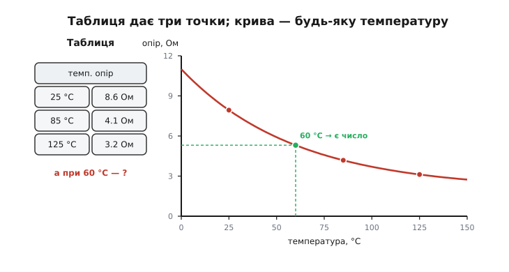
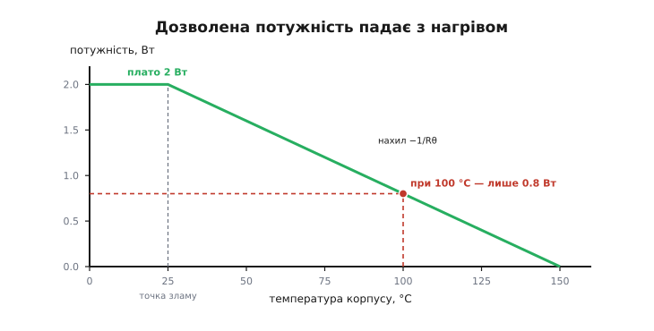
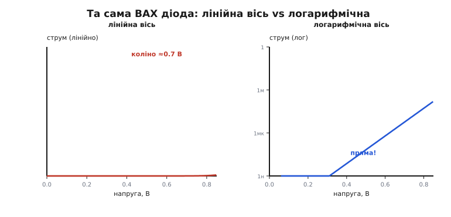
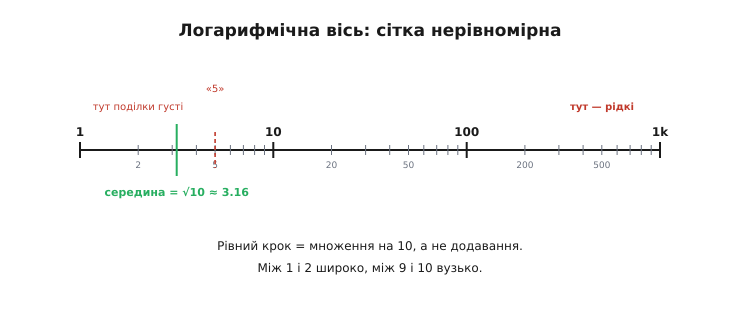
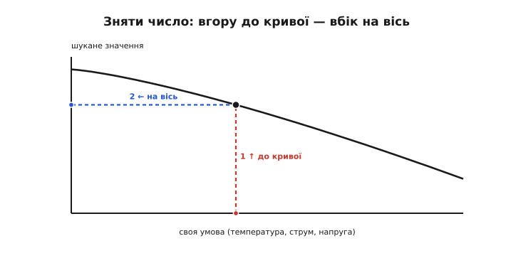
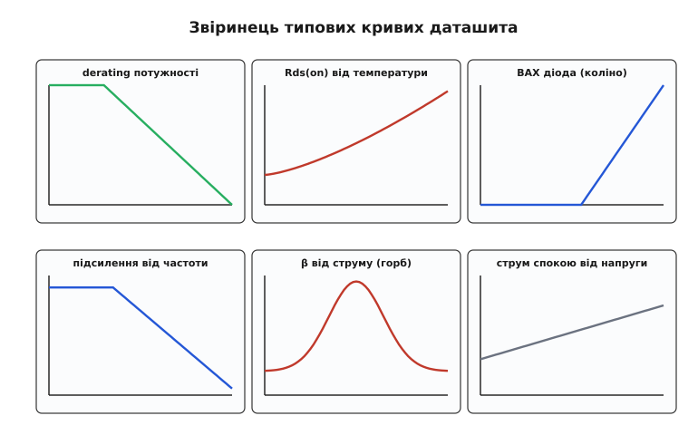

# Графіки даташита

Таблиця в даташиті дає параметр лише для **кількох** заздалегідь обраних умов, і в цьому її межа. А що, як ваша температура — 60 °C, а в таблиці є рядки тільки для 25 і 85? Що, як струм навантаження не той, що в колонці? Тут на поміч приходить інший спосіб подати дані — **графік**. Розділ даташита **Typical Performance Characteristics** *(англ. «типові робочі характеристики»)* складається з десятків кривих, і кожна показує, як параметр **неперервно** пливе зі зміною умов. Уміти їх читати — це діставати з даташита числа там, де таблиця мовчить.

### Чому графік, а не таблиця

Таблиця дає **дискретні** точки: тут і тут, а між ними — порожньо. Графік натомість малює всю залежність суцільною лінією, тож значення можна зняти для **будь-якої** точки в діапазоні.


*Таблиця дає опір лише для трьох температур; скільки буде при 60 °C — невідомо. Крива малює всю залежність, тож значення читається для будь-якої температури в діапазоні. Графік — це таблиця з нескінченною кількістю рядків.*

Є й друга, тонша користь. Сама **форма** кривої миттєво розповідає про характер приладу — те, чого з кількох чисел не видно. Полога лінія каже «параметр майже не залежить від цієї умови»; крута — «залежить сильно, пильнуй»; горб посередині — «є оптимум, і обабіч від нього гірше». Інженер, кинувши оком на форму, відразу розуміє, чого чекати, ще навіть не знявши конкретного числа. Тому графіки — не «картинки для краси»: вони повноцінне джерело даних, а часто й найзручніше.

Ці криві — теж **типові** *(typ)*, як і [колонка «typ» у таблиці](topic:hw-components/min-typ-max): вони показують поведінку **середнього** приладу, а не гарантовану межу. Для прикидки «як воно поводитиметься» цього досить; але якщо параметр критичний, гарантію беруть із таблиці (min/max), а графік слугує для розуміння **тенденції** — куди й наскільки сильно число посунеться.

### Derating: межа, що тане з нагрівом

Найважливіший клас графіків — **derating-криві** *(англ. derating, «зниження номіналу»)*. Вони відповідають на питання, що його лишає відкритим [абсолютний максимум потужності](topic:hw-components/abs-max-ratings): цей максимум дано при 25 °C, а що в спеку? Потужність, яку прилад здатен розсіяти, **падає** з нагрівом.


*Дозволена потужність: до «точки зламу» — плато (повні 2 Вт), далі лінія спадає до нуля при граничній температурі кристала. При 100 °C прилад тягне вже не 2 Вт, а лише 0.8. «Паспортна» потужність дійсна тільки на холоді.*

Логіка кривої проста й випливає з [теплового опору](topic:ph-thermodynamics/thermal-resistance). Прилад гине, коли температура кристала (Tj) сягає межі — скажімо, 150 °C. Тепло від кристала тече назовні крізь тепловий опір, і чим гарячіше довкілля, тим менше «місця» лишається для власного розігріву. Звідси форма: до **точки зламу** прилад може розсіювати повну паспортну потужність (плато), а далі дозволена потужність спадає **по прямій** до нуля — рівно там, де температура корпусу дорівнює граничній Tj. Нахил цієї прямої — це обернений тепловий опір (−1/Rθ).

Практичний висновок різкий: гучна цифра «2 Вт» на першій сторінці — це потужність **на холоді**, біля 25 °C. У реальному теплому корпусі, де довкола ще й інші гарячі компоненти, дозволена потужність може впасти вдвічі-втричі. Тому, проєктуючи щось, що гріється, не вірять числу з вітрини: ідуть на derating-криву, знаходять **свою** робочу температуру й знімають дозволену потужність саме для неї.

> 🔧 **Навіщо це.** Derating-крива — чесне продовження абсолютного максимуму потужності: вона каже, **наскільки менше** прилад можна навантажувати в реальній спеці. Без неї легко взяти «2 Вт» за вічну істину, навантажити прилад на 1.5 Вт у гарячому корпусі — і дивуватися, чому він деградує, хоча «до межі ще далеко». Для всього, що гріється (стабілізатори, силові ключі, потужні резистори), derating дивляться **завжди**.

**Читання derating-кривої.** Резистор має паспортну потужність 2 Вт (при 25 °C) і точку зламу теж 25 °C, далі спад до нуля при 150 °C. Скільки він витримає при температурі довкілля 100 °C?

```
лінійний спад від 2 Вт (при 25 °C) до 0 Вт (при 150 °C)
діапазон спаду     = 150 − 25  = 125 °C
наша точка вище зламу на        = 100 − 25 = 75 °C
частка діапазону, що «з'їдена»  = 75 / 125 = 0.60
дозволена потужність = 2 Вт · (1 − 0.60) = 0.80 Вт
```

При 100 °C цей «двоватний» резистор можна навантажувати лише на 0.8 Вт. Поставите на нього 1.5 Вт — і він перегріється, хоча на холодному столі чесно тримав свої 2 Вт.

### ВАХ: коліно діода й логарифмічна вісь

Другий важливий графік — **вольт-амперна характеристика** *(англ. I–V curve, ВАХ)*: як струм залежить від напруги. Для діода вона особлива, бо різко **нелінійна** — і саме на ній уперше зустрічається підступ логарифмічних осей.


*Та сама ВАХ діода. На лінійній осі струму — різке «коліно» біля 0.7 В: до нього струму майже нема, за ним він злітає. На логарифмічній осі той самий струм лягає в пряму лінію — так видно експоненційну природу й крихітні струми, яких на лінійній осі не розгледіти.*

На лінійній осі ВАХ діода виглядає як характерне [«коліно» діода](topic:hw-components/diode-iv-curve): доки напруга мала, струму практично нема, а після ~0.7 В він стрімко злітає. Та лінійна вісь ховає важливе: до коліна струм не нульовий, він просто **дуже малий** (нано- й мікроампери), і на лінійній шкалі його не видно. Тому виробники часто малюють струм у **логарифмічному** масштабі — і тоді експонента діода стає **прямою лінією**, а крихітні струми витоку проступають так само чітко, як великі робочі.

Звідси загальна навичка: даташити рясніють логарифмічними осями (струми, опори, частоти охоплюють діапазони в тисячі й мільйони разів, і лінійна вісь їх просто не вмістила б). А логарифмічну вісь украй легко **прочитати хибно**.

### Як не обманутися логарифмічною віссю

Головна пастка логарифмічної осі — її **нерівномірна** сітка. На звичайній (лінійній) осі однакова відстань означає однакову **різницю**; на логарифмічній — однакове **множення**.


*На лог-осі рівні кроки — це ×10 (декади): 1 → 10 → 100. Поділки між ними згущуються: між 1 і 2 широко, між 9 і 10 вузько. Середина відрізка між «1» і «10» — це не 5, а ≈3.16 (√10). Читати таку вісь, як лінійну, — помилитися в рази.*

Звідси правило читання. По-перше, **великі поділки** на лог-осі — це степені десятки (декади): 1, 10, 100, 1000. По-друге, **дрібні поділки** всередині декади нерівномірні: вони густі на початку (між 1 і 2 широко) і тісні в кінці (між 9 і 10 вузько). По-третє, і це найважливіше: **середина** між двома сусідніми декадами — **не** середнє арифметичне. Посередині між «1» і «10» лежить не 5, а √10 ≈ 3.16. Хто цього не знає й читає лог-вісь на око, як лінійну, той легко промахується в два-три рази — а в розробці це часто фатально.

На лог-осі краще не «прикидати на око», а спиратися на підписані поділки й рахувати декади. Якщо точка лежить трохи вище за лінію «10», це може бути і 12, і 15 — придивіться до дрібної сітки, а не вгадуйте.

### Як зняти число з кривої

Механіка читання будь-якого графіка зводиться до простого ритуалу з трьох рухів.


*Від своєї умови на горизонтальній осі ведемо вертикаль угору до перетину з кривою, тоді від цієї точки — горизонталь убік до вертикальної осі й читаємо значення. Знайшов умову, тоді два рухи: вгору до кривої, вбік на вісь.*

Отже: **перше** — знайти на горизонтальній осі **свою** умову (температуру, струм, напругу). **Друге** — провести від неї вертикаль угору до перетину з потрібною кривою (а їх на графіку часто кілька — для різних напруг чи температур; беріть ту, що підписана під ваш випадок). **Третє** — від точки перетину провести горизонталь убік, до вертикальної осі, і там прочитати значення. І щоразу перед зчитуванням кидайте погляд на **тип осі**: лінійна вона чи логарифмічна, бо від цього залежить, як трактувати поділки.

Дрібна, але корисна звичка — звертати увагу на **умови всього графіка**, написані дрібним шрифтом біля заголовка кривої («при Vcc = 5 В», «крива для типового приладу»). Графік, як і число в таблиці, дійсний лише за тих умов, за яких його зняли.

### Звіринець типових кривих

Кілька характерних форм повторюються з даташита в даташит, і їх варто впізнавати. Тоді, відкривши незнайому криву, ви відразу вловлюєте, про що вона.


*Шість типових кривих: derating потужності (плато, тоді спад); опір Rds(on), що росте у спеку; експоненційна ВАХ із коліном; підсилення, що завалюється з частотою; коефіцієнт β з горбом посередині діапазону струмів; струм спокою, що повільно росте з напругою. Форма кривої — це вже половина відповіді.*

Найчастіші мешканці цього звіринця: **derating** (плато й спадна пряма — скільки потужності дозволено); **[Rds(on)](topic:hw-components/rds-on) від температури** (зростає у спеку — гарячий ключ «твердіший»); **ВАХ** (коліно діода чи вихідні криві транзистора); **підсилення від частоти** (падає з нахилом, як на [діаграмі Боде](topic:hw-analog/bode-plot)); **коефіцієнт підсилення від струму** (часто з горбом: є оптимальний струм, а обабіч гірше); **струм спокою від напруги чи температури**. Упізнавши форму, ви наполовину вже зрозуміли криву — лишається зняти конкретне число.

### Температурні залежності: чому майже все «пливе»

Окремий великий клас кривих — **температурні залежності**, бо температура зачіпає чи не кожен параметр приладу. Причина в тому, що в основі електроніки лежить фізика напівпровідника, а вона сильно залежна від тепла: рухливість носіїв падає з нагрівом, [пряме падіння переходу](topic:hw-components/diode-iv-curve) зменшується (−2 мВ/°C), струми витоку зростають. Звідси й безліч кривих «параметр від температури» в кожному серйозному даташиті.

Кілька типових прикладів і їхній напрям. Опір відкритого ключа Rds(on) **росте** у спеку (приблизно вдвічі від 25 до 125 °C) — гарячий MOSFET провідний гірше. Пряме падіння діода VF **спадає** з температурою. Струм витоку й вхідний струм підсилювача **зростають** із нагрівом (часто подвоюються кожні ~10 °C). Зсув і дрейф підсилювача мають власну криву температурного дрейфу. Звідси правило: якщо ваш прилад працюватиме не за кімнатних 25 °C — а надворі, у корпусі, поряд із гарячими сусідами це майже завжди так, — параметр беруть **не** за кімнатне число з таблиці, а з температурної кривої для **своєї** температури.

Тут наочно видно підступ [числа в таблиці](topic:hw-components/min-typ-max): воно часто дане для 25 °C, а температурна крива показує, як далеко воно «попливе» у вашій реальній спеці. Дивитися лише на кімнатне число — означає проєктувати для столу, а не для поля. І, як завжди з кривими, ці залежності **типові**: для критичного параметра гарантований найгірший випадок дивляться окремо, а крива дає розуміння **тенденції** й величини зсуву.

> 🔧 **Навіщо це.** Графіки даташита — це дані для умов, яких нема в таблиці, і вони незамінні там, де параметр сильно «пливе». Тримайте в голові три речі. **Перше:** derating-крива каже, наскільки слабше навантажувати прилад у спеку — для всього, що гріється, це обов'язкова перевірка. **Друге:** логарифмічну вісь читають обережно — рівний крок це ×10, а середина між декадами це √10, не половина. **Третє:** число знімають ритуалом «вгору до кривої — вбік на вісь», щоразу звіривши, лінійна вісь чи логарифмічна. Хто вміє читати криві, той дістає з даташита відповіді, які іншим недоступні.
