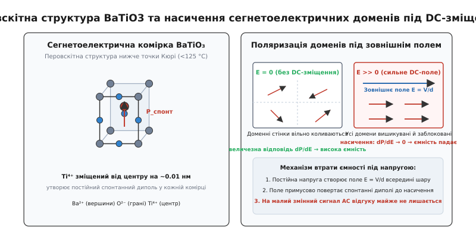
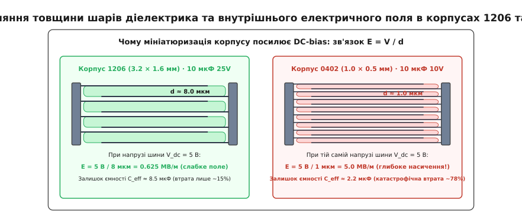
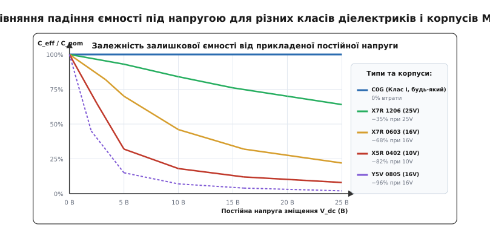
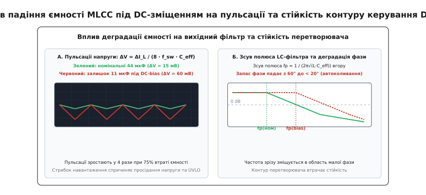

# DC-bias ефект у конденсаторах

<preknowlist>
- [Електричне поле](root:ph-electromagnetism/electric-field) — напруженість поля E, дія на заряди та зв'язок із напругою й відстанню E = V/d.
- [Конденсатор](root:hw-components/capacitor) — будова обкладок, діелектрик і поділ зарядів.
- [Ємність](root:ph-electromagnetism/capacitance) — залежність Q = C·V та формула плоского конденсатора.
- [MLCC](root:hw-components/mlcc) — багатошарова керамічна структура, паралельне чергування електродів і класи кераміки.
- [Зворотний зв'язок](root:hw-power/feedback-stability) — фазовий запас, частота зрізу контуру та стійкість стабілізаторів.
</preknowlist>

Під час розробки імпульсного стабілізатора живлення на 5.0 В інженер закладає у вихідний фільтр два керамічні конденсатори ємністю по 22 мкФ у компактному SMD-корпусі 0603 з номіналом напруги 10 В. Розрахунок обіцяє 44 мкФ сумарної ємності, амплітуду пульсацій у межах 15 мВ і надійний запас фази контуру стабілізації 60°. На макеті вимірювач ємності без підключеного живлення підтверджує рівно 44 мкФ. Проте після подачі живлення на осцилографі виникають пульсації розмахом понад 60 мВ, а перший же стрибок навантаження з 0.5 А до 2.0 А викликає глибоке просідання шини, незгасаючий високочастотний дзвін і аварійне перезавантаження мікроконтролера. Причина криється в невидимому обвалі ємності: під робочою постійною напругою 5.0 В кожен конденсатор 0603 втратив 75% своєї місткості, і реальна сумарна ємність на платі склала не 44 мкФ, а ледь 11 мкФ.

Це явище падіння ефективної ємності під дією прикладеної постійної напруги зміщення називається **DC-bias ефектом** (від англ. *Direct Current bias* — зміщення постійним струмом/напругою). Воно є фундаментальною фізичною властивістю сегнетоелектричної кераміки високої проникності, на якій побудована переважна більшість сучасних багатошарових керамічних конденсаторів.

## Фізичний механізм: перовскітна структура та сегнетоелектрика

Щоб зрозуміти, чому конденсатор втрачає ємність під напругою, необхідно розглянути, як саме діелектрик утримує електричний заряд. [Ємність плоского конденсатора](root:ph-electromagnetism/capacitance) визначається площею пластин `A`, відстанню між ними `d` та відносною діелектричною проникністю середовища `ε_r`:

```
C = ε₀ · ε_r · A / d
```

Для повітря чи вакууму `ε_r = 1`. Звичайні полімерні плівки (поліпропілен, поліестер) мають `ε_r ≈ 2.2...3.3`, оксид алюмінію — `ε_r ≈ 9`, оксид танталу — `ε_r ≈ 26`. За таких значень розмістити десятки мікрофарад у крихітному корпусі об'ємом у частку кубічного міліметра фізично неможливо.

Революція в мініатюризації [MLCC](root:hw-components/mlcc) сталася завдяки використанню **титанату барію** (`BaTiO₃`, лат. *barium titanate*) — синтетичної кераміки з кристалічною решіткою типу **перовскіту** (названої на честь мінералога Л. Перовського). Титанат барію належить до класу **сегнетоелектриків** (англ. *ferroelectrics*, за аналогією з феромагнетиками, хоча заліза в їхньому складі немає) — матеріалів, які мають спонтанну внутрішню електричну поляризацію навіть за відсутності зовнішнього поля.

У кристалічній комірці `BaTiO₃` іони барію `Ba²⁺` розташовані у вершинах куба, іони кисню `O²⁻` займають центри граней, а іон титану `Ti⁴⁺` розміщується всередині кисневого октаедра в центрі комірки. За високих температур (понад температуру Кюрі `T_c ≈ 120...125 °C`) кристал перебуває в параелектричній фазі: комірка є ідеально симетричним кубом, позитивні й негативні заряди геометрично збігаються, і спонтанний дипольний момент дорівнює нулю.


*Зліва: тетрагональна деформація комірки BaTiO3 нижче точки Кюрі створює спонтанний дипольний момент P_спонт. Справа: за відсутності постійного поля домени вільно коливаються (великий відгук dP/dE); під сильним полем Edc усі диполі замикаються в насиченні, і диференційний відгук колапсує.*

При охолодженні нижче точки Кюрі відбувається фазовий перехід: кубічна решітка деформується в тетрагональну, витягуючись уздовж однієї з осей `c`. Через зміну міжатомних відстаней центральний іон `Ti⁴⁺` зміщується від центру симетрії на крихітну відстань близько 0.01 нм уздовж осі видовження. Це незначне геометричне просторове розділення центрів додатного заряду `Ti⁴⁺` та від'ємного заряду кисневого каркаса `O²⁻` породжує в кожній елементарній комірці потужний постійний електричний диполь.

### Доменна структура та диференційна поляризовність

У макроскопічному зразку кераміки сусідні кристалічні комірки об'єднуються в мікроскопічні області з однаковим напрямком спонтанної поляризації — **сегнетоелектричні домени** (лат. *dominium* — володіння). Між доменами утворюються два типи меж: 180-градусні стінки (де вектори сусідніх диполів спрямовані антипаралельно) та 90-градусні стінки (де диполі орієнтовані під прямим кутом один до одного).

Ця різниця має вирішальне фізичне значення. Зміщення 180-градусних стінок пов'язане виключно з переорієнтацією електричного заряду. Натомість рух 90-градусних стінок супроводжується механічною деформацією кристалічної решітки (сегнетопружний ефект): поворот осі тетрагонального видовження `c` на 90° викликає локальне механічне стискання або розтягнення сусідніх зерен.

Коли до конденсатора не прикладено постійної напруги (`V_dc = 0 В`), домени орієнтовані хаотично, компенсуючи макроскопічний заряд на обкладках. Якщо тепер подати невеликий змінний вимірювальний сигнал (наприклад, `V_ac = 0.5 В` від LCR-метра), слабке поле легко зміщує доменні стінки. Домени з попутною орієнтацією розростаються за рахунок сусідів, а диполі узгоджено коливаються. Цей механізм описується законом Релея для сегнетоелектриків: за слабких змінних полів амплітуда коливань доменних меж зростає, даючи навіть невеликий початковий підйом ємності при збільшенні амплітуди змінного сигналу.

Це легке колективне зміщення мільярдів внутрішніх диполів створює гігантський макроскопічний відгук поляризації `P` на зміну напруженості поля `E`. Відносна діелектрична проникність є мірою цього відгуку:

```
ε_r = 1 + (1 / ε₀) · (dP / dE)
```

Завдяки величезному значенню похідної `dP/dE` діелектрична проникність титанату барію сягає `ε_r ≈ 2000...5000` у кераміці класу II (X5R, X7R) та перевищує `ε_r > 15000` у кераміці класу III (Y5V). Саме ця властивість дозволяє спресувати мікрофаради в міліметровий об'єм.

### Що відбувається під дією постійного електричного поля

Коли до конденсатора прикладають постійну робочу напругу `V_dc`, у кожному шарі діелектрика товщиною `d` виникає постійне [електричне поле](root:ph-electromagnetism/electric-field) напруженістю `E_dc = V_dc / d`.

Це постійне поле створює механічний обертальний момент, який силоміць розвертає спонтанні диполі всіх доменів паралельно до напрямку прикладеного поля:
1. Доменні стінки зміщуються до кристалічних меж і дефектів решітки, де вони жорстко блокуються (іммобілізуються або «затискаються»).
2. Поворот 90-градусних доменів супроводжується електрострикцією (механічним стисканням матеріалу), що створює колосальні внутрішні механічні напруження між кристалічними зернами, які остаточно «заморожують» будь-який подальший рух стінок.
3. У міру зростання `E_dc` кількість вільних диполів, здатних змінювати свій напрямок, стрімко вичерпується. Поляризація наближається до свого фізичного насичення `P_sat`.
4. У стані глибокого насичення похідна `dP/dE` наближається до нуля.

Тепер, якщо поверх постійної напруги накласти змінний сигнал (пульсації струму перетворювача, аналоговий сигнал чи стрибок струму), діелектрик уже не може відповісти додатковою поляризацією — усі його диполі вже вишикувані й «заблоковані» постійним полем.

Як наслідок, диференційна ємність `C(V) = dQ / dV`, що визначає реакцію конденсатора на будь-які динамічні зміни напруги, катастрофічно падає. Діелектрик із надвисокою проникністю фактично деградує до рівня звичайного низькопроникного матеріалу. Цей процес є повністю оборотним: якщо зняти постійну напругу, тепловий рух атомів поступово релаксує доменну структуру до початкового стану.

Розмір кристалічних зерен кераміки грає тут фундаментальну роль. У великозернистій кераміці (розмір зерна понад 1–2 мкм) кожне зерно містить безліч доменів, стінки яких пересуваються порівняно легко. У сучасних надтонких шарах виробники змушені застосовувати нанорозмірні порошки із зерном 100–300 нм. У такому дрібному зерні поміщається лише один або два домени; внутрішні механічні напруження затискають їх набагато сильніше, тому спад ємності під полем починається при відчутно нижчих напруженостях.

## Зв'язок із мініатюризацією корпусів: геометрична пастка

Головна причина, чому проблема DC-bias ефекту набула критичної гостроти саме в сучасній електроніці — це безперервна мініатюризація SMD-корпусів (0805 → 0603 → 0402 → 0201).

У багатошаровому конденсаторі `N` шарів площею `A` з'єднані паралельно, утворюючи загальну ємність `C = N · ε₀ · ε_r · A / d`. Щоб зменшити площу посадкового місця `A` (яка для корпусу 0402 у 10 разів менша, ніж для 1206), виробник має лише один шлях збереження тієї самої мікрофарадної ємності: одночасно збільшувати кількість шарів `N` і зменшувати товщину одного діелектричного шару `d`.

У конденсаторах попередніх поколінь у корпусах 1206 або 1210 товщина шару кераміки `d` становила 8–15 мкм. У сучасних ультракомпактних конденсаторах 0402 або 0201 товщина діелектрика `d` зменшена до 1.0–1.5 мкм, а в рекордних компонентах — до менш ніж 0.6–0.8 мкм (кілька сотень атомних шарів).

Розрахуймо напруженість внутрішнього електричного поля `E = V / d` для двох конденсаторів однакової номінальної ємності 10 мкФ на робочій шині живлення 5.0 В:

```
Корпус 1206 (d ≈ 8.0 мкм):
E = 5.0 В / (8.0 × 10⁻⁶ м) = 625 000 В/м = 0.625 МВ/м  (6.25 кВ/см)

Корпус 0402 (d ≈ 1.0 мкм):
E = 5.0 В / (1.0 × 10⁻⁶ м) = 5 000 000 В/м = 5.0 МВ/м   (50.0 кВ/см)
```


*При тій самій напрузі шини 5 В тонкий діелектрик корпусу 0402 зазнає у 8 разів сильнішого електричного поля, ніж 1206, вводячи кераміку в глибоке насичення.*

Напруженість поля 5.0 МВ/м (50 кВ на сантиметр!) діє всередині крихітної деталі 0402 на звичайній п'ятивольтовій шині USB. При такій колосальній напруженості сегнетоелектричні домени входять у глибоке насичення.

Звідси випливає фундаментальний інженерний закон: **чим менший геометричний розмір корпусу конденсатора за фіксованого номіналу ємності та напруги, тим тонший у ньому шар діелектрика, тим вища напруженість поля E, і тим катастрофічнішим є відносне падіння ємності під дією робочої напруги**.

> 🔧 **Пастка номінальної напруги в даташиті.**
> Поширена помилка початківців — вважати, що параметр `Rated Voltage` (номінальна напруга, наприклад «10V» чи «16V») гарантує збереження номінальної ємності аж до цієї межі. Це не так. Номінальна напруга в даташиті MLCC — це виключно **електрична межа надійності ізоляції** (напруга, за якої діелектрик гарантовано не зазнає електричного пробою і руйнування протягом гарантійного терміну служби). Вона не має жодного стосунку до збереження номінальної ємності. На 80–100% своєї номінальної напруги компактний MLCC класу X5R зазвичай утримує лише 10–25% початкової ємності.

## Порівняння класів діелектрика та альтернативних технологій

Сприйнятливість конденсатора до DC-bias ефекту визначається виключно фізикою діелектричного матеріалу.


*Характеристики дератингу ємності: C0G стабільний на 100%; X7R у корпусі 1206 втрачає до 35%; дрібний X5R 0402 втрачає понад 80%; кераміка Y5V зазнає повного колапсу ємності вже при 20–30% напруги.*

### Клас I: C0G (NP0) — абсолютна стабільність

Конденсатори класу I виготовляють на основі неполярних параелектриків — цирконату кальцію (`CaZrO₃`), титанату неодиму або оксиду титану (`TiO₂`) зі стабілізуючими добавками.
- **Механізм поляризації:** виключно електронна та пружна іонна поляризація (незначне пружне зміщення електронних оболонок атомів). Спонтанна поляризація та сегнетоелектричні домени повністю відсутні.
- **Поведінка під DC-bias:** залежність ємності від прикладеної постійної напруги становить **0.0%**. Конденсатор C0G утримує рівно 100% своєї ємності аж до точки пробою.
- **Ціна стабільності:** діелектрична проникність `ε_r ≈ 20...100` (у 50–100 разів нижча, ніж у BaTiO3). Тому номінали C0G зазвичай обмежені одиницями-десятками нанофарад у стандартних корпусах (хоча в корпусах 1206/1210 доступні номінали до 100 нФ).

### Клас II: X7R, X8R, X5R — робочі конячки живлення

Конденсатори класу II базуються на легованому титанаті барію. Добавки цирконію, олова та оксидів рідкоземельних металів створюють дрібнозернисту структуру (розмір зерен менше 1 мкм), яка розмиває пік Кюрі, забезпечуючи прийнятну температурну стабільність (±15% для X7R у діапазоні −55…+125 °C).
- **Поведінка під DC-bias:** спад ємності від помірного до сильного (від −20% у корпусах 1210 до −80% у корпусах 0402 на номінальній напрузі).
- **Відмінність X7R від X5R:** кераміка X7R має товстіші шари й дещо нижчу діелектричну проникність, ніж X5R, тому за однакового номіналу й корпусу X7R завжди зберігає на 15–30% більше ефективної ємності під напругою, ніж X5R.

### Клас III: Y5V, Z5U — заборонена кераміка для силових кіл

Кераміка класу III оптимізована виключно під одну мету: отримати максимальну діелектричну проникність (`ε_r > 15000...20000`) за мінімальної ціни шляхом розміщення піку Кюрі прямо в зоні кімнатної температури (+20…+25 °C).
- **Поведінка під DC-bias:** катастрофічний обвал. При подачі лише 20% від номінальної напруги ємність падає на 50–70%. На повній робочій напрузі конденсатор Y5V втрачає **90–96% своєї ємності**, перетворюючись на дорогий резистор із мізерною залишковою місткістю.
- **Температурний дрейф:** від +22% до −82%.
- У сучасній професійній схемотехніці кераміка Y5V вважається застарілою і заборонена для використання в ланцюгах живлення та фільтрації.

### Полімерні, танталові та плівкові альтернативи

Поза керамічною родиною діють інші фізичні механізми, позбавлені сегнетоелектричного насичення:
- **Танталові та алюмінієві електролітичні конденсатори (зокрема з провідним полімером, Polymer Tantalum / POSCAP / OS-CON):** використовують аморфні несегнетоелектричні оксиди `Ta₂O₅` та `Al₂O₃`. Падіння ємності від постійної напруги зміщення становить **0%**. При напрузі 5 В полімерний конденсатор 47 мкФ утримує рівно 47 мкФ, маючи при цьому вкрай низький опір ESR (10–30 мОм).
- **Плівкові конденсатори (поліпропілен PP, поліестер PET):** повністю неполярні високомолекулярні діелектрики. DC-bias ефект становить **0%**, забезпечуючи бездоганну лінійність, що критично для прецизійних аналогових аудіофільтрів та вимірювальних систем.

## Схемотехнічні наслідки деградації ємності

Коли ефективна ємність конденсатора несподівано зменшується в 3–5 разів під робочою напругою, це безпосередньо руйнує розрахункові режими електричних кіл.

### 1. Зсув частоти зрізу аналогових та сигнальних фільтрів

У пасивному [RC-фільтрі низьких частот](root:hw-analog/rc-low-pass) частота зрізу визначається формулою `f_c = 1 / (2 · π · R · C_eff)`.

Якщо фільтр встановлений на сигнальній лінії з постійним зміщенням (наприклад, фільтрація опорної напруги 2.5 В або зміщеного аудіосигналу), падіння `C_eff` на 70% зсуває частоту зрізу вгору:

```
f_c_actual = f_c_nom / (1 − 0.70) = 3.33 · f_c_nom
```

Фільтр, розрахований на придушення перешкод понад 1 кГц, реально починає зрізати сигнал лише від 3.33 кГц. Усі високочастотні завади та шуми комутації безперешкодно проходять на вхід АЦП, викликаючи накладання спектрів (аліасинг) і хибні вимірювання.

У диференційних [активних фільтрах на ОП](root:hw-analog/active-filters) розбіжність падіння ємності в плечах фільтра через нерівні постійні потенціали руйнує симетрію схеми і катастрофічно погіршує коефіцієнт придушення синфазного сигналу (CMRR).

### 2. Сплеск пульсацій вихідної напруги в DC-DC перетворювачах

У [понижувальному Buck-перетворювачі](root:hw-power/buck) амплітуда пульсацій вихідної напруги `ΔV_out` складається з ємнісної складової та падіння на опорі [ESR конденсатора](root:hw-power/esr-capacitor):

```
ΔV_out = ΔI_L / (8 · f_sw · C_eff) + ΔI_L · ESR
```

Оскільки керамічні конденсатори мають наднизький опір ESR (одиниці міліом), перша (ємнісна) складова визначає понад 85% амплітуди пульсацій. Якщо замість розрахункових 44 мкФ конденсаторна батарея утримує лише 11 мкФ, амплітуда високочастотних пульсацій на шині живлення процесора зростає рівно в 4 рази. Пульсації 15 мВ перетворюються на 60–80 мВ, виходячи за межі допустимих допусків живлення сучасних цифрових мікросхем (наприклад, ±3% для ліній DDR4/DDR5 або ядер FPGA).

### 3. Руйнування стабільності контуру зворотного зв'язку

Найнебезпечніший наслідок DC-bias ефекту — повна втрата стійкості стабілізаторів напруги.

Вихідний фільтр перетворювача утворює подвійний резонансний полюс другого порядку:

```
f_p = 1 / (2 · π · √(L · C_eff))
```

Коли ємність `C_eff` зменшується в 4 рази, частота полюса `f_p` зростає рівно вдвічі (`1 / √0.25 = 2.0`).


*А: Чотирикратне зростання пульсацій напруги під навантаженням через втрату ємності. Б: Зсув резонансного полюса fp вгору за частотою призводить до небезпечного падіння запасу фази нижче 20°, провокуючи автоколивання.*

Контур регулятора компенсації зворотного зв'язку (Type II або Type III) розраховується під конкретне розташування полюсів і нулів:
- Інженер налаштовує нулі підсилювача помилки так, щоб підняти фазову криву на частоті одиничного підсилення `f_cross` і отримати [запас фази](root:hw-analog/stability-margins) `Phase Margin ≥ 60°`.
- При зсуві полюса `f_p` вгору через DC-bias частота одиничного підсилення контуру зсувається вправо, у зону вищих частот.
- На новій частоті зрізу компенсаційний нуль більше не компенсує фазовий зсув: фаза падає нижче критичної межі, запас фази зменшується до 10–20° або стає від'ємним.
- Перетворювач переходить у режим релаксаційних коливань або генерації: на виході виникає низькочастотна хвиля великої амплітуди (десятки кілогерц), транзистори перегріваються, а навантаження виходить з ладу через перенапругу.

### 4. Нестійкість лінійних стабілізаторів (LDO)

Більшість сучасних [LDO](root:hw-power/ldo) (Low Drop-Out) вимагають обов'язкової наявності мінімальної вихідної ємності (наприклад, `C_out ≥ 2.2 мкФ` або `4.7 мкФ`) для забезпечення домінантного полюса внутрішньої компенсації Міллера. Якщо інженер ставить один конденсатор 0402 номіналом 4.7 мкФ на вихід 3.3 В, залишок ємності становить лише 0.8–1.0 мкФ. LDO порушує паспортні умови стабільності й починає генерувати синусоїдальні коливання амплітудою в сотні мілівольт, перетворюючи чисту аналогову лінію на джерело радіозавад.

### 5. Пастка в бутстрепних колах драйверів верхнього ключа

У напівмостових та мостових перетворювачах живлення (драйвери двигунів, синхронні Buck-перетворювачі, інвертори) затвор верхнього польового транзистора живиться від літаючого **бутстрепного конденсатора** (англ. *bootstrap capacitor* `C_boot`).
- Під час відкритого стану нижнього транзистора `C_boot` заряджається від шини 12 В через діод;
- Коли нижній ключ закривається, потенціал виводу конденсатора підстрибує на величину напруги силової шини (наприклад, 48 В). Проте напруга *між обкладками самого конденсатора* залишається на рівні 12 В.
- Якщо як `C_boot` застосовано конденсатор 0402 ємністю 1.0 мкФ з номіналом 16 В, його ємність під постійним зміщенням 12 В падає до 0.15 мкФ.
- Під час важкого перемикання заряду затвора потужного транзистора напруга на `C_boot` миттєво просідає нижче порогу захисту драйвера від зниження напруги (UVLO). Верхній транзистор закривається посеред такту, виникає наскрізний струм або перегрів силового каскаду.

### 6. Падіння ККД та просідання помп заряду (Charge Pumps)

У безіндуктивних помпових помножувачах та інверторах напруги (наприклад, ICL7660 чи помпи заряду флеш-пам'яті) вихідний опір визначається виключно комутаційною ємністю літаючого конденсатора `C_fly`:

```
R_out ≈ 1 / (f_sw · C_fly)
```

При роботі під високою вихідною напругою деградація `C_fly` через DC-bias призводить до пропорційного зростання внутрішнього опору джерела: напруга під навантаженням різко просідає, а коефіцієнт корисної дії схеми обвалюється.

## Лабораторні методи вимірювання DC-bias характеристик

Для верифікації реальних характеристик конденсаторів у лабораторії застосовують три основні методи:

### 1. Метод мостового вимірювача з джерелом зміщення (LCR Bias Fixture)

Стандартний лабораторний вимірювач LCR підключають до досліджуваного зразка через спеціальну вимірювальну приставку:
- Постійна напруга від регульованого джерела живлення подається через високоомний резистор розв'язки `R_bias` (зазвичай 10–100 кОм), який запобігає шунтуванню змінного сигналу внутрішнім опором джерела;
- Входи LCR-метра захищають за допомогою неполярних блокувальних конденсаторів високої ємності `C_block` (C0G або плівкові на велику напругу), для яких `C_block >> C_dut`.
- Поступово збільшуючи постійну напругу з кроком 1 В, фіксують спад ємності на фіксованій вимірювальній частоті 1 кГц або 100 кГц.

### 2. Метод інтегрування струму заряду (Sawyer-Tower Circuit)

Класична схема Соєра-Тауера використовується для безпосередньої візуалізації петлі поляризації `P(E)` на екрані осцилографа:
- Досліджуваний конденсатор `C_dut` з'єднують послідовно з еталонним лінійним плівковим конденсатором великої ємності `C_ref >> C_dut`.
- На схему подають високовольтну синусоїду або трикутний сигнал.
- Напруга на `C_ref` пропорційна повному заряду `Q = ∫ i dt`, а напруга на `C_dut` — напруженості поля `E`.
- Подаючи сигнал `E` на канал X, а сигнал `Q` на канал Y осцилографа у режимі X-Y, спостерігають вигин петлі гістерезису та вихід кривої на горизонтальне плато насичення.

## Інженерні методи пом'якшення та розрахунок надійності

Щоб уникнути описаних аварійних режимів, розробка надійних електронних пристроїв спирається на перевірені інженерні практики дератингу та вибору компонентів.

```
Сходинки захисту від DC-bias деградації:
1. Запас за напругою (Voltage Derating): V_rated ≥ 2...3 × V_робоча
2. Збільшення типорозміру (Footprint Upsizing): перехід 0402 → 0805 / 1206
3. Паралельний розрахунок найгіршого випадку: C_nom = C_потрібна / k_bias
4. Гібридні батареї: MLCC (для ВЧ) + Тантал-полімер (для масивної ємності)
5. Прецизійні кола: виключно C0G/NP0
```

### 1. Дератизація за номінальною напругою (Voltage Derating)

Оскільки ступінь насичення кераміки залежить від напруженості поля `E = V / d`, вибір конденсатора з вищим класом номінальної напруги автоматично означає товстіший шар діелектрика `d`.
- Для шини **3.3 В:** замість конденсаторів на 6.3 В обирають номінал **16 В** або **25 В**.
- Для шини **5.0 В:** замість 10 В обирають **25 В** або **50 В**.
- Для шини **12.0 В:** використовують компоненти на **50 В** або **100 В**.

Робота на рівні 15–25% від номінальної напруги дозволяє зберегти 70–85% початкової ємності навіть у відносно компактних корпусах.

### 2. Збільшення фізичного розміру корпусу (Footprint Up-sizing)

У силових вихідних каскадах перетворювачів відмовляються від корпусів 0402 та 0603 на користь **0805, 1206 або 1210**. Порівняння двох конденсаторів однакового номіналу 22 мкФ 16V на шині 5.0 В наочно демонструє перевагу:
- Корпус **0603 X5R 16V** на напрузі 5 В зберігає лише **35%** ємності (7.7 мкФ);
- Корпус **1206 X7R 16V** на напрузі 5 В зберігає **80%** ємності (17.6 мкФ).

Один корпус 1206 ефективно замінює три паралельні корпуси 0603, заощаджуючи площу друкованої плати та знижуючи загальну вартість виробу (BOM).

### 3. Розрахунок за найгіршим випадком та паралельне резервування

Розрахунок ємності фільтра проводять не за каталожним номіналом, а за формулою гарантованого залишку:

```
C_nom_required = C_target_min / (k_bias · k_temp · k_aging · (1 − Tol))
```

де `k_bias` — коефіцієнт утримання ємності під напругою (наприклад, 0.35), `k_temp` — температурний коефіцієнт (0.85 для X5R при 85 °C), `k_aging` — коефіцієнт старіння після паяння (0.90), а `Tol` — виробничий допуск (±20% → 0.20).

Якщо для стабільності перетворювача потрібно гарантовано мати не менше 20 мкФ на виході 5.0 В:

```
C_nom_required = 20 мкФ / (0.35 · 0.85 · 0.90 · 0.80) ≈ 93 мкФ
```

Інженер повинен закласти у проект сумарний номінал щонайменше 100 мкФ (наприклад, п'ять конденсаторів по 22 мкФ або два по 47 мкФ у корпусі 1206), щоб у найгірших робочих умовах отримати необхідні 20 мкФ.

### 4. Гібридні фільтрувальні батареї

Найбільш ефективне рішення для потужних процесорних шин (живлення FPGA, CPU, GPU зі струмами в десятки ампер) — поєднання двох технологій:
- **Основна масивна ємність (Bulk):** один або два танталово-полімерні конденсатори (наприклад, 100–220 мкФ 6.3V, POSCAP). Вони мають нульовий DC-bias ефект, стабільну ємність від температури й беруть на себе компенсацію повільних динамічних просідань струму.
- **Високочастотна фільтрація (High-Frequency Decoupling):** батарея з декількох керамічних MLCC X7R 0805/1206 по 10–22 мкФ 25V. Завдяки мізерній власній індуктивності (ESL) вони беруть на себе замикання високочастотних струмів перемикання (1–3 МГц).

> ⚙️ **Програмний інструмент моделювання:**
> Повний розрахунковий модуль для автоматизованої оцінки DC-bias дератингу, розрахунку пульсацій та перевірки стійкості контуру живлення мовами C та C++ реалізовано у проектній вставці: [Моделювання DC-bias дератингу та стабільності імпульсного перетворювача](root:hw-components/dc-bias-capacitance/proj-dcdc-derating-calc.md).

### 5. Використання онлайн-симуляторів виробників

Провідні виробники керамічних конденсаторів надають детальні виміряні характеристики своїх компонентів у спеціалізованих веб-інструментах:
- **Murata SimSurfing:** надає графіки `Capacitance vs. DC Voltage`, `Impedance vs. Frequency` та точні SPICE-моделі для кожної ревізії деталі;
- **TDK Component Characteristics Viewer:** дозволяє одночасно накладати температурний дрейф і постійну напругу зміщення;
- **KEMET K-SIM:** розраховує динамічний нагрів від змінного струму та залишок ємності під комбінованим навантаженням;
- **Taiyo Yuden Component Selection Tool:** моделює параметри вихідних фільтрів перетворювачів.

Проектування будь-якого відповідального вузла живлення вимагає обов'язкової перевірки кожного вибраного партномера MLCC за офіційними графіками DC-bias дератингу виробника перед передачею плати у виробництво.
