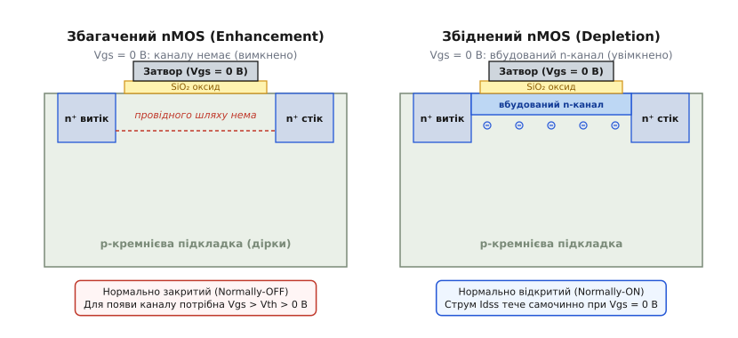
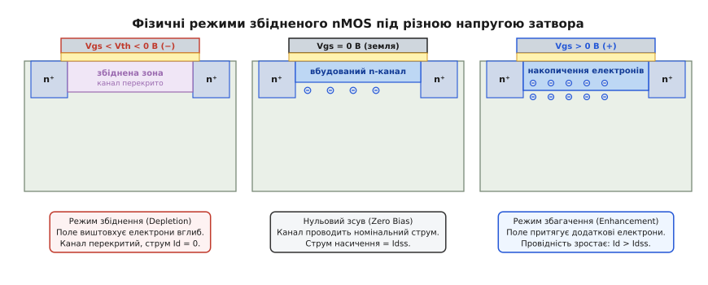
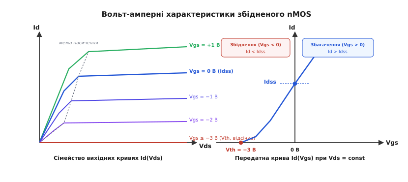
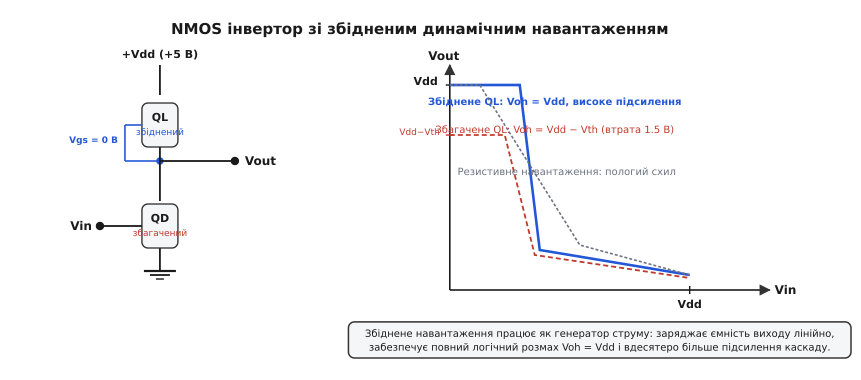
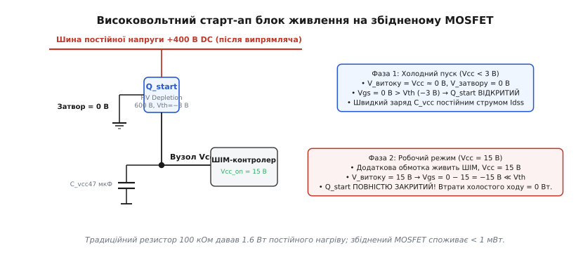
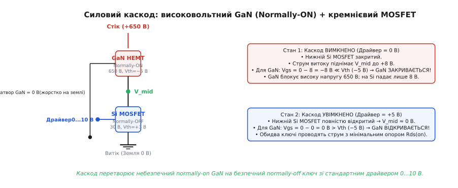

# Збіднений MOSFET: транзистор із вбудованим каналом

<preknowlist>
- [Будова MOSFET](root:hw-components/mosfet-structure) — оксидний діелектрик, метал-діелектрик-напівпровідник, витік, стік і підкладка.
- [Поріг і канал MOSFET](root:hw-components/mosfet-threshold) — фізика порогової напруги Vth, поверхневе збіднення та інверсія.
- [P-N перехід](root:ph-condensed/pn-junction) — просторовий заряд і розширення збідненої області зворотною напругою.
- [NMOS і PMOS](root:hw-components/nmos-pmos) — типи провідності каналу та базові логічні комірки.
</preknowlist>

Уявіть ситуацію: в імпульсному блоці живлення напруга мережі 230 В випрямляється у високовольтну шину постійного струму +400 В. Щоб мікросхема ШІМ-контролера почала генерувати імпульси й керувати силовими транзисторами, вона спершу має зарядити власний конденсатор живлення до напруги 12...15 В. Але вся керувальна електроніка ще знеструмлена: жоден мікроконтролер не працює, жоден драйвер не видає керувальних імпульсів. Якщо всі транзистори в системі є звичайними нормально закритими ключами, електричний струм просто не має шляху, щоб потрапити з високовольтної шини до конденсатора живлення.

Інший приклад — схема захисту акустичної системи: коли підсилювач потужності аварійно втрачає живлення, напруги в його внутрішніх каскадах зникають нерівномірно, породжуючи на виході потужний постійний стрибок напруги, здатний миттєво спалити звукову котушку гучномовця. Щоб запобігти цьому, вихід підсилювача потрібно надійно закоротити на землю в саму мить знеструмлення — тобто замкнути ключ за повної відсутності будь-якої керівної напруги.

Звичайний польовий транзистор збагаченого типу (*enhancement-mode MOSFET*) для цих завдань непридатний: за нульової напруги на затворі (`Vgs = 0 В`) його провідний канал відсутній, опір становить гігаоми, а коло розірване. Для розв'язання таких задач існує інший клас приладів — **збіднений MOSFET** (англ. *depletion-mode MOSFET* або *normally-on MOSFET*). Це польовий транзистор з ізольованим затвором, у якому провідний канал між витоком і стоком сформовано фізично ще під час виготовлення кристала. Він проводить електричний струм за нульової напруги на затворі й вимагає прикладання зворотної напруги зміщення, щоб перекрити канал і заблокувати струм.

### Технологія створення: як імплантація вшиває канал у кремній

Щоб зрозуміти відмінність між двома типами польових транзисторів, зазирнімо в їхню внутрішню напівпровідникову структуру.

У класичному збагаченому n-канальному MOSFET між двома сильно легованими острівцями n⁺-типу (витоком і стоком) лежить суцільна p-підкладка. Між витоком і стоком утворюються два зустрічно ввімкнені p-n переходи, які за будь-якої полярності напруги живлення блокують протікання струму. Провідний місток не існує у вихідному стані; його потрібно навести штучно. Для цього на затвор подають позитивну напругу, електричне поле якої відштовхує основні носії підкладки (позитивні дірки) вглиб напівпровідника й притягує до поверхні неосновні носії — електрони. Коли концентрація електронів під оксидом перевищує концентрацію дірок, утворюється тонкий **інверсійний шар**, який і слугує каналом.

У збідненому MOSFET металургійний канал створюється заздалегідь під час технологічного процесу на фабриці. Перед вирощуванням або після формування тонкого підзатворного діоксиду кремнію (SiO₂) ділянку між майбутніми витоком і стоком піддають **іонній імплантації** (*ion implantation*). Високоенергетичний пучок іонів донорної домішки (найчастіше фосфору або миш'яку) бомбардує поверхню напівпровідника крізь технологічні вікна у фоторезисті.


*Зліва — збагачений nMOS: при нульовій напрузі на затворі провідного каналу немає, p-підкладка розриває коло між n⁺-витоком і стоком. Справа — збіднений nMOS: під оксидом затвора іонною імплантацією вшито суцільний n-канал, тому при Vgs = 0 В струм тече вільно.*

У результаті імплантації під оксидом затвора утворюється тонкий шар n-типу провідності з глибиною залягання `xj ≈ 0.1...0.3 мкм` та концентрацією донорів `ND ≈ 10¹⁶...10¹⁷ см⁻³`. Цей імплантований шар утворює неперервний монокристалічний n-місток, який фізично з'єднує n⁺-витік із n⁺-стоком.

Оскільки концентрація вільних електронів у цьому шарі висока від самого початку, збіднений транзистор володіє низьким власним опором каналу навіть тоді, коли затвор електрично з'єднаний із витоком (`Vgs = 0 В`).

Тут виникає закономірне запитання: чим такий прилад відрізняється від класичного польового транзистора з p-n переходом ([JFET](root:hw-components/field-control)), який також є нормально відкритим? Головна відмінність полягає в будові затвора:
- У JFET затвор — це відкритий p-n перехід, безпосередньо спаяний із тілом каналу. Якщо на затвор n-JFET подати навіть невелику позитивну напругу понад +0.6 В, p-n перехід відкриється в прямому напрямку, крізь нього потече великий струм, і прилад втратить високий вхідний опір або вийде з ладу.
- У збідненому MOSFET затвор відділений від імплантованого каналу високоякісним діелектриком — шаром діоксиду кремнію з питомим опором понад `10¹⁴ Ом·см`. Завдяки цьому струм затвора практично дорівнює нулю (`< 10⁻¹² А`) за будь-якої полярності прикладеної напруги керування.

### Два світи одного приладу: режим збіднення та режим збагачення

Наявність фізично імплантованого каналу та ізольованого затвора надає збідненому MOSFET унікальну рису, якою не володіє жоден інший напівпровідниковий прилад: він здатен повноцінно працювати в **обох полярностях** напруги «затвор–витік».

Розгляньмо фізичні процеси в n-канальному збідненому MOSFET за різного потенціалу затвора.


*Три фізичні стани збідненого nMOS. Зліва — режим збіднення (Vgs < 0 В): поле виштовхує електрони, збіднена зона перекриває канал. Посередині — нульовий зсув (Vgs = 0 В): вбудований канал проводить струм Idss. Справа — режим збагачення (Vgs > 0 В): поле накопичує додаткові електрони на поверхні, провідність максимальна.*

#### 1. Режим збіднення (Depletion Mode, Vth < Vgs ≤ 0 В)
Подаймо на затвор від'ємну щодо витоку напругу (`Vgs < 0 В`). Негативний заряд на металевій або полікремнієвій пластині затвора створює електричне поле, вектор якого спрямований від підкладки до затвора.

Це поле чинить кулонівську силу на вільні електрони в імплантованому каналі, виштовхуючи їх від поверхні розділу з діелектриком углиб напівпровідника. Під шаром оксиду залишаються позитивно заряджені іонізовані атоми донорної домішки (`ND⁺`), які не можуть рухатися, оскільки жорстко закріплені у вузлах кристалічної ґратки кремнію.

Утворюється шар, позбавлений рухомих носіїв заряду — **збіднена область** (*depletion region*). Оскільки частина поперечного перерізу каналу виявляється заблокованою збідненою зоною, ефективна провідна товщина каналу зменшується. Опір між витоком і стоком зростає, а струм стоку зменшується.

Якщо збільшувати амплітуду від'ємної напруги на затворі, збіднена зона розширюватиметься глибше в кремній. За певної напруги `Vgs = Vth` (де `Vth < 0 В` — порогова напруга збіднення, типово від −2 до −5 В) поверхнева збіднена зона змикається зі збідненою зоною нижнього переходу «канал–підкладка». Вільних електронів між витоком і стоком більше не залишається: канал повністю перекривається (*pinch-off*). Струм стоку припиняється, і транзистор переходить у закритий стан.

#### 2. Режим нульового зсуву (Zero-Bias Mode, Vgs = 0 В)
Коли затвор електрично з'єднаний із витоком, зовнішнє поперечне електричне поле відсутнє. Імплантований n-канал відкритий на всю свою технологічну глибину. Якщо прикласти різницю потенціалів між стоком і витоком (`Vds > 0 В`), крізь канал потече значний струм, обмежений лише геометричними розмірами каналу та рівнем легування. Максимальний струм у цьому стані називають **струмом насичення при нульовому зсуві** і позначають **`Idss`** (*drain-to-source current with gate shorted to source*).

#### 3. Режим збагачення (Enhancement Mode, Vgs > 0 В)
Подаймо на затвор позитивну напругу (`Vgs > 0 В`). Тепер електричне поле затвора притягує вільні електрони з глибини підкладки та n⁺-областей безпосередньо до межі з діоксидом кремнію.

Під оксидом формується шар підвищеної концентрації електронів — **шар накопичення** (*accumulation layer*). Сумарна провідність структури тепер складається з провідності вихідного вбудованого об'ємного n-каналу та провідності наведеного поверхневого шару. Опір відкритого каналу падає нижче значення при нульовому зсуві, а струм стоку перевищує `Idss`.

> 🔧 **Чому це важливо.** Жоден класичний збагачений MOSFET не здатен проводити струм при `Vgs < 0 В`, а жоден JFET не здатен безпечно працювати при `Vgs > +0.6 В`. Збіднений MOSFET вільно працює по обидва боки від нуля, плавно змінюючи провідність від повного розриву до надпровідного стану.

Для p-канального збідненого MOSFET (p-depletion) полярності напруг і типи носіїв є дзеркальними: у p-підкладку імплантують дірковий канал p-типу, порогова напруга стає додатною (`Vth > 0 В`), запирання каналу відбувається подачею позитивної напруги (`Vgs > Vth > 0 В`), а збагачення — від'ємної (`Vgs < 0 В`).

### Фізика відсікання: рівняння Пуассона та баланс зарядів

Щоб точно розрахувати порогову напругу запирання збідненого транзистора, необхідно розглянути одновимірну електростатику структури вздовж осі `x`, спрямованої від межі «діелектрик–кремній» (`x = 0`) углиб кристала.

Розподіл електричного потенціалу `ψ(x)` у збідненій зоні напівпровідника підпорядковується фундаментальному рівнянню Пуассона:

```
d²ψ/dx² = −ρ(x)/εs = −(q·ND)/εs    [одновимірне рівняння Пуассона]
```

де `q = 1.602·10⁻¹⁹ Кл` — елементарний електричний заряд, `ND` — концентрація іонізованих атомів донорної домішки в каналі, `εs` — абсолютна діелектрична проникність кремнію (`εs = εr·ε₀ ≈ 1.04·10⁻¹¹ Ф/м`).

Канал затискається між двома збідненими областями:
1. **Верхньою збідненою зоною** товщиною `Wg(Vgs)`, створеною полем затвора через оксидний діелектрик з питомою ємністю `Cox = εox / tox`.
2. **Нижньою збідненою зоною** товщиною `Wsub(Vsb)`, створеною вбудованим потенціалом p-n переходу між імплантованим n-каналом і p-підкладкою:

```
Wsub = √((2·εs·(φbi + Vsb)·NA) / (q·ND·(NA + ND)))    [товщина збіднення підкладкового переходу]
```

де `φbi` — контактна різниця потенціалів переходу, `Vsb` — зворотна напруга зміщення між витоком і підкладкою, `NA` — концентрація акцепторів у тілі підкладки.

Умова повного перекриття каналу полягає в тому, що сума товщин верхньої та нижньої збіднених областей досягає повної металургійної глибини імплантації `xj`:

```
Wg + Wsub = xj    [умова повного перекриття каналу]
```

Інтегруючи рівняння Пуассона двічі та підставляючи граничні умови для потенціалу на затворі, отримуємо рівняння порогової напруги збідненого MOSFET:

```
Vth = VFB + 2·φF − (q·NI)/Cox − (√(2·εs·q·NA·(2·φF + Vsb))) / Cox    [порогова напруга збідненого nMOS]
```

Розберімо кожен фізичний доданок цього рівняння:
- `VFB` — напруга плоских зон (*flat-band voltage*), що враховує різницю робіт виходу матеріалу затвора й кремнію, а також фіксований паразитна заряд в оксиді.
- `2·φF` — подвоєний потенціал Фермі p-підкладки.
- `−(q·NI)/Cox` — **головний зсувний член**, де `NI = ND·xj` — повна доза імплантованих донорних іонів на одиницю площі (іонів/см²).
- Останній доданок — заряд просторового збіднення підкладки.

У звичайному збагаченому транзисторі імплантація каналу відсутня (`NI = 0`), тому сума перших членів дає додатне число `Vth ≈ +0.7...+1.0 В`.

Вводячи під час імплантації контрольовану поверхневу дозу донорів `NI ≈ 10¹²...2·10¹² см⁻²`, інженери створюють великий негативний зсув `−(q·NI)/Cox ≈ −2...−4 В`. У результаті результуюча порогова напруга стає строго від'ємною: `Vth = −1.5...−3.5 В`.

> 🧮 **Повне виведення рівнянь каналу.** Детальний математичний аналіз одновимірного рівняння Пуассона, розрахунок інтегралів перемикання та точний вплив ефекту підкладки — у вставці [«Розрахунок інвертора зі збідненим навантаженням та фізика вбудованого каналу»](root:hw-components/depletion-mode-mosfet/math-depletion-load.md).

### Вольт-амперні характеристики: лінійна область, насичення та струм Idss

Поведінка збідненого транзистора в електричному колі описується класичними рівняннями теорії польових транзисторів Шихмана–Ходжеса, але з урахуванням від'ємного значення `Vth`.

Перенапруга затвора (overdrive voltage) для збідненого nMOS визначається як:

```
Vov = Vgs − Vth    [перевищення порогу]
```

Оскільки `Vth < 0`, при нульовій напрузі на затворі `Vgs = 0 В` перенапруга є додатною величиною: `Vov = 0 − (−|Vth|) = |Vth| > 0`.


*Вольт-амперні характеристики збідненого nMOS. Зліва — сімейство вихідних кривих Id(Vds): навіть при Vgs = 0 В транзистор має виражену робочу область насичення зі струмом Idss. Справа — передатна характеристика Id(Vgs): парабола починається з від'ємної точки Vth = −3 В, перетинає вісь при Idss і прямує у квадрант збагачення (Vgs > 0 В).*

#### Лінійна (триодна) область
Коли напруга «стік–витік» мала (`Vds < Vgs − Vth`), канал відкритий по всій довжині від витоку до стоку. Транзистор поводиться як керований напругою лінійний резистор:

```
Id = μn·Cox·(W/L)·[(Vgs − Vth)·Vds − Vds²/2]    [лінійна область]
```

де `μn` — рухливість електронів у каналі, `W` та `L` — ширина й довжина каналу відповідно.

При дуже малих `Vds` квадратичним членом `Vds²/2` нехтують, і опір відкритого каналу становить:

```
Rds(on) = 1 / (μn·Cox·(W/L)·(Vgs − Vth))    [опір відкритого каналу]
```

При `Vgs = 0 В` цей опір набуває фіксованого паспортного значення:

```
Rds(on,0) = 1 / (μn·Cox·(W/L)·|Vth|)    [опір при нульовому зсуві]
```

#### Область насичення
Коли напруга на стоці зростає до рівня `Vds ≥ Vgs − Vth`, різниця потенціалів між затвором і стоком падає до порогового значення `Vgd = Vgs − Vds = Vth`. Біля стокового кінця імплантований канал перекривається полем власного стоку.

Подальше збільшення `Vds` не призводить до зростання струму, оскільки надлишок напруги падає на збідненій ділянці біля стоку, крізь яку електрони пролітають під дією сильного поздовжнього поля з насиченою швидкістю:

```
Id = (1/2)·μn·Cox·(W/L)·(Vgs − Vth)² · (1 + λ·Vds)    [область насичення]
```

де `λ` — коефіцієнт модуляції довжини каналу (параметр Ерлі для польових транзисторів), що зумовлює ненульовий диференційний вихідний опір `ro = 1 / (λ·Id)`.

Якщо замкнути затвор на витік (`Vgs = 0 В`), струм насичення стабілізується на рівні `Idss`:

```
Idss = (1/2)·μn·Cox·(W/L)·|Vth|²    [струм Idss при нульовому зсуві]
```

Ця формула демонструє фундаментальну інженерну властивість: **збіднений MOSFET із закороченим на витік затвором є автономним двополюсним генератором стабільного струму**.

### Ефект підкладки (Body Effect) та його практичні наслідки

У дискретних польових транзисторах вивід підкладки (body) зазвичай електрично з'єднаний із витоком усередині корпусу, тому напруга «витік–підкладка» завжди дорівнює нулю (`Vsb = 0 В`).

Проте в інтегральних мікросхемах сотні тисяч транзисторів розташовані на спільній напівпровідниковій підкладці, яка з міркувань ізоляції підключається до найнижчого потенціалу схеми — загальної шини (землі, `0 В`). Коли транзистор використовується у верхньому плечі схеми, потенціал його витоку піднімається вище нуля (`Vs > 0 В`), створюючи зворотну напругу на переході «підкладка–витік» `Vsb = Vs − Vb > 0 В`.

Зворотна напруга `Vsb` розширює збіднену область p-n переходу з боку підкладки глибше в імплантований канал. Це призводить до динамічного зсуву порогової напруги:

```
Vth(Vsb) = Vth0 + γ·(√(2·φF + Vsb) − √(2·φF))    [зсув порогу через ефект підкладки]
```

де `Vth0` — поріг при `Vsb = 0 В`, `γ = √(2·εs·q·NA) / Cox` — коефіцієнт ефекту підкладки (типово `0.3...0.6 В^(1/2)`), `2·φF ≈ 0.6 В`.

Для збідненого n-MOSFET цей ефект має вкрай підступний наслідок. Оскільки початковий поріг `Vth0` від'ємний (наприклад, −2.5 В), а доданок ефекту підкладки завжди додатний, із ростом потенціалу витоку порогова напруга зсувається праворуч — ближче до нуля (наприклад, до −1.5 В).

У результаті абсолютна величина перенапруги `|Vth|` зменшується. Це призводить до того, що в міру підняття напруги на витоку струм насичення збідненого транзистора `Idss(Vsb) ∝ |Vth(Vsb)|²` стрімко спадає (часто на 40–60%), що істотно уповільнює перезаряджання ємностей навантаження.

### Класика мікроелектроніки: інвертор зі збідненим навантаженням (Depletion-Load NMOS)

Найвідомішим історичним тріумфом збідненого MOSFET стало його використання як активного навантаження в nMOS-логіці середини 1970-х років.

Щоб побудувати логічний інвертор (елемент НЕ), потрібні два компоненти: нижній активний ключ (драйвер), який розряджає вихідну лінію на землю при поданні логічної одиниці, та верхній навантажувальний елемент (підтяжка), який заряджає вихідну лінію до напруги живлення `Vdd`, коли драйвер закривається.


*NMOS-інвертор зі збідненим навантаженням. Зліва — принципова схема: затвор QL замкнено на витік (Vgs = 0 В). Справа — передатна характеристика (VTC): збіднене навантаження забезпечує повний логічний розмах Voh = Vdd і різкий перехід порівняно зі збагаченим та резистивним навантаженням.*

Розробники перших мікропроцесорів випробували три варіанти навантаження:

1. **Пасивний дифузійний резистор:**
   Вимагав величезного опору (50...100 кОм), щоб обмежити струм у відкритому стані. Такий резистор займав на кристалі площу, еквівалентну 10–20 транзисторам, мав власну велику паразитну ємність, а заряд вихідної ємності `CL` відбувався за повільною експонентою `Vout(t) = Vdd·(1 − e^(−t / (R·CL)))` із затягнутим хвостом.

2. **Збагачений транзистор у ролі навантаження (Enhancement Load):**
   Затвор підключався до стоку (`Vgs = Vds`) або до додаткової підвищеної шини живлення +12 В (як у процесорі Intel 8080).
   Головний дефект: коли вихідна напруга досягала значення `Vout = Vdd − Vth`, транзистор навантаження самочинно закривався (`Vgs` падало до `Vth`). Логічна одиниця ніколи не досягала рівня шини живлення, зупиняючись на заниженому рівні `Voh = Vdd − Vth` (втрата 1.5–2 В), що різко погіршувало завадостійкість і швидкість.

3. **Збіднений транзистор у ролі навантаження (Depletion Load):**
   Затвор збідненого n-MOSFET `QL` з'єднується безпосередньо з його власним витоком (`Vgs,load = 0 В`).

Ця проста схема дала одразу чотири вирішальні переваги:
- **Повний логічний розмах (Rail-to-Rail High Level):** оскільки `Vgs = 0 В` є більшим за від'ємний поріг `Vth,load`, транзистор залишається в провідному стані аж до моменту, коли `Vout` точно зрівняється з `Vdd`. Напруга логічної одиниці досягає повного значення `Voh = Vdd` без жодних втрат на поріг.
- **Лінійне заряджання ємності (Linear Rise Time):** протягом більшої частини фази наростання фронту транзистор навантаження перебуває в режимі насичення, працюючи як генератор майже стабільного струму `Idss`. Конденсатор навантаження заряджається постійним струмом за лінійним законом:
  ```
  dVout/dt = Idss / CL    [максимальна швидкість наростання фронту]
  ```
  Це скоротило тривалість фронту наростання у 2.5–3 рази порівняно з резистивним навантаженням.
- **Високий коефіцієнт підсилення:** на ділянці перемикання обидва транзистори (драйвер і навантаження) одночасно перебувають у режимі насичення, забезпечуючи коефіцієнт підсилення каскаду `Av = −gm,driver · (ro,driver ∥ ro,load) ≈ 30...50` (проти `3...5` у резистивного каскаду). Передатна характеристика набула майже ідеальної вертикальної крутизни.
- **Колосальна компактність:** транзистор збідненого навантаження з довгим вузьким каналом займав у 10 разів менше місця на кристалі, ніж дифузійний резистор.

Саме технологія nMOS зі збідненим навантаженням (HMOS) уможливила випуск легендарних процесорів **MOS 6502** (Apple II, Commodore 64, NES), **Zilog Z80** (ZX Spectrum) та **Intel 8086** (IBM PC), дозволивши їм живитися від єдиного джерела +5 В замість громіздких багатополярних блоків живлення.

> 📜 **Історія кремнієвої революції.** Як винахід іонної імплантації та збідненого навантаження уможливив створення процесорів Zilog Z80, MOS 6502 та Intel 8086 і чому nMOS зрештою поступився місцем CMOS — у вставці [«Історія збідненого навантаження: як іонна імплантація врятувала nMOS-процесори»](root:hw-components/depletion-mode-mosfet/hist-depletion-load.md).

### Сучасне застосування 1: Високовольтний холодний старт імпульсних джерел живлення (HV Start-Up in SMPS)

У сучасній цифровій мікроелектроніці nMOS-логіку повністю витіснила CMOS-технологія завдяки майже нульовому статичному споживанню енергії. Проте в силовій та аналоговій електроніці збіднений MOSFET переживає справжній ренесанс.

Найпоширеніше застосування дискретних та інтегрованих збіднених транзисторів — **ланцюги високовольтного холодного старту** (*High-Voltage Start-Up Circuits*) у мережевих імпульсних блоках живлення (SMPS, AC-DC адаптери ноутбуків, телевізорів, зарядні пристрої).


*Високовольтний старт-ап на збідненому MOSFET. У момент увімкнення (Vcc = 0 В) ключ відкритий і швидко заряджає конденсатор живлення ШІМ-контролера. Після виходу на робочий режим (Vcc = 15 В) напруга Vgs стає глибоко від'ємною (−15 В), автоматично запираючи ключ і зводячи втрати холостого ходу практично до нуля.*

Розгляньмо роботу цієї схеми:
1. **Традиційне (застаріле) рішення:**
   Між високовольтною шиною +400 В та конденсатором живлення мікросхеми `Cvcc` встановлювали потужний резистор номіналом 100...150 кОм. Струм через резистор повільно заряджав `Cvcc` до 15 В.
   Катастрофічна вада: коли блок живлення запускався і трансформатор через додаткову обмотку починав самостійно живити мікросхему, резистор залишався підключеним до шини 400 В. На ньому безперервно розсіювалася потужність:
   ```
   P = U² / R = (400 В)² / 100 000 Ом = 1.6 Вт    [постійні втрати тепла]
   ```
   У сучасному світі, де міжнародні стандарти енергоефективності (Energy Star, EU ErP Lot 6) вимагають споживання пристрою в режимі очікування (*standby power*) менше **50 мВт**, втрата 1.6 Вт на нагрівання повітря є неприпустимою.

2. **Сучасне рішення на збідненому MOSFET:**
   Замість резистора встановлюють високовольтний збіднений n-MOSFET (розрахований на 600...800 В, `Vth ≈ −3 В`).
   - Стік підключають безпосередньо до високовольтної шини +400 В.
   - Витік підключають до конденсатора `Cvcc`.
   - Затвор підключають до загальної шини (землі, 0 В).

**Фаза 1: Холодний пуск (`Vcc = 0 В`):**
У момент підключення вилки до розетки напруга на конденсаторі `Cvcc` дорівнює нулю (`Vs = 0 В`). Затвор також підключений до землі (`Vg = 0 В`).
Напруга «затвор–витік» становить:
```
Vgs = Vg − Vs = 0 − 0 = 0 В > Vth (−3 В)    [транзистор повністю відкритий]
```
Збіднений транзистор відкритий і швидко заряджає конденсатор `Cvcc` стабільним струмом `Idss ≈ 5...10 мА`. Час запуску становить лічені мілісекунди.

**Фаза 2: Робочий режим (`Vcc = 15 В`):**
Коли напруга на `Cvcc` досягає порогу ввімкнення ШІМ-контролера (15 В), мікросхема починає комутувати силовий трансформатор. Допоміжна обмотка трансформатора підхоплює живлення, утримуючи на шині `Vcc` стабільні 15 В.
Потенціал витоку транзистора піднімається до `Vs = +15 В`, тоді як затвор залишається на землі (`Vg = 0 В`).
Напруга «затвор–витік» стає:
```
Vgs = Vg − Vs = 0 − 15 = −15 В ≪ Vth (−3 В)    [глибоке запирання транзистора]
```
Транзистор надійно й повністю замикається. Залишковий струм витоку закритого збідненого MOSFET становить менше `0.5 мкА`. Потужність, що втрачається в режимі очікування:
```
P_очікування = 400 В · 0.5 мкА = 0.2 мВт    [втрати практично нульові]
```
Статичні втрати зменшуються у **8000 разів** порівняно з резистивним запуском!

### Сучасне застосування 2: Нормально замкнені ключі та кола захисту (Fail-Safe & Audio Muting)

Здатність збідненого MOSFET залишатися замкненим за відсутності живлення робить його незамінним елементом кіл гарантованої безпеки (*fail-safe systems*).

#### Захисне глушіння аудіотракту (Audio Muting)
У високоякісних цифро-аналогових перетворювачах (ЦАП), мікшерних пультах та аудіопідсилювачах перехідні процеси під час увімкнення та вимкнення живлення супроводжуються появою постійної напруги на виходах операційних підсилювачів. Цей стрибок викликає в акустичних колонках неприємний і небезпечний гучний удар (*pop/thump*).

Для безшумного комутування паралельно виходу аудіоканалу на землю встановлюють збіднений MOSFET.
- Під час нормальної роботи спеціальний допоміжний генератор від'ємної напруги подає на затвор зміщення `Vgs = −10 В`, утримуючи транзистор наглухо закритим. Оскільки опір закритого каналу становить сотні мегаом, а ємність затвора ізольована оксидом, транзистор не вносить жодних спотворень у звуковий сигнал.
- У мить вимкнення пристрою або раптового зникнення напруги в мережі генератор від'ємної напруги миттєво розряджається на нуль (`Vgs → 0 В`).
- Збіднений транзистор за частки мікросекунди відкривається, шунтуючи вихідну звукову лінію на землю задовго до того, як конденсатори основного блока живлення почнуть розряджатися й породять клацання в динаміках.

#### Твердотільні нормально замкнені реле (NC Solid-State Relays)
Більшість силових напівпровідникових ключів (IGBT, тиристори, збагачені MOSFET) є нормально розімкненими. Якщо потрібно реалізувати твердотільне реле з нормально замкненими контактами (наприклад, для ліній аварійної сигналізації, систем глушіння промислових верстатів чи датчиків охоронних контурів, які мають залишатися замкненими при обриві живлення), застосовують зустрічно ввімкнену пару збіднених MOSFET. Вони здатні комутувати змінний струм без застосування ненадійних рухомих механічних контактів.

#### Двоточковий стабілізатор струму (Current Regulator Diode)
З'єднавши затвор збідненого MOSFET із його витоком і помістивши між витоком і затвором резистор `Rs`, отримують високоточний стабілізатор струму (*Current Limiter*):

```
Id = |Vth| / (Rs + 1 / gm)    [струм двополюсного обмежувача]
```

Підбираючи номінал `Rs`, можна задавати стабільний струм від мікроамперів до сотень міліамперів, який залишається незмінним при коливаннях живильної напруги від кількох вольтів до сотень вольтів.

### Сучасне застосування 3: Силові каскоди на широкозонних напівпровідниках (GaN & SiC Cascode)

Найбільш технологічно передовим рубежем використання концепції збідненого каналу є сучасна силова електроніка на основі **широкозонних напівпровідників** (*Wide-Bandgap Semiconductors*) — нітриду галію (GaN) та карбіду кремнію (SiC).


*Силовий каскод на широкозонному напівпровіднику. Високовольтний нормально відкритий GaN HEMT з'єднано послідовно з низьковольтним кремнієвим MOSFET. При вимкненні проміжний вузол Vmid піднімається до +8 В, автоматично запираючи GaN напругою Vgs = −8 В. Результат — безпечний normally-off перемикач із надвисоким ККД.*

#### Фізична проблема нітриду галію
Транзистори з високою рухливістю електронів на основі нітриду галію (**GaN HEMT**, *High Electron Mobility Transistor*) володіють фантастичними характеристиками: вони перемикаються за наносекунди, витримують напругу понад 650 В і мають мізерний опір `Rds(on)`.

Проте на гетеропереході між шарами AlGaN та GaN через спонтанну та п'єзоелектричну поляризацію кристалічної ґратки природним чином виникає шар надвисокої концентрації електронів — **двовимірний електронний газ** (2DEG, *two-dimensional electron gas*).

Через це «рідний» фізичний транзистор GaN HEMT є **нормально відкритим приладом збідненого типу** (normally-on, `Vth ≈ −5...−10 В`).

У силових інверторах і перетворювачах потужністю в кіловати використовувати normally-on ключі смертельно небезпечно: якщо під час старту системи або збою контролера керувальна напруга зникне, обидва транзистори у стійці напівмоста виявляться одночасно відкритими. Це спричинить коротке замикання високовольтної шини 400–800 В крізь ключі, їхній вибух та пожежу.

#### Каскодне розв'язання (GaN/SiC Cascode)
Щоб усунути цю небезпеку, високовольтний збіднений GaN HEMT об'єднують в один гібридний модуль із дешевим низьковольтним кремнієвим збагаченим Si-MOSFET за схемою **каскоду** (*cascode*):
- Високовольтний GaN HEMT (Normally-ON, 650 В, `Vth,GaN = −5 В`) розташований зверху; його затвор жорстко підключений до загальної землі схеми (`0 В`).
- Низьковольтний звичайний кремнієвий Si MOSFET (Normally-OFF, 30 В, `Vth,Si = +3 В`) розташований знизу; його витік підключений до землі, а стік — до витоку GaN HEMT (проміжний вузол `Vmid`).
- Керувальні імпульси від стандартного драйвера (0...10 В) подаються лише на затвор нижнього кремнієвого транзистора.

Працює цей тандем бездоганно:

**1. Стан «ВИМКНЕНО» (Драйвер видає 0 В):**
- Нижній кремнієвий MOSFET закривається.
- Невеликий струм витоку піднімає потенціал проміжного вузла `Vmid` до рівня `+8 В` (обмежений внутрішнім захисним стабілітроном).
- Оскільки затвор верхнього GaN HEMT підключений до землі (0 В), напруга між його затвором і витоком стає:
  ```
  Vgs,GaN = Vgate − Vmid = 0 − (+8 В) = −8 В ≪ Vth,GaN (−5 В)    [автоматичне запирання GaN]
  ```
- Верхній GaN HEMT миттєво закривається й бере на себе всю високу напругу шини живлення (+650 В). Нижній кремнієвий транзистор відчуває лише безпечні 8 В.
- Уся конструкція поводиться як надійний нормально закритий ключ!

**2. Стан «УВІМКНЕНО» (Драйвер видає +5...+10 В):**
- Нижній кремнієвий MOSFET повністю відкривається, притягуючи потенціал проміжного вузла до землі: `Vmid ≈ 0 В`.
- Для верхнього GaN напруга на затворі стає:
  ```
  Vgs,GaN = 0 − 0 = 0 В > Vth,GaN (−5 В)    [повне відкриття GaN]
  ```
- Верхній GaN миттєво відкривається. Струм вільно протікає крізь обидва відкриті прилади з рекордно низьким сумарним опором.

Крім гарантованої безпеки (*normally-off*), каскодна структура вирішує ще одну критичну проблему нітриду галію: підзатворний діелектрик у чистих збагачених GaN-транзисторах є надзвичайно крихким і виходить з ладу при напрузі понад 6 В. У каскоді розробник подає звичні 10–12 В на міцний затвор стандартного кремнієвого MOSFET, повністю уникаючи ризику пробою GaN-структури.

### Порівняльний аналіз напівпровідникових ключів

Щоб чітко бачити місце збідненого MOSFET у сучасній інженерній палітрі, зведемо характеристики основних типів польових приладів у єдину таблицю:

| Параметр | Збагачений MOSFET (Enhancement) | Збіднений MOSFET (Depletion) | Польовий з p-n переходом (JFET) | Силовий каскод (GaN Cascode) |
| :--- | :--- | :--- | :--- | :--- |
| **Фізичний стан каналу** | Наведений інверсійний шар | Вбудований імплантований шар | Металургійний об'ємний канал | Двовимірний електронний газ (2DEG) + Si-канал |
| **Стан при Vgs = 0 В** | Закритий (Normally-OFF) | Відкритий (Normally-ON) | Відкритий (Normally-ON) | Закритий (Normally-OFF) |
| **Знак порогової напруги Vth (n-тип)** | Додатний (`Vth > 0 В`) | Від'ємний (`Vth < 0 В`) | Від'ємний (`Vth < 0 В`) | Додатний (`Vth > 0 В`, по кремнію) |
| **Робота при Vgs > 0 В** | Основний робочий режим | Дозволена (режим збагачення) | **Заборонена** (відкриття діода затвора) | Основний робочий режим |
| **Вхідний опір затвора** | Надвисокий (`> 10¹² Ом`) | Надвисокий (`> 10¹² Ом`) | Високий лише при `Vgs ≤ 0` | Надвисокий (`> 10¹² Ом`) |
| **Головна історична роль** | Сучасна CMOS-логіка | Процесори nMOS (6502, Z80, 8086) | Аналогові малошумні підсилювачі | — |
| **Ключові сучасні застосування** | Цифрові чипи, силові ключі | Старт-ап SMPS, аудіозахист, реле | Вхідні каскади ОП, давачі заряду | Силові інвертори, електромобілі, сервери |

Збіднений MOSFET пройшов шлях від серця мікропроцесорної революції 1970-х років до витонченого спеціалізованого інструмента сучасної силової та захисної схемотехніки. Розуміння фізики його вбудованого каналу, механізмів відсікання заряду та взаємодії в каскодних структурах дозволяє інженерам створювати надійні, енергоефективні та безпечні електронні системи.
