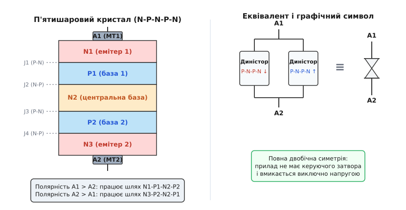
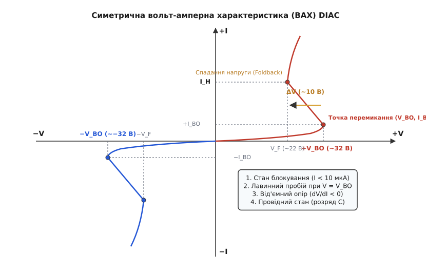
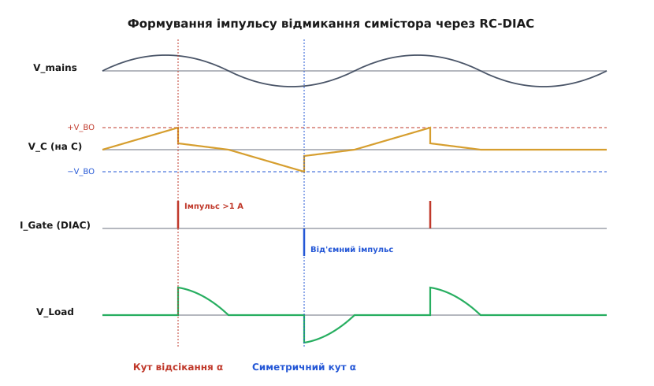
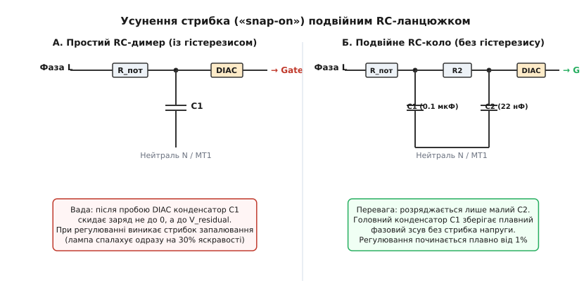

# DIAC: двобічний прилад-поріг

<preknowlist>
- [Тиристор (SCR)](root:hw-components/thyristor-scr) — чотиришарова структура p-n-p-n, лавинне наростання струму та утримання у відкритому стані.
- [Симістор (TRIAC)](root:hw-components/triac) — симетричний двонапрямний тиристорний ключ для змінного струму та квадранти керування.
- [Фазове керування](root:hw-power/phase-control-dimmer) — регулювання потужності змінного струму через зсув моменту відмикання ключа у півхвилі.
- [Стала часу RC](root:hw-analog/rc-time-constant) — експоненційне накопичення заряду на конденсаторі та фазовий зсув напруги.
- [Снабери та перехідні процеси](root:hw-power/snubbers-dvdt) — вплив швидкості наростання напруги dv/dt на напівпровідникові ключі.
</preknowlist>

Якщо спробувати керувати [силовим симістором](root:hw-components/triac) у мережі змінного струму за допомогою найпростішого регульованого фазозсувного кола — звичайного змінного резистора та конденсатора, підключеного безпосередньо до затвора, — схема відмовляється працювати стабільно. Напруга на конденсаторі наростає плавно й повільно за синусоїдально-експоненційним законом. У міру того як напруга наближається до порогу відмикання переходу затвора (близько 0.7–1.2 В), струм керування виявляється вкрай млявим, а швидкість його наростання `dI_G/dt` прямує майже до нуля.

Такий повільний «повзучий» струм у затворі фатальний для багатошарових силових напівпровідників. Замість миттєвого лавиноподібного вмикання по всій площі кремнієвої пластини симістор починає відкриватися лише в крихітній мікроскопічній точці біля контакту затвора. Увесь струм потужного навантаження (десятки чи сотні амперів) спрямовується через цю мікроскопічну ділянку, густина струму перевищує допустимі межі, виникає локальний локалізований перегрів кристала, і прилад деградує або згоряє за кілька періодів мережі.

До цього додається сильне тремтіння фази: найменші високочастотні завади чи коливання амплітуди в мережі зсувають момент перетину мікроамперного порогу струму затвора, через що яскравість ламп або оберти електродвигуна хаотично смикаються. Ба більше, оскільки симістор має різну чутливість затвора в додатній та від'ємній півхвилях (різні [квадранти запуску](root:hw-components/triac)), відмикання настає на різних кутах, виникає виражена асиметрія півхвиль, яка створює постійну складову струму й уводить у глибоке магнітне насичення мережеві трансформатори та двигуни.

Щоб подолати цю проблему, схемотехніці знадобився спеціальний пороговий двополюсник — **DIAC** *(від англ. DIode for Alternating Current — діод для змінного струму; симетричний диністор)*. Цей прилад залишається абсолютно закритим ізолятором, доки напруга на фазовому конденсаторі спокійно наростає до фіксованого високого рівня (зазвичай 30–35 В), а в мить досягнення порогу лавиноподібно «прострілює» у стан низького опору, скидаючи весь накопичений заряд конденсатора в затвор симістора у вигляді потужного, різкого мікросекундного імпульсу струму.

### Фізична структура кристала: п'ять шарів N-P-N-P-N

DIAC є повністю симетричним двовивідним напівпровідниковим приладом. На відміну від класичного [діода](root:hw-power/schottky-diode) чи [тиристора SCR](root:hw-components/thyristor-scr), він не має виділених «анода» і «катода», а також не має керуючого електрода. Його виводи зазвичай маркують як **A1** та **A2** (або **MT1** і **MT2** — *Main Terminals*). Обидва виводи електрично абсолютно рівноправні.

В основі кристала DIAC лежить монолітна п'ятишарова кремнієва структура типу **N1-P1-N2-P2-N3**.


*П'ятишарова напівпровідникова структура DIAC (ліворуч) та її еквівалентне представлення у вигляді двох зустрічно-паралельних диністорів без затворів із графічним позначенням (праворуч).*

Концентрація легуючих домішок у шарах суворо розрахована для забезпечення симетричного пробою:
* Зовнішні емітерні шари `N1` та `N3` мають високу концентрацію донорних домішок (n⁺);
* Проміжні базові шари `P1` та `P2` мають помірний рівень акцепторного легування (p);
* Центральна база `N2` є найбільш широкозонною та слаболегованою (n⁻), саме вона визначає товщину області просторового заряду (збіднення) та величину напруги пробою.

Технологічно кристали сучасних DIAC виготовляють за планарно-дифузійною технологією з пасивацією поверхні високотемпературним склом (Glass Passivated Junction). Скляне покриття торців кристала надійно герметизує виходи p-n переходів на поверхню, що гарантує стабільність струмів витоку на рівні часток мікроампера навіть при температурі кристала до +125°C і захищає від деградації при тривалій дії високої напруги.

Розглянемо фізику процесів усередині напівпровідникових переходів при зміні знаку прикладеної напруги:

1. **Додатна полярність (потенціал на виводі A1 вищий за потенціал на A2):**
   * Переходи `J1` (між шарами `N1` та `P1`) і `J3` (між `N2` та `P2`) зміщені у прямому напрямку.
   * Центральний перехід `J2` (між базовими шарами `P1` та `N2`) виявляється **зворотно зміщеним**.
   * У міру зростання зовнішньої напруги область просторового заряду переходу `J2` розширюється за законом Пуассона, приймаючи на себе практично всю прикладену різницю потенціалів. Через кристал протікає лише мізерний струм теплового витоку неосновних носіїв (зазвичай менше 5–10 мкА).
   * Коли напруженість електричного поля в переході `J2` сягає критичного значення (близько 200–300 кВ/см, що відповідає напрузі перемикання `V_BO`), починається процес ударної іонізації: вільні електрони й дірки, розігнані сильним полем, розривають ковалентні зв'язки кристалічної решітки кремнію, породжуючи нові вторинні пари носіїв.
   * Коефіцієнт лавинного множення носіїв різко зростає:
   ```
   M = 1 / (1 - (V / V_BO)ⁿ)
   ```
   * Утворені дірки дрейфують у шар `P1`, знижуючи потенційний бар'єр емітерного переходу `N1-P1`, що викликає інжекцію електронів із шару `N1`. Одночасно електрони дрейфують у шар `N2`, стимулюючи інжекцію дірок із шару `P2`.
   * Формується потужний внутрішній додатний зворотний зв'язок за принципом еквівалентної пари біполярних транзисторів (p-n-p на шарах `P2-N2-P1` та n-p-n на шарах `N1-P1-N2`).
   * Умова перемикання структури визначається сумою коефіцієнтів передачі струму емітерів `α1` та `α2` з урахуванням лавинного множення:
   ```
   M · (α1 + α2) ≥ 1
   ```
   * Щойно ця умова виконується, центральний перехід `J2` повністю затоплюється плазмою вільних носіїв заряду (стан подвійної інжекції), його динамічний опір падає майже до нуля, і кристал лавиноподібно переходить у стан високої провідності.

2. **Від'ємна полярність (потенціал на виводі A2 вищий за потенціал на A1):**
   * У роботу вступає дзеркальна половина структури.
   * Переходи `J4` (`P2-N3`) та `J2` зміщені прямо, тоді як перехід `J3` (`N2-P2`) виявляється зворотно зміщеним і блокує напругу.
   * При досягненні напруги `−V_BO` ударна іонізація виникає в переході `J3`, ініціюючи лавинне відмикання зворотного чотиришарового каналу `N3-P2-N2-P1`.

Завдяки геометричній та фізичній симетрії шарів прилад поводиться абсолютно однаково незалежно від полярності прикладеної напруги. Детальніше про те, як інженери перейшли від нестабільних газових трубок до твердотільної симетрії, описано у вставці [Історія створення DIAC та симетричних перемикачів](root:hw-components/diac/hist-diac-birth.md).

### Вольт-амперна характеристика та динамічний спад напруги (Foldback)

Вольт-амперна характеристика (ВАХ) DIAC є центрально-симетричною кривою S-подібного типу, розташованою у першому та третьому квадрантах координатної площини.


*Симетрична вольт-амперна характеристика DIAC: стан блокування до досягнення порогу V_BO, ділянка від'ємного диференційного опору, динамічний спад напруги ΔV та перехід у стан провідності з утриманням при струмі вище I_H.*

На відміну від стабілітронів або TVS-супресорів, які після досягнення напруги пробою мають додатний диференційний опір (`dV/dI > 0`) і фіксують (обмежують) напругу на стабільному рівні, DIAC принципово переходить в область **від'ємного диференційного опору** (`dV/dI < 0`). Саме ця властивість робить його активним генератором імпульсів, а не пасивним обмежувачем.

На характеристиці чітко вирізняються чотири характерні області роботи:

1. **Стан блокування (Off-State Region):**
   * Діапазон напруг від `0` до `V_BO` (для стандартного DIAC типу DB3 — від 0 до приблизно 32 В).
   * Диференційний опір приладу надзвичайно високий (понад десятки мегаомів).
   * Струм витоку не перевищує одиниць мікроамперів (`I_leak < 10 мкА`). Фазовий конденсатор у колі керування заряджається без помітних втрат енергії.

2. **Точка перемикання (Breakover Point):**
   * Характеризується **напругою перемикання** `V_BO` *(Breakover Voltage)* та **струмом перемикання** `I_BO` *(Breakover Current)*.
   * Для популярного приладу DB3 номінальна напруга становить `V_BO = 32 В` (гарантований виробничий діапазон 28–36 В), а струм перемикання становить лише `I_BO ≤ 15–50 мкА`.

3. **Ділянка від'ємного диференційного опору (Negative Differential Resistance):**
   * Щойно струм через прилад перевищує `I_BO`, внутрішній лавинний зворотний зв'язок насичує кристалічну структуру.
   * Диференційний опір `R_diff = dV / dI` стає **від'ємним**: зі зростанням струму спад напруги на виводах приладу різко падає.
   * Відбувається так зване «спадання напруги» — **динамічний спад напруги** `ΔV = V_BO - V_F` *(Dynamic Foldback Voltage)*. У приладів сімейства DB3/DB4 величина `ΔV` становить зазвичай від 5 до 10 В (типово 8–10 В). Напруга на виводах стрибком падає від ~32 В до залишкових ~22 В.

4. **Провідний стан (On-State Conduction Region):**
   * DIAC перетворюється на низькоомний провідник із внутрішнім динамічним опором усього 5–15 Ом.
   * Крізь нього протікає потужний розрядний імпульс струму амплітудою до 1–2 А, обмежений лише внутрішнім опором переходу затвора симістора та ємністю конденсатора.
   * Прилад залишається відкритим, доки струм у контурі не впаде нижче **струму утримання** `I_H` *(Holding Current)*, який становить близько 5–15 мА. Як тільки конденсатор віддав заряд і струм вичерпався, DIAC миттєво повертається у вихідний закритий стан блокування.

Порівняння DIAC з іншими пороговими напівпровідниковими елементами (високовольтними SIDAC, прецизійними SBS та одноперехідними транзисторами) наведено у вставці [Порівняння порогових приладів: DIAC, SIDAC, SBS, неонка та UJT](root:hw-components/diac/comp-threshold-triggers.md).

### Механізм релаксації та динаміка розряду RC-ланцюжка

Робота типового фазового регулятора потужності базується на узгодженій взаємодії фазозсувного [RC-ланцюжка](root:hw-analog/rc-time-constant), порогового приладу DIAC та [силового симістора](root:hw-components/triac).


*Часові діаграми роботи фазового регулятора: плавний заряд конденсатора C до порогу V_BO, миттєвий імпульс струму через DIAC у затвор симістора, відмикання силового ключа та симетричне формування напруги на навантаженні.*

Розглянемо покроково динаміку кожного півперіоду мережевої напруги:

1. **Фаза накопичення заряду:**
   На початку півхвилі напруга мережі проходить через нуль. Силовий симістор закритий. Напруга мережі починає прикладатись до послідовного ланцюжка з резистора `R` (потенціометра) та конденсатора `C`. Конденсатор плавно заряджається, напруга на ньому зростає із затримкою за фазою. DIAC у цей час закритий і не навантажує конденсатор.

2. **Момент досягнення порогу:**
   Коли напруга на конденсаторі досягає порогу `V_BO` (~32 В), DIAC зазнає лавинного пробою. Напруга на ньому миттєво падає на величину `ΔV ≈ 10 В`.

3. **Формування ударного імпульсу струму в затвор:**
   Різниця потенціалів `ΔV` миттєво прикладається до контуру, утвореного конденсатором `C`, відкритим DIAC та переходом керуючого електрода симістора (Gate — MT1). Конденсатор вивільняє накопичену енергію `W = (1/2) · C · (V_BO^2 - V_F^2)` у вигляді короткого імпульсу:

```
I_peak ≈ (V_BO - V_F - V_GT) / (R_DIAC_dyn + R_Gate)
```

де:
* `V_BO ≈ 32 В` — напруга пробою DIAC;
* `V_F ≈ 22 В` — залишкова напруга на DIAC після спаду;
* `V_GT ≈ 1.0 В` — пряме падіння на керуючому переході затвора симістора;
* `R_DIAC_dyn + R_Gate ≈ 10 + 10 = 20 Ом` — активний опір контуру розряду.

Підставивши типові значення для конденсатора `C = 100 нФ`, отримуємо піковий струм `I_peak ≈ (32 - 22 - 1.0) / 20 ≈ 0.45...1.0 А` при тривалості імпульсу всього `t_pulse ≈ 2...4 мкс`.

Швидкість наростання струму `dI_G/dt` перевищує **1 А/мкс**. Цей ударний струм миттєво інжектує гігантську концентрацію носіїв заряду в область затвора симістора, викликаючи надійне й однорідне відмикання силового кристала по всій робочій площі.

4. **Шунтування та відновлення схеми:**
   Щойно симістор відкривається, падіння напруги між його силовими виводами MT2 та MT1 колапсує до величини насичення (близько 1.2–1.5 В). Оскільки весь фазовий вузол `R-C-DIAC` увімкнений паралельно симістору, напруга живлення фазового кола падає практично до нуля.
   Струм через DIAC миттєво опускається нижче струму утримання `I_H`, і DIAC закривається, відновлюючи свій стан ізолятора. Симістор залишається у провідному стані завдяки власному струму навантаження аж до закінчення півхвилі, коли струм мережі природно переходить через нуль.

5. **Зміна полярності та квадранти запуску:**
   У наступній (від'ємній) півхвилі весь процес дзеркально повторюється. Важливо відзначити, як DIAC автоматично обирає найбільш чутливі [квадранти запуску симістора](root:hw-components/triac):
   * На додатній півхвилі: потенціал MT2 додатний відносно MT1, і затворний струм від розряду конденсатора спрямований у затвор (додатний). Це відповідає **квадранту I (MT2⁺, G⁺)** — найчутливішому режиму симістора з мінімальним порогом `I_GT`.
   * На від'ємній півхвилі: потенціал MT2 від'ємний відносно MT1, і затворний струм від розряду витікає із затвора (від'ємний). Це відповідає **квадранту III (MT2⁻, G⁻)** — другому за чутливістю та надійністю режиму.
   * Найгірший і найбільш нестабільний квадрант IV (MT2⁻, G⁺) у цій схемі **ніколи не задіюється**. Завдяки цьому досягається бездоганна симетрія відмикання симістора на обох півхвилях без жодних додаткових фазозсувних транзисторів.

Математичне виведення диференціального рівняння заряду, розрахунок кута відсікання `α` та енергетики імпульсу наведено у вставці [Математичний аналіз RC-DIAC генератора та фазового зсуву](root:hw-components/diac/math-dimmer-dynamics.md).

> 🔧 **Навіщо це.** Без DIAC фазовий регулятор на симісторі перетворюється на генератор завад і перегріву. DIAC виконує роль ідеального імпульсного реформатора: він перетворює повільний аналоговий нахил напруги `dv/dt` у жорсткий струмовий сплеск із крутим фронтом. Завдяки повній симетрії порогів для обох півхвиль навантаження живиться чистою змінною напругою без небезпечного постійного зміщення.

### Явище гістерезису («Snap-on») та схемотехніка подвійного RC-ланцюжка

При практичній реалізації найпростішого одноланкового фазового регулятора інженери стикаються з неприємним експлуатаційним дефектом — явищем **гістерезису запалювання** (відомим в англомовній літературі як *snap-on effect* або *flash-on effect*).


*Схема одинарного RC-кола з ефектом стрибка яскравості (ліворуч) та вдосконалена схема з подвійним RC-ланцюжком (праворуч), що забезпечує плавне запалювання від мінімальної потужності.*

#### Природа виникнення гістерезису
Коли ручка регулятора (потенціометра `R_pot`) викручена на максимальний опір, амплітуда напруги на конденсаторі становить, наприклад, 31 В, що трохи менше порогу `V_BO = 32 В`. DIAC не пробивається, лампа взагалі не світиться (потужність 0%).

Користувач починає дуже повільно зменшувати опір. Напруга на конденсаторі доходить до 32 В, DIAC уперше пробивається і розряджає конденсатор `C1` на величину динамічного спаду `ΔV ≈ 10 В`.
У результаті після пробою на конденсаторі залишається залишкова напруга `V_residual ≈ 22 В`.

Коли настає наступна півхвиля, конденсатор починає перезаряджатися **не з нульового рівня**, а з початкової залишкової напруги. Завдяки цьому початковому зсуву в наступній півхвилі напруга досягає порогу `V_BO` значно **раніше** за часом!

Як наслідок, регулятор не може увімкнутися плавно з 1% потужності: він раптово «спалахує» одразу на 30–40% яскравості (стрибок кута відсікання). Щоб тепер зменшити яскравість назад, користувачеві доводиться крутити потенціометр у зворотний бік набагато далі від початкової точки увімкнення. Ця різниця між порогом увімкнення та порогом згасання і є паразитичним гістерезисом.

#### Рішення: подвійний RC-ланцюжок (Double-RC Anti-hysteresis Network)
Щоб усунути стрибок, схему розділяють на два каскадні щаблі (схема Б):
1. **Перший ступінь (`R_pot + R1` та `C1 ≈ 100 нФ`):** Формує стабільний плавний фазовий зсув напруги відносно мережі.
2. **Розв'язуючий резистор `R2` (15–33 кОм):** Ізолює головний конденсатор від комутаційних перехідних процесів.
3. **Другий ступінь (`C2 ≈ 10–22 нФ` та DIAC):** Має значно меншу ємність (у 5–10 разів меншу за `C1`).

Коли напруга на `C2` сягає порогу і DIAC пробивається, розряджається виключно малий конденсатор `C2`. Завдяки високому опору резистора `R2` за короткий час імпульсу (2–3 мкс) заряд із головного конденсатора `C1` не встигає стекти.
Основний конденсатор `C1` продовжує свій плавний періодичний рух, повністю зберігаючи фазовий стан.

У результаті подвійний RC-ланцюжок дозволяє плавно регулювати потужність навантаження від 1% до 99% без жодного стрибка, роблячи рух регулятора абсолютно лінійним і передбачуваним.

### Повний розрахунок та електромагнітна сумісність практичного димера 230 В / 500 Вт

Для побудови реального надійного регулятора на 230 В потужністю 500 Вт (наприклад, для керування колекторним двигуном ручного фрезера чи лампою розжарювання) стандартна принципова схема містить шість функціональних вузлів:

1. **Силовий ключ:** Симістор типу BTA16-600B (максимальна напруга 600 В, струм до 16 А, ізольований корпус TO-220AB).
2. **Пороговий тригер:** DIAC типу DB3 (`V_BO = 32 В`, `ΔV ≥ 5 В`, корпус DO-35).
3. **Дволанковий фазозсувний фільтр:**
   * Потенціометр `R_pot = 220 кОм` (лінійна характеристика типу B);
   * Захисний постійний резистор `R1 = 4.7 кОм` (потужність 0.5 Вт, захищає потенціометр від вигорання в крайньому нульовому положенні);
   * Головний конденсатор `C1 = 0.1 мкФ` (100 нФ) на напругу не менше 400 В (металоплівковий поліпропіленовий типу MKP або MKT);
   * Розв'язуючий резистор `R2 = 22 кОм` (0.25 Вт);
   * Допоміжний конденсатор `C2 = 22 нФ` (400 В).
4. **Снаберний захисний RC-ланцюжок:**
   * При роботі на індуктивне навантаження (обмотки електродвигуна) струм відстає від напруги за фазою. У момент, коли струм переходить через нуль і симістор закривається, напруга на аноді стрибком підскакує майже до амплітудного значення мережі.
   * Швидкість наростання напруги `dv/dt` може перевищити критичне значення комутаційного відмикання симістора `(dv/dt)_c` (зазвичай 10–50 В/мкс), що викликає паразитичне самовідмикання ключа в кожній півхвилі.
   * Для демпфування паралельно симістору встановлюють послідовний ланцюжок: безіндукційний резистор `R_snub = 47–100 Ом` (1–2 Вт) та конденсатор `C_snub = 10–47 нФ` (напруга не менше 630 В).
5. **Фільтр придушення радіозавад (RFI / EMI Filter):**
   * Кожне відмикання симістора супроводжується стрибком струму з крутістю `di/dt > 50 А/мкс`. Це генерує широкий спектр електромагнітних завад у діапазоні від 150 кГц до 30 МГц, які транслюються в живильну мережу й створюють тріск у радіоприймачах та аудіоапаратурі.
   * Для відповідності міжнародним стандартам електромагнітної сумісності (EN 55014 / CISPR 14) послідовно з навантаженням встановлюють феритовий дросель індуктивністю `L = 50–100 мкГн`, розрахований на повний струм навантаження, а паралельно мережевому входу — конденсатор класу X2 ємністю `0.047–0.1 мкФ` (275 В AC).
6. **Тепловий баланс компонентів:**
   * Потужність, що виділяється на DIAC: при двох імпульсах за період (100 імпульсів на секунду при 50 Гц) середня потужність розсіювання становить:
   ```
   P_diac = 2 · f_mains · ΔW_pulse = 2 · 50 · 27·10⁻⁶ Дж = 2.7 мВт
   ```
   * Величина 2.7 мВт становить мізерні 1.8% від допустимої потужності корпусу DO-35 (150 мВт). Завдяки цьому DIAC працює в абсолютно ненапруженому тепловому режимі й залишається повністю холодним навіть при цілодобовій безперервній експлуатації.

### Фазове регулювання за переднім фронтом проти заднього фронту (Leading vs Trailing Edge)

Схема на базі `TRIAC + DIAC` реалізує класичне **фазове регулювання за переднім фронтом** *(Leading-Edge Phase Control або Forward Phase Dimming)*:
* Силовий ключ закритий на початку півхвилі й раптово відкривається в момент спрацювання DIAC, залишаючись відкритим до природного переходу струму через нуль.
* Цей метод ідеально підходить для активних резистивних навантажень (лампи розжарювання, ТЕНи, паяльники) та індуктивних навантажень (колекторні двигуни змінного струму, вентилятори, трансформаторні блоки живлення).
* Проте для ємнісних навантажень (дешеві імпульсні блоки живлення та світлодіодні LED-драйвери з випрямним мостом і фільтруючим конденсатором) регулювання за переднім фронтом створює екстремальні струмові удари: у момент відкриття симістора напруга мережі миттєво прикладається до розрядженого конденсатора LED-лампи, що призводить до струмів у десятки амперів, акустичного дзвону та передчасного виходу ламп із ладу.
* Для таких навантажень використовують регулятори за **заднім фронтом** *(Trailing-Edge / Reverse Phase Dimming)* на базі MOSFET або IGBT-транзисторів, які вмикаються плавно в нулі напруги й вимикаються посередині півхвилі. Якщо сучасні регульовані LED-лампи все ж підключають до класичного DIAC-димера, у лампу вбудовують активний баластний ланцюг (bleeder circuit), який утримує мінімальний струм через симістор вище `I_H` і згладжує комутаційний стрибок.

### Температурна стабільність, симетрія порогів та крайові режими

Як і будь-який напівпровідниковий прилад, DIAC має низку фізичних обмежень та крайових параметрів, які обов'язково враховують при проєктуванні надійних пристроїв:

1. **Температурний коефіцієнт напруги перемикання (`TC V_BO`):**
   * Оскільки в основі перемикання DIAC лежить лавинний пробій кремнієвого переходу, прилад має **додатний температурний коефіцієнт**:
   ```
   TC(V_BO) ≈ +0.05...+0.1 % / °C
   ```
   * При нагріванні кристала теплові коливання кристалічної решітки кремнію посилюються. Вільні носії заряду частіше зазнають розсіювання на фононах, зменшуючи довжину вільного пробігу. Аби набрати енергію, достатню для ударної іонізації, носіям потрібна більша напруженість електричного поля, тому напруга `V_BO` трохи зростає з температурою (при нагріванні від 25°C до 100°C поріг DB3 зростає приблизно на 1.5–2.5 В).

2. **Асиметрія напруг перемикання (`ΔV_BO`):**
   * Визначається як абсолютна різниця між порогами у додатній та від'ємній півхвилях:
   ```
   ΔV_BO = | +V_BO | - | −V_BO |
   ```
   * У якісних приладів (DB3, DB4) паспортне значення асиметрії не перевищує `ΔV_BO ≤ 2...3 В`. Якщо асиметрія більша, моменти відкриття симістора в сусідніх півхвилях відрізнятимуться на кілька градусів, що згенерує паразитну постійну складову струму в навантаженні.

3. **Ефект швидкості наростання напруги (`dv/dt`):**
   * Внутрішні p-n переходи закритого DIAC мають власну бар'єрну ємність `C_j` (близько 10–30 пФ).
   * При появі в мережі надшвидких стрибків напруги з високою швидкістю наростання `dv/dt` (наприклад, від комутації потужних індуктивних навантажень сусідніх споживачів) через бар'єрну ємність тече струм зміщення `i = C_j · (dv/dt)`.
   * Якщо цей ємнісний струм перевищить величину струму перемикання `I_BO`, DIAC може хибно відкритися задовго до досягнення напруги `V_BO`. Для захисту від таких хибних спрацьовувань застосовують паралельні RC-[снабери](root:hw-power/snubbers-dvdt) та варистори.

4. **Граничні імпульсні та теплові параметри:**
   * DIAC розрахований суто на **імпульсний режим роботи**.
   * Максимальний повторюваний піковий струм розряду `I_TRM` для серії DB3 становить до **2.0 А** (при частоті до 120 Гц і тривалості імпульсу не більше 10–20 мкс).
   * Постійна потужність розсіювання приладу не перевищує `P_tot ≈ 150 мВт`. Спроба використати DIAC як безперервний стабілізатор або лінійний обмежувач напруги призведе до його миттєвого теплового руйнування.

### Типові несправності схем на DIAC та методи діагностики

При ремонті та налагодженні симісторних регуляторів із DIAC несправності порогового вузла зазвичай проявляються чотирма характерними симптомами:

1. **Повне зникнення регулювання (навантаження постійно вимкнене):**
   * Найчастіша причина — обрив DIAC внаслідок імпульсного перевантаження за струмом або пробій фазового конденсатора `C1` / `C2` накоротко.
   * *Діагностика:* Звичайний мультиметр у режимі перевірки діодів показує «обрив» (нескінченний опір) навіть на справному DIAC, оскільки тестова напруга мультиметра (зазвичай 1.5–3.0 В) набагато нижча за поріг пробою 32 В! Для перевірки DIAC збирають просте тестове коло: джерело регульованої постійної напруги 0–50 В, послідовний резистор 10 кОм і вольтметр паралельно DIAC. При плавному підйомі напруги вольтметр має зафіксувати зростання до 32 В із наступним різким зривом до 22 В.

2. **Однопівперіодна робота (лампа світить упівсили, двигун сильно гуде й гріється):**
   * Причина — втрата симетрії або однобічний внутрішній пробій одного з зустрічних переходів DIAC.
   * Прилад пробивається при напрузі +32 В у додатній півхвилі, але залишається відкритим накоротко або повністю закритим у від'ємній. У результаті симістор відкривається лише в одному напрямку, перетворюючи схему на однопівперіодний випрямляч. Постійний струм викликає швидке теплове руйнування статора двигуна або трансформатора.

3. **Мерехтіння та хаотичні зриви фази на малих обертах:**
   * Причина — висихання або деградація ємності плівкових конденсаторів `C1` чи `C2`, або забруднення доріжки змінного резистора.
   * Зниження ємності `C1` зміщує діапазон фазового зсуву, через що напруга на DIAC балансує на грані порогу 32 В і зривається від найменшої мережевої нестабільності.

### Підсумковий огляд

DIAC — це зразок витонченого інженерного мінімалізму в силовій електроніці. Об'єднавши в мініатюрному скляному корпусі п'ятишарову структуру з лавинним пробоєм і від'ємним диференційним опором, він вирішив проблему надійного керування симісторами без застосування допоміжних джерел живлення, мікроконтролерів чи громіздких імпульсних трансформаторів. Завдяки передбачуваній напрузі порогу 32 В, високому піковому струму розряду та повній симетрії півхвиль DIAC уже понад півстоліття залишається незмінним стандартом побутової та промислової комутації змінного струму.
