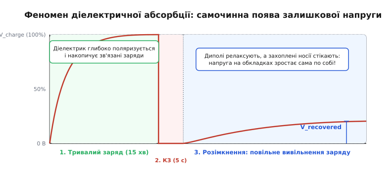
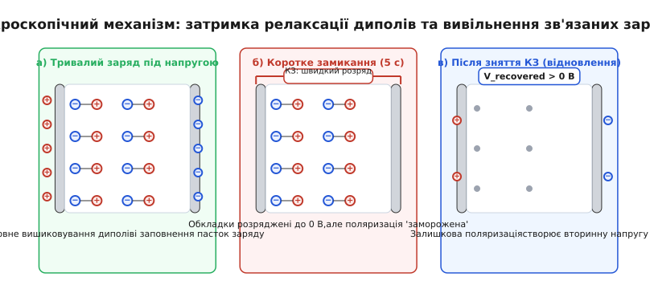
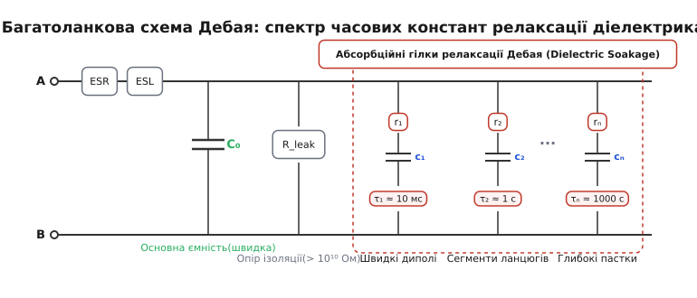
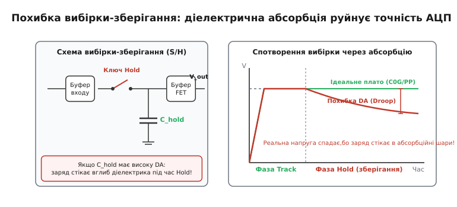
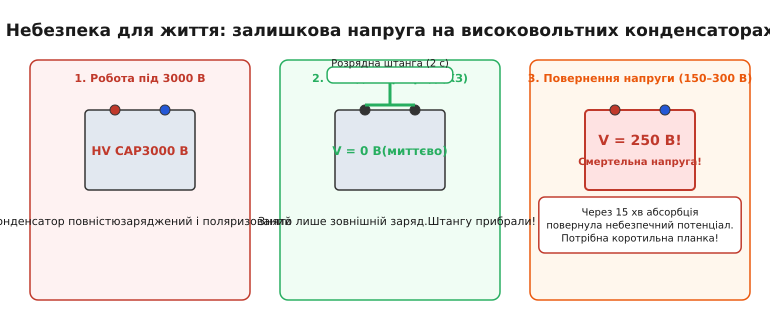

# Діелектрична абсорбція

<preknowlist>
- [Ємність](root:ph-electromagnetism/capacitance) — накопичення заряду та відношення Q = C·V.
- [Діелектрики конденсаторів](root:hw-components/capacitor-dielectrics) — матеріали ізоляторів, відносна діелектрична проникність та поляризація.
- [Паразити конденсатора](root:hw-components/capacitor-parasitics) — послідовний опір ESR, індуктивність ESL та опір витоку.
- [Поляризація діелектрика](root:ph-electromagnetism/electric-polarization) — мікроскопічні механізми зміщення зарядів у зовнішньому електричному полі.
- [Вибірка і зберігання в АЦП](root:hw-analog/adc-sample-hold) — фіксація миттєвої напруги на ємності для перетворення.
- [Інтегратор і диференціатор на ОП](root:hw-analog/integrator-differentiator) — накопичення заряду у зворотному зв'язку операційного підсилювача.
</preknowlist>

Прецизійний шістнадцятибітний аналогово-цифровий перетворювач у системі збору даних виконує вимірювання напруги датчика. Перед початком циклу ключ скидання замикає виводи накопичувального конденсатора на загальний провід, розряджаючи його клеми до нуля вольтів, що підтверджує контрольний вольтметр. Ключ розмикається, вхідний сигнал ще не подано, але за кілька секунд на клемах конденсатора без будь-якого зовнішнього живлення спонтанно виникає напруга в кілька десятків мілівольтів. Якщо розряджання повторити ще раз коротким дотиком, напруга спаде до нуля і знову почне повільно підніматися. Цей ефект не є наслідком наводок чи витоків по друкованій платі: сам діелектрик повернув частину заряду, яку він перед цим увібрав у власну структуру.

### Феномен самочинного повернення напруги

Явище самочинної появи електричного потенціалу на виводах попередньо зарядженого, а потім короткочасно розрядженого конденсатора називають **діелектричною абсорбцією** (*dielectric absorption*, або скорочено **DA**; від лат. *absorptio* — поглинання). В інженерній практиці цей ефект також відомий під назвами **ефект пам'яті діелектрика**, **діелектричне замочування** (*dielectric soakage*) або **батарейний ефект** (*battery effect*).


*Часова діаграма діелектричної абсорбції. Після тривалого заряджання напругою V_charge конденсатор короткочасно замикають накоротко, обнуляючи поверхневий заряд обкладок. Після розмикання виводів релаксація внутрішньої поляризації діелектрика формує відновлену напругу V_recovered.*

Якщо підключити конденсатор до джерела постійної напруги `V_charge` на тривалий час (наприклад, на 15 хвилин), електричне поле змушує заряди всередині ізолятора зміщуватися. Якщо після цього замкнути виводи конденсатора накоротко на кілька секунд, струм розряду швидко спаде до нуля, і різниця потенціалів між металевими обкладками зникне. Проте якщо тепер розімкнути коло і залишити виводи конденсатора ізольованими, напруга на них почне поступово зростати, досягаючи величини `V_recovered`.

Для неякісних або невідповідних діелектриків ця відновлена напруга може становити від 1% до 15% від початкової робочої напруги. Якщо конденсатор працював під напругою 100 В, після швидкого розряджання на ньому може самочинно відновитися до 15 В. У високоточних вимірювальних трактах навіть частка відсотка відновленої напруги означає повну втрату розрядності перетворювача.

### Мікроскопічна фізика: чому діелектрик «вбирає» заряд

З погляду електродинаміки конденсатор не є просто двома провідними площинами, розділеними вакуумом. Між його обкладками розташовано твердий або рідкий діелектрик — складну молекулярну чи кристалічну структуру, яка під дією зовнішнього поля зазнає поляризації.


*Фізична картина процесів у діелектрику: а) вишиковування диполів та накопичення носіїв у глибоких пастках під дією поля; б) розряджання вільних електронів з металевих обкладок за збереження внутрішньої поляризації; в) повільна релаксація внутрішніх диполів, що індукує вторинний заряд на обкладках.*

У діелектрику одночасно діють кілька механізмів поляризації, які кардинально відрізняються своєю швидкістю та фізичною природою:

1. **Електронна поляризація** (пружний зсув електронних хмар відносно позитивно заряджених ядер) та **пружна іонна поляризація** (зсув різнойменних іонів у кристалічній ґратці). Ці процеси відбуваються квазімиттєво — за час порядка `10⁻¹⁵…10⁻¹²` секунди. Вони майже не залежать від температури та частоти аж до оптичного діапазону. Саме вони визначають високочастотну проникність матеріалу і формують основну, безінерційну «швидку» ємність конденсатора.
2. **Орієнтаційна (дипольна) релаксаційна поляризація**. У матеріалах із полярними молекулами або полярними сегментами полімерних ланцюгів (наприклад, у поліетилентерефталаті чи сегнетоелектричній кераміці) постійні диполі повертаються вздовж силових ліній поля. Цьому обертанню чинить опір в'язкість середовища, внутрішнє тертя та потенційні бар'єри сусідніх атомів. Поворот диполя вимагає подолання активаційного енергетичного бар'єра, тому процес релаксації має виражений часовий та температурний характер: константи часу лежать у діапазоні від мікросекунд до десятків хвилин.
3. **Міжфазна поляризація Максвелла — Вагнера та просторовий заряд** (*trapped charges*). У реальних неоднорідних або шаруватих діелектриках (кераміці з границями зерен, пористих оксидних плівках, полімерах із наповнювачами) завжди присутні вільні або слабко зв'язані носії заряду (іони домішок, вакансії ґратки, електрони в зонах локалізації). Під дією зовнішнього поля ці носії повільно дрейфують крізь товщу матеріалу, доки не застрягають у глибоких енергетичних пастках на границях розділу фаз або структурних дефектах. Час такого дрейфу й накопичення може сягати сотень і тисяч секунд.

Коли конденсатор тривалий час перебуває під напругою, повільні механізми встигають повністю завершитися: диполі вишиковуються вздовж поля, а просторовий заряд заповнює пастки в глибині структури. Діелектрик «насичується» зарядом, немов губка водою.

Коли виводи конденсатора замикають накоротко на кілька секунд, поверхневі заряди з металевих обкладок миттєво компенсуються через зовнішнє коло — електронна поляризація зникає, і напруга на виводах стає рівною нулю. Проте важкі полярні групи та просторові заряди в пастках за кілька секунд розрядитися не встигають: їхня просторова конфігурація залишається «замороженою».

Тієї миті, коли коротке замикання знімають, зовнішнє поле на обкладках відсутнє, але всередині діелектрика зберігається залишкова внутрішня поляризація. Під дією теплового руху диполі починають хаотизуватися, а захоплені носії повільно вивільняються з пасток. Зміна внутрішнього поля діелектрика викликає перерозподіл зарядів на металевих обкладках, які тепер електрично ізольовані. На обкладках накопичується вільний електричний заряд протилежного знака, який і створює спостережувану відновлену напругу `V_recovered`.

Температура суттєво впливає на швидкість релаксації. Згідно з законом Арреніуса, підвищення температури збільшує ймовірність подолання енергетичних бар'єрів диполями та носіями в пастках. Тому при нагріванні релаксаційні константи часу скорочуються: конденсатор швидше віддає накопичений заряд, а пік відновленої напруги зміщується у бік коротших часових інтервалів.

> 📜 **Історичний екскурс:** [Відкриття діелектричного замочування: від банок Фарадея до аналогових ЕОМ](root:hw-components/dielectric-absorption/hist-soakage-discovery.md) розповідає про те, як Майкл Фарадей уперше натрапив на залишкову поляризацію скла у 1837 році, як підводні телеграфні кабелі спотворювали сигнали через абсорбцію в гутаперчі, та як інженери аналогових обчислювальних машин середини XX століття долали дрейф інтеграторів.

### Еквівалентна багатоланкова модель Дебая

Описані фізичні процеси неможливо адекватно описати за допомогою класичної зосередженої ємності `C`. Щоб врахувати спектр релаксаційних процесів, інженери та фізики використовують розширену еквівалентну схему Дебая (*Debye relaxation model*), де паралельно до ідеальної ємності підключається набір послідовних `r-c` кіл із різними часовими константами.


*Повна еквівалентна схема реального конденсатора. Крім основної ємності C₀, опору витоку R_leak, ESR та ESL, модель містить множину паралельних гілок (r₁-c₁, r₂-c₂, ..., rₙ-cₙ), які відтворюють часовий спектр діелектричної абсорбції.*

У цій схемі елементи виконують такі ролі:

* `C0` — основна («швидка») ємність конденсатора, зумовлена електронною та миттєвою іонною поляризацією.
* `ESR` (*Equivalent Series Resistance*) — активний опір металевих виводів, напилення обкладок та контакту.
* `ESL` (*Equivalent Series Inductance*) — паразитна індуктивність виводів та конструкції обкладок.
* `R_leak` (або `R_insulation`) — опір ізоляції діелектрика постійному струму (зазвичай перевищує `10¹⁰…10¹⁴` Ом).
* Гілки `(r₁ - c₁)`, `(r₂ - c₂)`, ..., `(rₙ - cₙ)` — релаксаційні ланки Дебая.

Кожна `i`-та релаксаційна гілка моделює окрему групу диполів або тип просторових пасток заряду зі своєю характерною константою часу релаксації:

```
τᵢ = rᵢ · cᵢ
```

Сумарна низькочастотна ємність конденсатора при нескінченно повільному заряді дорівнює сумі всіх паралельних ємностей:

```
C_static = C0 + ∑ cᵢ
```

Якщо до конденсатора прикладено напругу протягом короткого імпульсу `t_pulse << τ₁`, струм встигає зарядити лише ємність `C0`. Повільні ємності `cᵢ` залишаються незарядженими через великий опір послідовних резисторів `rᵢ`. Якщо ж напруга прикладена тривалий час `t >> τₙ`, усі ємності `cᵢ` заряджаються до повної прикладеної напруги.

Під час короткого замикання тривалістю `t_discharge` ємність `C0` миттєво розряджається через низький зовнішній опір. Водночас кожна ємність `cᵢ` встигає віддати лише мізерну частку свого заряду, оскільки струм її розряду обмежений власним внутрішнім резистором `rᵢ`. Після розмикання кола заряд із частково заряджених ємностей `cᵢ` починає перетікати назад в основну ємність `C0`, піднімаючи загальну напругу на клемах за законом:

```
V(t) = ∑ [ V_charge · (cᵢ / (C0 + cᵢ)) · (1 - e^(-t_charge / τᵢ)) · e^(-t_discharge / τᵢ) · (1 - e^(-t / τᵢ)) ]
```

Оскільки реальний діелектрик містить величезну кількість різних енергетичних станів, константи часу `τᵢ` утворюють неперервний спектр від мілісекунд до десятків годин.

У частотній області це призводить до появи частотно-залежної комплексної ємності. На низьких частотах конденсатор має повну ємність `C_static`, а з підвищенням частоти повільні гілки «вимикаються», зменшуючи ефективну ємність до величини `C0` та породжуючи діелектричні втрати, пропорційні уявній частині проникності.

> 🧮 **Математична вставка:** [Математична модель релаксації Дебая та імпеданс діелектрика](root:hw-components/dielectric-absorption/math-debye-relaxation.md) містить строге аналітичне виведення рівнянь релаксації в часовій та частотній областях, аналіз розтягнутої експоненти Кольрауша, а також розрахунок комплексної діелектричної проникності `ε*(ω)`.

### Метрологія: вимірювання відсотка DA за стандартом MIL-PRF-19978D

Оскільки відновлена напруга залежить від часу заряджання, тривалості короткого замикання та часу витримування після розмикання, порівнювати матеріали конденсаторів можна лише за строго стандартизованою методикою.

Основним міжнародним та військовим стандартом вимірювання діелектричної абсорбції є **MIL-PRF-19978D** (або цивільний стандарт EIA-381 / IEC 60384-1).

Процедура стандартизованого тесту складається з чотирьох послідовних кроків:

1. **Етап підготовки та заряджання (`t_charge = 15 хв`)**: до досліджуваного конденсатора прикладають номінальну постійну напругу `V_charge` протягом рівно 15 хвилин (900 секунд). Цього часу достатньо для заповнення більшості релаксаційних станів із константами часу до кількох хвилин.
2. **Етап короткочасного розряджання (`t_discharge = 5 с`)**: джерело напруги відмикають, а виводи конденсатора замикають накоротко через резистор опором `5 Ом` (або прямим замиканням) на час рівно 5 секунд. За цей інтервал швидка ємність `C0` повністю розряджається до нуля.
3. **Етап розімкнення та відновлення (`t_wait = 1 хв`)**: замикач розмикають, і конденсатор залишають ізольованим. Вимірювальний прилад фіксує напругу `V_recovered` рівно через 1 хвилину (60 секунд) після розмикання.
4. **Обчислення коефіцієнта абсорбції**: відсоткове значення коефіцієнта діелектричної абсорбції визначають як відношення відновленої напруги до початкової напруги заряду:

```
DA = (V_recovered / V_charge) · 100%
```

**Приклад розрахунку для реальних компонентів.**
Прикладемо тестову напругу `V_charge = 10.0 В` до двох конденсаторів ємністю `1 мкФ`: танталового електролітичного та плівкового поліпропіленового.

Для танталового конденсатора відновлена напруга через 1 хвилину становить `V_recovered = 0.50 В`:
```
DA = (0.50 В / 10.0 В) · 100%
= 0.05 · 100%                 [ділення відновленої напруги на напругу заряду]
= 5.0%                        [переведення у відсотки]
```

Для прецизійного поліпропіленового конденсатора відновлена напруга становить лише `V_recovered = 0.0015 В` (1.5 мВ):
```
DA = (0.0015 В / 10.0 В) · 100%
= 0.00015 · 100%              [ділення відновленої напруги на напругу заряду]
= 0.015%                      [переведення у відсотки]
```

Різниця між цими типами конденсаторів сягає понад 330 разів.

Під час проведення таких вимірювань критично важливо використовувати вимірювальний буфер або електрометр із власним вхідним опором не менше ніж `10¹²…10¹⁴ Ом` та струмом зміщення входу менше ніж `100 фА`. Звичайний цифровий мультиметр із вхідним опором `10 МОм` миттєво розрядить відновлений заряд за долі секунди, показавши нульовий результат і спотворивши вимірювання.

> ⚙️ **Практичний проект:** [Прецизійний вимірювач діелектричної абсорбції на польовому буфері](root:hw-components/dielectric-absorption/proj-measure-soakage.md) детально описує схемотехніку вимірювального стенда на герконових реле з ультранизьким струмом витоку та прошивку контролера з таймінгами за стандартом MIL-PRF-19978D.

### Порівняльний аналіз матеріалів діелектриків

Величина діелектричної абсорбції безпосередньо визначається хімічною будовою та типом мікроструктури діелектрика.

| Матеріал діелектрика | Типове значення DA, % | Механізм поляризації | Основна сфера застосування |
| :--- | :--- | :--- | :--- |
| **Електролітичні алюмінієві** | 5.0% … 15.0% | Глибока іонна поляризація рідкого електроліту та оксидної плівки Al₂O₃ | Фільтри вторинного живлення, згладжування пульсацій |
| **Твердотільні танталові** | 3.0% … 8.0% | Дефекти та міжфазні стани в оксидному шарі Ta₂O₅ / MnO₂ | Компактні кола розв'язки живлення |
| **Кераміка класу 2 (X7R, X5R)** | 1.0% … 5.0% | Рух доменних стінок сегнетоелектрика BaTiO₃ | Блокувальні конденсатори живлення мікросхем |
| **Кераміка класу 3 (Y5V, Z5U)** | 2.0% … 10.0% | Високополярні сегнетоелектричні домени з релаксацією | Низьковольтні блокувальні кола загального призначення |
| **Поліетилентерефталат (PET / Mylar)** | 0.2% … 0.5% | Орієнтація полярних ефірних зв'язків у полімерному ланцюзі | Кола змінного струму, блокування, фільтри загального призначення |
| **Полікарбонат (PC)** | 0.08% … 0.15% | Помірно полярні карбонатні групи | Високостабільні фільтри (історичний матеріал) |
| **Кераміка класу 1 (C0G / NP0)** | < 0.05% … 0.10% | Неполярні титанати та силікати без сегнетоелектричних доменів | Прецизійні ВЧ-кола, фільтри, інтегратори малої ємності |
| **Поліфеніленсульфід (PPS)** | 0.05% … 0.10% | Жорсткий симетричний ароматичний ланцюг | SMD-плівкові конденсатори для точних схем |
| **Поліпропілен (PP)** | 0.01% … 0.02% | Неполярний симетричний вуглеводневий полімер без дипольних моментів | Схеми вибірки-зберігання, прецизійні інтегратори, фільтри звуку |
| **Полістирол (PS)** | 0.01% … 0.02% | Неполярний вуглеводневий ланцюг із бензольними кільцями | Еталонні конденсатори, аналогові обчислювачі |
| **Політетрафторетилен (PTFE / Teflon)** | 0.005% … 0.01% | Повна симетрія зв'язків C-F, нульовий власний дипольний момент | Електрометричні прилади, еталони заряду, аерокосмічні системи |

З таблиці видно чітку фізичну закономірність:

* **Полярні діелектрики та сегнетоелектрики** (електроліти, кераміка X7R, плівка Mylar) забезпечують високу питому ємність на одиницю об'єму завдяки великому значенню відносної діелектричної проникності `ε_r`. Проте платою за високу проникність є висока діелектрична абсорбція (від 0.5% до 15%). Їх заборонено використовувати в ланцюгах аналогової обробки сигналів, чутливих до форми та напруги.
* **Неполярні полімери та параелектрики** (поліпропілен, тефлон, кераміка C0G) мають низьку діелектричну проникність (`ε_r ≈ 2.1…3.0`), тому конденсатори на їхній основі мають більші габарити та меншу питому ємність. Проте за рахунок симетричної молекулярної будови в них повністю відсутня дипольна релаксація: діелектрична абсорбція становить мізерні частки сотої відсотка.

> 🔌 **Компонентна вставка:** [Порівняльний довідник діелектриків та вибір конденсаторів для прецизійних кіл](root:hw-components/dielectric-absorption/comp-dielectric-table.md) містить поглиблений аналіз конструкцій плівкових, керамічних та слюдяних конденсаторів, графіки частотної залежності втрат та правила підбору компонентів для прецизійної апаратури.

### Вплив на схемотехніку: точки руйнування точності

Діелектрична абсорбція є прихованим ворогом розробника аналогових трактів. У багатьох схемах вона проявляється не як звичайний постійний зсув або лінійне ослаблення, а як динамічна нелінійна похибка з тривалим часом пам'яті.

#### 1. Схеми вибірки-зберігання (Sample-and-Hold / Track-and-Hold)

Пристрої вибірки-зберігання використовуються на вході аналогово-цифрових перетворювачів для миттєвої фіксації напруги на час перетворення.


*Механізм спотворення напруги в схемі вибірки-зберігання. Короткий час вибірки Track не дозволяє зарядитися внутрішнім релаксаційним ємностям. У фазі Hold заряд перерозподіляється з поверхні в глибину діелектрика, викликаючи нелінійне просідання напруги.*

У фазі вибірки (*Track*) аналоговий ключ замикається на короткий інтервал часу `t_sample` (наприклад, 1 мкс). За цей час основна ємність `C0` накопичувального конденсатора `C_hold` заряджається до поточної напруги вхідного сигналу `V_in`. Проте високоомні абсорбційні гілки Дебая `(rᵢ - cᵢ)` за 1 мкс зарядитися не встигають.

Коли схема переходить у режим зберігання (*Hold*), ключ розмикається. Конденсатор `C_hold` залишається ізольованим. Тієї ж миті заряд з основної ємності `C0` починає повільно перетікати у внутрішні релаксаційні ємності `cᵢ`. Напруга на виході буфера починає самочинно спадати (*voltage droop*).

Якщо ж попередній відлік мав високу напругу, а новий — низьку, відбувається зворотний процес: внутрішній заряд релаксаційних гілок почне перетікати назад на обкладки, піднімаючи напругу зберігання вище за реальне значення вибірки.

Для 16-бітного АЦП з опорною напругою 5 В ціна одного молодшого розряду (LSB) становить:

```
1 LSB = 5 В / 65536 ≈ 76.3 мкВ
```

Якщо в накопичувачі `C_hold` використано майларовий конденсатор із `DA = 0.2%`, похибка перерозподілу заряду при перепаді сигналу на 4 В складе:

```
V_error = 4 В · 0.002 = 8 мВ = 8000 мкВ
```

Ця похибка дорівнює `8000 / 76.3 ≈ 105 LSB`. Перетворювач замість 16 біт реальної точності забезпечить менше 10 біт. Заміна діелектрика на поліпропіленовий (`DA = 0.01%`) знижує похибку до 0.4 мВ (близько 5 LSB), а використання тефлону або кераміки C0G робить її меншою за 0.5 LSB.

#### 2. Конденсаторні ЦАП у SAR АЦП та багатоканальні мультиплексори

В аналого-цифрових перетворювачах послідовного наближення (*SAR ADC*) архітектура з ємнісним перерозподілом заряду (*Charge Redistribution CDAC*) використовує матрицю внутрішніх двійково-зважених конденсаторів.

Якщо мультиплексор швидко перемикає канали з різними напругами (наприклад, канал 1 має +10 В, а канал 2 має 0 В), діелектрик матриці конденсаторів зберігає залишкову поляризацію від попереднього каналу. Цей ефект пам'яті створює міжканальне перехресне спотворення (*cross-talk*), яке неможливо усунути збільшенням часу затримки комутатора.

#### 3. Інтегратори на операційних підсилювачах та аналогові обчислювачі

В інтеграторі на операційному підсилювачі струм вхідного сигналу інтегрується накопичувальним конденсатором `C_int`, розташованим у ланцюзі негативного зворотного зв'язку.

```
V_out(t) = - (1 / (R_in · C_int)) · ∫ V_in(t) dt
```

Перед початком нового циклу інтегрування конденсатор `C_int` скидають у нуль, замикаючи паралельний польовий транзистор або герконове реле. Якщо використовується конденсатор із помітною діелектричною абсорбцією, після розмикання ключа скидання напруга на виході інтегратора починає самочинно дрейфувати, створюючи фіктивну початкову напругу зміщення.

В аналогових обчислювальних машинах 1950-х років та прецизійних інтеграторах заряду (електрометрах, пікоамперметрах, дозиметрах іонізаційного випромінювання) використання слюдяних або паперових конденсаторів викликало систематичну похибку інтегрування до 2–5% на кожну секунду роботи. Проблему було розв'язано лише з появою прецизійних полістирольних (Styroflex) та тефлонових конденсаторів.

#### 4. Підсилювачі заряду для п'єзоелектричних датчиків

У вимірювальних трактах віброакустики та динамічного тиску п'єзоелектричні сенсори підключають до підсилювачів заряду (*Charge Amplifiers*). Датчик генерує крихітний електричний заряд `Q` (порядку пікокулонів), який переноситься на конденсатор зворотного зв'язку `C_feedback` операційного підсилювача, формуючи вихідну напругу `V_out = -Q / C_feedback`.

Якщо конденсатор зворотного зв'язку має навіть незначну діелектричну абсорбцію, після різкого ударного імпульсу тиску частина заряду пікокулонного діапазону поглинається релаксаційними пастками діелектрика. Напруга на виході підсилювача не повертається до істинного нуля після завершення механічного удару, а формує довгий фальшивий експоненційний хвіст протилежного знака. Це призводить до грубих помилок у системах моніторингу вібрації турбін та датчиках детонації двигунів. У таких вузлах припустиме застосування виключно герметичних тефлонових або полістирольних конденсаторів.

#### 5. АЦП подвійного інтегрування (Dual-Slope та Multi-Slope)

У високоточних цифрових вольтметрах (DMM) розрядністю 6.5–8.5 цифр традиційно застосовують АЦП подвійного інтегрування. Цикл перетворення складається з двох фаз:
1. Інтегрування невідомої вхідної напруги протягом фіксованого часу `T_integrate`.
2. Розряджання інтегрувального конденсатора стабільним опорним струмом зворотного знака до повернення вихідної напруги компаратора в нуль за вимірюваний інтервал `T_deintegrate`.

В ідеальному інтеграторі відношення часів строго пропорційне напрузі: `T_deintegrate / T_integrate = V_in / V_ref`. Проте під час фази інтегрування вхідного сигналу частина заряду перетікає в релаксаційні шари діелектрика інтегрувального конденсатора. Під час фази розряджання цей заряд повільно повертається назад, затягуючи час розряду. У результаті передатна функція вольтметра стає нелінійною (порушується інтегральна нелінійність INL). Саме тому в прецизійних мультиметрах (наприклад, Agilent/Keysight 3458A чи Keithley 2001) інтегрувальний конденсатор завжди виготовляють із дорогого високоочищеного поліпропілену або полістиролу в герметичному екранованому корпусі.

#### 5. Фазові та активні фільтри низьких частот

Через наявність уявної частотно-залежної складової ємності `C(ω)` діелектрична абсорбція призводить до зміщення частоти зрізу та появи фазового тремтіння в прецизійних активних фільтрах високого порядку (наприклад, фільтрах Бесселя чи Баттерворта). У звукових трактах високої вірності відтворення (Hi-Fi) абсорбція в міжкаскадних конденсаторах розмиває динамічний діапазон і спотворює передачу коротких ударних імпульсів.

---

### Схемотехнічні прийоми компенсації діелектричної абсорбції

Коли габарити, вартість або поверхневий монтаж (SMD) не дозволяють встановити об'ємний поліпропіленовий конденсатор, інженери застосовують схемотехнічні методи активної або цифрової компенсації абсорбції:

1. **Апаратна компенсація синтезом зустрічної моделі Дебая**. В інтеграторах паралельно з основним підсилювачем будують допоміжний коригувальний ланцюг на операційному підсилювачі та RC-елементах, параметри якого дзеркально повторюють домінуючі гілки `r₁ - c₁` діелектрика. Вихідний струм коригувального ланцюга подається у підсумовувальний вузол інтегратора у протифазі, компенсуючи витік заряду в діелектрик. Цей прийом дозволяє зменшити ефективну похибку абсорбції в 10–50 разів.
2. **Апаратне подовження фази вибірки (Auto-Zero / Pre-charge)**. У схемах вибірки-зберігання перед основною вибіркою вводять додаткову фазу попереднього заряду (*pre-charge phase*), під час якої конденсатор підключають до наближеного джерела напруги, даючи абсорбційним гілкам частково насититися до початку точного вимірювання.
3. **Цифрова пост-фільтрація (IIR Deconvolution)**. Оскільки поведінка діелектричної абсорбції лінійна відносно напруги заряду, у мікроконтролері або DSP-процесорі відліки АЦП пропускають крізь нескінченний імпульсний фільтр (IIR), вагові коефіцієнти якого відповідають оберненій передатній функції моделі Дебая. Знаючи історію попередніх відліків, алгоритм вираховує накопичену залишкову напругу і віднімає її від поточного результату вимірювання.

---

### Смертельна небезпека високовольтних конденсаторів

Якщо в слабкострумовій електроніці діелектрична абсорбція є причиною втрати точності вимірювань, то в силовій та високовольтній техніці вона становить безпосередню загрозу для життя інженерів та технічного персоналу.


*Небезпека діелектричної абсорбції у високовольтних накопичувачах: короткочасне замикання знімає лише миттєвий заряд, після чого повільна внутрішня релаксація здатна відновити смертельний рівень напруги на відімкнених клемах.*

Високовольтні конденсатори великої ємності застосовуються в імпульсних джерелах живлення, лазерних установках, дефібриляторах, рентгенівських апаратах, передавачах радіолокаторів та батареях корекції коефіцієнта потужності (PFC). Робоча напруга таких накопичувачів становить від 1000 до 30 000 вольтів при ємностях у сотні й тисячі мікрофарад.

Типовий сценарій нещасного випадку:

1. Установку знеструмлюють перед проведенням профілактичних або ремонтних робіт.
2. Сервісний інженер розряджає високовольтний конденсатор за допомогою заземлювальної штанги з розрядним резистором. Контрольний вольтметр показує `0.0 В`.
3. Інженер прибирає заземлювальну штангу і береться за виводи конденсатора руками або інструментом.
4. Проте за час роботи під напругою 5000 В діелектрик (маслонаповнений папір, лавсан або високовольтна кераміка) зазнав глибокої абсорбції.
5. За 5–15 хвилин після зняття закоротки внутрішня поляризація відновлює на виводах від 5% до 10% робочої напруги:

```
V_recovered = 5000 В · 0.08 = 400 В
```

Напруга 400 В при ємності 100 мкФ запасає енергію:

```
E = 0.5 · C · V²
= 0.5 · (100 × 10⁻⁶ Ф) · (400 В)²   [підстановка параметрів ємності та напруги]
= 0.5 · 10⁻⁴ · 160000               [піднесення до квадрата]
= 8 Дж                              [обчислення енергії розряду]
```

Енергія розряду понад `5…10 Дж` при напрузі понад 300 В, що проходить крізь тіло людини через руку до грудної клітки, є смертельно небезпечною і здатна викликати фібриляцію серця, параліч дихання та тяжкі внутрішні термічні опіки.

#### Правила інженерної безпеки при роботі з високовольтними конденсаторами:

* **Постійно встановлені розрядні резистори (*Bleeder resistors*)**: кожен високовольтний конденсатор або блок живлення зобов'язаний мати паралельно підключений високоомний розрядний резистор, який неможливо відімкнути перемикачем. Номінал резистора розраховують так, щоб час автоматичного розряджання до безпечного рівня (< 50 В) не перевищував 1–5 хвилин після вимкнення живлення.
* **Захисні закорочувальні перемички (*Safety Shorting Straps*)**: під час транспортування, зберігання або тривалого обслуговування виводи високовольтних конденсаторів **завжди повинні бути замкнені металевою перемичкою** або гнучким провідником із затискачами типу «крокодил». Перемичку знімають лише безпосередньо перед подачею напруги в зібраній схемі.
* **Зберігання нових конденсаторів**: заводські високовольтні паперові, плівкові та керамічні конденсатори завжди відвантажуються виробником із закороченими клемами (за допомогою дротяної стяжки або провідної фольги), щоб унеможливити накопичення потенціалу через зміну температури, тиску та залишкової абсорбції під час транспортування.

---

> 🔧 **Навіщо це.** Діелектрична абсорбція — це фундаментальний параметр вибору конденсатора там, де має значення точність або безпека:
>
> 1. **У вимірювальних та аналогових схемах**: для пристроїв вибірки-зберігання, аналогових інтеграторів, пікових детекторів та високоточних активних фільтрів використовуйте **виключно поліпропіленові (PP), тефлонові (PTFE) або прецизійні керамічні (C0G/NP0)** конденсатори. Ніколи не ставте в ці вузли кераміку X7R/Y5V чи майларові плівкові конденсатори.
> 2. **У силових колах живлення**: для фільтрів після випрямлячів, де потрібна максимальна питома ємність за мінімальну ціну, використовуйте алюмінієві електроліти чи кераміку X7R: тут абсорбція не шкодить, оскільки постійна напруга живлення підтримується безперервно.
> 3. **У високовольтній техніці**: завжди передбачайте постійні розрядні резистори (bleeder) та обов'язково закорочуйте виводи накопичувачів перед дотиком руками, навіть якщо щойно прилад було розряджено.

Діелектрична абсорбція нагадує розробникові про те, що електрична ємність у твердому тілі не є безінерційним математичним коефіцієнтом. Матеріал ізолятора має власну пам'ять, дипольну динаміку та часові константи, і розуміння цих мікроскопічних процесів дозволяє будувати аналогові тракти з гарантованою метрологічною точністю.
