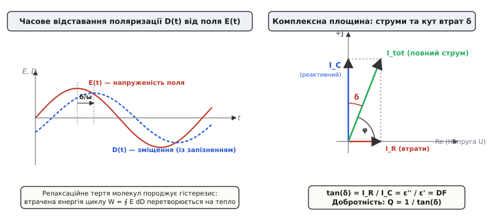
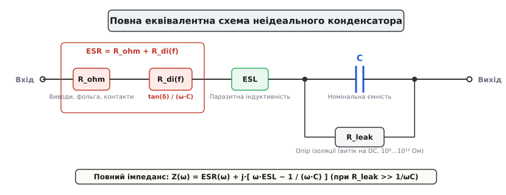
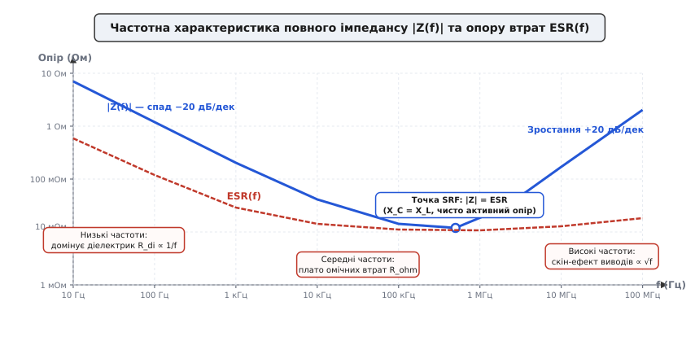
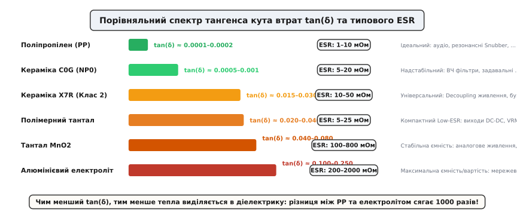
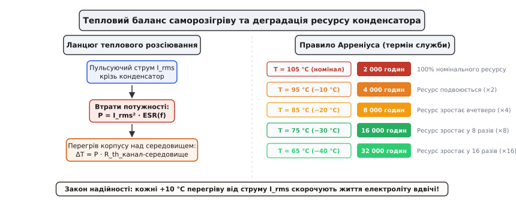

# Діелектричні втрати та еквівалентний послідовний опір (ESR)

<preknowlist>
- [Конденсатор](root:hw-components/capacitor) — що таке ємність, електричне поле та розділений заряд
- [Діелектрики конденсаторів](root:hw-components/capacitor-dielectrics) — класи діелектриків, відносна діелектрична проникність та стабільність
- [Паразитні параметри конденсатора](root:hw-components/capacitor-parasitics) — омічний опір виводів, індуктивність ESL та струм витоку
- [Реактивний опір](root:hw-components/reactance) — реактивний опір ємності та комплексний імпеданс змінного струму
- [Власна резонансна частота (SRF)](root:hw-components/self-resonant-frequency) — точка послідовного резонансу пасивних компонентів
- [Добротність Q](root:hw-analog/quality-factor) — співвідношення між збереженою та розсіяною енергією коливальної системи
- [Тепловий розгін транзистора](root:hw-components/thermal-runaway) — температурний коефіцієнт і саморозігрів напівпровідникових та пасивних структур
</preknowlist>

Розробник імпульсного понижувального перетворювача напруги (Buck Converter) потужністю 120 Вт і тактовою частотою 500 кГц обирає згладжувальний конденсатор для вихідного фільтра. За формулами ідеальної ємності для утримання амплітуди пульсацій напруги в межах 20 мВ при трикутному пульсуючому струмі розмахом 5 А достатньо конденсатора ємністю 470 мкФ на напругу 25 В. На плату встановлюють звичайний алюмінієвий електролітичний конденсатор загального призначення: за постійного струму його опір ізоляції перевищує сотні мегаом, струм витоку становить мізерні частки мікроампера, а розрахункова споживана потужність має дорівнювати нулю.

Проте за кілька хвилин роботи під повним навантаженням корпус конденсатора розігрівається вище +95 °C, електроліт закипає, гумова заглушка вигинається назовні, а амплітуда пульсацій напруги на виході сягає 450 мВ замість очікуваних 20 мВ. Спроба замінити деталь на інший тип такої ж ємності — суцільнополімерний алюмінієвий конденсатор або батарею багатошарової кераміки — кардинально змінює картину: температура корпусів ледь перевищує кімнатну (+32 °C), а вихідна напруга перетворювача стає ідеально чистою лінією з пульсаціями менше 8 мВ.

Причина цієї теплової та схемотехнічної катастрофи полягає в тому, що реальний конденсатор у колі змінного струму розсіює активну потужність через два фізичні механізми: внутрішнє молекулярне тертя в діелектрику під час його циклічної переполяризації (діелектричні втрати) та активний омічний опір металевих електродів, контактів і електроліту. Їхня сукупна дія на змінному струмі зводиться до єдиного критичного параметра — **еквівалентного послідовного опору** (*Equivalent Series Resistance*, ESR; від лат. *aequus* — рівний, лат. *valere* — вартувати, та лат. *resistere* — чинити опір).

---

### Фізична природа діелектричних втрат: поляризація та фазовий зсув

Діелектрик усередині конденсатора складається з атомів, іонів або полярних молекул, зв'язаних між собою силами міжатомної взаємодії. Під дією зовнішнього електричного поля `E` зв'язані електричні заряди зміщуються зі своїх рівноважних станів — виникає **поляризація** діелектрика.


*Фізичний механізм діелектричних втрат. Ліворуч: у змінному полі вектор електричного зміщення D(t) відстає від напруженості поля E(t) на кут діелектричних втрат δ через молекулярне тертя при переорієнтації диполів; площа петлі гістерезису W = ∮ E dD дорівнює енергії, розсіяній у тепло за один цикл. Праворуч: векторна діаграма струмів у комплексній площині, де активний струм втрат I_R випереджає напругу U, а відношення I_R / I_C визначає тангенс кута втрат tan(δ).*

У змінному електричному полі діють кілька мікроскопічних механізмів поляризації, кожен із яких має власний характерний час відгуку:

1. **Електронна поляризація**: Пружний зсув електронних оболонок відносно позитивно заряджених ядер атомів. Час встановлення становить `10⁻¹⁶…10⁻¹⁵` секунди. Оскільки цей процес суто пружний і не пов'язаний із переміщенням масивних ядер, втрати енергії в радіочастотному діапазоні практично відсутні (вони з'являються лише в ультрафіолетовій області спектра).
2. **Іонна поляризація**: Пружне зміщення протилежно заряджених іонів кристалічної ґратки (характерне для неорганічного скла та оксидів). Час встановлення — `10⁻¹⁴…10⁻¹³` секунди, втрати проявляються лише в інфрачервоному діапазоні.
3. **Дипольно-релаксаційна поляризація**: Орієнтація полярних молекул або молекулярних груп, що мають постійний дипольний момент (полімери, вода, рідкі електроліти), у напрямку прикладеного поля. Повороту молекул протидіє теплове хаотичне коливання та в'язке міжмолекулярне тертя. Час релаксації `τ` становить `10⁻¹¹…10⁻⁶` секунди, що потрапляє в робочий діапазон від сотень кілогерців до гігагерців.
4. **Іонно-релаксаційна поляризація**: Перескоки слабко зв'язаних іонів діелектрика між сусідніми потенціальними ямами крізь енергетичний бар'єр під дією змінного поля (типово для кераміки з дефектами ґратки).
5. **Міжповерхнева (міграційна) поляризація Максвелла-Вагнера**: Накопичення вільних носіїв заряду на межах неоднорідностей структури — межах зерен полікристалічної кераміки, поруватих шарах оксиду та межах метал-діелектрик. Характеризується великим часом релаксації (`10⁻³…10³` с) і проявляється на низьких частотах.

Коли частота зовнішнього поля `ω = 2·π·f` стає порівнянною зі швидкістю релаксаційних процесів (`ω ≈ 1/τ`), диполі більше не встигають миттєво повертатися вслід за вектором `E(t)`. Виникає фазове запізнення: вектор електричного зміщення `D(t)` відстає від напруженості поля `E(t)` на кут `δ`, який називають **кутом діелектричних втрат**:

```
E(t) = E_0 · cos(ω·t)
D(t) = D_0 · cos(ω·t - δ)
```

Через це фазове відставання залежність `D(E)` протягом періоду утворює замкнену еліптичну петлю — діелектричний гістерезис. Енергія, яка необоротно перетворюється на тепло в одиниці об'єму діелектрика за один цикл коливань, дорівнює площі цієї петлі:

```
w = ∮ E dD = π · E_0 · D_0 · sin(δ)
```

Ця енергія не повертається назад у джерело сигналу, а перетворюється на хаотичний тепловий рух атомів діелектрика, викликаючи його внутрішнє нагрівання.

---

### Комплексна проникність, тангенс кута втрат та добротність Q

Для математичного опису процесів накопичення та дисипації енергії відносну діелектричну проникність діелектрика представляють у комплексній формі:

```
ε*(ω) = ε'(ω) - j·ε''(ω)
```

де:
* `ε'(ω)` — дійсна частина діелектричної проникності, яка характеризує здатність матеріалу поляризуватися і визначає [електричну ємність](root:ph-electromagnetism/capacitance) конденсатора;
* `ε''(ω)` — уявна частина (фактор діелектричних втрат), яка описує інтенсивність дисипації енергії поля в тепло;
* `j = √(-1)` — уявна одиниця.

Відношення уявної частини комплексної проникності до її дійсної частини називають **тангенсом кута діелектричних втрат** (*Dissipation Factor*, DF, або `tan(δ)`):

```
tan(δ) = ε''(ω) / ε'(ω) = DF
```

На комплексній векторній діаграмі повний струм крізь діелектрик `I_tot` розкладається на дві ортогональні складові:
1. **Реактивний ємнісний струм** `I_C = ω · C · U`, спрямований по уявній осі `+j` (випереджає напругу на 90°);
2. **Активний струм втрат** `I_R`, спрямований по дійсній осі `Re` у фазі з напругою `U`.

З геометричного трикутника струмів безпосередньо випливає:

```
tan(δ) = I_R / I_C = P_активна / Q_реактивна
```

Фазовий кут між повним струмом і напругою становить `φ = 90° - δ`. Для високоякісних діелектриків кут втрат дуже малий (`δ << 1` рад), тому `sin(δ) ≈ tan(δ) ≈ δ`, а коефіцієнт потужності `cos(φ) = sin(δ) ≈ tan(δ)`.

Величиною, оберненою до тангенса кута втрат, є **добротність конденсатора** `Q` (*Quality Factor*):

```
Q = 1 / tan(δ) = ε'(ω) / ε''(ω)
```

Чим вища добротність `Q`, тим менша частка енергії розсіюється у вигляді тепла за період коливань. Для прецизійних радіочастотних конденсаторів (C0G, слюда, поліпропілен) добротність становить `Q > 1000…10000`, тоді як для електролітичних конденсаторів через значні втрати в рідкому сепараторі `Q` рідко перевищує `5…20`.

> 🧮 **Математичне виведення:** [Математична модель поляризації Дебая та комплексного імпедансу](root:hw-components/dielectric-losses/math-debye-relaxation.md). Аналітичне виведення частотної дисперсії `ε'(ω)` та `ε''(ω)` з диференціального рівняння релаксації, інтеграл енергії розсіювання та формули перерахунку між послідовною і паралельною моделями імпедансу.

---

### Повна еквівалентна схема неідеального конденсатора

Для інженерного розрахунку кіл реальний конденсатор замінюють схемою заміщення із зосередженими параметрами, яка відображає всі шляхи протікання та втрат енергії.


*Повна фізична еквівалентна схема реального конденсатора. Послідовний ланцюг містить номінальну ємність C, паразитну індуктивність ESL виводів і геометрії обкладок та сумарний активний опір ESR = R_ohm + R_di(f). Паралельно ємності увімкнено опір витоку діелектрика R_leak (R_p), який визначає саморозряд на постійному струмі.*

Схема містить такі базові елементи:
* `C` — номінальна фізична ємність, зумовлена геометрією обкладок та дійсною частиною діелектричної проникності `ε'`;
* `ESL` (*Equivalent Series Inductance*) — еквівалентна послідовна індуктивність просторової петлі струму крізь виводи та внутрішні шари фольги/металізації (від часток нГн у SMD-кераміці до десятків нГн у вивідних банках);
* `R_leak` (або `R_p`, `R_ins`) — паралельний опір ізоляції діелектрика на постійному струмі. Він зумовлений залишковою електронно-іонною провідністю ізолятора і визначає струм витоку `I_leak = U_DC / R_leak` та повільний [саморозряд конденсатора](root:hw-analog/rc-time-constant). Його значення зазвичай величезне (`10⁸…10¹²` Ом);
* `ESR` (*Equivalent Series Resistance*) — еквівалентний послідовний опір, який зосереджує в собі всі активні втрати енергії змінного струму.

Повний комплексний імпеданс конденсатора `Z(ω)` з урахуванням того, що на змінному струмі опір витоку набагато більший за реактивний опір ємності (`R_leak >> 1 / (ω·C)`), записується у вигляді:

```
Z(ω) = ESR(ω) + j · ( ω · ESL - 1 / (ω · C) )
```

Модуль повного імпедансу дорівнює:

```
|Z(ω)| = √( ESR²(ω) + (ω · ESL - 1 / (ω · C))² )
```

---

### Анатомія ESR: омічна та діелектрична складові

Найбільш підступною властивістю послідовного опору `ESR` є його складна залежність від частоти сигналу. На відміну від звичайного постійного резистора, величина `ESR(f)` не є сталою константою. Вона формується сумою двох фізично незалежних компонентів:

```
ESR(f) = R_ohm(f) + R_di(f)
```

#### 1. Омічна складова металізації та виводів (`R_ohm`)
Цей компонент визначається питомим електричним опором провідних частин конструкції:
* Металевих виводів, контактних площадок і паяних швів;
* Металізованих шарів напилення на плівці або внутрішніх електродів MLCC;
* Рідкого або твердополімерного електроліту в електролітичних конденсаторах.

На постійному струмі та низьких частотах `R_ohm` дорівнює статичному омічному опору `R_DC`. Проте на високих частотах (вище 1–10 МГц) глибина проникнення струму в провідник зменшується через [скін-ефект](root:hw-components/skin-effect) та ефект близькості електродів, через що омічний опір металу починає зростати пропорційно кореню з частоти:

```
R_ohm(f) = R_DC + k_skin · √f
```

#### 2. Частотно-залежна діелектрична складова (`R_di`)
Цей компонент є послідовним еквівалентом втрат на поляризацію самого ізоляційного матеріалу. Як доведено у вставці математичного виведення, зв'язок між тангенсом кута втрат діелектрика `tan(δ)` та послідовним опором втрат має вигляд:

```
R_di(f) = tan(δ) / (ω · C) = tan(δ) / (2 · π · f · C)
```

З цієї формули випливає фундаментальний закон: **діелектрична складова ESR обернено пропорційна частоті `f`**.
* На низьких частотах (50 Гц – 1 кГц) реактивний опір ємності `X_C = 1 / (ω·C)` величезний. Навіть при крихітному значенні `tan(δ) = 0.001` діелектричний опір `R_di` може становити кілька омів, повністю домінуючи над міліомами металевих виводів.
* У міру зростання частоти до сотень кілогерців та мегагерців доданок `1 / (ω·C)` стрімко прямує до нуля, внаслідок чого діелектричні втрати `R_di` падають нижче часток міліома.
* На високих частотах значення `ESR(f)` виходить на стабільне плато, яке визначається виключно омічним опором металу та електроліту `R_ohm`.

---

### Частотні характеристики імпедансу |Z(f)| та ESR(f)

Поведінка конденсатора у широкому діапазоні частот від звукових до гігагерцових демонструє характерну V-подібну криву повного імпедансу та нелінійний спад ESR.


*Частотні характеристики реального конденсатора. Синя суцільна крива — модуль повного імпедансу |Z(f)|, що демонструє спадну ємнісну ділянку (−20 дБ/дек), точку власного послідовного резонансу SRF (де реактивність обнуляється і |Z| = ESR) та висхідну індуктивну ділянку (+20 дБ/дек). Червона пунктирна лінія — графік ESR(f), де на низьких частотах переважають спадні діелектричні втрати R_di ∝ 1/f, у середній зоні — омічне плато R_ohm, а на ВЧ — підйом через скін-ефект.*

Частотну характеристику конденсатора поділяють на три характерні робочі зони:

#### 1. Ємнісна зона (`f < f_SRF`)
На частотах, значно нижчих за частоту власного резонансу, реактивний опір ємності `1 / (ω·C)` переважає індуктивний опір `ω·ESL`. На логарифмічній діаграмі модуль імпедансу спадає як пряма лінія з нахилом **−20 дБ на декаду** (при збільшенні частоти в 10 разів опір зменшується вдесятеро). Струм випереджає напругу на фазовий кут `φ ≈ −90° + δ`. Опір `ESR(f)` на цій ділянці монотонно зменшується разом зі спадом `R_di(f)`.

#### 2. Точка власного резонансу (`f = f_SRF`)
У міру збільшення частоти ємнісний опір `X_C` зменшується, а індуктивний опір `X_L = ω·ESL` лінійно росте. На частоті власного резонансу ([Self-Resonant Frequency, SRF](root:hw-components/self-resonant-frequency)) реактивності повністю врівноважують одна одну:

```
ω_SRF · ESL = 1 / (ω_SRF · C)
f_SRF = 1 / ( 2 · π · √(ESL · C) )
```

У точці резонансу сумарна реактивна частина імпедансу стає строго рівною нулю (`X = 0`), а фазовий зсув проходить через 0°. Модуль повного імпедансу конденсатора досягає свого абсолютного мінімуму і стає суто активним, дорівнюючи значенню послідовного опору втрат:

```
|Z(f_SRF)| = ESR(f_SRF)
```

#### 3. Індуктивна зона (`f > f_SRF`)
Вище точки SRF індуктивний опір виводів та внутрішніх шарів переважає над ємнісним: `ω·ESL > 1 / (ω·C)`. Конденсатор втрачає ємнісні властивості й перетворюється на звичайну котушку індуктивності з індуктивністю `ESL` та послідовним опором `ESR`. Модуль імпедансу починає лінійно зростати з нахилом **+20 дБ на декаду**, а фаза струму зміщується до `+90°`. На цих частотах `ESR` повільно зростає через прояв скін-ефекту у фользі та виводах.

> 🔧 **Навіщо це.** Якщо конденсатор використовується для фільтрації високочастотних завад чи пульсацій шини живлення, його максимальна ефективність шунтування досягається саме поблизу точки `f_SRF`, де імпеданс мінімальний і дорівнює `ESR`. Використовувати конденсатор далеко вище його SRF безглуздо: замість фільтрації він додає індуктивний опір у коло.

---

### Методи вимірювання ESR та тангенса втрат

Виміряти послідовний опір `ESR` звичайним цифровим мультиметром у режимі омметра принципово неможливо. Мультиметр подає постійну напругу, за якої конденсатор швидко заряджається і розриває коло, показуючи нескінченний опір ізоляції `R_leak`.

Для точного вимірювання `ESR(f)` та `tan(δ)` застосовують спеціалізовані радіовимірювальні методи:

1. **Чотирипровідний міст змінного струму (Kelvin 4-Wire LCR Bridge)**:
   Прилад підключає дві пари екранованих коаксіальних кабелів безпосередньо до виводів конденсатора (Force+ / Sense+ та Force− / Sense−). Генератор подає тестовий синусоїдальний сигнал каліброваної частоти (100 Гц, 1 кГц, 10 кГц, 100 кГц або 1 МГц) та амплітуди (зазвичай 0.5–1.0 В RMS). Вхідні підсилювачі вимірюють падіння напруги `U(t)` та струм `I(t)` з фазочутливим детектуванням, обчислюючи дійсну частину імпедансу `Re(Z) = ESR` та відношення `tan(δ) = Re(Z) / |Im(Z)|`. Чотирипровідна схема повністю виключає опір тестових дротів та перехідний опір контактних затискачів.

2. **Імпульсний метод для внутрішньосхемної діагностики (In-Circuit ESR Meter)**:
   Прилад формує короткі прямокутні імпульси струму частотою 100 кГц з амплітудою напруги менше 0.3 В. Низька амплітуда гарантує, що кремнієві p-n переходи напівпровідникових діодів та транзисторів на друкованій платі не відкриються. Реактивний опір ємності на частоті 100 кГц становить соті частки ома, тому виміряне амплітудне падіння напруги на конденсаторі з високою точністю пропорційне внутрішньому `ESR`.

3. **ВЧ метод шунтування (Shunt-Thru S21) на векторному аналізаторі кіл (VNA)**:
   Для вимірювання наднизьких опорів (менше 10 мОм) на частотах від 100 кГц до 3 ГГц конденсатор монтують паралельно узгодженій 50-омній мікросмужковій лінії між портом 1 та портом 2 аналізатора. Вимірявши коефіцієнт передачі `S21(f)`, обчислюють імпеданс: `Z(f) = 25 · S21 / (1 - S21)`.

---

### Діелектрична абсорбція (Dielectric Soakage)

Явище **діелектричної абсорбції** (ефект пам'яті заряду, або *Dielectric Soakage*) полягає в тому, що після повного короткочасного розряджання конденсатора накоротко на його виводах через деякий час спонтанно з'являється залишковий потенціал.

Фізична причина абсорбції полягає в наявності глибоких потенціальних ям та дефектів у кристалічній чи аморфній структурі діелектрика. Під дією постійної напруги носії заряду повільно дрейфують углиб матеріалу і захоплюються цими пастками (повільна поляризація з часом релаксації від секунд до годин). Під час швидкого замикання виводів накоротко встигає стекти лише вільний заряд із поверхні металевих обкладок. Після розмикання замкнутого кола захоплені в пастках заряди повільно дифундують назад до електродів, створюючи на них відновлену напругу, яка може становити від 0.01% до 15% від початкової робочої напруги.

Коефіцієнт діелектричної абсорбції (DA) критично важливий у таких вузлах:
* **Пристрої вибірки та зберігання (Sample-and-Hold)** у швидкодіючих АЦП: абсорбція викликає похибку збереженого значення напруги в часі;
* **Аналогові інтегратори та прецизійні таймери**: спричиняє спотворення форми сигналу та нелінійність пилкоподібної напруги;
* **Високовольтні фільтри**: конденсатор на 400 В після розряджання може самостійно відновити напругу до 20–40 В, що створює серйозну загрозу ураження електричним струмом для сервісного персоналу (вимагає постійного шунтування розрядним резистором Bleeder).

Найменшу діелектричну абсорбцію мають тефлон (PTFE, `< 0.01%`), поліпропілен (PP, `0.02%`) та кераміка C0G (`< 0.05%`), тоді як рідкі електроліти мають DA до 10–15%.

---

### Порівняльний аналіз діелектриків

Вибір типу конденсатора завжди є пошуком інженерного компромісу між рівнем втрат `tan(δ)`, мінімальним `ESR`, стабільністю параметрів та габаритною питомою ємністю.


*Порівняльний спектр тангенса кута втрат tan(δ) та типового опору ESR для різних класів діелектриків. Поліпропілен та кераміка C0G демонструють мінімальні втрати енергії (tan δ < 0.001), кераміка X7R та полімерні тантали займають проміжне положення, а традиційні рідкі алюмінієві електроліти мають найвищий рівень втрат (tan δ до 0.25).*

#### Поліпропілен (PP, MKP)
* **Тангенс втрат**: `tan(δ) ≈ 0.0001…0.0002` (0.01%–0.02%);
* **ESR**: Наднизький (1–10 мОм на частотах 100 кГц);
* **Особливості**: Відсутність діелектричної абсорбції, здатність працювати за напруг у кіловольти та витримувати імпульсні струми у сотні ампер. Недолік — великі габарити корпусу через низьку проникність `ε_r ≈ 2.2`.

#### Кераміка Класу 1 (C0G / NP0)
* **Тангенс втрат**: `tan(δ) ≈ 0.0005…0.0010` (0.05%–0.10%);
* **Добротність**: `Q > 1000…2000` на 1 МГц;
* **Особливості**: Повна стабільність ємності у діапазоні температур (−55…+125 °C), відсутність падіння ємності під напругою (DC-bias) та відсутність п'єзоелектричного шуму. Номінали обмежені одиницями нанофарад.

#### Кераміка Класу 2 (X7R, X5R)
* **Тангенс втрат**: `tan(δ) ≈ 0.015…0.035` (1.5%–3.5%);
* **ESR**: Дуже низький (5–30 мОм на 1 МГц);
* **Особливості**: Сегнетоелектрична доменна поляризація дає високу проникність (`ε_r ≈ 2000`), що дозволяє отримувати ємності до 100 мкФ у крихітних SMD-корпусах. Розплата — суттєвий DC-bias ефект (втрата до 60–80% ємності під напругою) та наявність п'єзоелектричного ефекту.

#### Танталові електролітичні конденсатори (Ta-MnO₂ та Polymer Tantalum)
* **Традиційні Ta-MnO₂**: `tan(δ) ≈ 0.04…0.08`, типовий ESR становить 0.1–1.0 Ом. Мають стабільну ємність, але високий опір діоксиду марганцю обмежує струм пульсацій. При пробої схильні до загоряння через виділення кисню з `MnO_2`.
* **Полімерний тантал (Polymer Ta)**: Заміна `MnO_2` на провідний органічний полімер (PEDOT:PSS) знижує ESR до 5–25 мОм і покращує `tan(δ)` до 0.02–0.03. Повністю безпечні (не горять) і широко застосовуються для живлення процесорів.

#### Алюмінієві електролітичні конденсатори (Wet vs Solid Polymer)
* **Рідкі електроліти (Wet Al)**: `tan(δ) ≈ 0.10…0.25` (10%–25%), ESR становить 0.2–2.0 Ом. Забезпечують максимальну ємність за мінімальну ціну, проте страждають від поступового висихання розчинника та різкого стрибка ESR у 50 разів на морозі.
* **Суцільнополімерні алюмінієві (Solid Polymer Al)**: Використання твердого полімеру знижує ESR до 2–15 мОм і розширює температурний діапазон до −55 °C без зростання опору.

> 🔌 **Порівняльна вставка:** [Порівняння діелектриків за ESR, tan(δ) та частотною поведінкою](root:hw-components/dielectric-losses/comp-dielectrics-esr.md). Детальна класифікація технологій діелектриків, таблиці параметрів, аналіз механізмів відмов та інженерні дерева рішень для вибору типу конденсатора під силові, аналогові й цифрові задачі.

---

### Теплові ефекти, нагрів та допустимий пульсуючий струм (Ripple Current)

Коли крізь конденсатор протікає змінний струм заряду-розряду з діючим значенням `I_rms` (пульсуючий струм, *Ripple Current*), на його внутрішньому активному опорі `ESR` виділяється теплова потужність Джоуля-Ленца:

```
P_loss = I_rms² · ESR(f)
```

Якщо струм має складну несинусоїдальну форму (наприклад, трикутний струм дроселя або прямокутні імпульси ключів в імпульсних блоках живлення), повні теплові втрати розраховують як суму потужностей, що виділяються кожною спектральною гармонікою струму `I_k_rms` на відповідній частоті `f_k`:

```
P_total = ∑ [ I_k_rms² · ESR(f_k) ]
```


*Тепловий баланс саморозігріву та закон деградації ресурсу. Ліворуч: виділена теплова потужність P = I_rms² · ESR нагріває внутрішній сердечник конденсатора на величину ΔT = P · R_th відносно температури навколишнього середовища. Праворуч: закон Арреніуса для рідких електролітичних конденсаторів — кожні 10 °C додаткового нагріву скорочують термін служби компонента рівно вдвічі.*

У стаціонарному тепловому режимі температура всередині корпусу конденсатора `T_core` встановлюється вищою за температуру навколишнього середовища `T_ambient` на величину перегріву `ΔT`:

```
ΔT = T_core - T_ambient = P_total · R_th
```

де `R_th` — повний тепловий опір між внутрішнім сердечником конденсатора та навколишнім повітрям (°C/Вт), який залежить від площі корпусу, матеріалу гільзи та швидкості обдуву.

#### Граничний пульсуючий струм (Ripple Current Rating)
У документації (даташитах) виробники завжди нормують гранично допустиме діюче значення пульсуючого струму `I_ripple_max` (зазвичай для частоти 100 кГц або 100/120 Гц за максимальної робочої температури, наприклад, +105 °C). Цей ліміт обирається таким чином, щоб внутрішній саморозігрів `ΔT` не перевищував допустимих меж:
* Для рідких алюмінієвих електролітів: `ΔT_max ≈ 5…10 °C`;
* Для суцільнополімерних конденсаторів: `ΔT_max ≈ 15…20 °C`;
* Для плівкових поліпропіленових конденсаторів: `ΔT_max ≈ 10…15 °C`.

Якщо пульсації струму відбуваються на низькій частоті (наприклад, 100 Гц після діодного моста), де `ESR` вищий через діелектричні втрати `R_di`, допустимий струм зменшують за допомогою частотного поправочного коефіцієнта `K_f`:

```
I_ripple_allowed(f) = I_ripple_max(100кГц) · K_f
K_f = √( ESR(100 кГц) / ESR(f) )
```

#### Закон Арреніуса та деградація ресурсу
Для рідких електролітичних конденсаторів швидкість випаровування та хімічної деградації електроліту підпорядковується закону хімічної кінетики Сванте Арреніуса. На практиці це формулює **емпіричне правило 10 градусів**:

```
L = L_0 · 2^( (T_max - T_core) / 10 °C )
```

де:
* `L` — очікуваний термін служби за фактичної температури сердечника `T_core` (годин);
* `L_0` — паспортний номінальний ресурс за максимальної робочої температури `T_max` (типово 2 000 – 5 000 годин за +105 °C).

Кожні додаткові **+10 °C перегріву** через надмірний пульсуючий струм `I_rms` скорочують термін експлуатації електролітичного конденсатора **вдвічі**. І навпаки: зниження робочої температури на 20 °C за рахунок вибору конденсатора з меншим ESR подовжує термін його служби в 4 рази.

---

### Практичний приклад: розрахунок втрат та нагріву конденсатора

**Постановка задачі.**
У вихідному фільтрі імпульсного стабілізатора з частотою комутації 200 кГц діюче значення пульсуючого струму становить `I_rms = 3.0 А`. Температура повітря всередині корпусу приладу `T_ambient = +50 °C`.

Порівняємо два варіанти конденсаторів ємністю 470 мкФ на напругу 25 В у стандартному алюмінієвому корпусі діаметром 10 мм і висотою 16 мм (тепловий опір корпусу до повітря без обдуву `R_th = 45 °C/Вт`, паспортний ресурс `L_0 = 2000` годин за `T_max = +105 °C`):
1. Стандартний рідкий електроліт загального призначення: `ESR(200 кГц) = 0.25 Ом`;
2. Сучасний суцільнополімерний алюмінієвий конденсатор (Solid Polymer): `ESR(200 кГц) = 0.012 Ом` (12 мОм).

**Розрахунок для стандартного електроліту (Варіант 1):**

```
P_loss = I_rms² · ESR = (3.0 А)² · 0.25 Ом
       = 9.0 · 0.25 = 2.25 Вт                  [потужність теплових втрат]

ΔT = P_loss · R_th = 2.25 Вт · 45 °C/Вт
   = 101.25 °C                                 [перегрів корпусу]

T_core = T_ambient + ΔT = 50 °C + 101.25 °C
       = 151.25 °C                             [температура сердечника]
```

*Висновки для варіанта 1*: Температура сердечника +151 °C значно перевищує максимальну паспортну межу +105 °C і температуру кипіння рідкого електроліту. Конденсатор закипить, роздується та зруйнується протягом лічених годин (або хвилин) роботи.

**Розрахунок для полімерного конденсатора (Варіант 2):**

```
P_loss = I_rms² · ESR = (3.0 А)² · 0.012 Ом
       = 9.0 · 0.012 = 0.108 Вт = 108 мВт      [потужність теплових втрат]

ΔT = P_loss · R_th = 0.108 Вт · 45 °C/Вт
   = 4.86 °C ≈ 5 °C                            [перегрів корпусу]

T_core = T_ambient + ΔT = 50 °C + 4.86 °C
       = 54.86 °C ≈ 55 °C                      [температура сердечника]
```

Розрахуємо очікуваний термін служби полімерного конденсатора за температури +55 °C:

```
L = L_0 · 2^( (105 °C - 55 °C) / 10 °C )
  = 2000 год · 2^5 = 2000 · 32 = 64 000 годин (понад 7 років безперервної роботи)
```

Цей числовий розрахунок наочно демонструє, чому заміна діелектричної системи та зниження `ESR` з 250 мОм до 12 мОм є не косметичною оптимізацією, а критичною умовою фізичної працездатності та надійності схеми.

---

### Схемотехнічні прийоми та правила проектування

1. **Паралельне з'єднання конденсаторів різного типу (Bulk + Decoupling)**:
   Для одночасного забезпечення великої енергоємності на низьких частотах та мінімального імпедансу на високих частотах паралельно встановлюють електролітичний або танталовий конденсатор великої ємності (`100…470 мкФ`) та керамічні чіп-конденсатори MLCC (`0.1…1 мкФ`).
   *Пастка*: Паразитна індуктивність `ESL` великого конденсатора разом із ємністю керамічного чіпа утворюють паралельний коливальний контур, який може створити високоомний **пік антирезонансу** на проміжній частоті. Для демпфування цього піку послідовний опір `ESR` великого конденсатора має бути ненульовим (зазвичай 20–50 мОм) або паралельно встановлюють резистор демпфування.

2. **Мінімізація індуктивності монтажу для реалізації низького ESR**:
   Наднизький `ESR` керамічного чіпа (наприклад, 5 мОм) втрачає сенс, якщо доріжки на друкованій платі від конденсатора до виводів мікросхеми додають 2 нГн індуктивності (`X_L ≈ 1.25 Ом` на 100 МГц) та 20 мОм омічного опору міді. Конденсатори розв'язки мають встановлюватися впритул до виводів живлення з найкоротшими широкими полігонами та перехідними отворами безпосередньо в опорні шари землі (GND) та живлення (VCC).

3. **Дератинг за напругою, струмом і температурою**:
   * Для кераміки X7R/X5R робоча напруга не повинна перевищувати 50–60% від номінальної, щоб зберегти принаймні половину номінальної ємності в умовах дії постійного зміщення (DC-bias);
   * Для танталових конденсаторів із діоксидом марганцю (`MnO_2`) обов'язковий запас за напругою становить не менше 50% (робота за напруги не більше половини номіналу) для запобігання тепловому пробою від кидків струму;
   * Для електролітичних конденсаторів діючий пульсуючий струм `I_rms` повинен складати не більше 70–80% від паспортного ліміту `I_ripple_max`.

Підсумовуючи, еквівалентний послідовний опір `ESR` та діелектричні втрати `tan(δ)` є визначальними фізичними параметрами, які перетворюють абстрактну теоретичну ємність на реальний електронний компонент із суворими обмеженнями за частотою, струмом, тепловиділенням та ресурсом надійності.