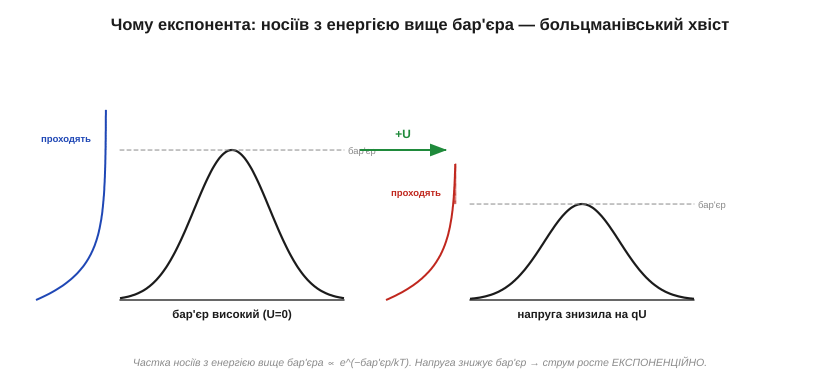
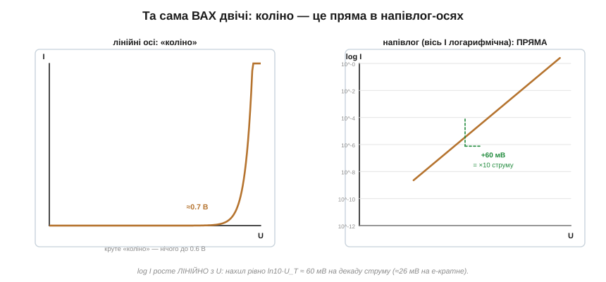
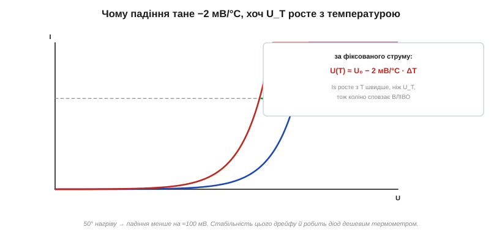

# 🧮 Рівняння Шоклі: звідки експонента й чому «0.7 В» — не константа

> [Вольт-амперна характеристика діода](topic:hw-components/diode-iv-curve) тримається на формулі Шоклі, а з неї випливають два інженерні правила напам'ять — «60 мВ на декаду струму» і «−2 мВ на градус». Тут ми **виведемо** експоненту з фізики бар'єра, з'ясуємо, звідки в ній береться загадкове число 26 мВ, і розплутаємо парадокс: чому пряме падіння **тане** з нагрівом, хоча головна стала рівняння з температурою якраз **росте**.

### Звідки взагалі експонента

В основі лежить [PN-перехід](topic:ph-condensed/pn-junction): носіям, щоб перейти через межу, треба здолати потенціальний бар'єр. А скільки носіїв на це здатні? Тут вступає головний закон теплової фізики — **больцманівський розподіл**: частка частинок, що мають енергію щонайменше E, спадає експоненційно, як e^(−E/kT), де k — стала Больцмана, T — абсолютна температура. Хвіст розподілу: чим вищий бар'єр відносно теплової енергії kT, тим експоненційно менше носіїв його перестрибують.


*Струм несуть лише носії з «хвоста» розподілу — ті, чия теплова енергія вища за бар'єр. Пряма напруга знижує бар'єр на величину qU, і над ним опиняється експоненційно більший шматок хвоста. Звідси й уся форма ВАХ.*

Тепер прикладемо пряму напругу U. Вона **знижує** бар'єр рівно на енергію qU (заряд q, помножений на напругу). Над зниженим бар'єром опиняється частка носіїв ∝ e^(−(бар'єр − qU)/kT) = e^(−бар'єр/kT) · e^(qU/kT). Перший множник — це сталий струмок за нульової напруги, другий — наш «підсилювач». Так народжується рівняння **Шоклі** (Вільям Шоклі вивів його 1949 року, описуючи свіжовинайдений перехід):

```
I = Is · (e^(qU/kT) − 1)
```

**Is** — зворотний струм насичення (той самий крихітний витік неосновних носіїв за [зворотного зміщення](topic:hw-components/diode-bias)). Член **−1** важить лише за малих і зворотних напруг: при зворотній U великий від'ємний показник робить експоненту нулем, лишається I ≈ −Is (той самий мізерний витік); а вже за кількох десятків мілівольтів уперед експонента така велика, що −1 можна викинути.

### Тепловий потенціал: звідки 26 мВ

Комбінація kT/q трапляється так часто, що дістала власне ім'я — **тепловий потенціал** U_T:

```
U_T = kT/q ≈ (1.38×10⁻²³ · 300) / (1.6×10⁻¹⁹) ≈ 0.0259 В ≈ 26 мВ   (за 300 К)
```

Це не якась властивість кремнію — це просто теплова енергія, виражена у вольтах, однакова для будь-якого переходу за кімнатної температури. Перепишемо рівняння через нього компактніше, додавши **коефіцієнт ідеальності** n (про нього за хвилину):

```
I = Is · (e^(U/(n·U_T)) − 1)
```

### Звідки «60 мВ на декаду»

Тепер виведемо обидва правила теми. Перше — наскільки треба підняти напругу, щоб струм зріс **удесятеро**. Розв'язуємо e^(ΔU/U_T) = 10:

```
ΔU = U_T · ln 10 ≈ 0.0259 · 2.303 ≈ 0.0595 В ≈ 60 мВ   (для n = 1)
```

Ось і знамениті «60 мВ на декаду». А щоб струм зріс просто в e ≈ 2.72 раза, досить підняти напругу рівно на один U_T ≈ 26 мВ. Найнаочніше це видно, якщо ту саму ВАХ перемалювати в напівлогарифмічних осях:


*У лінійних осях експонента виглядає як різке «коліно». Прологарифмуємо вісь струму — і крива випрямляється в ідеальну пряму: log I = log Is + U/(n·U_T·ln10). Нахил цієї прямої — рівно 60 мВ/декаду, і вимірявши його, інженери визначають коефіцієнт n.*

### Зворотний погляд: чому «0.7 В» майже стале

На крутій гілці ВАХ напруга майже не залежить від струму. Видно чому, якщо обернути рівняння Шоклі, виразивши U через I:

```
U = n·U_T · ln(I / Is)
```

Напруга залежить від струму **логарифмічно** — а логарифм найповільніша функція в інженерії. Збільште струм у сто разів — напруга підросте лише на n·U_T·ln(100) = n·2·60 мВ ≈ 120–240 мВ (залежно від n). Саме тому пряме падіння так зручно вважати «сталими 0.7 В»: стократна зміна струму ворушить його лише на десяту частку вольта. Той самий логарифм пояснює, чому послідовні діоди додають свої падіння майже точно, а маленькі сигнальні діоди мають нижче коліно за потужні (різний Is).

Кілька слів про **n** — коефіцієнт ідеальності (*ideality factor*). У досконалому переході n = 1; у реальному домішуються інші механізми (рекомбінація в збідненій зоні), і n повзе до 2 — а з ним і ціна «декади»: не 60, а до ~120 мВ. Світлодіоди й діоди на малих струмах часто мають n більше за одиницю.

### Парадокс температури

Найцікавіше — правило «−2 мВ/°C». Здавалося б, парадокс: у формулі U = n·U_T·ln(I/Is) головна стала U_T = kT/q **прямо пропорційна** температурі — отже, з нагрівом напруга мала б **рости**. А на практиці пряме падіння **падає**. Хто перемагає?

Розгадка в Is. Зворотний струм насичення залежить від концентрації власних носіїв, а та злітає з температурою страшенно швидко — приблизно як e^(−Eg/kT), де Eg — енергетична щілина [напівпровідника](topic:ph-condensed/semiconductor). Тобто Is росте з нагрівом **експоненційно** — куди агресивніше, ніж лінійний U_T. А Is сидить у знаменнику логарифма: що більший Is, то менший ln(I/Is) за того самого робочого струму. Цей спад переважує повільне зростання U_T — і результат від'ємний:


*За фіксованого струму гаряча ВАХ (75 °C) лежить лівіше холодної (25 °C): щоб провести той самий струм, гарячому діоду треба МЕНШЕ напруги. Сумарний дрейф ≈ −2 мВ на градус — настільки лінійний і повторюваний, що з нього роблять термометр.*

Підставивши температурні залежності всіх членів, для кремнію за робочих струмів виходить близько **−2 мВ/°C**. І ось чим ця цифра цінна: цей дрейф напрочуд **лінійний і стабільний** від екземпляра до екземпляра. Тому пряме падіння каліброваного переходу — готовий датчик температури: виміряв напругу за сталого струму, відняв, поділив на 2 мВ — маєш градуси. Саме так міряють свою температуру процесори й сила-силенна мікросхем; той самий принцип (різниця падінь двох переходів) лежить і в основі точних [джерел опорної напруги](topic:hw-sensing/voltage-reference).

### Чому це важить

Рівняння Шоклі — фундамент під половиною напівпровідникової електроніки. Експонента пояснює і «коліно» [ВАХ](topic:hw-components/diode-iv-curve), і чому діод нав'язує напругу, а струм йому диктує коло; −2 мВ/°C — це і діод-термометр, і клопіт температурної стабільності схем; та сама логарифмічна U(I) працює й тоді, коли керованим стає перехід усередині [транзистора](topic:hw-components/bjt-operation). Головний урок: за зручною константою «0.7 В» ховається жива експонента з теплової фізики — варто лише розхитати її температурою чи струмом, як вона нагадає про себе.
